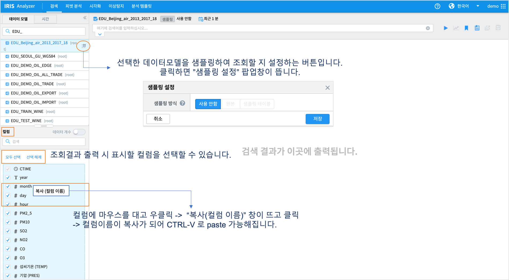
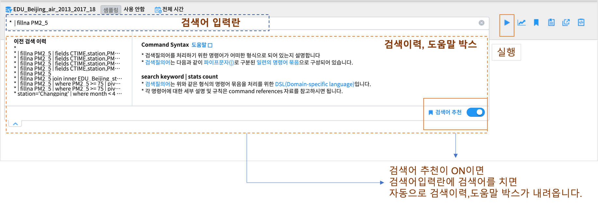
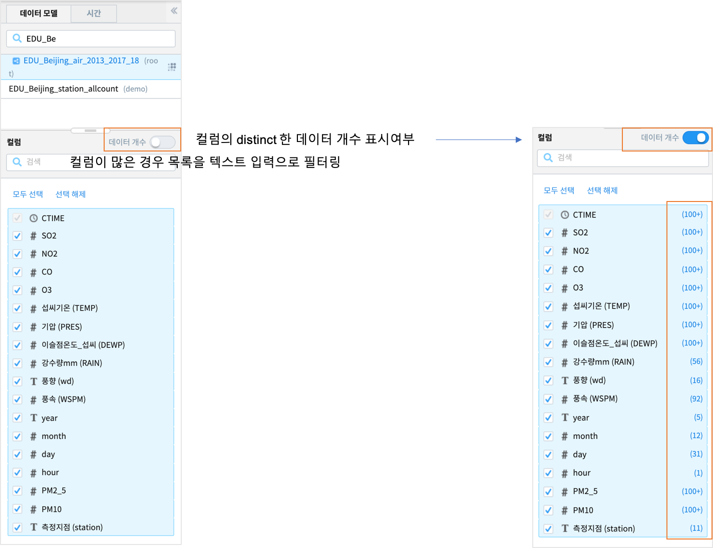
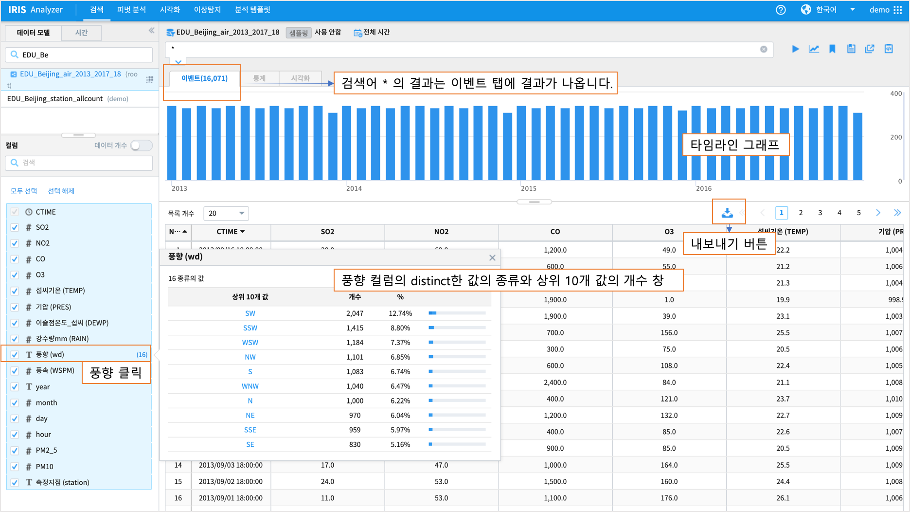
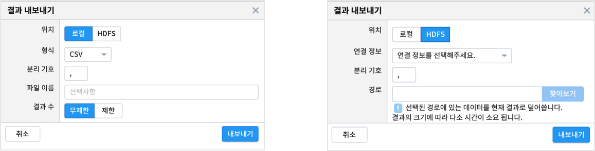
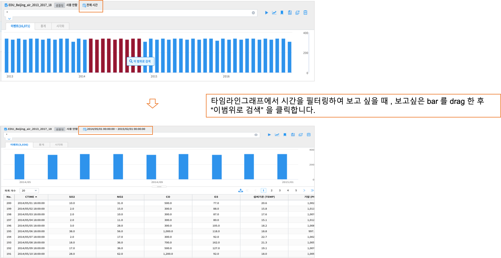
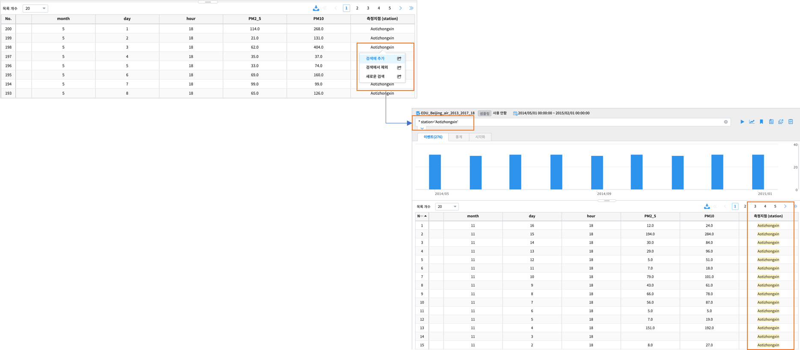
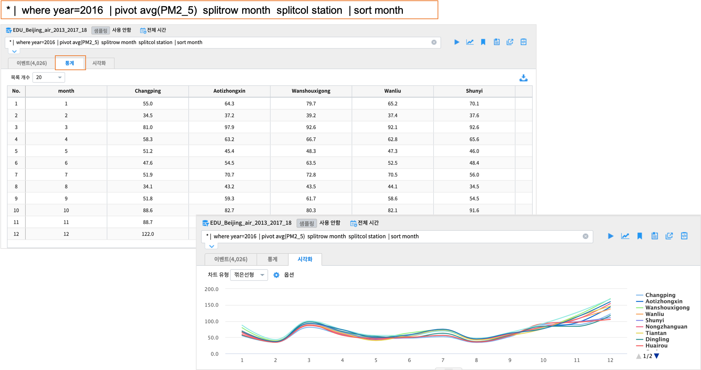
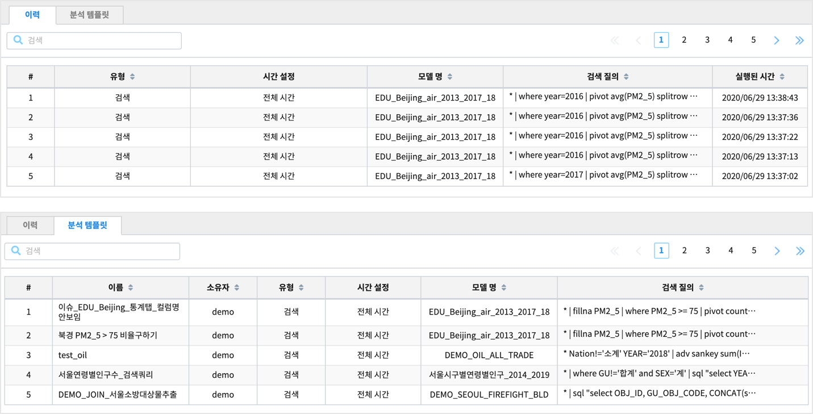
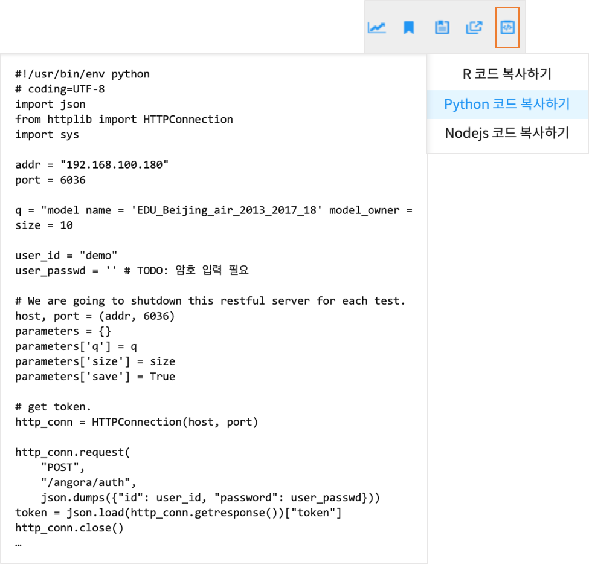

검색
========================================

검색 화면 개요
----------------------------------------

| 검색화면의 데이터는 데이터모델을 대상으로 합니다.
| DBMS, ObjectStorage, HDFS 등 다양한 데이터소스로부터 생성한 데이터모델을 선택하고, 
| 조회할 검색 시간을 설정한 후에 
| IRIS Discovery-Service 명령어를 통해 필터링, 변환, 피버팅, 통계, 간단한 기계 학습 기능 등을 수행 할 수 있습니다.
| 검색 메뉴는 데이터에 대한 탐색적 데이터 분석(Exploratory Data Analysis)에 유용한 메뉴입니다. 
|
| 또한 실행된 결과를 파일로 내보내기 를 하거나
| 시각화/ 피벗분석 등 Analyzer 의 다른 메뉴로 바로 이동이 가능합니다.

.. image:: ./images/ko/search-main.png
    :scale: 60%

.. csv-table::
    :header: 번호, 구분, 설명
    :widths: 5, 40, 130

    "1", "모델/시간 설정", "검색하고자 하는 데이터 모델과 데이터의 검색 기간을 설정합니다."
    "2", "컬럼 목록",  "선택한 데이터 모델의 컬럼들을 표시,표시여부를 선택합니다."
    "3", "검색 바",  "검색어를 입력하는 입력란과 부가기능(이동,분석탬플릿저장,불러오기,새탭에서 열기 등)버튼 컨트롤"
    "4", "결과 화면",  "검색 조건에 따른 검색 결과를 출력하는 영역"
    

데이터모델 및 시간, 샘플링 설정
--------------------------------------------------------------------------------

| 먼저 검색할 데이터 모델과 샘플링 여부, 데이터 조회 시간을 설정합니다.
| 데이터모델을 설정하면 실행 버튼을 클릭하기 전이라도 **컬럼** pane 에 해당 데이터모델의 컬럼이 표시됩니다.
| 검색명령어 실행 전이기 때문에 컬럼 pane 에서는 컬럼의 표시 여부를 체크하는 것만 가능합니다.
|
| 샘플링 기능은 대량의 원본 데이터 테이블을 조회하지 않기 위한 기능입니다. 
| 샘플링 설정을 하게 되면 샘플링 테이블을 이용하여 조회작업을 수행하여 검색의 효율이 높아지는 효과가 있습니다. 
| 단, 모든 데이터를 검색하는 것이 아니므로 원본 데이터의 검색결과에 비해 속도는 높아지나 신뢰도는 떨어지는 단점이 있습니다. 

.. csv-table::
    :header:  구분, 설명
    :widths:  40, 130

    "사용안함",  "샘플링 기능 사용하지 않고 원본 테이블 대상으로 조회"
    "원본", "설정한 샘플링 비율을 바탕으로 샘플링 적용한 결과 반환"
    "샘플링 테이블", "샘플링 테이블을 대상으로 조회"
 

검색어 입력
----------------------------------------

| 데이터 모델 선택, 검색 기간 설정 후에는 적절한 검색어를 검색어창에 입력하여 데이터를 조회합니다. 
| 검색어는 직접 입력하거나 이전 검색이력 및 도움말 창의 도움을 받아 입력할 수 있습니다.

검색어 입력 및 이전검색 이력, 도움말 창
~~~~~~~~~~~~~~~~~~~~~~~~~~~~~~~~~~~~~~~~~~~~~~~~~~~~~~~~~~~~~~~~~~~~~~~~~~~~

| 검색어 추천 기능을 켜두면, 이전검색이력,도움말 창이 내려옵니다.
| 검색어 문법이나 명령어를 작성하는 방법에 대해서는 `Command References <http://docs.iris.tools/manual/IRIS-Manual/IRIS-Discovery-Middleware/command/index.html>`__ 를 참고하시기 바랍니다.
| 이전 검색 이력은 키보드 위, 아래 키나 마우스 클릭으로 선택할 수 있으며, 선택하면 바로 입력란에 이전 검색 내용이 입력됩니다. 
| 검색어 추천 창이 자동으로 나타나는 것을 원하지 않는다면 검색어 추천 버튼을 클릭하여 off 상태로 만들면 됩니다.

검색 결과 분석
-------------------------------------------

| 검색 결과는 검색 조건에 따라 이벤트, 통계, 시각화 등 3개의 tab으로 구분되며, 각 탭의 상세한 내용을 아래에 기술하였습니다. 
| **이벤트 탭** 은 모든 검색 시 이벤트 리스트가 기본적으로 출력되는 탭이며, 
| **통계 탭** 과 **시각화 탭** 은 검색어에 stats, pivot 등 통계 결과를 얻는 명령어를 사용하여 검색할 경우에만 표시됩니다.

컬럼
~~~~~~~~~~~~~~~~~~~~~~~~~~~~~~~~~~~~~~

| 컬럼 pane 에서는 검색어 결과에 출력할 컬럼을 선택할 수 있습니다.
| 컬럼을 클릭하면 상위 10개 값의 분포를 볼 수 있습니다.
| 데이터개수를 ON 으로 켜고 검색어를 실행하면 검색결과에서 각 컬럼의 distinct 한 데이터의 개수를 표시해 줍니다.
| 데이터가 많은 경우에는 서버 자원을 많이 사용하므로 OFF로 해 두고, 필요한 컬럼에 한해 클릭하여 컬럼의 분포를 보도록 권장합니다.

이벤트
~~~~~~~~~~~~~~~~~~~~~~~~~~~~~~~~~~~~~~~~~~~~~~~~~~~~~~~~~~~~~~~~~~~~~~~~~~~~

| 이벤트 탭은 검색 실행 결과를 보여주는 기본 탭으로 타임라인그래프와 검색결과 그리드로 보여줍니다.
| 또한 검색 명령어를 실행한 후에는 컬럼 pane 에서 컬럼을 클릭하면 해당 컬럼의 상위 10개 값의 분포를 같이 볼 수 있습니다.

| 검색 결과 그리드의 내용은 **내보내기** 버튼을 클릭하여 로컬PC 또는 HDFS 에 파일 형태로 저장할 수 있습니다.
| 로컬 PC 에 저장하는 파일 포맷은 CSV/TSV/JSON 가 가능합니다.
| HDFS 에 저장할 때는 연결 정보를 설정하고, 디렉토리 path 를 지정한 후에 구분자를 입력하여 파일로 저장할 수 있습니다.
| 콤마가 디폴트 구분자이며, tab(\t) 구분자, '|' 등의 구분자 등 다양한 구분자를 설정할 수 있습니다.

| 타임라인 그래프에서 시간범위를 지정해서 재검색을 실행할 수 있습니다. bar를 커서로 밀어서 색이 변하면 우클릭하여 "이범위로 검색" 을 클릭합니다.

| 검색결과 그리드에서 특정 셀의 값을 클릭하여 필터링할 수 있습니다. 클릭한 내용대로 검색어에 입력되어 실행됩니다.

- **검색에 추가**: 현재 검색 조건에 "station='Aotizhongxin'" 이 자동으로 추가되어 재검색 결과가 화면에 출력됩니다.
- **검색에서 제외**: 현재 검색 조건에 "station!='Aotizhongxin'" 이 자동으로 추가되어 재검색 결과가 화면에 출력됩니다..
- **새로운 검색**: 기존 검색과 무관하게 다른 컬럼을 선택하여 재검색을 수행하고자 할 경우에 사용할 수 있습니다. 

통계 및 시각화
~~~~~~~~~~~~~~~~~~~~~~~~~~~~~~~~~~~~~~

| 통계 탭과 시각화 탭은 stats, pivot 등의 통계 데이터를 생성하는 검샥어를 실행했을 경우에만 활성화됩니다.
| 통계 탭에서는 stats, pivot 등의 명령어 결과를 그리드 뷰로 보여주며, 시각화 탭에서는 이 결과를 차트로 보여줍니다. 
| 또한 차트 유형을 변경하여 같은 데이터를 꺾은선형, 막대형, 원형 등의 다른 차트로 살펴보거나, 옵션 다이얼로그를 통해 x/y축 레이블, 데이터 값 표시 여부 등 차트의 스타일을 변경할 수도 있습니다.
| 챠트의 제한적인 기능에 대해서는 계속 보완 예정입니다.

부가 기능 
----------------------------------------

| 데이터 브라우저에는 사용자의 작업을 돕는 부가기능이 준비되어 있습니다. 

.. image:: ./images/ko/search_buttons.png

.. csv-table::
    :header:  번호, 구분, 설명
    :widths:  10, 40, 130

    "1", "실행", "검색 작업을 실행하는 버튼. 실행 중에는 중지 버튼으로 바뀝니다."
    "2", "이동", "데이터모델, 시간설정, 필터링검색어 내용 그대로 피벗,고급시각화,이상탐지 화면으로 이동할 수 있는 메뉴 버튼"
    "3", "분석 템플릿", "현재 데이터모델, 시간, 검색어를 템플릿으로 저장합니다."
    "4", "불러오기",  "검색 이력 및 분석탬플릿을 불러와서 실행할 수 있습니다."
    "5", "새 창으로 열기", "현재 설정 그대로 새 창(탭)에서 검색 작업을 실행합니다.여러 개의 창으로 작업할 때 유용합니다."
    "6", "분석코드 복사", "Rest API 로 검색어 실행 결과를 받을 수 있는 예제코드를 클립보드에 복사합니다. R,Python,Node.js 코드"
    

이동
~~~~~~~~~~~~~~~~~~~~~~~~~~~~~~~~~~~~~~

.. image:: ./images/ko/search_btn_move_page.png

| 이동 버튼을 클릭하면 화면을 선택하는 메뉴가 팝업 레이어 형태로 나타나며, 이 중 하나를 선택하면 현재 선택/입력된 설정(데이터 모델, 시간 범위, 검색어)을 가지고 해당 화면으로 이동합니다. 
| 이를 통해 검색 작업이 다른 고급 분석 작업(피벗 등)의 전처리가 될 수 있습니다.

분석 템플릿
~~~~~~~~~~~~~~~~~~~~~~~~~~~~~~~~~~~~~~

| 분석 템플릿 버튼을 클릭하면 현재 검색 조건과 여러가지 설정들을 템플릿으로 저장하여 향후에도 동일한 환경을 로딩해서 활용할 수 있는 기능을 제공합니다. 
| 또한 저장된 분석 템플릿은 권한에 따라 제작된 템플릿을 다른 사람과 공유할 수 있습니다. 

불러오기
~~~~~~~~~~~~~~~~~~~~~~~~~~~~~~~~~~~~~~

| 저장된 분석 템플릿을 바로 불러와서 다시 실행할 수 있습니다. 또한 다른 사람이 저장한 분석 템플릿을 권한에 따라 불러올 수 있습니다.
| 또 접속 계정에서 수행한 검색어 이력을 볼 수 있고, 이 중에서 재실행 검색어를 선택할 수도 있습니다. 

새 창에서 열기
~~~~~~~~~~~~~~~~~~~~~~~~~~~~~~~~~~~~~~

| 새 창에서 열기 버튼을 클릭하면 현재 선택/입력된 설정(데이터 모델, 시간 범위, 검색어) 그대로 브라우저 새 탭 혹은 새 창을 띄우고 바로 검색을 수행합니다. 
| 이 기능은 주로 서로 다른 검색 결과를 비교하고자 할 때 사용합니다.

분석코드 복사
~~~~~~~~~~~~~~~~~~~~~~~~~~~~~~~~~~~~~~

| 분석된 결과를 얻을 수 있는 각 언어별(R, Python, Node.js) 샘플 실행 코드를 복사합니다. 
| 각 언어별 선택 후 클립보드에 복사된 코드를 참고로 하여 IP, ID, Passwd 등 접속 정보 및 검색어 query 부분을 수정하여 실행할 수 있습니다. 

