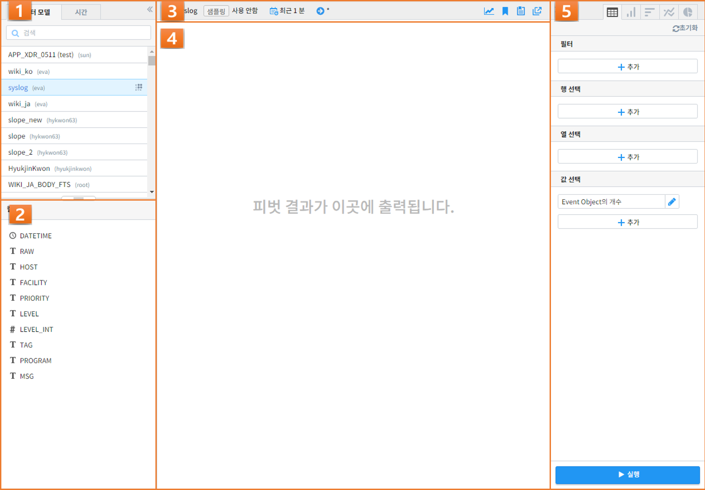
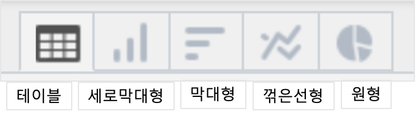
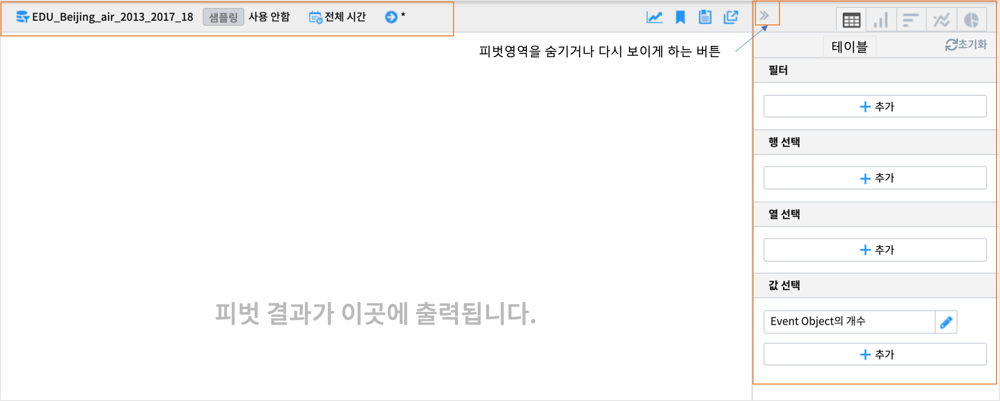
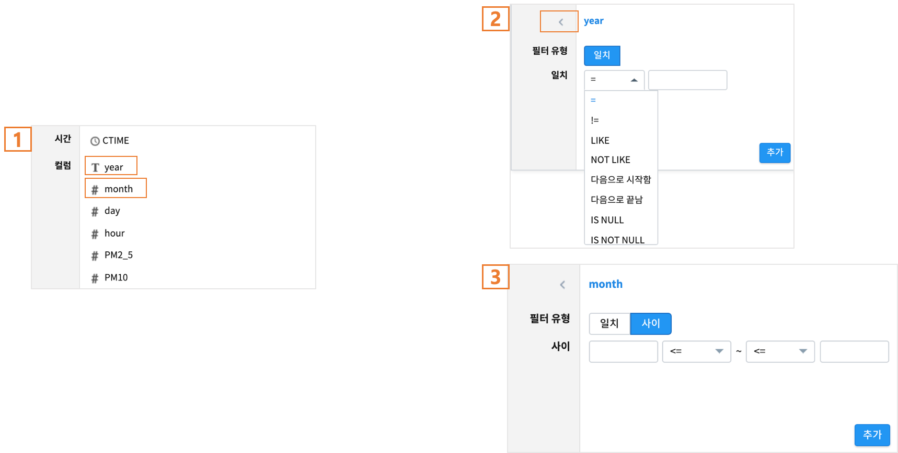
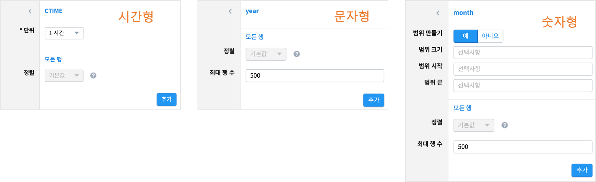
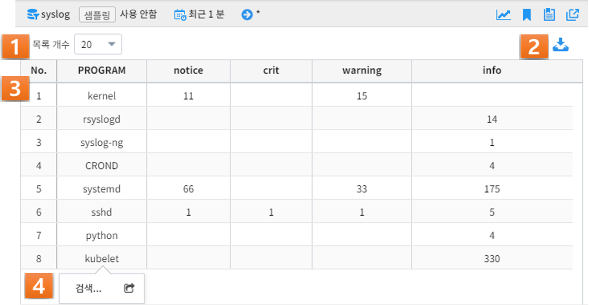

피벗분석
========================================

피벗분석 화면 개요
----------------------------------------
| 피벗분석 기능은 사용자가 검색 결과의 각 필드를 행, 열, 값 등으로 적절히 조합함으로써 원하는 분석 결과를 쉽고 빠르게 도출하기 위한 분석 툴입니다. 
| 검색어의 pivot 명령어 구문 실행돠 동일하며, UI 인터페이스를 통해 쉽게 피벗 기능을 사용할 수 있습니다.
| 피벗분석 화면의 구성은 다음과 같습니다.

.. csv-table::
    :header:  번호, 구분, 설명
    :widths:  10, 40, 130

    "1", "모델/시간 설정",  "검색하고자 하는 데이터 모델과 검색 기간을 설정"
    "2", "컬럼 목록",  "선택한 데이터 모델의 컬럼들을 표기"
    "3", "데이터 설정 표기",  "데이터 모델/시간/검색어 등의 설정된 정보들을 표기하는 영역"
    "4", "결과 화면",  "검색 및 피벗 조건에 따른 피벗 결과를 출력하는 영역"
    "5", "피벗/시각화 설정",  "시각화 유형에 따라 피벗 혹은 시각화 방식을 설정하는 컨트롤 영역"
    
| 1번 모델/시간 설정은 `검색의 데이터모델 및 시간, 샘플링 설정 <http://docs.iris.tools/manual/IRIS-Manual/IRIS-Analyzer/01_search/search.html#id3>`__  을 참고하시기 바랍니다.
| 3번 데이터 설정 표기는 검색 메뉴에서 **이동** 한 경우에는 검색 메뉴의 데이터모델과 검색 기간, 검색어가 표기됩니다. 

피벗/시각화 설정
-----------------------------------------------

피벗 설정하기: 테이블
..................................................................................

  

필터
~~~~~~~~~~~~~~~~~~~~~~~~~~~~~~~~

| 필터를 클릭하면 피벗 대상 데이터모델의 컬럼 목록이 나옵니다.(1번)
| 컬럼이 텍스트형이면 필터유형이 **일치** 만 있는 창이 나옵니다.(2번)
| 숫자형 컬럼을 선택한 경우에는 필텨유형이 "일치"와 "사이"가 나옵니다.(3번) 

====================  ========================================================================================================================================================================================================================================================================
필드 유형             필터 일치 조건
--------------------  ------------------------------------------------------------------------------------------------------------------------------------------------------------------------------------------------------------------------------------------------------------------------
문자형                - **=**: 해당 필드 값이 일치 조건 입력란에 입력한 값과 일치하는 데이터를 피벗 실행의 대상으로 제한합니다.
                      - **!=**: 해당 필드 값이 입력한 값이 아닌 데이터를 피벗 실행의 대상으로 제한할 경우에 사용합니다.
                      - **LIKE**: 해당 필드 값이 입력한 값을 포함하는 데이터를 피벗 실행의 대상으로 제한할 경우에 사용합니다.
                      - **NOT LIKE**: 해당 필드 값이 입력한 값을 포함하지 않는 데이터를 피벗 실행의 대상으로 제한할 경우에 사용합니다.
                      - **다음으로 시작함**: 해당 필드 값이 입력한 값으로 시작하는 데이터를 피벗 실행의 대상으로 제한할 경우에 사용합니다.
                      - **다음으로 끝남**: 해당 필드 값이 입력한 값으로 끝나는 데이터를 피벗 실행의 대상으로 제한할 경우에 사용합니다.
                      - **IS NULL**: 해당 필드 값이 Null인 데이터를 피벗 실행의 대상으로 제한할 경우에 사용합니다.
                      - **IS NOT NULL**: 해당 필드 값이 Null이 아닌 데이터를 피벗 실행의 대상으로 제한할 경우에 사용합니다.
숫자형                - **=**: 해당 필드 값이 일치 조건 입력란에 입력한 값(숫자)과 일치하는 데이터를 피벗 실행의 대상으로 제한합니다.
                      - **!=**: 해당 필드 값이 입력한 값(숫자)이 아닌 데이터를 피벗 실행의 대상으로 제한할 경우에 사용합니다.
                      - **<=**: 해당 필드 값이 입력한 값(숫자)보다 작거나 같은 데이터를 피벗 실행의 대상으로 제한할 경우에 사용합니다.
                      - **<**: 해당 필드 값이 입력한 값(숫자)보다 작은 데이터를 피벗 실행의 대상으로 제한할 경우에 사용합니다.
                      - **>=**: 해당 필드 값이 입력한 값(숫자)보다 크거나 같은 데이터를 피벗 실행의 대상으로 제한할 경우에 사용합니다.
                      - **>**: 해당 필드 값이 입력한 값(숫자)보다 큰 데이터를 피벗 실행의 대상으로 제한할 경우에 사용합니다.
                      - **IS NULL**: 해당 필드 값이 Null인 데이터를 피벗 실행의 대상으로 제한할 경우에 사용합니다.
                      - **IS NOT NULL**: 해당 필드 값이 Null이 아닌 데이터를 피벗 실행의 대상으로 제한할 경우에 사용합니다.
====================  ========================================================================================================================================================================================================================================================================

행 선택(선택 항목) 
~~~~~~~~~~~~~~~~~~~~~~~~~~~~~~~~~~~~~~~~~~~~~~~~~~~~~~~~~~~~~~~~

| 선택한 행 컬럼이 **시간** 필드 인 경우

====================  ========================================================================================================================================================================================================================================================================
설정 항목             설명
--------------------  ------------------------------------------------------------------------------------------------------------------------------------------------------------------------------------------------------------------------------------------------------------------------
단위                  - 사용자는 이벤트가 발생한 시각 단위로 데이터를 그룹핑할 수 있습니다.
                      - 이벤트의 시각 단위는 1년, 1개월, 1일, 1시간, 1분, 10분, 1초 중에서 선택 가능합니다.
                      - "단위" 항목은 시간 필드 설정을 위한 필수 항목이며, Default은 ‘1시간’ 입니다.
정렬                  - 그룹핑되어 출력되는 데이터를 어떻게 정렬할 것인지를 아래와 같이 지정할 수 있습니다. Default는 ‘기본값’입니다.
                          - **기본값**: IRIS DB에 저장된 순서로 출력됩니다.
                          - **오름차순**: 출력될 데이터를 시각 단위 오름차순으로 정렬합니다.
                          - **내림차순**: 출력될 데이터를 시각 단위 내림차순으로 정렬합니다.
====================  ========================================================================================================================================================================================================================================================================

| 선택한 행 컬럼이 시간 필드가 아닌 경우

.. list-table::
   :widths: 10 10 60
   :header-rows: 1

   * - 필드 유형
     - 설정 항목
     - 설명
   * - 문자형
     - 정렬
     - - 행 단위로 그룹핑되어 출력되는 데이터를 어떻게 정렬할 것인지를 지정할 수 있습니다. Default는 ‘기본값’입니다.

         - 기본값: IRIS DB에 저장된 순서로 출력됩니다.
         - 오름차순: 출력될 데이터를 해당 필드 값의 알파벳 단위 오름차순으로 정렬합니다.
         - 내림차순: 출력될 데이터를 해당 필드 값의 알파벳 단위 내림차순으로 정렬합니다.
   * - 
     - 최대 행 수
     - - 사용자는 피벗 테이블 실행 결과로 화면에 출력될 데이터 목록의 최대 행 수를 지정할 수 있습니다.
       - Default는 ‘500’으로 설정되어 있습니다. 즉, 화면에 출력될 데이터 목록은 최대 500 라인이며, 500 라인 이후의 데이터 목록은 출력되지 않습니다.
   * - 숫자형
     - 범위 만들기
     - - 숫자형 필드의 경우, 피벗 실행결과로 출력되는 각 열을 필드 값의 개별 숫자별로 표현할 것인지, 일정 범위를 지정하여 표현할 것인지 여부를 묻는 항목입니다.
       - 범위를 지정하고자 할 경우, "예" 버튼을 클릭하여 아래와 같이 연계된 항목들을 설정할 수 있습니다. 범위를 지정하지 않는 경우, "아니오" 버튼을 클릭합니다.
   * - 
     - 범위 크기
     - - "범위 만들기" 항목에서 필드 값의 범위를 지정할 경우에 설정합니다.
       - 사용자는 해당 필드 값을 그룹핑할 범위의 크기를 지정할 수 있습니다.
   * - 
     - 범위 시작
     - - "범위 만들기" 항목에서 필드 값의 범위를 지정할 경우에 설정합니다.
       - 해당 필드 값을 그룹핑하는 경우, 범위가 시작되는 값을 지정합니다.
   * - 
     - 범위 끝
     - - "범위 만들기" 항목에서 필드 값의 범위를 지정할 경우에 설정합니다. 해당 필드 값을 그룹핑하는 경우, 범위의 마지막 값을 지정합니다.
   * - 
     - 정렬
     - - 그룹핑되어 출력되는 데이터를 어떻게 정렬할 것인지를 지정할 수 있습니다. Default는 ‘기본값’으로 설정되어 있습니다.

         - 기본값: IRIS DB에 저장된 순서로 출력됩니다.                                                                                                                                                                                                                                                    |
         - 오름차순: 출력될 데이터를 숫자 단위 오름차순으로 정렬합니다.
         - 내림차순: 출력될 데이터를 숫자 단위 내림차순으로 정렬합니다. 
   * - 
     - 최대 행 수
     - - 사용자는 피벗 테이블 실행 결과로 화면에 출력될 데이터 목록의 최대 행 수를 지정할 수 있습니다. 
       - Default는 ‘500’으로 설정되어 있습니다. 즉, 화면에 출력될 데이터 목록은 최대 500 라인이며, 500 라인 이후의 데이터 목록은 출력되지 않습니다.

열 선택(선택 항목) 
~~~~~~~~~~~~~~~~~~~~~~~~~~~~~~~~~~~~~~~~~~~~~~~~~~~~~~~~~~~~~~~~

| 사용자는 출력될 결과의 열에 해당되는 필드를 설정할 수 있습니다. 
| 필드 리스트에서 특정 필드를 선택하고, 최대 열 수와 대소문자 구분 여부를 설정합니다. 
| "대소문자 구분 여부" 는 pivot집계를 할 때, 대/소문자 구분 여부를 선택합니다.

값 선택
~~~~~~~~~~~~~~~~~~~~~~~~~~~~~~~~~~~~~~~~~~~~~~~~~~~~~~~~~~~~~~~~

| 사용자는 출력될 결과값을 설정할 수 있습니다. 
| "값 선택"에는 default로 Event Object의 개수가 설정되어 있으며, 특정 필드에 대한 피벗 실행 결과 값을 콤보박스에서 선택하여 설정할 수 있습니다. 

| 필드 유형별 결과값 설정

===============  =================  ========================================================================================================================================================
필드 유형        설정 항목          설명
---------------  -----------------  --------------------------------------------------------------------------------------------------------------------------------------------------------
시간형           값                 - 피벗 실행 결과로 출력될 해당 필드의 첫 번째 값, 마지막 값, 또는 출력되는 필드 값의 개수를 지정할 수 있습니다.
                                        - **시작**: 출력되는 특정 필드의 값 중, 첫번째 시간 값만 출력합니다.
                                        - **종료**: 출력되는 특정 필드의 값 중, 마지막 시간 값만 출력합니다.
                                        - **값의 개수**: 선택한 특정 필드의 값의 개수( distinct count )가 출력됩니다.
문자형           값                 - 피벗 실행 결과로 출력될 해당 필드의 첫 번째 값, 마지막 값, 또는 출력되는 필드 값의 개수를 지정할 수 있습니다.
                                        - **첫 번째 값**: 출력되는 특정 필드의 값 중, 첫 번째 값만 출력합니다.
                                        - **마지막 값**: 출력되는 특정 필드의 값 중, 마지막 값만 출력합니다.
                                        - **개수**: 출력되는 특정 필드의 count 가 출력됩니다.
                                        - **값의 개수**: 출력되는 특정 필드의 값의 개수( distinct count ) 가 출력됩니다.
숫자형           값                 - 피벗 실행 결과로 출력될 해당 필드의 통계 항목을 지정할 수 있습니다.
                                        - **합계**: 통계 대상 이벤트에 대하여, 해당 필드 값의 합계 산출
                                        - **개수**: 통계 대상 이벤트의 개수 산출
                                        - **평균**: 통계 대상 이벤트에 대하여, 해당 필드 값의 평균값 산출
                                        - **최대**: 통계 대상 이벤트에 대하여, 해당 필드 값의 최대값 산출
                                        - **최소**: 통계 대상 이벤트에 대하여, 해당 필드 값의 최소값 산출
                                        - **표준 편차**: 통계 대상 이벤트에 대하여, 해당 필드 값의 표준편차 산출
                                        - **중간값**: 통계 대상 이벤트에 대하여, 해당 필드 값의 중간값 산출
                                        - **값의 개수**: 통계 대상 이벤트에 대하여, 해당 필드 값의 개수( distinct count ) 가 출력됩니다.
===============  =================  ========================================================================================================================================================

피벗 결과 분석 하기: 테이블
..................................................................................

========  ==================================  =====================================================================================================================================================================================
번호      구분                                설명
--------  ----------------------------------  -------------------------------------------------------------------------------------------------------------------------------------------------------------------------------------
1         목록 개수 드랍다운                  결과 영역에 출력되는 피벗 실행 결과에 대하여, 페이지 당 출력 가능한 리스트의 수 지정 (10, 20, 50)
2         내보내기 버튼                       사용자가 설정한 피벗의 실행 결과를 파일로 다운로드하거나 HDFS 등의 원격 위치에 저장할 수 있습니다. 버튼을 클릭하면 검색과 동일한 내보내기 창이 팝업됩니다.
3         피벗 결과 그리드                    피벗 결과 혹은 피벗 결과의 일부분을 출력한 그리
4         검색 화면 이동 메뉴                 선택한 셀의 필드/값을 가지고 검색어를 구성하여 검색 화면으로 이동합니다. [예시1]_
========  ==================================  =====================================================================================================================================================================================

.. [예시1] 예를 들어, PROGRAM 필드의 kublet 값을 선택하였다면 검색어는 PROGRAM=’kublet’ 으로 설정됩니다.

피벗 설정하기: 차트
..................................................................................

| 챠트의 화면 UI 수정 버전(2020.07월 예정)은 보완 예정입니다.

.. image:: ./images/ko/pivot_props_chart.png

========  ==================================  =====================================================================================================================================================================================
번호      구분                                설명
--------  ----------------------------------  -------------------------------------------------------------------------------------------------------------------------------------------------------------------------------------
1         필터                                - 사용자는 필터를 사용하여 피벗 실행의 대상이 되는 데이터의 범위를 제한할 수 있습니다. 사용자는 특정 필드의 값의 범위를 설정함으로써, 피벗 실행의 대상이 되는 데이터를 제한하게 됩니다. 예를 들어, 인터넷 서비스 로그에서 서비스 실패 원인을 분석하기 위하여, 서비스가 성공한 로그는 분석 대상에서 제외하고자 할 경우, cause 필드의 값으로 ‘fail’이 포함된 로그로 필터를 설정할 수 있습니다.
                                                필터 항목은 선택 사항이므로, 사용자가 필터를 설정하지 않으면 전체 데이터에 대하여 피벗이 실행됩니다. (테이블 설정과 동일)
2         X축                                 - 사용자가 피벗 차트의 X축에 대하여 설정할 수 있도록 지원합니다.
                                                피벗 테이블의 "행 선택"에 대응되는 설정으로, 차트 유형에 따라 "X 축" 항목은 필수 항목일 수 있습니다. 이 때는 사용자가 반드시 설정하여야 합니다.
3         Y축                                 - 사용자가 피벗 차트의 Y축에 대하여 설정할 수 있도록 지원합니다.
                                                피벗 테이블의 "값 선택"에 대응되는 설정으로, "Y 축" 항목은 이벤트의 개수가 default로 설정됩니다.
4         색상(범례)                          - 사용자는 X 축에 표시되는 막대 그래프 각각의 값을 표시하는 범례를 추가하거나 삭제할 수 있습니다.
                                                피벗 테이블의 "열 선택"에 대응되는 설정입니다.
========  ==================================  =====================================================================================================================================================================================

피벗 결과 분석 하기: 차트
..................................................................................
출력된 피벗 차트에서 특정 그래프에 마우스 오버하면, 아래와 같이 해당 그래프에 대한 자세한 정보가 pop-up으로 오픈됩니다.

.. image:: ./images/ko/pivot_results_chart_01.png

| 범례에서 특정 항목을 클릭하면, 클릭한 범례에 해당하는 필드를 미선택으로 변경하게 되므로, 차트에서 해당 범례가 사라지게 됩니다.
| 또한, 차트의 특정 영역을 드래그하여 해당 영역의 차트만 Zoom-in하여 분석할 수 있습니다.

.. image:: ./images/ko/pivot_results_chart_02.png
.. image:: ./images/ko/pivot_results_chart_03.png

| Zoom-in된 상태에서 원래의 차트 상태로 복구하려면 우측 상단의 "확대/축소 재설정" 버튼을 클릭하면 됩니다.
| 마지막으로, 막대 등 차트에 그려진 특정 도형을 클릭하면 선택한 도형의 필드-값으로 검색 화면으로 이동하거나 새 창에서 검색 작업을 수행할 수 있습니다.

부가 기능: 피벗
----------------------------------------
데이터 브라우저에는 사용자의 작업을 돕는 부가기능이 준비되어 있습니다. 이는 아래와 같습니다.

.. image:: ./images/ko/pivot_buttons.png

========  ==================================  =====================================================================================================================================================================================
번호      구분                                설명
--------  ----------------------------------  -------------------------------------------------------------------------------------------------------------------------------------------------------------------------------------
1         다른 화면으로 이동                  피벗, 고급시각화, 이상탐지 화면으로 이동할 수 있는 메뉴 버튼
2         시각화 저장                         현재 검색 조건과 여러가지 설정들을 템플릿으로 저장합니다.
3         불러오기                            검색 이력 및 시각화 목록 창을 여는 버튼
4         새 창에서 실행                      현재 설정 그대로 새 창에서 검색 작업을 실행하는 버튼
========  ==================================  =====================================================================================================================================================================================

- **화면 이동**: 검색 화면의 `화면 이동` 를 참고하시기 바랍니다.
- **새 창에서 열기**: 검색 화면의 `새 창에서 열기` 를 참고하시기 바랍니다.
- **결과 내보내기**: 검색 화면의 `결과 내보내기` 를 참고하시기 바랍니다.

