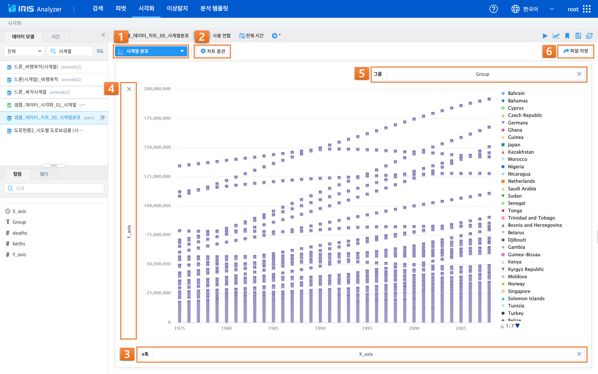

IRIS Analyzer
=================================
| IRIS Analyzer는 다양한 데이터 소스로부터 인사이트를 얻기 위한 가장 쉽고 빠른 도구로써, 데이터를 빠르게 탐색하거나 시각화하여 기초적인 분석 작업을 수행할 수 있습니다. 

- ‘검색’ 기능에서는 데이터 모델의 데이터를 Discovery-Service 명령어로 필터링, 통계 변환, pivot 등을 실행할 수 있습니다.
- ‘피벗’ 메뉴에서는 데이터 모델의 데이터를 행과 열 기준으로 통계 및 변환하고 차트 기능을 제공받을 수 있습니다.
- ‘이상탐지’ 메뉴에서는 과거 동일한 시간대의 참조 데이터 대비 조회 기간 데이터의 이상탐지 결과를 히트맵과 상/하한 임계치 차트로 제공받을 수 있습니다.
- ‘분석 템플릿’ 메뉴에서는 분석 작업시 입력/설정한 내용(데이터 모델, 시간 설정, 검색어 등)를 다시 수행하거나 다른 사용자에게 공유할 수 있도록 템플릿으로 저장할 수 있습니다. 
  
| 우측 상단의 메인 메뉴의 ‘Analyzer’ 버튼을 눌러 접속하실 수 있습니다.

------------------------------------------------------------------

검색
++++++++++++++++++++++++++++++++
| 검색화면의 데이터는 데이터 모델을 대상으로 합니다.
|
| DBMS, ObjectStorage, HDFS 등 다양한 데이터소스로부터 생성한 데이터 모델을 선택하고, 조회할 검색 시간을 설정한 후에 IRIS Discovery-Service 명령어를 통해 필터링, 변환, 피버팅, 통계, 다양한 기계 학습 기능 등을 수행할 수 있습니다.
|
| 검색 메뉴는 데이터에 대한 탐색적 데이터 분석(EDA; Exploratory Data Analysis)에 유용한 메뉴입니다. 또한, 실행된 결과를 파일로 내보내기를 하거나 시각화/피벗 등의 Analyzer의 다른 메뉴로 바로 이동이 가능합니다. 

+------+------------------------------+---------------------------------------------------------------------------------------------------------------------------------------------------------------+
| 번호 | 구분                         | 설명                                                                                                                                                          |
+======+==============================+===============================================================================================================================================================+
|| 1   || 데이터 모델 / 시간 설정     || 데이터 모델 선택과 시간 범위 설정을 선택하는 탭 컨트롤입니다.                                                                                                |
+------+------------------------------+---------------------------------------------------------------------------------------------------------------------------------------------------------------+
|| 2   || 데이터 모델 목록            || 데이터 모델/데이터 모델 뷰 필터, 모델 명 검색, 정렬 등을 할 수 있으며, 샘플링 설정(관리자)을 할 수 있습니다.                                                 |
+------+------------------------------+---------------------------------------------------------------------------------------------------------------------------------------------------------------+
|| 3   || 컬럼 목록                   || 컬럼 별 데이터 개수를 확인하고, 데이터 컬럼 명을 검색하여 목록을 필터링 할 수 있으며, 선택한 데이터 모델의 컬럼들의 표시 여부를 선택할 수 있습니다.          |
||     ||                             || 컬럼에 마우스를 대고 우 클릭하면 컬럼 및 컬럼 전체의 이름을 복사할 수 있는 창이 뜨고, 클릭하면 컬럼 이름이 복사가 되어 ‘Ctrl+V’로 붙여넣기가 가능해집니다.   |
||     ||                             || 데이터 개수를 활성화 하고 검색어를 실행하면 검색 결과에서 각 컬럼의 distinct한 데이터의 개수를 확인할 수 있습니다.                                           |
+------+------------------------------+---------------------------------------------------------------------------------------------------------------------------------------------------------------+

- **시간 설정**

    - 미리 설정/날짜 및 시간 범위: 시간 설정 방식 중 하나를 선택할 수 있습니다.
    - 미리 설정(프리셋): 미리 정의된 시간 설정 중 하나를 선택할 수 있습니다. 미리 설정의 항목들은 모두 상대 시간으로, 설정했을 경우 작업 수행 시마다 현재 시간을 기준으로 설정한 시간 범위가 검색 기간으로 적용됩니다.
    - 날짜 및 시간 범위: 정해진 포맷으로 날짜 및 시간 텍스트를 직접 입력하여 범위를 설정하거나, 날짜 선택 캘린더와 시간을 시/분/초로 나눈 드롭다운을 활용하여 날짜 및 시간을 선택할 수 있습니다. 

- **샘플링 설정**

    - 샘플링 기능은 대량은 원본 데이터 테이블을 조회하지 않기 위한 기능입니다. 따라서 샘플링 설정을 하게 되면 샘플링 테이블을 이용하여 조회 작업을 수행하여 검색의 효율이 높아지는 효과가 있습니다. 

        - 사용 안함: 원본 테이블 대상으로 조회
        - 원본: 설정한 샘플링 비율을 바탕으로 샘플링 적용
        - 샘플링 테이블: 샘플링 테이블을 대상으로 조회

|

- **[기간 옵션]** 미리 설정
 
 +------------+-------------------------------------------------------------+
 | 기간 옵션  | 설명                                                        |
 +============+=============================================================+
 | 전체시간   | 저장된 모든 데이터 대상으로                                 |
 +------------+-------------------------------------------------------------+
 | 최근 N분   | 검색 시점으로부터 N분전 0초부터 검색 시점까지               |
 +------------+-------------------------------------------------------------+
 | 최근 N시간 | 검색 시점으로부터 N시간 전 0분 0초 부터 검색 시점까지       |
 +------------+-------------------------------------------------------------+
 | 지난 N일   | 검색 시점으로부터 N일 전 0시 0분 0초 부터 검색 시점까지     |
 +------------+-------------------------------------------------------------+
 | 지난 N분   | 검색 시점으로부터 N분 전 0초부터 검색 시점의 0초까지        |
 +------------+-------------------------------------------------------------+
 |  오늘      | 금일 00:00:00 부터 검색 시점까지                            |
 +------------+-------------------------------------------------------------+
 | 어제       | 어제 00:00:00 부터 오늘 00:00:00 이전까지                   |
 +------------+-------------------------------------------------------------+
 | 이번 주    | 금주 일요일 00:00:0 0부터 검색 시점까지                     |
 +------------+-------------------------------------------------------------+
 | 이전 주    | 이전 주 일요일 00:00:00 부터 금주 일요일 00:00:00 이전까지  |
 +------------+-------------------------------------------------------------+
 | 이번 달    | 금월 1일 00:00:00 부터 검색 시점까지                        |
 +------------+-------------------------------------------------------------+
 | 이전 달    | 이전달 1일 00:00:00 부터 금월 1일 00:00:00 이전까지         |
 +------------+-------------------------------------------------------------+
 | 이번 분기  | 이번 분기 1일 00:00:00 부터 검색 시점까지                   |
 +------------+-------------------------------------------------------------+
 | 이전 분기  | 이전 분기 1일 00:00:00 부터 이번 분기 1일 00:00:00 이전까지 |
 +------------+-------------------------------------------------------------+
 | 이번 년도  | 금년 1월 1일 00:00:00 부터 검색 시점까지                    |
 +------------+-------------------------------------------------------------+
 | 이전 년도  | 작년 1월 1일 00:00:00 부터 금년 1월 1일 00:-00:00 이전까지  |
 +------------+-------------------------------------------------------------+

|

- **[기간 옵션]** 날짜 및 시간 범위 설정

    - 날짜 및 시간 범위 설정

        - ‘날짜 및 시간 범위’에서는 년/월/일에서부터 시/분/초까지 상세한 일자와 시간을 사용자가 직접 설정할 수 있습니다. 시작 시간과 종료 시간을 나누어 설정하며, 직접 정해진 포맷(ex. 2022/03/08 10:36:01)대로 입력하여 설정하거나 캘린더와 드롭다운 목록을 통해 설정할 수도 있습니다. 또한 종료시간의 ‘현재 시간’ 체크박스에 체크를 하면 작업 수행시마다 종료시간은 현재 시간으로 적용됩니다.

|

+------+----------------------------+------------------------------------------------------------------------------------------------------------------------------------+
| 번호 | 구분                       | 설명                                                                                                                               |
+======+============================+====================================================================================================================================+
|| 1   || 검색(검색 질의어)         || 검색어 입력란에 검색어를 입력할 수 있으며, 바로 하단의 검색어 추천 기능 활성화 시 이전 검색 이력, 도움말 창이 내려옵니다.         |
||     ||                           || 검색어/도움말 박스에서 검색 이력을 확인하고 검색 도움말 기능을 받을 수 있습니다.                                                  |
||     ||                           || 이전 검색 이력은 키보드 위/아래 키나 마우스 클릭으로 선택할 수 있으며, 선택하면 바로 입력란에 이전 검색 내용이 입력됩니다.        |
||     ||                           || 검색어 추천 창이 자동으로 나타나는 것을 원하지 않는다면 검색어 추천 버튼을 클릭하여 off 상태로 만들면 됩니다.                     |
+------+----------------------------+------------------------------------------------------------------------------------------------------------------------------------+
|| 2   || 부가 기능                 || 검색 옵션, 이동(피벗/시각화/이상탐지로 이동), 분석 템플릿, 불러오기, 새창으로 열기, 분석 코드 복사 등의 기능을 이용할 수 있습니다.|
+------+----------------------------+------------------------------------------------------------------------------------------------------------------------------------+
|| 3   || 결과 화면                 || 검색 조건에 따른 검색 결과를 출력할 수 있습니다.                                                                                  |
+------+----------------------------+------------------------------------------------------------------------------------------------------------------------------------+

- **부가 기능**

  - 검색 옵션: 최대 검색 결과 개수, 최대 통계 결과 개수에 관한 설정을 할 수 있습니다.

  - 실행: 검색 작업을 실행하는 버튼이며, 실행 중에는 실행을 멈출 수 있는 중지 버튼으로 바뀝니다.

  - 이동: 데이터 모델, 시간 설정, 필터링 검색어 내용 그대로 피벗/고급 시각화/이상탐지 화면으로 이동할 수 있습니다. 

  - 분석 템플릿: 현재 검색 조건과 데이터 모델, 시간, 검색어를 템플릿으로 저장할 수 있습니다. 저장된 분석 템플릿은 권한에 따라 제작된 템플릿을 다른 사람과 공유할 수 있습니다.

  - 불러오기: 저장된 분석 템플릿과 다른 사람이 저장한 분석 템플릿을 권한에 따라 불러와 실행할 수 있습니다. 또한 접속 계정에서 수행한 검색어의 이력을 볼 수 있으며, 이 중에서 재실행 검색어를 선택할 수 있습니다.

  - 새 창으로 열기: 현재 설정 그대로 새 창(탭)에서 검색 작업을 실시할 수 있습니다. 여러 개의 창으로 작업할 때 유용합니다.

  - 분석코드 복사: Rest API로 검색어 실행 결과를 받을 수 있는 예제 코드(R/Python/Node.js 코드)를 클립보드에 복사할 수 있습니다. 

|

+------+------------------------------+----------------------------------------------------------------------------------------------------------------------------------------------------------------------------+
| 번호 | 구분                         | 설명                                                                                                                                                                       |
+======+==============================+============================================================================================================================================================================+
|| 1   || 이벤트                      || 이벤트 탭에 DSL 검색어(*)의 결과가 출력됩니다.                                                                                                                            |
+------+------------------------------+----------------------------------------------------------------------------------------------------------------------------------------------------------------------------+
|| 2   || 컬럼 분포 확인              || 검색 명령어를 실행한 후, 검색 명령어 결과 내에서 선택한 컬럼 값의 종류와 상위 10개 값의 개수 등의 컬럼 분포를 확인할 수 있습니다.                                         |
+------+------------------------------+----------------------------------------------------------------------------------------------------------------------------------------------------------------------------+
|| 3   || 검색 결과 그리드            || 특정 셀의 값을 클릭하여 필터링 할 수 있습니다.                                                                                                                            |
+------+------------------------------+----------------------------------------------------------------------------------------------------------------------------------------------------------------------------+
|| 4   || 내보내기                    || 내보내기 버튼을 클릭하면 로컬 PC 또는 HDFS에 파일 형태로 저장할 수 있습니다.                                                                                              |
||     ||                             || 로컬 PC에 저장하는 파일 형식은 CSV/TSV/JSON이 있습니다. HDFS에 저장할 때는 연결 정보를 설정하고, 디렉토리 path를 지정한 후에 구분자를 입력하여 파일로 저장할 수 있습니다. |
||     ||                             || ‘콤마(,)’가 디폴트 구분자이며, ‘tab(t)’ 구분자, '│' 구분자 등의 다양한 구분자를 설정할 수 있습니다.                                                                       |
+------+------------------------------+----------------------------------------------------------------------------------------------------------------------------------------------------------------------------+

- **검색 결과 그리드**

    - 검색에 추가
    
        - ‘검색에 추가＇를 클릭하면, 현재 검색 조건에 ‘선택한 셀＇이 자동으로 추가되어 필터링 된 재검색 결과가 화면에 출력됩니다.
    
    - 검색에서 제외

        - ‘검색에서 제외＇를 클릭하면, 현재 검색 조건에 ‘선택한 셀＇이 자동으로 추가되어 필터링 된 재검색 결과가 화면에 출력됩니다.

    - 새로운 검색

        - 기존 검색과 무관하게 다른 컬럼을 선택하여 재검색을 수행하고자 할 경우에 사용할 수 있습니다.

|

피벗
++++++++++++++++++++++++++++++++

| IRIS Analyzer의 피벗 분석 메뉴는 데이터의 행과 열을 재정렬하고 간단한 계산을 수행하여 테이블로 결과를 출력합니다.
| 테이블의 출력 결과를 가로막대형, 세로막대형, 꺾은선형, 원형 차트로 표시할 수 있습니다.
| 또한, 개별 차트의 세부 옵션을 설정할 수 있습니다.

+------+-----------------------------+--------------------------------------------------------------------------------------------------------------+
| 번호 | 구분                        | 설명                                                                                                         |
+======+=============================+==============================================================================================================+
|| 1   || 데이터모델/시간설정        || 검색하고자 하는 데이터 모델과 검색 기간을 설정할 수 있습니다.                                               |
+------+-----------------------------+--------------------------------------------------------------------------------------------------------------+
|| 2   || 데이터 모델 목록           || 데이터 모델/데이터 모델 뷰 필터, 모델 명 검색, 정렬 등을 할 수 있으며, 샘플링 설정(관리자)을 할 수 있습니다.|
+------+-----------------------------+--------------------------------------------------------------------------------------------------------------+
|| 3   || 컬럼 목록                  || 선택한 데이터 모델의 컬럼들을 확인할 수 있습니다.                                                           |
+------+-----------------------------+--------------------------------------------------------------------------------------------------------------+
|| 4   || 데이터 설정 표기           || 데이터 모델/시간/검색어 등의 설정된 정보들을 확인할 수 있습니다.                                            |
+------+-----------------------------+--------------------------------------------------------------------------------------------------------------+
|| 5   || 피벗 영역                  || 피벗 영역에서 유형에 따른 피벗 방식을 설정할 수 있습니다.                                                   |
||     ||                            || ‘>>’버튼을 눌러 피벗 영역을 숨기거나 다시 보이게 할 수 있습니다.                                            |
+------+-----------------------------+--------------------------------------------------------------------------------------------------------------+
|| 6   || 결과 화면                  || 검색 및 피벗 조건에 따른 피벗 결과를 출력할 수 있습니다.                                                    |
+------+-----------------------------+--------------------------------------------------------------------------------------------------------------+

- **부가 기능**

    - 사용자의 작업을 돕는 역할이며, 다음과 같은 기능들이 있습니다.

      (1) 다른 화면으로 이동: 데이터 모델, 시간 범위, 검색어 등 현재 선택되고 입력된 설정을 가지고 검색/고급 시각화/이상탐지 화면으로 이동할 수 있습니다. 

      (2) 시각화 저장: 현재 검색 조건과 여러가지 설정들을 템플릿으로 저장할 수 있습니다.

      (3) 불러오기: 검색 이력 및 시각화 목록 창을 열 수 있습니다.

      (4) 새창에서 실행: 현재 설정 그대로 새 창에서 검색 작업을 실행하는 버튼입니다.

|

시각화
++++++++++++++++++++++++++++++++

| 시각화 기능은 사용자가 검색 결과의 각 필드, 행, 열 등을 GUI 화면 상에서 적절히 조합함으로써 원하는 분석 결과를 쉽고 빠르게 도출하기 위하여 사용되는 강력한 분석 툴입니다. 
| 피벗과는 달리 시각화에 중점을 두어 차트에 최적화된 직관적인 사용자 인터페이스를 제공하며, 다양한 차트 설정 및 시각화 옵션을 제공합니다. 

+------+--------------------------------------+-----------------------------------------------------------------------------------------------------------------------------------------+
| 번호 | 구분                                 | 설명                                                                                                                                    |
+======+======================================+=========================================================================================================================================+
| 1    | 데이터 모델/시간설정                 | 검색하고자 하는 데이터모델과 검색 기간을 설정할 수 있습니다.                                                                            |
+------+--------------------------------------+-----------------------------------------------------------------------------------------------------------------------------------------+
| 2    | 데이터 모델 목록                     | 데이터모델/데이터모델뷰 필터, 모델 명 검색, 정렬 등을 할 수 있으며, 샘플링 설정(관리자)을 할 수 있습닝다.                               |
+------+--------------------------------------+-----------------------------------------------------------------------------------------------------------------------------------------+
| 3    | 컬럼 목록                            | 선택한 데이터 모델의 컬럼들을 확인할 수 있으며, 컬럼 별 필터를 적용할 수 있습니다.                                                      |
+------+--------------------------------------+-----------------------------------------------------------------------------------------------------------------------------------------+
| 4    | 검색 정보 표기 및 부가 기능          | 데이터 모델/시간/검색어 등의 설정된 정보들을 확인할 수 있으며, 실행/이동/분석 템플릿/불러오기/새 창으로 열기 기능을 활용할 수 있습니다. |
+------+--------------------------------------+-----------------------------------------------------------------------------------------------------------------------------------------+
| 5    | 분석 유형 설정                       | 시계열/분포/관계형/이상치/예측/지도형 등의 분석 유형을 선택할 수 있습니다.                                                              |
+------+--------------------------------------+-----------------------------------------------------------------------------------------------------------------------------------------+
| 6    | X/Y축 등의 설정 및 차트 결과         | 차트의 X,Y축 혹은 그룹에 컬럼을 지정하고 차트의 결과를 볼 수 있습니다.                                                                  |
+------+--------------------------------------+-----------------------------------------------------------------------------------------------------------------------------------------+

|

이상탐지
++++++++++++++++++++++++++++++++

이상탐지 기능은 사용자가 지정한 데이터와 시간 범위 내에서 다양한 옵션과 알고리즘을 통해 급격한 변화나 평소에는 나타나지 않는 값 등 이상치를 검출하는 기능을 제공합니다. 

.. image:: IRIS-04-4-1.png
    :width: 1000
    :alt: IRIS-04-4-1

+------+--------------------------------------------+----------------------------------------------------------------------------------------------------------------------------------------------------------------------+
| 번호 | 구분                                       | 설명                                                                                                                                                                 |
+======+============================================+======================================================================================================================================================================+
|| 1   || 데이터 모델/시간설정                      || 검색하고자 하는 데이터모델과 검색 기간을 설정할 수 있습니다.                                                                                                        |
+------+--------------------------------------------+----------------------------------------------------------------------------------------------------------------------------------------------------------------------+
|| 2   || 데이터 모델 목록                          || 데이터모델/데이터모델뷰 필터, 모델 명 검색, 정렬 등을 할 수 있으며, 샘플링 설정(관리자)을 할 수 있습닝다.                                                           |
+------+--------------------------------------------+----------------------------------------------------------------------------------------------------------------------------------------------------------------------+
|| 3   || 컬럼 목록(필드 목록)                      || 선택한 데이터 모델의 컬럼(필드)들을 확인할 수 있습니다.                                                                                                             |
+------+--------------------------------------------+----------------------------------------------------------------------------------------------------------------------------------------------------------------------+
|| 4   || 검색 정보 표기                            || 데이터 모델/시간/검색어 등의 설정된 정보들을 확인할 수 있습니다.                                                                                                    |
+------+--------------------------------------------+----------------------------------------------------------------------------------------------------------------------------------------------------------------------+
|| 5   || 카드 추가                                 || (+) 버튼을 통해 카드를 추가할 수 있으며, 추가된 카드들은 해당 영역에 바둑판식으로 나열됩니다.                                                                       |
||     ||                                           || 카드 추가 버튼을 눌렀을 때, 팝업으로 뜨는 ‘실행 옵션’에서 여러가지 설정을 할 수 있으며, ‘상세 옵션 숨기기/펼치기‘ 버튼을 통해 상세 옵션을 확인하실 수 있습니다.     |
+------+--------------------------------------------+----------------------------------------------------------------------------------------------------------------------------------------------------------------------+

- **실행 옵션**

    - 카드 제목: 카드 제목을 입력할 수 있으며, Default로 “Untitled”와 숫자의 조합이 입력됩니다.

    - 분석 설정: 이상탐지 분석 중 필드/모델 등 데이터 처리에 대하여 설정할 수 있습니다.

        - 이상탐지 분석 중 필드/모델 등 데이터 처리에 대한 설정 모음

            - 키 필드: 분석 대상으로 지정할 키 필드입니다. 복수 개 설정이 가능합니다. 키 필드 설정에 대한 자세한 내용은 [참고]를 확인하세요.
            - 값 필드: 분석 대상으로 지정할 값 필드입니다. 복수 개 설정이 가능합니다. 키 필드 설정에 대한 자세한 내용은 [참고]를 확인하세요.
            - 모델: 이상탐지 분석 시에 사용할 분석 모델을 선택합니다. Default는 SPC 입니다.

                - SPC(Statistical Process Control): 참조그룹의 데이터의 평균과 표준편차로 관리상한선, 관리하한선을 설정하여 관리하는 모델
                - IQR(Inter-Quartile Range): 백분위수(percentile)를 기준으로 삼사분위수(Q3)에서 일사분위수(Q1)를 뺀 값으로 정의할 수 있습니다. 즉, IQR = Q3 –Q1(75% 범위 값에서 25% 범위 값을 뺀 나머지 범위) 입니다.
                - 없는 Key 값: 키 필드 데이터 중 누락된 데이터를 이상상황으로 처리할지 여부를 선택할 수 있습니다.
                - 결측치: 누락된 데이터(missing value)에 대한 처리 방법을 결정합니다. “처리하지 않음” 외에 다른 항목을 선택할 경우, 누락된 데이터를 선택한 값으로 대체합니다. 사용자가 이 값을 지정할 수도 있습니다.
 

 - **시간 설정**

     - 이상탐지 분석 중 시간 범위에 대한 설정을 할 수 있습니다.

            - 비교 기간: 분석할 데이터의 시간 범위를 지정합니다.
            - 참조 기간: 분석에 참조할 데이터의 시간 범위를 지정합니다. ‘참조 기간 자동 조정’ 체크 시, 참조 기간이 상대 시간일 경우, 비교 기간과 참조 기간이 겹치지 않도록 참조기간을 조정합니다. 
            - 단위: 분석 시 비교기간 시간 범위 내에서 summary를 수행할 단위입니다.
            - 요일 분류: 비교 기간의 요일에 따라 분석할지 평일/휴일로 분류하여 분석할지를 결정합니다. ex) 비교 기간의 요일이 화요일이면 참조 기간의 화요일 데이터를 참조합니다.

|

+------+--------------+---------------------------------------------------------------+
| 번호 | 구분         | 설명                                                          |
+======+==============+===============================================================+
| 1    | 키 필드 추가 | 분석 대상으로 지정할 키 필드입니다. 복수개 설정이 가능합니다. |
+------+--------------+---------------------------------------------------------------+
| 2    | 값 필드 추가 | 분석 대상으로 지정할 값 필드입니다. 복수개 설정이 가능합니다. |
+------+--------------+---------------------------------------------------------------+

- **키 필드 설정하기**

    (1) ‘+ 추가’ 버튼을 클릭하면, 필드 리스트가 오픈 됩니다. 필드 리스트는 필드 유형과 필드 명으로 구성되어 있습니다.

    (2) 오픈 된 필드 리스트 중에서 키 필드로 지정하고자 하는 필드를 선택하면, 상세 설정 popup이 오픈 되고, ‘최대 키 개수’, ‘특정 값 지정’을 통한 필터 설정 등을 수행할 수 있습니다.

    (3) ‘최대 키 개수’ 입력란 하단의 라디오 버튼 그룹은 특정 키 필드에 대해서 수행하기 위한 일종의 필터 옵션입니다. ‘모든 값’을 선택할 경우 필터를 설정하지 않고 모든 키 필드 값에 대해 분석을 수행하며, ‘특정 값 지정’을 선택한 경우에는 아래 그림처럼 상위 10개 키 값이 그리드 뷰로 출력되어 이를 체크박스로 선택할 수 있습니다.

    (4) 원하는 값을 ‘특정 값 지정’에서 찾지 못한 경우, ‘직접 입력’을 선택 후 입력란에 값을 입력하는 방식으로 원하는 키 값을 직접 지정할 수 있습니다. (콤마(,)로 구분하여 입력)

- **값 필드 설정하기**

    (1) ‘+ 추가’ 버튼을 클릭하면, 필드 리스트가 오픈 됩니다. 필드 리스트는 필드 유형과 필드 명으로 구성되어 있습니다.

    (2) 오픈 된 필드 리스트 중에서 값 필드로 지정하고자 하는 필드를 선택하면, 아래와 같은 상세 설정 popup이 오픈 되고, 문자형/시간형 컬럼에 대하여 ‘제외값’, ‘함수‘ 를 통한 설정을 할 수 있으며, 숫자형 컬럼에 대하여 ‘최솟값’, ‘최댓값’, ‘제외값’과 ‘함수’를 통한 설정을 수행할 수 있습니다.

|

+------+---------------------------------+------------------------------------------------------------------------------------------------------------------------------------+
| 번호 | 구분                            | 설명                                                                                                                               |
+======+=================================+====================================================================================================================================+
| 1    | 실행 옵션 정보 버튼             | 마우스를 버튼 위에 올리면 해당 카드의 실행 옵션 내용을 툴팁으로 보여줍니다.                                                        |
+------+---------------------------------+------------------------------------------------------------------------------------------------------------------------------------+
| 2    | 제목                            | 실행 옵션에서 설정한 카드 제목을 표시합니다.                                                                                       |
+------+---------------------------------+------------------------------------------------------------------------------------------------------------------------------------+
| 3    | 스케일 모드 ON/OFF              | Heatmap 일 때만 등장하는 기능으로, Heatmap 차트의 각 cell별 색상을 모든 값에 대하여 계산할지 행 단위로 계산할지 여부를 선택합니다. |
+------+---------------------------------+------------------------------------------------------------------------------------------------------------------------------------+
| 4    | 확대/축소 버튼                  | 카드를 확대하거나 축소하는 버튼입니다.                                                                                             |
+------+---------------------------------+------------------------------------------------------------------------------------------------------------------------------------+
| 5    | 메뉴 버튼                       | 클릭하면 설정 변경/복사/다시 실행/삭제와 같은 기능 메뉴를 선택할 수 있습니다.                                                      |
+------+---------------------------------+------------------------------------------------------------------------------------------------------------------------------------+
| 6    | 차트 영역                       | 차트가 그려지는 영역입니다. 실행 옵션에 따라 Heatmap 혹은 Line Plot이 그려집니다.                                                  |
+------+---------------------------------+------------------------------------------------------------------------------------------------------------------------------------+
| 7    | 카드 추가                       | ‘+’ 버튼을 누르면 카드가 추가됩니다.                                                                                               |
+------+---------------------------------+------------------------------------------------------------------------------------------------------------------------------------+

- **기능 메뉴**

    - 설정 변경
    
        - 선택하면 실행 옵션 다이얼로그를 다시 팝업 합니다. 이를 통해 실행 옵션을 변경하고 이상 탐지 분석을 다시 수행할 수 있습니다.

    - 복사
    
        - 실행 옵션 및 분석 결과를 복사하여 새로운 카드를 추가합니다.

    - 다시 실행
    
        - 설정된 현재 실행 옵션으로 이상탐지 분석을 다시 수행합니다. 네트워크 이상 등으로 분석 결과를 수행하지 못했거나 결과가 적절하지 못할 때 다시 실행 기능을 활용해 실행을 초기화 할 수 있습니다.

    - 삭제

        - 해당 카드를 카드 영역에서 완전히 삭제합니다.

|

분석 템플릿 목록
++++++++++++++++++++++++++++++++

| 시각화는 분석 화면에서 검색 조건과 여러가지 설정 정보를 담고 있는 일종의 템플릿입니다. 
| 시각화 관리 화면에서는 각 화면에서 사용자가 작성하여 저장한 시각화 객체들을 수정하거나 삭제할 수 있습니다. 또한 특정 시각화를 다른 사용자가 접근할 수 있도록 권한을 부여할 수도 있습니다.

+------+-------------------------------+---------------------------------------------------------------------------------------------------------------------------------------------------------------------------------------+
| 번호 | 구분                          | 설명                                                                                                                                                                                  |
+======+===============================+=======================================================================================================================================================================================+
|| 1   || 새로고침 버튼                || 시각화 목록을 다시 불러와 갱신할 수 있습니다.                                                                                                                                        |
+------+-------------------------------+---------------------------------------------------------------------------------------------------------------------------------------------------------------------------------------+
|| 2   || 목록 설정                    || 그리드에 표시되는 항목들을 필터링하거나 선택할 수 있습니다.                                                                                                                          |
+------+-------------------------------+---------------------------------------------------------------------------------------------------------------------------------------------------------------------------------------+
|| 3   || 시각화 목록                  || 소유자 정보, 작업(시각화 이름 변경/수정/복제/삭제/URL 복사), 수정일, 구분(분석화면 이름), 데이터 모델 정보를 확인할 수 있으며, 접근 권한을 설정할 수 있습니다.                       |
||     ||                              || 또한 목록에서 모델명 좌측에 위치한 ‘▶ 아이콘’을 클릭하여 현재 생성된 데이터 모델의 상세 정보를 확인할 수 있으며, ‘▼ 아이콘’을 통해 데이터 모델의 상세 정보를 닫을 수 있습니다.       |
+------+-------------------------------+---------------------------------------------------------------------------------------------------------------------------------------------------------------------------------------+

- **시각화 목록**

    - 소유자: 시각화 내용을 작성/저장한 사용자의 정보를 확인할 수 있습니다.
    - 작업: 시각화 이름 변경/수정/복제/삭제/URL 복사가 가능합니다.
    - 수정일: 시각화를 마지막으로 수정한 일시를 확인할 수 있습니다.
    - 구분: 시각화 유형 혹은 시각화를 저장한 분석 화면 이름을 확인할 수 있습니다.
    - 데이터 모델: 시각화의 데이터 모델 정보를 확인할 수 있습니다.
    - 접근 권한: 접근 권한을 설정할 수 있습니다.

- **접근 권한 설정**

  (1) 사용자/그룹 탭: 사용자 혹은 그룹을 전환하기 위한 탭입니다.

  (2) 모든 사용자 체크 박스: 모든 사용자에게 공유하고자 할 때 체크합니다.

  (3) 현재 권한 목록(권한이 있는 사용자): 현재 접근 권한을 가진 사용자 혹은 사용자 목록에서 추가한 권한을 부여하고자 하는 사용자 목록입니다.

  (4) 사용자 목록(사용자 추가): 모든 사용자 목록. “추가” 버튼을 클릭하면 현재 권한 목록에 추가됩니다.

--------------------------------------------------------------------------------------------------------------------------------------------------------------------------

[참고]피벗 설정
++++++++++++++++++++++++++++++++
 

피벗 설정하기 - 테이블
________________________________

피벗 분석 메뉴에서 가장 기본이 되는 차트로, 데이터를 테이블 형태로 보여줍니다. 개별 차트에 그려지는 데이터는 테이블 에서 먼저 필터, 정렬을 수행 한 후, 개별 차트에서 그려집니다.

- **필터**

    - 필터를 클릭하면 피벗 대상 데이터 모델의 컬럼 목록이 나옵니다. 컬럼이 문자형이면 필터유형이 문자/시간형이면 필터 유형이 ‘일치’만 있는 창이 나오고, 컬럼이 숫자형이면 필터 유형이 ‘일치’와 '사이’가 각각 나옵니다. 
  

    - **문자/시간형 컬럼**

        - =: 해당 컬럼 값이 일치 조건 입력란에 입력한 값과 일치하는 데이터를 피벗 실행의 대상으로 제한합니다.
        - !=: 해당 컬럼 값이 입력한 값이 아닌 데이터를 피벗 실행의 대상으로 제한할 경우에 사용합니다.
        - LIKE: 해당 컬럼 값이 입력한 값을 포함하는 데이터를 피벗 실행의 대상으로 제한할 경우에 사용합니다.
        - NOT LIKE: 해당 컬럼 값이 입력한 값을 포함하지 않는 데이터를 피벗 실행의 대상으로 제한할 경우에 사용합니다.
        - 다음으로 시작함: 해당 컬럼 값이 입력한 값으로 시작하는 데이터를 피벗 실행의 대상으로 제한할 경우에 사용합니다.
        - 다음으로 끝남: 해당 컬럼 값이 입력한 값으로 끝나는 데이터를 피벗 실행의 대상으로 제한할 경우에 사용합니다.
        - IS NULL: 해당 컬럼 값이 Null인 데이터를 피벗 실행의 대상으로 제한할 경우에 사용합니다.
        - IS NOT NULL: 해당 컬럼 값이 Null이 아닌 데이터를 피벗 실행의 대상으로 제한할 경우에 사용합니다.

    - **숫자형 컬럼**

        - =: 해당 컬럼 값이 일치 조건 입력란에 입력한 값(숫자)과 일치하는 데이터를 피벗 실행의 대상으로 제한합니다.
        - !=: 해당 컬럼 값이 입력한 값(숫자)이 아닌 데이터를 피벗 실행의 대상으로 제한할 경우에 사용합니다.
        - <=: 해당 컬럼 값이 입력한 값(숫자)보다 작거나 같은 데이터를 피벗 실행의 대상으로 제한할 경우에 사용합니다.
        - <: 해당 컬럼 값이 입력한 값(숫자)보다 작은 데이터를 피벗 실행의 대상으로 제한할 경우에 사용합니다.
        - >=: 해당 컬럼 값이 입력한 값(숫자)보다 크거나 같은 데이터를 피벗 실행의 대상으로 제한할 경우에 사용합니다.
        - >: 해당 컬럼 값이 입력한 값(숫자)보다 큰 데이터를 피벗 실행의 대상으로 제한할 경우에 사용합니다.
        - IS NULL: 해당 컬럼 값이 Null인 데이터를 피벗 실행의 대상으로 제한할 경우에 사용합니다.
        - IS NOT NULL: 해당 컬럼 값이 Null이 아닌 데이터를 피벗 실행의 대상으로 제한할 경우에 사용합니다.

|

.. image:: (IRIS)04-2-1(2).png
    :width: 1000
    :alt: (IRIS)04-2-1(2)

- **행 선택(선택 항목)**

    - 사용자는 피벗 실행의 결과로 출력될 데이터를 행 단위로 그룹핑하기 위하여 그룹핑할 필드를 지정할 수 있습니다. 컬럼 목록에서 특정 컬럼을 선택하고, 최대 행의 수 등을 설정합니다.

    - **문자형 컬럼**

        - 정렬: 행 단위로 그룹핑되어 출력되는 데이터를 어떻게 정렬할 것인지를 지정할 수 있습니다. Default는 ‘기본값’입니다.

            - 기본값: 정렬을 하지 않습니다.
            - 오름차순: 출력될 데이터를 해당 컬럼 값의 알파벳 단위 오름차순으로 정렬합니다.
            - 내림차순: 출력될 데이터를 해당 컬럼 값의 알파벳 단위 내림차순으로 정렬합니다.

        - 최대 행 수: 사용자는 피벗 테이블 실행 결과로 화면에 출력될 데이터 목록의 최대 행 수를 지정할 수 있습니다. Default는 ‘500’으로 설정되어 있습니다. 즉, 화면에 출력될 데이터 목록은 최대 500 라인이며, 500 라인 이후의 데이터 목록은 출력되지 않습니다.

    - **숫자형 컬럼**

        - 범위 만들기

            -  숫자형 컬럼의 경우, 피벗 실행결과로 출력되는 각 열을 컬럼 값의 개별 숫자별로 표현할 것인지, 일정 범위를 지정하여 표현할 것인지 여부를 묻는 항목입니다.
            -  범위를 지정하고자 할 경우, “예” 버튼을 클릭하여 아래와 같이 연계된 항목들을 설정할 수 있습니다. 범위를 지정하지 않는 경우, “아니오” 버튼을 클릭합니다.
  
        - 범위 크기
        
            - “범위 만들기” 항목에서 컬럼 값의 범위를 지정할 경우에 설정합니다. 사용자는 해당 컬럼 값을 그룹핑 할 범위의 크기를 지정할 수 있습니다.

        - 범위 시작
        
            - “범위 만들기” 항목에서 컬럼 값의 범위를 지정할 경우에 설정합니다. 해당 컬럼 값을 그룹핑하는 경우, 범위가 시작되는 값을 지정합니다.

        - 범위 끝
        
            - “범위 만들기” 항목에서 컬럼 값의 범위를 지정할 경우에 설정합니다. 해당 컬럼 값을 그룹핑하는 경우, 범위의 마지막 값을 지정합니다.
  
        - 정렬
        
            - 그룹핑되어 출력되는 데이터를 어떻게 정렬할 것인지를 지정할 수 있습니다. Default는 ‘기본값’으로 설정되어 있습니다.

                - 기본값: IRIS DB에 저장된 순서로 출력됩니다. 
                - 오름차순: 출력될 데이터를 숫자 단위 오름차순으로 정렬합니다.
                - 내림차순: 출력될 데이터를 숫자 단위 내림차순으로 정렬합니다.

        - 최대 행 수
        
            - 사용자는 피벗 테이블 실행 결과로 화면에 출력될 데이터 목록의 최대 행 수를 지정할 수 있습니다. Default는 ‘500’으로 설정되어 있습니다. 즉, 화면에 출력될 데이터 목록은 최대 500 라인이며, 500 라인 이후의 데이터 목록은 출력되지 않습니다.

    - **시간형 컬럼**

        - 단위: 사용자는 이벤트가 발생한 시각 단위로 데이터를 그룹핑 할 수 있습니다.

            - 이벤트의 시각 단위는 1년, 1개월, 1일, 1시간, 1분, 10분, 1초 중에서 선택 가능합니다.
            - “단위” 항목은 시간 컬럼 설정을 위한 필수 항목이며, Default은 ‘1시간’ 입니다.

        - 정렬: 그룹핑되어 출력되는 데이터를 어떻게 정렬할 것인지를 아래와 같이 지정할 수 있습니다. Default는 ‘기본값’입니다.

            - 기본값: IRIS DB에 저장된 순서로 출력됩니다.
            - 오름차순: 출력될 데이터를 시각 단위 오름차순으로 정렬합니다.
            - 내림차순: 출력될 데이터를 시각 단위 내림차순으로 정렬합니다.

|

- **열 선택(선택 항목)**

    - 사용자는 출력될 결과의 열에 해당되는 컬럼을 설정할 수 있습니다. 컬럼 리스트에서 특정 컬럼을 선택하고, 최대 열의 수와 대소문자 구분 여부를 설정합니다. “대소문자 구분 여부” 는 pivot집계를 할 때, 대/소문자 구분 여부를 선택합니다.

    - **문자/숫자형 컬럼**

        - 정렬: 열 단위로 그룹핑되어 출력되는 데이터를 어떻게 정렬할 것인지를 지정할 수 있습니다. Default는 ‘기본값’으로 설정되어 있습니다.

        - 대소문자 구분여부: 열 선택이 1개 이상 일 때 사용가능한 값으로, pivot 을 수행할 때 대문자와 소문자를 서로 다른 값으로 간주하여 처리할 지 선택하는 옵션입니다. 체크를 해제하면 대/소문자 구분을 하지 않아 같은 데이터로 처리됩니다. (ex. ABC = abc)

        - 최대 열 수: 사용자는 피벗 테이블 실행 결과로 화면에 출력될 데이터 목록의 열의 최대수를 지정할 수 있습니다. 피벗 테이블 실행 결과, 너무 많은 데이터가 출력되면, 오히려 사용자가 분석하는데 불편을 겪을 수 있으므로, 효율적인 분석을 위한 최소한의 데이터로 피벗 실행결과의 출력을 제한하는 것입니다. 

    - **시간형 컬럼**

        - 정렬: 열 단위로 그룹핑되어 출력되는 데이터를 어떻게 정렬할 것인지를 지정할 수 있습니다. Default는 ‘기본값’으로 설정되어 있습니다.

        - 대소문자 구분여부: 열 선택이 1개 이상 일 때 사용가능한 값으로, pivot 데이터의 집계를 할 때, 대/소문자 구분을 할 지/하지 않을 지 선택하는 옵션입니다. 옵션 선택에 따라 대소문자 값을 구분하여 다른 값으로 집계할 지의 여부를 결정할 수 있습니다.

- **값 선택(선택 항목)**

    - 사용자는 출력될 결과값을 설정할 수 있습니다. “값 선택”에는 default로 Event Object의 개수가 설정되어 있으며, 특정 컬럼에 대한 피벗 실행 결과 값을 콤보박스에서 선택하여 설정할 수 있습니다. 
  
     - **문자형 컬럼**

        - 값: 피벗 실행 결과로 출력될 해당 필드의 첫 번째 값, 마지막 값, 또는 출력되는 필드 값의 개수를 지정할 수 있습니다.

            - 첫 번째 값: 출력되는 특정 필드의 값 중, 첫 번째 값만 출력합니다.
            - 마지막 값: 출력되는 특정 필드의 값 중, 마지막 값만 출력합니다.
            - 개수: 출력되는 특정 필드의 count 가 출력됩니다.
            - 값의 개수: 출력되는 특정 필드의 값의 개수( distinct count ) 가 출력됩니다.

    - **시간형 컬럼**

        - 값: 피벗 실행 결과로 출력될 해당 필드의 첫 번째 값, 마지막 값, 또는 출력되는 필드 값의 개수를 지정할 수 있습니다.

            - 시작: 출력되는 특정 필드의 값 중, 첫번째 시간 값만 출력합니다.
            - 종료: 출력되는 특정 필드의 값 중, 마지막 시간 값만 출력합니다.
            - 값의 개수: 선택한 특정 필드의 값의 개수( distinct count )가 출력됩니다.

    - **숫자형 컬럼**
    
        - 값: 피벗 실행 결과로 출력될 해당 필드의 통계 항목을 지정할 수 있습니다.

            - 합계: 통계 대상 이벤트에 대하여, 해당 필드 값의 합계 산출
            - 개수: 통계 대상 이벤트의 개수 산출
            - 평균: 통계 대상 이벤트에 대하여, 해당 필드 값의 평균값 산출
            - 최대: 통계 대상 이벤트에 대하여, 해당 필드 값의 최댓값 산출
            - 최소: 통계 대상 이벤트에 대하여, 해당 필드 값의 최솟값 산출
            - 표준 편차: 통계 대상 이벤트에 대하여, 해당 필드 값의 표준편차 산출
            - 중간값: 통계 대상 이벤트에 대하여, 해당 필드 값의 중간값 산출
            - 값의 개수: 통계 대상 이벤트에 대하여, 해당 필드 값의 개수(distinct count)가 출력됩니다.

|

피벗 결과 분석하기 - 테이블
-----------------------------------------------

+------+------------------------------------------+-------------------------------------------------------------------------------------------------------------------------------+
| 번호 | 구분                                     | 설명                                                                                                                          |
+======+==========================================+===============================================================================================================================+
|| 1   || 목록 개수 드롭다운                      || 결과 영역에 출력되는 피벗 실행 결과에 대하여, 페이지 당 출력 가능한 리스트의 수를 10개, 20개, 50개 단위로 지정할 수 있습니다.|
+------+------------------------------------------+-------------------------------------------------------------------------------------------------------------------------------+
|| 2   || 내보내기 버튼                           || 사용자가 설정한 피벗의 실행 결과를 파일로 다운로드하거나 HDFS 등의 원격 위치에 저장할 수 있습니다.                           |
||     ||                                         || 버튼을 클릭하면 검색과 동일한 내보내기 창이 팝업 됩니다.                                                                     |
+------+------------------------------------------+-------------------------------------------------------------------------------------------------------------------------------+
|| 3   || 피벗 결과 그리드                        || 피벗 결과 혹은 피벗 결과의 일부분을 출력한 그리드입니다.                                                                     |
+------+------------------------------------------+-------------------------------------------------------------------------------------------------------------------------------+
|| 4   || 검색 화면 이동 메뉴                     || 현재 설정된 필터/행/열/값 선택 등을 검색어로 변환하여 검색 화면으로 이동합니다.                                              |
+------+------------------------------------------+-------------------------------------------------------------------------------------------------------------------------------+

|

피벗 설정하기 - 차트(막대/꺾은선형)
______________________________________________________

- **가로막대형 차트**

    - 막대형 차트는 수치의 크기를 막대의 길이로 표현하는 차트입니다. 범주형 Y축, 수치형 데이터를 X축으로 막대그래프로 보여 줍니다.
	
- **세로막대형 차트**

    - 막대형 차트는 수치의 크기를 막대의 길이로 표현하는 차트입니다. 범주형 X축, 수치형 데이터를 Y축으로 막대 그래프로 보여줍니다.

- **꺾은선형 차트**

    - X축에 따른 Y축의 값을 Line 차트 형태로 보여주는 차트로, 주로 시계열 데이터를 표현하는데 많이 활용됩니다. 시간에 따른 값의 추이를 볼 때 유용합니다.

- **필터**

    - 사용자는 필터를 사용하여 피벗 실행의 대상이 되는 데이터의 범위를 제한할 수 있습니다. 사용자는 특정 필드의 값의 범위를 설정함으로써, 피벗 실행의 대상이 되는 데이터를 제한하게 됩니다. 예를 들어, 인터넷 서비스 로그에서 서비스 실패 원인을 분석하기 위하여, 서비스가 성공한 로그는 분석 대상에서 제외하고자 할 경우, cause 필드의 값으로 ‘fail’이 포함된 로그로 필터를 설정할 수 있습니다. 필터 항목은 선택 사항이므로, 사용자가 필터를 설정하지 않으면 전체 데이터에 대하여 피벗이 실행됩니다. (테이블 설정과 동일합니다.)

    - **시간형 컬럼**

        - 값: 피벗 실행 결과로 출력될 해당 컬럼의 첫 번째 값, 마지막 값, 또는 출력되는 컬럼 값의 개수를 지정할 수 있습니다.

            - 시작: 출력되는 특정 컬럼의 값 중, 첫번째 시간 값만 출력합니다.
            - 종료: 출력되는 특정 컬럼의 값 중, 마지막 시간 값만 출력합니다.
            - 값의 개수: 선택한 특정 컬럼의 값의 개수( distinct count )가 출력됩니다.
            
    - **문자형 컬럼**

        - 값: 피벗 실행 결과로 출력될 해당 컬럼의 첫 번째 값, 마지막 값, 또는 출력되는 컬럼 값의 개수를 지정할 수 있습니다.

            - 첫 번째 값: 출력되는 특정 컬럼의 값 중, 첫 번째 값만 출력합니다.
            - 마지막 값: 출력되는 특정 컬럼의 값 중, 마지막 값만 출력합니다.
            - 개수: 출력되는 특정 컬럼의 count 가 출력됩니다.
            - 값의 개수: 출력되는 특정 컬럼의 값의 개수( distinct count ) 가 출력됩니다.

    - **숫자형 컬럼**

        - 값: 피벗 실행 결과로 출력될 해당 컬럼의 통계 항목을 지정할 수 있습니다.

            - 합계: 통계 대상 이벤트에 대하여, 해당 컬럼 값의 합계가 산출됩니다.
            - 개수: 통계 대상 이벤트의 개수가 산출됩니다.
            - 평균: 통계 대상 이벤트에 대하여, 해당 컬럼 값의 평균값이 산출됩니다.
            - 최대: 통계 대상 이벤트에 대하여, 해당 컬럼 값의 최댓값이 산출됩니다.
            - 최소: 통계 대상 이벤트에 대하여, 해당 컬럼 값의 최솟값이 산출됩니다.
            - 표준 편차: 통계 대상 이벤트에 대하여, 해당 컬럼 값의 표준편차가 산출됩니다.
            - 중간값: 통계 대상 이벤트에 대하여, 해당 컬럼 값의 중간값이 산출됩니다.
            - 값의 개수: 통계 대상 이벤트에 대하여, 해당 컬럼 값의 개수( distinct count ) 가 출력됩니다.

|

- **X축**

    - 사용자가 피벗 차트의 X축에 대하여 설정할 수 있도록 지원합니다. 피벗 테이블의 “행 선택”에 대응되는 설정으로, 차트 유형에 따라 “X 축” 항목은 필수 항목일 수 있습니다. 이 때는 사용자가 반드시 설정하여야 합니다.

- **Y축**

    - 사용자가 피벗 차트의 Y축에 대하여 설정할 수 있도록 지원합니다. 피벗 테이블의 “값 선택”에 대응되는 설정으로, “Y 축” 항목은 이벤트의 개수가 default로 설정됩니다.

- **색상(범례)**

    - 사용자는 X 축에 표시되는 막대 그래프 각각의 값을 표시하는 범례를 추가하거나 삭제할 수 있습니다. 피벗 테이블의 “열 선택”에 대응되는 설정입니다.

|

피벗 결과 분석하기 - 차트(막대/꺾은선형)
----------------------------------------------------------

- 출력된 피벗 차트에서 특정 그래프에 마우스 오버하면 해당 그래프에 대한 자세한 정보가  Pop-up으로 오픈 됩니다. 
  
- 범례에서 특정 항목을 클릭하면, 클릭한 범례에 해당하는 필드를 미선택으로 변경하게 되므로, 차트에서 해당 범례가 사라지게 됩니다.
  
- 차트의 특정 영역을 드래그하여 해당 영역의 차트만 Zoom-in하여 분석할 수 있습니다.
  
- Zoom-in된 상태에서 원래의 차트 상태로 복구하려면 우측 상단의 ‘확대/축소 재설정’ 버튼을 클릭하면 됩니다.
  
- 막대 등 차트에 그려진 특정 도형을 클릭하면 선택한 도형의 필드-값으로 검색 화면으로 이동하거나 새 창에서 검색 작업을 수행할 수 있습니다.

|

피벗 설정하기 - 차트(원형)
______________________________________________________

 원형 차트는 원 안에서 수치의 크기를 원호의 크기로 표현하는 차트입니다. 데이터를 백분율로 변환하여 데이터의 계열(범주형 변수)이 각각 얼마만큼의 비중을 가지는 지 파악하기에 유용합니다.

 .. image:: (IRIS)04-2-1(10).png
    :width: 1000
    :alt: (IRIS)04-2-1(10)

- **필터**

    - 피벗 대상 데이터 모델의 컬럼 목록을 확인할 수 있습니다. 컬럼이 문자형이면 필터 유형이 ‘일치’만 있는 창이 나오고, 컬럼이 숫자형이면 필터 유형이 ‘일치’와 '사이’가 각각 나옵니다. 

    - **문자/시간형 컬럼**

        - =: 해당 컬럼 값이 일치 조건 입력란에 입력한 값과 일치하는 데이터를 피벗 실행의 대상으로 제한합니다.
        - !=: 해당 컬럼 값이 입력한 값이 아닌 데이터를 피벗 실행의 대상으로 제한할 경우에 사용합니다.
        - LIKE: 해당 컬럼 값이 입력한 값을 포함하는 데이터를 피벗 실행의 대상으로 제한할 경우에 사용합니다.
        - NOT LIKE: 해당 컬럼 값이 입력한 값을 포함하지 않는 데이터를 피벗 실행의 대상으로 제한할 경우에 사용합니다.
        - 다음으로 시작함: 해당 컬럼 값이 입력한 값으로 시작하는 데이터를 피벗 실행의 대상으로 제한할 경우에 사용합니다.
        - 다음으로 끝남: 해당 컬럼 값이 입력한 값으로 끝나는 데이터를 피벗 실행의 대상으로 제한할 경우에 사용합니다.
        - IS NULL: 해당 컬럼 값이 Null인 데이터를 피벗 실행의 대상으로 제한할 경우에 사용합니다.
        - IS NOT NULL: 해당 컬럼 값이 Null이 아닌 데이터를 피벗 실행의 대상으로 제한할 경우에 사용합니다.

    - **숫자형 컬럼**

        - =: 해당 컬럼 값이 일치 조건 입력란에 입력한 값(숫자)과 일치하는 데이터를 피벗 실행의 대상으로 제한합니다.
        - !=: 해당 컬럼 값이 입력한 값(숫자)이 아닌 데이터를 피벗 실행의 대상으로 제한할 경우에 사용합니다.
        - <=: 해당 컬럼 값이 입력한 값(숫자)보다 작거나 같은 데이터를 피벗 실행의 대상으로 제한할 경우에 사용합니다.
        - <: 해당 컬럼 값이 입력한 값(숫자)보다 작은 데이터를 피벗 실행의 대상으로 제한할 경우에 사용합니다.
        - >=: 해당 컬럼 값이 입력한 값(숫자)보다 크거나 같은 데이터를 피벗 실행의 대상으로 제한할 경우에 사용합니다.
        - >: 해당 컬럼 값이 입력한 값(숫자)보다 큰 데이터를 피벗 실행의 대상으로 제한할 경우에 사용합니다.
        - IS NULL: 해당 컬럼 값이 Null인 데이터를 피벗 실행의 대상으로 제한할 경우에 사용합니다.
        - IS NOT NULL: 해당 컬럼 값이 Null이 아닌 데이터를 피벗 실행의 대상으로 제한할 경우에 사용합니다.

|

 .. image:: (IRIS)04-2-1(11).png
    :width: 1000
    :alt: (IRIS)04-2-1(11)

- **색상(범례)**

    - 사용자는 원의 각각의 값을 표시하는 범례를 추가하거나 삭제할 수 있습니다. 피벗 테이블의 “열 선택＂에 대응되는 설정입니다.
  

    - **문자/시간형 컬럼**

        - 최대 색상 수: 테이블 유형에서 '최대 행 개수'와 동일합니다.

    - **숫자형 컬럼**

        - 범위 만들기: 숫자형 필드의 경우, 피벗 실행결과로 출력되는 각 열을 필드 값의 개별 숫자별로 표현할 것인지, 일정 범위를 지정하여 표현할 것인지 여부를 묻는 항목입니다. 범위를 지정하고자 할 경우, “예” 버튼을 클릭하여 아래와 같이 연계된 항목들을 설정할 수 있습니다. 범위를 지정하지 않는 경우, “아니오” 버튼을 클릭합니다.
        - 범위 크기: “범위 만들기” 항목에서 필드 값의 범위를 지정할 경우에 설정합니다. 사용자는 해당 필드 값을 그룹핑 할 범위의 크기를 지정할 수 있습니다.
        - 범위 시작: “범위 만들기” 항목에서 필드 값의 범위를 지정할 경우에 설정합니다. 해당 필드 값을 그룹핑하는 경우, 범위가 시작되는 값을 지정합니다.
        - 범위 시작: “범위 만들기” 항목에서 필드 값의 범위를 지정할 경우에 설정합니다. 해당 필드 값을 그룹핑하는 경우, 범위가 시작되는 값을 지정합니다.
        - 범위 끝: “범위 만들기” 항목에서 필드 값의 범위를 지정할 경우에 설정합니다. 해당 필드 값을 그룹핑하는 경우, 범위의 마지막 값을 지정합니다.

    - **시간형 컬럼**

        - 단위: 어떠한 시간 단위로 데이터를 그룹핑 할 것인지 지정합니다. 시간 유형의 컬럼을 지정했을 때만 나타납니다. 

|

 .. image:: (IRIS)04-2-1(12).png
    :width: 1000
    :alt: (IRIS)04-2-1(12)

- **크기**

    - 원형 차트에서 파이의 크기를 결정하기 위한 컬럼을 설정하는 기능입니다. 피벗 테이블의 ‘값 선택‘과 동일합니다.
  
    - **Event Object의 개수**

        - 정렬: 이벤트가 발생 시, 이벤트(데이터)의 개수에 대한 정렬을 할 수 있습니다.
  
    - **문자형 컬럼**

        - 값: 피벗 실행 결과로 출력될 해당 컬럼의 첫 번째 값, 마지막 값, 또는 출력되는 컬럼 값의 개수를 지정할 수 있습니다.

            - 첫 번째 값: 출력되는 특정 컬럼의 값 중, 첫 번째 값만 출력합니다.
            - 마지막 값: 출력되는 특정 컬럼의 값 중, 마지막 값만 출력합니다.
            - 개수: 출력되는 특정 컬럼의 count 가 출력됩니다.
            - 값의 개수: 출력되는 특정 컬럼의 값의 개수( distinct count ) 가 출력됩니다.

        - 정렬: 그룹핑되어 출력되는 데이터를 어떻게 정렬할 것인지를 지정할 수 있습니다. Default는 ‘기본값’입니다.

            - 기본값: IRIS DB에 저장된 순서로 출력됩니다.
            - 오름차순: 출력될 데이터를 해당 컬럼 값의 알파벳 단위 오름차순으로 정렬합니다.
            - 내림차순: 출력될 데이터를 해당 컬럼 값의 알파벳 단위 내림차순으로 정렬합니다.

    - **숫자형 컬럼**

        - 값: 피벗 실행 결과로 출력될 해당 컬럼의 통계 항목을 지정할 수 있습니다.

            - 합계: 통계 대상 이벤트에 대하여, 해당 컬럼 값의 합계가 산출됩니다.
            - 개수: 통계 대상 이벤트의 개수가 산출됩니다.
            - 평균: 통계 대상 이벤트에 대하여, 해당 컬럼 값의 평균값이 산출됩니다.
            - 최대: 통계 대상 이벤트에 대하여, 해당 컬럼 값의 최댓값이 산출됩니다.
            - 최소: 통계 대상 이벤트에 대하여, 해당 컬럼 값의 최솟값이 산출됩니다.
            - 표준 편차: 통계 대상 이벤트에 대하여, 해당 컬럼 값의 표준편차가 산출됩니다.
            - 중간값: 통계 대상 이벤트에 대하여, 해당 컬럼 값의 중간값이 산출됩니다.
            - 값의 개수: 통계 대상 이벤트에 대하여, 해당 컬럼 값의 개수( distinct count ) 가 출력됩니다.

        - 정렬: 그룹핑되어 출력되는 데이터를 어떻게 정렬할 것인지를 지정할 수 있습니다. Default는 ‘기본값’으로 설정되어 있습니다.

            - 기본값: IRIS DB에 저장된 순서로 출력됩니다. 
            - 오름차순: 출력될 데이터를 숫자 단위 오름차순으로 정렬합니다.
            - 내림차순: 출력될 데이터를 숫자 단위 내림차순으로 정렬합니다.

    - **시간형 컬럼**

        - 값: 피벗 실행 결과로 출력될 해당 컬럼의 첫 번째 값, 마지막 값, 또는 출력되는 컬럼 값의 개수를 지정할 수 있습니다.
        
            - 시작: 출력되는 특정 컬럼의 값 중, 첫번째 시간 값만 출력합니다.
            - 종료: 출력되는 특정 컬럼의 값 중, 마지막 시간 값만 출력합니다.
            - 값의 개수: 선택한 특정 컬럼의 값의 개수( distinct count )가 출력됩니다.

        - 정렬: 그룹핑되어 출력되는 데이터를 어떻게 정렬할 것인지를 아래와 같이 지정할 수 있습니다. Default는 ‘기본값’입니다.

            - 기본값: IRIS DB에 저장된 순서로 출력됩니다.
            - 오름차순: 출력될 데이터를 시각 단위 오름차순으로 정렬합니다.
            - 내림차순: 출력될 데이터를 시각 단위 내림차순으로 정렬합니다.

|

피벗 결과 분석하기 - 차트(원형)
---------------------------------------

    
- 출력된 피벗 차트에서 원하는 파이 부분에 마우스 오버하면 해당 그래프에 대한 자세한 정보가  Pop-up으로 오픈 됩니다.
  
- 범례에서 특정 항목을 클릭하면, 클릭한 범례에 해당하는 필드를 미선택으로 변경하게 되므로, 차트에서 해당 범례가 사라지게 됩니다.
  
- 특정 파이를 클릭하면 선택한 파이의 필드-값으로 검색 화면으로 이동하거나 새 창에서 검색 작업을 수행할 수 있습니다.

--------------------------------------------------------------------------------------------------------------------------------------------------------------------------

[참고]시각화 분석 설정
++++++++++++++++++++++++++++++++

시각화 분석 설정 및 차트 옵션
____________________________________________

- **분석 설정**

    - 시각화 화면에서 데이터 모델을 선택한 뒤, 필드 목록에서 마우스 드래그&드랍으로 원하는 위치의 박스에 끌어다 놓음으로써 X축, Y축 박스에 필드를 설정할 수 있으며, 끌어다 놓은 이후에는 박스가 드래그한 필드로 설정됩니다.

    - 상세한 옵션을 변경하고 싶다면 X축, Y축에 해당하는 박스를 더블 클릭한 후, 새로 팝업 되는 창에서 설정을 변경하면 됩니다. 설정 가능한 옵션의 종류는 필드의 타입 및 X축/Y축 등에 따라 달라집니다. 

    - 데이터 모델 및 시간 범위와 함께 해당 시각화 유형에서 필요로 하는 모든 설정을 끝냈다면 ‘실행 아이콘(▶)’을 눌러 시각화 작업을 진행할 수 있습니다.

|

시각화 분석 (1) 시계열
____________________________

[시계열] 꺾은선형
--------------------------------------------------

꺾은선형은 시간의 경과에 따른 데이터의 변화를 꺾은선으로 시각화 하는 분석 방법입니다.

+------+--------------------+------------------------------------------------------------------------------------------------------------------+
| 번호 | 구분               | 설명                                                                                                             |
+======+====================+==================================================================================================================+
|| 1   || 분석 유형 선택    || 시계열 / 분포 / 관계형 / 이상치 / 예측 / 지도형 카테고리 중 분석 유형을 선택할 수 있습니다.                     |
+------+--------------------+------------------------------------------------------------------------------------------------------------------+
|| 2   || 차트 옵션         || Null값 표시 방식, 레이블 회전, 범례 위치 등 차트의 스타일/표현 방식에 대한 옵션 설정창을 띄우는 버튼입니다.     |
||     ||                   || 이 옵션들은 시각화 작업 결과 데이터에는 영향을 주지 않습니다.                                                   |
+------+--------------------+------------------------------------------------------------------------------------------------------------------+
|| 3   || X축               || 차트의 X축에 관한 설정 UI 입니다. 피벗의 “행 선택”과 대응됩니다.                                                |
||     ||                   || 꺾은선 차트의 경우 시간 필드만 X축에 설정할 수 있으며, 선택한 데이터 모델의 시간 필드가 자동으로 설정이 됩니다. |
||     ||                   || 또한, 시간 범위 설정을 변경할 때마다 “Summary 시간 단위”가 어느정도 자동 조정이 됩니다.                         |
+------+--------------------+------------------------------------------------------------------------------------------------------------------+
|| 4   || Y축               || 차트의 Y축에 관한 설정 UI 입니다. 피벗의 “값 선택”과 대응됩니다.                                                |
||     ||                   || 설정한 필드를 지정한 “Summary 방식”에 따라 계산하여 수치화한 값으로 Y축을 구성합니다.                           |
||     ||                   || 설정하지 않으면 Default로 “이벤트 개수”가 설정됩니다. (-count(*))                                               |
+------+--------------------+------------------------------------------------------------------------------------------------------------------+
|| 5   || 그룹              || 트의 색상/범례 분할에 관한 설정 UI 입니다.                                                                      |
||     ||                   || 각 데이터를 그룹핑할 컬럼을 지정하는 기능입니다.                                                                |
||     ||                   || 피벗의 “열 선택”과 대응되나, 집계에 영향을 주지 않고 분류(Classify) 기능만 수행합니다.                          |
+------+--------------------+------------------------------------------------------------------------------------------------------------------+
|| 6   || 파일 저장         || 파일 저장 버튼을 누르면 시각화에서 만든 차트가 이미지 파일(png)로 저장됩니다.                                   |
||     ||                   ||                                                                                                                 |
+------+--------------------+------------------------------------------------------------------------------------------------------------------+

- **X축**

    - Summary 시간 단위: 시각화 작업을 수행할 때 어떠한 시간 단위(1년, 1개월, 1일, …)로 summary를 수행할지 선택하는 옵션입니다.
    - 최대 행 수: 시각화 작업 결과의 데이터 개수를 제한하는 옵션입니다.

- **Y축**

    - Summary 방식: 시각화 작업을 수행할 때 지정한 필드를 어떠한 함수로 summary를 수행할지 선택하는 옵션입니다. 문자형 필드의 경우 “데이터 개수”, 숫자형 필드의 경우 “합계”가 기본으로 설정됩니다.
    - 최대 열 수: 시각화 작업 결과 개수를 제한하는 옵션입니다. 최대 행 수와는 다르게 테이블 기준 열 수, 차트 기준으로는 범례 개수를 제한합니다.

- **그룹**

    - 최대 열 수: 시각화 작업 결과 개수를 제한하는 옵션입니다. 최대 행 수와는 다르게 테이블 기준 열 수, 차트 기준으로는 범례 개수를 제한합니다.

|

차트 옵션 - [시계열] 꺾은선형
--------------------------------------------------

- **일반**

    - Null 값: 데이터가 Null이거나 없는 등 차트에 표현할 수 없을 때 표현방식을 결정합니다.
    - 데이터 값 표시: 데이터의 수치 값을 차트상에 표시할지 여부를 결정합니다. “켜기”로 설정하면 차트의 각 포인트마다 데이터 수치가 숫자값 텍스트로 표시됩니다.

- **X축**

    - 축: X축 표시 여부를 결정합니다.
    - 축 제목: X축 하단에 표시할 제목과 표시 여부를 결정합니다.
    - 레이블 회전: X축의 텍스트 회전 각도를 결정합니다. X축의 각각의 텍스트가 길 경우 유용합니다.

- **Y축**

    - 축: Y축 표시 여부를 결정합니다.
    - 축 제목: Y축 좌단에 표시할 제목과 표시 여부를 결정합니다.
    - 간격: Y축의 수치 간격을 결정합니다. 입력하지 않으면 자동으로 결정됩니다.
    - 최솟값: Y축의 최솟값을 결정합니다. 입력하지 않으면 자동으로 결정됩니다.
    - 최댓값: Y축의 최댓값을 결정합니다. 입력하지 않으면 자동으로 결정됩니다.

- **범례**

    - 범례: 범례의 표시 여부를 결정합니다.
    - 표시 위치: 범례의 표시 위치(오른쪽/아래/위/왼쪽)를 결정합니다.

|

[시계열] 시계열 분포(산점도)
--------------------------------------------------

시간 필드가 포함된 데이터, X축과 Y축에 연속형인 두 변수의 값을 점으로 뿌려준 그래프로 변수 간의 관계를 파악하는데 유용한 분석 방법이며, 특히 X축을 시간 컬럼으로 지정한 시계열데이터를 시간에 따른 산점도 형태로 보여주기 용이합니다.

+------+--------------------------------+--------------------------------------------------------------------------------------------------------------------------------------------------------------------+
| 번호 | 구분                           | 설명                                                                                                                                                               |
+======+================================+====================================================================================================================================================================+
|| 1   || 분석 유형 선택                || 시계열 / 분포 / 관계형 / 이상치 / 예측 / 지도형 카테고리 중 분석 유형을 선택할 수 있습니다.                                                                       |
+------+--------------------------------+--------------------------------------------------------------------------------------------------------------------------------------------------------------------+
|| 2   || 차트 옵션                     || Null값 표시 방식, 레이블 회전, 범례 위치 등 차트의 스타일/표현 방식에 대한 옵션 설정창을 띄우는 버튼입니다.                                                       |
||     ||                               || 이 옵션들은 시각화 작업 결과 데이터에는 영향을 주지 않습니다.                                                                                                     |
+------+--------------------------------+--------------------------------------------------------------------------------------------------------------------------------------------------------------------+
|| 3   || X축                           || 차트의 X축에 관한 설정 UI 입니다.                                                                                                                                 |
||     ||                               || 꺾은선 차트의 경우 시간 필드만 X축에 설정할 수 있으나, 시계열 차트는 Scatter(산점도) 기능을 하는 차트로서 X축에 시간 컬럼 외에 다른 타입의 컬럼이 올 수 있습니다. |
||     ||                               || 또한, X축 설정 중 최대 행 수는 시각화 작업 결과의 데이터 개수를 제한하는 옵션을 말합니다.                                                                         |
+------+--------------------------------+--------------------------------------------------------------------------------------------------------------------------------------------------------------------+
|| 4   || Y축                           || 차트의 Y축에 관한 설정 UI 입니다. 시계열 분포(산점도)의 경우, 반드시 설정해야 합니다.                                                                             |
+------+--------------------------------+--------------------------------------------------------------------------------------------------------------------------------------------------------------------+
|| 5   || 그룹                          || 트의 색상/범례 분할에 관한 설정 UI 입니다. 각 데이터를 그룹핑할 컬럼을 지정하는 기능입니다.                                                                       |
||     ||                               || 피벗의 “열 선택”과 대응되나, 집계에 영향을 주지 않고 분류(Classify) 기능만 수행합니다.                                                                            |
+------+--------------------------------+--------------------------------------------------------------------------------------------------------------------------------------------------------------------+
|| 6   || 파일 저장                     || 파일 저장 버튼을 누르면 시각화에서 만든 차트가 이미지 파일(png)로 저장됩니다.                                                                                     |
+------+--------------------------------+--------------------------------------------------------------------------------------------------------------------------------------------------------------------+

|

차트 옵션 - [시계열] 시계열 분포
--------------------------------------------------

- **X축**

    - 축: X축 표시 여부를 결정합니다.
    - 축 제목: X축 하단에 표시할 제목과 표시 여부를 결정합니다.
    - 레이블 회전: X축의 텍스트 회전 각도를 결정합니다. X축의 각각의 텍스트가 길 경우 유용합니다.

- **Y축**

    - 축: Y축 표시 여부를 결정합니다.
    - 축 제목: Y축 좌단에 표시할 제목과 표시 여부를 결정합니다.
    - 간격: Y축의 수치 간격을 결정합니다. 입력하지 않으면 자동으로 결정됩니다.
    - 최솟값: Y축의 최솟값을 결정합니다. 입력하지 않으면 자동으로 결정됩니다.
    - 최댓값: Y축의 최댓값을 결정합니다. 입력하지 않으면 자동으로 결정됩니다.

- **범례**

    - 범례: 범례의 표시 여부를 결정합니다.
    - 표시 위치: 범례의 표시 위치(오른쪽/아래/위/왼쪽)를 결정합니다.

|

[시계열] 모션
--------------------------------------------------

| 모션 차트는 거품형 차트를 기반으로 시간에 따른 데이터의 변화를 애니메이션으로 보여주는 차트입니다.
| 모션차트는 시간, X축, Y축, 크기(원의 크기), 그룹(원의 색상) 에 각각 컬럼을 지정할 수 있습니다.

+------+---------------------------------+---------------------------------------------------------------------------------------------------------+
| 번호 | 구분                            | 설명                                                                                                    |
+======+=================================+=========================================================================================================+
|| 1   || 분석 유형 선택                 || 시계열 / 분포 / 관계형 / 이상치 / 예측 / 지도형 카테고리 중 분석 유형을 선택할 수 있습니다.            |
+------+---------------------------------+---------------------------------------------------------------------------------------------------------+
|| 2   || X축                            || 차트의 X축에 관한 설정 UI입니다. 숫자 유형 컬럼만 투입할 수 있습니다.                                  |
+------+---------------------------------+---------------------------------------------------------------------------------------------------------+
|| 3   || 시간                           || 시간 유형 컬럼만 투입할 수 있습니다.                                                                   |
+------+---------------------------------+---------------------------------------------------------------------------------------------------------+
|| 4   || Y축                            || 차트의 Y축에 관한 설정 UI 입니다. 숫자 유형 컬럼만 투입할 수 있습니다.                                 |
+------+---------------------------------+---------------------------------------------------------------------------------------------------------+
|| 5   || 그룹                           || 범주형 컬럼만 투입할 수 있습니다.                                                                      |
+------+---------------------------------+---------------------------------------------------------------------------------------------------------+
|| 6   || 크기                           || 숫자 유형 컬럼만 투입할 수 있습니다.                                                                   |
+------+---------------------------------+---------------------------------------------------------------------------------------------------------+
|| 7   || 파일 저장                      || 파일 저장 버튼을 누르면 시각화에서 만든 차트가 이미지 파일(png)로 저장됩니다.                          |
+------+---------------------------------+---------------------------------------------------------------------------------------------------------+
|| 8   || 애니메이션 제어(모션 실행)     || 애니메이션 동작에 대하여 실행/일시정지/재생/정지 등을 할 수 있습니다.                                  |
+------+---------------------------------+---------------------------------------------------------------------------------------------------------+

--------------------------------------------------------------------------------------------------------------------------

시각화 분석 (2) 분포
____________________________

|

[분포] 히스토그램
--------------------------------------------------

데이터를 동일한 폭의 구간으로 나누어 해당 구간에 속한 데이터의 빈도를 막대로 나타낸 것입니다. 도수분포표라고도 합니다. X축은 구간을 나타내고, Y축은 해당 구간에 속한 빈도를 표시합니다.

+------+---------------------+--------------------------------------------------------------------------------------------------------------+
| 번호 | 구분                | 설명                                                                                                         |
+======+=====================+==============================================================================================================+
|| 1   || 분석 유형 선택     || 시계열 / 분포 / 관계형 / 이상치 / 예측 / 지도형 카테고리 중 분석 유형을 선택할 수 있습니다.                 |
+------+---------------------+--------------------------------------------------------------------------------------------------------------+
|| 2   || 차트 옵션          || Null값 표시 방식, 레이블 회전, 범례 위치 등 차트의 스타일/표현 방식에 대한 옵션 설정창을 띄우는 버튼입니다. |
||     ||                    || 이 옵션들은 시각화 작업 결과 데이터에는 영향을 주지 않습니다.                                               |
+------+---------------------+--------------------------------------------------------------------------------------------------------------+
|| 3   || X축                || X축에 올 컬럼을 설정할 수 있습니다. 또한 X축은 히스토그램의 구간을 나타냅니다.                              |
+------+---------------------+--------------------------------------------------------------------------------------------------------------+
|| 4   || Y축                || Y축에 올 컬럼을 설정할 수 있습니다. Y축은 해당 구간에 속한 빈도를 표시합니다.                               |
+------+---------------------+--------------------------------------------------------------------------------------------------------------+
|| 5   || 그룹               || 차트의 색상/범례 분할에 관한 설정 UI 입니다. 피벗의 “열 선택”과 대응됩니다.                                 |
+------+---------------------+--------------------------------------------------------------------------------------------------------------+
|| 6   || 파일 저장          || 파일 저장 버튼을 누르면 시각화에서 만든 차트가 이미지 파일(png)로 저장됩니다.                               |
+------+---------------------+--------------------------------------------------------------------------------------------------------------+

- **X축**

    - 정렬: Y축 값에 따른 정렬 방식을 선택하는 옵션입니다. Default는 “기본값”이며, “기본값”으로 선택하면 정렬을 수행하지 않습니다.

    - Summary 시간 단위: 시간 타입 필드의 경우, 시각화 작업을 수행할 때 어떠한 시간 단위(1년, 1개월, 1일 등)로 summary를 수행할지 선택하는 옵션입니다.

    - 범위 만들기: 숫자형 타입 필드의 경우, 실행 결과로 출력되는 각 막대를 필드 값의 개별 숫자로 표현할 것인지, 일정 범위를 지정하여 구간으로 표현할 것인지 여부를 묻는 항목입니다. 

        - 범위 크기: 그룹핑할 범위의 크기입니다.
        - 범위 시작: 범위가 시작되는 값입니다.
        - 범위 끝: 범위의 마지막 값입니다.

    - 최대 행 수: 시각화 작업 결과의 데이터 개수를 제한하는 옵션입니다. 

- **Y축**

    - 최대 열 수: 시각화 작업 결과 개수를 제한하는 옵션입니다. 최대 행 수와는 다르게 테이블 기준 열 수, 차트 기준으로는 범례 개수를 제한합니다.

|

차트 옵션 - [분포] 히스토그램
--------------------------------------------------

- **일반**

    - 스택모드: 하나의 X축 데이터가 그룹/범례를 통해 분할되었을 때, 차트의 드로잉 객체를 별개로 표현할 지 하나의 객체에 나누어 표현할지를 결정합니다.
    - 데이터 값 표시: 데이터의 수치 값을 차트상에 표시할지 여부를 결정합니다. “켜기”로 설정하면 차트의 각 포인트마다 데이터 수치가 숫자값 텍스트로 표시됩니다.

- **X축**

    - 축: X축 표시 여부를 결정합니다.
    - 축 제목: X축 하단에 표시할 제목과 표시 여부를 결정합니다.
    - 레이블 회전: X축의 텍스트 회전 각도를 결정합니다. X축의 각각의 텍스트가 길 경우 유용합니다.

- **Y축**

    - 축: Y축 표시 여부를 결정합니다.
    - 축 제목: Y축 좌단에 표시할 제목과 표시 여부를 결정합니다.
    - 간격: Y축의 수치 간격을 결정합니다. 입력하지 않으면 자동으로 결정됩니다.
    - 최솟값: Y축의 최솟값을 결정합니다. 입력하지 않으면 자동으로 결정됩니다.
    - 최댓값: Y축의 최댓값을 결정합니다. 입력하지 않으면 자동으로 결정됩니다.

- **범례**

    - 범례: 범례의 표시 여부를 결정합니다.
    - 표시 위치: 범례의 표시 위치(오른쪽/아래/위/왼쪽)를 결정합니다.

|

[분포] 막대형
--------------------------------------------------

막대형 그래프(Bar Chart)는 X축에 카테고리, 범주형 변수가 올 수 있고, 수치형 변수도 가능합니다. 

+------+----------------+--------------------------------------------------------------------------------------------------------------+
| 번호 | 구분           | 설명                                                                                                         |
+======+================+==============================================================================================================+
|| 1   || 분석 유형 선택|| 시계열 / 분포 / 관계형 / 이상치 / 예측 / 지도형 카테고리 중 분석 유형을 선택할 수 있습니다.                 |
+------+----------------+--------------------------------------------------------------------------------------------------------------+
|| 2   || 차트 옵션     || Null값 표시 방식, 레이블 회전, 범례 위치 등 차트의 스타일/표현 방식에 대한 옵션 설정창을 띄우는 버튼입니다. |
||     ||               || 이 옵션들은 시각화 작업 결과 데이터에는 영향을 주지 않습니다.                                               |
+------+----------------+--------------------------------------------------------------------------------------------------------------+
|| 3   || X축           || X축에 올 컬럼을 설정할 수 있습니다. 또한 X축은 히스토그램의 구간을 나타냅니다.                              |
+------+----------------+--------------------------------------------------------------------------------------------------------------+
|| 4   || Y축           || Y축에 올 컬럼을 설정할 수 있습니다. Y축은 해당 구간에 속한 빈도를 표시합니다.                               |
+------+----------------+--------------------------------------------------------------------------------------------------------------+
|| 5   || 그룹          || 차트의 색상/범례 분할에 관한 설정 UI 입니다. 피벗의 “열 선택”과 대응됩니다.                                 |
+------+----------------+--------------------------------------------------------------------------------------------------------------+
|| 6   || 파일 저장     || 파일 저장 버튼을 누르면 시각화에서 만든 차트가 이미지 파일(png)로 저장됩니다.                               |
+------+----------------+--------------------------------------------------------------------------------------------------------------+

- **X축**

    - 정렬: Y축 값에 따른 정렬 방식을 선택하는 옵션입니다. Default는 “기본값”이며, “기본값”으로 선택하면 정렬을 수행하지 않습니다.

    - Summary 시간 단위: 시간 타입 필드의 경우, 시각화 작업을 수행할 때 어떠한 시간 단위(1년, 1개월, 1일 등)로 summary를 수행할지 선택하는 옵션입니다.

    - 범위 만들기: 숫자형 타입 필드의 경우, 실행 결과로 출력되는 각 막대를 필드 값의 개별 숫자로 표현할 것인지, 일정 범위를 지정하여 구간으로 표현할 것인지 여부를 묻는 항목입니다. 

        - 범위 크기: 그룹핑 할 범위의 크기입니다.
        - 범위 시작: 범위가 시작되는 값입니다.
        - 범위 끝: 범위의 마지막 값입니다.

    - 최대 행 수: 시각화 작업 결과의 데이터 개수를 제한하는 옵션입니다. 

- **Y축**

    - Summary 방식: 시각화 작업을 수행할 때 지정한 필드를 어떠한 함수로 summary를 수행할지 선택하는 옵션입니다. 문자형 필드의 경우 “데이터 개수”, 숫자형 필드의 경우 “합계”가 기본으로 설정됩니다.

- **그룹**

    - 최대 열 수: 시각화 작업 결과 개수를 제한하는 옵션입니다. 최대 행 수와는 다르게 테이블 기준 열 수, 차트 기준으로는 범례 개수를 제한합니다.

|

차트 옵션 - [분포] 막대형
---------------------------------------------------

- **일반**

    - 스택모드: 하나의 X축 데이터가 그룹/범례를 통해 분할되었을 때, 차트의 드로잉 객체를 별개로 표현할 지 하나의 객체에 나누어 표현할지를 결정합니다.
    - 데이터 값 표시: 데이터의 수치 값을 차트상에 표시할지 여부를 결정합니다. “켜기”로 설정하면 차트의 각 포인트마다 데이터 수치가 숫자값 텍스트로 표시됩니다.

- **X축**

    - 축: X축 표시 여부를 결정합니다.
    - 축 제목: X축 하단에 표시할 제목과 표시 여부를 결정합니다.
    - 레이블 회전: X축의 텍스트 회전 각도를 결정합니다. X축의 각각의 텍스트가 길 경우 유용합니다.

- **Y축**

    - 축: Y축 표시 여부를 결정합니다.
    - 축 제목: Y축 좌단에 표시할 제목과 표시 여부를 결정합니다.
    - 간격: Y축의 수치 간격을 결정합니다. 입력하지 않으면 자동으로 결정됩니다.
    - 최솟값: Y축의 최솟값을 결정합니다. 입력하지 않으면 자동으로 결정됩니다.
    - 최댓값: Y축의 최댓값을 결정합니다. 입력하지 않으면 자동으로 결정됩니다.

- **범례**

    - 범례: 범례의 표시 여부를 결정합니다.
    - 표시 위치: 범례의 표시 위치(오른쪽/아래/위/왼쪽)를 결정합니다.

|

[분포] 원형
--------------------------------------------------

원형 그래프는 섹터로 구분된 원 그래프이며 Pie chart 라고도 합니다. 각 파이 조각의 크기는 전체에서 해당 데이터의 상대적 크기를 표시합니다.

+------+---------------------+--------------------------------------------------------------------------------------------------------------+
| 번호 | 구분                | 설명                                                                                                         |
+======+=====================+==============================================================================================================+
|| 1   || 분석 유형 선택     || 시계열 / 분포 / 관계형 / 이상치 / 예측 / 지도형 카테고리 중 분석 유형을 선택할 수 있습니다.                 |
+------+---------------------+--------------------------------------------------------------------------------------------------------------+
|| 2   || 차트 옵션          || Null값 표시 방식, 레이블 회전, 범례 위치 등 차트의 스타일/표현 방식에 대한 옵션 설정창을 띄우는 버튼입니다. |
||     ||                    || 이 옵션들은 시각화 작업 결과 데이터에는 영향을 주지 않습니다.                                               |
+------+---------------------+--------------------------------------------------------------------------------------------------------------+
|| 3   || 크기               || 파이차트의 크기에 관한 설정 UI 입니다. 피벗의 “값 선택”과 대응됩니다.                                       |
||     ||                    || 설정한 필드를 지정한 “Summary 방식”에 따라 계산하여 수치화한 값으로 크기를 결정합니다.                      |
||     ||                    || 설정하지 않으면 Default로 “이벤트 개수”가 설정됩니다. (-count(*))                                           |
+------+---------------------+--------------------------------------------------------------------------------------------------------------+
|| 4   || 그룹               || 파이 차트의 그룹에 관한 설정 UI 입니다.                                                                     |
||     ||                    || 다른 차트의 X축 설정과 동일하며, 피벗의 “행 선택”과 대응됩니다.                                             |
+------+---------------------+--------------------------------------------------------------------------------------------------------------+
|| 5   || 파일 저장          || 파일 저장 버튼을 누르면 시각화에서 만든 차트가 이미지 파일(png)로 저장됩니다.                               |
+------+---------------------+--------------------------------------------------------------------------------------------------------------+

- **크기**

    - Summary 방식: 시각화 작업을 수행할 때 지정한 필드를 어떠한 함수로 summary를 수행할지 선택하는 옵션입니다. 문자형 필드의 경우 “데이터 개수”, 숫자형 필드의 경우 “합계”가 기본으로 설정됩니다.

- **그룹**

    - 정렬: 값에 따른 정렬 방식을 선택하는 옵션입니다. Default는 “기본값”이며, “기본값”으로 선택하면 정렬을 수행하지 않습니다.

    - Summary 시간 단위: 시간 타입 필드의 경우, 시각화 작업을 수행할 때 어떠한 시간 단위(1년, 1개월, 1일, …)로 summary를 수행할지 선택하는 옵션입니다.

    - 범위 만들기: 숫자형 타입 필드의 경우, 실행 결과로 출력되는 각 막대를 필드 값의 개별 숫자로 표현할 것인지, 일정 범위를 지정하여 구간으로 표현할 것인지 여부를 묻는 항목입니다.

        - 범위 크기: 그룹핑 할 범위의 크기입니다.
        - 범위 시작: 범위가 시작되는 값입니다.
        - 범위 끝: 범위의 마지막 값입니다.

    - 최대 행 수: 시각화 작업 결과의 데이터 개수를 제한하는 옵션입니다.

|

차트 옵션 - [분포] 원형
---------------------------------------------------

- **일반**

    - 데이터 값 표시: 데이터의 수치 값을 차트상에 표시할지 여부를 결정합니다. “켜기”로 설정하면 차트의 각 포인트마다 데이터 수치가 숫자값 텍스트로 표시됩니다.

- **크기**

    - 최소 크기: 지정한 비율 이하의 조각들을 “other”로 통합하는 옵션입니다. 예를 들어 3으로 지정하면, 0~3% 비율의 조각들을 하나로 합쳐서 표현합니다. Default는 0이며, 0으로 입력하면 “other”로 통합하지 않습니다.

|

-----------------------------------------------------------------------------------------------------------------

|

시각화 분석 (3) 관계형
____________________________

|

[관계형] Sankey
--------------------------------------------------

Sankey chart는 각 변수간의 데이터의 흐름을 볼 수 있는 그래프입니다. 노드의 크기는 해당 데이터의 크기, 볼륨을 나타내고, 노드와 노드를 잇는 선의 굵기는 노드에서 노드 로 연결되는 데이터의 양을 표현합니다. 가중치는 선의 굵기, 노드의 크기를 정하는 통계량을 의미합니다. Default 는 이벤트의 개수 입니다.

+------+---------------------------+-------------------------------------------------------------------------------------------------------------------------------------+
| 번호 | 구분                      | 설명                                                                                                                                |
+======+===========================+=====================================================================================================================================+
|| 1   || 분석 유형 선택           || 시계열 / 분포 / 관계형 / 이상치 / 예측 / 지도형 카테고리 중 분석 유형을 선택할 수 있습니다.                                        |
+------+---------------------------+-------------------------------------------------------------------------------------------------------------------------------------+
|| 2   || 컬럼 설정/추가 버튼      || 차트의 컬럼에 관한 설정 UI입니다.                                                                                                  |
||     ||                          || 필드를 설정하여 각 단계별 데이터 간의 흐름을 확인할 수 있습니다.                                                                   |
||     ||                          || ‘+’버튼으로 컬럼을 최대 5개까지 추가 가능하며, 필드를 설정해야만 반영됩니다.                                                       |
+------+---------------------------+-------------------------------------------------------------------------------------------------------------------------------------+
|| 3   || 가중치                   || 데이터 간의 흐름의 크기, Sankey 차트에서는 선의 굵기에 대한 설정 UI입니다.                                                         |
||     ||                          || 피벗의 “값 선택”과 유사하게 “Summary 방식”을 지정할 수 있으며, 추가로 상위/하위 N개만 출력하도록 필터를 지정할 수 도 있습니다.     |
+------+---------------------------+-------------------------------------------------------------------------------------------------------------------------------------+
|| 4   || 파일 저장                || 파일 저장 버튼을 누르면 시각화에서 만든 차트가 이미지 파일(png)로 저장됩니다.                                                      |
+------+---------------------------+-------------------------------------------------------------------------------------------------------------------------------------+

- **가중치**

    - Summary 방식
    
        - 시각화 작업을 수행할 때 지정한 필드를 어떠한 함수로 summary를 수행할지 선택하는 옵션입니다. 문자형 필드의 경우 “데이터 개수”, 숫자형 필드의 경우 “합계”가 기본으로 설정됩니다. 

    - 제한
    
        - 지정한 숫자값 만큼 상위 or 하위 N개의 선(Links) 데이터만 요청하도록 설정합니다.

|

[관계형] 히트맵
--------------------------------------------------

히트맵은 cell 의 값이 높거나 양이 큰 경우에는 진한 색상, 작은 값은 연한 색상과 같은 열분포로 표현합니다.

+------+--------------------------+--------------------------------------------------------------------------------------------------------------+
| 번호 | 구분                     | 설명                                                                                                         |
+======+==========================+==============================================================================================================+
|| 1   || 분석 유형 선택          || 시계열 / 분포 / 관계형 / 이상치 / 예측 / 지도형 카테고리 중 분석 유형을 선택할 수 있습니다.                 |
+------+--------------------------+--------------------------------------------------------------------------------------------------------------+
|| 2   || 차트 옵션               || Null값 표시 방식, 레이블 회전, 범례 위치 등 차트의 스타일/표현 방식에 대한 옵션 설정창을 띄우는 버튼입니다. |
||     ||                         || 이 옵션들은 시각화 작업 결과 데이터에는 영향을 주지 않습니다.                                               |
+------+--------------------------+--------------------------------------------------------------------------------------------------------------+
|| 3   || X축                     || 차트의 X축에 관한 설정 UI 입니다. 피벗의 “행 선택”과 대응됩니다.                                            |
+------+--------------------------+--------------------------------------------------------------------------------------------------------------+
|| 4   || Y축                     || 차트의 Y축에 관한 설정 UI 입니다. 피벗의 “열 선택”과 대응됩니다.                                            |
+------+--------------------------+--------------------------------------------------------------------------------------------------------------+
|| 5   || 값                      || 차트의 색상/범례 분할에 관한 설정 UI 입니다. 피벗의 “값 선택”과 대응됩니다.                                 |
||     ||                         || 설정한 필드를 지정한 “Summary 방식”에 따라 계산하여 수치화한 값으로 Y축을 구성합니다.                       |
||     ||                         || 설정하지 않으면 Default로 “이벤트 개수”가 설정됩니다. (-count(*))                                           |
+------+--------------------------+--------------------------------------------------------------------------------------------------------------+
|| 6   || 파일 저장               || 파일 저장 버튼을 누르면 시각화에서 만든 차트가 이미지 파일(png)로 저장됩니다.                               |
+------+--------------------------+--------------------------------------------------------------------------------------------------------------+

- **X축**

    - 정렬: Y축 값에 따른 정렬 방식을 선택하는 옵션입니다. Default는 ‘기본값＇이며, 기본값으로 선택하면 정렬을 수행하지 않습니다.

    - Summary 시간 단위: 시간 타입 필드의 경우, 시각화 작업을 수행할 대 어떠한 시간 단위(1년, 1개월, 1일 등)로 Summary를 수행할 지 선택하는 옵션입니다.

    - 범위 만들기: 숫자형 타입 필드의 경우, 실행 결과로 출력되는 각 막대를 필드 값의 개별 숫자로 표현할 것인지, 일정 범위를 지정하여 구간으로 표현할 것인지 여부를 묻는 항목입니다.

        - 범위 크기: 그룹핑 할 범위의 크기입니다.
        - 범위 시작: 범위가 시작되는 값 입니다
        - 범위 끝: 범위의 마지막 값입니다.

    - 최대 행 수: 시각화 작업의 결과의 데이터 개수를 제한하는 옵션입니다.

- **Y축**

    - 최대 열 수: 시각화 작업 결과 개수를 제한하는 옵션입니다. 최대 행 수 와는 다르게 테이블 기준 열 수, 차트 기준으로는 범례 개수를 제한합니다.

- **값**

    - Summary 방식: 시각화 작업을 수행할 때 지정한 필드를 어떠한 함수로 Summary를 수행할 지 선택하는 옵션입니다. 문자형 필드의 경우 ‘데이터 개수‘, 숫자형 필드의 경우 ‘합계＇가 기본으로 설정됩니다.

|

차트 옵션 - [관계형] 히트맵
---------------------------------------------------

- **일반**

    - 데이터 값 표시: 데이터의 수치 값을 차트상에 표시할지 여부를 결정합니다. “켜기”로 설정하면 차트의 각 포인트마다 데이터 수치가 숫자값 텍스트로 표시됩니다.
    - 배경 색상: 배경의 색상을 설정할 수 있습니다.
    - 구분선 색상: 구분선의 색상을 설정할 수 있습니다.

- **X축**

    - 축: X축 표시 여부를 결정합니다.
    - 축 제목: X축 하단에 표시할 제목과 표시 여부를 결정합니다.
    - 레이블 회전: X축의 텍스트 회전 각도를 결정합니다. X축의 각각의 텍스트가 길 경우 유용합니다.
    - 정렬: 오름차순/내림차순 정렬을 할 수 있습니다.

- **Y축**

    - 축: Y축 표시 여부를 결정합니다.
    - 축 제목: Y축 좌단에 표시할 제목과 표시 여부를 결정합니다.
    - 레이블 회전:  Y축의 텍스트 회전 각도를 결정합니다. Y축의 각각의 텍스트가 길 경우 유용합니다.
    - 정렬: 오름차순/내림차순 정렬을 할 수 있습니다.

- **범례**

    - 범례: 범례의 표시 여부를 결정합니다.

-----------------------------------------------------------------------------------------------------------------

시각화 분석 (4) 이상치
____________________________

[이상치] Anomaly
--------------------------------------------------

Anomaly 그래프는 데이터에서 이상치를 찾아내어 꺾은 선형 차트로 보여줍니다.
이상치를 찾는 내부 알고리즘은 DSL 명령어 anomalies 를 적용합니다.

+------+---------------------+--------------------------------------------------------------------------------------------------------------+
| 번호 | 구분                | 설명                                                                                                         |
+======+=====================+==============================================================================================================+
|| 1   || 분석 유형 선택     || 시계열 / 분포 / 관계형 / 이상치 / 예측 / 지도형 카테고리 중 분석 유형을 선택할 수 있습니다.                 |
+------+---------------------+--------------------------------------------------------------------------------------------------------------+
|| 2   || 차트 옵션          || Null값 표시 방식, 레이블 회전, 범례 위치 등 차트의 스타일/표현 방식에 대한 옵션 설정창을 띄우는 버튼입니다. |
||     ||                    || 이 옵션들은 시각화 작업 결과 데이터에는 영향을 주지 않습니다.                                               |
+------+---------------------+--------------------------------------------------------------------------------------------------------------+
|| 3   || X축                || 시간유형(timestamp/date) 컬럼을 투입할 수 있습니다.                                                         |
+------+---------------------+--------------------------------------------------------------------------------------------------------------+
|| 4   || Y축                || 수치형 데이터만 투입할 수 있습니다.                                                                         |
+------+---------------------+--------------------------------------------------------------------------------------------------------------+
|| 5   || 그룹               || 범주형 데이터만 투입할 수 있습니다.                                                                         |
+------+---------------------+--------------------------------------------------------------------------------------------------------------+
|| 6   || Anomaly 옵션       || Anomaly에 관한 옵션을 설정할 수 있습니다.                                                                   |
+------+---------------------+--------------------------------------------------------------------------------------------------------------+
|| 7   || 파일 저장          || 파일 저장 버튼을 누르면 시각화에서 만든 차트가 이미지 파일(png)로 저장됩니다.                               |
+------+---------------------+--------------------------------------------------------------------------------------------------------------+

|

차트 옵션 - [이상치] Anomaly
------------------------------

- **일반**

    - 데이터 값 표시: 데이터의 수치 값을 차트상에 표시할지 여부를 결정합니다. “켜기”로 설정하면 차트의 각 포인트마다 데이터 수치가 숫자 값 텍스트로 표시됩니다.
    - 데이터 표시 색상: 데이터의 색상을 설정할 수 있습니다.
    - 이상치 데이터 값 표시 색상: 이상치 데이터 값의 색상을 설정할 수 있습니다.

- **X축**

    - 축: X축 표시 여부를 결정합니다.
    - 축 제목: X축 하단에 표시할 제목과 표시 여부를 결정합니다.
    - 레이블 회전: X축의 텍스트 회전 각도를 결정합니다. X축의 각각의 텍스트가 길 경우 유용합니다.

- **Y축**

    - 축: Y축 표시 여부를 결정합니다.
    - 축 제목: Y축 좌단에 표시할 제목과 표시 여부를 결정합니다.
    - 간격: Y축의 수치 간격을 결정합니다. 입력하지 않으면 자동으로 결정됩니다.
    - 최솟값: Y축의 최솟값을 결정합니다. 입력하지 않으면 자동으로 결정됩니다.
    - 최댓값: Y축의 최댓값을 결정합니다. 입력하지 않으면 자동으로 결정됩니다.

- **범례**

    - 범례: 범례의 표시 여부를 결정합니다.
    - 표시 위치: 범례의 표시 위치(오른쪽/아래/위/왼쪽)를 결정합니다.

|

- Anomaly 옵션

  - **alg**: 이상치를 찾는 알고리즘이며, bagic / robust 가 있습니다.

  - **bound**: 이상치와 정상값을 구분하는 임계치 범위의 폭을 결정하는 값으로, 이 값이 정상값으로 판정하는 범위가 넓어집니다.

  - **direct**: 이상치와 정상값을 구분하는 임계치가 위로만 있는 경우(above), 아래에만 있는 경우(below), 위,아래 다 있을 때(both)로 구분됩니다.

  - **alert_window**: 이상치를 판별하는 데이터의 시간 범위를 정합니다. 데이터의 가장 최근 시간 기준입니다.

  - **Index_type**: X축 필드의 시간 유형이며, timestamp / date 가 있습니다.

|

[이상치] Outlier
--------------------------------------------------

Outlier 그래프는 데이터에서 이상치 구간을 검출하는 분석 그래프입니다. 

+------+---------------------+--------------------------------------------------------------------------------------------------------------+
| 번호 | 구분                | 설명                                                                                                         |
+======+=====================+==============================================================================================================+
|| 1   || 분석 유형 선택     || 시계열 / 분포 / 관계형 / 이상치 / 예측 / 지도형 카테고리 중 분석 유형을 선택할 수 있습니다.                 |
+------+---------------------+--------------------------------------------------------------------------------------------------------------+
|| 2   || 차트 옵션          || Null값 표시 방식, 레이블 회전, 범례 위치 등 차트의 스타일/표현 방식에 대한 옵션 설정창을 띄우는 버튼입니다. |
||     ||                    || 이 옵션들은 시각화 작업 결과 데이터에는 영향을 주지 않습니다.                                               |
+------+---------------------+--------------------------------------------------------------------------------------------------------------+
|| 3   || Y축                || 숫자형 컬럼만 투입할 수 있습니다.                                                                           |
+------+---------------------+--------------------------------------------------------------------------------------------------------------+
|| 4   || 그룹               || 차트의 색상/범례 분할에 관한 설정 UI 입니다. 각 데이터를 그룹핑할 컬럼을 지정하는 기능입니다.               |
||     ||                    || 피벗의 “열 선택”과 대응되나, 집계에 영향을 주지 않고 분류(Classify) 기능만 수행합니다.                      |
+------+---------------------+--------------------------------------------------------------------------------------------------------------+
|| 5   || Outlier 옵션       || Outlier에 관한 옵션을 설정할 수 있습니다.                                                                   |
+------+---------------------+--------------------------------------------------------------------------------------------------------------+
|| 6   || 파일 저장          || 파일 저장 버튼을 누르면 시각화에서 만든 차트가 이미지 파일(png)로 저장됩니다.                               |
+------+---------------------+--------------------------------------------------------------------------------------------------------------+

|

차트 옵션 - [이상치] Outlier
-------------------------------

- **일반**

    - 데이터 값 표시: 데이터의 수치 값을 차트상에 표시할지 여부를 결정합니다. “켜기”로 설정하면 차트의 각 포인트마다 데이터 수치가 숫자 값 텍스트로 표시됩니다.
    - 데이터 표시 색상: 데이터의 색상을 설정할 수 있습니다.
    - 이상치 데이터 값 표시 색상: 이상치 데이터 값의 색상을 설정할 수 있습니다.

- **X축**

    - 축: X축 표시 여부를 결정합니다.
    - 축 제목: X축 하단에 표시할 제목과 표시 여부를 결정합니다.
    - 레이블 회전: X축의 텍스트 회전 각도를 결정합니다. X축의 각각의 텍스트가 길 경우 유용합니다.

- **Y축**

    - 축: Y축 표시 여부를 결정합니다.
    - 축 제목: Y축 좌단에 표시할 제목과 표시 여부를 결정합니다.
    - 간격: Y축의 수치 간격을 결정합니다. 입력하지 않으면 자동으로 결정됩니다.
    - 최솟값: Y축의 최솟값을 결정합니다. 입력하지 않으면 자동으로 결정됩니다.
    - 최댓값: Y축의 최댓값을 결정합니다. 입력하지 않으면 자동으로 결정됩니다.

- **범례**

    - 범례: 범례의 표시 여부를 결정합니다.
    - 표시 위치: 범례의 표시 위치(오른쪽/아래/위/왼쪽)를 결정합니다.
    - 글꼴: 범례의 글꼴과 글꼴 크기, 글꼴 서식 및 정렬에 관한 설정을 할 수 있습니다.

|

- Outlier 옵션

    - **alg**: 이상치를 찾는 알고리즘이며, bagic / robust 가 있습니다.
    - **tolerance**: 임계값 범위의 scale을 지정합니다.

|

[이상치] 이상치
--------------------------------------------------

| 시각화 이상치 그래프는 특정 변수에 대한 기술통계량과 함께 IQR(Inter Quantile Range)기반으로 비정상적으로 벗어난 값을 찾아줍니다.

| 히스토그램 과 시계열 분포 에서는 실제 데이터의 분포를 보여주고, 기술통계량 에서는 데이터의 사분위수 값을 보여줍니다.

| 이상치에서 이상치로 판정된 데이터를 대상으로 사분위수를 보여줘서 전체 데이터의 기술통계량과 비교할 수 있게 합니다.

- 이상치 판단 기준

    - 하한 임계치(Q1 - 1.5 * IQR) 보다 작은 값이거나
    - 상한 임계치(Q3 + 1.5 * IQR) 보다 큰 값을 이상치로 판단합니다.
    - IQR = Q3 - Q1
    - Q1 : 1st 사분위수(25% 값) , Q3 : 3rd 사분위수(75% 값)

|

+------+--------------------+----------------------------------------------------------------------------------------------------------------------+
| 번호 | 구분               | 설명                                                                                                                 |
+======+====================+======================================================================================================================+
|| 1   || 분석 유형 선택    || 시계열 / 분포 / 관계형 / 이상치 / 예측 / 지도형 카테고리 중 분석 유형을 선택할 수 있습니다.                         |
+------+--------------------+----------------------------------------------------------------------------------------------------------------------+
|| 2   || 대상 컬럼         || 통계량 및 이상치를 계산할 대상 필드(컬럼)를 설정합니다. .                                                           |
||     ||                   || 다른 차트와 마찬가지로 Drag & Drop으로 설정하며, 숫자형 타입의 필드만 설정할 수 있습니다.                           |
+------+--------------------+----------------------------------------------------------------------------------------------------------------------+
|| 3   || 히스토그램        || 대상 필드의 값 분포를 히스토그램으로 나타냅니다.                                                                    |
+------+--------------------+----------------------------------------------------------------------------------------------------------------------+
|| 4   || 기술통계량        || 해당 필드의 최소/최대, 중간값, 평균 등의 각종 기술통계량 값을 표 형태로 출력합니다.                                 |
+------+--------------------+----------------------------------------------------------------------------------------------------------------------+
|| 5   || 시계열분포        || 대상 필드의 시계열 분포를 산점도로 나타냅니다.                                                                      |
+------+--------------------+----------------------------------------------------------------------------------------------------------------------+
|| 6   || 이상치(Outlier)   || 해당 필드의 정상 범주를 벗어나는 값들에 대해 최소/최대, 중간값, 평균 등의 각종 기술통계량 값을 표 형태로 출력합니다.|
+------+--------------------+----------------------------------------------------------------------------------------------------------------------+
|| 7   || 분석 결과 다운로드|| 해당 차트 혹은 그리드를 파일로 저장합니다. 차트의 경우에는 png, 그리드의 경우에는 csv로 저장합니다.                 |
+------+--------------------+----------------------------------------------------------------------------------------------------------------------+
|| 8   || 새로 고침         || 해당 차트 혹은 그리드의 데이터를 서버에 다시 요청하여 불러옵니다.                                                   |
+------+--------------------+----------------------------------------------------------------------------------------------------------------------+

-----------------------------------------------------------------------------------------------------------------

시각화 분석 (5) 예측
____________________________

[예측] Forecast
--------------------------------------------------

| Forecast는 시계열 데이터에서 미래 시점의 값을 예측하기 위해 DSL forecasts 의 결과를 보여주는 시각화 차트입니다. 

| DSL 명령어 forecasts 의 결과는 예측에 사용된 과거 데이터와 함께 미래시점의 데이터가 같이 출력됩니다.

+------+---------------------+--------------------------------------------------------------------------------------------------------------+
| 번호 | 구분                | 설명                                                                                                         |
+======+=====================+==============================================================================================================+
|| 1   || 분석 유형 선택     || 시계열 / 분포 / 관계형 / 이상치 / 예측 / 지도형 카테고리 중 분석 유형을 선택할 수 있습니다.                 |
+------+---------------------+--------------------------------------------------------------------------------------------------------------+
|| 2   || 차트 옵션          || Null값 표시 방식, 레이블 회전, 범례 위치 등 차트의 스타일/표현 방식에 대한 옵션 설정창을 띄우는 버튼입니다. |
||     ||                    || 이 옵션들은 시각화 작업 결과 데이터에는 영향을 주지 않습니다.                                               |
+------+---------------------+--------------------------------------------------------------------------------------------------------------+
|| 3   || Y축                || 시간유형(timestamp/date) 컬럼을 투입할 수 있습니다.                                                         |
+------+---------------------+--------------------------------------------------------------------------------------------------------------+
|| 4   || 그룹               || 수치형 데이터만 투입할 수 있습니다.                                                                         |
+------+---------------------+--------------------------------------------------------------------------------------------------------------+
|| 5   || Outlier 옵션       || Forecast에 관한 옵션을 설정할 수 있습니다.                                                                  |
+------+---------------------+--------------------------------------------------------------------------------------------------------------+
|| 6   || 파일 저장          || 파일 저장 버튼을 누르면 시각화에서 만든 차트가 이미지 파일(png)로 저장됩니다.                               |
+------+---------------------+--------------------------------------------------------------------------------------------------------------+

|

차트 옵션 - [예측] Forecast
-------------------------------

- **일반**

    - 데이터 값 표시: 데이터의 수치 값을 차트상에 표시할지 여부를 결정합니다. “켜기”로 설정하면 차트의 각 포인트마다 데이터 수치가 숫자 값 텍스트로 표시됩니다.
    - 데이터 표시 색상: 데이터의 색상을 설정할 수 있습니다.
    - 예측치 데이터 값 표시 색상: 이상치 데이터 값의 색상을 설정할 수 있습니다.
    - 예측치 최대·최소 데이터 표시: 예측치의 최대, 최소 데이터 값의 색상을 설정할 수 있습니다.

- **X축**

    - 축: X축 표시 여부를 결정합니다.
    - 축 제목: X축 하단에 표시할 제목과 표시 여부를 결정합니다.
    - 레이블 회전: X축의 텍스트 회전 각도를 결정합니다. X축의 각각의 텍스트가 길 경우 유용합니다.
    - 글꼴: X축의 글꼴과 글꼴 크기, 글꼴 서식 및 정렬에 관한 설정을 할 수 있습니다.

- **Y축**

    - 축: Y축 표시 여부를 결정합니다.
    - 축 제목: Y축 좌단에 표시할 제목과 표시 여부를 결정합니다.
    - 간격: Y축의 수치 간격을 결정합니다. 입력하지 않으면 자동으로 결정됩니다.
    - 최솟값: Y축의 최솟값을 결정합니다. 입력하지 않으면 자동으로 결정됩니다.
    - 최댓값: Y축의 최댓값을 결정합니다. 입력하지 않으면 자동으로 결정됩니다.
    - 글꼴: Y축의 글꼴과 글꼴 크기, 글꼴 서식 및 정렬에 관한 설정을 할 수 있습니다.

- **범례**

    - 범례: 범례의 표시 여부를 결정합니다.
    - 표시 위치: 범례의 표시 위치(오른쪽/아래/위/왼쪽)를 결정합니다.
    - 글꼴: 범례의 글꼴과 글꼴 크기, 글꼴 서식 및 정렬에 관한 설정을 할 수 있습니다.

|

- Forecast 옵션

  - **alg**: 시계열 데이터 예측에 사용되는 알고리즘이며, Default 로 linear 알고리즘이 설정되어 있습니다.

  - **F_coeff**: 예측값이 계산되어 결과로 나오는 기간을 구하는 데 사용되는 계수입니다.

  - **Index_type**: X축 필드의 시간 유형을 나타내며, timestamp / date 중에 선택하여 사용할 수 있습니다.

-----------------------------------------------------------------------------------------------------------------

시각화 분석 (6) 지도형
____________________________

[지도형] 마커 맵
--------------------------------------------------

마커 맵은 데이터의 위/경도 좌표 지점을 지도 상에 포인트 또는 깃발 등으로 시각화 한 지도를 뜻합니다. 값(Value) 컬럼을 지정하여 수치 값을 마커의 색상으로 표현할 수도 있습니다.

.. image:: (IRIS)04-3-1(14).png
    :width: 1000
    :alt: (IRIS)04-3-1(14)

+------+---------------------+--------------------------------------------------------------------------------------------------------------+
| 번호 | 구분                | 설명                                                                                                         |
+======+=====================+==============================================================================================================+
|| 1   || 분석 유형 선택     || 시계열 / 분포 / 관계형 / 이상치 / 예측 / 지도형 카테고리 중 분석 유형을 선택할 수 있습니다.                 |
+------+---------------------+--------------------------------------------------------------------------------------------------------------+
|| 2   || 차트 옵션          || Null값 표시 방식, 레이블 회전, 범례 위치 등 차트의 스타일/표현 방식에 대한 옵션 설정창을 띄우는 버튼입니다. |
||     ||                    || 이 옵션들은 시각화 작업 결과 데이터에는 영향을 주지 않습니다.                                               |
+------+---------------------+--------------------------------------------------------------------------------------------------------------+
|| 3   || Value              || 값으로 지정할 컬럼을 투입합니다.                                                                            |
||     ||                    || 값 컬럼을 지정하면 차트 옵션의 색상 설정에 따라 값 수치를 마커의 색상으로 시각화 할 수 있습니다.            |
+------+---------------------+--------------------------------------------------------------------------------------------------------------+
|| 4   || 경도               || 경도로 지정할 컬럼을 투입합니다.                                                                            |
+------+---------------------+--------------------------------------------------------------------------------------------------------------+
|| 5   || 위도               || 위도로 지정할 컬럼을 투입합니다.                                                                            |
+------+---------------------+--------------------------------------------------------------------------------------------------------------+

|

[지도형] 클러스터 맵
--------------------------------------------------

통계값을 이용해 데이터를 클러스터링하여 지도 위에 표시하는 지도 차트 입니다.

.. image:: (IRIS)04-3-1(15).png
    :width: 1000
    :alt: (IRIS)04-3-1(15)

+------+--------------------------------+---------------------------------------------------------------------------------------------------------------+
| 번호 | 구분                           | 설명                                                                                                          |
+======+================================+===============================================================================================================+
|| 1   || 분석 유형 선택                || 시계열 / 분포 / 관계형 / 이상치 / 예측 / 지도형 카테고리 중 분석 유형을 선택할 수 있습니다.                  |
+------+--------------------------------+---------------------------------------------------------------------------------------------------------------+
|| 2   || 차트 옵션                     || Null값 표시 방식, 레이블 회전, 범례 위치 등 차트의 스타일/표현 방식에 대한 옵션 설정창을 띄우는 버튼입니다.  |
||     ||                               || 이 옵션들은 시각화 작업 결과 데이터에는 영향을 주지 않습니다.                                                |
+------+--------------------------------+---------------------------------------------------------------------------------------------------------------+
|| 3   || 경도                          || 경도로 지정할 컬럼을 투입합니다.                                                                             |
+------+--------------------------------+---------------------------------------------------------------------------------------------------------------+
|| 4   || 위도                          || 위도로 지정할 컬럼을 투입합니다.                                                                             |
+------+--------------------------------+---------------------------------------------------------------------------------------------------------------+
|| 5   || Group by                      || 군집으로 묶은 클러스터링 데이터를 그룹핑하기 위한 컬럼을 지정하는 기능입니다.                                |
||     ||                               || 적절한 컬럼을 지정하면 지도 상에 데이터가 원형 차트로 시각화됩니다.                                          |
+------+--------------------------------+---------------------------------------------------------------------------------------------------------------+
|| 6   || 이벤트 개수                   || 군집으로 묶은 클러스터링 데이터를 시각화 할 때 원의 크기를 결정할 컬럼을 지정하는 기능입니다.                |
||     ||                               || 기본값은 이벤트 개수(count(*))이며, 다른 컬럼을 지정하고 집계 함수를 설정할 수 있습니다. (ex. 인구수의 평균) |
+------+--------------------------------+---------------------------------------------------------------------------------------------------------------+

|

[지도형] 지역맵
--------------------------------------------------

Analyzer에서 제공하는 지역 경계 좌표 정보를 토대로, 지도 영역(콜렉션)을 사용하여 데이터를 지도 위에 히트맵처럼 표시하는 지도 차트 입니다.

.. image:: (IRIS)04-3-1(16).png
    :width: 1000
    :alt: (IRIS)04-3-1(16)

+------+-------------------------+----------------------------------------------------------------------------------------------------------------------------------+
| 번호 | 구분                    | 설명                                                                                                                             |
+======+=========================+==================================================================================================================================+
|| 1   || 분석 유형 선택         || 시계열 / 분포 / 관계형 / 이상치 / 예측 / 지도형 카테고리 중 분석 유형을 선택할 수 있습니다.                                     |
+------+-------------------------+----------------------------------------------------------------------------------------------------------------------------------+
|| 2   || 차트 옵션              || Null값 표시 방식, 레이블 회전, 범례 위치 등 차트의 스타일/표현 방식에 대한 옵션 설정창을 띄우는 버튼입니다.                     |
||     ||                        || 이 옵션들은 시각화 작업 결과 데이터에는 영향을 주지 않습니다.                                                                   |
+------+-------------------------+----------------------------------------------------------------------------------------------------------------------------------+
|| 3   || Value                  || 데이터를 시각화 할 때 색상을 결정하기 위한 컬럼을 지정하는 기능입니다.                                                          |
||     ||                        || 기본값은 이벤트 개수(count(*))이며, 다른 컬럼을 지정하고 집계 함수를 설정할 수 있습니다.                                        |
+------+-------------------------+----------------------------------------------------------------------------------------------------------------------------------+
|| 4   || Feature Collection     || 미리 정의되어 있는 지역 경계 좌표 정보(city; 시, dong; 동, state; 도)입니다. 현재는 대한민국만 제공합니다.                      |
+------+-------------------------+----------------------------------------------------------------------------------------------------------------------------------+
|| 5   || Feature ID             || Feature Collection과 매치 시킬 컬럼을 지정하는 기능입니다.                                                                      |
||     ||                        || 미리 선택한 Feature Collection에 따라 관련된 Feature ID를 잘 지정함으로써 어떤 값이 어떠한 데이터인지 알 수 있도록 해야 합니다. |
+------+-------------------------+----------------------------------------------------------------------------------------------------------------------------------+
|| 6   || Feature 모두 표시      || 경계가 나뉘어 있지 않은 구간의 지역일지라 하더라도, 나머지 경계를 토대로 모든 Feature 값이 모두 표시되게 할 수 있습니다.        |
+------+-------------------------+----------------------------------------------------------------------------------------------------------------------------------+

