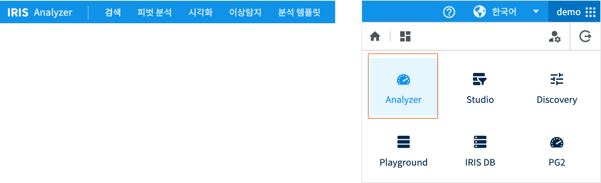
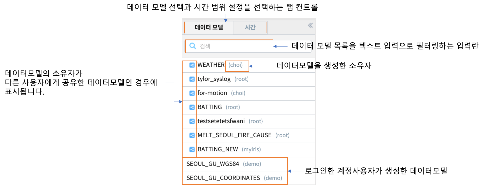

Analyzer 공통 동작
========================================

| 본 문서는 **Analyzer** 의 기능메뉴인 검색, 피벗분석, 시각화, 이상탐지, 분석탬플릿의 화면에서 공통적으로 수행해야할 동작 및 설정에 대해 설명합니다.

.. csv-table::
    :header: 기능, 설명
    :widths: 40, 150

    "검색", "데이터모델의 데이터를 Discovery-Service 명령어로 필터링, 통계, 변환, pivot, 기계학습 등을 실행할 수 있습니다."
    "피벗분석", "데이터모델의 데이터를 행과 열 기준으로 통계 및 변환하고, 챠트 기능을 제공합니다."
    "시각화", "분석 유형에 따라 분류된 차트를 통해 시각화를 통한 데이터탐색 기능을 제공합니다."
    "이상탐지", "과거 동일한 시간대의 참조 데이터 대비 조회 기간 데이터의 이상탐지 결과를 히트맵과 상/하한 임계치 챠트로 제공합니다."
    "분석탬플릿", "Analyzer 메뉴에서 검색한 데이터모델, 시간설정, 검색어를 재검색 및 Studio 의 데이터설정에 사용할 수 있도록 탬플릿으로 저장할 수 있습니다."

데이터 모델 선택
----------------------------------------

| Analyzer 에서 조회할 데이터모델을 선택하는 탭으로서 Analyzer 의 모든 기능 메뉴에서 공통적으로 사용됩니다.

시간 범위 설정
----------------------------------------

| 선택한 데이터모델의 검색 시간 범위를 정하는 탭입니다.
| 데이터모델 생성 시에 **시간** 으로 분류되어 TIMESTAMP 유형이 설정된 컬럼이 있는 경우에는 시간 탭에서 검색 시간 범위를 설정해야 합니다.
| 참고 : `데이터모델 생성 <http://docs.iris.tools/manual/IRIS-Manual/IRIS-Analyzer/06_data_model/00_data_model.html#id3>`__ 
| 
| 사용자는 아래와 같은 2가지 방법 중 하나로 검색 기간을 설정할 수 있습니다.

.. image:: ./images/ko/datetime_picker.png
    :scale: 60%
    :alt: 데이터모델 시간설정

.. csv-table::
    :header: 번호, 구분, 설명
    :widths: 5, 40, 130

    "1", "데이터 모델/시간 탭", "데이터 모델 선택과 시간 범위 설정을 선택하는 탭 컨트롤"
    "2", "설정 방식 아코디언", "시간 설정 방식 중 하나를 선택하는 아코디언 컨트롤"
    "3", "미리 설정(프리셋)", "미리 정의된 시간 설정 중 하나를 선택"
    "4", "날짜 및 시간 입력란", "정해진 포맷으로 날짜 및 시간 텍스트를 직접 입력"
    "5", "날짜 선택 캘린더", "캘린더 UI를 통해 현재 날짜를 확인하고 날짜를 손쉽게 선택"
    "6", "시/분/초 드롭다운", "시간을 시/분/초로 나누어 드롭다운 목록을 통해 선택"

Option 1: 미리 설정
~~~~~~~~~~~~~~~~~~~~~~~~~~~~~~~~~~~~~~~~~~~~~~~~~~~~~~~~~~~~~~~~~~~~~~~~~~~~~~~~

| ‘미리 설정’에서는 미리 정의된 검색 기간 중 하나를 선택할 수 있습니다. 
| 나열되어 있는 항목들은 모두 상대 시간으로, 설정했을 경우 작업 수행 시마다 현재 시간을 기준으로 한 시간 범위가 검색 기간으로 적용됩니다.

.. csv-table::
    :header: "기간 옵션", "설명"
    :widths: 40, 140

    "전체시간", "저장된 모든 데이터 대상으로"
    "최근 N분", "검색 시점으로부터 N분 전 0초 부터 검색 시점까지"
    "최근 N시간", "검색 시점으로부터 N시간 전 0분 0초 부터 검색 시점까지"
    "최근 N일", "검색 시점으로부터 N일 전 0시 0분 0초 부터 검색 시점까지"
    "지난 N분", "검색 시점으로부터 N분 전 0초 부터 검색 시점의 0초 까지"
    "오늘",  "금일 00:00:00 부터 검색 시점까지"
    "어제", "어제 00:00:00 부터 오늘 00:00:00 이전까지 (오늘 00:00:00은 미포함)"
    "이번 주",  "금주 일요일 00:00:00 부터 검색 시점까지"
    "이전 주",  "이전 주 일요일 00:00:00 부터 금주 일요일 00:00:00 까지 (금주 일요일은 미포함)"
    "이번 달",  "금월 1일 00:00:00 부터 검색 시점까지"
    "이전 달",  "이전달 1일 00:00:00 부터 금월 1일 00:00:00 까지 (금월 1일은 미포함)"
    "이번 분기", "이번 분기 1일 00:00:00 부터 검색 시점까지 (분기 시작은 1월, 4월, 7월, 10월)"
    "이전 분기", "이전 분기 1일 00:00:00 부터 이번 분기 1일 00:00:00 까지 (이번 분기 1일은 미포함)"
    "이번 년도", "금년 1월 1일 00:00:00 부터 검색 시점까지"
    "이전 년도", "작년 1월 1일 00:00:00 부터 금년 1월 1일 00:00:00까지 (금년 1일은 미포함)"
  

Option 2: 날짜 및 시간 범위 설정
~~~~~~~~~~~~~~~~~~~~~~~~~~~~~~~~~~~~~~~~~~~~~~~~~~~~~~~~~~~~~~~~~~~~~~~~~~~~~~~~

| ‘날짜 및 시간 범위’에서는 년월일에서부터 시분초까지 상세한 일자와 시간을 사용자가 직접 설정할 수 있습니다. 
| 시작 시간과 종료 시간을 나누어 설정하며, 직접 정해진 포맷(예) 2017/07/13 14:08:00)대로 입력하여 설정하거나 캘린더와 드롭다운 목록을 통해 설정할 수도 있습니다. 
| 추가로, 종료시간의 ‘현재 시간’ 체크박스에 체크를 하면 작업 수행시마다 종료시간은 현재 시간으로 적용됩니다.
| 시간 범위 설정을 하면 검색 바 좌측 상단에 설정한 시간 범위가 표기됩니다.