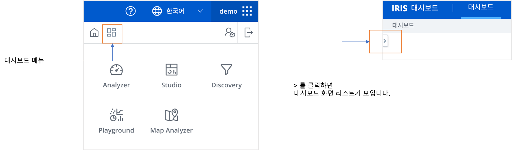
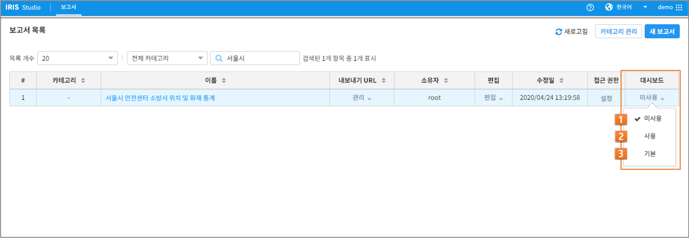
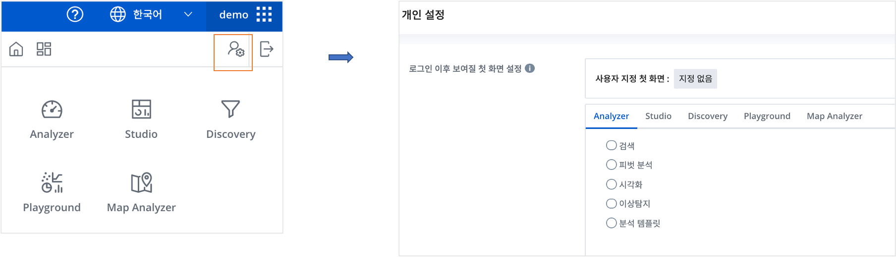
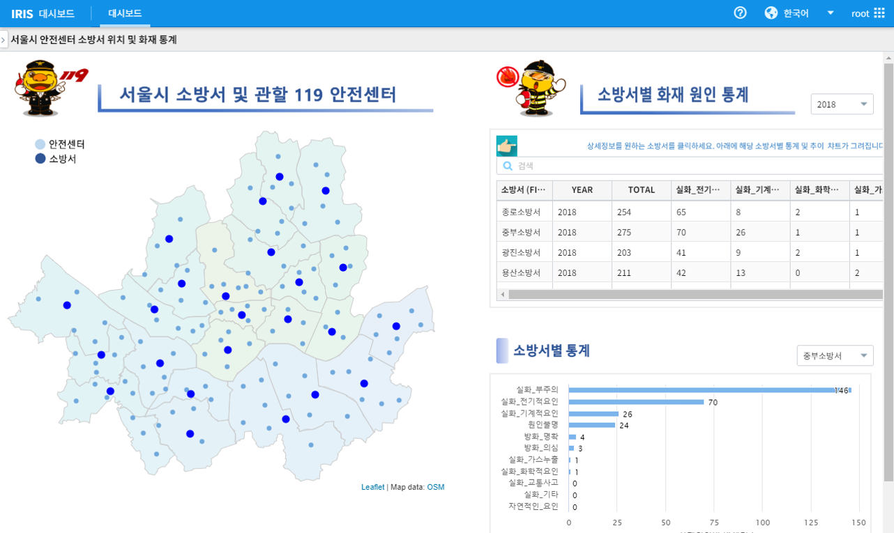

대시보드
========================================

대시보드는 IRIS Studio에서 작성된 다양한 형태의 보고서를 등록하여 관리할 수 있는 기능을 제공합니다.
최초 IRIS 접속 시 다음과 같은 화면을 확인할 수 있습니다. 

보고서를 대시보드로 등록하기
--------------------------------------------------------

IRIS Studio 를 통해 생성한 보고서를 대시보드로 등록할 수 있습니다. 

-  IRIS Studio 메뉴에서 ``보고서 목록`` 화면에서 보고서 목록의 마지막 필드인 ``대시보드`` 를 통해 대시보드와 연계할 수 있습니다. 
    - default 는 해당 보고서를 대시보드로 ``미사용`` 으로 설정되어 있습니다.

========  ==================================  =====================================================================================================================================================================================
번호      구분                                설명
--------  ----------------------------------  -------------------------------------------------------------------------------------------------------------------------------------------------------------------------------------
1         미사용                              작성된 보고서는 대시보드에서 활용되지 않음
2         사용                                선택 시 대시보드 화면에서 리스트 형태로 선택 가능
3         기본                                선택 시 사용자가 로그인 후 대시보드 화면으로 등록
========  ==================================  =====================================================================================================================================================================================

보고서를 '사용'으로 선택하기
---------------------------------------------------------

| 생성된 보고서는 '사용'으로 선택하여 대시보드 화면의 리스트에서 확인할 수 있습니다. 

| 대시보드 화면의 좌상단 옵션 버튼을 클릭하면 '사용'으로 등록된 모든 보고서의 리스트가 출력되며, 해당 보고서를 선택하여 바로 확인이 가능합니다. 

보고서를 '기본'으로 선택하기
---------------------------------------------------------

생성된 보고서는 '기본'으로 선택하여 IRIS 접속 시 대시보드 화면의 첫 번째 화면으로 확인할 수 있습니다. 

.. 대시보드는 IRIS의 데이터 노드별 CPU, 메모리, 디스크, 네트워크의 상태를 확인할 수 있고, 사용자가 장애 레벨 임계 치를 설정해 장애의 현황을 실시간으로 확인할 수 있습니다. 또한 IRIS 에서 발생하는 장애 알림 중 3가지(치명, 에러, 경고) 유형을 확인할 수 있습니다. 세션 정보는 분 단위로 세션이 발생하는 개수를 그래프로 확인할 수도 있고 현재 실행되고 있는 세션 개수도 확인할 수 있습니다. 테이블 스페이스 현황에서는 전체 디스크 용량 대비 테이블별 용량의 비중을 그래프로 확인할 수 있습니다. 테이블 스페이스는 시간당 로딩되는 용량을 확인할 수 있습니다.

.. .. image:: ./images/ko/dashboard/dashboard.png

.. ========  ==================================  =====================================================================================================================================================================================
.. 번호      구분                                설명
.. --------  ----------------------------------  -------------------------------------------------------------------------------------------------------------------------------------------------------------------------------------
.. 1         노드 상태                           데이터 노드별 리소스를 임계치 설정에 따라 확인할 수 있으며, 노드 상태 부분을 클릭하면 시스템에 리소스 사용률(이력조회) 페이지로 전환 됩니다.
.. 2         자동 넘김 ON/OFF 및 설정            자동 넘김은 대시보드에서 자동으로 노드의 탭이 넘어가는 부분을 설정할 수 있으며, 설정 버튼을 클릭하면 장애 레벨 임계치 설정 팝업을 열 수 있습니다.
.. 3         알림 현황                           IRIS-DB의 장애 정보를 확인할 수 있으며, 알림 현황 부분을 클릭하면 시스템에 장애 정보 조회 페이지로 전환 됩니다.
.. 4         세션 현황                           IRIS의 현재 세션 수와 실행된 세션 수를 분 단위 그래프로 확인할 수 있으며, 세션 현황 부분을 클릭하면 DB에 세션 관리 페이지로 전환 됩니다.
.. 5         테이블 스페이스 현황                전체 디스크 대비 테이블별 용량을 확인할 수 있으며, 테이블 스페이스 현황 부분을 클릭하면 DB에 테이블 스페이스(사용률 현황) 페이지로 전환됩니다.
.. 6         메모리/디스크 크기, 블록 개수       램 디스크와 디스크의 블록 및 개수를 설정할 수 있습니다.
.. 7         테이블 스페이스                     IRIS에 데이터가 로딩될 때 전체 테이블의 로딩되는 용량을 시간 단위 그래프로 확인할 수 있으며 테이블 스페이스 부분을 클릭하면 DB에 테이블 스페이스(사용률 조회) 페이지로 전환 됩니다.
.. ========  ==================================  =====================================================================================================================================================================================

.. _`장애 레벨 임계치 설정`
----------------------------------------
장애 레벨 임계치 설정은 CPU, 메모리, 디스크에 대한 알림, 경고, 주요, 위험 4단계를 각각 퍼센트(%) 별로 설정 할 수 있으며, 설정 정보 기준으로 대시보드 노드 상태 부분이 CPU, 메모리, 디스크 임계치 중 가장 높은 것을 기준으로 색이 변합니다.

.. .. image:: ./images/ko/dashboard/threshold.png

.. 예를 들어 위 설정의 기준으로 현재 노드의 CPU 30%, 메모리 60%, 디스크 50%라 가정 했을 때 CPU는 경고 영역, 메모리는 주요 영역, 디스크는 경고 영역 이므로 장애 레벨이 3개중 가장 높은 것이 주요 영역(메모리)이므로 해당 노드는 노드 상태 부분에서 주황색으로 표시됩니다.

