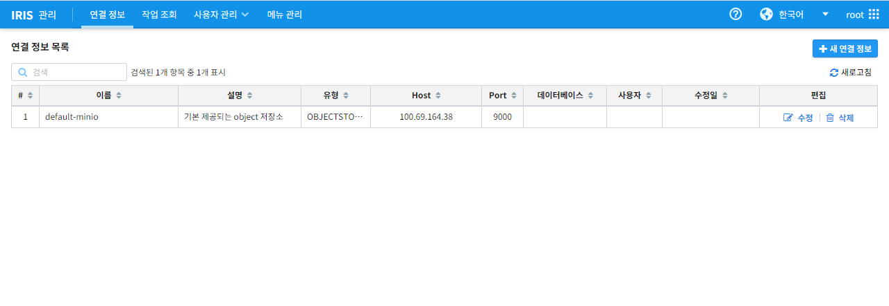
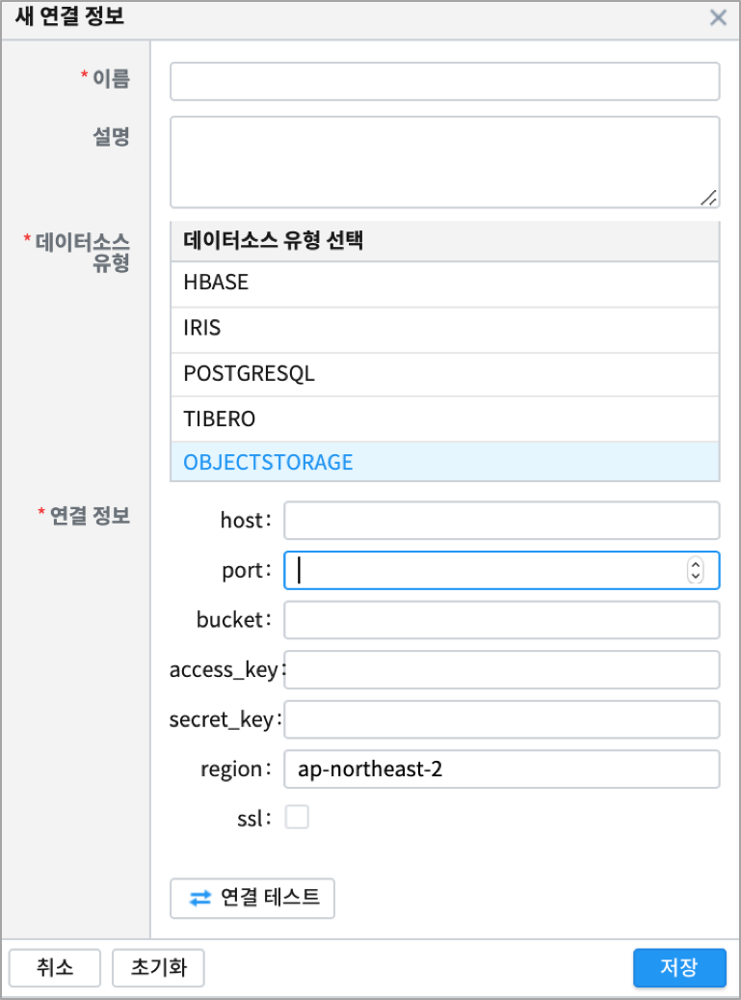
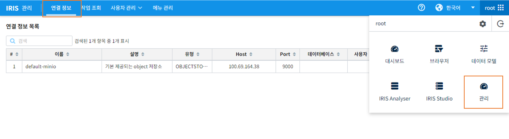
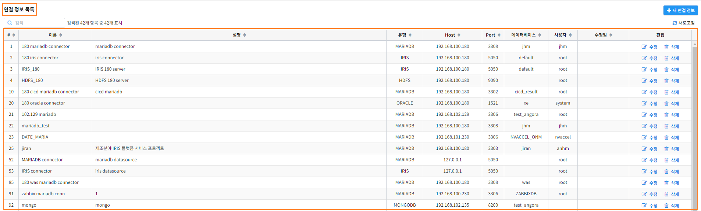
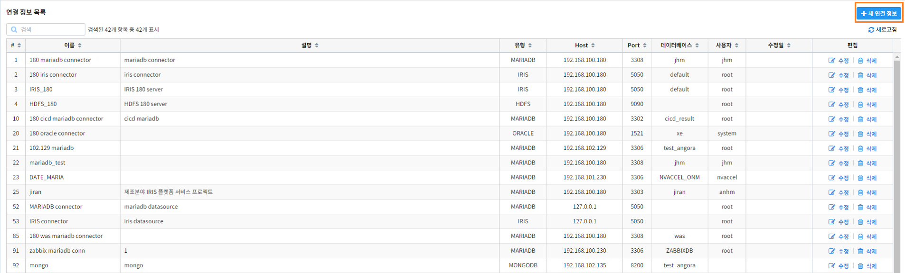
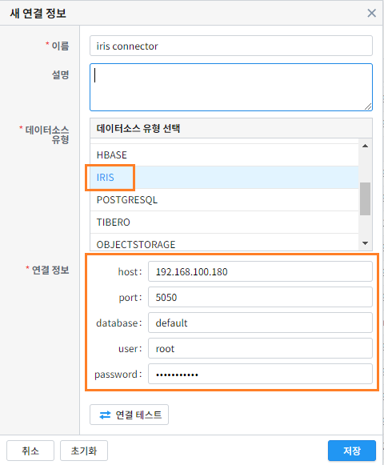
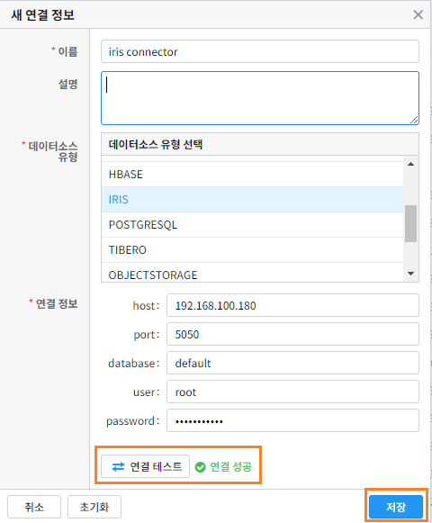
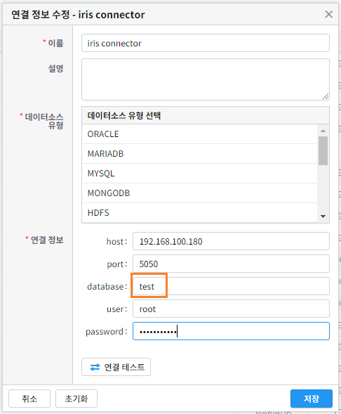
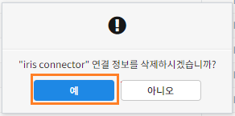

연결 정보
================================

연결정보에서는 IRIS에서 사용할 수 있는 외부 데이터 소스를 선택하고 연결, 관리할 수 있는 기능을 제공합니다. 

연결 가능한 외부 데이터 소스 목록은 다음과 같습니다. 
(연결 가능한 데이터 소스 유형은 지속적으로 업데이트/추가되고 있습니다)

.. csv-table::
   :header: 순번, 데이터 소스 이름, 관련 URL

    1, "MariaDB", "www.mariadb.org"
    2, "IRIS", "mobigen.com/solution/IRIS-Big-data-DB-Cluster.php"
    3, Oracle, oracle.com
    4, MySQL, mysql.com
    5, MySQL5, mysql.com
    6, MONGODB, mongodb.com
    7, HDFS, hadoop.apache.org
    8, HBASE, hbase.apache.org
    9, PostgreSQL, postgresql.org
    10, Tibero, tmaxdata.com
    11, OBJECTSTORAGE, min.io
    12, Elasticsearch, elastic.co
    13, vectorwise, www.actian.com
    14, KTCloudstorage, cloud.kt.com

MINIO 에 연결정보 생성하기 
--------------------------------------

외부 및 내부 MINIO 에 연결 정보를 생성하는 예시입니다.
MINIO 가 설치되어 있는 S3, 서버 정보와 함께 bucket, access_key, secret_key 를 알고 있는 경우에만 연결 정보 만들기가 가능합니다.

MINIO 연결정보 추가
--------------------------------------------------------------------------------

IRIS UI 메뉴에서 [관리 -> 연결 정보] 를 클릭합니다.

- "+ 새 연결 정보" 추가 버튼 클릭하면 연결정보 입력 창이 뜹니다.

- **이름** 은 연결정보의 이름이며, 필수 입력 사항입니다. `데이터모델 생성 <http://docs.iris.tools/manual/IRIS-Manual/IRIS-Analyzer/data_model/00_data_model.html#id6>`__ 시 연결정보를 선택할 때 콤보박스 리스트에 보여지는 이름입니다.
- '설명' 부분은 생성한 연결정보에 대한 유의 사항이나 용도 등 사용시 도움이 되는 정보를 입력합니다.(선택 사항)  

- **데이터소스 유형** 을 OBJECTSTORAGE 로 선택합니다.
- **연결 정보** 의 내용을 입력합니다. 이 정보들은 MINIO 가 설치될 때 입력했던 정보를 그대로 입력합니다.
    - host 와 port 는 MINIO 가 설치되어 있는 서버(S3) 정보를 입력합니다.
    - bucket 은 앞으로 생성되는 object 가 들어갈 일종의 디렉토리 이름입니다. MINIO 설치 시 만든 bucket 중 연결하려는 bucket 을 입력합니다.
    - access_key, secret_key 를 입력합니다. 
    
- '연결 테스트' 를 클릭하여 시험해 봅니다.
- 저장합니다.
- Getting Started - `데이터 파일 IRIS 업로드와 분석준비 수행 <http://docs.iris.tools/manual/IRIS-Tutorial/Getting-Started/01-intro/index.html>`__ 을 통해 MinIO로 데이터를 올리고 분석을 수행하는 튜토리얼을 확인할 수 있습니다. 

연결정보 리스트 보기
--------------------

- IRIS UI 메뉴에서 [관리 -> 연결 정보] 를 클릭합니다.

- 연결정보 화면에 들어가면 연결 정보 목록을 확인 할 수 있습니다.
  (현재 IRIS SaaS 에서는 MinIO를 기본 스토리지로 제공하고 있습니다)

새로운 연결정보 추가
-------------------------

- "+ 새 연결 정보" 추가 버튼 클릭

- 연결정보 입력 창 팝업

.. image:: images/ex2-2.PNG
   :alt: New DataSource Connector Info

데이터 소스 유형 선택 및 연결 정보 입력
--------------------------------------------------------------------------------

1. "데이터소스 유형 선택" 탭에서 원하는 데이터소스 선택
2. 해당 데이터소스에 접속하기 위한 기본 정보 입력

연결 테스트 및 저장
--------------------------------------------------------------------------------

1. 입력한 정보로 "연결 테스트" 진행
2. 연결 테스트가 성공하면 저장
  2.1. 테스트를 실패하면 접속정보 정확히 입력 후 다시 진행

생성된 연결정보 수정하기
------------------------

- 수정 버튼을 눌러 연결정보를 수정
- 연결 정보를 수정한 후 연결 테스트를 진행 및 저장

.. image:: images/ex3-1.PNG
   :alt: Modify DataSource Connector Info

연결정보 삭제하기
-----------------

- 삭제 버튼을 눌러 연결 정보 삭제

.. image:: images/ex4-1.PNG
   :alt: Delete DataSource Connector Info

