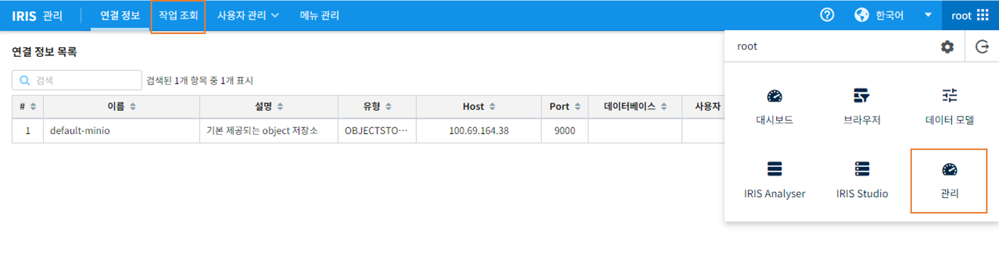
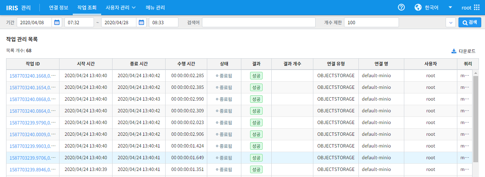
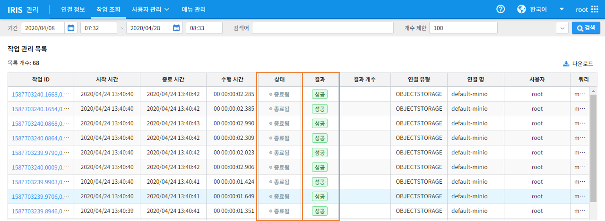
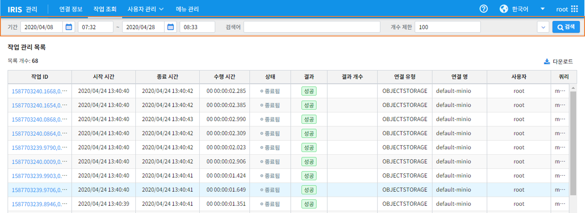
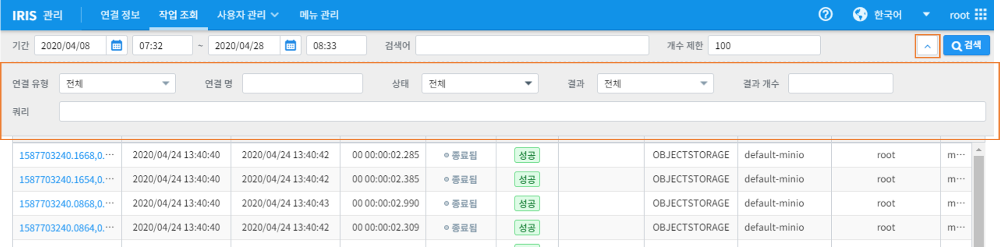

작업 조회
================================

작업조회는 IRIS에서 수행한 분석작업의 목록을 확인할 수 있는 기능을 제공합니다. 목록에서는 작업의 ID, 시작 및 종료시간, 상태와 결과 등을 확인할 수 있습니다. 

작업 관리 리스트 보기
--------------------

- IRIS UI 메뉴에서 [관리 -> 작업조회] 탭을 클릭

- 작업조회 화면을 들어오면 진행된 작업들의 목록을 확인

작업 상태 및 결과 확인
-------------------------

- 작업 상태와 결과를 목록에서 확인 가능

지정한 날짜의 작업 리스트 확인
------------------------------

- 원하는 날짜 범위를 입력하여 그 시간에 실행된 작업 리스트를 확인 가능

상세 검색하기
------------------------------

- 연결유형, 상태, 결과 등을 지정하여 원하는 데이터 검색 가능

