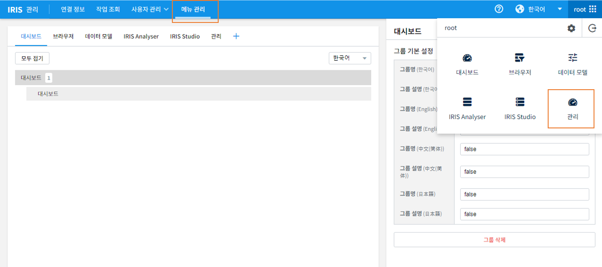
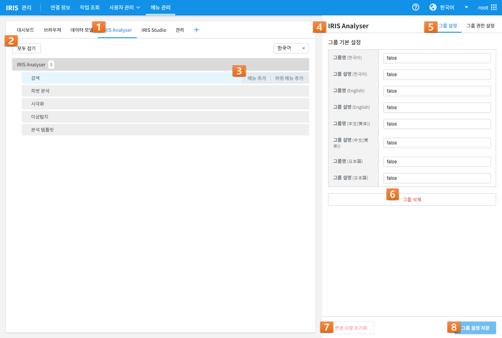
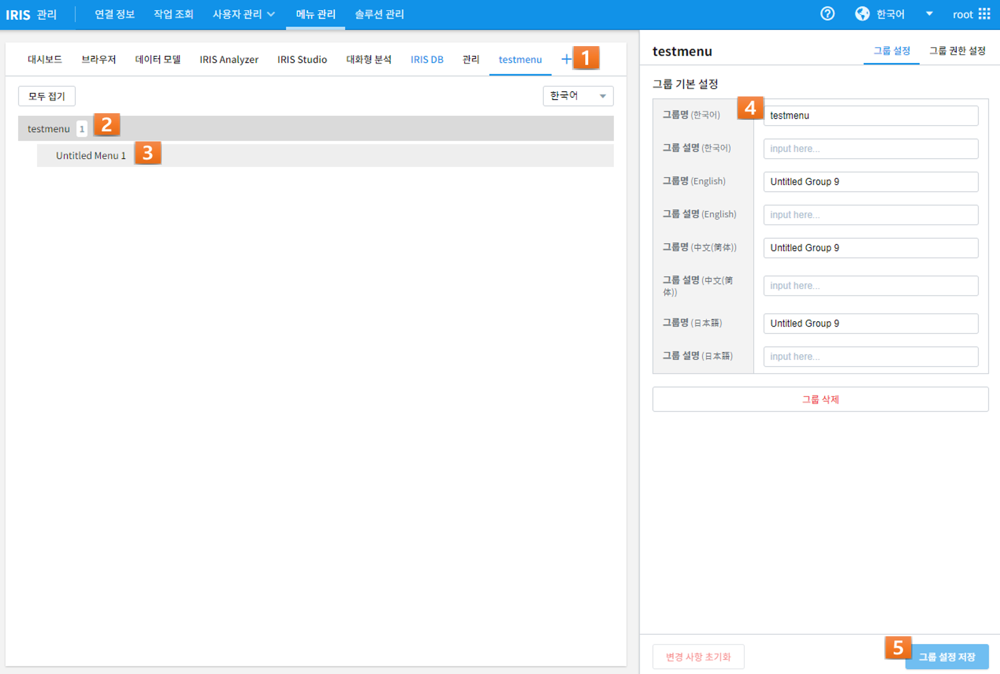
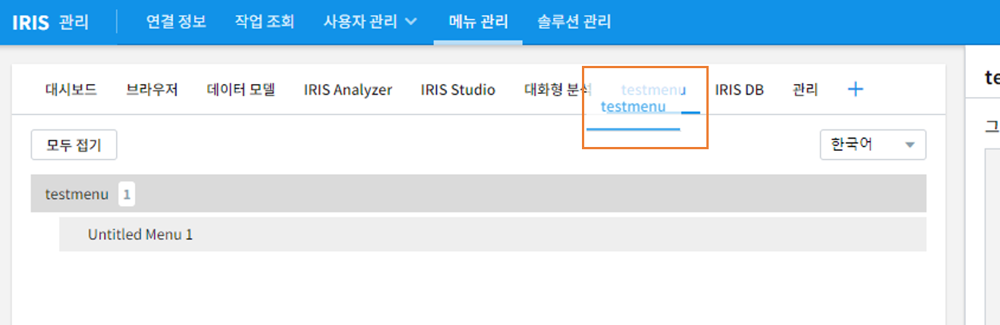
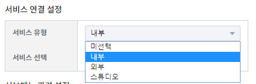
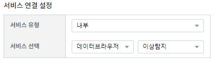

메뉴 관리
====

'메뉴 관리'를 위해 다음과 같이 ['관리'->'메뉴 관리']  로 이동합니다.




메뉴 목록
---------

메뉴의 목록을 확인할 수 있습니다. 



=========  ====================================================================================================================================
번호                                설명
---------  ------------------------------------------------------------------------------------------------------------------------------------
1          편집하고 싶은 대메뉴를 선택합니다. 
2          선택한 대메뉴의 하위메뉴 리스트가 출력됩니다. '모두 접기'와 언어선택이 가능합니다. 
3          '메뉴 추가'로 동일 레벨의 새로운 메뉴를, '하위 메뉴 추가'로 선택된 메뉴의 하위에 새로운 메뉴를 생성합니다.
4          현재 선택된 메뉴 그룹의 정보를 출력합니다.
5          선택된 메뉴에 대해 그룹과 그룹 권한을 설정할 수 있습니다.
6          선택된 메뉴 그룹을 삭제합니다. 
7          해당 페이지의 변경사항을 초기화 합니다. 
8          변경된 설정을 저장합니다. 
=========  ====================================================================================================================================


메뉴 추가
---------

화면 상단의 '+' 버튼을 클릭하면 다음과 같이 새로운 메뉴 그룹이 생성됩니다.



=========  ====================================================================================================================================
번호                                설명
---------  ------------------------------------------------------------------------------------------------------------------------------------
1          '+'버튼을 클릭하면 새로운 메뉴 편집창이 출력됩니다.
2          하위 메뉴를 갖는 대메뉴가 생성됩니다.
3          하나의 대메뉴는 최소 1개의 하위 메뉴를 갖습니다.
4          생성한 대메뉴의 이름을 기입합니다. 한국어/영어/중국어/일본어를 사용할 수 있습니다.
5          편집한 메뉴를 저장합니다.
=========  ====================================================================================================================================

추가 위치
~~~~~~~~~

메뉴 추가 위치를 결정합니다.
메뉴는 Drag-and-drop으로 위치를 지정할 수 있습니다.




서비스 유형
~~~~~~~~~~~

셍성한 서브메뉴는 다음 4가지 서비스 유형을 선택할 수 있습니다. 



==================================  ==================================================================================================================================
항목                                설명
----------------------------------  ----------------------------------------------------------------------------------------------------------------------------------
미선택                              새롭게 생성할 메뉴를 비활성화 상태로 추가합니다. 메뉴 목록에 추가는 되지만 실제 내용이 없기떄문에 메뉴로 진입할수는 없습니다.
내부                                새롭게 생성할 메뉴를 IRIS-WEB 내부에서 사용하는 기존 페이지와 동일한 형태로 생성하고자 하는 경우 해당 옵션을 사용합니다.
외부                                새롭게 생성할 메뉴를 IRIS-WEB 외부에서 사용하는 기존 페이지와 동일한 형태로 생성하고자 하는 경우 해당 옵션을 사용합니다.
Studio                              새롭게 생성할 메뉴를 IRIS-WEB에서 생성한 특정 보고서와 동일한 형태로 생성하고자 하는 경우 해당 옵션을 사용합니다.
==================================  ==================================================================================================================================


미선택
``````
미선택으로 설정시 메뉴는 활성화되지 않은 상태로 생성됩니다.


내부
````

| 내부로 설정시, 새롭게 만들 메뉴를 기존 페이지 중 어떤 페이지와 동일한 형태로 생성할지 결정합니다.
| 예를들어, 다음과 같이 '서비스'를 '데이터브라우저', '페이지'를 '이상탐지'로 설정해보겠습니다.



이대로 생성하면 미선택일때와는 다르게 메뉴가 활성화 되고, 메뉴를 클릭하면 다음과 같이 '데이터브라우저'의 '이상탐지'와 동일한 화면으로 생성된 것을 확인할 수 있습니다.

.. image:: ./images/11.menu_added_move.png


외부
````

| 외부로 설정시, 새롭게 만들 메뉴를 외부 페이지 중 어떤 페이지와 동일한 형태로 생성할지 결정합니다.
| 예를들어, 다음과 같이 서비스 URL에 ``http://monaco.mobigen.com`` 을 설정해 보겠습니다.


.. image:: ./images/19.menu_external.png

해당 메뉴로 이동시, 다음과 같이 메뉴 생성시 설정한 URL로 이동하는것을 확인할 수 있습니다.

.. image:: ./images/20.menu_external_enter.png


Studio
```````
| Studio로 설정시, 새롭게 만들 메뉴를 기존에 생성해놓은 보고서로 설정할 수 있습니다.
| 따라서 해당 설정을 사용하려면 사전에 미리 생성해놓은 보고서가 있어야합니다.
| 다음과 같이 아무런 목록도 보이지 않을 경우, 보고서를 생성해주어야합니다.

.. image:: ./images/12.menu_studio_empty.png

다음과 같이 'TEST_REPORT'라는 이름의 빈 보고서를 생성해보겠습니다.

.. image:: ./images/13.report_create.png

보고서 생성 후 다시 확인해보면 다음과 같이 생성한 보고서가 목록에 추가된것을 확인할 수 있습니다.

.. image:: ./images/14.menu_studio_report.png

저장버튼을 누르고 생성된 메뉴를 클릭하면 다음과 같이 보고서 화면으로 이동하는 것을 확인할 수 있습니다.

.. image:: ./images/15.menu_studio_created.png

메뉴 편집
--------
메뉴 목록의 '편집' 컬럼을 클릭하면 하위 메뉴로 '수정', '삭제' 항목을 확인할 수 있습니다.

.. image:: ./images/16.menu_edit_edit.png

'수정' 버튼을 클릭하면 다음과 같이 메뉴를 생성했을때와 동일한 화면이 생성됩니다.

좌측 상단의 텍스트가 '메뉴 추가'에서 '메뉴 생성'으로 변경된 것을 확인할 수 있습니다.

.. image:: ./images/17.menu_edit_detail.png

메뉴를 생성했을때와 동일한 방식으로, 원하는 형태로 메뉴를 수정 후 저장하면 됩니다.


메뉴 삭제
---------

| 생성되어있는 메뉴를 삭제하는 기능입니다.
| 메뉴 편집시에 클릭했던 '편집' 컬럼을 클릭 후, '삭제' 버튼을 클릭하면 다음과 같이 확인창이 생성됩니다.

.. image:: ./images/18.menu_delete_q.png

'예' 버튼을 클릭하면 해당 메뉴가 삭제된 것을 확인할 수 있습니다.
