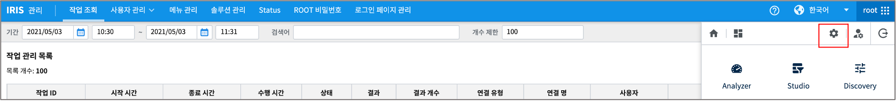
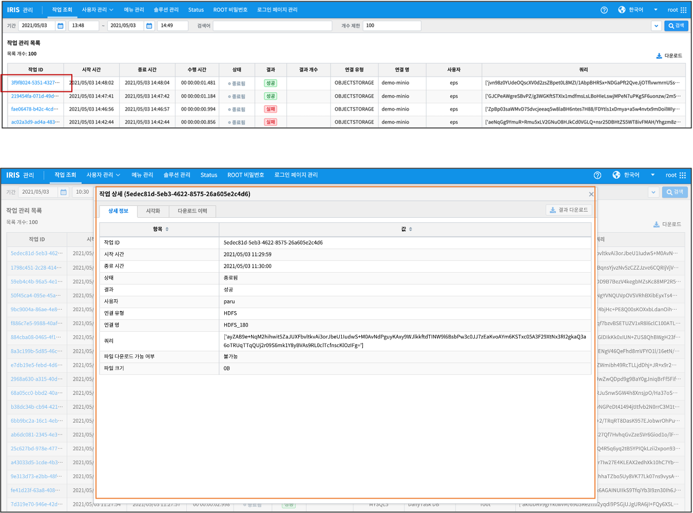
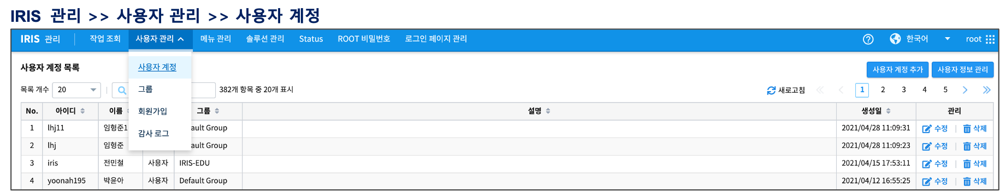
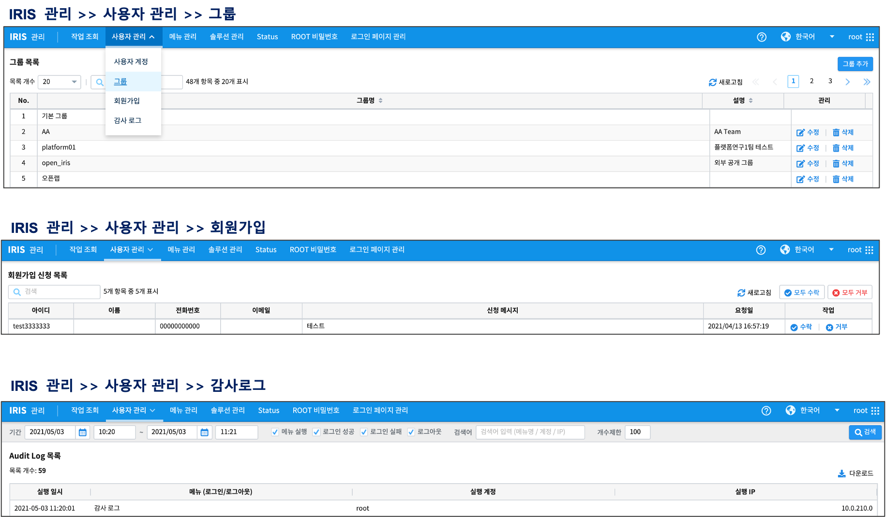
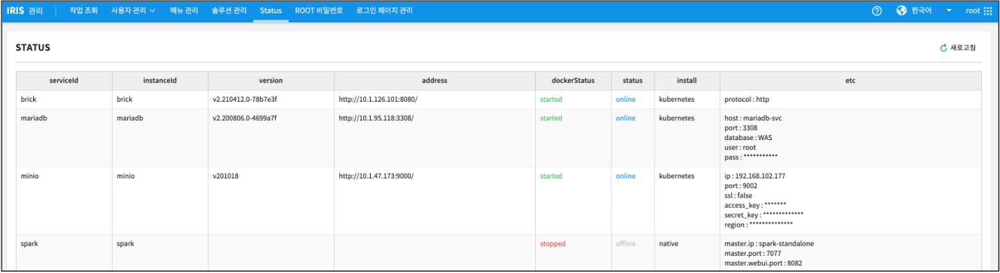
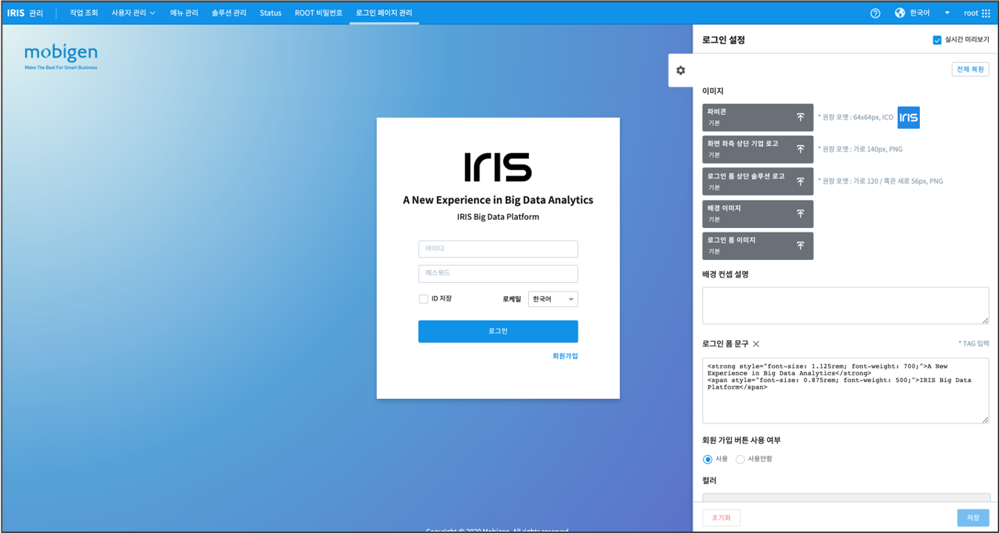

IRIS 관리
==========================================

IRIS 화면 오른쪽 상단의 버튼(아래 그림)을 클릭하면 ``IRIS 관리``  화면으로 들어갑니다.  root 권한 계정으로 ``IRIS 관리`` 의 모든 기능을 사용할 수 있습니다.

.. csv-table::
    :header: 구분, 설명

    작업 조회, "IRIS를 통해 수행되고 있는 작업의 진행상태, 결과, 사용자, 쿼리 등을 조회하고 관리합니다."
    사용자 관리, "IRIS의 사용자 계정과 그룹을 생성하거나 편집하며, 회원 가입, 감사 로그 등을 관리합니다."
    몌뉴 관리, "IRIS 의 모든 상위 메뉴 단위로 사용자, 그룹 별로 하위 메뉴 구성, 권한 부여, 메뉴별 로고 이미지 등을 관리합니다." 
    솔루션 관리, "``네이버 지도 어플리케이션 키`` 관리처럼 네이버 지도 솔류션을 IRIS 내부에서 사용하기 위한 관리 메뉴입니다."
    status, "IRIS 내 모든 pod 에 대한 현황 정보를 볼 수 있는 메뉴입니다."
    ROOT 비밀번호, "root 비밀번호 변경 메뉴입니다."
    로그인 페이지 관리, "로그인 페이지의 이미지와 항목 등을 설정하는 화면입니다."

- 작업 조회
    - 상세 조회를 원하는 ``작업 ID`` 를 클릭하면 상세 조회 팝업 창이 뜹니다. IRIS DSL 을 제외한 sql 문은 암호화되어 표시됩니다.
    - 작업 시작 시간, 종료 시간, 검색 필터 구문을 넣어서 문제가 되는 시점의 작업 진행 현황이나 사용자 특이 사항을 파악할 수 있습니다.

- 사용자 관리 
    - 사용자 계정 
        - 사용자 계정 추가 / 사용자 정보 관리 기능
    - 그룹
        - 그룹 추가
    - 회원 가입
        - 회원 가입 신청 목록에서 회원 가입에 대한 수락 / 거절을 할 수 있습니다.
    - 감사 로그
        - Audit Log 목록에서 시간, 로그인/로그아웃, 사용메뉴, 실행 계정, 실행 IP 를 조회할 수 있습니다.

- status

- 로그인 페이지 관리

