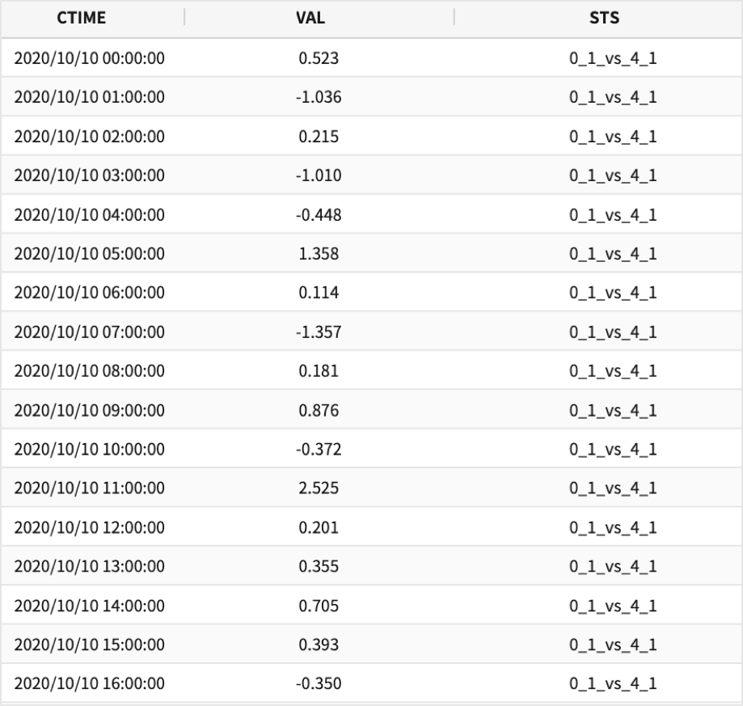
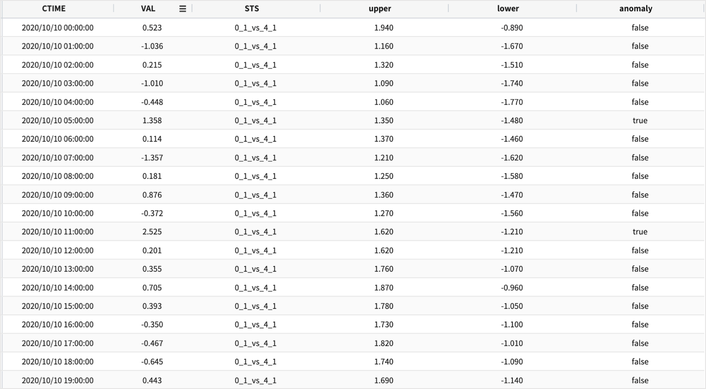
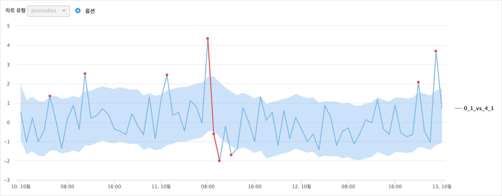
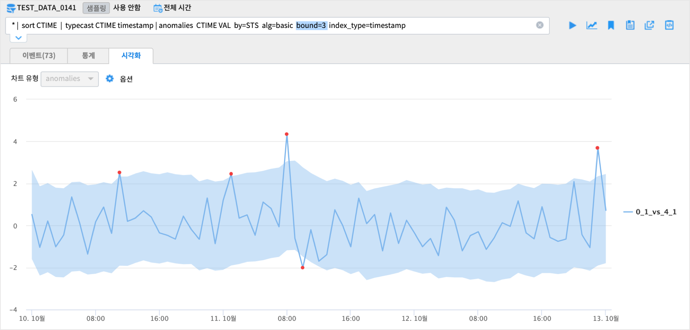
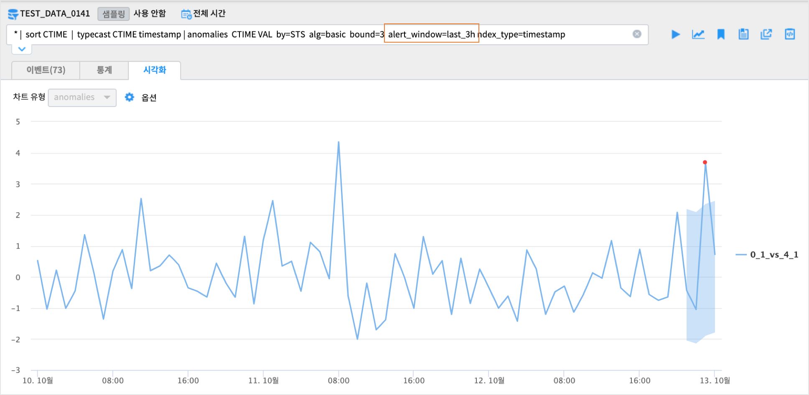
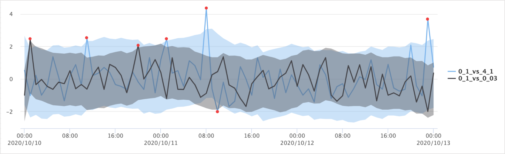
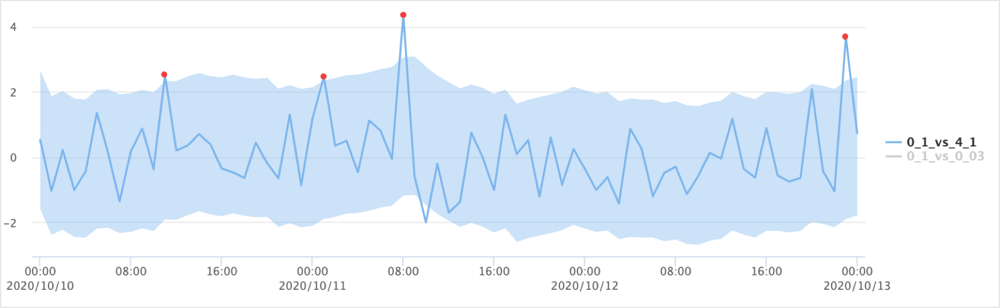
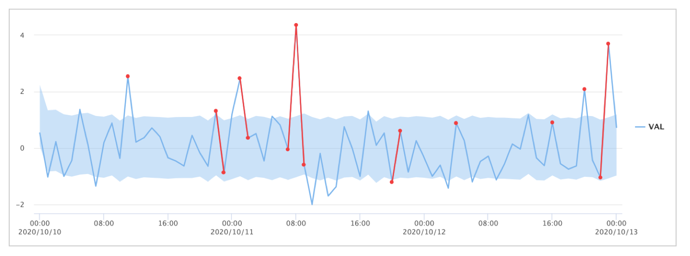

anomalies
====================================================================================================

개요
----------------------------------------------------------------------------------------------------

주어진 input 데이터에서 일반적인 범위를 벗어난 비정상적인 값을 찾아내는 기능입니다.

설명
----------------------------------------------------------------------------------------------------

| Input 으로 받은 Data 를 대상으로 anomaly 한 값을 찾습니다.
| 옵션으로 입력한 이상탐지 알고리즘(basic / robust) 을 적용하여 anomal 여부를 알 수 있는 컬럼을 추가하여 Dataframe 형식의 data를 결과로 반환합니다.
| 옵션으로 명령어 실행 결과에서 anomalies 로  판명된 값만 따로 뽑아내는 것도 가능합니다.

Parameters
----------------------------------------------------------------------------------------------------

.. code-block:: bash

   * | anomalies index target
                 (by=<column>)?
                 (alg=(basic|robust))?
                 (bound=<0 초과 실수>)?
                 (direct=(below|above|both))?
                 (alert_window=last_<숫자><suffix>)?
                 (seasonality=(additive|multiplicative))?
                 (period=<정수>)?
                 (index_type=(timestamp|date))?

.. list-table::
   :header-rows: 1
   :widths: 15 55 20 10 10

   * - 이름
     - 설명
     - 적용알고리즘
     - 기본값
     - 필수/옵션
   * - index
     - 시계열 데이터에서 시간 필드명 입니다.
     - basic, robust 공통
     - 
     - 필수
   * - target
     - anomaly 탐지할 대상 데이터 필드명 입니다.
     - basic, robust 공통
     - 
     - 필수
   * - by
     - 그룹으로 각각의 이상탐지를 시행 |br| 예 : by=fieldA
     - basic, robust 공통
     - 
     - 옵션
   * - alg
     - basic/robust 알고리즘 선택 가능 |br| basic: 기본통계 |br| robust: STL decomposition |br| 예 : alg=robust
     - 
     - basic
     - 옵션
   * - bound
     - 임계값 범위의 scale을 지정 |br| 위의 수식에 z값의 배수값으로 bound가 커지면 upper/lower limit 의 범위가 늘어납니다.
     - basic, robust 공통
     - 2
     - 옵션
   * - direct
     - anomaly 한 값을 판정할 때 이상치의 방향을 below/above/both 로 선택 |br| below: lower 보다 낮은 수치 |br| above: upper 보다 높은 수치 |br| both: below and above
     - basic, robust 공통
     - both
     - 옵션
   * - alert_window
     - 최근 시간 범위 내 이상치 값을 탐지 |br| 예 : last_60s 이면 최근 60초 이내 데이터 중 이상치를 탐지 |br| 예 : last_1m 이면 최근 1분 이내 데이터 중 이상치를 탐지 br| 예 : last_1h 이면 최근 1시간 이내 데이터 중 이상치를 탐지
     - basic, robust 공통
     -
     - 옵션
   * - seasonality
     - additive/multiplicative 모델 선택 가능, 약자 사용 가능 |br| additive(a, add): ``trend + seasonality + erro``, 데이터의 진폭이 일정할 경우 사용(실수) |br| multiplicative(m, multi): ``trend * seasonality * erro``, 데이터의 폭이 점점 증가하거나 감소할 때 사용(**0제외**)
     - alg=robust 일 때 사용
     - additive
     - 옵션
   * - period
     - robust 알고리즘을 사용 할 때 사용되는 옵션으로, timeseries 의 기간 옵션
     - alg=robust 일 때 사용
     - 6
     - 옵션
   * - index_type
     - index 로 지정되는 시계열 데이터가 시간데이터가 포함된 것인지(timestamp), day 단위 데이터인지 (date) 구분을 하여 입력
     - basic, robust 공통
     - timestamp
     - 옵션

- basic : 평균과 표준 편차를 활용한 단순 통계적 방법을 사용하였습니다.

    - 1.959964는 신뢰구간 95% z상수 값입니다. z상수 값으로 upper limit와 lower limit 를 구하여 이상치를 판단합니다.

.. code::
    
    confidence = 1.959964 * stddev * float(self.bound)

- robust : Seasonal_Decomposition을 사용한 알고리즘입니다. 계절성, 추세, 잔차 값을 구별하여 잔차 값으로 임계값을 구하여 이상치를 판단합니다.
    - seasonality = additive 는 target 필드의 값에 `` null``  이 있으면 안됩니다.
    - seasonality = multiplicative  는 target 필드의 값에 `` 0 `` 이 있으면 안됩니다.
    - seasonality = additive 를 빼고 실행할 수 있습니다.( default 로 seasonality = additive )

**검색어 사용예시**

.. code-block:: bash

  #### alg=basic ####

  # anomalies INDEX TARGET 
   ... | anomalies CTIME PM2_5 
   ... | anomalies CTIME PM2_5 alg=basic

  # anomalies INDEX TARGET by=그룹컬럼 bound=숫자 direct=[below|above|both]
   ... | anomalies CTIME PM2_5 by=station bound=3 direct=below
   ... | anomalies CTIME PM2_5 by=station bound=3 direct=above

  # anomalies INDEX TARGET by=그룹컬럼 bound=숫자 direct=[below|above|both] alert_window=last_숫자[s|m|h]
   ... | anomalies CTIME PM2_5 by=station bound=3 direct=below alert_window=last_1h
   ... | anomalies CTIME PM2_5 by=station bound=3 direct=above alert_window=last_1m
   ... | anomalies CTIME PM2_5 by=station bound=3 direct=both alert_window=last_10m

  # anomalies INDEX TARGET by=그룹컬럼 bound=숫자 direct=[below|above|both] index_type=[timestamp|date]
   ... | anomalies CTIME PM2_5 by=station bound=3 direct=both index_type=timestamp

   ... | anomalies YYYYMMDD PM2_5 by=station bound=3 direct=both index_type=date

  
  
  #### alg=robust ####

  # anomalies INDEX TARGET alg=robust
   ... | anomalies CTIME PM2_5 alg=robust

  # anomalies INDEX TARGET by=그룹컬럼 alg=robust period=정수 bound=정수 direct=[below|above|both]
   ... | anomalies CTIME PM2_5 by=station alg=robust period=12 bound=3 direct=below
   ... | anomalies CTIME PM2_5 by=station alg=robust period=6 bound=3 direct=above

  # anomalies INDEX TARGET by=그룹컬럼 alg=robust bound=숫자 direct=[below|above|both] alert_window=last_숫자[s|m|h]
   ... | anomalies CTIME PM2_5 by=station alg=robust bound=3 direct=below alert_window=last_1h
   ... | anomalies CTIME PM2_5 by=station alg=robust bound=3 direct=above alert_window=last_1m
   ... | anomalies CTIME PM2_5 by=station alg=robust bound=3 direct=both alert_window=last_10m

  # anomalies INDEX TARGET by=그룹컬럼 alg=robust bound=숫자 direct=[below|above|both] index_type=[timestamp|date]
   ... | anomalies CTIME PM2_5 by=station alg=robust bound=3 direct=both index_type=timestamp

   ... | anomalies YYYYMMDD PM2_5 by=station alg=robust bound=3 direct=both index_type=date

Examples
----------------------------------------------------------------------------------------------------

예제 1 - basic 알고리즘 / 1개 그룹
''''''''''''''''''''''''''''''''''''''''''''''''''

- 데이터 모델 : **TEST_DATA_0141**   데이터 개수 73개
    - 평균 0, 표준편차 1 인 정규 분포 데이터에서 랜덤 샘플링한 데이터 70개
    - 평균 4, 표준편차 1 인 정규 분포 데이터에서 랜덤 샘플링한 데이터  3개 

   

- 검색어 : anomalies 시간인덱스 값필드 by=그룹키 alg=basic  index_type=timestamp

.. code::

  * | sort CTIME | typecast CTIME timestamp 
    | anomalies  CTIME VAL  by=STS  alg=basic  index_type=timestamp

- 결과

- 시각화 챠트 결과

- 검색어

.. code::

  * | sort CTIME | typecast CTIME timestamp 
    | anomalies  CTIME VAL  by=STS  alg=basic  bound=3  index_type=timestamp

- 검색어

.. code::

  * | sort CTIME | typecast CTIME timestamp 
    | anomalies  CTIME VAL  by=STS  alg=basic  bound=3  alert_window=last_3h index_type=timestamp

예제 2 - basic 알고리즘 / 2개 그룹
''''''''''''''''''''''''''''''''''''''''''''''''''

- 데이터 모델 : **TEST_DATA_0141_01003**   데이터 개수 146건,  2개 그룹
    - 2개 그룹 : STS = '0_1_vs_4_1' , STS = '0_1_vs_0_03'

- 검색어

.. code::

  * | sort CTIME | typecast CTIME timestamp  
    | anomalies  CTIME VAL  by=STS  alg=basic  bound=3  index_type=timestamp

   

- 검색어  : direct = above  로 상한임계선을 벗어난 경우만 anomaly 로 판정

.. code::

  * | sort CTIME  | typecast CTIME timestamp 
    | anomalies  CTIME VAL  by=STS  alg=basic  bound=3  direct = above index_type=timestamp
  

예제 3 - robust 알고리즘 / 1개 그룹
''''''''''''''''''''''''''''''''''''''''''''''''''''''''''''''''''

- 데이터 모델 : **TEST_DATA_0141** 

  
.. code-block:: bash

   * | sort CTIME | typecast CTIME timestamp 
     | anomalies  CTIME VAL  by=STS  alg=robust period=3  index_type=timestamp

현재(2020.11월) 이 그림에 보이는 범위는 residuals 의 upper / lower  limit 입니다.
향후에 residuals 의 upper / lower limit 그래프를 따로 제공할 예정입니다.

- residuals 의 상/하한 임계치 그래프 예시

.. image:: images/anomalies_new_15_2.png
   :scale: 60%
   :alt: anomalies TEST_DATA_0141 15 2

