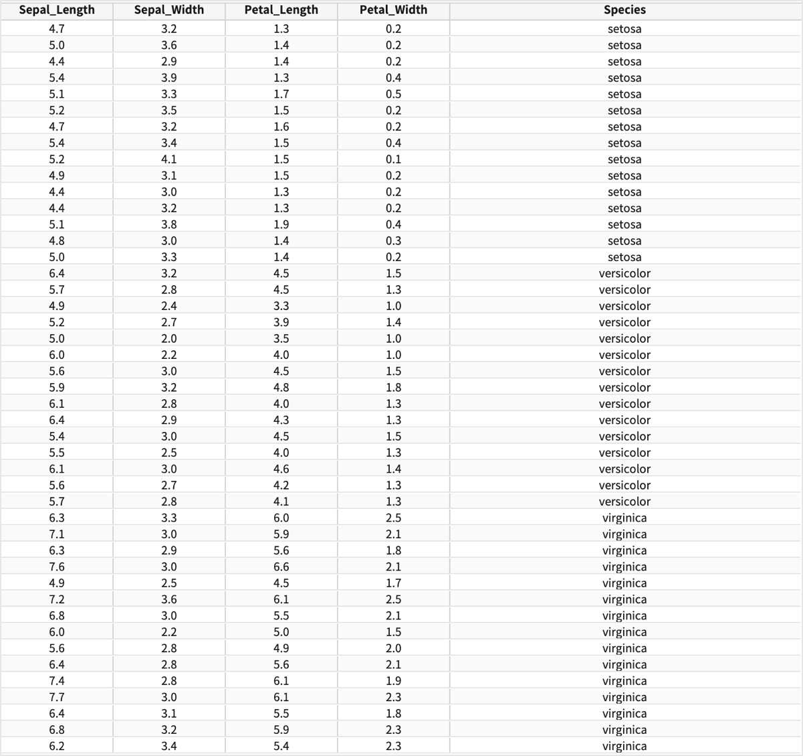
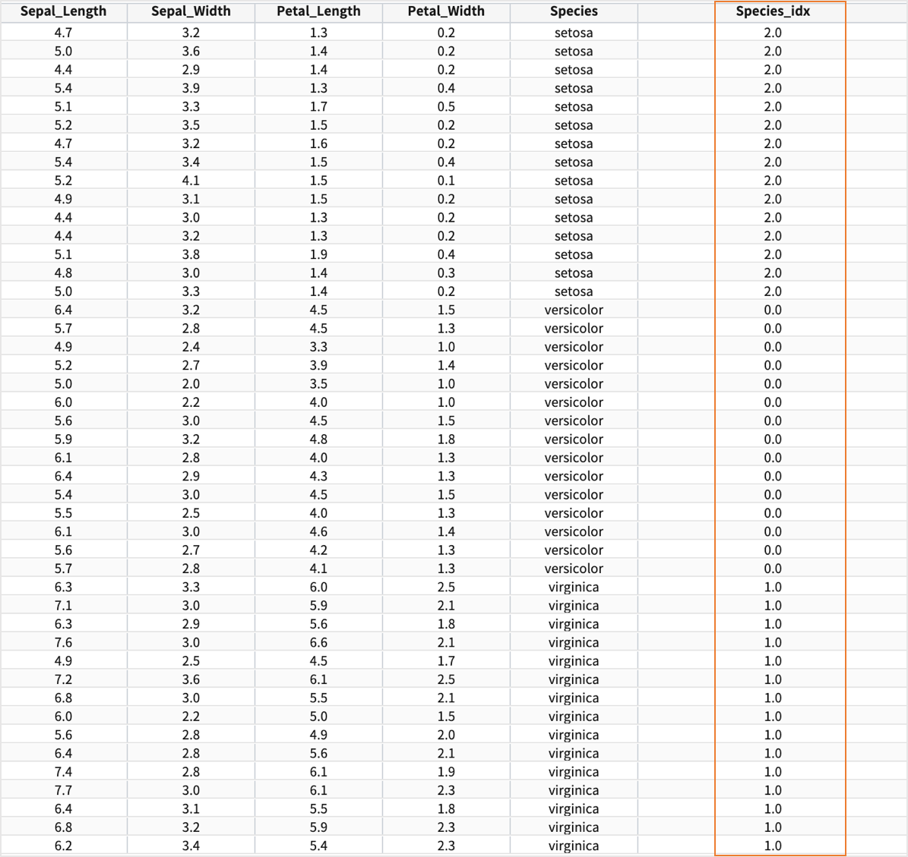

indexer
====================================================================================================

indexer 명령어 문법 및 연동규격 설명서 입니다.

컬럼 타입
----------------------------------------------------------------------------------------------------

개요
----------------------------------------------------------------------------------------------------

| 기계학습을 위해서 label 에 해당하는 컬럼을 0 부터 시작하는 정수로 변환하는 명령어입니다.
| **문자형** 변수 뿐만 아니라 **숫자형** 변수도 indexer 로 변환 과정을 거쳐야 정확한 모델링이 이루어지므로,
| scaler 와 함께 기계학습 모델링에 사용되는 명령어 입니다.

.. code::

  .. | indexer A to B

| A 필드는 데이터의 label 에 해당하는 필드이름
| B 필드는 A 필드를 숫자형 index 로 변환하여 새로 생성할 필드의 이름
  

Examples : 붓꽃데이터
----------------------------------------------------------------------------------------------------

- 학습 데이터( training data ) 

| Sepal_Length, Sepal_Width, Petal_Length, Petal_Width 4개의 값으로 Species 를 분류하는 모델을 생성하고자 할 때
| 문자형인 Species 컬럼을 indexer 명령어로 0 으로 시작하는 숫자형 컬럼으로 된 새 컬럼을 생성합니다.

.. code::

  * | indexer Species to Species_idx

- 결과

- 붓꽃데이터의 분류모델(RandomForestClassification 알고리즘) 생성하는 명령어 예시
    
.. code::

  1. 4개 컬럼의 값을 scaler 로 normalize 하여 새 컬럼 4개를 생성하기 
  2. Species 컬럼을 indexer 로 변환하여 Species_idx 컬럼 생성하기
  3. fit RandomForestClassification 로 분류모델을 생성하여  mlmodel 저장소에 저장하기 
     

  * | scaler standard Sepal_Length to Sepal_Length_s, Sepal_Width to Sepal_Width_s, Petal_Length to Petal_Length_s, Petal_Width to Petal_Width_s
    | indexer Species to Species_idx
    | fit RandomForestClassification FEATURES Sepal_Length_s, Sepal_Width_s, Petal_Length_s, Petal_Width_s LABEL Species_idx maxDepth=20 INTO example_RF_model

