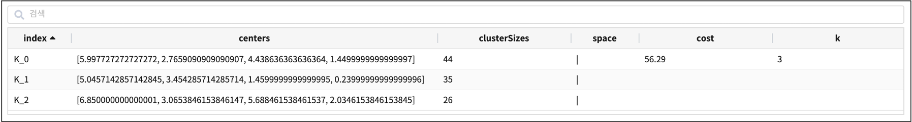
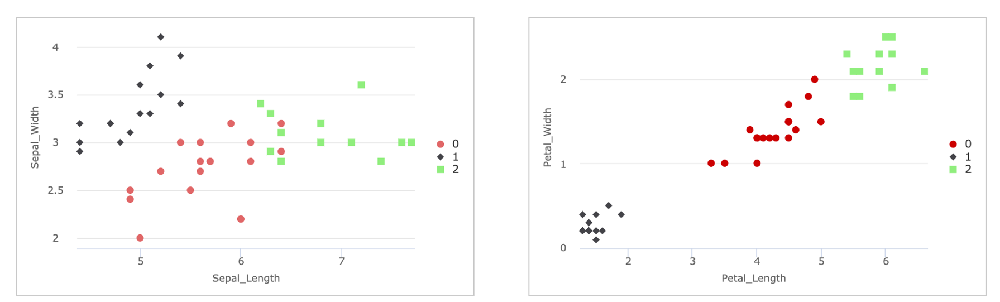

Spark Kmeans
====================================================================================================

Kmeans학습 알고리즘 설명 및 파라미터 설명서 입니다.

개요
----------------------------------------------------------------------------------------------------

Kmeans Clustering 알고리즘은 가장 대표적인 비지도학습 알고리즘 중 하나입니다.
Kmeans Clustering 은 데이터 포인트를 미리 정의 된 수(=k)의 클러스터(군집)로 분리하는 분리형 군집화 알고리즘입니다.

각 클러스터(군집)는 하나의 중심(centroid)을 가지며, 각 개체는 가장 가까운 중심에 할당됩니다.
그리고 같은 중심에 할당된 개체들이 모여 하나의 클러스터를 형성하게 됩니다.  
Kmeans Clustering 은 사전에 클러스터의 수(=k) 를 정해서 군집화를 실행해야 하는 제약사항이 있습니다.

설명
----------------------------------------------------------------------------------------------------

``fit KMeans``    명령어 구문은 학습 데이터를 input dataframe 으로 받아서 Spark ML 기반의 Kmeans 모델을 생성합니다.
생성한 학습 모델을 IRIS ML 모델 저장소에 저장하고, 신규 데이터나 테스트 데이터의 군집화에 활용할 수 있습니다.

Kmeans 모델 학습에 필요한 파라미터들을 지정할 수 있으며 지정하지 않을 시 Default 값으로 설정됩니다.

Examples
----------------------------------------------------------------------------------------------------

붓꽃 데이터의 Sepal_Length,Sepal_Width,Petal_Length,Petal_Width 4개의 feature 컬럼으로
3개의 종(Species) 그룹으로 clustering 하는 군집화 모델을 생성하고, 저장합니다.
테스트 데이터로 예측한 군집 결과로 3개의 군집으로 잘 분리했는지 학습 모델을 검증해 보는 예제입니다.

- 학습 데이터 : 붓꽃(iris) 데이터

.. list-table::
   :header-rows: 1

   * - Sepal_Length
     - Sepal_Width
     - Petal_Length
     - Petal_Width
   * - 5.1
     - 3.5
     - 1.4
     - 0.2
   * - 4.9
     - 3.0
     - 1.4
     - 0.2
   * - ...
     - ...
     - ...
     - ...

    

- 모델 생성 및 저장 
    - Sepal_Length,Sepal_Width,Petal_Length,Petal_Width  4개 필드 대상으로 k=3 개의 군집으로 분리하는 학습 모델을 만듭니다.
    - "Kmeans_model_iris"  라는 학습 모델 이름으로 ML 모델 저장소에 저장합니다.

.. code-block:: none

   ... | fit KMeans FEATURES fields k=N INTO model
   
   # example : iris 붓꽃데이터 예시
   ... | fit KMeans FEATURES Sepal_Length,Sepal_Width,Petal_Length,Petal_Width k=3 INTO Kmeans_model_iris

- fit 결과 

 

- 테스트 데이터로 군집 예측 : predict

.. code-block:: none

   ... | predict Kmeans_model_iris Sepal_Length,Sepal_Width,Petal_Length,Petal_Width

- predict 결과

.. list-table::
   :header-rows: 1

   * - Sepal_Length
     - Sepal_Width
     - Petal_Length
     - Petal_Width
     - prediction
   * - 4.7
     - 3.2
     - 1.3
     - 0.2
     - 1
   * - 5.7
     - 2.8
     - 4.5
     - 1.3
     - 0
   * - 6.8
     - 3.0
     - 5.5
     - 2.1
     - 2
   * - ...
     - ...
     - ...
     - ...
     - ...

Parameters
----------------------------------------------------------------------------------------------------

.. code-block:: none

   ... | fit KMeans FEATURES fields k=N INTO model
   
   # example : iris 붓꽃데이터 예시
   ... | fit KMeans FEATURES Sepal_Length,Sepal_Width,Petal_Length,Petal_Width k=3 INTO Kmeans_model_iris

.. list-table::
   :header-rows: 1

   * - 이름
     - 설명
     - 필수/옵션
   * - FEATURES
     - 학습에 사용될 특징 column을 입력 받습니다.
     - 필수
   * - fields
     - 특징 column들의 이름입니다.
     - 필수
   * - params
     - 알고리즘 setting 파라미터들입니다.
     - 옵션
   * - INTO_model
     - ``INTO model_name``\ 으로 이루어져 있습니다. 경로 (\ **/Biris/angora/ml**\ )에 모델 메타 데이터와 함께 저장합니다.
     - 필수
   * - k
     - 중심점의 갯수 입니다. 예시) k=3
     - 필수
   * - initMode
     - initialize mode입니다.  "random", "k-means||" 중에서 설정가능합니다. default = "k-means||" 
     - 옵션
   * - tol
     - convergence tolerance 값 입니다.
     - 옵션
   * - maxIter
     - 최대 iteration 의 수. centroid 를 찾는 step의 반복 횟수. default = 20
     - 옵션
   * - seed
     - 맨 처음 initial point를 설정할 때 주는 seed points. None 이면 seed = 0.
     - 옵션 

Parameters BNF
----------------------------------------------------------------------------------------------------

.. code-block:: none

   SparkKmeans_command : FEATURES fields k=N params INTO_model

   fields : field
           | fields COMMA field

   field : WORD
           | TIMES
           | MINUS WORD

   params : param
           | params param

   param : WORD EQUALS WORD
           | WORD EQUALS DOUBLE
           | WORD EQUALS LBRACKET words RBRACKET
           | WORD EQUALS LBRACKET doubles RBRACKET

   words : WORD
       | words COMMA WORD

   doubles : DOUBLE
           | doubles COMMA DOUBLE

   INTO_model : INTO WORD

   WORD : \w+
   COMMA : \,
   FEATURES : FEATURES | features
   INTO : INTO
   EQUALS : \=
   TIMES : \*
   MINUS : \-
   LBRACKET : \[
   RBRACKET : \]
   DOUBLE : [-+]?[0-9]+(\.([0-9]+)?([eE][-+]?[0-9]+)?|[eE][-+]?[0-9]+)

   params : initMode = "k-means||", initSteps = 2, tol = 1e-4, maxIter = 20, seed = None
