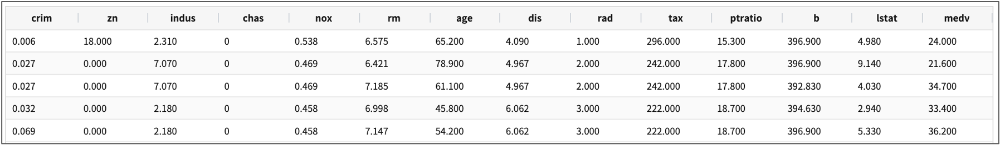
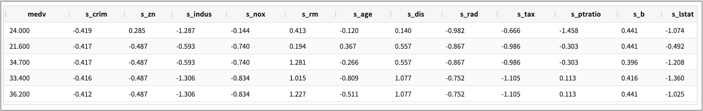
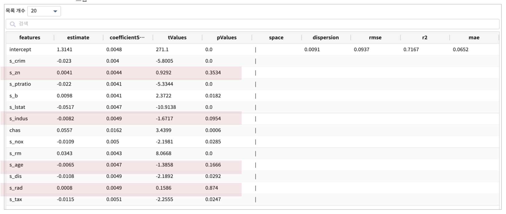
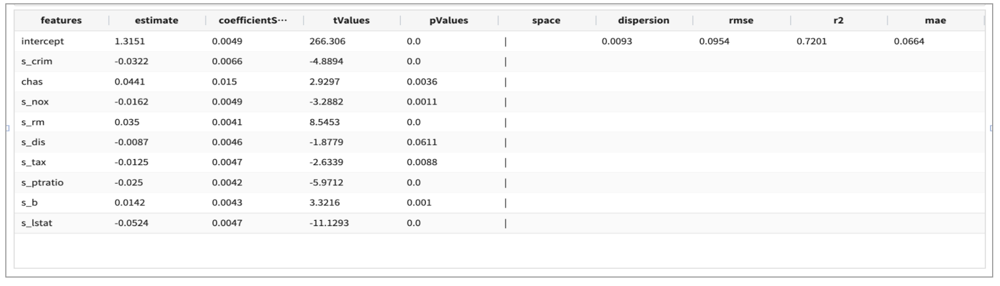
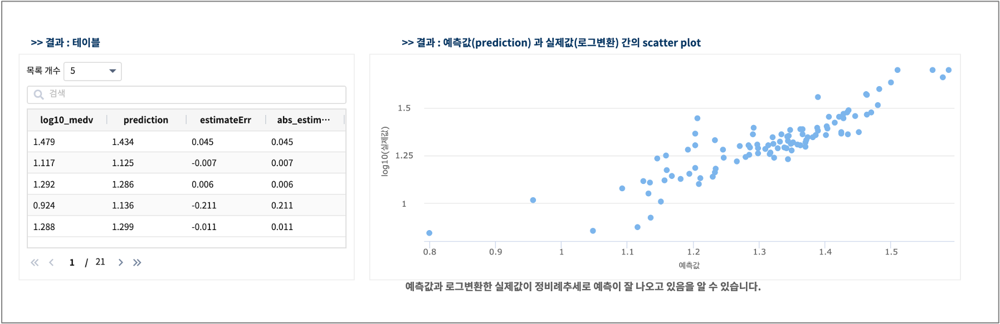

.. role:: raw-html-m2r(raw)
   :format: html

generalizedLinearRegression
====================================================================================================

개요
----------------------------------------------------------------------------------------------------

generalizedLinearRegression(일반화선형회귀) 를 이용하여 예측 모델을 학습하는 알고리즘에 대한 설명서입니다.

설명
----------------------------------------------------------------------------------------------------

선형회귀 모델의 종속변수(=Y)는 정규 분포를 따른다고 가정하여 만든 모델입니다.
일반화 선형 모델(generalized linear regression)은 선형회귀 모델을 확장하여 종속변수의 분포가 정규 분포외에 다른 확률분포(이항분포, 포아송 분포 등)도 고려한 확장 모델이라고 할 수 있습니다.
이 때 종속변수의 family 분포(gaussian, binomial, poisson, gamma and tweedie) 는 사용자가 결정해야합니다.

Examples
----------------------------------------------------------------------------------------------------

generalizedLinearRegression 알고리즘으로 주택 가격의 예측에 적용한 예제입니다. 

예제에 사용하는 데이터는 keras 의 dataset 중 하나인 boston housing 데이터입니다.
보스턴 시 주택의 가격 데이터로 여러 개의 측정지표들 (예를 들어, 범죄율, 학생/교사 비율 등) 13개를 독립변수(X)로 포함하고, 보스턴 인근의 주택 가격의 중앙값(median value) 1개를 종속변수(Y)로 하여 총 14개의 변수로 구성 되어 있습니다.

데이터 출처 : https://keras.io/api/datasets/#usage_6 

- 데이터

| 필드 설명

.. list-table::
   :header-rows: 1

   * - 속성
     - 설명
   * - crim
     - 마을별 범죄율
   * - zn
     - 주거지의 비율
   * - indus
     - 공업 지의 비율
   * - chas
     - 강변 위치 여부
   * - nox
     - 대기 중 질소 산화물 농도
   * - rm
     - 가구당 방의 개수
   * - age
     - 1940년 전에 지어진 집의 비율
   * - dis
     - 일터와의 평균 거리
   * - rad
     - 고속도로 접근성
   * - tax
     - 재산세율
   * - ptratio
     - 마을 별 학생-교사 비율
   * - b
     - 흑인 주거 비율
   * - lstat
     - 저소득층 주거 비율
   * - medv
     - 집값 중간값

- 데이터 전처리
    - 13개 변수중 범주형변수 chas(강의 경계일 때는 1,아닐 때는 0) 를 제외하고, 각각의 변수들은 측정값의 단위가 다르기 때문에 스케일링이 필요합니다.  
    - 종속변수(Y) 인 주택가격 중간값인 medv 는 고가 주택일 수록 예측값과 실제값의 차이가 클 수 있습니다. 따라서 medv 는 ``로그변환`` 합니다.

.. code-block:: none

    * | scaler standard crim to s_crim, zn to s_zn, indus to s_indus, nox to s_nox, rm to s_rm, age to s_age, dis to s_dis, rad to s_rad, tax to s_tax, ptratio to s_ptratio, b to s_b, lstat to s_lstat
      | sql "select *, log(10, medv) as log10_medv from angora"

- 모델 학습 1차 : fit GeneralizedLinearRegression
    - 1차 모델은 scaling한 변수 12개 + 범주형 변수 chas 를 설명 변수(X) 총 13개로 GeneralizedLinearRegression 알고리즘의 예측모델을 생성합니다.  
    - GeneralizedLinearRegression 은 13개 feature 변수들 중에서 종속 변수인 주택가격(log10_medv)에 영향을 주는 변수를 선택할 수 있도록 통계량(pValues)을 제공합니다.
    - pValues 가 0.05 보다 작은 s_zn, s_indus, s_age, s_rad 를 FEATURE에서 제외해서 다시 모델링을 해봅니다.

.. code-block:: none

   .. 데이터변환 ..| fit GeneralizedLinearRegression FEATURES s_crim, s_zn, s_indus, chas, s_nox, s_rm, s_age, 
                                                           s_dis, s_rad, s_tax, s_ptratio, s_b, s_lstat 
                        LABEL log10_medv maxIter=30 regParam=0.1 fitIntercept=True solver=irls  
   
   # family model 은 Gaussian(=default) 로 합니다.

- 모델 학습 2차 
    - 2차 모델은 s_zn, s_indus, s_age, s_rad  를 빼고 예측모델을 생성 / 저장합니다.

.. code-block:: none

   .. 데이터변환 .. | fit GeneralizedLinearRegression FEATURES s_crim, chas, s_nox, s_rm, s_dis, s_tax, s_ptratio, s_b, s_lstat
                                LABEL log10_medv maxIter=30 regParam=0.1 fitIntercept=True solver=irls INTO model_GLM

- 테스트 데이터로 예측 : predict
    - predict로 model_GLM 에 테스트 데이터를 입력받아 주택가격을 예측하는 명령어 예제입니다.
    - 실제값 log10_medv 와 예측값 prediction 의 예측오차와 예측오차제곱근(RMSE)를 같이 구합니다.

.. code-block:: none

   .. 데이터변환 .. | predict model_GLM s_crim, chas, s_nox, s_rm, s_dis, s_tax, s_ptratio, s_b, s_lstat
      | sql "select log10_medv, prediction, (log10_medv - prediction ) as estimateErr, 
                    sqrt(log10_medv - prediction ) as sqrt_estimateErr from angora"

Parameters
----------------------------------------------------------------------------------------------------

.. code-block:: none

   SparkGeneralizedLinearRegression_command : FEATURES fields LABEL l_field params INTO_model

.. list-table::
   :header-rows: 1

   * - 이름
     - 설명
     - 필수/옵션
   * - FEATURES fields
     - 학습에 사용될 특징 column을 입력 받습니다.
     - 필수
   * - LABEL l_fiedls
     - 학습에 사용될 라벨 column을 입력 받습니다.
     - 필수
   * - params
     - *알고리즘 옵션을 지정해줍니다.
     - 필수
   * - INTO_model
     - 모델을 저장해주는 예약어 입니다. :raw-html-m2r:` `\ 경로 (\ **/B-IRIS/USERS/dani/ML/**\ )에 모델, 모델 메타 데이터가 저장됩니다.\ :raw-html-m2r:` `\ 예 : into modelA
     - 옵션

*알고리즘 옵션

.. list-table::
   :header-rows: 1

   * - 이름
     - 설명
     - 기본값
   * - maxIter
     - 학습 반복 수
     - 100
   * - regParam
     - 정규화 계수 값
     - 0.0
   * - fitintercept
     - 훈련 데이터에 대한 증간된 표현을 사용할지 안 할지 정해주는 Boolean (편향을 학습에 사용할지 안 할지)
     - True
   * - tol
     - 최적화 함수에 대한 반복 수렴 오차 값.
     - 1e-06
   * - solver
     - 최적화 알고리즘을 정합니다.
     - irls
   * - family
     - 모델에 사용되는 오류 분포 (gaussian, binomial, poisson, gamma and tweedie)
     - gaussian
   * - link
     - 선형적인 예측과 분포 함수의 평균사이의 관계를 제공해주는 함수 (identity, log, inverse, logic, probit, cloglog, sort)
     - identity

Parameters BNF
----------------------------------------------------------------------------------------------------

.. code-block:: none

   SparkGeneralizedLinearRegression_command : FEATURES fields LABEL l_field params INTO_model
   fields : field
          | fields COMMA field
   field : WORD
         | TIMES
         | MINUS WORD
   l_field : WORD
   params : param
          | params param
          |
   param : WORD EQUALS WORD
         | WORD EQUALS DOUBLE
         | WORD EQUALS LBRACKET words RBRACKET
         | WORD EQUALS LBRACKET doubles RBRACKET
   words : WORD
         | words COMMA WORD
   doubles : DOUBLE
           | doubles COMMA DOUBLE
   INTO_model : INTO WORD
              |

   WORD = \w+
   COMMA = \,
   FEATURES = FEATURES | features
   LABEL = LABEL | label
   INTO = INTO
   EQUALS = \=
   TIMES = \*
   MINUS = -
   LBRACKET = \[
   RBRACKET = \]
   DOUBLE = [-+]?[0-9]+(\.([0-9]+)?([eE][-+]?[0-9]+)?|[eE][-+]?[0-9]+)

