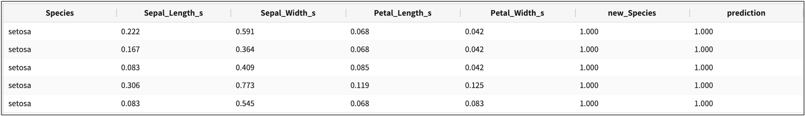

.. role:: raw-html-m2r(raw)
   :format: html

logisticRegression(LBFGS)
====================================================================================================

Logistic Regression 학습 알고리즘 파라미터 설명서 입니다.

개요
----------------------------------------------------------------------------------------------------

Logistic Regression 은 데이터가 특정 카테고리에 속할지를 0과 1사이의 연속적인 확률로 예측하는 회귀(regression) 알고리즘 중 하나입니다.
일반적인 회귀 모형은 값(Y)을 예측할 때 사용하지만, Logistic Regression 은 확률에 기반하여 특정 데이터가 어떤 카테고리에 속할지를 결정하게 되어 결국에는 분류(classification) 문제를 해결하는데 사용됩니다.

Logistic Regression 은 주로 0,1 을 구분하는 이진 분류에 많이 사용되지만, 현재(2021.04월) IRIS 에서는 3개 class 이상의 multi-class 분류만을 지원하고 있습니다.

Examples
----------------------------------------------------------------------------------------------------

붓꽃 데이터의 Sepal_Length,Sepal_Width,Petal_Length,Petal_Width 4개의 feature 컬럼으로 setosa, vercicolor, virginica 3개의 종(Species) 을 분류하는 모델을 생성하고, 저장합니다.
그리고 테스트 데이터로 생성한 분류 모델을 통해 예측을 해보고, 모델의 정확도를 검증해 보는 예제입니다.

- 학습 데이터 : 붓꽃(iris) 데이터

.. list-table::
   :header-rows: 1

   * - Sepal_Length
     - Sepal_Width
     - Petal_Length
     - Petal_Width
     - Species
   * - 5.1
     - 3.5
     - 1.4
     - 0.2
     - setosa
   * - 4.9
     - 3.0
     - 1.4
     - 0.2
     - setosa
   * - 6.6
     - 2.9
     - 4.6
     - 1.3
     - vercicolor
   * - ...
     - ...
     - ...
     - ...
     - ...

- 데이터 정규화 및 전처리 과정
    - Sepal_Length,Sepal_Width,Petal_Length,Petal_Width  4개 필드를 ``scaler minmax`` 명령어로 0 에서 1사이의 값으로 scaling 합니다.
    - text 형인 Species 필드를 ``indexer``  명령어로 0 부터 시작하는 정수형 변수로 변환합니다. 

.. code-block:: none

   * | scaler minmax Sepal_Length to Sepal_Length_s, Sepal_Width to Sepal_Width_s, 
                     Petal_Length to Petal_Length_s, Petal_Width to Petal_Width_s
     | indexer Species to new_Species | typecast new_Species integer

    
- 학습 모델 생성 및 저장 
    - 정규화 변환한 Sepal_Length_s,Sepal_Width_s,Petal_Length_s,Petal_Width_s  4개 필드 대상으로 3개의 종(Species)으로 분류하는 모델을 만듭니다.
    - "LogisticRegression_model_iris"  라는 학습 모델 이름으로 ML 모델 저장소에 저장합니다.

.. code-block:: none

   ... | fit LogisticRegression FEATURES fields1,fields2,,  LABEL 라벨컬럼 maxIter=100 (regParam=0.1 fitIntercept=True) INTO LogisticRegression_model_iris 
   
   # example : iris 붓꽃데이터 예시
   ... | fit LogisticRegression FEATURES Sepal_Length_s,Sepal_Width_s,Petal_Length_s,Petal_Width_s LABEL new_Species INTO LogisticRegression_model_iris

- fit 결과 

.. list-table::
   :header-rows: 1

   * - features
     - space
     - accurary
     - precision
     - f1
     - recall
   * - intercept
     - \|
     - 0.981
     - 0.981
     - 0.981
     - 0.981
   * - Sepal_Length_s
     - \|
     - 
     - 
     -
     -
   * - Sepal_Width_s
     - \|
     - 
     -
     -
     -
   * - Petal_Length_s
     - \|
     - 
     -
     -
     -
   * - Petal_Width_s
     - \|
     -
     -
     -
     -

 

- 테스트 데이터로 군집 예측 : predict

.. code-block:: none

   ... | predict LogisticRegression_model_iris Sepal_Length_s,Sepal_Width_s,Petal_Length_s,Petal_Width_s

   #  예측 결과의 검증까지 하는 경우
   ... | predict  LogisticRegression_0412 Sepal_Length_s, Sepal_Width_s, Petal_Length_s, Petal_Width_s
       | eval classification new_Species prediction

- predict 결과

- eval 결과

.. list-table::
   :header-rows: 1

   * - all_count
     - correct_count
     - wrong_count
     - accuracy
   * - 50
     - 48
     - 2
     - 96

Parameters
----------------------------------------------------------------------------------------------------

.. code-block:: none

   ... | fit LogisticRegression FEATURES fields LABEL l_fields INTO_model

.. list-table::
   :header-rows: 1

   * - 이름
     - 설명
     - 필수/옵션
   * - FEATURES
     - 학습에 사용될 특징 column을 입력 받습니다.
     - 필수
   * - LABEL
     - 학습에 사용될 라벨 column을 입력 받습니다.
     - 필수
   * - fields
     - 특징 column들의 이름입니다.
     - 필수
   * - l_fields
     - 라벨 column들의 이름입니다.
     - 필수
   * - params
     - 알고리즘 setting 파라미터들입니다.
     - 옵션
   * - INTO_model
     - ``INTO model_name``\ 으로 이루어져 있습니다. 경로 (\ **/Biris/angora/ml**\ )에 모델 메타 데이터와 함께 저장합니다.
     - 필수
   * - maxIter
     - 학습 반복 수 (default : 100)
     - 옵션
   * - regParam
     - 정규화 계수 값 (default : 0.0)
     - 옵션
   * - elasticNetParam
     - 정규화 함수 타입 (default : L2)\ :raw-html-m2r:` `\ ``0.0~1.0`` : 1.0에 가까울수록 'L1' 타입, 0.0에 가까울수록 'L2' 타입
     - 옵션
   * - fitintercept
     - 훈련 데이터에 대한 증간된 표현을 사용할지 안 할지 정해주는 Boolean (편향을 학습에 사용할지 안 할지 default : True)
     - 옵션
   * - tol
     - L-BFGS에 대한 반복 수렴 오차 값 (default : 1e-06)
     - 옵션
   * - threshold
     - 이진 분류되는 임계 값 (default : 0.5)
     - 옵션

Parameters BNF
----------------------------------------------------------------------------------------------------

.. code-block:: none

   SparkRandomForestRegression_command : FEATURES fields LABEL l_field params INTO_model

   fields : field
           | fields COMMA field

   field : WORD
           | TIMES
           | MINUS WORD

   l_field : WORD

   params : param
           | params param

   param : WORD EQUALS WORD
           | WORD EQUALS DOUBLE
           | WORD EQUALS LBRACKET words RBRACKET
           | WORD EQUALS LBRACKET doubles RBRACKET

   words : WORD
           | words COMMA WORD

   doubles : DOUBLE
           | doubles COMMA DOUBLE

   INTO_model : INTO WORD

   WORD : \w+
   COMMA : \,
   FEATURES : FEATURES | features
   LABEL : LABEL | label
   INTO : INTO
   EQUALS : \=
   TIMES : \*
   MINUS : \-
   LBRACKET : \[
   RBRACKET : \]
   DOUBLE : [-+]?[0-9]+(\.([0-9]+)?([eE][-+]?[0-9]+)?|[eE][-+]?[0-9]+)

   params : maxIter=100, regParam=0.0, elasticNetParam=0.0, tol=1e-06, fitIntercept=True, threshold=0.5
