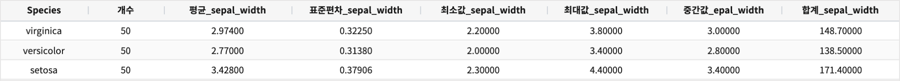
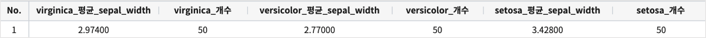
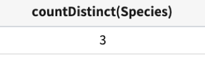
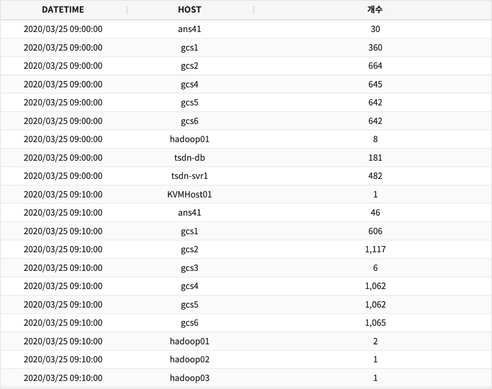
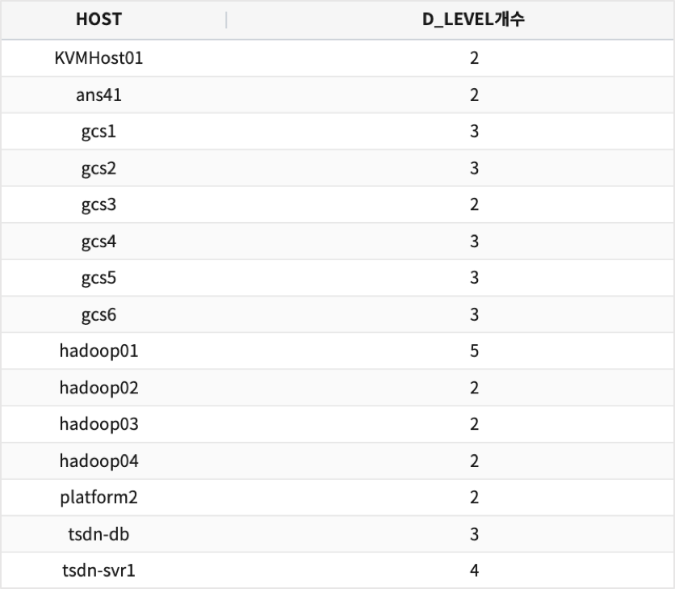

.. role:: raw-html-m2r(raw)
   :format: html

pivot
=====

개요
----

테이블을 여러 컬럼들을 축으로 회전 및 각종 통계 정보를 행과 열 별로 구할 수 있습니다.

설명
----

``SPLITROW``\ , ``SPLITCOL``\ , ``AS`` 와 ``BY``\ 의 문구를 지원하며, ``SPLITROW``\ 는 가로축 기반으로 그리고 ``SPLITCOL``\ 은 세로축 기반으로 데이터를 축 기준으로 회전 하거나 aggregation을 할 수 있습니다. ``AS``\ 는 결과 값의 field의 별칭을 줄 수 있습니다.

pivot 의 결과를 sort 하고자 할 때, 옵션 ``SORTROW`` , ``SORTCOL``\ 을 사용할 수 있습니다.

* ``SORTROW``\ ,\ ``SORTCOL`` 의 인자로는 ``asc`` 및 ``desc``\ 를 사용 할 수 있습니다.
* 예) ``SORTCOL asc`` or ``SORTCOL desc``

.. code-block:: none

   # SPLITCOL 인 DATE 컬럼에 대해 desc 로 정렬
   ... | pivot count(LEVEL_INT) SPLITCOL DATE SORTCOL desc

   # SPLITROW 인 HOST 컬럼에 대해 asc 로 정렬
   ... | pivot count(LEVEL_INT) SPLITROW HOST SORTROW asc

   # SPLITROW 인 HOST 와 SPLITCOL 인 DATE 컬럼에 대해 asc, desc 로 정렬
   ... | pivot count(LEVEL_INT) SPLITROW HOST SPLITCOL DATE SORTROW asc SORTCOL desc

Examples
--------------

| 예제 데이터로 2종류의 데이터를 사용합니다.
| 하나는 초단위의 TIMESTAMP 필드와 이벤트 데이터(로그 데이터)가 있는 데이터모델 EDU_SYSLOG_2020_0325_09 , 
| 다른 하나는 붓꽂의 종류별로 4개의 featrure 를 측정한 붓꽃(iris) 데이터가 있는 EDU_DATA_iris (150건)  입니다.

''''''''''''''''''''''''''''''''''''''''''''''''''''''''''
붓꽃 데이터 예제 : EDU_DATA_iris
''''''''''''''''''''''''''''''''''''''''''''''''''''''''''

.. image:: ./images/stats_1.png
    :scale: 60% 
    :alt: stats 1

| 붓꽃 3개 종(Species) 각 50개, 총 150개의 데이터이며, Sepal(꽃받침)의 length, width, Petal(꽃잎)의 length, width 를 측정한 데이터입니다.
| Sepal(꽃받침)의 length, width, Petal(꽃잎)의 length, width 로 3개 종을 분류할 수 있는 지 분류 및 clustering 할 때 많이 사용되는 데이터입니다.

* count, avg, stddev, min, max, median, sum  통계 &  SPLITROW Species
    * ``Species``  는 3개 종이므로 SPLITROW Species 는 3개의 행으로 split 되어 결과가 나옵니다.
    * ``Species``  이름으로 그룹핑 된 결과 에서  갯수, ``sepal_width`` 필드의 평균, 표준편차, 최소값, 최대값, 중간값, 헙계를 구합니다.

* SORTROW 
    * ``SPLITROW Species SORTROW desc`` 는  Species 가 행으로 split 된 결과를 내림차순으로 표시합니다.

.. code-block:: none

   *  | pivot count(*) as 개수,  avg(sepal_width) as 평균_sepal_width,  
              stddev(sepal_width) as 표준편차_sepal_width,
              min(sepal_width) as 최소값_sepal_width, max(sepal_width) as 최대값_sepal_width,
              median(sepal_width) as 중간값_epal_width,  sum(sepal_width) as 합계_sepal_width
              SPLITROW Species SORTROW desc

* count, avg  통계 &  SPLICOL Species & SORTCOL
    * SPLITCOL Species 는  ``3개 종_ 함수결과`` 가 컬럼으로 생성되어 보여집니다.

.. code-block:: none

    *  | pivot count(*) as 개수 , avg(sepal_width) as 평균_sepal_width 
         SPLITCOL Species SORTCOL desc

* countDistinct 

.. code::

    *  | pivot countDistinct(Species) 

''''''''''''''''''''''''''''''''''''''''''''''''''''''''''
SYSLOG 데이터 예제 : EDU_SYSLOG_2020_0325_09
''''''''''''''''''''''''''''''''''''''''''''''''''''''''''

| ``EDU_SYSLOG_2020_0325_09`` 는 이벤트 로그 데이터인 SYSLOG  데이터 중에서 2020.03.25 09:00 ~ 10:00 데이터만 있는 데이터 모델입니다.

* HOST 별로 10분 단위로 로그 COUNT 를 구합니다. ``SPLITROW 필드,필드 SORTROW asc/desc``

.. code-block:: none

    * | pivot count(*) SPLITROW 'date_group("DATETIME", "10M")',HOST SORTROW asc

* countDistinct 

.. code::

    * | pivot countDistinct(LEVEL) as D_LEVEL개수 SPLITROW HOST SORTROW asc

Parameters
----------

.. code-block:: none

   ... | pivot FUNCTION (ASLIAS)? (, FUNCTION (ASLIAS)?)* (SPLITROW FIELD_NAME(, FIELD_NAME)*)? (SPLITCOL FIELD_NAME)? (FILTER filter_expr)? (COLSIZE N)? ((SORT order)? | (SORTROW order)? (SORTCOL order)?)

.. list-table::
   :header-rows: 1

   * - 이름
     - 설명
     - 필수/옵션
   * - FUNCTION
     - ``FUNC(FIELD_NAME)`` 입니다. 지원하는 *\ ``FUNC``\ 의 종류는 아래 표를 참조해주세요. ``FIELD_NAME``\ 은 field 이름을 뜻합니다.\ :raw-html-m2r:` `\ 예 : avg(fieldA), count(fieldB), ...
     - 필수
   * - ASLIAS
     - ``AS FIELD_NAME`` 입니다. ``AS``\ 는 예약어 이며 ``FIELD_NAME``\ 은 field 이름을 뜻합니다.\ :raw-html-m2r:` ` 예 : avg(fieldA) as avg_fieldA
     - 옵션
   * - SPLITROW
     - ``SPLITROW``\ 는 예약어이며, 여기에 정의된 field를 그룹핑하여 출력합니다. 각 ``FIELD_NAME``\ 는 ``,`` 으로 구분 됩니다.\ :raw-html-m2r:` `\ 예 : splitrow fieldA, fieldB
     - 옵션
   * - SPLITCOL
     - ``SPLITCOL``\ 은 예약어이며, 여기에 정의된 field를 그룹핑하여 가로축으로 피봇하여 출력합니다. 즉 field의 데이터가 컬럼명이 됩니다.\ :raw-html-m2r:` `\ 예 : splitcol fieldA
     - 옵션
   * - FILTER filter_expr
     - ``FILTER``\ 는 예약어이며 ``filter_expr``\ 은 filter 조건을 뜻합니다.\ :raw-html-m2r:` ` 예 : filter fieldA='valueA'
     - 옵션
   * - COLSIZE N
     - ``COLSIZE``\ 는 예약어이며 ``N``\ 은 몇 개의 컬럼을 보여 줄 지에 대한 개수입니다.\ :raw-html-m2r:` `\ 이 때, 컬럼의 개수에 해당하는 것은 ``SPLITCOL``\ 로 지정된 필드의 피벗 결과 컬럼의 개수입니다. ``SPLITROW``\ 의 필드와는 관계가 없습니다.\ :raw-html-m2r:` `\ 예 : colsize 10
     - 옵션
   * - SORT order
     - 삭제될 옵션
     - 옵션
   * - SORTROW order
     - ``SORTROW``\ 는 예약어이며 ``order``\ 은 ``asc/desc``\ 의 값이 들어 갑니다. ``SPLITROW``\ 로 지정된 필드에 대한 Sort 결과를 나타내 줍니다.\ :raw-html-m2r:` `\ 예 : sortrow desc
     - 옵션
   * - SORTCOL order
     - ``SORTCOL``\ 은 예약어이며 ``order``\ 은 ``asc/desc``\ 의 값이 들어 갑니다. ``SPLITCOL``\ 로 지정된 필드의 피벗 결과에 대한 Sort 결과를 나타내 줍니다.\ :raw-html-m2r:` `\ 예 : sortcol desc
     - 옵션
   * - ``order``
     - ``ASC``\ , ``DESC``\ 는 일반적인 정렬을 의미합니다.\ :raw-html-m2r:` `\ 요일 정렬: ``WEEK ASC``\ , ``WEEK DESC``\ :raw-html-m2r:` `\ 달 정렬: ``MONTH ASC``\ , ``MONTH DESC``\ :raw-html-m2r:` `\ 계절 정렬: ``SEASON ASC``\ , ``SEASON DESC``
     - 옵션

\ ``FUNC``\ 의 종류

.. list-table::
   :header-rows: 1

   * - 이름
     - 설명
     - 지원 타입
   * - ``avg()``
     - 평균 값을 구합니다.
     - ``TEXT``\ , ``BINARY``\ , ``BOOLEAN`` 불가능
   * - ``count()``
     - 카운트를 구합니다.
     - 모든Type 가능
   * - ``first()``
     - 첫 번째 값을 구합니다.
     - 모든Type 가능
   * - ``last()``
     - 마지막 값을 구합니다.
     - 모든Type 가능
   * - ``max()``
     - 제일 큰 값을 구합니다.
     - ``TEXT``\ , ``BINARY``\ , ``BOOLEAN`` 불가능
   * - ``min()``
     - 제일 작은 값을 구합니다.
     - ``TEXT``\ , ``BINARY``\ , ``BOOLEAN`` 불가능
   * - ``median()``
     - 중간 값을 구합니다.
     - ``TEXT``\ , ``BINARY``\ , ``BOOLEAN`` 불가능
   * - ``sum()``
     - 전체 값을 구합니다.
     - ``TEXT``\ , ``BINARY``\ , ``BOOLEAN`` 불가능
   * - ``stddev()``
     - 표준편차 값을 구합니다.
     - ``TEXT``\ , ``BINARY``\ , ``BOOLEAN`` 불가능
   * - ``countDistinct()``
     - 유니크한 값의 갯수를 구합니다.
     - 모든Type 가능

요일 정렬

아래 이름이나 별명에 대해 우선적으로 정렬합니다.

.. list-table::
   :header-rows: 1

   * - 이름
     - 별명
     - 설명
   * - Monday
     - MON
     - 월요일
   * - Tuesday
     - TUE
     - 화요일
   * - Wednesday
     - WED
     - 수요일
   * - Thursday
     - THU
     - 목요일
   * - Friday
     - FRI
     - 금요일
   * - Saturday
     - SAT
     - 토요일
   * - Sunday
     - SUN
     - 일요일

달 정렬

아래 이름이나 별명에 대해 우선적으로 정렬합니다.

.. list-table::
   :header-rows: 1

   * - 이름
     - 별명
     - 설명
   * - January
     - JAN
     - 1월
   * - February
     - FEB
     - 2월
   * - March
     - MAR
     - 3월
   * - April
     - APR
     - 4월
   * - May
     - 
     - 5월
   * - June
     - 
     - 6월
   * - July
     - 
     - 7월
   * - August
     - AUG
     - 8월
   * - September
     - SEPT
     - 9월
   * - October
     - OCT
     - 10월
   * - November
     - NOV
     - 11월
   * - December
     - DEC
     - 12월

계절 정렬

아래 이름에 대해 우선적으로 정렬합니다.

.. list-table::
   :header-rows: 1

   * - 이름
     - 의미
   * - spring
     - 봄
   * - summer
     - 여름
   * - fall, autumn
     - 가을
   * - winter
     - 겨울

Parameters BNF
--------------

.. code-block:: none

   causes : funcs
          | funcs SPLITROW fields
          | funcs SPLITCOL fields
          | funcs SPLITROW fields SPLITCOL fields
          | funcs FILTER tokens
          | funcs SPLITROW fields FILTER tokens
          | funcs SPLITCOL fields FILTER tokens
          | funcs SPLITROW fields SPLITCOL fields FILTER tokens
          | funcs COLSIZE NUMBER
          | funcs SPLITROW fields COLSIZE NUMBER
          | funcs SPLITCOL fields COLSIZE NUMBER
          | funcs SPLITROW fields SPLITCOL fields COLSIZE NUMBER
          | funcs FILTER tokens COLSIZE NUMBER
          | funcs SPLITROW fields FILTER tokens COLSIZE NUMBER
          | funcs SPLITCOL fields FILTER tokens COLSIZE NUMBER
          | funcs SPLITROW fields SPLITCOL fields FILTER tokens COLSIZE NUMBER
          | funcs SORT order
          | funcs SPLITROW fields SORT order
          | funcs SPLITCOL fields SORT order
          | funcs SPLITROW fields SPLITCOL fields SORT order
          | funcs FILTER tokens SORT order
          | funcs SPLITROW fields FILTER tokens SORT order
          | funcs SPLITCOL fields FILTER tokens SORT order
          | funcs SPLITROW fields SPLITCOL fields FILTER tokens SORT order
          | funcs COLSIZE NUMBER SORT order
          | funcs SPLITROW fields COLSIZE NUMBER SORT order
          | funcs SPLITCOL fields COLSIZE NUMBER SORT order
          | funcs SPLITROW fields SPLITCOL fields COLSIZE NUMBER SORT order
          | funcs FILTER tokens COLSIZE NUMBER SORT order
          | funcs SPLITROW fields FILTER tokens COLSIZE NUMBER SORT order
          | funcs SPLITCOL fields FILTER tokens COLSIZE NUMBER SORT order
          | funcs SPLITROW fields SPLITCOL fields FILTER tokens COLSIZE NUMBER SORT order
          | funcs SPLITROW fields SORTROW order
          | funcs SPLITROW fields SPLITCOL fields SORTROW order
          | funcs SPLITROW fields FILTER tokens SORTROW order
          | funcs SPLITROW fields SPLITCOL fields FILTER tokens SORTROW order
          | funcs SPLITROW fields COLSIZE NUMBER SORTROW order
          | funcs SPLITROW fields SPLITCOL fields COLSIZE NUMBER SORTROW order
          | funcs SPLITROW fields FILTER tokens COLSIZE NUMBER SORTROW order
          | funcs SPLITROW fields SPLITCOL fields FILTER tokens COLSIZE NUMBER SORTROW order
          | funcs SPLITCOL fields SORTCOL order
          | funcs SPLITROW fields SPLITCOL fields SORTCOL order
          | funcs SPLITCOL fields FILTER tokens SORTCOL order
          | funcs SPLITROW fields SPLITCOL fields FILTER tokens SORTCOL order
          | funcs SPLITCOL fields COLSIZE NUMBER SORTCOL order
          | funcs SPLITROW fields SPLITCOL fields COLSIZE NUMBER SORTCOL order
          | funcs SPLITCOL fields FILTER tokens COLSIZE NUMBER SORTCOL order
          | funcs SPLITROW fields SPLITCOL fields FILTER tokens COLSIZE NUMBER SORTCOL order
          | funcs SPLITROW fields SPLITCOL fields SORTROW order SORTCOL order
          | funcs SPLITROW fields SPLITCOL fields FILTER tokens SORTROW order SORTCOL order
          | funcs SPLITROW fields SPLITCOL fields COLSIZE NUMBER SORTROW order SORTCOL order
          | funcs SPLITROW fields SPLITCOL fields FILTER tokens COLSIZE NUMBER SORTROW order SORTCOL order

   fields : field
          | fields COMMA field

   field : TOKEN
         | TOKEN AS TOKEN

   funcs : funcs COMMA func
         | func

   func : TOKEN LPAREN TOKEN RPAREN
        | TOKEN LPAREN TOKEN RPAREN AS TOKEN

   tokens : TOKEN
          | tokens TOKEN
          | NUMBER
          | tokens NUMBER

   order : DESC
         | ASC

   TOKEN : ["..."|'...'|[^ |^,|^+|^-]+]
   COMMA : ,
   LPAREN : (
   RPAREN : )
   SPLITROW : (?i)SPLITROW
   SPLITCOL : (?i)SPLITCOL
   FILTER : (?i)FILTER
   AS : (?i)AS
   SORT : (?i)SORT
   COLSIZE : (?i)COLSIZE
   ASC : (?i)ASC
   DESC : (?i)DESC
   SORTROW : (?i)SORTROW
   SORTCOL : (?i)SORTCOL
