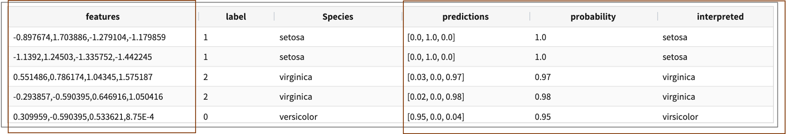
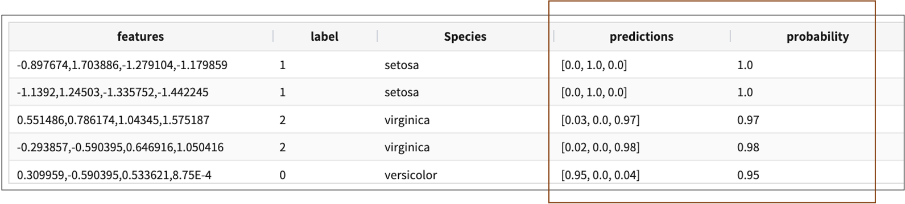

serving
====================================================================================================

개요
----------------------------------------------------------------------------------------------------

tensorFlow 의 deep-learinig 알고리즘 기반의 학습 모델을 Tensorflow Serving 에 배포하여 서빙 중인 학습 모델로 예측하고( ``serving predict`` ), 모델의 서빙 상태를 확인( ``serving status`` ) 할 수 있는 명령어입니다.

- serving predict
- serving status

컬럼 타입
----------------------------------------------------------------------------------------------------

설명
----------------------------------------------------------------------------------------------------
 

배포된 모델에 대해 예측하거나 모델의 서빙 상태를 확인할 수 있습니다. 배포는 `적재 <http://docs.iris.tools/manual/IRIS-Manual/IRIS-Discovery-Middleware/command/commands/mlmodel.html#mlmodel-import>`_ , `배포 <http://docs.iris.tools/manual/IRIS-Manual/IRIS-Discovery-Middleware/command/commands/mlmodel.html#mlmodel-deploy>`_ 를 참조해주세요.

-  servig 명령어의 operation 종류
    - status   : Tensorflow Serving 에 배포한 학습 모델의 상태를 확인합니다.
    - predict  : 서빙 중인 학습 모델로 예측값을 구합니다.
  
.. code-block:: python

   .. | serving status user=모델user name=모델이름

   .. | serving predict user=모델user name=모델이름 col=feature shape=[(,,)] tag=(a,b,,,)

  
현재(2021.04월) serving 기능은 tensorFlow 2.X 의 deep-learning 기반의 학습 모델에만 적용됩니다.

즉, tensorFlow 2.X 의 deep-learning 기반의 학습 모델에 한정하여 ``mlmodel import``, ``mlmodel deploy`` 로 tensorflow Serving 을 이용할 수 있습니다.

serving predict
----------------------------------------------------------------------------------------------------

서빙 중인 학습 모델을 통해 예측(분류)값을 구합니다.

Parameters
''''''''''''''''''''''''''''''''''''''''''''''''''''''''''''''''''''''''''''''''''''''''''''''''''''

- 필수 parameter 는 name, col, shape 입니다.

- 예시

.. code-block:: python

   ... | serving predict (user=<user>)? name=<model_name> (col=<column_name>)? (shape=[<tuple>])? (dtype=<dtype>)? (layer_name=(Conv1_input))? (version=<number>)? (tag=<tuple>)?

  

.. list-table::
   :header-rows: 1

   * - 이름
     - 설명
     - 기본값
     - 예시값
     - 타입
     - 필수
   * - user
     - 모델 소유주 명
     - 
     - demo
     - string
     - False
   * - name
     - 모델명
     -
     - mnist_v1
     - string
     - True
   * - version
     - 모델의 버전
     - last version of serving model
     - 1
     - int
     - False
   * - col
     - feature 컬럼명
     - feature
     - features
     - string
     - True
   * - shape
     - 입력 텐서 모양의 shape
     - 
     - [(4,1)]
     - list of tuple
     - True     
   * - dtype
     - 입력 텐서 자료형
     - 
     - float
     - string
     - False
   * - layer_name
     - 입력 텐서 이름
     - 
     - Conv1_input
     - string 
     - False
   * - tag
     - label 변수에 대한 태그값
     - 
     - ('setosa', 'versicolor', 'virginica')
     - 튜플형
     - False

- IRIS 외부에서 dsl-object API 를 이용하여 serving 명령어를 사용할 때 예시
    - json 구성 (각 operation 에 대한 파라미터는 아래에서 확인)
 
.. code-block:: json
 
    {
      "command": "serving",
      "params":{
        "operation": <string>,  # "status|predict",
        "name": <string>,  # "학습모델명"
        "version": <int>,  # 2
        "user": <string>,  # "유저명"
        ...
      }
    }

 

Examples
''''''''''''''''''''''''''''''''''''''''''''''''''''''''''''''''''''''''''''''''''''''''''''''''''''

- 붓꽃(iris) 의 Sepal_Length, Sepal_Width, Petal_Length, Petal_Width 4개 feature 데이터로 Spacies(종) 을 분류하는 예제
    - tag 파라미터가 있는 분류 결과에서는 확률로 나오는 prediction 컬럼을 tag 값으로 변환해서 interpreted 컬럼으로 출력해줍니다.

.. code-block:: python
  
   .. | serving predict user=demo name=model_name col=features shape=[(4,1)] tag=(virsicolor,setosa,virginica)

   

serving status
----------------------------------------------------------------------------------------------------

학습 모델의 서빙 상태를 확인합니다.  

Parameters
''''''''''''''''''''''''''''''''''''''''''''''''''''''''''''''''''''''''''''''''''''''''''''''''''''

.. code-block:: python

   serving status (user=<user>)? name=<model_name>

.. list-table::
   :header-rows: 1

   * - 이름
     - 설명
     - 기본값
     - 예시값
     - 타입
     - 필수
   * - user
     - 모델 소유주 명
     - API를 요청하는 user
     - demo
     - string
     - False
   * - name
     - 모델명
     -
     - mnist_v1
     - string
     - True

Examples
''''''''''''''''''''''''''''''''''''''''''''''''''''''''''''''''''''''''''''''''''''''''''''''''''''

mnist_v1 모델의 서빙 상태를 확인합니다.  결과의 label 컬럼은 모델의 description 에 해당하며 ``mlmodel deploy`` 에서 입력한 값입니다.

.. code-block:: python

   serving status name=mnist_v1

.. list-table::
   :header-rows: 1

   * - version
     - state
     - label
   * - 12
     - AVAILABLE
     - stable
   * - 11
     - AVAILABLE
     - unstable
   * - ...
     - ...
     - ...
