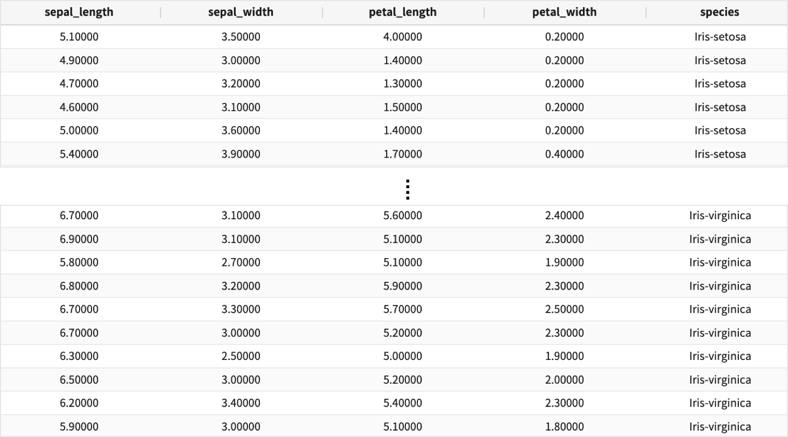
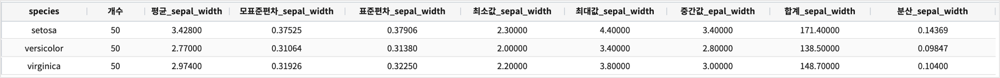
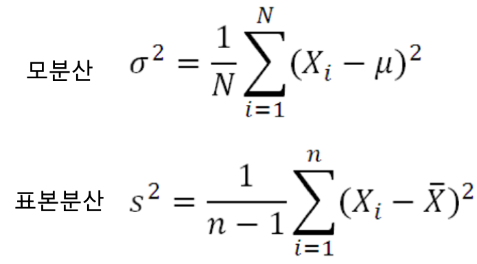
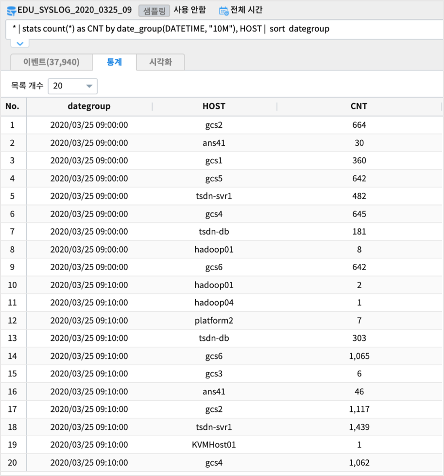

.. role:: raw-html-m2r(raw)
   :format: html

stats
====================================================================================================

개요
----------------------------------------------------------------------------------------------------

각종 통계 데이터를 구하는 명령어 입니다.

설명
----------------------------------------------------------------------------------------------------

| 해당 검색 결과에 각종 함수를 적용하여 통계 값을 구합니다. 마치 SQL의 aggregation과 비슷합니다. 
| 만약 각종 통계 값들이 ``BY`` 절 없이 쓰인다면, 전체 결과를 aggregation을 하여, 하나의 열만 검색 결과로 출력 될 것입니다. 
| 만약 ``BY`` 절에 의하여 그룹핑할 field가 주어진다면, 해당 field의 유니크한 값들의 개수 만큼의 열이 검색 결과로 출력 될 것 입니다.

Examples
----------------------------------------------------------------------------------------------------

| 예제 데이터로 2종류의 데이터를 사용합니다.
| 하나는 초단위의 TIMESTAMP 필드와 이벤트 데이터(로그 데이터)가 있는 데이터모델 EDU_SYSLOG_2020_0325_09 , 
| 다른 하나는 붓꽂의 종류별로 4개의 featrure 를 측정한 붓꽃(iris) 데이터가 있는 EDU_DATA_iris (150건)  입니다.

''''''''''''''''''''''''''''''''''''''''''''''''''''''''''
붓꽃 데이터 예제 : EDU_DATA_iris
''''''''''''''''''''''''''''''''''''''''''''''''''''''''''

* avg, stdev, stdevp, min, max, median, sum, var
    * ``species`` 이라는 필드 이름으로 그룹핑 된 결과 에서  개수, ``sepal_width`` 필드의 평균, 표준편차, 최소값, 최대값, 중간값, 합계, 분산을 구합니다.

.. code-block:: none

   *  | stats count(*) as 개수,
              avg(sepal_width) as 평균_sepal_width,  
              stdev(sepal_width) as 표준편차_sepal_width,
              stdevp(sepal_width) as 모표준편차_sepal_width,
              min(sepal_width) as 최소값_sepal_width, 
              max(sepal_width) as 최대값_sepal_width ,
              median(sepal_width) as 중간값_epal_width,  
              sum(sepal_width) as 합계_sepal_width,  
              var(sepal_width) as 분산_sepal_width
        by  species |  sort species

* 참고 :  var /stdev / stdevp 

| stats 의 var() 는 표본 분산, 즉 N-1 로 계산한 값입니다.
| stdev() 는  N - 1 을 분모로 하여 계산한 것입니다. (표본표준편차)
| stdevp() 는  N 을 분모로 계산한 것입니다. (모표준편차)

* distinct_count
    * 결과 : 3

.. code::

      *  | stats distinct_count(Species) as 종의개수

* iqr : interquartile range 
    * setosa 종의 Sepal_Width 의 IQR 값 

.. code::

    * Species='setosa' | fields Sepal_Width,Species |  sort  Sepal_Width | stats iqr(Sepal_Width)  by Species

    => 50개 데이터를 작은 값부터 큰 값까지 sorting 한 후 50 * 0.25 에 해당하는 1사분위수는 13번째 값 = 3.2
        50 * 0.5 에 해당하는 2사분위수는 중간값으로 25번째 값 = 3.4
        50 * 0.75 에 해당하는 3사분위수는 38번째 값 = 3.7
    
    IQR = 3사분위수 - 1사분위수 = 3.7 - 3.2 = 0.5

''''''''''''''''''''''''''''''''''''''''''''''''''''''''''
SYSLOG 데이터 예제 : EDU_SYSLOG_2020_0325_09
''''''''''''''''''''''''''''''''''''''''''''''''''''''''''

| 이벤트 로그 데이터인 SYSLOG  데이터 중에서 2020.03.25 09:00 ~ 10:00 데이터만 있는 데이터 모델입니다.

* HOST 별로 10분 단위로 로그 COUNT 를 구합니다.

.. code-block:: none

   * | stats count(*) as CNT by date_group(DATETIME, "10M"), HOST 

* 백쿼터(back-quote : `` ` ``) 를 사용하여 단어가 아닌 필드명도 사용할 수 있습니다.

.. code-block:: none

    * | stats count(*) as `개수(HOST)`   by date_group(DATETIME, "10M"), HOST |  sort  dategroup

Parameters
----------------------------------------------------------------------------------------------------

.. code-block:: none

   ... | stats FUNCTION (AS ALIAS_NAME)?(, FUNCTION (AS ALIAS_NAME)?)* (BY FIELD_NAME (, FIELD_NAME)*)?

.. list-table::
   :header-rows: 1

   * - 이름
     - 설명
     - 필수/옵션
   * - ``FUNCTION``
     - ``agg_func(FIELD_NAME)``\ 을 뜻합니다. 지원하는 ``agg_func``\ 는 아래 표와 같습니다. ``FIELD_NAME``\ 은 field의 이름입니다.
     - 필수
   * - ``AS ALIAS_NAME``
     - ``AS ALIAS_NAME``\ 입니다. ``AS``\ 는 키워드 이며 ``ALIAS_NAME``\ 은 변경 할 이름을 뜻합니다.
     - 옵션
   * - ``BY FIELD_NAME``
     - ``BY``\ 는 키워드를 나타내고, ``FIELD_NAME``\ 는 그룹핑 할 field명을 의미 합니다. 각 field는 ``,``\ 으로 구분 됩니다. :raw-html-m2r:` `\ ``FIELD_NAME`` 은 ``date_group(FIELD, UNIT)`` 함수를 사용 할 수 있습니다. 시간 단위(\ ``UNIT``\ , 초/분/시간/일/월/년)로 ``FIELD``\ 를 그룹핑합니다. ``FIELD``\ 는 시간 필드를 의미합니다. ``UNIT``\ : 기준 시간 단위는 ``"10y"``\ , ``"1y"``\ , ``"10m"``\ , ``"1m"``\ , ``"10d"``\ , ``"1d"``\ , ``"10H"``\ , ``"1H"``\ , ``"10M"``\ , ``"1M"``\ , ``"10S"`` 과 ``"1S"`` 이 될 수 있습니다.
     - 옵션

* aggregation functions list

.. list-table::
   :header-rows: 1

   * - Arguments
     - Description
     - ETC
   * - ``avg()``
     - 평균 값을 구합니다.
     - ``TEXT``\ , ``BINARY``\ , ``BOOLEAN`` 불가능
   * - ``count()``
     - 카운트를 구합니다.
     - 모든 Type 가능
   * - ``distinct_count()``
     - 유니크한 개별 값의 개수를 구합니다
     - 모든 Type 가능
   * - ``max()``
     - 가장 큰 값을 구합니다
     - ``TEXT``\ , ``BINARY``\ , ``BOOLEAN`` 불가능
   * - ``median()``
     - 중간 값을 구합니다.
     - ``TEXT``\ , ``BINARY``\ , ``BOOLEAN`` 불가능
   * - ``min()``
     - 제일 작은 값을 구합니다.
     - ``TEXT``\ , ``BINARY``\ , ``BOOLEAN`` 불가능
   * - ``stdev()``
     - 표준편차 값을 구합니다 (SQL 의 STDEV와 동일).
     - ``TEXT``\ , ``BINARY``\ , ``BOOLEAN`` 불가능
   * - ``stdevp()``
     - 모표준편차 값을 구합니다 (SQL 의 STDEVP와 동일).
     - ``TEXT``\ , ``BINARY``\ , ``BOOLEAN`` 불가능
   * - ``sum()``
     - 전체의 합을 구합니다.
     - ``TEXT``\ , ``BINARY``\ , ``BOOLEAN`` 불가능
   * - ``var()``
     - 표본의 분산 값을 구합니다.
     - ``TEXT``\ , ``BINARY``\ , ``BOOLEAN`` 불가능
   * - ``iqr()``
     - 사분위수 범위(IQR) 값을 구합니다.
     - ``TEXT``\ , ``BINARY``\ , ``BOOLEAN`` 불가능

Parameters BNF
----------------------------------------------------------------------------------------------------

.. code-block:: none

   clauses : funcs
           | funcs BY byclause

   byclause : byexpr
           | byclause COMMA byexpr

   byexpr : TOKEN
           | func

   funcs : funcs COMMA func
           | func

   func : TOKEN LPAREN TOKEN RPAREN
       | TOKEN LPAREN TOKEN RPAREN AS TOKEN
       | TOKEN LPAREN TOKEN COMMA TOKEN RPAREN
       | TOKEN LPAREN TOKEN COMMA TOKEN RPAREN AS TOKEN

   TOKEN : [^,|^ |^\|^(|^)|^\'|\"]+
   COMMA : ,
   LPAREN : (
   RPAREN : )
   BY : (i?)BY
