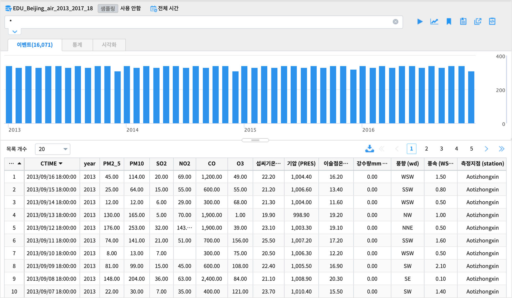
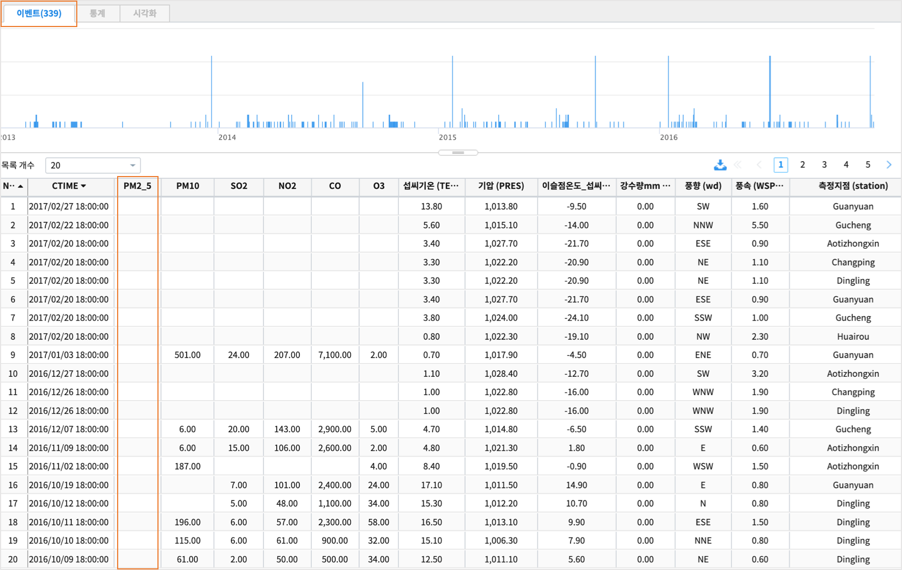
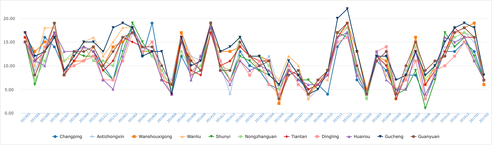
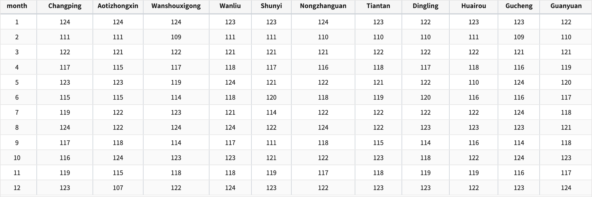
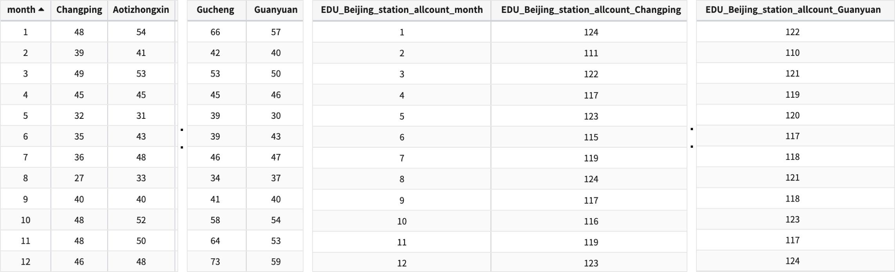
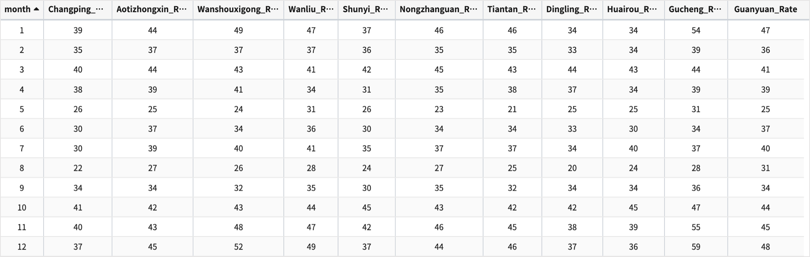
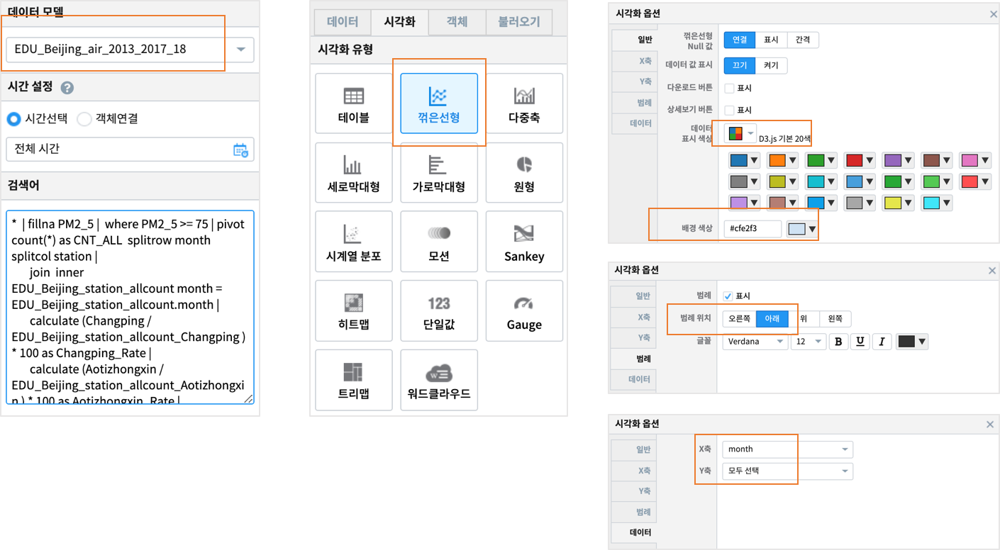
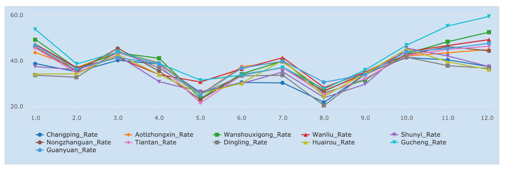

==================================================================================================
검색어예제: where/substr/fillna/pivot/join
==================================================================================================

| 2013/03/01 ~ 2017/02/28 동안 중국 북경시의 11개 지점에서 측정한 대기오염 농도 및 기상 데이터로부터
| 월별로 대기오염 농도의 차이가 있는지, 
| 11개 지점별로 대기오염 농도에 차이가 있는지 분석해봅니다.

.. contents::
    :backlinks: top

''''''''''''''''''''''''''''''''''''''''''''''''''''''''''''''''''''''''''''''''''
데이터 설명
''''''''''''''''''''''''''''''''''''''''''''''''''''''''''''''''''''''''''''''''''

| 데이터 모델 : EDU_Beijing_air_2013_2017_18
| 2013년 3월 1일 ~ 2017년 2월 28일까지 18시에 측정한 대기 오염 및 기상 측정 데이터
| 측정 지점 : 총 11개 지점. 컬럼명은 station

.. code::

  필드 정보 

  CTIME: timestamp
  year: year of data in this row
  month: month of data in this row
  day: day of data in this row
  hour: hour of data in this row
  PM2.5: PM2.5 concentration (ug/m^3)
  PM10: PM10 concentration (ug/m^3)
  SO2: SO2 concentration (ug/m^3)
  NO2: NO2 concentration (ug/m^3)
  CO: CO concentration (ug/m^3)
  O3: O3 concentration (ug/m^3)
  TEMP: temperature (degree Celsius)
  PRES: pressure (hPa)
  DEWP: dew point temperature (degree Celsius)
  RAIN: precipitation (mm)
  wd: wind direction
  WSPM: wind speed (m/s)
  station: name of the air-quality monitoring site

''''''''''''''''''''''''''''''''''''''''''''''''''''''''''''''''''''''''''''''''''''''''''''''''''''''''''''''''''
데이터 탐색 
''''''''''''''''''''''''''''''''''''''''''''''''''''''''''''''''''''''''''''''''''''''''''''''''''''''''''''''''''

...............................................................................
null 인 셀이 있는가
...............................................................................

| 데이터 중에서 PM2_5 측정값이 null 인 레코드가 얼마나 있는지 파악해 봅니다.

**where**  

.. code::
 
  * | where PM2_5 is null

| 대기오염을 측정하는 기본 필드인 PM2_5 인 null 인 행이 339개( 총 16071 개 행 ) 행입니다.

| 대체적으로 기상데이터는 빠지는 것이 없지만, 대기오염 측정 데이터는 null 데이터가 있습니다.
| 전체 16,071 개 레코드에서 339개의 null 이 있는 row 를 삭제

.......................................................................................
미세먼지 농도 높은 날의 비율
.......................................................................................

| 11개 지점 별로 초미세먼지 PM2_5 농도 >= 75μg/m^3 인 날의 수를 월별 / 측정지점별로 비교해 보려고 합니다.
|
| 2013년 03월부터 2017년 02월까지 PM2_5 농도가 75μg/m^3 이상 인 날의 수를 월단위 시계열로 그려봅니다.

**pivot**

.. code::

  * | where PM2_5 >= 75  
    | substr CTIME 1 6 as yyyymm
    | pivot  count(*) as CNT_PM2_5  splitrow yyyymm splitcol  station
    | sort yyyymm

| studio 에서 꺾은 선 챠트를 그려봅니다.( -> 주기성이 보입니다.)

| PM2_5 >= 75 인 날의 수를 월별 비율로 구해서 초미세먼지 농도가 높은 날이 많은 달을 찾아봅니다.
| 먼저 월별 비율을 구하기 위해 2013년 3월 ~  2017년 2월까지 각 달의 총 레코드수를 구합니다.
| 만약 빠진 row가 없다면 1월 총 레코드건수는 31 * 4 = 124 입니다.

**fillna**

.. code::

  ### PM2_5 가 null 인 레코드(row) 를 제외하고, 월(month) 별 레코드 건수를 11개 측정지점별로 구합니다.
  * | fillna PM2_5  | pivot count(*) as CNT_PM2_5 splitrow month splitcol station

| 이 데이터를 데이터모델 EDU_Beijing_station_allcount 로 생성합니다.

| PM2_5 농도 >= 75μg/m^3 인 날의 수를 월별, 측정 지점별로 구합니다.

  * | fillna PM2_5  |  where PM2_5 >= 75 | pivot count(*) as CNT_PM2_5 splitrow month splitcol station  |  sort month

| 월별로 PM2_5 농도 >= 75μg/m^3 인 날의 비율을 측정 지점별로 구합니다. 
| 이 때 데이터모델 EDU_Beijing_station_allcount 과 join 합니다.

.. code::

  *  | fillna PM2_5 |  where PM2_5 >= 75 | pivot count(*) as CNT_ALL  splitrow month splitcol station | 
       join  inner EDU_Beijing_station_allcount month = EDU_Beijing_station_allcount.month | 
       calculate (Changping / EDU_Beijing_station_allcount_Changping ) * 100 as Changping_Rate |
       calculate (Aotizhongxin / EDU_Beijing_station_allcount_Aotizhongxin ) * 100 as Aotizhongxin_Rate |
       calculate (Wanshouxigong / EDU_Beijing_station_allcount_Wanshouxigong ) * 100 as Wanshouxigong_Rate |
       calculate (Wanliu / EDU_Beijing_station_allcount_Wanliu ) * 100 as Wanliu_Rate |
       calculate (Shunyi / EDU_Beijing_station_allcount_Shunyi ) * 100 as Shunyi_Rate |
       calculate (Nongzhanguan / EDU_Beijing_station_allcount_Nongzhanguan ) * 100 as Nongzhanguan_Rate |
       calculate (Tiantan / EDU_Beijing_station_allcount_Tiantan ) * 100 as Tiantan_Rate |
       calculate (Dingling / EDU_Beijing_station_allcount_Dingling ) * 100 as Dingling_Rate |
       calculate (Huairou / EDU_Beijing_station_allcount_Huairou ) * 100 as Huairou_Rate |
       calculate (Gucheng / EDU_Beijing_station_allcount_Gucheng ) * 100 as Gucheng_Rate |
       calculate (Guanyuan / EDU_Beijing_station_allcount_Guanyuan ) * 100 as Guanyuan_Rate |
       sort month |
       fields month,Changping_Rate,Aotizhongxin_Rate,Wanshouxigong_Rate,Wanliu_Rate,Shunyi_Rate,Nongzhanguan_Rate,
       Tiantan_Rate,Dingling_Rate,Huairou_Rate,Gucheng_Rate,Guanyuan_Rate

| 검색어 설명 : **fillna** , **join** , **calculate** , **fields**

.. code::

  *  | fillna PM2_5 |  where PM2_5 >= 75 |   
  # PM2_5 가 null 인 행은 삭제한 데이터중에서 PM2_5 >= 75 인 데이터만 추출
       
  pivot count(*) as CNT_ALL  splitrow month splitcol station | 
  # month 의 값 1 ~ 12 로 총 12개 행이 생성되고, 측정지점 11 개가 컬럼명으로 됨. 값은 해당 레코드수 ( count 함수 )
       
  join  inner EDU_Beijing_station_allcount month = EDU_Beijing_station_allcount.month |
  # 조회대상인 EDU_Beijing_air_2013_2017_18 와  EDU_Beijing_station_allcount 데이터모델과 inner join

.. code::

  calculate (Changping / EDU_Beijing_station_allcount_Changping ) * 100 as Changping_Rate |
  # Changping : Changping 의 PM2_5 >= 75 인 레코드수 
  # EDU_Beijing_station_allcount_Changping :  측정지점 Changping 의 총 레코드수
  # Changping 의 PM2_5 >= 75 인 날의 비율을 구한 값 -> Changping_Rate 

| 검색어 결과

**Studio chart**

| Studio 에서 측정지점별로 PM2_5 >= 75 인 날의 월별 비율을 챠트로 그려봅니다.

| 챠트 결과

.......................................................................................
측정지점별 미세먼지농도가 차이가 있는가
.......................................................................................

| 측정지점별로 PM2_5 농도가 유의미하게 차이가 있는 지 알아봅니다.
| kmeans  clustering

  
