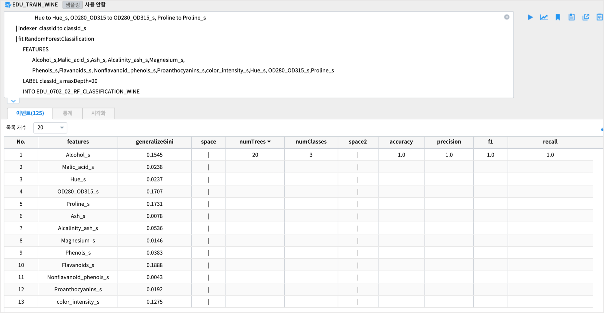

===================================================================================================
Spark M/L : Classification 
===================================================================================================

* training data : 데이터모델 EDU_TRAIN_WINE `csv 파일 다운로드 <http://b-iris.mobigen.com/hdfs-browser/minio/download?path=/demo/DEMO_DATA/ML_DATA/Train_wine_data.csv>`__
* test data : 데이터모델 EDU_TEST_WINE `csv 파일 다운로드 <http://b-iris.mobigen.com/hdfs-browser/minio/download?path=/demo/DEMO_DATA/ML_DATA/Test_wine_data.csv>`__
* 데이터에 대한 참고 설명과 보고서 예제
    * 보고서 이름 : `EDU_NEW_분류_RF_DC_1차시험_와인데이터 <http://b-iris.mobigen.com:80/studio/exported/d3a15af0056a448f90e0e59c5c916d4b8467250bec7a433eb6d9c090cb922944>`__
    * 보고서 설명 : `M/L classficaton <http://docs.iris.tools/manual/IRIS-Usecase/BLOG/classification_winedata_1.html#>`__

| classification 에 적용될 알고리즘은 

- RandomForestClassification
- RandomForestRegression
- DecisionTreeClassification
- DecisionTreeRegression
- generalizedLinearRegression
- linearRegression
- logisticRegression(LBFGS)

.. contents::
    :backlinks: top

모델 학습하기
------------------------------

**fit RandomForestClassification**

.. code::

    * | scaler minmax Alcohol to Alcohol_s, 
                      Malic_acid to Malic_acid_s, Ash to Ash_s, 
                      Alcalinity_ash to Alcalinity_ash_s, 
                      Magnesium to Magnesium_s, Phenols to Phenols_s, 
                      Flavanoids to Flavanoids_s, Nonflavanoid_phenols to Nonflavanoid_phenols_s, 
                      Proanthocyanins to Proanthocyanins_s, color_intensity to color_intensity_s, 
                      Hue to Hue_s, OD280_OD315 to OD280_OD315_s, Proline to Proline_s 
      | indexer classId to classId_s              
      | fit RandomForestClassification 
            FEATURES 
                    Alcohol_s,Malic_acid_s,Ash_s, Alcalinity_ash_s,Magnesium_s,
                    Phenols_s,Flavanoids_s, Nonflavanoid_phenols_s,Proanthocyanins_s,color_intensity_s,Hue_s, OD280_OD315_s,Proline_s 
            LABEL classId_s maxDepth=20 
            INTO EDU_0702_02_RF_CLASSIFICATION_WINE

- 결과

모델 저장 확인하기
-------------------------------------------------------------------------

scaler
''''''''''''''''''''''''''''''

indexer
''''''''''''''''''''''''''''''

fit
''''''''''''''''''''''''''''''

eval
''''''''''''''''''''''''''''''

fit_predict
''''''''''''''''''''''''''''''

모델 검증하기
------------------------------

predict
''''''''''''''''''''''''''''''

생성한 모델을 새 데이터로 사용하기 : 예측
---------------------------------------------------------

- wine 별로 측정한 13개의 feature 데이터를 스케일링 합니다. 여기서는 minmax scaling 을 사용합니다.
- 사용 command : `scaler <http://docs.iris.tools/manual/IRIS-Manual/IRIS-Discovery-Middleware/command/commands/scaler.html>`__

.. code:: 

    데이터 스케일링은 데이터 전처리 과정의 하나로 모델 알고리즘 학습에서 중요한 부분입니다.
    데이터 스케일링을 해주는 이유는 데이터의 값이 너무 크거나 작은 경우에는 학습과정에서 0으로 수렴하거나 무한으로 발산해버릴 수 있기 때문입니다.
    현재 구현된 스케일링은 standard, minmax 가 있습니다.

    1) Standard 스케일러
       각 feature의 평균을 0, 분산을 1로 변경합니다. 모든 특성들이 같은 스케일을 갖게 됩니다.
    2) MinMax 스케일러
       모든 feature가 0과 1사이에 위치하도록 만듭니다. 데이터가 2차원 셋일 경우, 모든 데이터는 x축의 0과 1 사이에, y축의 0과 1사이에 위치하게 됩니다.

|

- 검색 command 예시

.. code::

    * | scaler minmax  Alcohol to Alcohol_s, Malic_acid to Malic_acid_s. Ash to Ash_s

- 원본 데이터와 minmax 스케일링 한 데이터 예시

.. image:: ../images/demo/ml_cls_03.png
    :alt: 데이터 - 03

|

'''''''''''''''''''''''''''''''''''''''''''''''''''''''''''
RandomForest classification 모델 학습
'''''''''''''''''''''''''''''''''''''''''''''''''''''''''''

- 사용 Command : `fit <http://docs.iris.tools/manual/IRIS-Manual/IRIS-Discovery-Middleware/command/commands/fit.html>`__
    - fit 에 사용한 `RandomForest Classification <http://docs.iris.tools/manual/IRIS-Manual/IRIS-Discovery-Middleware/command/commands/ml_algorithms/RandomForestClassification.html>`__ 

- 13개 feature 의 값으로 포도 품종에 해당하는 컬럼인 classId 를 분류하는 분류 모델을 RandomForest classification 알고리즘으로 만들어 봅니다.
- RandomForest Classification( `랜덤포레스트 위키설명 <https://ko.wikipedia.org/wiki/랜덤_포레스트>`__ ) 은 앙상블(`앙상블 학습법 위키 설명 <https://ko.wikipedia.org/wiki/앙상블_학습법>`__) 머신러닝 모델의 하나입니다. 
    - 다수의 의사결정 트리를 만들고, 그 나무들의 분류를 취합하여 최종적으로 결론을 도출하는 방식입니다.
    - 다수의 나무를 기반으로 예측하므로, 오버피팅 등의 영향력이 줄어드는 효과를 볼 수 있습니다.

- 검색 명령어 창에서 실행하는 Command 예시  

.. code::

    * | scaler minmax Alcohol to Alcohol_s, 
                      Malic_acid to Malic_acid_s, Ash to Ash_s, 
                      Alcalinity_ash to Alcalinity_ash_s, 
                      Magnesium to Magnesium_s, Phenols to Phenols_s, 
                      Flavanoids to Flavanoids_s, Nonflavanoid_phenols to Nonflavanoid_phenols_s, 
                      Proanthocyanins to Proanthocyanins_s, color_intensity to color_intensity_s, 
                      Hue to Hue_s, OD280_OD315 to OD280_OD315_s, Proline to Proline_s 
      | fit RandomForestClassification 
            FEATURES 
                    Alcohol_s,Malic_acid_s,Ash_s, Alcalinity_ash_s,Magnesium_s,
                    Phenols_s,Flavanoids_s, Nonflavanoid_phenols_s,Proanthocyanins_s,color_intensity_s,Hue_s, OD280_OD315_s,Proline_s 
            LABEL classId maxDepth=20 
            INTO DEMO_02_RF_CLASSIFICATION_WINE

- command 의 의미 

.. code::

    13개 feature 를 minmax 스케일링으로 전처리하고 RandomForestClassification 알고리즘으로 fit
     - FEATURE 는 13개의 스케일링 변환된 컬럼
     - LABEL 은 품종을 나타내는 classId 컬럼
     - fit 으로 학습된 모델은 DEMO_02_RF_CLASSIFICATION_WINE 이라는 모델이름으로 저장

- IRIS Analyzer 의 **검색** 메뉴에서 **분석 탬플릿** 인 **DEMO_RF_분류_와인_TRAIN**  이 배포되어 있습니다.
    - 학습용 wine데이터 모델과 모델 생성 code 가 같이 저장되어 있습니다. 더블클릭하여 검색 메뉴로 불러오기를 할 수 있습니다.
    - 모델 결과는 동일한 이름을 사용할 수 없으므로 그대로 실행하면 에러가 발생합니다.
    - **fit** 으로 새 모델을 생성하려면 DEMO_02_RF_CLASSIFICATION_WINE 가 아닌 다른 모델 이름으로 수정해서 실행하시기 바랍니다.

|
|

''''''''''''''''''''''''''''''''''''''''''''''''''''''''''''''''
모델 평가
''''''''''''''''''''''''''''''''''''''''''''''''''''''''''''''''

생성한 모델의 성능을 평가하는 지표들이 화면에 같이 출력됩니다.

-  모델 평가 용어 정의

.. code::

    TP (True Positive) : 참을 참으로 정확하게 예측
    TN (True Negative) : 참을 거짓으로 예측
    FP (False Positive) : 거짓을 참으로 예측
    FN (False Negative) : 거짓을 거짓으로 정확하게 예측

    정확도(accuracy)는 전체 샘플 중 맞게 예측한 샘플 수의 비율을 뜻한다. 
    높을수록 좋은 모형이다. 

     accuracy = (TP + TN) / (TP + TN + FP + FN)

    
    정밀도(precision)은 양성 클래스에 속한다고 출력한 샘플 중 실제로 양성 클래스에 속하는 샘플 수의 비율을 말한다. 
    높을수록 좋은 모형이다. 1번 품종으로 예측한 와인이 실제로 1번 품종인 레코드의 비율이다.

     precision = TP / (TP + FP)

    
    재현율(recall)은 실제 양성 클래스에 속한 표본 중에 양성 클래스에 속한다고 출력한 표본의 수의 비율을 뜻한다. 
    높을수록 좋은 모형이다. 
    TPR(true positive rate) 또는 민감도(sensitivity)라고도 한다.
     recall = TP / ( TP + FN)

    F-Score 는 재현율의 가중조화평균(weight harmonic average)을 말한다. 정밀도에 주어지는 가중치를 베타(beta)라고 한다.
    베타가 1인 경우를 특별히 F1 점수 라고 한다.

    F1 = 2 * precision * recall / (precision + recall)

    참고) 조화평균은 측정값의 역수를 합한 값으로 평균을 구한 값. 샘플의 수가 집단별로 동일하지 않을 때 적용하며, 
         극단적인 값의 영향력을 줄이기 위해 사용되곤 합니다. 

- fit 명령어 실행 결과로 정확도(accuracy), 정밀도(precision), 재현율(recall), F1 값을 모델의 성능 지표로 출력합니다.

- 생성한 Machine Learning 모델은 `mlmodel <http://docs.iris.tools/manual/IRIS-Manual/IRIS-Discovery-Middleware/command/commands/mlmodel.html>`__ 명령어로 조회할 수 있습니다.

.. code::

    mlmodel summary DEMO_02_RF_CLASSIFICATION_WINE

.. image:: ../images/demo/ml_cls_09.png
    :alt: 데이터 - 09

|

'''''''''''''''''''''''''''''''''''''''''''''
테스트 데이터의 품종 예측하기
'''''''''''''''''''''''''''''''''''''''''''''

| 학습데이터로 훈련한 모델 DEMO_02_RF_CLASSIFICATION_WINE 로 테스트 데이터의 결과를 예측합니다.
| `predict <http://docs.iris.tools/manual/IRIS-Manual/IRIS-Discovery-Middleware/command/commands/predict.html>`__  command 를 이용하여 테스트 데이터의 품종을 예측하고, 얼마나 많은 수의 정답을 예측했는지 알아 봅니다.

| 테스트데이터에서 품종인 classId 를 제외한 13개 feature 데이터를 DEMO_02_RF_CLASSIFICATION_WINE 모델에 input으로 주고, output 으로 품종을 예측합니다.
| 품종의 예측값과 실제값을 비교하여 모델의 정확도를 알아 보고, 분류 정확도가 더 높은 모델을 만들기 위한 개선 포인트를 찾아 봅니다.

- 검색 명령어 창에서 실행하는 Command 예시 

.. code::

  * | scaler minmax  Alcohol to Alcohol_s,
                     Malic_acid to Malic_acid_s,
                     Ash to Ash_s, 
                     Alcalinity_ash to Alcalinity_ash_s,
                     Magnesium to Magnesium_s,
                     Phenols to Phenols_s,
                     Flavanoids to Flavanoids_s, 
                     Nonflavanoid_phenols to Nonflavanoid_phenols_s,
                     Proanthocyanins to Proanthocyanins_s,
                     color_intensity to color_intensity_s,
                     Hue to Hue_s,
                     OD280_OD315 to OD280_OD315_s,
                     Proline to Proline_s 
    |  predict  DEMO_02_RF_CLASSIFICATION_WINE   
                Alcohol_s,Malic_acid_s,  Ash_s, 
                Alcalinity_ash_s,  Magnesium_s,  Phenols_s,  
                Flavanoids_s, Nonflavanoid_phenols_s,  Proanthocyanins_s,
                color_intensity_s,  Hue_s,  OD280_OD315_s,  Proline_s

|

.. image:: ../images/demo/ml_cls_05.png
    :alt: 데이터 - 05

|
|

''''''''''''''''''''''''''''''''''''''''''''''
예측 결과 분석
''''''''''''''''''''''''''''''''''''''''''''''

테스트 데이터에서 품종 3번은 14개 와인 모두 예측을 하지 못했습니다.

.. image:: ../images/demo/ml_cls_06.png
    :alt: 데이터 - 06

|

원인을 알아보고 더 성능 좋은 모델을 만들기 위해서는, 정확도 높은 모델이 나올 때 까지 
2차, 3차 학습 등 1차 학습과 비슷한 과정들이 추가로 필요합니다.

|

^^^^^^^^^^^^^^^^^^^^^^^^^^^^^^^^^^^^^^^^^^^^^^^^^^^^^^^^^^^^^^^^^^^^^^^^^^^^^^^^^^^
참고 : 보고서 분류_RF_DC_1차시험_와인데이터
^^^^^^^^^^^^^^^^^^^^^^^^^^^^^^^^^^^^^^^^^^^^^^^^^^^^^^^^^^^^^^^^^^^^^^^^^^^^^^^^^^^

`분류_RF_DC_1차시험_와인데이터 <http://b-iris.mobigen.com:80/studio/exported/abcb0c12b8ee4b68a0e393820cf48b2cf3219a48018149ffb23a87ba19c15460>`__ 는 
테스트 데이터를 RandomForest 와 DecisionTree 모델로 각각 예측한 결과를 bar-chart 로 그리고, 
13개 feature 의 분포를 그린 box-plot 들을 링크로 만든 보고서 입니다.

.. image:: ../images/demo/ml_cls_07.png
    :alt: 데이터 - 07