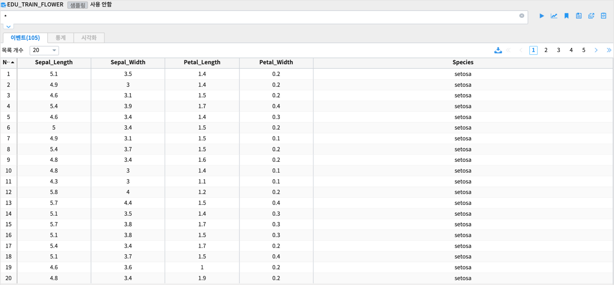
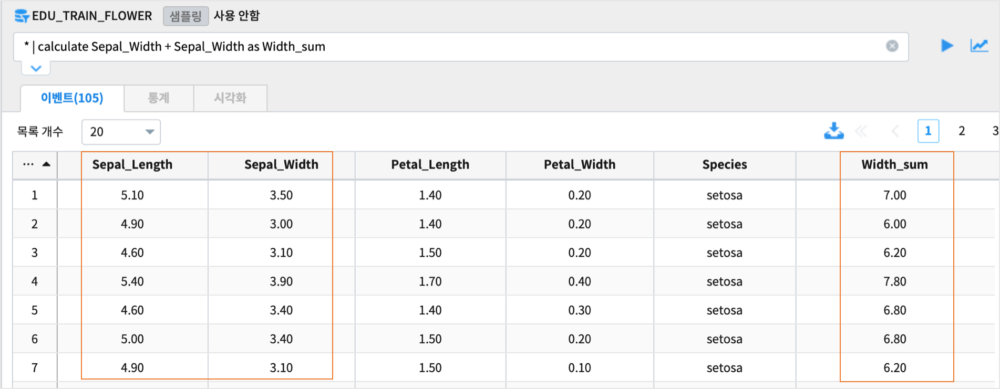
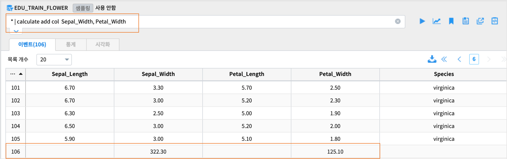
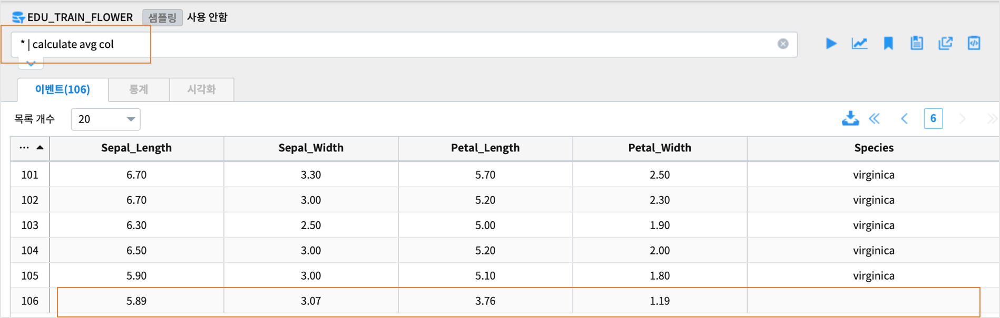
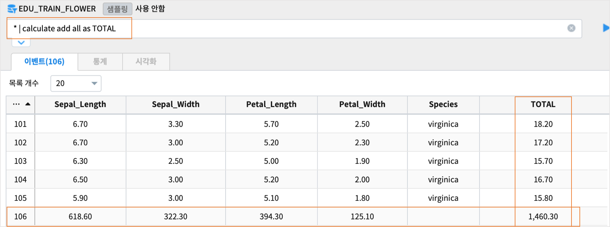
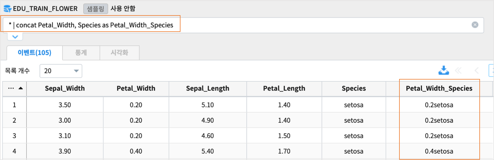
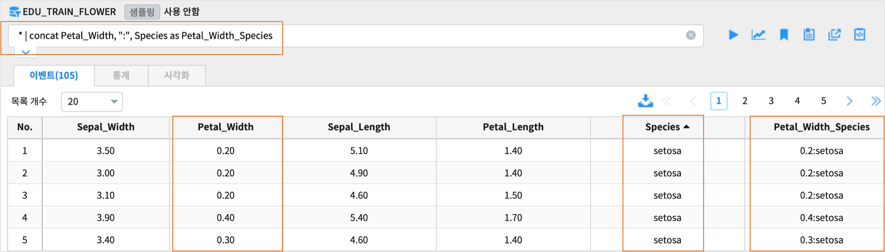
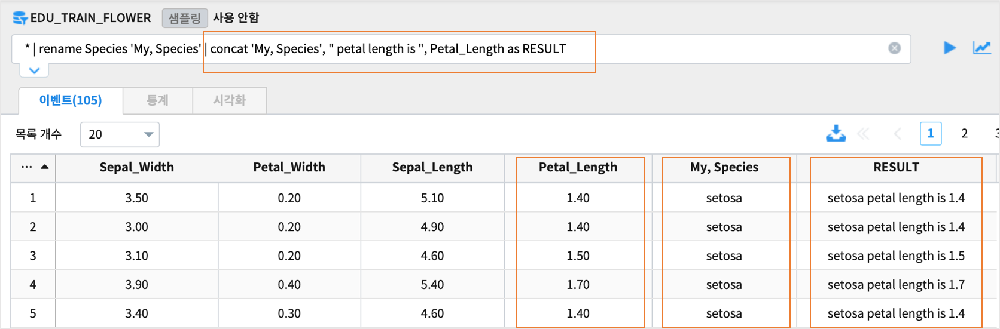
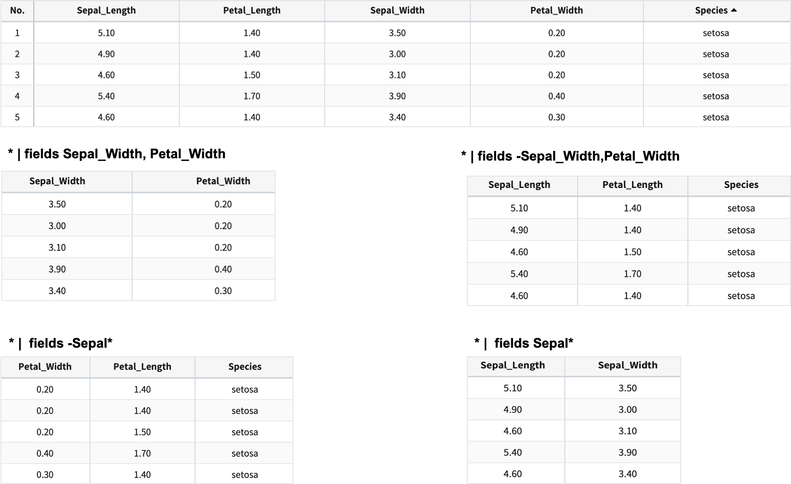
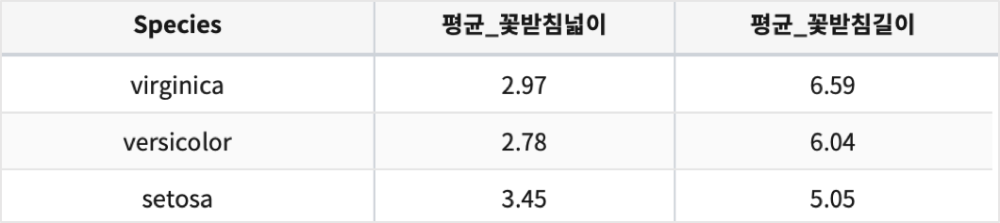

================================================================================================
검색어예제: distinct/round/calculate/concat/fields/pivot
================================================================================================

.. contents::
    :backlinks: top

| 계속 추가할 예정입니다.

''''''''''''''''''''''''''''''''''''''''''''''''''''''''''''''''''''''''''''''''''
데이터 :  붓꽃 데이터
''''''''''''''''''''''''''''''''''''''''''''''''''''''''''''''''''''''''''''''''''

| 데이터 모델 : EDU_TRAIN_FLOWER
| 데이터 분석에서 가장 많이 사용되는 IRIS(붓꽃) 데이터입니다.

    

'''''''''''''''''''''''''''''''''''''''''
distinct
'''''''''''''''''''''''''''''''''''''''''

| 몇개의 종(Species) 이 있는지 distinct 로 알아보는 예제

.. code:: 

  * | distinct  Species

| Sepal_Length, Petal_Length 컬럼을 소수점 자리를 반올림하여 정수로 만든 후 distinct 실행 예제

.. code::

  * | round [0, 0] col = [Sepal_Length,   Petal_Length]  |  distinct  Sepal_Length,   Petal_Length

'''''''''''''''''''''''''''''''''''''''''
round
'''''''''''''''''''''''''''''''''''''''''

..............................................................................
컬럼이름으로 반올림하기
..............................................................................

| 데이터모델의 모든 숫자형 컬럼을 소수점 1자리로 반올림하는 예제

.. code::

  * | round 1

| 컬럼(숫자형) 1개를 반올림하는 예제

.. code::
 
  ### 소수점 1자리로 Sepal_Length 를 반올림합니다.
  * |  round 1 col = Sepal_Length 

  ### 소수점이 0자리 즉 정수로 Sepal_Length 를 반올림합니다.
  * |  round 0 col = [Sepal_Length] 

| 컬럼(숫자형) 2개 이상을 반올림하는 예제

.. code::

  * |  round [1, 1] col = [Sepal_Length,   Petal_Length]  

..............................................................................
idx 로 반올림하기
..............................................................................

| idx 는 파이프로 넘어오는 데이터 필드 순서대로 0,1,2,,, 로 assign 됩니다.
| 데이터모델 EDU_TRAIN_FLOWER 의 검색 결과 순서는 Sepal_Length, Sepal_Width, Petal_Length, Petal_Width, Species 입니다.

.. code::

  * | round 0  idx = [0,1]

  ## Sepal_Length, Sepal_Width 가 반올림으로 정수가 됩니다.

.. code::

  * | fields -Sepal_Length | round 0  idx = [0,1]

  ## Sepal_Length 를 제외하고 파이프로 넘어오면 Sepal_Width, Petal_Length, Sepal_Width, Species 순서이므로
  ## Sepal_Width, Petal_Length 가 소수점없는 반올림으로 정수가 됩니다.

  * | fields -Sepal_Length | round [0,1]  idx = [0,1]

  ## Sepal_Width 는 소수점없는 반올림으로 정수, Petal_Length 는 소수점 1자리로 반올림합니다.

''''''''''''''''''''''''''''''''''''''''''''''''
calculate
''''''''''''''''''''''''''''''''''''''''''''''''

........................................................................
컬럼간의 사칙연산
........................................................................

| 사칙연산(+, -, /, *) 는 컬럼간의 연산이 가능합니다.
| AS 문으로 결과 컬럼을 설정하지 않으면, 자동으로 **calculated** 컬럼으로 표시됩니다.
| 함수 add row, avg row 도 컬럼간의 연산이 가능합니다.

| Sepal_Width + Sepal_Width 를  Width_sum 이라는 새 컬럼에 저장하는 예제

.. code::

  * | calculate Sepal_Width + Sepal_Width as Width_sum

| **add row** 를 이용하면 동일한 결과가 나옵니다.

.. code::

  * | calculate add row  Sepal_Width, Petal_Width  as Width_sum 
  

  
| (Sepal_Width + Petal_Width) / 2  결과를 Width_avg 컬럼에 저장하는 예제.

.. code::

  * | calculate ( Sepal_Width +  Petal_Width) / 2  as Width_avg  

| **avg row** 를 이용하면 동일한 결과가 나옵니다.

.. code::

  * | calculate avg row Sepal_Width , Petal_Width  as Width_avg  

..........................................................................................
ADD, AVG 함수로 행/열단위로 연산하기
..........................................................................................

| ADD 함수로 Sepal_Width,  Petal_Width 컬럼의 모든 값을 더해서 합계를 구합니다.
| 총 105개 행의 데이터에서 마지막 106번째 행에 해당 켤럼의 합계가 표시됩니다. 

.. code::

  * | calculate add col  Sepal_Width, Petal_Width 

| AVG 함수로 숫자형 컬럼의 평균을 구합니다.
| 총 105개 행의 데이터에서 마지막 106번째 행에 숫자형 켤럼의 평균값이 표시됩니다.

.. code::

  * | calculate avg col 

| 모든 숫자형 컬럼의 값을 행단위/열단위로 더한 합계를 표시합니다.

.. code::

  * | calculate add all as TOTAL

''''''''''''''''''''''''''''''''''''''''''''''''
concat
''''''''''''''''''''''''''''''''''''''''''''''''

| 컬럼을 연결하는 명령어입니다.
| AS 문으로 결과 컬럼을 설정하지 않으면, 자동으로 **concated** 컬럼으로 표시됩니다.

| Petal_Width, Species 컬럼을 구분자없이 concatenation 하는 예제입니다.

.. code::

  * | concat Petal_Width, Species as Petal_Width_Species

| Petal_Width,  ":" , Species 를 concatenation 하는 예제

.. code::

  * | concat Petal_Width, ":", Species as Petal_Width_Species

| 컬럼이름에 빈칸, 콤마(,) 등이 있는 경우에는 **'** 로 컬럼이름에 사용하여 처리합니다.

.. code::

   ## 컬럼이름을 'My, Species' 로 rename 한 후 , 연결하는 예제
   * | rename Species 'My, Species' | concat 'My, Species', " petal length is ", Petal_Length as RESULT

''''''''''''''''''''''''''''''''''''''''''''''''
fields
''''''''''''''''''''''''''''''''''''''''''''''''

| 데이터중에서 일부 필드만 선택 및 제외하여 출력하는 명령어입니다.

| 일부 필드만 출력

.. code::

  * | fields Sepal_Width,Petal_Width

  ## Sepal 로 시작하는 패턴의 필드명 데이터만 출력합니다.
  * | fields Sepal*

| 일부 필드 제외하고 출력

.. code::

  * | fields -Sepal_Width,Petal_Width

  ## Sepal 로 시작하는 패턴의 필드명 데이터는 제외하고 출력합니다.
  * | fields -Sepal*

''''''''''''''''''''''''''''''''''''''''''''''''''''''''''''''''
pivot
''''''''''''''''''''''''''''''''''''''''''''''''''''''''''''''''

..............................
SPLITROW
..............................

| Species(종)을 행으로 split ( **SPLITROW** ) 하여(3개의 종 -> 3개의 행) 
| Species(종) 별로 Sepal_Width 의 평균,  Petal_Width 의 평균을 구합니다.
| alias 로 avg(Sepal_Width) => 평균_꽃받침넓이, avg(Sepal_Length) => 평균_꽃받침길이

.. code::

  * | pivot avg(Sepal_Width) as 평균_꽃받침넓이, avg(Sepal_Length) as 평균_꽃받침길이 SPLITROW Species

..............................
SPLITCOL
..............................

| Species를 컬럼으로 split 해서 ( **SPLITCOL** ) Sepal_Width 의 평균,  Petal_Width 의 평균을 구합니다.

.. code::

  * | pivot avg(Sepal_Width) as 평균_꽃받침넓이, avg(Sepal_Length) as 평균_꽃받침길이 SPLITCOL Species

............................................................
SPLITROW & SPLITCOL
............................................................

| continent별 원유수입량을 연도별로 보는 예제입니다.

| 연간 국가별 원유 수입량 데이터 도델 : EDU_DEMO_OIL_IMPORT 
| 행 : year
| 컬럼 : Continent 
| 값 : 원유수입양 합계

.. code::

   Continent!='합계' | pivot sum(Barrel) as 원유수입양 SPLITROW year SPLITCOL Continent |  sort year

.. image:: ./images/import_oil_pivot_11.png
    :scale: 60%
    :alt: pivot import oil 11

  

