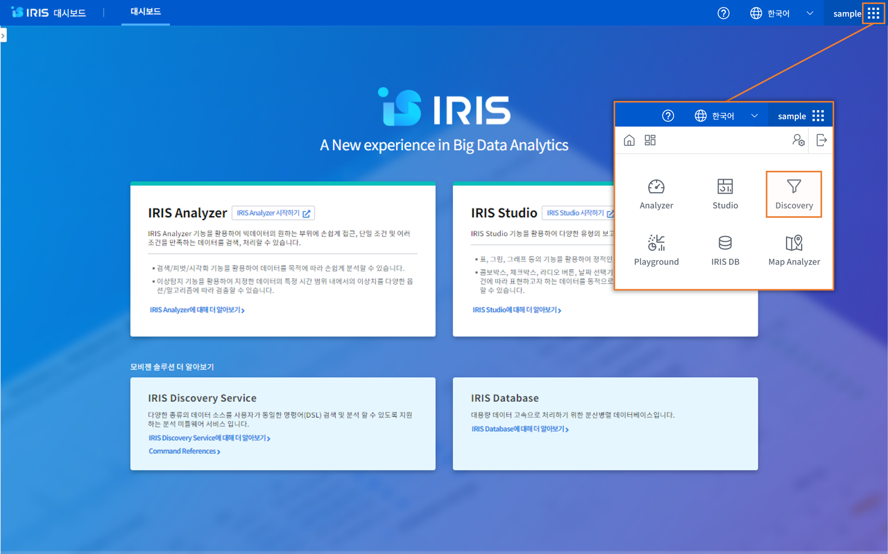
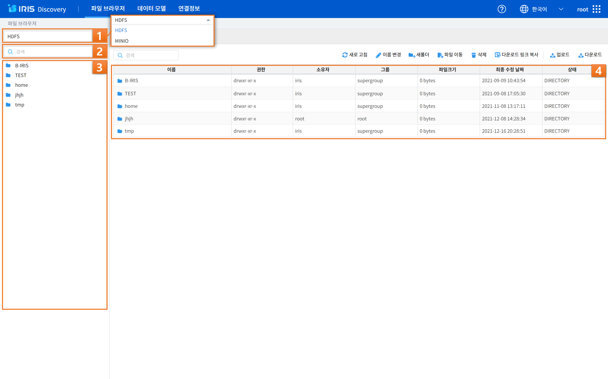
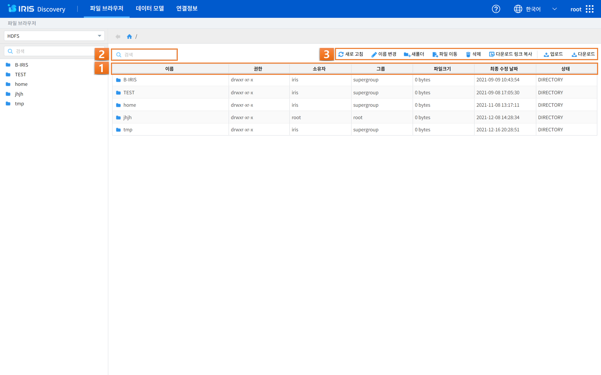
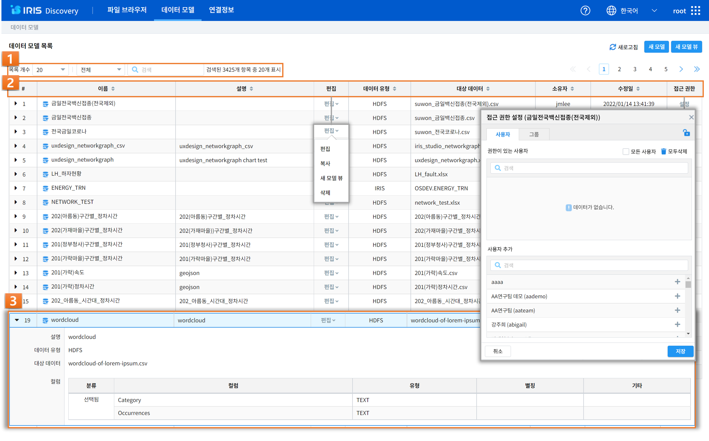
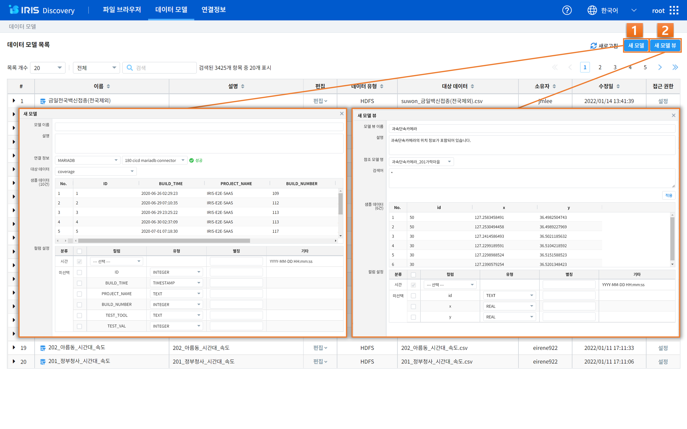
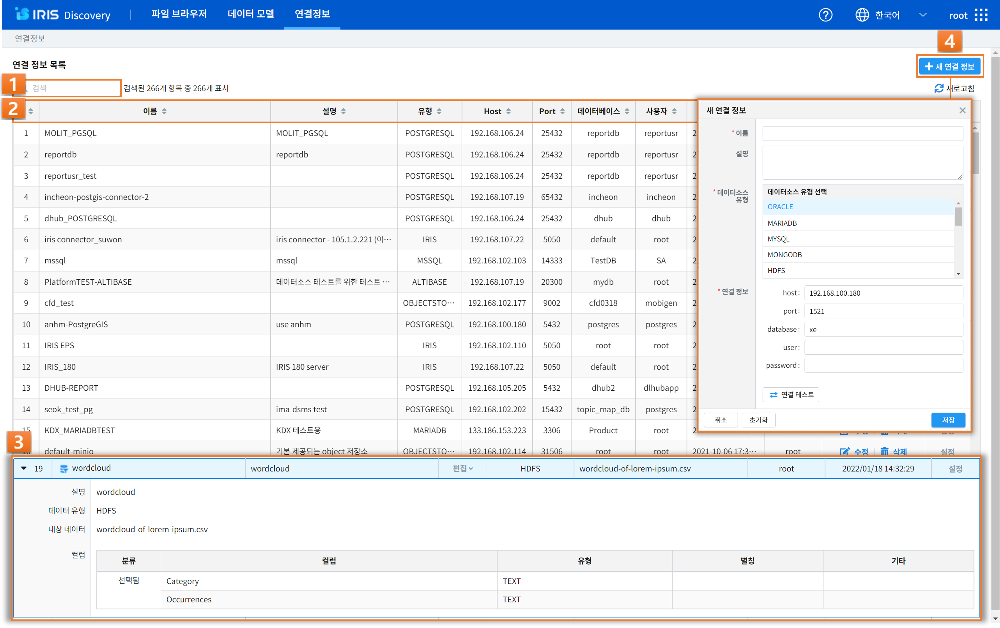

IRIS Discovery
======================
| IRIS Discovery는 다양한 종류의 데이터 소스를 사용자가 단일 명령 인터페이스인 DSL(Domain Specifics Language) 명령을 통해 데이터를 검색 및 분석 할 수 있도록 지원하는 분석 미들웨어 서비스입니다.
| 각 명령어는 파이프라인을 이용한 입출력 데이터 연결을 지원하며, 명령의 조합을 통한 다양한 분석으로 확장이 용이합니다.
| IRIS Discovery의 각각의 메뉴는 Analyzer, Studio 에서 분석에 활용할 데이터를 파일로 찾거나 저장하고, 데이터 모델로 생성하고 관리할 수 있는 메뉴, 외부 데이터 소스를 선택하고 연결 및 관리할 수 있는 연결정보 메뉴로 구성되어 있습니다. 
|
| 우측 상단의 메인 메뉴의 ‘Discovery’ 버튼을 눌러 접속하실 수 있습니다.

------------------------------------------------------------------

파일 브라우저
---------------
| IRIS Discovery의 파일 브라우저는 Anayzer, Studio 에서 사용할 여러 가지 파일들을 관리하는 메뉴입니다.
| 파일을 저장하는 영역에 따라 HDFS(하둡 분산 파일 시스템; Hadoop Distributed File System), MINIO(오브젝트 스토리지, Minimal Object Storage) 등이 있습니다.
| 계정별로 파일을 저장할 수 있는 공간을 제공합니다.

+------+-----------------------+------------------------------------------------------------------------------------------------------------------------+
| 번호 | 구분                  | 설명                                                                                                                   |
+======+=======================+========================================================================================================================+
| 1    | 파일 브라우저         | 파일 브라우저의 폴더 유형을 선택할 수 있습니다. 제공하고 있는 파일 브라우저의 유형은 HDFS, MINIO 등이 있습니다.        |
+------+-----------------------+------------------------------------------------------------------------------------------------------------------------+
| 2    | 폴더 명               | 폴더명을 검색할 수 있습니다.                                                                                           |
+------+-----------------------+------------------------------------------------------------------------------------------------------------------------+
| 3    | 폴더 목록             | 폴더 목록이 나타납니다.                                                                                                |
+------+-----------------------+------------------------------------------------------------------------------------------------------------------------+
| 4    | 폴더 이동             | 폴더를 누르면 하위 폴더 목록으로 이동할 수 있습니다.                                                                   |
+------+-----------------------+------------------------------------------------------------------------------------------------------------------------+

- **파일 브라우저**

    - HDFS: 하둡 분산 파일 시스템의 약자로, 대용량 파일을 다룰 수 있도록 설계되어 있는 파일 시스템 입니다. 계정별로 폴더가 제공되며, 파일을 업로드하거나 관리할 수 있습니다.
    - MINIO: 클라우드 기반 Object Strorage의 하나입니다. 계정별로 bucket이 제공되며 파일을 업로드하거나 관리할 수 있습니다.

+------+--------------------------+-----------------------------------------------------------------------------------------------------------------------------+
| 번호 | 구분                     | 설명                                                                                                                        |
+======+==========================+=============================================================================================================================+
| 1    | 파일 정보                | 이름, 권한, 소유자, 그룹, 파일 크기, 최종 수정 날짜, 상태 등의 파일 정보를 확인할 수 있습니다.                              |
+------+--------------------------+-----------------------------------------------------------------------------------------------------------------------------+
| 2    | 파일 검색                | 파일 명을 검색할 수 있습니다.                                                                                               |
+------+--------------------------+-----------------------------------------------------------------------------------------------------------------------------+
| 3    | 부가 기능                | 파일 목록 새로고침, 이름 변경(HDFS 한정), 새폴더, 파일 이동, 삭제, 다운로드 링크 복사, 업로드 및 다운로드를 할 수 있습니다. |
+------+--------------------------+-----------------------------------------------------------------------------------------------------------------------------+

데이터 모델
---------------

| 데이터 모델은 특정한 데이터 셋을 추상화 한 것입니다. 여기서 데이터 셋은 일반적으로 데이터베이스(DB)의 테이블 혹은 CSV 등의 형식의 파일을 말합니다.
| 사용자는 연결정보를 통해 원하는 데이터 셋을 조회/접근하여 컬럼을 선택, 타입 변경과 같은 작업을 통해 자신에게 필요한 형태의 데이터 모델을 생성할 수 있으며, 하나의 데이터 셋에서 여러 개의 데이터 모델을 목적에 맞게 생성할 수 있는 장점이 있습니다.
| IRIS Analyzer, Studio 에서 제공하는 대부분의 기능들은 데이터 모델을 기반으로 동작하기 때문에 데이터 모델을 생성은 모든 작업의 시작이라고 할 수 있습니다.
|
| 데이터 모델 메뉴는 IRIS Discovery 의 하위 메뉴이며, 데이터모델 목록을 보여줍니다.

+------+------------------------------------------------------------------------+--------------------------------------------------------------------------------------------------------------------------------------------------------------------------------------------------------------------------------------------------------------------------------------------------+
| 번호 | 구분                                                                   | 설명                                                                                                                                                                                                                                                                                             |
+======+========================================================================+==================================================================================================================================================================================================================================================================================================+
|| 1   || 데이터 모델 조회                                                      || 목록의 개수, 유형별 필터, 모델 명 검색을 할 수 있습니다.                                                                                                                                                                                                                                        |
+------+------------------------------------------------------------------------+--------------------------------------------------------------------------------------------------------------------------------------------------------------------------------------------------------------------------------------------------------------------------------------------------+
|| 2   || 데이터 모델 목록                                                      || 이름, 설명, 데이터 유형, 대상 데이터, 소유자, 수정일 등을 확인할 수 있으며, 편집(복사, 새 모델 뷰, 삭제) 및 접근 권한 설정(사용자/그룹 권한 부여 및 제거) 등의 설정을 할 수 있습니다.                                                                                                           |
+------+------------------------------------------------------------------------+--------------------------------------------------------------------------------------------------------------------------------------------------------------------------------------------------------------------------------------------------------------------------------------------------+
|| 3   || 데이터 모델 정보                                                      || 목록에서 모델명 좌측에 위치한 ‘▶ 아이콘’을 클릭하여 현재 생성된 데이터 모델의 상세 정보를 확인할 수 있으며, ‘▼ 아이콘’을 통해 데이터 모델의 상세 정보를 닫을 수 있습니다.                                                                                                                       |
||     ||                                                                       || 연결정보 상세보기를 통해 선택한 연결정보에 대한 설명, 데이터 유형, 대상 데이터, 컬럼 정보를 확인할 수 있습니다.                                                                                                                                                                                 |
+------+------------------------------------------------------------------------+--------------------------------------------------------------------------------------------------------------------------------------------------------------------------------------------------------------------------------------------------------------------------------------------------+

- **데이터 모델 목록**

    - # : 데이터 모델의 순서가 표시 됩니다.
    - 이름 : 데이터 모델의 이름이 표시 됩니다.
    - 설명 : 데이터 모델에 대한 설명이 표시 됩니다. 데이터 모델을 생성할 때 입력한 설명 내용입니다.
    - 편집 : 해당 데이터 모델의 관리 메뉴입니다. 소유자가 아닐 경우 편집, 삭제 메뉴는 표시되지 않습니다.
    - 데이터 유형 : 데이터 모델의 데이터 유형이 표시됩니다. 데이터 유형은 MARIADB, HDFS, OBJECTSTORAGE(MinIO) 등이 있으며 데이터모델뷰의 경우 VIEW 로 표시됩니다.
    - 대상 데이터 : 데이터 모델의 원본 데이터셋에 대한 정보가 표시됩니다. DB 유형인 경우 테이블명이, 파일인 경우 파일 이름이 표시됩니다.
    - 소유자 : 데이터 모델을 생성한 소유자의 아이디가 표시 됩니다.
    - 수정일 : 데이터 모델이 마지막으로 수정된 날짜가 표시 됩니다.
    - 접근 권한: 데이터 모델에 대하여 개별 사용자에 대한 접근 권한을 부여/해제 할 수 있습니다.

- **접근 권한 설정**

    - 사용자/그룹 탭: 사용자 혹은 그룹을 전환하기 위한 탭입니다.
    - 모든 사용자 체크박스: 모든 사용자에게 공유하고자 할 때 체크하는 설정입니다.
    - 현재 권한 목록: 현재 접근 권한을 가진 사용자 혹은 ‘사용자 목록’에서 권한을 부여한 사용자 목록입니다.
    - 사용자 목록: 모든 사용자 목록에 해당하며, ‘추가’ 버튼을 클릭하면 ‘현재 권한 목록’에 추가됩니다.

- **편집(관리 메뉴)**

    - 편집: 데이터 모델의 이름/설명/필드 등을 수정할 수 있는 편집 창을 띄웁니다.
    - 복사: 해당 데이터 모델과 동일한 데이터 모델을 생성합니다. 메뉴를 선택하면 해당 데이터 모델의 내용을 가지고 새 모델 창을 띄웁니다.
    - 새 모델 뷰: 해당 데이터 모델을 참조로 하는 데이터 모델 뷰를 생성합니다. 메뉴를 선택하면 해당 데이터 모델의 정보를 가지고 '새 모델 뷰' 창을 띄웁니다.
    - 삭제: 해당 데이터 모델을 삭제합니다. 데이터 모델을 삭제하면 복구할 수 없으며, Studio 등의 관련된 UI 에서 더이상 사용할 수 없게 됩니다.

|

|

+------+--------------------+---------------------------------------------------------------------------------------------------------------------------------------------------------------------------------------------------------------------------------------+
| 번호 | 구분               | 설명                                                                                                                                                                                                                                  |
+======+====================+=======================================================================================================================================================================================================================================+
|| 1   || 새 모델           || '새 모델’ 버튼을 클릭하면 새 모델 팝업창이 뜨고, 모델 이름/모델에 대한 설명/연결정보/대상 데이터/샘플 데이터/컬럼 설정을 바탕으로 새 데이터 모델을 생성할 수 있습니다.                                                               |
||     ||                   || 연결정보의 연결 가능한 데이터 소스 유형은 다음을 확인합니다.                                                                                                                                                                         |
+------+--------------------+---------------------------------------------------------------------------------------------------------------------------------------------------------------------------------------------------------------------------------------+
|| 2   || 새 모델 뷰        || 기존 데이터 모델을 참조로 하는 새 데이터 모델 뷰(view) 를 생성할 수 있습니다. 참조 모델로 선택한 데이터 모델에 DSL 명령어 구문을 사용하여 변환, 집계, 필터링한 결과를 하나의 데이터 모델처럼 사용할 수 있습니다.                     |
+------+--------------------+---------------------------------------------------------------------------------------------------------------------------------------------------------------------------------------------------------------------------------------+

- **새 모델**

    - 모델 이름: (필수) 생성하는 데이터 모델의 이름을 입력합니다.

    - 설명: (선택) 생성하는 데이터 모델에 대한 설명을 입력합니다.

    - 연결정보: 데이터 유형과 연결정보를 선택합니다. 데이터 유형을 선택하면, 해당 데이터 유형의 연결정보가 콤보박스 목록에 표시됩니다.

    - 대상 데이터: 대상 데이터 셋을 지정합니다. 연결정보를 선택하면 해당 연결정보로 접근할 수 있는 데이터 셋이 콤보박스 목록에 표시됩니다. 데이터 유형이 HDFS, OBJECTSTORAGE 등 파일 유형인 경우에는 파일 경로를 입력하거나 선택하는 UI 가 나타나며, 파일 유형(csv, json, ...)에 따라 분리기호 등의 설정을 추가로 할 수 있습니다.

    - 샘플 데이터: 연결 정보와 대상 데이터를 지정하면 해당 데이터 셋의 샘플 데이터를 가져와 표시합니다. 이를 참고로 하여 컬럼 설정을 할 수 있습니다.

    - 컬럼 설정: 데이터 셋의 컬럼 중에서 분석 작업에 사용될 컬럼을 선택합니다. 

        - 시간

            - 날짜 혹은 시간 기준으로 분석 작업을 수행하고자 할 때, 기준이 되는 시간값을 지정하는 설정입니다.
            - 선택한 컬럼이 문자열 유형일 경우, "기타" 입력란의 시간 포맷(ex) YYYY-MM-DD HH:mm:ss)과 형식이 일치해야 정상 동작합니다.
            - 시간 포맷 입력 방법은 http://momentjs.com/docs/#/parsing/string-format/ 을 참고하시기 바랍니다.
            - 선택하지 않을 경우 시간과 관련된 기능을 사용할 수 없습니다. 단, IRIS-DB 테이블 중에서 LOCAL 테이블은 시간 컬럼을 필수로 선택해야 합니다

        - 원시

            - 전문 검색 기능(Full Text Search)에 사용될 컬럼을 선택합니다.

        - 선택됨

            - 사용자에 의해 선택된 컬럼의 목록입니다.
            - 타입 변경이 가능하며 타입을 TIMESTAMP 로 변경 지정한 경우 시간 컬럼과 동일하게 시간 포맷을 입력해야 합니다.

        - 미선택

            - 선택되지 않은 컬럼의 목록 입니다.
            - 선택되지 않은 컬럼은 분석 작업에서 제외되며 DSL 등의 문법에서 사용할 수 없습니다.

- **새 모델 뷰**

    - 참조 모델 명: 뷰를 생성할 기존 데이터 모델을 선택합니다.
    - 시간 설정: 참조모델에 시간유형 컬럼이 있어서 뷰로 만들 시간을 지정할 수 있습니다.
    - 검색어: 참조할 데이터 모델을 대상으로 검색어 구문을 입력합니다. 생성되는 데이터 모델 뷰는 검색어 구문의 실행 결과가 데이터 모델로 설정되어 표시됩니다.
    - 샘플 데이터: 참조 데이터 모델 대상으로 검색어 구문을 실행한 결과가 10건만 표시됩니다.
    - 컬럼 설정: 검색어 실행 결과로 새로 생성되는 데이터의 컬럼이 표시되며, 컬럼 선택 여부 및 유형 변경도 가능합니다.

- **데이터 모델 조회**

    - 설명: 데이터 모델을 생성할 때 데이터 모델에 대해 적은 설명이 표시됩니다.
    - 데이터 유형: IRIS DB 테이블(IRIS),HDFS 파일(HDFS), MINIO 파일(OBJECTSTORAGE), 데이터모델 뷰(VIEW)와 같은 데이터 유형을 선택할 수 있습니다.
    - 대상 데이터: 데이터 모델이 생성된 테이블, 파일의 이름 또는 경로가 표시됩니다.
    - 컬럼: 분류/컬럼 명/컬럼 유형/컬럼 별칭/기타 등 데이터 모델 컬럼의 정보가 표시됩니다.
  
|

- 연결 가능한 외부 데이터 소스 유형
 
+------+------------------+---------------------------------------------------+
| 번호 | 데이터 소스 이름 | 관련 URL                                          |
+======+==================+===================================================+
| 1    | ORACLE           | oracle.com                                        |
+------+------------------+---------------------------------------------------+
| 2    | MARIADB          | www.mariadb.org                                   |
+------+------------------+---------------------------------------------------+
| 3    | MySQL            | mysql.com                                         |
+------+------------------+---------------------------------------------------+
| 4    | MONGODB          | mongodb.com                                       |
+------+------------------+---------------------------------------------------+
| 5    | HDFS             | hadoop.apache.org                                 |
+------+------------------+---------------------------------------------------+
| 6    | HBASE            | hbase.apache.org                                  |
+------+------------------+---------------------------------------------------+
| 7    | POSTGRESQL       | postgresql.org                                    |
+------+------------------+---------------------------------------------------+
| 8    | TIBRERO          | tmaxdata.com                                      |
+------+------------------+---------------------------------------------------+
| 9    | IRIS             | mobigen.com/solution/IRIS-Big-data-DB-Cluster.php |
+------+------------------+---------------------------------------------------+
| 10   | OBJECTSTORAGE    | min.io                                            |
+------+------------------+---------------------------------------------------+
| 11   | KTCLOUDSTORAGE   | cloud.kt.com                                      |
+------+------------------+---------------------------------------------------+
| 12   | ELASTICSEARCH    | elastic.com                                       |
+------+------------------+---------------------------------------------------+
| 13   | VECTORWISE       | actian.com                                        |
+------+------------------+---------------------------------------------------+
| 14   | MySQL5           | mysql.com                                         |
+------+------------------+---------------------------------------------------+
| 15   | DRUID            | druid.apache.org                                  |
+------+------------------+---------------------------------------------------+
| 16   | ALTIBASE         | altibase.com                                      |
+------+------------------+---------------------------------------------------+
| 17   | MSSQL            | microsoft.com/en-us/sql-server/sql-server-2022    |
+------+------------------+---------------------------------------------------+

|

연결정보
---------------
연결정보에서는 IRIS에서 사용할 수 있는 외부 데이터 소스를 선택하고 연결 및 관리할 수 있는 기능을 제공합니다.

+------+----------------------------------------+--------------------------------------------------------------------------------------------------------------------------------------------------------------------------------------------------------------------------------------------------------------------------------------------------------------+
| 번호 | 구분                                   | 설명                                                                                                                                                                                                                                                                                                         |
+======+========================================+==============================================================================================================================================================================================================================================================================================================+
|| 1   || 연결정보 목록 검색                    || 연결정보 목록을 검색할 수 있습니다.                                                                                                                                                                                                                                                                         |
+------+----------------------------------------+--------------------------------------------------------------------------------------------------------------------------------------------------------------------------------------------------------------------------------------------------------------------------------------------------------------+
|| 2   || 연결정보 목록 정보                    || 이름, 설명, 유형, Host, Port, 데이터베이스, 사용자, 수정일, 소유자 정보를 확인하고, 연결정보를 편집하거나 접근 권한 설정을 할 수 있습니다.                                                                                                                                                                  |
+------+----------------------------------------+--------------------------------------------------------------------------------------------------------------------------------------------------------------------------------------------------------------------------------------------------------------------------------------------------------------+
|| 3   || 연결정보 상세보기                     || 목록에서 모델명 좌측에 위치한 ‘▶’ 아이콘을 클릭하여 현재 생성된 데이터 모델의 상세 정보를 확인할 수 있으며, ‘▼’ 아이콘을 통해 데이터 모델의 상세 정보를 닫을 수 있습니다.                                                                                                                                   |
||     ||                                       || 연결정보 상세보기를 통해 선택한 연결정보에 대한 설명, 데이터 유형, 대상 데이터, 컬럼 정보를 확인할 수 있습니다.                                                                                                                                                                                             |
+------+----------------------------------------+--------------------------------------------------------------------------------------------------------------------------------------------------------------------------------------------------------------------------------------------------------------------------------------------------------------+
|| 4   || 새 연결 정보                          || ‘+ 새 연결 정보’ 버튼을 클릭하여 연결정보 이름, 설명, 데이터소스 유형 선택, 연결 정보 입력을 통해 연결정보를 새롭게 추가할 수 있습니다.                                                                                                                                                                     |
||     ||                                       || 데이터 소스 유형에 따라 입력해야 할 정보가 변경되어 나타나며, 입력한 정보로 ‘연결 테스트＇를 진행하고 성공하면 연결 정보의 이름 및 설명 등을 저장할 수 있습니다.                                                                                                                                            |
+------+----------------------------------------+--------------------------------------------------------------------------------------------------------------------------------------------------------------------------------------------------------------------------------------------------------------------------------------------------------------+

- **새 연결 정보**

    - 연결 정보 이름: (필수) 생성하는 연결정보의 이름을 입력합니다. 
    - 설명: (선택) 생성하는 연결정보에 대한 유의 사항이나 용도 등 사용시 도움이 되는 정보를 입력합니다.
    - 데이터 소스 유형: (필수) 데이터 소스 유형 중 원하는 유형을 선택합니다.
    - 연결 테스트: 연결이 원활하게 이루어 졌는지 시험해 볼 수 있습니다.
    - 저장: 저장을 통해 생성한 연결 정보를 저장할 수 있습니다.

|

- (연결정보) DBMS 관련 항목

+------+----------+--------------------------------------------------------------+
| 번호 | 구분     | 설명                                                         |
+======+==========+==============================================================+
| 1    | host     | 해당 Database를 접속하기 위한 ip 주소입니다.                 |
+------+----------+--------------------------------------------------------------+
| 2    | port     | 해당 Database를 접속하기 위한 port 정보입니다.               |
+------+----------+--------------------------------------------------------------+
| 3    | database | 접속하려는 DBMS의 Database입니다.                            |
+------+----------+--------------------------------------------------------------+
| 4    | user     | 접속하려는 DBMS의 사용자 id입니다.                           |
+------+----------+--------------------------------------------------------------+
| 5    | password | 접속하려는 DBMS의 사용자 비밀번호 입니다.                    |
+------+----------+--------------------------------------------------------------+
| 6    | postgis  | gis 관련 확장기능(extension)이 추가되었을 경우에 체크합니다. |
+------+----------+--------------------------------------------------------------+

|

- (연결정보) HDFS 관련 항목

+------+-----------+-----------------------------------------------------------+
| 번호 | 구분      | 설명                                                      |
+======+===========+===========================================================+
| 1    | host      | HDFS 마스터 노드의 host 정보입니다.                       |
+------+-----------+-----------------------------------------------------------+
| 2    | rest.port | HDFS의 Web API 포트 정보입니다. 기본값은 50070 입니다.    |
+------+-----------+-----------------------------------------------------------+
| 3    | port      | HDFS 마스터 노드의 port 정보입니다. 기본값은 8082 입니다. |
+------+-----------+-----------------------------------------------------------+
| 4    | user      | HDFS Web API 요청 시 사용될 HDFS의 사용자 ID입니다.       |
+------+-----------+-----------------------------------------------------------+
| 5    | group     | HDFS Web API 요청 시 사용될 HDFS의 그룹 정보입니다.       |
+------+-----------+-----------------------------------------------------------+
| 6    | path      | HDFS 의 폴더/파일에 접근시 시작 경로입니다.               |
+------+-----------+-----------------------------------------------------------+

|

- (연결정보) OBJECTSTORAGE 관련 항목

+------+------------+----------------------------------------------------------------------------------------------+
| 번호 | 구분       | 설명                                                                                         |
+======+============+==============================================================================================+
| 1    | host       | OBJECTSTORAGE에 접속하기 위한 host 정보입니다.                                               |
+------+------------+----------------------------------------------------------------------------------------------+
| 2    | port       | OBJECTSTORAGE에 접속하기 위한 port 정보입니다.                                               |
+------+------------+----------------------------------------------------------------------------------------------+
| 3    | bucket     | OBJECTSTORAGE에 접속하려는 bucket 이름입니다.                                                |
+------+------------+----------------------------------------------------------------------------------------------+
| 4    | access_key | OBJECTSTORAGE에 접속하기 위한 access_key 입니다.                                             |
+------+------------+----------------------------------------------------------------------------------------------+
| 5    | secret_key | OBJECTSTORAGE에 접속하기 위한 secret_key 입니다.                                             |
+------+------------+----------------------------------------------------------------------------------------------+
| 6    | region     | s3의 경우 스토리지가 속해 있는 영역(region)의 정보이며, MINIO의 경우 디폴트 값을 사용합니다. |
+------+------------+----------------------------------------------------------------------------------------------+
| 7    | ssl        | https 접속일 경우 체크합니다.                                                                |
+------+------------+----------------------------------------------------------------------------------------------+

|

- (연결정보) KTCLOUDSTORAGE 관련 항목

+------+-----------+---------------------------------------------------------------------------------------+
| 번호 | 구분      | 설명                                                                                  |
+======+===========+=======================================================================================+
| 1    | host      | 접속을 위한 host 정보입니다.                                                          |
+------+-----------+---------------------------------------------------------------------------------------+
| 2    | port      | 접속을 위한 port 정보입니다.                                                          |
+------+-----------+---------------------------------------------------------------------------------------+
| 3    | container | 접속을 위한 container 정보입니다.                                                     |
+------+-----------+---------------------------------------------------------------------------------------+
| 4    | user      | 접속하려는 사용자의 id입니다.                                                         |
+------+-----------+---------------------------------------------------------------------------------------+
| 5    | password  | 접속하려는 사용자의 비밀번호 입니다.                                                  |
+------+-----------+---------------------------------------------------------------------------------------+
| 6    | account   | 접속을 하기 위한 사용자의 account 정보입니다. 사용자 계졍벌로 namespace가 생성됩니다. |
+------+-----------+---------------------------------------------------------------------------------------+

|

- (연결정보) DRUID 관련 항목

+------+--------+------------------------------+
| 번호 | 구분   | 설명                         |
+======+========+==============================+
| 1    | host   | 접속을 위한 host 정보입니다. |
+------+--------+------------------------------+
| 2    | port   | 접속을 위한 port 정보입니다. |
+------+--------+------------------------------+
| 3    | zkhost | zookeeper host 정보입니다.   |
+------+--------+------------------------------+
| 4    | zkport | zookeeper port 정보입니다.   |
+------+--------+------------------------------+
