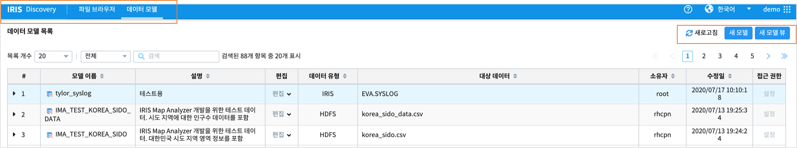
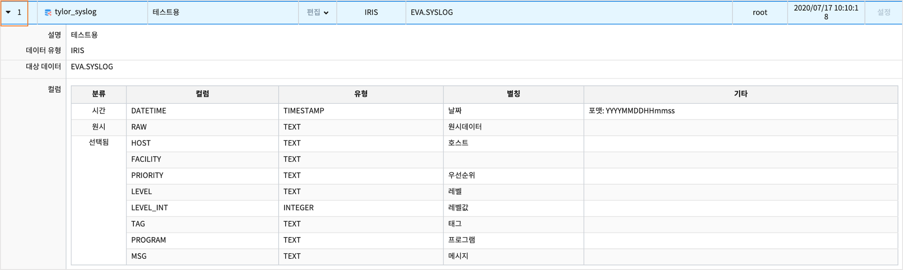
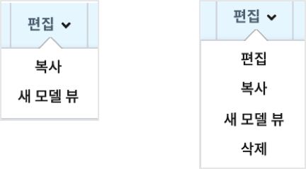

========================================
데이터 모델
========================================

| 데이터 모델은 특정한 데이터 셋을 추상화 한 것입니다. 
| 여기서 데이터 셋은 DB에서 일반적으로 말하는 테이블이나 CSV과 같은 파일을 말합니다. 
| 사용자는 IRIS나 HDFS에서 저장된 데이터 셋을 가지고 컬럼을 선택, 타입 변경과 같은 작업을 통해 자신에게 필요한 형태의 데이터 모델을 생성할 수 있습니다. 
| 하나의 데이터 셋에서 여러 개의 데이터 모델을 목적에 맞게 생성할 수 있는 장점이 있습니다. 
| IRIS Analyzer, Studio 에서 제공하는 대부분의 기능들은 데이터 모델을 기반으로 동작하기 때문에 데이터 모델을 생성 하는 것이 모든 작업의 시작이라고할 수 있습니다.
| 데이터 모델 메뉴는 IRIS Discovery 의 하위 메뉴이며, 데이터모델 목록을 보여줍니다.

.. contents::
    :backlinks: top

---------------------------------------------------
데이터 모델 목록 화면
---------------------------------------------------

.. list-table::
   :widths: 20 130
   :header-rows: 1

   * - 구분
     - 설명
   * - 새 모델
     - 새 데이터 모델을 생성합니다.
   * - 새 모델 뷰
     - 목록에 있는 데이터 모델을 참조로 하는 새 데이터 모델 뷰를 생성합니다.
   * - 데이터 모델 목록 
     - - # : 데이터 모델의 순서가 표시 됩니다.
       - 모델이름 : 데이터 모델의 이름이 표시 됩니다.
       - 설명 : 데이터 모델에 대한 설명이 표시 됩니다. 데이터모델을 생성할 때 작성한 설명 영역에 입력한 내용이 보여집니다.
       - 편집 : 모델의 권한 설정 범위에 따라 '복사/새모델 뷰'  또는  '편집/복사/새모델뷰/삭제' 로 콤보박스 내용이 달라집니다.
       - 데이터 유형 : IRIS DB 테이블(IRIS),HDFS 파일(HDFS), MINIO 파일(OBJECTSTORAGE), 데이터모델 뷰(VIEW) 
       - 대상 데이터 : 데이터 모델이 생성된 테이블,파일의 이름 또는 경로가 표시 됩니다. 
       - 소유자 : 데이터 모델을 생성한 소유자의 아이디가 표시 됩니다.
       - 수정일 : 데이터 모델이 마지막으로 수정된 날짜가 표시 됩니다.
       - 접근 권한 : 데이터 모델에 대하여 개뱔 사용자에 대한 접근 권한을 부여/해제 할 수 있습니다.
     

데이터 모델 조회
----------------------------------------

| 사용자는 현재 생성된 데이터 모델의 목록을 손쉽게 확인할 수 있으며, 데이터 모델 관리에 필요한 편의 기능들을 제공합니다.

- 목록 개수
   - 한 페이지에 표시되는 목록의 개수를 지정합니다.

- 필터링
   - 입력된 텍스트가 포함된 계정만 목록에 표시됩니다.

- 상세보기
   - 목록에서 **모델명 좌측에 ▶ 아이콘** 을 클릭하면 데이터 모델의 상세정보를 표시합니다. 다시 ▼ 를 클릭하면 상세정보를 닫습니다.

.. list-table::
   :widths: 10 60
   :header-rows: 1

   * - 구분
     - 설명
   * - 설명 
     - 데이터 모델을 생성할 때 데이터모델에 대해 적은 설명이 표시 됩니다.
   * - 데이터 유형
     - IRIS DB 테이블(IRIS),HDFS 파일(HDFS), MINIO 파일(OBJECTSTORAGE), 데이터모델 뷰(VIEW). 
   * - 대상 데이터
     - 데이터 모델이 생성된 테이블,파일의 이름 또는 경로가 표시 됩니다. 
   * - 컬럼
     - 분류, 컬럼이름, 컬럼의 유형, 컬럼 별칭 등 데이터모델의 컬럼 정보가 표시됩니다.
    

----------------------------------------
새 모델
----------------------------------------

| 사용자는 "새 모델" 버튼을 클릭하면 **새 모델** 팝업창이 뜨고, 설정을 저장하면 데이터 모델을 생성할 수 있습니다.

**모델 이름**

| 생성하는 데이터 모델의 이름(필수)

**설명**

| 생성하는 데이터 모델에 대한 설명을 입력합니다.(선택)

**연결 정보**

| 데이터 source 와의 연결 정보입니다.
| 데이터베이스, OBJECTSTORAGE, HDFS 등 데이터가 들어 있는 유형을 콤보박스에서 먼저 선택하면, 
| 사용자의 접근 권한이 있는 데이터 유형의 연결 정보가 콤보 박스로 표시되고 그 중 맞는 연결 정보를 선택합니다.

**대상 데이터**

| 설정한 연결 정보에서 **찾아보기** 를 클릭하면 해당 연결 정보 유형에 맞는 파일브라우저가 팝업으로 뜹니다. 
| 대상 데이터 파일을 선택하면, 샘플데이터 란에 10개의 데이터가 예시로 표시됩니다.
| 디폴트 파일 유형은 csv, 분리 기호는 콤마로 설정되어 샘플데이터가 표시됩니다.
| 디폴트 설정이 아닌 경우, 실제 대상 데이터의 정확한 유형과 그에 따른 옵션을 설정하도록 합니다.
|
| 파일유형에서는 csv, json, parqeut, excel 중에서 해당되는 유형을 선택합니다.
| 분리 기호 박스에는 파일에서 각 컬럼을 나누는 구분자를 설정합니다. 만약 탭(tab) 으로 분리되어 있다면 '\t' 를 입력합니다.

**샘플 데이터**

| 연결 정보와 대상 데이터에 대한 설정을 입력하면 데이터를 10개만 샘플로 가져와서 표시할 수 있습니다.

**컬럼 설정**

.. list-table::
   :widths: 15 60
   :header-rows: 1

   * - 구분
     - 설명

   * - 컬럼설정
     - 선택된 대상에 존재하는 컬럼 중에서 실제로 사용될 컬럼를 선택합니다. 컬럼 유형에 따른 설명은 다음과 같습니다.

       - 시간 

         - 데이터 브라우저에서 시간 설정과 같은 시간과 관련된 기능을 사용할 때 기준이 되는 컬럼 입니다.
         - 컬럼를 선택하고 "기타" 입력란에 원하는 시간 포맷을 입력하면 해당 포맷을 가지고 데이터를 인식합니다.
         - 유효한 시간 포맷은 http://momentjs.com/docs/#/parsing/string-format/ 을 참고하시기 바랍니다.
         - 선택하지 않을 경우 시간과 관련된 기능을 사용할 수 없습니다. 단, IRIS 테이블 중에서 LOCAL 테이블은 시간 컬럼을 필수로 선택해야 합니다. 

       - 원시

         - Fulltext 검색에 사용될 컬럼을 선택합니다. 

       - 선택됨

         - 사용자에 의해 선택된 컬럼의 목록입니다. 
         - 타입 변경이 가능하며 타입이 TIMESTAMP일 경우 시간 컬럼과 동일하게 시간 포맷을 입력해야 합니다.

       - 미선택 - 선택이 가능한 컬럼의 목록 입니다.   

----------------------------------------
새 모델 뷰
----------------------------------------

| 기존 데이터 모델에 대해 뷰(view) 를 생성할 수 있습니다.
| 참조 모델로 선택한 데이터 모델에 DSL 명령어 구문을 사용하여 변환, 집계, 필터링한 결과를 하나의 데이터 모델처럼 사용할 수 있습니다.

**참조 모델 명**

| 뷰를 생성할 기존 데이터 모델을 선택합니다.

**시간설정**

| 참조 모델에 시간유형 컬럼이 있어서 뷰로 만들 시간을 지정할 수 있습니다.
| IRIS Analyzer >> Analyzer 공통 동작 >>  시간 범위 설정 내용과 동일합니다.

**검색어**

| 참조할 데이터 모델을 대상으로 검색어 구문을 입력합니다.
| 생성되는 데이터 모델 뷰는 검색어 구문의 실행 결과가 데이터 모델로 설정되어 표시됩니다.

**샘플데이터**

| 참조 데이터 모델 대상으로 검색어 구문을 실행한 결과가 10건만 표시됩니다.

**컬럼 설정**

| 검색어 실행 결과로 새로 생성되는 데이터의 컬럼이 표시되며, 컬럼 선택 여부 및 유형 변경도 가능합니다.

데이터 모델/뷰 편집
----------------------------------------

| 데이터 모델 목록에서 "편집" 버튼을 클릭

| 데이터 모델에 대한 사용자의 권한에 따라 다르게 표시됩니다.

.....................
편집
.....................

| 데이터 모델의 편집은 새 모델 생성 화면과 동일합니다.

.....................
복사
.....................

| 기존에 생성된 데이터 모델을 복사할 수 있습니다. 복사 화면은 생성 화면과 동일 합니다.
| 복사되는 데이터 모델 중에서 연결 정보 및 대상 데이터, 샘플 데이터, 컬럼이 보이지 않는 경우는 
| 원본 데이터 모델의 **연결 정보에 대한 권한은 없고** , Analyzer, Studio 에서 조회할 수 있는 권한만 있기 때문입니다.

..........................................
새 모델 뷰
..........................................

| 선택한 데이터 모델에 대해 모델 뷰를 생성할 수 있습니다.
| 화면은 "새 모델 뷰" 와 동일합니다.

..........................................
삭제
..........................................

| 기존에 생성된 데이터 모델을 삭제할 수 있습니다. 삭제 버튼을 누르면 나타나는 팝업에서 “예”를 누르면 최종적으로 삭제 됩니다. 
| 해당 데이터 모델을 사용하여 생성한 보고서(Job)은 사용할 수 없게 되니 유의하시기 바랍니다.

