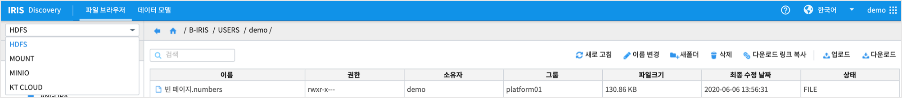
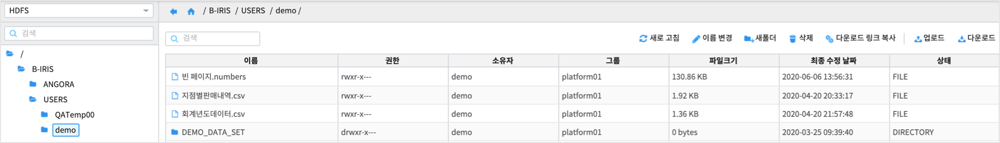
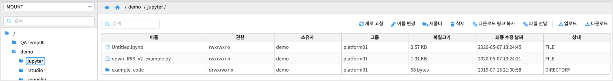

========================================
파일 브라우저
========================================

| IRIS Anayzer, Studio 에서 사용할 여러 가지 파일들을 관리하는 메뉴입니다.
| 파일을 저장하는 영역에 따라 2020년 7월 현재 HDFS, MOUNT, MINIO ,,,  등이 있습니다.
| 하지만 연결 정보에 대한 권한이 없는 경우에는 접근이 제한됩니다. 
| **연결정보** 에 대한 내용은 "IRIS 공통기능 >> 관리 >> 연결 정보" 를 참조하시기 바랍니다.

.. contents::
    :backlinks: top

''''''''''''''''''''''''''''''''''''''
HDFS
''''''''''''''''''''''''''''''''''''''

| 로그인한 사용자의 계정이 접근할 수 있는 HDFS 폴더로 이동합니다.

**기능**

.. csv-table::
    :header: 기능메뉴 명, 설명

    "새로 고침", "사용자계정이 접근할 수 있는 HDFS 파일 리스트를 새로 고침하여 최신 상태를 반영합니다."
    "이름 변경", "HDFS 파일 및 폴더의 이름을 변경합니다."
    "새폴더",  "새 HDFS폴더를 생성합니다."
    "삭제", "선택한 폴더 및 파일을 HDFS 에서 삭제합니다."
    "다운로드 링크 복사", "선택한 파일을 다운로드할 수 있는 주소를 클립보드에 복사합니다."
    "업로드", "로컬 PC 에 있는 파일을 HDFS 의 특정 위치로 업로드합니다."
    "다운로드", "선택한 HDFS 의 파일을 로컬 PC 에 다운로드 합니다."

''''''''''''''''''''''''''''''''''''''
MOUNT
''''''''''''''''''''''''''''''''''''''

| IRIS SaaS 플랫폼의 PlayGround 메뉴에서 Jupyter, R-studio, zeppelin  각각의 사용자 계정의 파일 브라우저와
| 이들 PlayGroud 의 application 에서 같이 공유할 수있는 shared 디렉토리로 이동합니다.

''''''''''''''''''''''''''''''''''''''
MINIO
''''''''''''''''''''''''''''''''''''''

| 클라우드 기반 ObjectStorage 의 하나인 MINIO 에 파일을 저장하고 다운로드합니다. 
| 사용자 계정이 생성하거나 권한이 있는 MINIO 연결정보를 통해서 접근합니다.
| 각 기능 메뉴는 HDFS 브라우저와 동일합니다.

