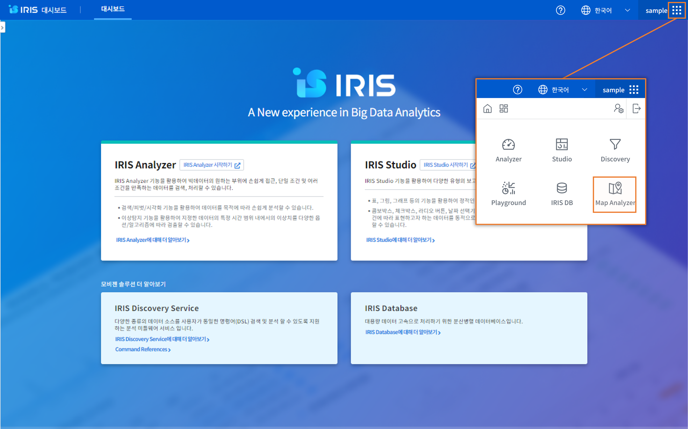
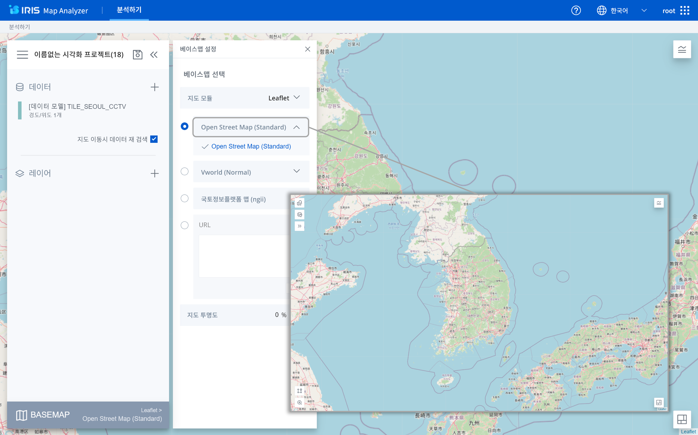
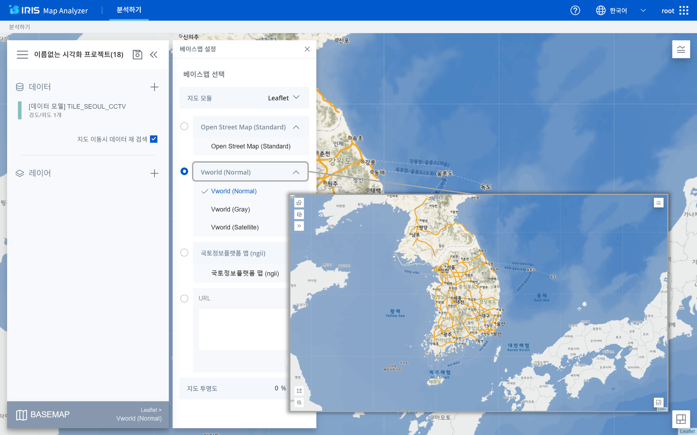
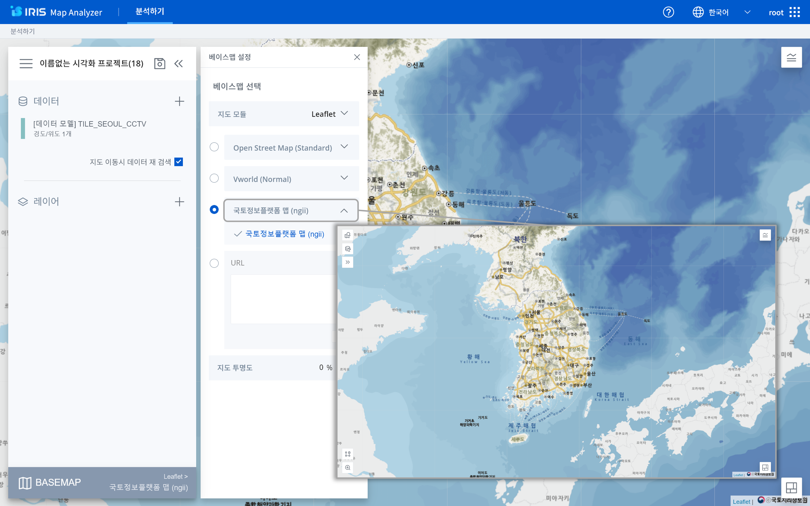
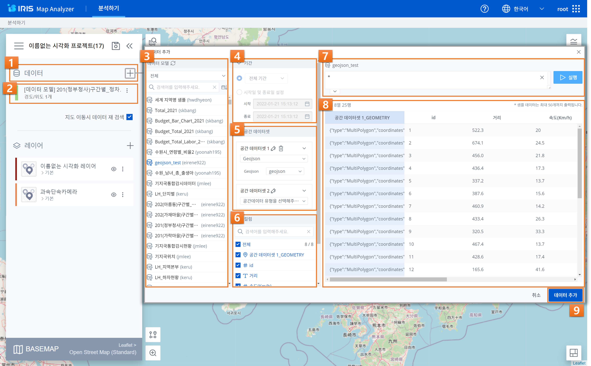
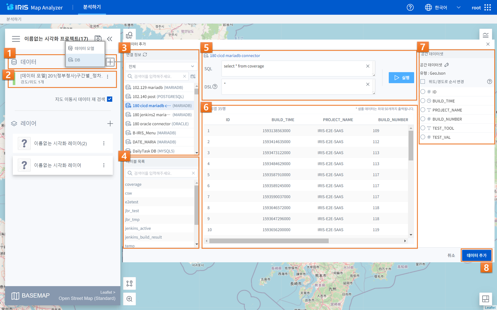
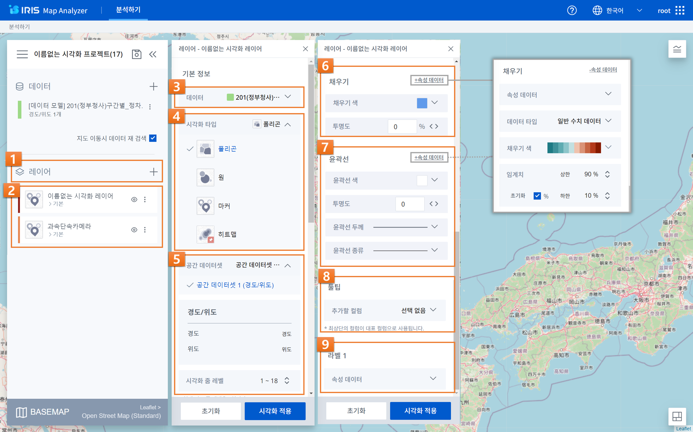
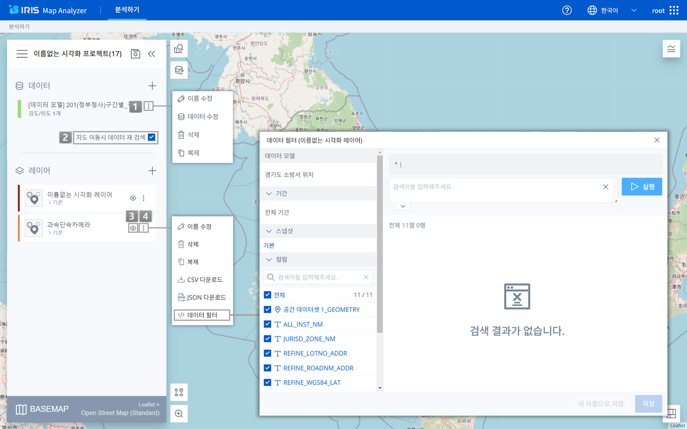
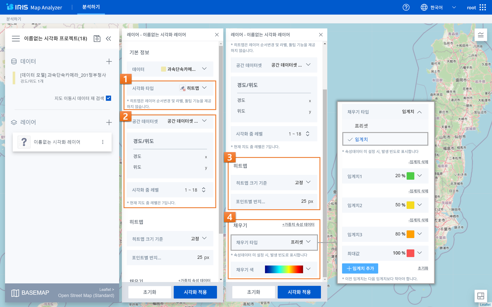

IRIS Map Analyzer
======================
| IRIS Map Analyzer(IMA)는 IRIS의 데이터 모델들을 활용하여, 각종 데이터들을 지도 상에 시각화하고 분석하기 위한 도구입니다.
| 사용자는 공간 정보가 존재하는 데이터를 다양한 유형으로 시각화 할 수 있으며, 공간 정보가 없는 데이터도 UI 인터페이스를 통하여 추가적으로 공간 정보를 매핑하여 시각화 할 수 있습니다.
| IMA로 만들어진 프로젝트는 IRIS 스튜디오에서 다른 객체들과 연동하여 사용할 수 있습니다.
| 
| 우측 상단의 메인 메뉴의 ‘Map Analyzer’ 버튼을 눌러 접속하실 수 있습니다.

------------------------------------------------------------------

분석하기
^^^^^^^^^^^^^^^^^^^^^^^
IMA에서 프로젝트를 만들어 기존의 지도 데이터를 직접 시각화 할 수 있으며, 분석할 수 있습니다. 

|

.. image:: IRIS-05-1-1.png
    :width: 1000
    :alt: IRIS-05-1-1

+------+-------------------------------------------------------------------------------------------------------------------------+-----------------------------------------------------------------------------------------------------------------------------------------------------------------+
| 번호 | 구분                                                                                                                    | 설명                                                                                                                                                            |
+======+=========================================================================================================================+=================================================================================================================================================================+
|| 1   || 프로젝트 목록                                                                                                          || 프로젝트 그리드(썸네일) 뷰/리스트 뷰 보기, 목록 정렬 방식 설정, 카테고리 유형별 필터, 검색 기능을 이용하실 수 있습니다.                                        |
+------+-------------------------------------------------------------------------------------------------------------------------+-----------------------------------------------------------------------------------------------------------------------------------------------------------------+
|| 2   || 메뉴                                                                                                                   || 템플릿으로 등록(카테고리/템플릿 이름 설정) 및 정보 변경, 프로젝트 권한 설정(관리자), 내보내기 링크 생성, 프로젝트 편집/복제/삭제 기능을 이용하실 수 있습니다.  |
+------+-------------------------------------------------------------------------------------------------------------------------+-----------------------------------------------------------------------------------------------------------------------------------------------------------------+
|| 3   || 프로젝트 선택                                                                                                          || 프로젝트 좌측 상단의 체크박스를 클릭하면 프로젝트 선택이 가능합니다.                                                                                           |
||     ||                                                                                                                        || 하나 이상의 항목을 선택했을 때 목록 상단에 ‘일괄 처리 메뉴’가 표시되며, ‘URL 일괄 생성/일괄 정보 변경/일괄 삭제/일괄 권한 관리’ 기능을 사용할 수 있습니다.     |
||     ||                                                                                                                        || 복수의 프로젝트를 일괄로 처리한다는 점을 제외하고는 기본적으로 단일 메뉴에서의 기능과 동일하나, 일괄 정보 변경에서는 카테고리 변경만 가능합니다.               |
+------+-------------------------------------------------------------------------------------------------------------------------+-----------------------------------------------------------------------------------------------------------------------------------------------------------------+

- **항목 메뉴**

    - 템플릿으로 등록(관리자 기능)
    
        - 해당 프로젝트를 템플릿으로 추가합니다. 추가된 템플릿은 템플릿 목록에서 확인할 수 있으며, 누구든지 해당 템플릿을 활용하여 어느 정도 기반 작업이 되어 있는 상태에서 프로젝트를 시작할 수 있습니다.

    - 프로젝트 권한 설정(관리자 기능)

        - 사용자 그룹 또는 사용자 단위로 해당 프로젝트에 대한 접근 권한을 부여하거나 회수할 수 있습니다. ‘모든 사용자 그룹’이나 ‘모든 사용자’에 체크하는 경우, 개별 설정을 하지 못하고 모든 사용자 그룹 또는 모든 사용자에게 일괄적으로 권한을 부여합니다.

    - 내보내기 링크 생성

        - 내보내기 링크를 클릭해서 해당 프로젝트의 ‘미리보기’를 브라우저에서 열람할 수 있는 URL을 생성할 수 있습니다. 이후 생성된 URL을 클릭해서 클립보드에 복사할 수 있습니다.

    - 정보 변경

        - 해당 프로젝트가 속하게 될 카테고리를 변경하거나 프로젝트명을 수정할 수 있습니다. 카테고리의 추가/편집은 관리자 전용 메뉴인 ‘카테고리 관리‘에서 가능합니다.

    - 복제

        - 해당 프로젝트를 복제해서 사본으로 저장합니다. 원본 프로젝트명 뒤에 {번호}가 추가된 이름으로 저장됩니다.

|

.. image:: IRIS-05-1-1(2).png
    :width: 1000
    :alt: IRIS-05-1-1(2)

+------+------------------------------------+----------------------------------------------------------------------------------------------------------------------------------------------------------------------------------+
| 번호 | 구분                               | 설명                                                                                                                                                                             |
+======+====================================+==================================================================================================================================================================================+
| 1    | 카테고리 관리                      | (관리자) 카테고리를 추가 및 삭제할 수 있습니다.                                                                                                                                  |
+------+------------------------------------+----------------------------------------------------------------------------------------------------------------------------------------------------------------------------------+
| 2    | 템플릿으로 시작                    | 페이지 우상단의 ‘템플릿으로 시작‘ 버튼을 클릭하여, 내 템플릿/다른 사용자의 템플릿 목록 중 템플릿 하나를 선택하면 기본 세팅이 되어 있는 상태에서 프로젝트를 시작할 수 있습니다.   |
+------+------------------------------------+----------------------------------------------------------------------------------------------------------------------------------------------------------------------------------+
| 3    | 새 프로젝트 시작                   | 페이지 우상단의 ‘새 프로젝트 시작’ 버튼을 클릭하여, 완전히 비어 있는 프로젝트부터 시작할 수 있습니다.                                                                            |
+------+------------------------------------+----------------------------------------------------------------------------------------------------------------------------------------------------------------------------------+

|

.. image:: IRIS-05-1-2.png
    :width: 1000
    :alt: IRIS-05-1-2

+------+--------------------------+----------------------------------------------------------------------------------------------------------------------------------------------------------------------------------------------------------+
| 번호 | 구분                     | 설명                                                                                                                                                                                                     |
+======+==========================+==========================================================================================================================================================================================================+
|| 1   || 주소 검색(Breadcrumnb)  || 주소 경로를 통하여 지금 보고 있는 지도 상의 위치를 파악하거나 주소 경로의 각 뎁스를 직접 선택하여 원하는 위치 또는 현재 위치로 이동할 수 있으며, 지번 검색, 도로명 검색, 경도위도 검색을 할 수 있습니다.|
+------+--------------------------+----------------------------------------------------------------------------------------------------------------------------------------------------------------------------------------------------------+
|| 2   || 데이터 재조회           || 지도 데이터를 재조회 할 수 있습니다.                                                                                                                                                                    |
+------+--------------------------+----------------------------------------------------------------------------------------------------------------------------------------------------------------------------------------------------------+
|| 3   || 처음 위치로 돌아가기    || IRIS Map Analyzer의 편집에서 설정한 기본값 설정 위치로 지도가 초기화 됩니다.                                                                                                                            |
+------+--------------------------+----------------------------------------------------------------------------------------------------------------------------------------------------------------------------------------------------------+
|| 4   || 레이어 리스트           || 레이어 리스트를 확인할 수 있습니다.                                                                                                                                                                     |
+------+--------------------------+----------------------------------------------------------------------------------------------------------------------------------------------------------------------------------------------------------+
|| 5   || 공간 필터 저작 컨트롤러 || 많은 양의 데이터 중, 사각형/원/폴리곤 툴을 활용하여 내가 원하는 범위 안의 데이터만을 필터링하여 보기 위해 활용할 수 있는 도구입니다.                                                                    |
||     ||                         || 공간 필터 저작 컨트롤러에서 사각형/원/폴리곤 툴을 이용하여 필터링 영역을 지정할 수 있습니다.                                                                                                            |
+------+--------------------------+----------------------------------------------------------------------------------------------------------------------------------------------------------------------------------------------------------+
|| 6   || 줌 레벨                 || 직접 수치를 입력하거나 버튼을 눌러서 지도를 확대/축소할 수 있고, 줌이 인/아웃 및 지도 이동이 되지 않도록 잠글 수 있습니다.                                                                              |
+------+--------------------------+----------------------------------------------------------------------------------------------------------------------------------------------------------------------------------------------------------+
|| 7   || 범례                    || 범례는 지도에서 시각화 되고 있는 레이어의 정보를 나타냅니다.                                                                                                                                            |
+------+--------------------------+----------------------------------------------------------------------------------------------------------------------------------------------------------------------------------------------------------+
|| 8   || 지적도                  || 지적도는 토지의 소재 및 경계 등을 나타내기 위해 국가에서 만든 평면 지도이며, 지적도 범례를 통해 각 색상 별 지역의 특징을 확인할 수 있습니다.                                                            |
+------+--------------------------+----------------------------------------------------------------------------------------------------------------------------------------------------------------------------------------------------------+

|

.. image:: IRIS-05-1-3.png
    :width: 1000
    :alt: IRIS-05-1-3

+------+--------------------------+----------------------------------------------------------------------------------------------------------------------------------------------------------------------------------------------------------------------------------------+
| 번호 | 구분                     | 설명                                                                                                                                                                                                                                   |
+======+==========================+========================================================================================================================================================================================================================================+
|| 1   || 프로젝트 섹션           || 메인 컨트롤러 중 프로젝트 섹션은 프로젝트 명 변경, 저장 등 프로젝트의 정보에 대한 관리가 이루어집니다.                                                                                                                                |
||     ||                         || 좌측의 메뉴 아이콘을 클릭하여 ‘목록으로 나가기/새 프로젝트/사본으로 저장‘과 보고서 제목 출력/미출력 여부를 선택할 수 있는 ‘프로젝트 환경설정' 액션을 처리할 수 있습니다.                                                              |
||     ||                         || 저장 버튼은 현재까지 작업된 내용을 기존의 프로젝트 위에 덮어쓰기를 하기 위해 사용되고, 이중 꺾쇠(<<)로 되어 있는 ‘접기‘ 버튼은 메인 컨트롤러를 숨겨서 지도와 시각화 컴퍼넌트를 넓게 보려고 할 때 사용됩니다.                          |
+------+--------------------------+----------------------------------------------------------------------------------------------------------------------------------------------------------------------------------------------------------------------------------------+
|| 2   || 레이어 섹션             || 메인 컨트롤러 중 레이어 섹션은 IMA에서 가장 중요한 기능들이 모여 있는 곳으로, 데이터와 레이어 설정을 할 수 있습니다.                                                                                                                  |
||     ||                         || 데이터 모델 뿐 아니라 DB 연결정보로 데이터를 추가할 수 있으며, 데이터 모델 중 하나를 선택하여 데이터 시각화를 위한 기반 작업을 하고 시각화 레이어 설정을 통해 데이터를 지도 위에 어떻게 나타낼 것인지 세부적인 설정을 할 수 있습니다. |
||     ||                         || 또한, 시각화 레이어가 추가된 이후에도 데이터 편집을 통해 기반 데이터의 설정을 변경하거나, 스냅샷 추가를 통해 기반 데이터로부터 분기되는 여러 갈래의 필터들을 만들어 적용해 볼 수 있습니다.                                            |
+------+--------------------------+----------------------------------------------------------------------------------------------------------------------------------------------------------------------------------------------------------------------------------------+
|| 3   || 베이스맵 설정           || 레이어 설정 내의 베이스맵은 시각화 컴포넌트들의 가장 하단에 위치하여 기본적인 지리 정보를 나타내는 기본 레이어 입니다.                                                                                                                |
||     ||                         || 마우스 컨트롤을 통해 위치 이동 및 확대/축소가 가능하며, 베이스맵의 종류는 메인 컨트롤러의 베이스맵 버튼을 클릭하면 표시되는 베이스맵 설정 팝업에서 변경할 수 있습니다.                                                                |
+------+--------------------------+----------------------------------------------------------------------------------------------------------------------------------------------------------------------------------------------------------------------------------------+
|| 4   || 주소 검색(Breadcrumnb)  || 주소 경로를 통하여 지금 보고 있는 지도 상의 위치를 파악하거나 주소 경로의 각 뎁스를 직접 선택하여 원하는 위치 또는 현재 위치로 이동할 수 있으며, 지번 검색, 도로명 검색, 경도위도 검색을 할 수 있습니다.                              |
+------+--------------------------+----------------------------------------------------------------------------------------------------------------------------------------------------------------------------------------------------------------------------------------+
|| 5   || 데이터 재조회           || 지도 데이터를 재조회 할 수 있습니다.                                                                                                                                                                                                  |
+------+--------------------------+----------------------------------------------------------------------------------------------------------------------------------------------------------------------------------------------------------------------------------------+
|| 6   || 공간 필터 저작 컨트롤러 || 많은 양의 데이터 중, 사각형/원/폴리곤 툴을 활용하여 내가 원하는 범위 안의 데이터만을 필터링하여 보기 위해 활용할 수 있는 도구입니다.                                                                                                  |
||     ||                         || 공간 필터 저작 컨트롤러에서 사각형/원/폴리곤 툴을 이용하여 필터링 영역을 지정할 수 있습니다.                                                                                                                                          |
+------+--------------------------+----------------------------------------------------------------------------------------------------------------------------------------------------------------------------------------------------------------------------------------+
|| 7   || 줌 레벨                 || 직접 수치를 입력하거나 버튼을 눌러서 지도를 확대/축소할 수 있고, 줌이 인/아웃 및 지도 이동이 되지 않도록 잠글 수 있습니다.                                                                                                            |
+------+--------------------------+----------------------------------------------------------------------------------------------------------------------------------------------------------------------------------------------------------------------------------------+
|| 8   || 범례                    || 범례는 지도에서 시각화 되고 있는 레이어의 정보를 나타냅니다.                                                                                                                                                                          |
+------+--------------------------+----------------------------------------------------------------------------------------------------------------------------------------------------------------------------------------------------------------------------------------+
|| 9   || 지적도                  || 지적도는 토지의 소재 및 경계 등을 나타내기 위해 국가에서 만든 평면 지도이며, 지적도 범례를 통해 각 색상 별 지역의 특징을 확인할 수 있습니다                                                                                           |
+------+--------------------------+----------------------------------------------------------------------------------------------------------------------------------------------------------------------------------------------------------------------------------------+

|

- 베이스맵 (OSM, VWORLD, NGII)

- **베이스맵 설정**
    - 베이스맵 선택
        -시각화 컴퍼넌트들의 가장 하단에 위치하여 기본적인 지리 정보를 나타내는 기본 레이어입니다. 마우스 컨트롤을 통해 위치 이동 및 확대/축소가 가능하며, 베이스맵의 종류는 메인컨트롤러의 베이스맵 버튼을 클릭하면 표시되는 베이스맵 설정 팝업에서 변경할 수 있습니다.
            - 지도 모듈
                - 지도 데이터를 표시하기 위한 프레임 워크입니다. Leaflet.과 Mapbox를 기반으로 한 베이스맵을 제공하고 있습니다. Leaflet은 Open Street Map과 Vworld, 국토정보플랫폼과 함께 직접 베이스맵 설정에 활용할 URL 주소를 입력할 수 있도록 제공하고 있습니다. Mapbox는 Open Street Map, Vworld, URL을 지원하고 있습니다.
                    - Open Street Map (Standard): 전세계로 지도의 범위가 넓으며, 시각화 줌 레벨은 1부터 적용 가능합니다.
                    - Vworld (Normal / Gray / Satellite): 우리나라와 근처 소수의 국가까지로 그 범위가 한정적이며, 시각화 줌 레벨은 6부터 적용 가능합니다.
                    - 국토정보플랫폼 맵 (ngii): 우리나라와 근처 소수의 국가까지로 그 범위가 한정적이며, 시각화 줌 레벨은 6부터 적용 가능합니다. 
                    - URL: 베이스맵으로 사용할 URL을 입력 후 적용 버튼을 클릭하면 입력한 URL을 반영할 수 있습니다. 
            - 지도 투명도: 베이스맵의 투명도를 설정할 수 있습니다.

|

+------+--------------------------------------+-------------------------------------------------------------------------------------------------------------------------------------------------------------------------------------------------------------------+
| 번호 | 구분                                 | 설명                                                                                                                                                                                                              |
+======+======================================+===================================================================================================================================================================================================================+
|| 1   || 데이터 추가                         || 데이터 추가 우측의 ‘+’를 눌러 데이터 모델 또는 DB로부터 데이터를 추가할 수 있습니다.                                                                                                                             |
+------+--------------------------------------+-------------------------------------------------------------------------------------------------------------------------------------------------------------------------------------------------------------------+
|| 2   || 데이터 정보 수정                    || 데이터 이름 및 공간 데이터셋에 설정된 유형과 변수를 확인할 수 있습니다.                                                                                                                                          |
||     ||                                     || 각각의 데이터에 대해 우측의 컨텍스트 메뉴(︙)를 통해 이름 수정/데이터 수정/삭제/복제 등의 기능을 수행할 수 있습니다.                                                                                             |
+------+--------------------------------------+-------------------------------------------------------------------------------------------------------------------------------------------------------------------------------------------------------------------+
|| 3   || 데이터 모델 목록                    || 데이터 모델의 데이터 추가에서 데이터 모델을 검색하거나 아래 데이터 모델 목록에서 원하는 모델을 선택합니다.                                                                                                       |
||     ||                                     || 새로고침 버튼을 눌러 목록을 새로 불러올 수 있습니다.                                                                                                                                                             |
+------+--------------------------------------+-------------------------------------------------------------------------------------------------------------------------------------------------------------------------------------------------------------------+
|| 4   || 기간 설정                           || 데이터 모델의 데이터 추가에서 사용할 데이터의 기간 범위를 선택합니다.                                                                                                                                            |
+------+--------------------------------------+-------------------------------------------------------------------------------------------------------------------------------------------------------------------------------------------------------------------+
|| 5   || 공간 데이터셋                       || 데이터 모델의 데이터 추가에서 지도에 데이터를 나타내기 위해서 필요한 공간 데이터를 설정합니다.                                                                                                                   |
||     ||                                     || 경도 및 위도/GeoJSON/Geometry/WKT/도로명 주소/도로명 전체 주소/우편번호/지번 주소/지번 전체 주소 중 하나를 선택하고, 해당 공간 데이터를 담고 있는 컬럼을 선택합니다.                                             | 
||     ||                                     || 여러 벌의 공간 데이터를 만들 수도 있으며, 위/경도 순서 변경도 가능합니다.                                                                                                                                        |
+------+--------------------------------------+-------------------------------------------------------------------------------------------------------------------------------------------------------------------------------------------------------------------+
|| 6   || 컬럼                                || 데이터 모델의 데이터 추가에서 속성 데이터로 사용될 컬럼들을 확인합니다. 샘플링 되는 데이터에서 보고 싶은 컬럼만 체크합니다.                                                                                      |
+------+--------------------------------------+-------------------------------------------------------------------------------------------------------------------------------------------------------------------------------------------------------------------+
|| 7   || DSL 명령어                          || 데이터 모델의 데이터 추가에서 데이터를 필터링 하기 위한 DSL 명령어를 입력합니다.                                                                                                                                 |
+------+--------------------------------------+-------------------------------------------------------------------------------------------------------------------------------------------------------------------------------------------------------------------+
|| 8   || 샘플 데이터 출력                    || 데이터 모델의 데이터 추가에서  ‘실행’을 클릭하면, 화면에 최대 50개의 샘플 데이터가 화면에 출력됩니다.                                                                                                            |
+------+--------------------------------------+-------------------------------------------------------------------------------------------------------------------------------------------------------------------------------------------------------------------+
|| 9   || 데이터 추가                         || 데이터 모델의 데이터 추가에서 샘플링 되어 출력된 데이터를 보고, 시각화 할 기반 데이터가 올바르게 설정되었다면 팝업 우측 하단의 데이터 추가 버튼을 눌러 데이터를 추가합니다.                                      |
+------+--------------------------------------+-------------------------------------------------------------------------------------------------------------------------------------------------------------------------------------------------------------------+

|

+------+-------------------------------------+-------------------------------------------------------------------------------------------------------------------------------------------------------------------------------------------------------------------+
| 번호 | 구분                                | 설명                                                                                                                                                                                                              |
+======+=====================================+===================================================================================================================================================================================================================+
|| 1   || 데이터 추가                        || 데이터 추가 우측의 ‘+’를 눌러 데이터 모델 또는 DB로부터 데이터를 추가할 수 있습니다.                                                                                                                             |
+------+-------------------------------------+-------------------------------------------------------------------------------------------------------------------------------------------------------------------------------------------------------------------+
|| 2   || 데이터 정보 수정                   || 데이터 이름 및 공간 데이터셋에 설정된 유형과 변수를 확인할 수 있습니다.                                                                                                                                          |
||     ||                                    || 각각의 데이터에 대해 우측의 컨텍스트 메뉴(︙)를 통해 이름 수정/데이터 수정/삭제/복제 등의 기능을 수행할 수 있습니다.                                                                                             |
+------+-------------------------------------+-------------------------------------------------------------------------------------------------------------------------------------------------------------------------------------------------------------------+
|| 3   || 데이터 모델 목록                   || DB의 데이터 추가에서 연결 정보를 검색하거나 아래 연결 정보 목록에서 원하는 연결정보를 선택합니다.                                                                                                                | 
||     ||                                    || 새로고침 버튼을 눌러 목록을 새로 불러올 수 있습니다.                                                                                                                                                             |
+------+-------------------------------------+-------------------------------------------------------------------------------------------------------------------------------------------------------------------------------------------------------------------+
|| 4   || 테이블 목록                        || DB의 데이터 추가에서 연결정보에 해당된 테이블의 목록을 확인할 수 있으며, 우클릭을 통해 테이블 이름 및 select 문을 복사할 수 있습니다.                                                                            |
+------+-------------------------------------+-------------------------------------------------------------------------------------------------------------------------------------------------------------------------------------------------------------------+
|| 5   || SQL 쿼리 / DSL 명령어 입력         || DB의 데이터 추가에서 SQL 쿼리 및 DSL 명령어를 입력하여 데이터를 필터링 할 수 있습니다.                                                                                                                           |
+------+-------------------------------------+-------------------------------------------------------------------------------------------------------------------------------------------------------------------------------------------------------------------+
|| 6   || 샘플 데이터 출력                   || DB의 데이터 추가에서 지도에 데이터를 나타내기 위해서 필요한 공간 데이터를 설정합니다.                                                                                                                            | 
||     ||                                    || 경도 및 위도/GeoJSON/Geometry/WKT/도로명 주소/도로명 전체 주소/우편번호/지번 주소/지번 전체 주소 중 하나를 선택하고, 해당 공간 데이터를 담고 있는 컬럼을 선택합니다. 여러 벌의 공간 데이터를 만들 수도 있습니다. |
||     ||                                    || 위/경도 순서 변경도 가능합니다.                                                                                                                                                                                  |
+------+-------------------------------------+-------------------------------------------------------------------------------------------------------------------------------------------------------------------------------------------------------------------+
|| 7   || 공간 데이터셋                      || DB의 데이터 추가에서 지도에 데이터를 나타내기 위해서 필요한 공간 데이터를 설정합니다.                                                                                                                            | 
||     ||                                    || 경도 및 위도/GeoJSON/Geometry/WKT/도로명 주소/도로명 전체 주소/우편번호/지번 주소/지번 전체 주소 중 하나를 선택하고, 해당 공간 데이터를 담고 있는 컬럼을 선택합니다.                                             |
||     ||                                    || 여러 벌의 공간 데이터를 만들 수도 있으며, 위/경도 순서 변경도 가능합니다.                                                                                                                                        |
+------+-------------------------------------+-------------------------------------------------------------------------------------------------------------------------------------------------------------------------------------------------------------------+
|| 8   || 데이터 추가                        || DB의 데이터 추가에서 샘플링 되어 출력된 데이터를 보고, 시각화 할 기반 데이터가 올바르게 설정되었다면 팝업 우측 하단의 데이터 추가 버튼을 눌러 데이터를 추가합니다.                                               |
+------+-------------------------------------+-------------------------------------------------------------------------------------------------------------------------------------------------------------------------------------------------------------------+

|

+------+--------------------------+----------------------------------------------------------------------------------------------------------------------------------------------------------------------+
| 번호 | 구분                     | 설명                                                                                                                                                                 |
+======+==========================+======================================================================================================================================================================+
|| 1   || 레이어 추가             || 메인 컨트롤러의 레이어 섹션의 ‘+’ 버튼을 눌러 시각화 레이어를 추가합니다.                                                                                           |
+------+--------------------------+----------------------------------------------------------------------------------------------------------------------------------------------------------------------+
|| 2   || 레이어 정보 수정        || 각 레이어는 드래그&드롭으로 서로 순서를 변경하거나 수정/삭제/복제가 가능하며, CSV 파일 및 JSON 파일로 다운로드 할 수 있습니다.                                      |
+------+--------------------------+----------------------------------------------------------------------------------------------------------------------------------------------------------------------+
|| 3   || 데이터 선택             || 시각화 할 데이터를 선택합니다.                                                                                                                                      |
+------+--------------------------+----------------------------------------------------------------------------------------------------------------------------------------------------------------------+
|| 4   || 시각화 타입 선택        || 선택한 데이터를 어떠한 종류의 시각화로 표현할 것인지 선택합니다.                                                                                                    |
+------+--------------------------+----------------------------------------------------------------------------------------------------------------------------------------------------------------------+
|| 5   || 공간 데이터셋 선택      || 미리 설정된 공간 데이터셋 중 시각화에 이용할 공간 데이터 하나를 선택한 뒤, ‘시각화 적용’ 버튼을 눌러 기본 설정된 시각화 컴퍼넌트를 확인합니다.                      |
||     ||                         || 설정된 지도 정보와 선택한 데이터와의 컬럼의 연결 정보를 확인할 수 있습니다.                                                                                         |
||     ||                         || 1~18까지 시각화의 줌 레벨을 설정할 수 있으며, 한 화면에 더 넓은 범위가 보일수록 숫자가 작아집니다.                                                                  |
||     ||                         || 현재 지도 줌 레벨을 확인할 수 있습니다.                                                                                                                             |
+------+--------------------------+----------------------------------------------------------------------------------------------------------------------------------------------------------------------+
|| 6   || 채우기                  || 시각화 컴퍼넌트의 채우기 색상을 설정할 수 있습니다.                                                                                                                 |
||     ||                         || 단색으로 표현하거나 속성 데이터를 추가하여 해당 데이터에 기반한 그라디언트로 색상을 다채롭게 표현할 수 있으며, 투명도 조절을 할 수 있습니다.                        |
+------+--------------------------+----------------------------------------------------------------------------------------------------------------------------------------------------------------------+
|| 7   || 윤곽선                  || 시각화 컴퍼넌트의 윤곽선 색상과 각종 속성을 설정할 수 있습니다.                                                                                                     |
||     ||                         || 단색으로 표현하거나 속성 데이터를 추가하여 해당 데이터에 기반한 그라디언트로 색상을 다채롭게 표현할 수 있으며, 윤곽선의 종류 및 두께, 불명도 조절을 할 수 있습니다. |
+------+--------------------------+----------------------------------------------------------------------------------------------------------------------------------------------------------------------+
|| 8   || 툴팁                    || 지도 상에 표현된 시각화 컴퍼넌트에 마우스 커서를 롤오버 했을 때 표시되는 툴팁을 설정할 수 있습니다.                                                                 |
||     ||                         || 가장 상단의 컬럼은 ‘대표 컬럼‘으로, 툴팁 및 상세내용 팝업에서 타이틀로 활용됩니다.                                                                                  |
+------+--------------------------+----------------------------------------------------------------------------------------------------------------------------------------------------------------------+
|| 9   || 라벨                    || 지도 상에 표현된 시각화 컴퍼넌트의 중앙점을 기준으로 라벨을 설정합니다.                                                                                             |
||     ||                         || 특정 컬럼의 값을 나타낼 수 있으며, 글꼴의 색상이나 크기, 위치 등을 설정할 수 있습니다.                                                                              |
+------+--------------------------+----------------------------------------------------------------------------------------------------------------------------------------------------------------------+

- **스냅샷**
    - 스냅샷은 기반 데이터로부터 분기되는 여러 갈래의 필터들을 만들 수 있는 기능입니다. 
        - 스냅샷 추가: 데이터 추가와 유사한 방식으로 데이터에 필터를 추가한 후 저장 버튼을 눌러 스냅샷을 추가할 수 있습니다. 기본 스냅샷은 덮어쓰기 할 수 없습니다. 
        - 스냅샷 목록: 각 레이어에 레이어명 하단에 위치한 스냅샷 버튼(스냅샷명)을 클릭하면 스냅샷 목록이 표시됩니다. 여기서 스냅샷을 선택해서 반영하거나 스냅샷명 수정/복제/삭제가 가능합니다.

|

+------+-------------------------------------------+---------------------------------------------------------------------------------------------------------------------------------------------------------------------+
| 번호 | 구분                                      | 설명                                                                                                                                                                |
+======+===========================================+=====================================================================================================================================================================+
|| 1   || 데이터 컨텍스트 메뉴                     || 데이터 컨텍스트 메뉴를 통해 데이터 이름 수정, 데이터 수정, 삭제 및 복제 기능을 수행할 수 있습니다.                                                                 |
+------+-------------------------------------------+---------------------------------------------------------------------------------------------------------------------------------------------------------------------+
|| 2   || 지도 이동 시 데이터 재 검색              || 체크박스를 클릭하여 활성화하면, 지도 이동에 따라 데이터를 재 검색 하는 기능을 수행할 수 있습니다. 체크를 해제하면, 지도가 이동하여도 데이터를 재 검색하지 않습니다.|
+------+-------------------------------------------+---------------------------------------------------------------------------------------------------------------------------------------------------------------------+
|| 3   || 레이어 보기/숨기기                       || 선택한 레이어를 지도 상에서 보기/숨기기 처리할 수 있습니다.                                                                                                        |
+------+-------------------------------------------+---------------------------------------------------------------------------------------------------------------------------------------------------------------------+
|| 4   || 레이어 컨텍스트 메뉴                     || 레이어 컨텍스트 메뉴를 통해 레이어 이름 수정, 레이어 삭제 및 복제, CSV/JSON 파일로 다운로드를 수행할 수 있습니다.                                                  |
||     ||                                          || 또한, 데이터 필터를 활용하여 추가된 데이터 모델에 대하여 기간, 스냅샷, 컬럼, DSL 명령어를 통한 필터 등을 편집할 수 있습니다.                                       |
+------+-------------------------------------------+---------------------------------------------------------------------------------------------------------------------------------------------------------------------+

|

[참고]시각화 레이어 설정
^^^^^^^^^^^^^^^^^^^^^^^^^^^^^^^^^^^^^^^^^^^^^^^^^^

시각화 레이어 설정을 통해 이 데이터를 어떻게 지도 위에 나타낼 것인지 세부적인 설정을 할 수 있습니다. 시각화 레이어가 추가된 이후에도 데이터 편집을 통해 기반 데이터의 설정을 변경하거나, 스냅샷 추가를 통해 기반 데이터로부터 분기되는 여러 갈래의 필터들을 만들어 적용해볼 수도 있습니다.

--------------------------------------------------------------------------------------------------------------------------------

|

시각화 레이어 - 폴리곤
_____________________________

.. image:: (IRIS)-05-2-1.png
    :width: 1000
    :alt: (IRIS)-05-2-1

+------+-------------------------------------------------+----------------------------------------------------------------------------------------------------------------------+
| 번호 | 구분                                            | 설명                                                                                                                 |
+======+=================================================+======================================================================================================================+
|| 1   || 시각화 타입                                    || 폴리곤/원/마커/히트맵 타입 가운데 선택한 데이터를 표현할 시각화 타입을 선택할 수 있습니다.                          |
+------+-------------------------------------------------+----------------------------------------------------------------------------------------------------------------------+
|| 2   || 공간 데이터셋 설정/시각화 줌 레벨              || 공간 데이터셋 설정을 통해 미리 설정된 공간 데이터셋 중 시각화에 이용할 공간 데이터 하나를 선택합니다.               |
||     ||                                                || 현재 지도의 시각화 줌 레벨을 확인할 수 있으며, 어느 줌 레벨 내에서 시각화를 가능하게 할 지의 설정을 할 수 있습니다. |
||     ||                                                || 여기까지 진행 후 하단의 ‘시각화 적용‘ 버튼을 누르면 ‘기본 설정’으로 지도상에 시각화 컴퍼넌트가 생성됩니다.          |
+------+-------------------------------------------------+----------------------------------------------------------------------------------------------------------------------+
|| 3   || 채우기 설정                                    || 시각화 레이어에 대한 채우기 색 및 투명도 설정을 할 수 있습니다.                                                     |
+------+-------------------------------------------------+----------------------------------------------------------------------------------------------------------------------+
|| 4   || 윤곽선 설정                                    || 시각화 레이어에 대한 윤곽선 색 및 투명도, 윤곽선 두께, 윤곽선 종류에 대한 설정을 할 수 있습니다.                    |
+------+-------------------------------------------------+----------------------------------------------------------------------------------------------------------------------+
|| 5   || 툴팁 설정                                      || 지도 상에 표현된 시각화 컴퍼넌트에 마우스 커서를 롤오버 했을 때 표시되는 툴팁을 설정할 수 있습니다.                 |
||     ||                                                || 가장 상단의 컬럼은 ‘대표 컬럼’으로, 툴팁 및 상세내용 팝업에서 타이틀로 활용하게 됩니다.                             |
+------+-------------------------------------------------+----------------------------------------------------------------------------------------------------------------------+
|| 6   || 라벨 설정                                      || 지도 상에 표현된 시각화 컴퍼넌트의 중앙점을 기준으로 라벨을 설정합니다.                                             |
||     ||                                                || 특정 컬럼의 값을 나타낼 수 있으며, 글꼴의 색상이나 크기, 위치 등을 설정할 수 있습니다.                              |
+------+-------------------------------------------------+----------------------------------------------------------------------------------------------------------------------+

|

시각화 레이어 - 원
_____________________________

.. image:: (IRIS)-05-2-1(2).png
    :width: 1000
    :alt: (IRIS)-05-2-1(2)

+------+-----------------------------------------+----------------------------------------------------------------------------------------------------------------------------------------------------------------+
| 번호 | 구분                                    | 설명                                                                                                                                                           |
+======+=========================================+================================================================================================================================================================+
|| 1   || 시각화 타입                            || 폴리곤/원/마커/히트맵 타입 가운데 선택한 데이터를 표현할 시각화 타입을 선택할 수 있습니다.                                                                    |
+------+-----------------------------------------+----------------------------------------------------------------------------------------------------------------------------------------------------------------+
|| 2   || 공간 데이터셋 설정/시각화 줌 레벨      || 공간 데이터셋 설정을 통해 미리 설정된 공간 데이터셋 중 시각화에 이용할 공간 데이터 하나를 선택합니다.                                                         |
||     ||                                        || 현재 지도의 시각화 줌 레벨을 확인할 수 있으며, 어느 줌 레벨 내에서 시각화를 가능하게 할 지의 설정을 할 수 있습니다.                                           |
||     ||                                        || 여기까지 진행 후 하단의 ‘시각화 적용‘ 버튼을 누르면 ‘기본 설정’으로 지도상에 시각화 컴퍼넌트가 생성됩니다.                                                    |
+------+-----------------------------------------+----------------------------------------------------------------------------------------------------------------------------------------------------------------+
|| 3   || 원 설정                                || 데이터를 원으로 나타내기 위해 원 크기를 설정합니다.                                                                                                           |
||     ||                                        || 속성 데이터가 없는 상태에서는 일률적인 크기로 설정할 수 있고, 속성 데이터를 추가한 상태에서는 해당 데이터의 수치를 반영한 가변적인 크기로 설정할 수 있습니다. |
||     ||                                        || 원 크기는 지도 확대/축소의 영향을 받습니다.                                                                                                                   |
+------+-----------------------------------------+----------------------------------------------------------------------------------------------------------------------------------------------------------------+
|| 4   || 채우기 설정                            || 시각화 레이어에 대한 채우기 색 및 투명도 설정을 할 수 있습니다.                                                                                               |
+------+-----------------------------------------+----------------------------------------------------------------------------------------------------------------------------------------------------------------+
|| 5   || 윤곽선 설정                            || 시각화 레이어에 대한 윤곽선 색 및 투명도, 윤곽선 두께, 윤곽선 종류에 대한 설정을 할 수 있습니다.                                                              |
+------+-----------------------------------------+----------------------------------------------------------------------------------------------------------------------------------------------------------------+
|| 6   || 툴팁 설정                              || 지도 상에 표현된 시각화 컴퍼넌트에 마우스 커서를 롤오버 했을 때 표시되는 툴팁을 설정할 수 있습니다.                                                           |
||     ||                                        || 가장 상단의 컬럼은 ‘대표 컬럼’으로, 툴팁 및 상세내용 팝업에서 타이틀로 활용하게 됩니다.                                                                       |
+------+-----------------------------------------+----------------------------------------------------------------------------------------------------------------------------------------------------------------+
|| 7   || 라벨 설정                              || 지도 상에 표현된 시각화 컴퍼넌트의 중앙점을 기준으로 라벨을 설정합니다.                                                                                       |
||     ||                                        || 특정 컬럼의 값을 나타낼 수 있으며, 글꼴의 색상이나 크기, 위치 등을 설정할 수 있습니다.                                                                        |
+------+-----------------------------------------+----------------------------------------------------------------------------------------------------------------------------------------------------------------+

|

시각화 레이어 - 마커
_____________________________

.. image:: (IRIS)-05-2-1(3).png
    :width: 1000
    :alt: (IRIS)-05-2-1(3)

+------+------------------------------------+-----------------------------------------------------------------------------------------------------------------------------------------------------------------------------------+
| 번호 | 구분                               | 설명                                                                                                                                                                              |
+======+====================================+===================================================================================================================================================================================+
|| 1   || 시각화 타입                       || 폴리곤/원/마커/히트맵 타입 가운데 선택한 데이터를 표현할 시각화 타입을 선택할 수 있습니다.                                                                                       |
+------+------------------------------------+-----------------------------------------------------------------------------------------------------------------------------------------------------------------------------------+
|| 2   || 공간 데이터셋 설정/시각화 줌 레벨 || 공간 데이터셋 설정을 통해 미리 설정된 공간 데이터셋 중 시각화에 이용할 공간 데이터 하나를 선택합니다.                                                                            |
||     ||                                   || 현재 지도의 시각화 줌 레벨을 확인할 수 있으며, 어느 줌 레벨 내에서 시각화를 가능하게 할 지의 설정을 할 수 있습니다.                                                              |
||     ||                                   || 여기까지 진행 후 하단의 ‘시각화 적용‘ 버튼을 누르면 ‘기본 설정’으로 지도상에 시각화 컴퍼넌트가 생성됩니다.                                                                       |
+------+------------------------------------+-----------------------------------------------------------------------------------------------------------------------------------------------------------------------------------+
|| 3   || 마커 설정                         || 원 또는 깃발로 데이터를 나타내기 위한 설정입니다.                                                                                                                                |
||     ||                                   || 속성 데이터는 적용할 수 없으며, 마커의 종류와 컬러, 고정 크기만을 설정할 수 있습니다. 마커 크기는 지도 확대/축소의 영향을 받지 않습니다.                                         |
+------+------------------------------------+-----------------------------------------------------------------------------------------------------------------------------------------------------------------------------------+
|| 4   || 경로 설정                         || 시각화 타입 마커에서 순서 판단이 가능한 숫자 및 문자형 데이터를 대상으로 경로를 화살표로 시각화 할 수 있으며 역방향에 체크하였을 때, 화살표 경로를 역방향으로 전환할 수 있습니다.|
+------+------------------------------------+-----------------------------------------------------------------------------------------------------------------------------------------------------------------------------------+
|| 5   || 채우기 설정                       || 시각화 레이어에 대한 채우기 색 및 투명도 설정을 할 수 있습니다.                                                                                                                  |
+------+------------------------------------+-----------------------------------------------------------------------------------------------------------------------------------------------------------------------------------+
|| 6   || 윤곽선 설정                       || 시각화 레이어에 대한 윤곽선 색 및 투명도, 윤곽선 두께, 윤곽선 종류에 대한 설정을 할 수 있습니다.                                                                                 |
+------+------------------------------------+-----------------------------------------------------------------------------------------------------------------------------------------------------------------------------------+
|| 7   || 툴팁 설정                         || 지도 상에 표현된 시각화 컴퍼넌트에 마우스 커서를 롤오버 했을 때 표시되는 툴팁을 설정할 수 있습니다.                                                                              |
||     ||                                   || 가장 상단의 컬럼은 ‘대표 컬럼’으로, 툴팁 및 상세내용 팝업에서 타이틀로 활용하게 됩니다.                                                                                          |
+------+------------------------------------+-----------------------------------------------------------------------------------------------------------------------------------------------------------------------------------+
|| 8   || 라벨 설정                         || 지도 상에 표현된 시각화 컴퍼넌트의 중앙점을 기준으로 라벨을 설정합니다.                                                                                                          |
||     ||                                   || 특정 컬럼의 값을 나타낼 수 있으며, 글꼴의 색상이나 크기, 위치 등을 설정할 수 있습니다.                                                                                           |
+------+------------------------------------+-----------------------------------------------------------------------------------------------------------------------------------------------------------------------------------+

|

시각화 레이어 - 히트맵
_____________________________

+------+------------------------------------+--------------------------------------------------------------------------------------------------------------------------------------------------+
| 번호 | 구분                               | 설명                                                                                                                                             |
+======+====================================+==================================================================================================================================================+
|| 1   || 시각화 타입                       || 폴리곤/원/마커/히트맵 타입 가운데 선택한 데이터를 표현할 시각화 타입을 선택할 수 있습니다.                                                      |
+------+------------------------------------+--------------------------------------------------------------------------------------------------------------------------------------------------+
|| 2   || 공간 데이터셋 설정/시각화 줌 레벨 || 공간 데이터셋 설정을 통해 미리 설정된 공간 데이터셋 중 시각화에 이용할 공간 데이터 하나를 선택합니다.                                           |
||     ||                                   || 현재 지도의 시각화 줌 레벨을 확인할 수 있으며, 어느 줌 레벨 내에서 시각화를 가능하게 할 지의 설정을 할 수 있습니다.                             |
||     ||                                   || 여기까지 진행 후 하단의 ‘시각화 적용‘ 버튼을 누르면 ‘기본 설정’으로 지도상에 시각화 컴퍼넌트가 생성됩니다.                                      |
+------+------------------------------------+--------------------------------------------------------------------------------------------------------------------------------------------------+
|| 3   || 히트맵 설정                       || 히트맵 크기 기준을 고정할 지, 거리 비례로 설정할 지 선택할 수 있습니다. 포인트별 반지름 크기(px)를 설정할 수 있습니다.                          |
+------+------------------------------------+--------------------------------------------------------------------------------------------------------------------------------------------------+
|| 4   || 채우기 설정                       || 프리셋과 임계치 중 히트맵의 채우기 타입 및 색을 선택할 수 있습니다.                                                                             |
||     ||                                   || 또한 가중치 속성 데이터를 통해 원하는 가중치 값 설정 색을 선택할 수 있으며, 미 설정 시에 빈도 등의 특정한 디폴트 값으로 설정되어 나오게 됩니다. |
+------+------------------------------------+--------------------------------------------------------------------------------------------------------------------------------------------------+

