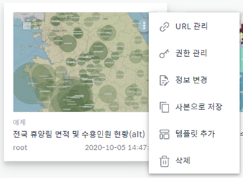
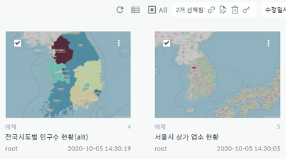
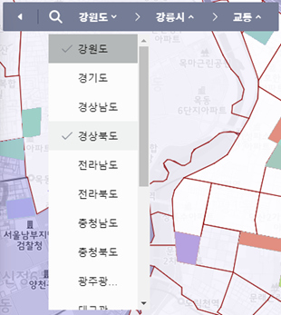
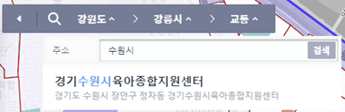
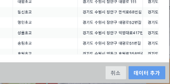
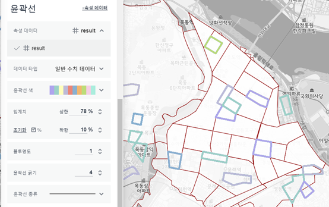
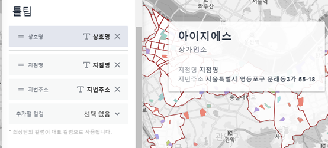
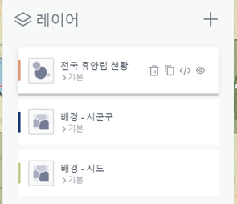
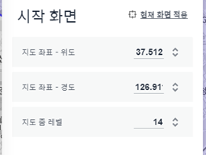

Map Analyzer
============

IMA 소개
-------

| IRIS Map Analyzer(이하 IMA)는 IRIS의 데이터 모델들을 활용, 각종 데이터들을 지도 상에 
| 시각화하고 분석하기 위한 도구입니다. IMA로 만들어진 프로젝트는 향후 IRIS 스튜디오에서 
| IMA 컴퍼넌트로 추가하여, 다른 객체들과 연동하여 사용할 수도 있게 될 예정입니다.

   
IMA 시작하기
---------	  
로그인 후 오른쪽 상단의 계정 부분에 마우스를 대면 IRIS Map Analyzer 메뉴를 선택할 수 있습니다.

.. image:: images/01.png

프로젝트 리스트
----------
프로젝트 목록은 프로젝트가 썸네일로 표시되는 그리드뷰 또는 테이블 형식으로 표시되는 리스트뷰로 볼 수 있습니다.

그리드뷰
-----
.. image:: images/02.png
   :alt: text data

리스트뷰
-----
.. image:: images/03.png
   :alt: text data

각 항목의 구성과 액션 버튼
------------------
| 각 항목의 구성은 ‘인덱스 번호/카테고리/프로젝트명/소유자/수정일시’로 되어 있으며, 
| 각 항목 마다 비치된 액션 버튼을 통해 ‘URL관리/권한 관리/정보 변경/사본으로 
| 저장/템플릿 추가/삭제’ 등의 처리를 할 수가 있습니다. 

항목의 구성
-------
.. image:: images/04.png
   :alt: text data
 
항목 메뉴의 구성
-----------

URL 관리
-----------
| 'URL 생성' 버튼을 클릭해서 해당 프로젝트의 '미리보기'를 브라우저에서 열람할 수 있는 
| URL을 생성할 수 있습니다. 이후 생성된 URL을 클릭해서 클립보드에 복사하거나 
| 'url 삭제' 버튼을 클릭해서 생성된 URL을 삭제할 수 있습니다.

URL 생성 전
-----------
.. image:: images/06.png
   :alt: text data
 
URL 생성 후
-----------
.. image:: images/07.png
   :alt: text data
 

프로젝트 권한 설정 (관리자 기능)
-----------
사용자 그룹 또는 사용자 단위로 해당 프로젝트에 대한 접근 권한을 부여하거나 회수할 수 있습니다. '모든 사용자 그룹'이나 '모든 사용자'에 체크하는 경우, 개별 설정을 뭇하고 모든 사용자 그룹 또는 모든 사용자에게 일괄적으로 권한을 부여합니다.

.. image:: images/08.png
   :alt: text data 

정보 변경
-----------
해당 프로젝트가 속하게 될 카테고리를 변경하거나 프로젝트명을 수정할 수 있습니다. 카테고리의 추가/편집은 관리자 전용 메뉴인 '카테고리 관리'에서 가능합니다.

.. image:: images/09.png
   :alt: text data

사본으로 저장
-----------
해당 프로젝트를 복제해서 사본으로 저장합니다. 원본 프로젝트명 뒤에 (count) 형식으로 프로젝트명이 부여됩니다.

템플릿 추가 (관리자 기능)
-----------
해당 프로젝트를 템플릿으로 추가합니다. 추가된 템플릿은 템플릿 목록에서 확인할 수 있으며, 누구든지 해당 템플릿을 활용하여 어느 정도 기반 작업이 되어 있는 상태에서 프로젝트를 시작할 수 있습니다.

.. image:: images/10.png
   :alt: text data 

삭제
-----------
해당 프로젝트를 삭제합니다.

일괄 처리 기능
-----------
하나 이상의 항목을 체크하면 목록 상단에 일괄 처리 메뉴가 표시되는데, 여기에서 일괄 처리 기능을 사용할 수 있습니다. 일괄로 처리할 수 있는 기능에는 ‘URL 일괄 생성/일괄 정보 변경/일괄 삭제/일괄 권한 관리‘가 있습니다. 복수의 프로젝트를 일괄로 처리한다는 점을 제외하고는 기본적으로 단일 메뉴에서의 기능과 동일합니다. 단, 일괄 정보 변경에서는 카테고리 변경만 가능합니다. 
 

카테고리 관리
-----------
관리자는 페이지 우상단의 카테고리 관리 버튼을 클릭하면 표시되는 팝업에서 카테고리를 추가/편집/삭제할 수 있습니다. 카테고리명을 더블클릭해서 수정할 수 있습니다.
 
.. image:: images/12.png
   :alt: text data

새 프로젝트 시작하기
-----------
새로운 IMA 프로젝트를 시작하기 위해서는 페이지 우상단의 새 프로젝트 시작 버튼을 클릭해서 완전히 비어있는 프로젝트부터 시작하거나, 템플릿으로 시작 버튼을 클릭하면 표시되는 템플릿 목록 중에 하나를 선택하여, 기본적인 세팅이 되어 있는 상태에서 프로젝트를 시작할 수가 있습니다.

템플릿으로 시작, 새 프로젝트 시작 버튼
-----------

.. image:: images/13.png
   :alt: text data
 
템플릿 목록 화면
-----------

.. image:: images/14.png
   :alt: text data
 
메인 화면의 구성
-----------
IMA 메인화면의 구성은 기본적으로 화면 왼쪽에서부터 메인 컨트롤러, 위치 정보 컨트롤러, 공간 필터 저작 도구 컨트롤러, 줌 컨트롤러, 베이스맵, 범례로 구성되어 있습니다.

.. image:: images/15.png
   :alt: text data
 
메인 컨트롤러의 역할과 구성
-----------
메인 컨트롤러는 크게 ‘프로젝트 섹션‘과 ‘레이어 섹션‘으로 나뉘는데, 프로젝트 섹션에서는 ‘프로젝트명 변경‘, ‘저장’ 등 프로젝트의 정보에 대한 관리가 이루어지고, 레이어 섹션은 IMA에서 가장 중요한 기능들이 모여있는 곳으로, IMA 프로젝트에서 데이터를 추가하여 시각화하는 프로세스는 모두 이 레이어 섹션과 그에 귀속된 팝업들로부터 이루어집니다. 

프로젝트 섹션 
-----------

.. image:: images/16.png
   :alt: text data
  
컨트롤러 좌상단의 메뉴 아이콘을 클릭하면 표시되는 메뉴를 통해서 ‘목록으로 나가기/새 프로젝트/사본으로 저장’ 액션을 처리할 수 있고, 그 오른쪽에 표시되는 프로젝트명은 더블 클릭해서 수정이 가능합니다. 저장 버튼은 현재까지 작업된 내용을 기존의 프로젝트 위에 덮어쓰기를 하기 위해 사용되고, 이중 꺾쇠로 되어 있는 ‘접기’ 버튼은 메인 컨트롤러를 숨겨서 지도와 시각화 컴퍼넌트를 넓게 보려고 할 때 사용됩니다.

레이어 섹션
-----------

.. image:: images/17.png
   :alt: text data

레이어 섹션에선 데이터와 레이어, 그리고 베이스맵을 설정할 수 있습니다. 먼저 데이터 추가를 통해 IRIS의 데이터 모델 중 하나를 선택하여 데이터 시각화를 시키기 위한 기반 작업을 하고, 시각화 레이어 설정을 통해 이 데이터를 어떻게 지도 위에 나타낼 것인지 세부적인 설정을 할 수 있습니다. 일단 시각화 레이어가 추가된 이후에도 데이터 편집을 통해 기반 데이터의 설정을 변경하거나, 스냅샷 추가를 통해 기반 데이터로부터 분기되는 여러 갈래의 필터들을 만들어 적용해볼 수도 있습니다. 베이스맵에서는 가장 하단에 위치하는 지도 레이어를 나타내는데 쓰이는 베이스맵의 소스를 변경하거나, 프로젝트를 시작할 때의 시작점을 설정할 수 있습니다.

위치 정보 컨트롤러
-----------

위치 정보 컨트롤러에서는 Breadcrumb을 이용하여 지금 보고 있는 지도 상의 위치를 파악하거나 또는 Breadcrumb의 각 뎁스를 직접 선택하여 원하는 위치로 이동할 수 있습니다.

또한, 주소 검색을 통해 내가 원하는 장소를 빠르게 찾아, 그곳으로 한번에 이동하는 것도 가능합니다.
 

공간 필터 저작 컨트롤러
-----------

.. image:: images/21.png
   :alt: text data

많은 양의 데이터 중, 내가 원하는 범위 안의 데이터만 필터링하여 보기 위해 활용할 수 있는 도구가 바로 공간 필터입니다. 공간 필터 저작 컨트롤러에서는 사각형, 원, 폴리곤 툴을 이용하여 이런 필터링 영역을 지정할 수 있습니다.
 
.. image:: images/22.png
   :alt: text data

줌 컨트롤러
-----------

.. image:: images/23.png
   :alt: text data
   
: 직접 수치를 입력하거나 버튼을 눌러서 지도를 확대/축소할 수 있고, 줌과 지도 이동이 안되게 잠그기도 가능합니다. 

잠그기 해제 상태 (줌 인/아웃 및 지도 이동 가능)

.. image:: images/24.png
   :alt: text data 
 
잠그기 상태 (줌 인/아웃 및 지도 이동 불가)

.. image:: images/25.png
   :alt: text data

베이스맵
----------- 

.. image:: images/26.png
   :alt: text data
   
: 시각화 컴퍼넌트들의 가장 하단에 위치하여 기본적인 지리 정보를 나타내는 기본 레이어입니다. 마우스 컨트롤을 통해 위치 이동 및 확대/축소가 가능하며, 베이스맵의 종류는 메인컨트롤러의 베이스맵 버튼을 클릭하면 표시되는 베이스맵 설정 팝업에서 변경할 수 있습니다.

범례
-----------

 시각화 컴퍼넌트가 생성되면, 각 컴퍼넌트들이 무엇을 어떻게 표현하고 있는지 이해를 돕기 위해 범례가 표시됩니다. 접기/펼치기 전환이 가능합니다.
 
 .. image:: images/28.png
   :alt: text data
 
시각화 - 기능 범위
-----------
: 베타 버전에서 제공하는 기능은 다음과 같습니다.
1. 데이터 변환
- 우편번호 / 시도, 구군, 읍면동 / 위, 경도 등
2. 시각화
- 폴리곤, 마커, 원
3. 공간 필터
- 원, 사각형, 다각형을 이용한 데이터 필터링
4. 베이스 맵
- OSM, V-World 등

시각화 - 데이터 추가 프로세스
-----------
: 데이터 추가 과정은 다음과 같이 진행됩니다.
1. 데이터 추가 시작 : 메인컨트롤러의 레이어섹션에서 데이터라는 텍스트의 옆에 있는 ‘+’ 아이콘을 클릭합니다.

.. image:: images/29.png
   :alt: text data

2. 데이터 모델 선택 : 데이터 모델을 검색하거나 아래 데이터 모델 목록에서 원하는 모델을 선택합니다.

.. image:: images/30.png
   :alt: text data
 
3. 기간 선택 : 사용할 데이터의 기간 범위를 선택합니다.

.. image:: images/31.png
   :alt: text data

4. 공간 데이터셋 : 지도에 데이터를 나타내기 위해서 필요한 공간 데이터를 설정합니다. 경위도/GeoJSON/WKT/도로명 주소/우편번호 중 하나를 선택하고, 해당 공간 데이터를 담고 있는 컬럼을 선택합니다. 여러 벌의 공간 데이터를 만들 수도 있습니다.

.. image:: images/32.png
   :alt: text data
 
5. 컬럼 : 속성 데이터로 사용될 컬럼들을 확인합니다. 샘플링 되는 데이터에서 보고 싶은 컬럼만 체크합니다.

.. image:: images/33.png
   :alt: text data
 
6. DSL 명령어 : 데이터를 필터링하기 위한 DSL 명령어를 입력합니다.

7. 실행 : 실행 버튼을 누르면 앞서 설정한 내용들을 반영한 샘플링 결과를 출력합니다. 전체 데이터 중 최대 50개까지만 출력됩니다.

.. image:: images/34.png
   :alt: text data
 
8. 데이터 추가 : 샘플링 된 데이터를 보고 시각화 할 기반 데이터가 바르게 설정되었으면 팝업 우하단의 데이터 추가 버튼을 눌러 데이터를 추가합니다.

 

시각화 - 데이터 정보 수정
-----------

: 추가된 데이터는 삭제/복제/데이터 수정이 가능합니다. 데이터명을 더블클릭해서 데이터명을 수정할 수도 있습니다. 추가된 데이터들은 각기 고유의 컬러를 가지며, 각 데이터에 기반해서 생성된 레이어들은 기반 데이터와 동일한 컬러가 부여되어 레이어 앞에 표시됩니다.
데이터에 마우스 커서 오버롤 상태

.. image:: images/36.png
   :alt: text data
   
데이터명 편집 화면 (더블 클릭)

.. image:: images/37.png
   :alt: text data

시각화 - 레이어 추가 프로세스
-----------
: 시각화 레이어 추가 과정은 다음과 같이 진행됩니다.

1. 레이어 추가 시작 : 메인컨트롤러의 레이어섹션에서 레이어라는 텍스트의 옆에 있는 ‘+’ 아이콘을 클릭합니다.

 
2. 데이터 선택 : 시각화 할 데이터를 선택합니다.

.. image:: images/39.png
   :alt: text data
 
3. 시각화 타입 : 앞서 선택한 데이터를 어떤 종류의 시각화로 표현할 것인지 선택합니다.

.. image:: images/40.png
   :alt: text data
 
4. 공간 데이터 : 미리 설정된 공간 데이터셋 중 시각화에 이용할 공간 데이터 하나를 선택합니다. 여기까지 진행 후 하단의 ‘시각화 적용’ 버튼을 누르면 ‘기본 설정‘으로 지도상에 시각화 컴퍼넌트가 생성됩니다.

.. image:: images/41.png
   :alt: text data
 
5. 공통 설정 - 채우기 : 시각화 컴퍼넌트의 채우기 색상을 설정할 수 있습니다. 단색으로 표현하거나 속성 데이터를 추가하여, 해당 데이터에 기반한 그라디언트로 표현할 수 있습니다. 불투명도를 설정할 수 있습니다.

채우기 : 단색

.. image:: images/42.png
   :alt: text data
 
채우기 : 그라디언트

 .. image:: images/43.png
   :alt: text data

6. 공통 설정 - 윤곽선 : 시각화 컴퍼넌트의 윤곽선 색상과 각종 속성을 설정할 수 있습니다. 단색으로 표현하거나 속성 데이터를 추가하여, 해당 데이터에 기반한 그라디언트로 표현할 수 있습니다. 불투명도를 설정할 수 있습니다.

윤곽선 : 단색

.. image:: images/44.png
   :alt: text data 
 
윤곽선 : 그라디언트

  
7. 공통 설정 - 툴팁 : 지도 상에 표현된 시각화 컴퍼넌트에 마우스 커서를 롤오버 했을 때 표시되는 툴팁을 설정할 수 있습니다. 가장 상단의 컬럼은 ‘대표 컬럼‘으로, 툴팁 및 상세내용 팝업에서 타이틀로 활용되게 됩니다.

8. 공통 설정 - 라벨 : 지도 상에 표현된 시각화 컴퍼넌트의 중앙점을 기준으로 라벨을 설정합니다. 특정 컬럼의 값을 나타낼 수 있으며, 글꼴의 색상이나 크기, 위치 등을 설정할 수 있습니다.
 
.. image:: images/47.png
   :alt: text data 

9-1. 원 : 데이터를 원으로 나타내기 위해 원 크기를 설정합니다. 속성 데이터가 없는 상태에서는 일률적인 크기로 설정할 수 있고, 속성 데이터를 추가한 상태에서는 해당 데이터의 수치를 반영한 가변 크기로 설정할 수 있습니다. 원 크기는 지도 확대/축소의 영향을 받습니다.

원 : 단일 크기

.. image:: images/48.png
   :alt: text data
 
원 : 가변 크기

.. image:: images/49.png
   :alt: text data

9-2. 마커 : 원 또는 깃발로 데이터를 나타내기 위한 설정입니다. 속성 데이터는 적용할 수 없으며, 마커의 종류와 컬러, 고정 크기만을 설정할 수 있습니다. 마커 크기는 지도 확대/축소의 영향을 받지 않습니다.

마커 : 원

.. image:: images/50.png
   :alt: text data
 
마커 : 깃발

.. image:: images/51.png
   :alt: text data

시각화 - 레이어 정보 수정
-----------
: 각 레이어는 드래그&드롭으로 서로 순서를 변경하거나 삭제/복제/스냅샷 편집/표시 토글이 가능합니다. 레이어명을 더블클릭해서 레이어명을 수정할 수도 있습니다.

레이어에 마우스 커서 오버롤 상태

 
레이어명 편집 화면 (더블 클릭)

 .. image:: images/53.png
   :alt: text data

시각화 - 레이어 데이터 필터
-----------
기반 데이터에서 분기된 필터(스냅샷)를 설정합니다. 레이어 목록 중 하나에 마우스 커서를 오버롤 한 후 </> 버튼을 클릭하면 화면 하단에서 레이어 데이터 필터 팝업이 표시됩니다.

.. image:: images/54.png
   :alt: text data
 
스냅샷 추가 : 데이터 추가와 유사한 방식으로 데이터에 필터를 추가한 후 저장 버튼을 눌러 스냅샷을 추가할 수 있습니다. (기본 스냅샷은 덮어쓰기 불가)
스냅샷 목록: 각 레이어의 레이어명 하단에 위치한 스냅샷 버튼(스냅샷명)을 클릭하면 스냅샷 목록이 표시됩니다. 여기서 스냅샷을 선택해서 반영하거나 스냅샷명 수정/복제/삭제가 가능합니다. 

.. image:: images/55.png
   :alt: text data

베이스맵
-----------
베이스맵은 베이스맵 선택과 시작 화면 설정으로 나뉩니다.

베이스맵 선택 : Open Street Map이나 VWorld, 또는 URL을 직접 입력해서 베이스맵을 변경합니다. URL은 입력 후 '적용' 버튼을 클릭해야 반영됩니다.

.. image:: images/56.png
   :alt: text data
 
시작화면 지정 : 프로젝트가 시작될 때 표시될 위치를 직접 입력하거나 ‘현재 화면 적용’ 버튼을 눌러 지정합니다.

 
저장 및 목록으로 돌아가기
-----------
: 시각화 작업이 끝났으면 메인컨트롤러의 프로젝트 섹션의 프로젝트명을 더블 클릭해서 프로젝트명을 수정하고, 저장 버튼을 눌러 프로젝트를 저장합니다. 그리고 왼쪽의 메뉴 버튼을 누른 후 ‘목록으로 나가기’ 항목을 클릭하여 목록으로 돌아갑니다.
프로젝트명 수정 및 저장

.. image:: images/58.png
   :alt: text data
   
목록으로 나가기
-----------
   
.. image:: images/59.png
   :alt: text data