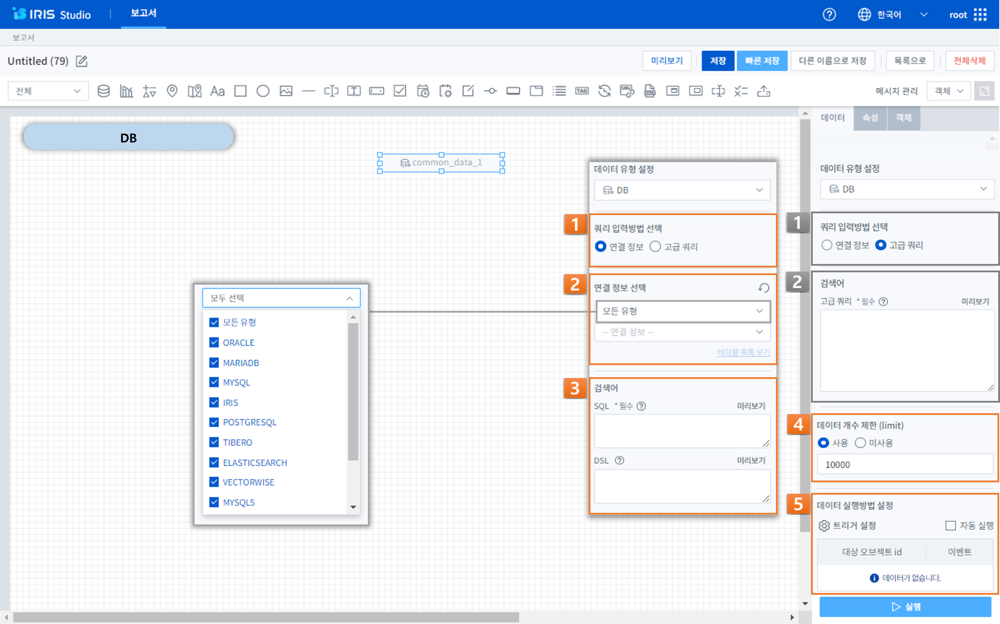
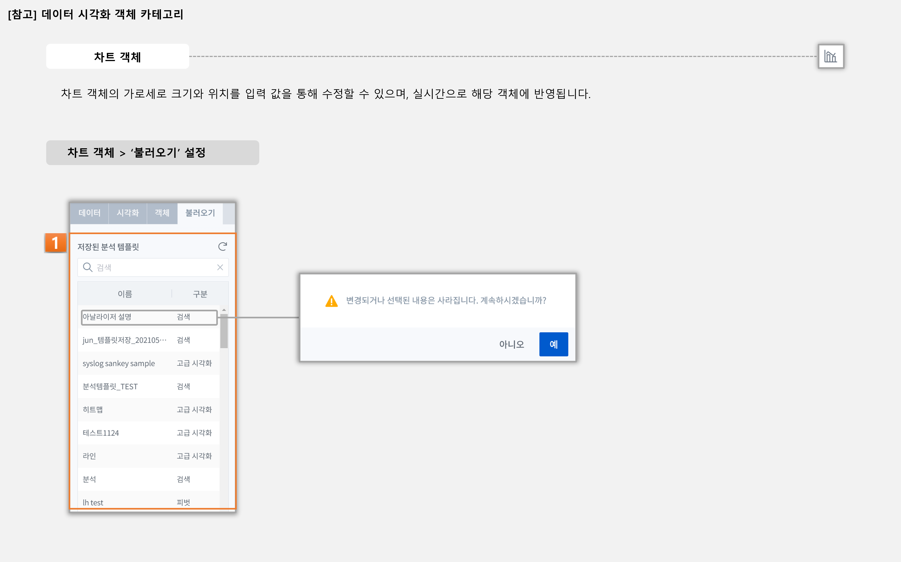
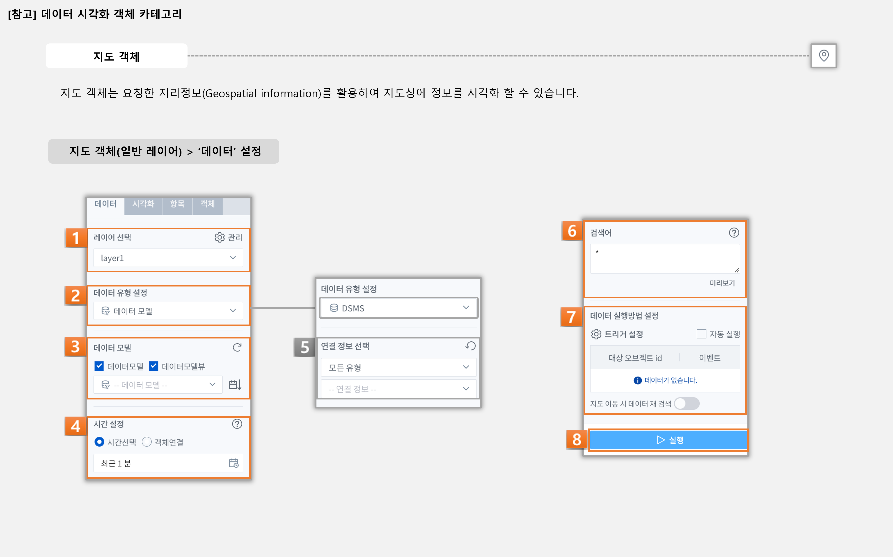
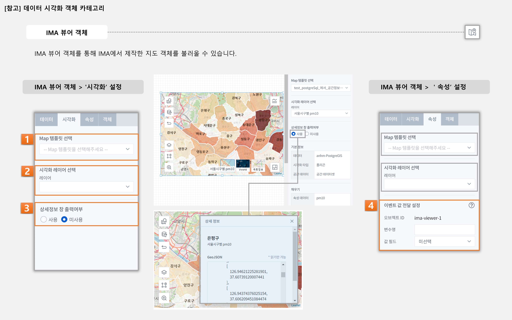
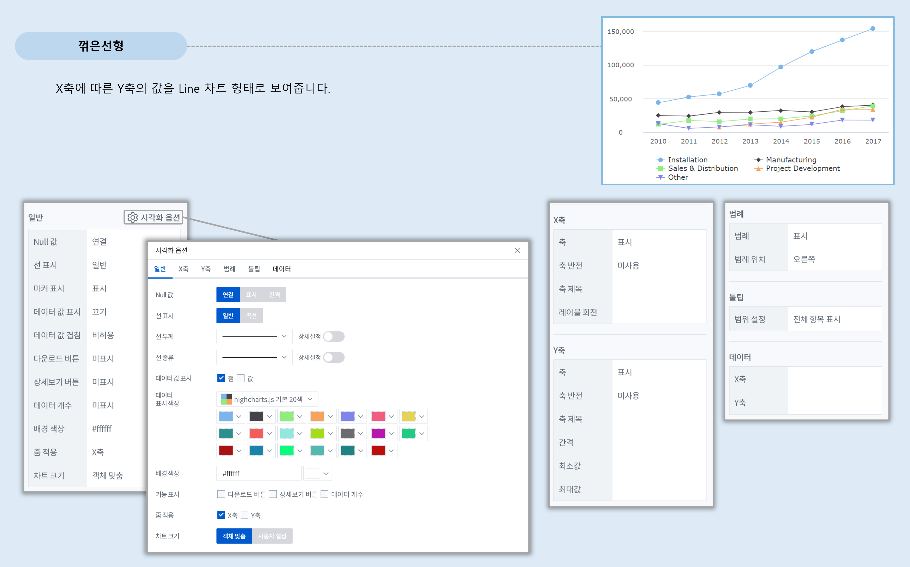
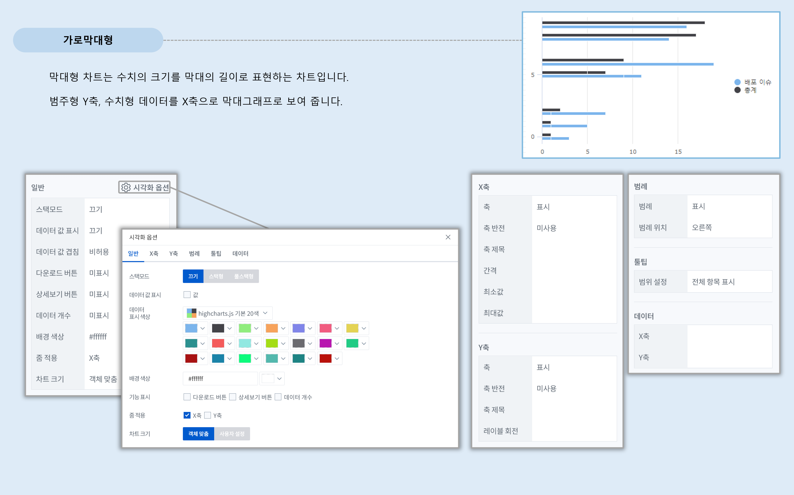
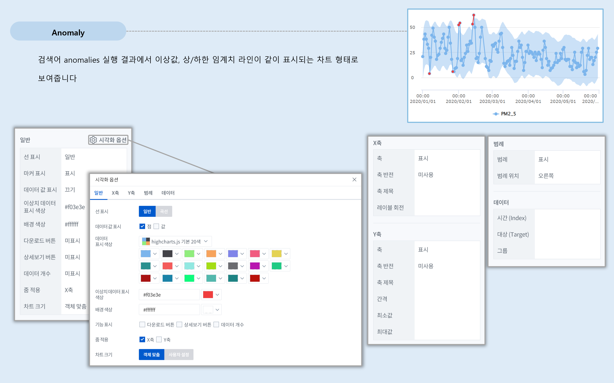
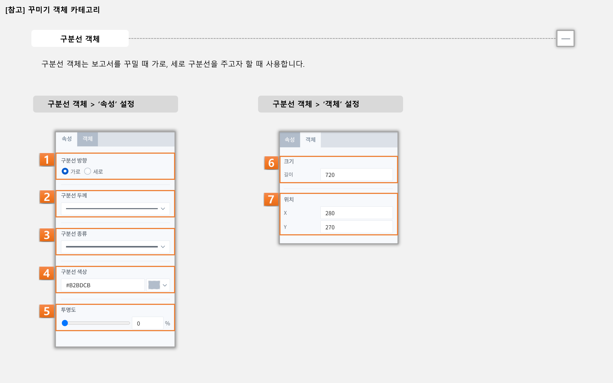
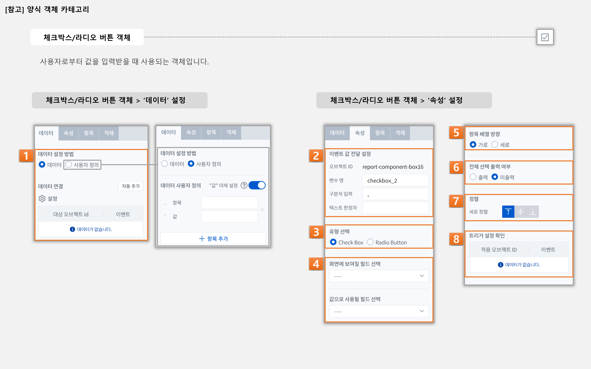
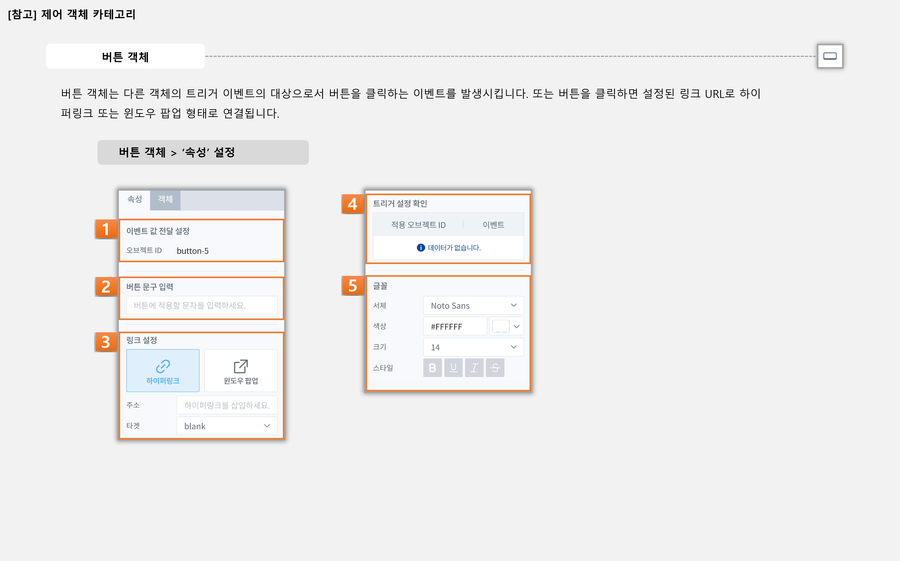

IRIS Studio
======================

| IRIS Studio를 통해 데이터를 탐색 혹은 분석/시각화 한 결과를 문서나 웹 페이지 형태로 작성할 수 있습니다.
| 입력란을 구성하거나 각 UI 간의 동작 제어를 통하여, 조건이나 입력값에 따라 서로 다른 데이터나 분석 결과를 불러오게 할 수도 있습니다.
|
| 우측 상단의 메인 메뉴의 ‘Studio’ 버튼을 눌러 접속하실 수 있습니다.

|

보고서
----------------------------

| IRIS Studio 내의 보고서는 사용자가 원하는 다양한 유형의 대시보드 및 보고서를 작성할 수 있는 기능을 담고 있습니다. 
| 사용자는 보고서의 캔버스 상에 다양한 표와 차트를 옮겨 놓고 관련 데이터를 매핑함으로써 보고서를 쉽고 빠르게 생성할 수 있습니다.

.. image:: IRIS-03-1-1.png
    :width: 1000
    :alt: IRIS-03-1-1

+------+-------------------------------------------------------------+-----------------------------------------------------------------------------------------------------------------------------------------------------------------------------------------------------------------------------------------------------------+
| 번호 | 구분                                                        | 설명                                                                                                                                                                                                                                                      |
+======+=============================================================+===========================================================================================================================================================================================================================================================+
| 1    | 카테고리 관리                                               | (관리자) 카테고리를 추가/삭제/수정할 수 있습니다.                                                                                                                                                                                                         |
+------+-------------------------------------------------------------+-----------------------------------------------------------------------------------------------------------------------------------------------------------------------------------------------------------------------------------------------------------+
| 2    | 보고서 내보내기                                             | 보고서를 JSON 파일로 내보낼 수 있습니다.                                                                                                                                                                                                                  |
+------+-------------------------------------------------------------+-----------------------------------------------------------------------------------------------------------------------------------------------------------------------------------------------------------------------------------------------------------+
| 3    | 보고서 가져오기                                             | '보고서 내보내기'로 만든 JSON 파일에서 보고서 데이터를 불러와 새로운 보고서를 추가하거나 기존 보고서를 덮어씁니다.                                                                                                                                        |
+------+-------------------------------------------------------------+-----------------------------------------------------------------------------------------------------------------------------------------------------------------------------------------------------------------------------------------------------------+
| 4    | 선택 보고서 컨트롤                                          | 선택한 보고서에 대하여 대시보드 사용/미사용 및 권한/소유자 설정, 카테고리/이름 정보 변경, 삭제 기능을 수행할 수 있습니다. (대시보드를 선택하면 메인 메뉴의 ‘대시보드’의 리스트에 추가됩니다.                                                              |
+------+-------------------------------------------------------------+-----------------------------------------------------------------------------------------------------------------------------------------------------------------------------------------------------------------------------------------------------------+
| 5    | 목록 컨트롤                                                 | 그리드 뷰/리스트 뷰 설정, 정렬, 카테고리 설정, 검색 등의 기능을 수행할 수 있습니다.                                                                                                                                                                       |
+------+-------------------------------------------------------------+-----------------------------------------------------------------------------------------------------------------------------------------------------------------------------------------------------------------------------------------------------------+
| 6    | 항목 메뉴                                                   | 대시보드 사용/미사용, 템플릿으로 등록(카테고리/템플릿 이름 설정) 및 정보 변경, 프로젝트 권한 설정(관리자), 내보내기 링크 생성, 프로젝트 편집/복제/삭제 기능을 이용하실 수 있습니다. 보고서 기본 대시보드로 등록에 관한 자세한 내용은 [참고]를 확인하세요. |
+------+-------------------------------------------------------------+-----------------------------------------------------------------------------------------------------------------------------------------------------------------------------------------------------------------------------------------------------------+

- **항목 메뉴**

    - 대시보드 사용/미사용: 해당 보고서를 대시보드 목록에서 표시할지 여부를 선택합니다.
    - 템플릿으로 등록: 해당 보고서를 템플릿으로 저장합니다. 
    - 권한설정: 해당 보고서를 특정 사용자 혹은 그룹에게 공유하여, 보고서를 열람(실행)하거나 복제할 수 있는 권한을 부여합니다.
    - 소유자 설정: 해당 보고서의 소유자 정보를 변경할 수 있습니다. 최고관리자(super-user) 만 기능을 사용할 수 있습니다.
    - 내보내기 링크: 해당 보고서의 내보내기 URL을 생성할 수 있습니다. 
    - 정보변경: 보고서의 카테고리 및 이름을 변경합니다.
    - 편집: 편집 화면으로 이동하여 해당 보고서를 편집할 수 있습니다.
    - 복제/삭제: 해당 보고서를 복제 및 삭제할 수 있습니다.

|

+------+-------------------------------------------+--------------------------------------------------------------------------------------------------------------------------------------------------------------------------------------------------------------------+
| 번호 | 구분                                      | 설명                                                                                                                                                                                                               |
+======+===========================================+====================================================================================================================================================================================================================+
| 1    | 템플릿으로 시작                           | 내 템플릿/다른 사용자의 템플릿 목록 중 템플릿 하나를 선택하면 기본 세팅이 되어 있는 상태에서 프로젝트를 시작할 수 있습니다. 템플릿 카테고리 관리를 통해 카테고리를 추가하고, 카테고리 목록에서 확인할 수 있습니다. |
+------+-------------------------------------------+--------------------------------------------------------------------------------------------------------------------------------------------------------------------------------------------------------------------+
| 2    | 새 보고서 시작                            | 완전히 비어 있는 프로젝트부터 시작할 수 있습니다.                                                                                                                                                                  |
+------+-------------------------------------------+--------------------------------------------------------------------------------------------------------------------------------------------------------------------------------------------------------------------+

|

+------+-----------------------------------------------------------+-------------------------------------------------------------------------------------------------------------------------------------------------------+
| 번호 | 구분                                                      | 설명                                                                                                                                                  |
+======+===========================================================+=======================================================================================================================================================+
|| 1   || 보고서 제목                                              || 왼쪽 상단의 연필(수정) 버튼을 클릭하여 보고서의 제목을 설정 및 수정할 수 있으며, 수정 후 체크 버튼을 클릭하여 변경된 보고서 명을 저장할 수 있습니다. |
||     ||                                                          || 디폴트로 Untitled+{번호} 가 설정됩니다.                                                                                                              |
+------+-----------------------------------------------------------+-------------------------------------------------------------------------------------------------------------------------------------------------------+
|| 2   || 보기                                                     || 편집한 보고서를 미리 보기 하는 버튼입니다.                                                                                                           |
+------+-----------------------------------------------------------+-------------------------------------------------------------------------------------------------------------------------------------------------------+
|| 3   || 저장/빠른저장/다른 이름으로 저장                         || (저장) 카테고리와 보고서 이름을 설정하여 저장할 수 있는 팝업창이 뜹니다.                                                                             |
||     ||                                                          || (빠른저장) 이미 설정되어 있는 보고서 이름과 카테고리 그대로 현재까지 편집한 상태를 저장합니다.                                                       |
||     ||                                                          || (다른 이름으로 저장) 현재 작성된 보고서를 다른 이름을 지정하여 새 보고서로 만듭니다.                                                                 |
+------+-----------------------------------------------------------+-------------------------------------------------------------------------------------------------------------------------------------------------------+
|| 4   || 목록으로                                                 || 보고서 편집 화면을 빠져 나와서 보고서 목록 화면으로 돌아갑니다.                                                                                      |
+------+-----------------------------------------------------------+-------------------------------------------------------------------------------------------------------------------------------------------------------+
|| 5   || 전체삭제                                                 || 해당 보고서 편집화면에 생성되어 있는 모든 객체를 한꺼번에 삭제합니다.                                                                                |
+------+-----------------------------------------------------------+-------------------------------------------------------------------------------------------------------------------------------------------------------+
|| 6   || 객체 툴바                                                || 객체 툴바를 데이터 시각화, 꾸미기, 양식, 제어, 특수/기타 카테고리 별로 필터링 정렬할 수 있습니다.                                                    |
||     ||                                                          || 카테고리별 객체 툴바에 관한 자세한 내용을 [참고]를 확인하세요.                                                                                       |
+------+-----------------------------------------------------------+-------------------------------------------------------------------------------------------------------------------------------------------------------+
|| 7   || 메시지 관리                                              || 사용자 메시지 관리를 할 수 있습니다.                                                                                                                 |
+------+-----------------------------------------------------------+-------------------------------------------------------------------------------------------------------------------------------------------------------+
|| 8   || 객체 컨트롤                                              || 객체 컨트롤에서 객체 목록 보기, 히든 객체 숨김, 전체 변수명 보기 등의 기능을 활용할 수 있습니다.                                                     |
+------+-----------------------------------------------------------+-------------------------------------------------------------------------------------------------------------------------------------------------------+

- **객체**

    - 객체목록 보기

        - 현재 보고서에 있는 모든 객체를 목록 형태로 보여줍니다. 해당 객체에 설정된 이벤트 트리거 설정도 확인할 수 있습니다.

    - 히든객체 숨김

        - 편집 화면에서만 보이는 히든 유형의 객체를 숨기는 버튼입니다. 히든 유형의 객체는 UI 없이 기능만을 위한 객체로, 데이터, 보고서 연결하기, 텍스트 변환 등이 해당됩니다. 

    - 전체 변수명 보기

        - 현재 보고서의 모든 변수명과 함께 현재 처리된 변숫값을 목록 형태로 보여줍니다.

|

+------+------------------------+-------------------------------------------------------------------------------------------------------------------------------------------------------+
| 번호 | 구분                   | 설명                                                                                                                                                  |
+======+========================+=======================================================================================================================================================+
|| 1   || 캔버스                || 객체가 배치되는 공간으로, 문서에서 레이아웃에 해당합니다. 크기 및 색상이나 각종 기능 사용여부 등을 설정할 수 있습니다.                               |
+------+------------------------+-------------------------------------------------------------------------------------------------------------------------------------------------------+
|| 2   || 속성 패널             || 속성은 캔버스의 색상 및 변수, 트리거, 팝업 닫기를 설정하는 영역입니다.                                                                               |
||     ||                       || 객체는 캔버스의 크기를 조절하거나, 보고서 제목 출력·미출력, 화면 이미지 캡처 사용·미사용, 보고서 인쇄 기능 사용·미사용 설정을 할 수 있는 영역입니다. |
||     ||                       || 또한, 객체 툴바 부분의 객체 전체삭제 버튼 우측에 ‘컴포넌트 영역(속성/객체 영역) 펼치기/접기‘ 기능이 있습니다.                                        |
+------+------------------------+-------------------------------------------------------------------------------------------------------------------------------------------------------+

- **속성**

    - 이벤트 값 전달 설정

        - 오브젝트 ID: 객체별로 부여된 고유한 값으로, ID 를 통하여 각 객체를 식별할 수 있습니다.
        - 변수 설정: 객체와는 별개로 캔버스에 여러 변수를 추가/정의할 수 있습니다.

    - 팝업 닫기 설정

        - 현재 보고서가 보고서 연결하기(Popup)으로 사용되었을 때, 팝업을 닫으면 발생시킬 이벤트 트리거를 지정하는 설정입니다.
            - 트리거 설정: ‘변수 설정’으로 global 변수로 설정된 값을 ‘보고서 연결하기‘로 연결된 다른 보고서로 보낼 때의 트리거 조건 설정을 할 수 있습니다.

- **객체**

    - 캔버스 크기: 캔버스 영역의 크기 및 반응형 설정을 할 수 있습니다.
    - 캔버스 색상: 캔버스 영역의 색상과 캔버스 배경(바깥 영역) 색상을 변경합니다.
    - 보고서 제목 출력: 실행화면에서 보고서 상단 제목 영역의 출력 여부를 설정할 수 있습니다.
    - 화면 이미지 캡처 기능: 화면 이미지 캡처의 사용/미사용을 설정할 수 있습니다. 저장된 이미지는 실제 화면과 다를 수 있으며, 해당 기능은 Safari 브라우저에서 지원되지 않습니다.
    - 보고서 인쇄 기능: 보고서 인쇄 기능의 사용/미사용을 설정할 수 있습니다.

|

- **객체 입력 모드**

     - 객체가 선택된 상태에서 객체 內 텍스트 작성 및 마우스핸들을 이용한 내부 핸들 조작 등을 할 수 있도록 하는 상태를 말합니다.

        - **(1) 입력 모드 off**
  
            - 내부 클릭/조작/작성이 불가합니다.
            - 객체 스케일 및 크기, 위치  조정이 가능합니다.
  
        - **(2) 입력 모드 on**
  
            - 입력모드 아이콘을 선택 또는 객체 더블 클릭 (일부 객체 제공) 을 하면 입력모드가 활성화 됩니다.
            - 입력모드 상태에서는 이동/스케일 변경이 불가합니다.

| 
|

[참고]보고서를 대시보드 기본으로 설정
-------------------------------------------------

| Studio 의 보고서 목록에서 해당 보고서를 대시보드 기본 으로 설정하게 되면 대시보드 메뉴 진입 시에 바로 보고서가 화면에 출력됩니다.
| 보고서 목록에서 대시보드 - 기본 으로 설정되는 보고서는 1개만 가능하며, 마지막으로 기본으로 변경한 보고서만 기본 으로 설정되고, 이전의 기본 보고서는 사용 으로 변경됩니다.
|

(1) IRIS Studio 내의 보고서 탭의 보고서 항목 메뉴에서 ‘대시보드 사용 여부’ 항목을 찾아 사용(기본)으로 바꿔줍니다.

(2) IRIS Web Platform(IWP) 메인 화면에 접속합니다. 

(3) 메인 대시보드 화면 좌측에 ‘>‘ 기호를 클릭하여 ‘대시보드 변경’ 탭을 열어 원하는 대시보드를 선택하여 메인 대시보드를 변경해줍니다.

(4) 설정한 대시보드는 IRIS 접속 시 대시보드 화면의 첫 번째 화면으로 확인할 수 있습니다.

+------+-----------------------------------------------------------------+---------------------------------------------------------------------------------------------------------------------------------------------+
| 번호 | 구분                                                            | 설명                                                                                                                                        |
+======+=================================================================+=============================================================================================================================================+
|| 1   || 보고서 대시보드 사용 여부 설정                                 || Studio에서 ‘대시보드 사용여부’를 활성화 시켜, 대시보드로 사용할 보고서를 선택합니다.                                                       |
||     ||                                                                || 또한 기본으로 설정 시, 선택한 대시보드가 메인 메뉴의 기본 대시보드로 바로 설정됩니다.                                                      |
+------+-----------------------------------------------------------------+---------------------------------------------------------------------------------------------------------------------------------------------+
|| 2   || 대시보드 리스트                                                || 메인 메뉴의 좌측 상단의 ‘> 아이콘’을 눌러 대시보드 리스트를 열고 Studio에서 추가한 대시보드 가운데 기본으로 설정할 대시보드를 선택합니다.  |
+------+-----------------------------------------------------------------+---------------------------------------------------------------------------------------------------------------------------------------------+

- **대시보드 사용 여부**

    - 미사용: ‘미사용’ 선택 시, 작성된 보고서를 대시보드에서 활용하지 않습니다.
    - 사용: ‘사용‘ 선택 시 대시보드 화면에서 리스트 형태로 선택이 가능합니다.
    - 기본: ‘기본’ 선택 시 사용자가 로그인 후 대시보드 화면으로 등록할 수 있습니다.

|
|

[참고]객체 유형
-------------------------------------------------

|

- **시각화 객체 유형**

|

데이터 시각화 객체
++++++++++++++++++++++++++++++++++++++++++++++

데이터 시각화 객체는 데이터를 차트나 표, 도형 등의 형태로 시각화 하는 객체 입니다. 데이터 객체와 더불어, 데이터 객체와 연결하여 동작 가능한 차트 객체, 지도 객체가 데이터 시각화 객체에 해당됩니다.

------------------------------------------------------------------------------------------------------------

데이터 객체
**************************************

| 데이터 객체는 시각화 혹은 UI를 구성하기 위한 데이터를 만드는 객체입니다.
| 주로 Analyzer 와 유사하게 데이터 모델 기반으로 검색어(DSL)를 작성하여 데이터 탐색 혹은 분석 작업 결과를 서버로부터 받아옵니다.
| 데이터 객체는 UI 없이 기능만을 가지고 있는 히든 유형의 객체로 미리보기/실행 화면에서는 표시되지 않습니다.

|

데이터 객체 생성하기
###################################################

- 데이터 객체 생성방법 (1)

    - 상단 객체 툴바에서 데이터 ‘객체 아이콘’을 클릭하여 데이터 객체를 생성합니다.

- 데이터 객체 생성방법 (2)

    - 차트, 증감률, 콤보 박스, 체크박스&라디오버튼, 목록, 태그리스트, HTML 뷰어의 ‘데이터 > 데이터연결’ 항목에서 ‘자동추가＇버튼을 클릭하면 해당 객체와 연결되는 데이터 객체가 자동으로 생성됩니다.

|

데이터 유형 설정
###################################################

- **데이터 유형 설정**

    - 데이터 모델: DB의 데이터를 추상화한 데이터 묶음으로써 별도의 테이블처럼 사용할 수 있습니다.
    - 데이터 모델 – File: File과 같은 소규모의 업로드 파일을 데이터 모델로 불러올 수 있습니다.
    - DB: Data Base의 약자로 여러 사람이 공유하여 사용 및 관리할 수 있는 데이터 집합을 연결 정보를 통해 불러올 수 있습니다.
    - DSMS: Data Source Manager Service의 약자로 다양한 데이터에 대한 접근을 제공합니다.
    - SMS: System Monitoring Service의 약자로 시스템 자원 현황에 대한 정보를 제공합니다.
    - REST-API: 데이터를 REST 형식으로 사용할 수 있게 합니다.
    - 직접입력: 컬럼과 데이터 값을 입력하여 직접 테이블을 구성할 수 있습니다.

|

+------+---------------------------------------------------+------------------------------------------------------------------------------------------------------------------------------------------------------------------------------------------------------------------------+
| 번호 | 구분                                              | 설명                                                                                                                                                                                                                   |
+======+===================================================+========================================================================================================================================================================================================================+
|| 1   || 데이터 모델                                      || 미리 정의된 데이터 모델 중 하나를 선택할 수 있습니다.                                                                                                                                                                 |
+------+---------------------------------------------------+------------------------------------------------------------------------------------------------------------------------------------------------------------------------------------------------------------------------+
|| 2   || 시간 설정                                        || 미리 설정된 시간 또는 사용자가 임의로 날짜 및 시간 범위를 지정합니다.                                                                                                                                                 |
||     ||                                                  || 객체 연결을 활용할 경우, 시작 시간/끝 시간 입력박스에 변수명을 입력하여 시간을 설정할 수 있습니다.                                                                                                                    |
+------+---------------------------------------------------+------------------------------------------------------------------------------------------------------------------------------------------------------------------------------------------------------------------------+
|| 3   || 검색어                                           || 선택된 데이터 모델에 사용될 DSL 검색어(Query)를 입력합니다.                                                                                                                                                           |
||     ||                                                  || 검색어에는 변수명이 함께 포함될 수 있으며, 사용되는 변수명은 각 객체의 변수명 설정에서 확인할 수 있고 전체변수명 보기 기능을 통해서도 확인할 수 있습니다.                                                             |
+------+---------------------------------------------------+------------------------------------------------------------------------------------------------------------------------------------------------------------------------------------------------------------------------+
|| 4   || 캐시설정                                         || 미사용이 디폴트이며, 만약 가져오는 데이터가 달라지지 않고 해당 보고서에 여러 개의 시각화 객체와 데이터 객체가 있는 경우, 1개의 데이터 객체를 여러 개의 시각화 객체에서 사용하는 경우 캐시 사용이 효과적일 수 있습니다.|
+------+---------------------------------------------------+------------------------------------------------------------------------------------------------------------------------------------------------------------------------------------------------------------------------+
|| 5   || 데이터 개수 제한                                 || 검색어를 통해서 가져오는 데이터의 개수 제한 설정입니다. 디폴트 설정 값은 10000입니다.                                                                                                                                 |
||     ||                                                  || 너무 많은 데이터가 보고서를 데이터 객체에 출력하면 속도가 느려질 수 있으므로, 정확한 결과보다 대략적인 시각화 표현을 하고자 할 때는 조절을 합니다.                                                                    |
||     ||                                                  || 또한 가져오는 데이터의 양이 많다면 limit 값을 크게 설정해야 시각화 객체에 빠지는 것이 없이 출력이 됩니다.                                                                                                             |
||     ||                                                  || DB/DSMS는 데이터 개수 제한 사용/미사용 여부를 고를 수 있습니다.                                                                                                                                                       |
+------+---------------------------------------------------+------------------------------------------------------------------------------------------------------------------------------------------------------------------------------------------------------------------------+
|| 6   || 데이터 실행방법 설정                             || 데이터 객체 > ‘데이터 설정’을 참고하세요.                                                                                                                                                                             |
+------+---------------------------------------------------+------------------------------------------------------------------------------------------------------------------------------------------------------------------------------------------------------------------------+

- **시간 설정**

    - 시간 선택

        - 비교 기간 팝업에서 일정 시간 범위 및 날짜/시간의 시작/종료 시간 범위를 직접 설정할 수 있습니다.

    - 객체 연결

        - 시간 범위를 변숫값으로 처리할 수 있도록 제공되는 기능입니다. 각각의 입력란에 시간값 혹은 문자열 형태로 변숫값을 연결할 수 있습니다. 작성한 입력값의 결과는 반드시 'YYYYMMDDHHmmss' 형식이어야만 정상 동작합니다.
        - Ex. 만약 combo_1이 YYYYMMDD 형식의 날짜가 지정되어 있는 경우, HHmmss의 시간을 붙인 다음의 변수값 ${combo_1}110327 을 시작 시간에 입력하여 예시와 같이 combo_1의 시작시간 범위를 설정할 수 있습니다.

|

+------+----------------------+-----------------------------------------------------------------------------------------------------------------------------------------------------------------------------------------------------------------+
| 번호 | 구분                 | 설명                                                                                                                                                                                                            |
+======+======================+=================================================================================================================================================================================================================+
| 1    || 쿼리 입력방법 선택  || 데이터 유형 설정에서 ‘DB’ 선택 시, 연결 정보 유형 가운데 하나의 데이터 소스를 고르거나, 고급 쿼리를 통해 직접 Advanced Query를 작성할 수 있습니다.                                                             |
+------+----------------------+-----------------------------------------------------------------------------------------------------------------------------------------------------------------------------------------------------------------+
|| 2   || 연결정보 선택       || DB의 쿼리 입력방법에서 ‘연결 정보’를 선택하게 되면, 현재 제공되고 있는 IRIS, MySQL, Oracle DataBase, Postgre 등 다양한 유형의 데이터 소스를 가운데 사용하고자 하는 데이터 소스 중 하나를 선택할 수 있습니다.   |
||     ||                     || DB의 쿼리 입력방법에서 ‘고급 쿼리’를 선택하게 되면, 연결정보 목록에서 데이터 소스를 선택 할 수 없습니다.                                                                                                       |
+------+----------------------+-----------------------------------------------------------------------------------------------------------------------------------------------------------------------------------------------------------------+
|| 3   || 데이터 개수 제한    || 선택된 ‘DB’의 연결 정보의 질의에 사용될 검색어(Query)를 입력합니다. DB는 SQL/DSL 검색어를 활용할 수 있습니다.                                                                                                  |
||     ||                     || 만약 DB의 쿼리 입력방법에서 ‘고급 쿼리’를 선택하게 되면, 자유롭게 Advanced Query를 작성할 수 있는 란이 출력되며 미리보기를 통해 확인할 수 있습니다.                                                            |
||     ||                     || 검색어에는 변수명이 함께 포함될 수 있으며, 사용되는 변수명은 각 객체의 변수명 설정에서 확인할 수 있고 전체변수명 보기 기능을 통해서도 확인할 수 있습니다.                                                      |
+------+----------------------+-----------------------------------------------------------------------------------------------------------------------------------------------------------------------------------------------------------------+
|| 4   || 데이터 개수 제한    || 검색어를 통해서 가져오는 데이터의 개수 제한 설정입니다. 디폴트 설정 값은 10000입니다.                                                                                                                          |
||     ||                     || 너무 많은 데이터가 보고서를 데이터 객체에 출력하면 속도가 느려질 수 있으므로, 정확한 결과보다 대략적인 시각화 표현을 하고자 할 때는 조정이 필요합니다.                                                         |
||     ||                     || 또한 가져오는 데이터의 양이 많다면 개수 제한을 크게 설정해야 시각화 객체에 빠지는 것이 없이 출력이 됩니다.                                                                                                     |
+------+----------------------+-----------------------------------------------------------------------------------------------------------------------------------------------------------------------------------------------------------------+
| 5    || 데이터 실행방법 설정|| 데이터 객체 > ‘데이터 설정’을 참고하세요.                                                                                                                                                                      |
+------+----------------------+-----------------------------------------------------------------------------------------------------------------------------------------------------------------------------------------------------------------+

|

    
+------+--------------------------------------------+---------------------------------------------------------------------------------------------------------------------------------------------------------------------------------------------------------+
| 번호 | 구분                                       | 설명                                                                                                                                                                                                    |
+======+============================================+=========================================================================================================================================================================================================+
|| 1   || 연결정보 선택                             || 데이터 유형 선택에서 ‘DSMS‘ 선택 시, 현재 제공되고 있는 IRIS, MySQL, Oracle DataBase, Postgre 등 다양한 유형의 데이터 소스를 가운데 사용하고자 하는 데이터 소스 중 하나를 선택할 수 있습니다.          |
+------+--------------------------------------------+---------------------------------------------------------------------------------------------------------------------------------------------------------------------------------------------------------+
|| 2   || 검색어                                    ||선택된 ‘DSMS’의 연결 정보의 질의에 사용될 검색어(Query)를 입력합니다.                                                                                                                                   |
||     ||                                           || 변수명이 함께 포함될 수 있으며, 사용되는 변수명은 각 객체의 변수명 설정에서 확인할 수 있고 전체변수명 보기 기능을 통해서도 확인할 수 있습니다.                                                         |
+------+--------------------------------------------+---------------------------------------------------------------------------------------------------------------------------------------------------------------------------------------------------------+
|| 3   || 데이터 개수 제한                          || 검색어를 통해서 가져오는 데이터의 개수 제한 설정입니다. 디폴트 설정 값은 10000입니다.                                                                                                                  |
||     ||                                           || 너무 많은 데이터가 보고서를 데이터 객체에 출력하면 속도가 느려질 수 있으므로, 정확한 결과보다 대략적인 시각화 표현을 하고자 할 때는 조정이 필요합니다.                                                 |
||     ||                                           || 또한 가져오는 데이터의 양이 많다면 개수 제한을 크게 설정해야 시각화 객체에 빠지는 것이 없이 출력이 됩니다.                                                                                             |
+------+--------------------------------------------+---------------------------------------------------------------------------------------------------------------------------------------------------------------------------------------------------------+
|| 4   || 데이터 실행방법 설정                      || 데이터 객체 > ‘데이터 설정’을 참고하세요.                                                                                                                                                              |
+------+--------------------------------------------+---------------------------------------------------------------------------------------------------------------------------------------------------------------------------------------------------------+

|

+------+----------------------+---------------------------------------------------------------+
| 번호 | 구분                 | 설명                                                          |
+======+======================+===============================================================+
| 1    | 데이터 설정          | REST-API의 Method, URL, Headers, Body를 설정합니다.           |
+------+----------------------+---------------------------------------------------------------+
| 2    | 데이터 실행방법 설정 | 데이터 객체 > '데이터 설정'을 참고하세요.                     |
+------+----------------------+---------------------------------------------------------------+

|

+------+----------------------+---------------------------------------------------+
| 번호 | 구분                 | 설명                                              |
+======+======================+===================================================+
| 1    | 데이터               | 사용할 데이터를 직접 입력하여 구성할 수 있습니다. |
+------+----------------------+---------------------------------------------------+
| 2    | 데이터 실행방법 설정 | 데이터 객체 > '데이터 설정'을 참고하세요.         |
+------+----------------------+---------------------------------------------------+

|

데이터 실행방법 설정
###################################################

.. image:: (IRIS)03-2-1(8).png
    :width: 1000
    :alt: (IRIS)03-2-1(8)

|

데이터 객체의 속성 및 객체 설정
###################################################

+------+------------------------------------------+--------------------------------------------------------------------------------------------------------------------------------------------------+
| 번호 | 구분                                     | 설명                                                                                                                                             |
+======+==========================================+==================================================================================================================================================+
| 1    | 이벤트 값 전달 설정                      | 해당 객체의 값을 다른 객체에서 이벤트로 설정하여 참조하고자 할 때 필요한 오브젝트 ID, 변수명 등의 항목이 있습니다.                               |
+------+------------------------------------------+--------------------------------------------------------------------------------------------------------------------------------------------------+
| 2    | 트리거 설정 확인                         | 해당 객체의 이벤트를 수신하는 객체를 확인합니다. 확인만 가능하며 해당 객체의 삭제는 수신대상 객체의 데이터 실행 방법 설정을 통해서만 가능합니다. |
+------+------------------------------------------+--------------------------------------------------------------------------------------------------------------------------------------------------+
| 3    | 크기                                     | 객체의 가로, 세로 크기를 설정합니다.                                                                                                             |
+------+------------------------------------------+--------------------------------------------------------------------------------------------------------------------------------------------------+
| 4    | 위치                                     | 객체의 좌표 상의 X, Y 위치를 설정합니다.                                                                                                         |
+------+------------------------------------------+--------------------------------------------------------------------------------------------------------------------------------------------------+

- **이벤트 값 전달 설정**

    - 오브젝트 ID: 해당 객체의 고유 아이디로 자동 할당 됩니다.
    - 변수명: 다른 객체에서 이벤트 설정 시 사용하는 변수 이름으로, 사용자가 지정할 수 있습니다.
    - 값 필드: 변수에 저장되어 전달할 필드들(복수 개 가능)을 콤보박스에서 선택할 수 있습니다.

- **트리거 설정 확인**

    - 해당 객체를 대상으로 설정한 트리거 설정을 목록으로 보여줍니다. ID 및 트리거 이벤트 종류를 표기하며, 항목 위에 마우스를 올리면 해당 객체로 이동하는 '객체 이동', 설정을 삭제하는 '연결 해제' 버튼이 나타납니다.

|
|

차트객체
**************************************

차트 객체는 연결한 데이터 객체에서 받은 데이터를 각종 차트로 시각화 합니다. 여기서는 차트의 공통적인 설정 부분을 중점으로 설명합니다. 따라서 특정 차트의 항목에 포함해야 할 부분이 생략될 수 있고, 부분적으로 다르게 표시될 수 있습니다. 

|

차트 객체의 데이터 설정
###################################################

+------+-------------+-------------------------------------------------------------------------+
| 번호 | 구분        | 설명                                                                    |
+======+=============+=========================================================================+
| 1    | 데이터 연결 | 객체에서 사용하려고 하는 데이터 객체를 연결할 수 있습니다.              |
+------+-------------+-------------------------------------------------------------------------+
| 2    | 데이터 누적 | 데이터 객체로부터 주기적으로 받는 데이터를 누적하여 표시할 수 있습니다. |
+------+-------------+-------------------------------------------------------------------------+

- **데이터 연결**

    - 데이터 연결 방법(1): 이미 만든 데이터 연결의 ‘설정’의 ‘톱니바퀴’ 아이콘 클릭하여 이미 만든 데이터 객체를 체크하여 연결을 설정할 수 있습니다.
    - 데이터 연결 방법(2): 데이터 연결의 ‘자동 추가’ 버튼을 클릭하여 해당 차트객체와 자동으로 연결되는 데이터 객체를 생성할 수 있습니다.

- **데이터 누적**

    - 주기설정 객체를 사용하는 차트인 경우 데이터 객체로부터 주기적으로 받는 데이터를 누적하여 표시할 것인지 선택 할 수 있습니다.
    - 데이터누적을 선택하게 되면 최대 누적 시각화 데이터 개수를 설정하게 됩니다.
    - 시각화로 표시되는 데이터 수가 최대 개수가 될 때까지 차트에 표시되는 시간의 range가 커집니다.
    - 원형 차트 등 일부 시각화 유형은 데이터 누적 기능을 사용할 수 없습니다.

|

차트 객체의 시각화 설정
###################################################
.. image:: (IRIS)03-2-1(11).png
    :width: 1000
    :alt: (IRIS)03-2-1(11)

+------+--------------------------+--------------------------------------------------------------------------------------------------------+
| 번호 | 구분                     | 설명                                                                                                   |
+======+==========================+========================================================================================================+
|| 1   || 시각화 유형             || 객체에서 사용하려고 하는 데이터 객체를 연결할 수 있습니다.                                            |
+------+--------------------------+--------------------------------------------------------------------------------------------------------+
|| 2   || 이벤트 값 전달 설정     || 데이터 객체로부터 주기적으로 받는 데이터를 누적하여 표시할 수 있습니다.                               |
+------+--------------------------+--------------------------------------------------------------------------------------------------------+
|| 3   || 트리거 설정 확인        || 해당 객체를 트리거로 설정하여 수신하는 객체를 확인합니다.                                             |
||     ||                         || 오브젝트 ID를 보여주고, 어떤 트리거 이벤트인지 알 수 있습니다.                                        |
||     ||                         || 확인만 가능하며 해당 객체의 삭제는 ‘수신 대상 객체의 데이터 실행 방법 설정’ 을 통해서만 가능합니다.   |
+------+--------------------------+--------------------------------------------------------------------------------------------------------+
|| 4   || 일반                    || 차트의 형태에 따라 관련된 일반 설정을 할 수 있습니다.                                                 |
+------+--------------------------+--------------------------------------------------------------------------------------------------------+
|| 5   || 시각화 옵션             || 차트를 그리기 위한 일반 옵션 설정을 확인할 수 있습니다.                                               |
||     ||                         || 관련 옵션 설정은 ‘차트 객체 > 시각화 옵션 > 일반 ’을 참고할 수 있습니다.                              |
+------+--------------------------+--------------------------------------------------------------------------------------------------------+

- **이벤트 값 전달 설정**

    - 오브젝트 ID: 해당 객체의 고유 아이디로 자동 할당됩니다.
    - 변수명: 다른 객체에서 이벤트 설정 시 사용하는 변수이름으로 사용자가 지정할 수 있습니다.
    - 값 필드: 행이나 차트에 그려진 값을 클릭했을 때 변숫값에 저장할 필드들을 지정할 수 있습니다.

- **시각화 유형 종류**

    - 테이블: 데이터를 테이블 형태로 보여줍니다.
    - 꺾은선형: X축에 따른 Y축의 값을 Line 차트 형태로 보여줍니다.
    - 영역형: 꺾은선형 차트를 기반으로 하며, 축과 선 사이의 영역을 볼륨을 나타내는 색으로 보여줍니다.
    - 다중축: 2개 이상의 Y축, 서로 다른 차트 유형(세로막대형, 꺾은선형)으로 보여줍니다.
    - 세로막대형: 범주형 X축, 수치형 데이터를 Y축으로 막대 그래프로 보여줍니다.
    - 가로막대형: 범주형 Y축, 수치형 데이터를 X축으로 막대그래프로 보여 줍니다.
    - 양방향막대형: 2개의 수치형 데이터를 좌우 대칭형의 가로막대 차트 형태로 보여줍니다.
    - 원형: 원형 차트는 원 안에서 수치의 크기를 원호의 크기로 표현하는 차트입니다. 데이터를 백분율로 변환하여 데이터의 계열(범주형 변수)이 각각 얼마만큼의 비중을 가지는 지 파악하기에 유용합니다.
    - 시계열 분포: 주로 시간에 따른 Trend를 보기 위해 X축을 시간으로 Scatter 차트 형태로 보여줍니다.
    - 거품형: X축, Y축, 거품의 크기, 거품의 색상으로 데이터의 관계 및 변화를 보여줍니다.
    - 모션: 거품형 차트에 따른 원의 위치 변화(motion)를 추가하여 차트로 보여줍니다.
    - Sankey: source, target 필드, 선(edge) 볼륨 등의 네트워크 데이터를 Sankey 차트로 보여줍니다.
    - 히트맵: 시간(X축)에 따른 Y축(text) 범주형 데이터의 통계량 추이를 색상의 그라디언트 변화로 보여줍니다.
    - 단일값: 시간(X축)에 따른 Y축(text) 범주형 데이터의 통계량 추이를 색상의 그라디언트 변화로 보여줍니다.
    - Gauge: 데이터를 값 하나의 형태로 보여줍니다.
    - 트리맵: 백분율로 구한 단일 값을 Gauge 차트 형태로 보여줍니다.
    - 워드클라우드: word별 count 데이터를 word와 word의 크기 형태의 차트로 보여줍니다.
    - 상자그림: 수치데이터의 사분위수를 구해서 상자형태(Box Plot)로 보여줍니다.
    - Anomaly: 검색어 anomalies 실행 결과에서 이상값, 상/하한 임계치 라인이 같이 표시되는 차트 형태로 보여줍니다
    - Forecast: 검색어 forecasts 실행 결과를 꺾은선형 차트 형태로 보여줍니다.
    - Outlier: 검색어 outlier 실행 결과를 multi-line 차트 형태로 보여줍니다.
    - 네트워크 그래프: 데이터 간의 연결 관계를 노드와 링크로 이루어진 차트로 보여줍니다.

|

차트 객체의 객체 설정
###################################################

+------+------------+--------------------------------------------------------------------------------------+
| 번호 | 구분       | 설명                                                                                 |
+======+============+======================================================================================+
| 1    | 크기       | 차트 객체의 가로, 세로의 크기를 설정할 수 있습니다.                                  |
+------+------------+--------------------------------------------------------------------------------------+
| 2    | 위치       | X, Y좌표를 통해 캔버스 상의 차트 객체의 위치를 설정할 수 있습니다.                   |
+------+------------+--------------------------------------------------------------------------------------+
| 3    | 테두리     | 차트 객체의 테두리에 관한 색상, 두께, 종류 설정을 할 수 있습니다.                    |
+------+------------+--------------------------------------------------------------------------------------+
| 4    | 그림자     | 차트 객체의 그림자에 관한 색, 투명도, 크기, 흐리게, 거리 등의 설정을 할 수 있습니다. |
+------+------------+--------------------------------------------------------------------------------------+

|

차트 객체 불러오기 설정
###################################################

+------+--------------------------------+----------------------------------------------------------------------------------------------------------------------------+
| 번호 | 구분                           | 설명                                                                                                                       |
+======+================================+============================================================================================================================+
| 1    | 저장된 분석 템플릿             | Analyzer의 시각화 메뉴에서 저장했던 데이터 모델, 조회 시간, 검색어, 시각화 옵션이 설정된 분석 템플릿을 불러올 수 있습니다. |
+------+--------------------------------+----------------------------------------------------------------------------------------------------------------------------+

|
|

증감률 객체
**************************************

| 데이터의 증감을 인포그래픽으로 표시 가능한 객체입니다. 현재값과 이전값을 비교하여 증/감/변화없음에 대한 삼각형 및 +/- 기호로 표시할 수 있습니다.

| ‘증가율 데이터’, ‘변동 없음 데이터’, ‘감소율 데이터’의 색상을 각각 지정할 수 있습니다. 

| 데이터의 값 중 현재값, 증감분, 증감률의 표시 여부를 각각 선택할 수 있으며, 증감률/감소율의 소수점 자리수를 설정할 수 있습니다.

|

증감률 객체의 데이터 및 속성 설정
###################################################

+------+--------------------------------------+------------------------------------------------------------------------------------------------------------------------------------------------------------------+
| 번호 | 구분                                 | 설명                                                                                                                                                             |
+======+======================================+==================================================================================================================================================================+
| 1    | 데이터 연결                          | 데이터 연결을 통하여 객체에서 사용하려고 하는 데이터 객체를 연결할 수 있습니다.                                                                                  |
+------+--------------------------------------+------------------------------------------------------------------------------------------------------------------------------------------------------------------+
| 2    | 일반                                 | 증감 기호의 종류(삼각형/기호)를 선택할 수 있으며, 공통으로 적용될 서체 및 증가율/변동 없음/감소율 색상을 선택할 수 있습니다.                                     |
|      |                                      | 현재값과 증감분 및 증감률의 값을 표시할 수 있으며, 증감률 소수점 자리수(0~6자리)를 설정할 수 있습니다.                                                           |
+------+--------------------------------------+------------------------------------------------------------------------------------------------------------------------------------------------------------------+
| 3    | 데이터                               | 이전 값과 현재 값 데이터를 설정할 수 있습니다.                                                                                                                   |
+------+--------------------------------------+------------------------------------------------------------------------------------------------------------------------------------------------------------------+

- 일반

    - 증감 기호

        - 증감을 표시하는 기호로 삼각형 / 기호 중 선택합니다.

    - 서체(공통 적용) 

        - 증감률 표시 문자의 서체와 크기를 설정합니다. 

    - 증가율/변동 없음/감소율 색상

        - 기준점과 비교하여 증가했을 때 / 변동이 없을 때 / 감소했을 때 기호의 색상을 지정합니다.

    - 값 표시

        - 표시할 값을 선택합니다. 현재값 / 증감분 / 증감률 (복수선택가능)

    - 증감률 소수점(0~6)

        - 계산으로 나오는 증감률의 반올림 소수점을 지정합니다.

    - 이전값/현재값

        - 증감률 계산에 사용되는 이전값 필드/현재 시점의 필드의 이름을 지정합니다.

|

증감률 객체의 객체 설정
###################################################

+------+--------------------------------------+------------------------------------------------------------------------------------------------------------------------------------------------------------------+
| 번호 | 구분                                 | 설명                                                                                                                                                             |
+======+======================================+==================================================================================================================================================================+
| 1    | 기본 정보                            |  객체 유형과 객체 ID와 같은 기본 정보를 확인할 수 있습니다.                                                                                                      |
+------+--------------------------------------+------------------------------------------------------------------------------------------------------------------------------------------------------------------+
| 2    | 크기                                 |  객체의 가로, 세로의 크기를 설정할 수 있습니다.                                                                                                                  |
+------+--------------------------------------+------------------------------------------------------------------------------------------------------------------------------------------------------------------+
| 3    | 위치                                 |  X, Y좌표를 통해 캔버스 상의 객체의 위치를 설정할 수 있습니다.                                                                                                   |
+------+--------------------------------------+------------------------------------------------------------------------------------------------------------------------------------------------------------------+
| 4    | 테두리                               |  객체의 테두리에 관한 색상, 두께, 종류 설정을 할 수 있습니다.                                                                                                    |
+------+--------------------------------------+------------------------------------------------------------------------------------------------------------------------------------------------------------------+
| 5    | 채우기                               |  객체의 채우기 색상과 투명도 설정을 할 수 있습니다.                                                                                                              |
+------+--------------------------------------+------------------------------------------------------------------------------------------------------------------------------------------------------------------+
| 6    | 그림자                               |  객체의 그림자에 관한 색, 투명도, 크기, 흐리게, 거리 등의 설정을 할 수 있습니다.                                                                                 |
+------+--------------------------------------+------------------------------------------------------------------------------------------------------------------------------------------------------------------+

|

지도 객체
**************************************

지도 객체는 요청한 지리정보(Geospatial information)를 활용하여 지도상에 정보를 시각화 할 수 있습니다.

|

지도 객체(Base Map)의 데이터 설정
###################################################

+------+--------------------------------------+------------------------------------------------------------------------------------------------------------------------------------------------------------------+
| 번호 | 구분                                 | 설명                                                                                                                                                             |
+======+======================================+==================================================================================================================================================================+
|| 1   || 레이어 선택                         || 기본 Base Map과 추가된 레이어 목록 중에서 레이어를 선택할 수 있으며, 관리를 눌러 레이어를 새롭게 추가 및 삭제할 수 있습니다.                                    |
||     ||                                     || 레이어 선택 시, 데이터 유형 설정 및 데이터 모델, 시간 설정, 검색어, 데이터 실행방법 설정이 가능합니다.                                                          |
||     ||                                     || 그 중 ‘Base Map’ 선택 시, 다음과 같은 항목의 설정들을 할 수 있습니다.                                                                                           |
+------+--------------------------------------+------------------------------------------------------------------------------------------------------------------------------------------------------------------+
|| 2   || 지도 API 선택                       || 기본 레이어 Base Map 선택 시, Naver Web Map/Open Street Map/국토정보플랫폼 Map 중 어느 API를 사용할 지를 선택합니다. 기본으로 Open Street Map이 제공됩니다.     |
+------+--------------------------------------+------------------------------------------------------------------------------------------------------------------------------------------------------------------+
|| 3   || 지도 URL                            || 지도의 배경(BaseMap) 이미지를 불러올 서버 API URL 을 지정합니다.                                                                                                |
||     ||                                     || 기본적으로 지정된 Open Street Map은 지도 데이터를 가져올 Tiles URL이 자동으로 지정되어서 표시됩니다.                                                            |
||     ||                                     || 외부 인터넷 연결이 불가능한 폐쇄망인 경우 별도의 서버를 구축하거나 설치하고 해당 서버의 URL로 설정하여야 합니다.                                                |
+------+--------------------------------------+------------------------------------------------------------------------------------------------------------------------------------------------------------------+
|| 4   || 기본 값 설정                        || 지도 API를 설정한 후, 지도의 초기화 위치(위도/경도/줌 레벨)을 설정합니다.                                                                                       |
||     ||                                     || 또한, 원하는 위치로 이동하거나 줌을 조정하고 난 뒤, ‘현재 지도값으로 설정’을 누르면 해당 위치가 기본 값으로 설정됩니다.                                         |
+------+--------------------------------------+------------------------------------------------------------------------------------------------------------------------------------------------------------------+
|| 5   || 변수 값 설정                        || 숫자값이나 보고서 내 다른 객체의 변수값을 지정하여, 변수 값 트리거 설정에 따른 이벤트 발생시 해당 값으로 지도의 위치나 줌레벨을 변경할 수 있습니다.             |
+------+--------------------------------------+------------------------------------------------------------------------------------------------------------------------------------------------------------------+
|| 6   || 변수 값 트리거 설정                 || 변수 값 설정을 한 경우에 사용되며, 트리거 이벤트 발생 시 전달받은 위/경도 좌표로 기본 위치로 이동하며, 설정한 줌레벨로 변경되어 Base Map 레이어가 표시됩니다.   |
+------+--------------------------------------+------------------------------------------------------------------------------------------------------------------------------------------------------------------+

- **레이어 관리**

    - 새 레이어: 레이어를 추가할 수 있습니다.
    - 모두 삭제: 생성된 레이어를 모두 삭제할 수 있습니다.
    - 순서: 해당 레이어의 순서를 설정할 수 있습니다.
    - 이름: 레이어의 이름을 설정할 수 있습니다.
    - 표시: 해당 레이어를 지도에 표시할 지 여부를 설정할 수 있습니다.
    - 삭제: 생성한 레이어를 삭제할 수 있습니다.
    - 레이어 보기/숨기기: 지도에 레이어를 표시 아이콘을 표시할 지 여부를 설정할 수 있습니다.  

- **변수 값 설정**

    - 숫자 값이나 보고서 내 다른 객체의 변수 값을 지정하여, 변수 값 트리거 설정에 따른 이벤트 발생시 해당 값으로 지도의 위치나 줌레벨을 변경할 수 있습니다.

        - 위도: 기본 위도 값을 입력하여 지도 값으로 설정할 수 있습니다.
        - 경도: 기본 경도 값을 입력하여 지도 값으로 설정할 수 있습니다.
        - 줌 레벨: 지도의 확대/축소에 관한 줌 레벨을 설정할 수 있습니다.

            - ${map_1. map_clicked_lat}   : 지도 클릭 지점의 위도
            - ${map_1. map_clicked_lng}   : 지도 클릭 지점의 경도
            - ${map_1. map_zoom_level}    : 지도의 줌레벨

|

지도 객체(Base Map)의 시각화 설정
###################################################

+------+---------------------+-----------------------------------------------------------------------------------------------------------------------------------+
| 번호 | 구분                | 설명                                                                                                                              |
+======+=====================+===================================================================================================================================+
|| 1   || 레이어 선택        || 기본 Base Map과 추가된 레이어 목록 중에서 레이어를 선택할 수 있으며, ‘관리’를 눌러 레이어를 새롭게 추가 및 삭제할 수 있습니다.   |
||     ||                    || 그 중 ‘Base Map’ 선택 시, 다음과 같은 항목의 설정들을 할 수 있습니다.                                                            |
+------+---------------------+-----------------------------------------------------------------------------------------------------------------------------------+
| 2    | 이벤트 값 전달 설정 || 해당 객체의 값을 다른 객체에서 이벤트로 설정하여 참조하고자 할 때 필요한 오브젝트 ID, 변수명 등의 항목이 있습니다.               |
+------+---------------------+-----------------------------------------------------------------------------------------------------------------------------------+
|| 3   || 트리거 설정 확인   || 해당 객체를 트리거로 설정하여 수신하는 객체를 확인합니다.                                                                        |
||     ||                    || 오브젝트 ID를 보여주고, 어떤 트리거 이벤트인지 알 수 있습니다.                                                                   |
||     ||                    || 확인만 가능하며 해당 객체의 삭제는 수신대상 객체의 데이터 실행 방법 설정 을 통해서만 가능합니다.                                 |
+------+---------------------+-----------------------------------------------------------------------------------------------------------------------------------+
|| 4   || 맵                 || 시각화 옵션을 통해 지도 투명도, 이동 기능, 확대/축소 기능, 지도 선택 기능, 최소/최대 줌 레벨의 설정이 가능합니다.                |
+------+---------------------+-----------------------------------------------------------------------------------------------------------------------------------+

- **맵(시각화 옵션)**

    - 지도 투명도

        - Base Map 레이어의 바탕 지도에 대해 투명도를 적용할 수 있습니다. 0 으로 셋팅하면 Base Map 이 보이지 않는 효과가 있습니다.

    - 이동

        - 지도의 중심좌표를 이동하는 기능을 사용 / 미사용 선택할 수 있습니다. 미사용으로 설정하면 지도의 좌표 이동이 되지 않습니다.

    - 확대/축소

        - 사용을 설정하면 지도를 확대, 축소 할 수 있는 아이콘이 지도 왼쪽 상단에 표시되어 아이콘 클릭 또는 마우스 조작으로 확대, 축소가 가능합니다. 미사용일 때는 아이콘이 표시되지 않고 줌 기능이 동작하지 않습니다.

    - 지도 선택 기능

        - 지도API 중 Naver Map 에서 활성화되는 메뉴입니다. Naver Map은 지도 유형을 일반/지형도/위성/겹쳐보기 로 지도선택을 제공하며, 사용으로 설정하면 지도유형 콤보박스가 지도 우측 상단에 표시됩니다. OpenStreeMap에서는 비활성화되어 있습니다.지도API 중 Naver Map 에서 활성화되는 메뉴입니다. Naver Map은 지도 유형을 일반/지형도/위성/겹쳐보기 로 지도선택을 제공하며, 사용으로 설정하면 지도유형 콤보박스가 지도 우측 상단에 표시됩니다. OpenStreeMap에서는 비활성화되어 있습니다.

    - 최소/최대 줌 레벨

        - 총 0에서 18까지 줌 레벨을 조정할 수 있으며, 각 지도 API 에서 제공하는 최소/최대 줌레벨이 있어서 프로그레스바에서 이동 범위가 제한될 수 있습니다.

|

지도 객체(Base Map)의 객체 설정
###################################################

+------+------------+---------------------------------------------------------------------------------+
| 번호 | 구분       | 설명                                                                            |
+======+============+=================================================================================+
| 1    | 크기       | 객체의 가로, 세로의 크기를 설정할 수 있습니다.                                  |
+------+------------+---------------------------------------------------------------------------------+
| 2    | 위치       | X, Y좌표를 통해 캔버스 상의 객체의 위치를 설정할 수 있습니다.                   |
+------+------------+---------------------------------------------------------------------------------+
| 3    | 테두리     | 객체의 테두리에 관한 색상, 두께, 종류 설정을 할 수 있습니다.                    |
+------+------------+---------------------------------------------------------------------------------+
| 4    | 그림자     | 객체의 그림자에 관한 색, 투명도, 크기, 흐리게, 거리 등의 설정을 할 수 있습니다. |
+------+------------+---------------------------------------------------------------------------------+

|

지도 객체(일반 레이어)의 데이터 설정
###################################################

+------+-------------------------------------+-------------------------------------------------------------------------------------------------------------------------------------------------------------------------------------------------+
| 번호 | 구분                                | 설명                                                                                                                                                                                            |
+======+=====================================+=================================================================================================================================================================================================+
|| 1   || 레이어 선택                        || 기본 Base Map과 추가된 레이어 목록 중에서 레이어를 선택할 수 있으며, 관리를 눌러 레이어를 새롭게 추가 및 삭제할 수 있습니다.                                                                   |
||     ||                                    || 레이어 선택 시, 데이터 유형 설정 및 데이터 모델, 시간 설정, 검색어, 데이터 실행방법 설정이 가능합니다.                                                                                         |
||     ||                                    || 그 중 Base Map을 제외한 ‘일반 레이어’ 선택 시, 다음과 같은 항목의 설정들을 할 수 있습니다.                                                                                                     |
+------+-------------------------------------+-------------------------------------------------------------------------------------------------------------------------------------------------------------------------------------------------+
|| 2   || 데이터 유형 선택                   || 데이터 모델/DSMS/REST-API 유형 등과 같이 사용하고자 하는 데이터 유형을 설정할 수 있습니다.                                                                                                     |
+------+-------------------------------------+-------------------------------------------------------------------------------------------------------------------------------------------------------------------------------------------------+
|| 3   || 데이터 모델                        || 데이터 유형 설정에서 '데이터 모델' 선택 시, 미리 정의된 데이터 모델 중 하나를 선택할 수 있습니다.                                                                                              |
+------+-------------------------------------+-------------------------------------------------------------------------------------------------------------------------------------------------------------------------------------------------+
|| 4   || 시간 설정                          || 미리 설정된 시간 또는 사용자가 임의로 날짜 및 시간 범위를 지정합니다.                                                                                                                          |
+------+-------------------------------------+-------------------------------------------------------------------------------------------------------------------------------------------------------------------------------------------------+
|| 5   || 연결 정보 선택                     || 데이터 유형 설정에서 ‘DSMS‘ 선택 시, 현재 제공되고 있는 IRIS, MySQL, Oracle DataBase, Postgre 등 다양한 유형의 데이터 소스를 가운데 사용하고자 하는 데이터 소스 중 하나를 선택할 수 있습니다.  |
+------+-------------------------------------+-------------------------------------------------------------------------------------------------------------------------------------------------------------------------------------------------+
|| 6   || 검색어                             || 선택한 데이터베이스의 SQL을 입력합니다. SQL 안에 변수명을 넣어서 사용할 수 있습니다.                                                                                                           |
+------+-------------------------------------+-------------------------------------------------------------------------------------------------------------------------------------------------------------------------------------------------+
|| 7   || 데이터 실행방법 설정               || 데이터 실행방법 설정에서 트리거로 설정한 객체에서 이벤트가 발생하면 기간 설정 객체의 값이 설정한 변수 값으로 변경됩니다.                                                                       |
+------+-------------------------------------+-------------------------------------------------------------------------------------------------------------------------------------------------------------------------------------------------+
|| 8   || 실행                               || 선택된 데이터 모델 또는 DSMS의 연결 정보의 질의에 사용될 검색어(Query)를 입력합니다.                                                                                                           |
||     ||                                    || 검색어에는 변수명이 함께 포함될 수 있습니다.                                                                                                                                                   |
||     ||                                    || 사용되는 변수명은 각 객체의 변수명 설정에서 확인할 수 있으며, 전체변수명 보기 기능을 통해서도 확인할 수 있습니다.                                                                              |
+------+-------------------------------------+-------------------------------------------------------------------------------------------------------------------------------------------------------------------------------------------------+

-  (Ex) 지도 이동 시 데이터 재검색을 켜야 할 때

    - 데이터 유형이 데이터모델 일 때만 적용하는 기능입니다.
    - 데이터를 조회할 때 내부적으로 지도의 geospatial 데이터를 같이 보내어서 데이터를 조회합니다. 그래서 지도를 줌아웃하거나 패닝으로 geospatial 데이터가 변경되면 지도에는 해당 geospatial 데이터로 조회한 데이터가 없어서 표시되지 않습니다. 그래서 geospatial 데이터가 변경되면 다시 조회하도록 설정합니다.
    - 예를 들어, 구글의 전세계 mobility 지수를 지도에 표시할 때, 대한민국만 보이는 지도에서 아시아 전역으로 줌아웃하면 데이터 재검색으로 다른 국가의 mobility 정보를 가져와야 표시됩니다. 이것을 자동 설정하는 기능입니다.

|

지도 객체(일반 레이어)의 시각화 설정
###################################################

+------+------------------------------------+------------------------------------------------------------------------------------------------------------------------------------------------------------------------------------------------------+
| 번호 | 구분                               | 설명                                                                                                                                                                                                 |
+======+====================================+======================================================================================================================================================================================================+
|| 1   || 레이어 선택                       || 기본 Base Map과 추가된 레이어 목록 중에서 레이어를 선택할 수 있으며, 관리를 눌러 레이어를 새롭게 추가 및 삭제할 수 있습니다.                                                                        |
||     ||                                   || 레이어 선택 시, 데이터 유형 설정 및 데이터 모델, 시간 설정, 검색어, 데이터 실행방법 설정이 가능합니다. 그 중 Base Map을 제외한 ‘일반 레이어’ 선택 시, 다음과 같은 항목의 설정들을 할 수 있습니다.   |
+------+------------------------------------+------------------------------------------------------------------------------------------------------------------------------------------------------------------------------------------------------+
|| 2   || 시각화 유형                       || 마커, Tile, Mesh, 도형, 라벨, 히트맵과 같은 시각화 유형을 선택할 수 있으며, 시각화 유형별로 가능한 설정 항목이 상이합니다.                                                                          |
+------+------------------------------------+------------------------------------------------------------------------------------------------------------------------------------------------------------------------------------------------------+
|| 3   || 이벤트 값 전달 설정               || 데이터 탭에서 먼저 ‘실행’ 버튼을 클릭하여 조회할 데이터를 먼저 가져오면, 변수명에 저장될 값 필드를 콤보박스에 보입니다. 그 중에서 전달할 필드를 선택할 수 있습니다.                                 |
+------+------------------------------------+------------------------------------------------------------------------------------------------------------------------------------------------------------------------------------------------------+
|| 4   || 트리거 설정 확인                  || 해당 객체를 트리거로 설정하여 수신하는 객체를 확인합니다. 오브젝트 ID를 보여주고, 어떤 트리거 이벤트인지 알 수 있습니다.                                                                            |
||     ||                                   || 확인만 가능하며 해당 객체의 삭제는 수신대상 객체의 데이터 실행 방법 설정 을 통해서만 가능합니다.                                                                                                    |
+------+------------------------------------+------------------------------------------------------------------------------------------------------------------------------------------------------------------------------------------------------+

- **시각화 유형**

    - 마커: 지도에 Point 및 Flag 레이어를 선택할 수 있습니다.
    - Tile: 지도에 Tile Code를 이용한 레이어를 선택할 수 있습니다.
    - Mesh: 지도에 Mesh Code를 이용한 레이어를 선택할 수 있습니다.
    - 도형: 지도에 Polygon 및 Muti-polygon 레이어를 선택할 수 있습니다.
    - 라벨: 지도에 텍스트 라벨을 표시하는 레이어를 선택할 수 있습니다.
    - 히트맵: 지도에 히트맵으로 표현되는 레이어를 선택합니다.

+------+------------------------------+----------------------------------------------------------------------------------------------------------------------------------------------------------------+
| 번호 | 구분                         | 설명                                                                                                                                                           |
+======+==============================+================================================================================================================================================================+
|| 1   || 마커                        || 적용되는 시각화 유형은 '마커'입니다. 마커 종류는 포인트, 깃발이 있습니다.                                                                                     |
||     ||                             || 마커 설정을 통해 지도에 표시되는 마커 포인트의 크기와 최대 개수를 제한할 수 있습니다.                                                                         |
||     ||                             || 마커 중 깃발의 기준 색상을 선택하고, 항목 탭에서 설정한 필드의 값을 가지는 마커에 강조 색상을 따로 설정할 수 있습니다.                                        |
+------+------------------------------+----------------------------------------------------------------------------------------------------------------------------------------------------------------+
|| 2   || 색상                        || '모든 시각화 유형'에 적용됩니다.                                                                                                                              |
||     ||                             || 데이터 옵션에서 색상을 정하는 컬럼의 값에 따라 색상을 설정합니다.                                                                                             |
||     ||                             || 컬럼의 타입이 문자형일때는 검정색으로 통일되어 표시됩니다. 컬럼의 타입이 숫자형일때는 그라디언트와 임계치를 설정하여 색상을 지정할 수 있습니다.               |
||     ||                             || 그라디언트 설정은 색상 지정 필드의 값이 최솟값 색상, 최댓값 색상을 지정하면, 설정한 색상값이 점차 최댓값 색상값으로 변화되면서 마커 포인트의 색이 설정됩니다. |
||     ||                             || 설정방식 임계치는 색상 지정 필드의 값에 임계치를 설정하여 색상을 지정할 수 있습니다.                                                                          |
||     ||                             || 강조색상은 항목탭에서 설정한 필드의 값을 가지는 항목(마커 포인트, Tile, Mesh, Polygon 등)에만 적용되는 강조 색상을 지정합니다.                                |
+------+------------------------------+----------------------------------------------------------------------------------------------------------------------------------------------------------------+
|| 3   || 데이터                      || 각각의 시각화 유형에 따라 그 설정이 상이합니다.                                                                                                               |
||     ||                             || 다음의 '시각화 유형에 따른 데이터 설정'을 참고하세요.                                                                                                         |
+------+------------------------------+----------------------------------------------------------------------------------------------------------------------------------------------------------------+
|| 4   || 경로 설정                   || '모든 시각화 유형'에 적용됩니다.                                                                                                                              |
||     ||                             || 사용을 체크하면 경로를 나타내는 화살표 선의 색상과 두께, 종류를 지정합니다.                                                                                   |
+------+------------------------------+----------------------------------------------------------------------------------------------------------------------------------------------------------------+
|| 5   || Grid(그리드)                || 적용되는 시각화 유형은 'Tile'과 'Mesh'입니다.                                                                                                                 |
||     ||                             || 지도 위에 격자선을 보이게 하려면 격자 보이기를 체크합니다.                                                                                                    |
||     ||                             || 투명도를 조정하여 투명도가 적용된 Tile, Mesh를 표시할 수 있습니다.                                                                                            |
+------+------------------------------+----------------------------------------------------------------------------------------------------------------------------------------------------------------+
|| 6   || 도형                        || 적용되는 시각화 유형은 '도형'입니다.                                                                                                                          |
||     ||                             || 지도에 표현할 도형 종류를 다각형/원형 중에서 선택합니다.                                                                                                      |
||     ||                             || 지도 투명도를 설정하여 투명도가 적용된 도형으로 표시할 수 있습니다.                                                                                           |
+------+------------------------------+----------------------------------------------------------------------------------------------------------------------------------------------------------------+
|| 7   || 라벨                        || 적용되는 시각화 유형은 '라벨'입니다.                                                                                                                          |
||     ||                             || 지도에 표시될 좌표에 설정한 필드의 값을 라벨로 보여줍니다.                                                                                                    |
||     ||                             || 라벨의 라벨 서체, 라벨 색상, 라벨 크기를 설정하고, 최대 개수로 표시될 라벨의 최대 개수를 제한합니다.                                                          |
||     ||                             || 항목 탭에서 설정한 필드의 값을 가지는 좌표에 표시되는 라벨은 강조 라벨 색상, 강조 라벨 크기로 따로 색상과 크기를 설정할 수 있습니다.                          |
+------+------------------------------+----------------------------------------------------------------------------------------------------------------------------------------------------------------+
|| 8   || 히트맵                      || 적용되는 시각화 유형은 '히트맵'입니다.                                                                                                                        |
||     ||                             || 지도에 표시될 히트맵의 크기(영향을 미치는 범위)를 고정 길이(픽셀 단위), 거리 기준으로 할 것인지 설정합니다.                                                   |
||     ||                             || 최대가중치에 값을 지정하면 히트맵으로 표시되는 값에 가중치를 적용할 때 적용 가능한 가중치 값에 제한을 줄 수 있습니다.                                         |
+------+------------------------------+----------------------------------------------------------------------------------------------------------------------------------------------------------------+

- **시각화 유형에 따른 데이터 설정**

    - 마커: 마커의 위도, 경도를 설정하고, 만약 마커와 마커를 경로로 이을 수 잇는 순차적인 숫자형 필드가 있어서 표시하고자 한다면 경로 순서 필드로 지정합니다.
    - Tile/Mesh: Tile/Mesh 코드에 해당하는 필드를 지정합니다.
    - 도형: 꼭짓점 좌표에 Polygon, Multi-polygon을 생성하는 Geometry가 포함된 필드를 지정합니다.
    - 라벨: 라벨을 표시하는 지점에 해다하는 위도, 경도 필드와 좌표 지점위에 표시할 라벨 필드를 지정합니다.
    - 히트맵: 히트맵의 반지름 크기 기준점인 위도, 경도를 설정하고, 가중치 필드를 지정합니다. 만약 가중치 필드를 미지정하면 동일한 위도, 경도의 발생 빈도가 가중치로 계산되어 표시됩니다.

|

지도 객체(일반 레이어)의 항목 및 객체 설정
###################################################

+------+-------------------------------------+------------------------------------------------------------------------------------------------------------------------------------------------------------------------------------------------------+
| 번호 | 구분                                | 설명                                                                                                                                                                                                 |
+======+=====================================+======================================================================================================================================================================================================+
|| 1   || 레이어 선택                        || 기본 Base Map과 추가된 레이어 목록 중에서 레이어를 선택할 수 있으며, 관리를 눌러 레이어를 새롭게 추가 및 삭제할 수 있습니다.                                                                        |
||     ||                                    || 레이어 선택 시, 데이터 유형 설정 및 데이터 모델, 시간 설정, 검색어, 데이터 실행방법 설정이 가능합니다. 그 중 Base Map을 제외한 ‘일반 레이어’ 선택 시, 다음과 같은 항목의 설정들을 할 수 있습니다.   |
+------+-------------------------------------+------------------------------------------------------------------------------------------------------------------------------------------------------------------------------------------------------+
|| 2   || 항목 선택                          || 지도에서 시각화 유형이 마커/도형/Tile/Mesh/라벨 일 때 적용할 수 있으며, 지정한 항목의 값이 특정 조건과 맞으면 강조색상으로 지도에 표현할 수 있습니다.                                               |
||     ||                                    || 또한, 선택한 데이터 레이어에서 항목 선택으로 지정한 필드의 값이 ‘설정할 변수/값’과 일치하는 경우에는 시각화 옵션의 색상에서 설정한 강조 색상으로 지도에 별도로 표시됩니다.                          |
+------+-------------------------------------+------------------------------------------------------------------------------------------------------------------------------------------------------------------------------------------------------+
|| 3   || 설정할 변수/값                     || 트리거로 다른 객체를 설정하면 이벤트 발생한 객체의 선택 값이 디폴트 값으로 표시됩니다.                                                                                                              |
+------+-------------------------------------+------------------------------------------------------------------------------------------------------------------------------------------------------------------------------------------------------+
|| 4   || 데이터 실행방법 설정               || 데이터 실행방법 설정에서 트리거로 설정한 객체에서 이벤트가 발생하면 기간 설정 객체의 값이 설정한 변수 값으로 변경됩니다.                                                                            |
+------+-------------------------------------+------------------------------------------------------------------------------------------------------------------------------------------------------------------------------------------------------+
|| 5   || 크기                               || 객체의 가로, 세로의 크기를 설정할 수 있습니다.                                                                                                                                                      |
+------+-------------------------------------+------------------------------------------------------------------------------------------------------------------------------------------------------------------------------------------------------+
|| 6   || 위치                               || X, Y좌표를 통해 캔버스 상의 객체의 위치를 설정할 수 있습니다.                                                                                                                                       |
+------+-------------------------------------+------------------------------------------------------------------------------------------------------------------------------------------------------------------------------------------------------+
|| 7   || 테두리                             || 객체의 테두리에 관한 색상, 두께, 종류 설정을 할 수 있습니다.                                                                                                                                        |
+------+-------------------------------------+------------------------------------------------------------------------------------------------------------------------------------------------------------------------------------------------------+
|| 8   || 그림자                             || 객체의 그림자에 관한 색, 투명도, 크기, 흐리게, 거리 등의 설정을 할 수 있습니다.                                                                                                                     |
+------+-------------------------------------+------------------------------------------------------------------------------------------------------------------------------------------------------------------------------------------------------+

|
|

IMA 뷰어 객체
**************************************

IMA 뷰어 객체를 통해 IMA에서 제작한 지도 객체를 불러올 수 있습니다. 

|

IMA 뷰어 객체의 데이터 설정
###################################################

+------+----------------------------+------------------------------------------------------------------------------------------------------------------------------+
| 번호 | 구분                       | 설명                                                                                                                         |
+======+============================+==============================================================================================================================+
| 1    | Map 템플릿 선택            | Map 템플릿으로 사용할 데이터를 선택할 수 있습니다.                                                                           |
+------+----------------------------+------------------------------------------------------------------------------------------------------------------------------+
| 2    | 시각화 레이어 선택         | 기본 Base Map 또는 추가해 둔 시각화 레이어를 선택할 수 있습니다.                                                             |
+------+----------------------------+------------------------------------------------------------------------------------------------------------------------------+
| 3    | 스냅샷 설정 변수           | IMA의 기반 데이터로부터 분기되는 여러 갈래의 필터를 적용해 놓은 스냅샷에 대하여 각각의 고유한 변수명을 설정해줄 수 있습니다. |
+------+----------------------------+------------------------------------------------------------------------------------------------------------------------------+
| 4    | 변수값 트리거 설정         | 이벤트가 발생할 객체를 설정하여 트리거 이벤트를 발생시킬 수 있습니다.                                                        |
+------+----------------------------+------------------------------------------------------------------------------------------------------------------------------+
| 5    | 기간                       | IMA에서 불러온 지도 데이터에 설정된 기간 필터의 정보를 확인할 수 있습니다.                                                   |
+------+----------------------------+------------------------------------------------------------------------------------------------------------------------------+
| 6    | 컬럼                       | IMA에서 불러온 지도 데이터에 어떠한 컬럼이 들어있는 지 확인할 수 있습니다.                                                   |
+------+----------------------------+------------------------------------------------------------------------------------------------------------------------------+
| 7    | 데이터 필터                | IMA에서 지도 데이터를 불러올 때 적용했던 필터의 정보를 확인할 수 있습니다.                                                   |
+------+----------------------------+------------------------------------------------------------------------------------------------------------------------------+
| 8    | 사용자 정의 필터           | Studio 상에서 사용자 정의 필터를 통해 지도 데이터를 필터링 할 수 있습니다.                                                   |
+------+----------------------------+------------------------------------------------------------------------------------------------------------------------------+
| 9    | 실행                       | 지도 데이터와 적용된 설정 등을 실행시킬 수 있습니다.                                                                         |
+------+----------------------------+------------------------------------------------------------------------------------------------------------------------------+

- 맵 템플릿 선택 후, 베이스맵을 선택하면 다음과 같은 설정을 할 수 있습니다.

    - 기본 값 설정
    
        - 보고서 실행 시, 객체 중앙에 올 위/경도(지도 위치)를 설정할 수 있습니다.
        - 원하는 위치로 이동하거나 줌을 조정하고 난 뒤, ‘현재 지도값으로 설정’을 누르면 해당 위치가 기본 값으로 설정됩니다.

    - 변수 값 설정

        - 외부 이벤트를 받아 위/경도(지도 위치) 및 줌 레벨을 변경할 수 있습니다.

|

IMA 뷰어 객체의 시각화 및 속성 설정
###################################################

+------+--------------------------------+------------------------------------------------------------------------------------------------------------------------------+
| 번호 | 구분                           | 설명                                                                                                                         |
+======+================================+==============================================================================================================================+
|| 1   || Map 템플릿 선택               || Map 템플릿으로 사용할 데이터를 선택할 수 있습니다.                                                                          |
+------+--------------------------------+------------------------------------------------------------------------------------------------------------------------------+
|| 2   || 시각화 레이어 선택            || 기본 Base Map 또는 추가해 둔 시각화 레이어를 선택할 수 있습니다.                                                            |
||     ||                               || 템플릿과 시각화 레이어를 선택하면, 해당 레이어에 적용되어 있는 시각화 설정 값들을 확인할 수 있습니다.                       |
+------+--------------------------------+------------------------------------------------------------------------------------------------------------------------------+
|| 3   || 상세정보 창 출력 여부         ||  보고서 화면에서 지도에 표기된 데이터를 클릭하였을 때, 나타나는 GeoJSON 상세보기 창의 출력/미출력 여부를 선택할 수 있습니다.|
+------+--------------------------------+------------------------------------------------------------------------------------------------------------------------------+
|| 4   || 이벤트 값 전달 설정           || 해당 객체의 값을 다른 객체에서 이벤트로 설정하여 참조하고자 할 때 필요한 오브젝트 ID, 변수명, 값 필드 등의 항목이 있습니다. |
+------+--------------------------------+------------------------------------------------------------------------------------------------------------------------------+

|

IMA 뷰어 객체의 시각화 설정
###################################################

+------+------------+---------------------------------------------------------------------------------+
| 번호 | 구분       | 설명                                                                            |
+======+============+=================================================================================+
| 1    | 크기       | 객체의 가로, 세로의 크기를 설정할 수 있습니다.                                  |
+------+------------+---------------------------------------------------------------------------------+
| 2    | 위치       | X, Y좌표를 통해 캔버스 상의 객체의 위치를 설정할 수 있습니다.                   |
+------+------------+---------------------------------------------------------------------------------+
| 3    | 테두리     | 객체의 테두리에 관한 색상, 두께, 종류 설정을 할 수 있습니다.                    |
+------+------------+---------------------------------------------------------------------------------+
| 4    | 그림자     | 객체의 그림자에 관한 색, 투명도, 크기, 흐리게, 거리 등의 설정을 할 수 있습니다. |
+------+------------+---------------------------------------------------------------------------------+

|

----------------------------------------------------------------------------------------------------------------------------------------------------------------------------------------------------------

차트 객체 시각화 옵션
*********************************

    

    

    

    

  

.. image:: (IRIS)03-2-2(13).png
    :width: 1000
    :alt: (IRIS)03-2-2(13)

.. image:: (IRIS)03-2-2(16).png
    :width: 1000
    :alt: (IRIS)03-2-2(16)

----------------------------------------------------------------------------------------------------------------------------------------------------------------------------------------------------------

- 시각화 옵션 - 일반    

                                                                                                         
+--------------------------------------------------------------------------------------------------------+--------------------------------------------------------------------------------------------------------------------------------------------------------------------------------------------+------------------------------------------------------------------------------------------------------------------------------------------------------------------------------------------------------+
| 옵션명                                                                                                 | 적용 대상                                                                                                                                                                                  | 설명                                                                                                                                                                                                 |
+========================================================================================================+============================================================================================================================================================================================+======================================================================================================================================================================================================+
| 제목                                                                                                   | 원형                                                                                                                                                                                       | 차트의 제목을 설정할 수 있습니다.                                                                                                                                                                    |
+--------------------------------------------------------------------------------------------------------+--------------------------------------------------------------------------------------------------------------------------------------------------------------------------------------------+------------------------------------------------------------------------------------------------------------------------------------------------------------------------------------------------------+
| 제목 위치                                                                                              | 원형                                                                                                                                                                                       | 차트 제목의 위치를 설정할 수 있습니다.                                                                                                                                                               |
+--------------------------------------------------------------------------------------------------------+--------------------------------------------------------------------------------------------------------------------------------------------------------------------------------------------+------------------------------------------------------------------------------------------------------------------------------------------------------------------------------------------------------+
| 제목 글꼴                                                                                              | 원형                                                                                                                                                                                       | 차트 제목의 글꼴을 설정할 수 있습니다.                                                                                                                                                               |
+--------------------------------------------------------------------------------------------------------+--------------------------------------------------------------------------------------------------------------------------------------------------------------------------------------------+------------------------------------------------------------------------------------------------------------------------------------------------------------------------------------------------------+
| 행번호                                                                                                 | 테이블                                                                                                                                                                                     | 테이블에서 행 번호 추가할지 여부 및 행 번호 컬럼의 이름을 설정하고, 표시 여부를 설정할 수 있습니다.                                                                                                  |
+--------------------------------------------------------------------------------------------------------+--------------------------------------------------------------------------------------------------------------------------------------------------------------------------------------------+------------------------------------------------------------------------------------------------------------------------------------------------------------------------------------------------------+
| 헤더 높이                                                                                              | 테이블                                                                                                                                                                                     | 테이블 헤더의 높이(px)를 설정할 수 있습니다.                                                                                                                                                         |
+--------------------------------------------------------------------------------------------------------+--------------------------------------------------------------------------------------------------------------------------------------------------------------------------------------------+------------------------------------------------------------------------------------------------------------------------------------------------------------------------------------------------------+
| 행 높이                                                                                                | 테이블                                                                                                                                                                                     | 헤더 이하의 전체 테이블 행의 높이(px)를 설정할 수 있습니다.                                                                                                                                          |
+--------------------------------------------------------------------------------------------------------+--------------------------------------------------------------------------------------------------------------------------------------------------------------------------------------------+------------------------------------------------------------------------------------------------------------------------------------------------------------------------------------------------------+
| 행 선택                                                                                                | 테이블                                                                                                                                                                                     | 테이블에서 이벤트로 전달할 행을 사용안함(0개)/단일선택(1개행)/다중선택(2개 행이상) 중 선택할 수 있습니다.                                                                                            |
+--------------------------------------------------------------------------------------------------------+--------------------------------------------------------------------------------------------------------------------------------------------------------------------------------------------+------------------------------------------------------------------------------------------------------------------------------------------------------------------------------------------------------+
| 컨트롤 바                                                                                              | 테이블                                                                                                                                                                                     | 테이블에서 목록개수,페이지,검색박스 등을 1단/2단 으로 표시하는 것을 설정할 수 있습니다.                                                                                                              |
+--------------------------------------------------------------------------------------------------------+--------------------------------------------------------------------------------------------------------------------------------------------------------------------------------------------+------------------------------------------------------------------------------------------------------------------------------------------------------------------------------------------------------+
| 필터                                                                                                   | 테이블                                                                                                                                                                                     | 필터를 사용하기 위해 필터바를 표시할지 안 할지를 설정할 수 있습니다.                                                                                                                                 |
+--------------------------------------------------------------------------------------------------------+--------------------------------------------------------------------------------------------------------------------------------------------------------------------------------------------+------------------------------------------------------------------------------------------------------------------------------------------------------------------------------------------------------+
| 목록 개수                                                                                              | 테이블                                                                                                                                                                                     | 테이블에서 데이터를 한 번에 몇 행까지 보여 줄지 여부 및 목록 개수를 설정할 수 있는 Select Box를 보여 줄지를 설정할 수 있습니다.                                                                      |
+--------------------------------------------------------------------------------------------------------+--------------------------------------------------------------------------------------------------------------------------------------------------------------------------------------------+------------------------------------------------------------------------------------------------------------------------------------------------------------------------------------------------------+
| 테이블 크기                                                                                            | 테이블                                                                                                                                                                                     | 테이블 컬럼 크기를 객체 영역의 크기(가로 길이) 기준으로 동일하게 맞출지를 설정할 수 있습니다.                                                                                                        |
+--------------------------------------------------------------------------------------------------------+--------------------------------------------------------------------------------------------------------------------------------------------------------------------------------------------+------------------------------------------------------------------------------------------------------------------------------------------------------------------------------------------------------+
| 클립보드 복사                                                                                          | 테이블                                                                                                                                                                                     | 테이블에서 사용을 설정하면 테이블의 행 또는 셀을 선택 후 우클릭하면 값,행,컬럼이름을 복사할 수 있습니다.                                                                                             |
+--------------------------------------------------------------------------------------------------------+--------------------------------------------------------------------------------------------------------------------------------------------------------------------------------------------+------------------------------------------------------------------------------------------------------------------------------------------------------------------------------------------------------+
| 기능 표시(다운로드 버튼/상세보기 버튼/데이터 개수)                                                     | 테이블, 꺾은선형, 영역형, 다중축, 세로막대형, 가로막대형, 양방향 막대형, 원형, 시계열분포, 거품형, 모션, 히트맵, 단일값, Gauge, 트리맵, 워드클라우드, 상자그림, Anomaly, Forecast, Outlier | 다운로드 버튼/상세보기 버튼/데이터 개수 기능 표시 여부를 설정할 수 있습니다.                                                                                                                         |
+--------------------------------------------------------------------------------------------------------+--------------------------------------------------------------------------------------------------------------------------------------------------------------------------------------------+------------------------------------------------------------------------------------------------------------------------------------------------------------------------------------------------------+
| 줌 적용(X축/Y축)                                                                                       | 꺾은선형, 영역형, 다중축, 세로막대형, 가로막대형, 시계열 분포, 히트맵, Forecast, Outlier                                                                                                   | 마우스 드래그&드랍을 통하여 차트의 특정 영역을 확대/축소하는 기능으로, X축 혹은 Y축만으로 제한이 가능합니다.                                                                                         |
+--------------------------------------------------------------------------------------------------------+--------------------------------------------------------------------------------------------------------------------------------------------------------------------------------------------+------------------------------------------------------------------------------------------------------------------------------------------------------------------------------------------------------+
| 스택모드                                                                                               | 영역형, 다중축, 세로막대형, 가로막대형                                                                                                                                                     | 막대형 차트에서 사용되며, 끄기는 Bar 생성 개수가 컬럼수만큼 증가하고, 스택형은 하나의 Bar에 모든 컬럼 데이터를 표시하며, 풀스택형은 하나의 Bar에 100% 비율로 모든 컬럼의 데이터의 비율을 보여줍니다. |
+--------------------------------------------------------------------------------------------------------+--------------------------------------------------------------------------------------------------------------------------------------------------------------------------------------------+------------------------------------------------------------------------------------------------------------------------------------------------------------------------------------------------------+
| Null값                                                                                                 | 꺾은선형, 영역형, 다중축                                                                                                                                                                   | null 값이 있을 때 연결(null을 무시하고 선과 선을 연결), 표시(null 을 0 으로 표시), 간격(동일한 X축 간격으로 null이면 선을 표시하지 않음.즉 선이 단절됨) 중 표시 방법을 설정할 수 있습니다.           |
+--------------------------------------------------------------------------------------------------------+--------------------------------------------------------------------------------------------------------------------------------------------------------------------------------------------+------------------------------------------------------------------------------------------------------------------------------------------------------------------------------------------------------+
| 선 표시                                                                                                | 영역형, 다중축, Anomaly, Forecast, Outlier                                                                                                                                                 | 직선(일반)으로 선을 표시할지, 곡선으로 표시할지 선택할 수 있습니다.                                                                                                                                  |
+--------------------------------------------------------------------------------------------------------+--------------------------------------------------------------------------------------------------------------------------------------------------------------------------------------------+------------------------------------------------------------------------------------------------------------------------------------------------------------------------------------------------------+
| 선 두께                                                                                                | 꺾은선형, 영역형, 다중축                                                                                                                                                                   | 선 두께 등 상세설정을 할 수 있습니다.                                                                                                                                                                |
+--------------------------------------------------------------------------------------------------------+--------------------------------------------------------------------------------------------------------------------------------------------------------------------------------------------+------------------------------------------------------------------------------------------------------------------------------------------------------------------------------------------------------+
| 선 종류                                                                                                | 꺾은선형, 영역형, 다중축                                                                                                                                                                   | 선 종류 등 상세설정을 할 수 있습니다.                                                                                                                                                                |
+--------------------------------------------------------------------------------------------------------+--------------------------------------------------------------------------------------------------------------------------------------------------------------------------------------------+------------------------------------------------------------------------------------------------------------------------------------------------------------------------------------------------------+
| 데이터 값 표시                                                                                         | 꺾은선형, 영역형, 다중축, 세로막대형, 가로막대형, 양방향 막대형, 원형, 히트맵, 트리맵, Anomaly, Forecast, Outlier                                                                          | 차트에 데이터값을 표시할지를 설정할 수 있습니다.                                                                                                                                                     |
+--------------------------------------------------------------------------------------------------------+--------------------------------------------------------------------------------------------------------------------------------------------------------------------------------------------+------------------------------------------------------------------------------------------------------------------------------------------------------------------------------------------------------+
| 데이터 값 겹침                                                                                         | 가로막대형, 원형, 트리맵                                                                                                                                                                   | 데이터 값이 겹치더라도 모든 라벨 값을 표시할지에 대한 여부를 설정할 수 있습니다.                                                                                                                     |
+--------------------------------------------------------------------------------------------------------+--------------------------------------------------------------------------------------------------------------------------------------------------------------------------------------------+------------------------------------------------------------------------------------------------------------------------------------------------------------------------------------------------------+
| 채우기 투명도                                                                                          | 영역형                                                                                                                                                                                     | 데이터 표시 색상 채우기의 투명도를 설정할 수 있습니다.                                                                                                                                               |
+--------------------------------------------------------------------------------------------------------+--------------------------------------------------------------------------------------------------------------------------------------------------------------------------------------------+------------------------------------------------------------------------------------------------------------------------------------------------------------------------------------------------------+
| 데이터 표시 색상                                                                                       | 꺾은선형, 영역형, 다중축, 세로막대형, 가로막대형, 시계열분포, 거품형, 히트맵, Gauge, 트리맵, 워드클라우드, 상자그림, Anomaly, Forecast, Outlier                                            | 차트에서 데이터 표시를 기준값에 따라 색상을 정할 지, 데이터값의 임계치에 따라 색상을 정할 지 설정할 수 있습니다.                                                                                     |
+--------------------------------------------------------------------------------------------------------+--------------------------------------------------------------------------------------------------------------------------------------------------------------------------------------------+------------------------------------------------------------------------------------------------------------------------------------------------------------------------------------------------------+
| 데이터 값 글꼴                                                                                         | 원형, 트리맵, Anomaly                                                                                                                                                                      | 데이터 값 글꼴 및 서식, 정렬 등을 설정할 수 있습니다.                                                                                                                                                |
+--------------------------------------------------------------------------------------------------------+--------------------------------------------------------------------------------------------------------------------------------------------------------------------------------------------+------------------------------------------------------------------------------------------------------------------------------------------------------------------------------------------------------+
| 예측치 데이터 표시 색상                                                                                | Forecast                                                                                                                                                                                   | 예측치 데이터를 표시할 색상을 설정할 수 있습니다.                                                                                                                                                    |
+--------------------------------------------------------------------------------------------------------+--------------------------------------------------------------------------------------------------------------------------------------------------------------------------------------------+------------------------------------------------------------------------------------------------------------------------------------------------------------------------------------------------------+
| 예측치 최대, 최소 데이터 표시 색상                                                                     | Forecast                                                                                                                                                                                   | 예측치 데이터의 최대, 최소를 나타낼 색상을 설정할 수 있습니다.                                                                                                                                       |
+--------------------------------------------------------------------------------------------------------+--------------------------------------------------------------------------------------------------------------------------------------------------------------------------------------------+------------------------------------------------------------------------------------------------------------------------------------------------------------------------------------------------------+
| 이상치 데이터 표시 색상                                                                                | Anomaly, Outlier                                                                                                                                                                           | 이상치 데이터를 표시할 색상을 설정할 수 있습니다.                                                                                                                                                    |
+--------------------------------------------------------------------------------------------------------+--------------------------------------------------------------------------------------------------------------------------------------------------------------------------------------------+------------------------------------------------------------------------------------------------------------------------------------------------------------------------------------------------------+
| 글꼴                                                                                                   | 단일값                                                                                                                                                                                     | 차트에 표시되는 문자의 글꼴을 설정할 수 있습니다.                                                                                                                                                    |
+--------------------------------------------------------------------------------------------------------+--------------------------------------------------------------------------------------------------------------------------------------------------------------------------------------------+------------------------------------------------------------------------------------------------------------------------------------------------------------------------------------------------------+
| 글자 색상                                                                                              | 단일값                                                                                                                                                                                     | 차트에서 글자 색상을 설정할 수 있습니다.                                                                                                                                                             |
+--------------------------------------------------------------------------------------------------------+--------------------------------------------------------------------------------------------------------------------------------------------------------------------------------------------+------------------------------------------------------------------------------------------------------------------------------------------------------------------------------------------------------+
| 글자 크기                                                                                              | 단일값                                                                                                                                                                                     | 차트에서 글자 크기를 설정할 수 있습니다.                                                                                                                                                             |
+--------------------------------------------------------------------------------------------------------+--------------------------------------------------------------------------------------------------------------------------------------------------------------------------------------------+------------------------------------------------------------------------------------------------------------------------------------------------------------------------------------------------------+
| 스타일                                                                                                 | 단일값                                                                                                                                                                                     | 차트에서 글자의 스타일을 설정할 수 있습니다.                                                                                                                                                         |
+--------------------------------------------------------------------------------------------------------+--------------------------------------------------------------------------------------------------------------------------------------------------------------------------------------------+------------------------------------------------------------------------------------------------------------------------------------------------------------------------------------------------------+
| 차트 크기(객체맞춤/사용자 설정)                                                                        | 꺾은선형, 영역형, 다중축, 세로막대형, 가로막대형, 양방향 막대형, 시계열분포, 거품형, 히트맵, 트리맵, 상자그림, Anomaly, Forecast, Outlier, 네트워크그래프                                  | 차트 크기를 객체 영역의 크기 기준으로 동일하게 맞출지(객체 맞춤), 사용자 설정을 할 지(사용자 설정)를 선택할 수 있습니다.                                                                             |
+--------------------------------------------------------------------------------------------------------+--------------------------------------------------------------------------------------------------------------------------------------------------------------------------------------------+------------------------------------------------------------------------------------------------------------------------------------------------------------------------------------------------------+
| 배경 색상                                                                                              | 꺾은선형, 다중축, 세로막대형, 가로막대형, 양방향 막대형, 원형, 시계열분포, 거품형, 히트맵, Gauge, 트리맵, 워드클라우드, 상자그림, Anomaly, Forecast, Outlier, 네트워크 그래프              | 배경 색상을 설정할 수 있습니다.                                                                                                                                                                      |
+--------------------------------------------------------------------------------------------------------+--------------------------------------------------------------------------------------------------------------------------------------------------------------------------------------------+------------------------------------------------------------------------------------------------------------------------------------------------------------------------------------------------------+
| 최솟값 색상                                                                                            | 히트맵, 트리맵                                                                                                                                                                             | 최솟값을 표시할 색상을 설정할 수 있습니다.                                                                                                                                                           |
+--------------------------------------------------------------------------------------------------------+--------------------------------------------------------------------------------------------------------------------------------------------------------------------------------------------+------------------------------------------------------------------------------------------------------------------------------------------------------------------------------------------------------+
| 최댓값 색상                                                                                            | 히트맵, 트리맵                                                                                                                                                                             | 최댓값을 표시할 색상을 설정할 수 있습니다.                                                                                                                                                           |
+--------------------------------------------------------------------------------------------------------+--------------------------------------------------------------------------------------------------------------------------------------------------------------------------------------------+------------------------------------------------------------------------------------------------------------------------------------------------------------------------------------------------------+
| 구분선 색상                                                                                            | 히트맵                                                                                                                                                                                     | 배경에 적용할 색상을 설정할 수 있습니다.                                                                                                                                                             |
+--------------------------------------------------------------------------------------------------------+--------------------------------------------------------------------------------------------------------------------------------------------------------------------------------------------+------------------------------------------------------------------------------------------------------------------------------------------------------------------------------------------------------+
| Pane 크기                                                                                              | Gauge                                                                                                                                                                                      | Pane의 크기 비율을 설정할 수 있습니다.                                                                                                                                                               |
+--------------------------------------------------------------------------------------------------------+--------------------------------------------------------------------------------------------------------------------------------------------------------------------------------------------+------------------------------------------------------------------------------------------------------------------------------------------------------------------------------------------------------+

|

- 시각화 옵션 - 헤더 

+-----------------------------------------------------------------------------------------------------------------+-----------+------------------------------------------------------------------------------------------------------------------------------------------------+
| 옵션명                                                                                                          | 적용 대상 | 설명                                                                                                                                           |
+=================================================================================================================+===========+================================================================================================================================================+
|| 글꼴                                                                                                           || 테이블   || 테이블 헤더의 글꼴 및 서식을 설정할 수 있습니다.                                                                                              |
+-----------------------------------------------------------------------------------------------------------------+-----------+------------------------------------------------------------------------------------------------------------------------------------------------+
|| 헤더(표시여부/설정/순서/열/열 고정/넓이/가로정렬/세로정렬)                                                     || 테이블   || - (표시여부) 테이블에 표시되는 컬럼을 지정할 수 있습니다.                                                                                     |
||                                                                                                                ||          || - (열) 테이블에서 헤더의 순서를 설정할 수 있습니다.                                                                                           |
||                                                                                                                ||          || - (열 고정) 표시할 열의 이름이 표시됩니다.                                                                                                    |
||                                                                                                                ||          || - (넓이) 일괄 설정이 아닌 경우, 해당 열의 위치를 테이블의 왼쪽 고정 / 오른쪽 고정/고정 안함 으로 설정할 수 있습니다.                          |
||                                                                                                                ||          || - (가로 정렬) 미입력시에는 자동으로 헤더의 넓이가 지정됩니다. 필요한 넓이를 픽셀단위로 지정할 수 있습니다.                                    |
||                                                                                                                ||          || - (설정) 테이블에서 모든 헤더를 일괄 설정할지를 설정할 수 있으며, 일괄 (순서)설정 모드일 경우 출력되는 헤더의 설정은 일괄설정 기준을 따릅니다.|
||                                                                                                                ||          || - (세로 정렬) 헤더 표시가 왼쪽 기준 정렬, 중앙 기준 정렬, 오른쪽 기준 정렬로 선택할 수 있으며, 디폴트는 중앙 기준 정렬입니다.                 |
+-----------------------------------------------------------------------------------------------------------------+-----------+------------------------------------------------------------------------------------------------------------------------------------------------+

|

- 시각화 옵션 - 열 

+------------------------------------------------------------------------------------------------+-----------+----------------------------------------------------------------------------------------------------------------------------------+
| 옵션명                                                                                         | 적용 대상 | 설명                                                                                                                             |
+================================================================================================+===========+==================================================================================================================================+
|| 글꼴                                                                                          || 테이블   || 테이블 열의 글꼴 및 서식을 설정할 수 있습니다.                                                                                  |
+------------------------------------------------------------------------------------------------+-----------+----------------------------------------------------------------------------------------------------------------------------------+
|| 열(설정/열/표현/가로정렬/세로정렬/줄바꿈)                                                     || 테이블   || 테이블에서 모든 열의 값 일괄 설정할지를 설정할 수 있으며, 일괄 설정 모드일 경우 출력되는 열의 값은 일괄 설정 기준을 따릅니다.   |
||                                                                                               ||          || 테이블에서 데이터를 TEXT 유형으로 원래의 값 그대로 보여주거나, Progress Bar로 표시할지를 선택할 수 있습니다.                    |
||                                                                                               ||          || 테이블에서 열의 값을 정렬을 왼쪽 기준 정렬, 중앙 기준 정렬, 오른쪽 기준 정렬로 선택할 수 있으며, 디폴트는 왼쪽 기준 정렬입니다. |
+------------------------------------------------------------------------------------------------+-----------+----------------------------------------------------------------------------------------------------------------------------------+

|

- 시각화 옵션 - X축 

+------------------------------------------------------------------+-----------------------------------------------------------------------------------------------------------------------------------+--------------------------------------------------------------+
| 옵션명                                                           | 적용 대상                                                                                                                         | 설명                                                         |
+==================================================================+===================================================================================================================================+==============================================================+
| 축                                                               | 꺾은선형, 영역형, 다중축, 세로막대형, 가로막대형, 양방향 막대형, 시계열분포, 거품형, 히트맵, 상자그림, Anomaly, Forecast, Outlier | 축 표시 여부를 설정할 수 있습니다.                           |
+------------------------------------------------------------------+-----------------------------------------------------------------------------------------------------------------------------------+--------------------------------------------------------------+
| 축 반전                                                          | 꺾은선형, 영역형, 다중축, 세로막대형, 가로막대형, 양방향 막대형, 시계열분포, 거품형, 히트맵, 상자그림, Anomaly, Forecast, Outlier | 축 반전 여부를 설정할 수 있습니다.                           |
+------------------------------------------------------------------+-----------------------------------------------------------------------------------------------------------------------------------+--------------------------------------------------------------+
| 축 제목                                                          | 꺾은선형, 영역형, 다중축, 세로막대형, 가로막대형, 양방향 막대형, 시계열분포, 거품형, 히트맵, 상자그림, Anomaly, Forecast, Outlier | 축 제목 및 표시 여부를 설정할 수 있습니다.                   |
+------------------------------------------------------------------+-----------------------------------------------------------------------------------------------------------------------------------+--------------------------------------------------------------+
| 축 제목 글꼴                                                     | 꺾은선형, 영역형, 다중축, 세로막대형, 가로막대형, 양방향 막대형, 시계열분포, 거품형, 히트맵, 상자그림, Anomaly, Forecast, Outlier | 축 제목 글꼴 및 서식을 설정할 수 있습니다.                   |
+------------------------------------------------------------------+-----------------------------------------------------------------------------------------------------------------------------------+--------------------------------------------------------------+
| 레이블 회전                                                      | 꺾은선형, 영역형, 다중축, 세로막대형, 가로막대형, 양방향 막대형, 시계열분포, 거품형, 히트맵, 상자그림, Anomaly, Forecast, Outlier | 레이블 회전 정도(Auto/-90/-45/0/45/90)를 설정할 수 있습니다. |
+------------------------------------------------------------------+-----------------------------------------------------------------------------------------------------------------------------------+--------------------------------------------------------------+
| 레이블 글꼴                                                      | 꺾은선형, 영역형, 다중축, 세로막대형, 가로막대형, 양방향 막대형, 시계열분포, 거품형, 히트맵, 상자그림, Anomaly, Forecast, Outlier | 레이블 글꼴 및 서식, 정렬을 설정할 수 있습니다.              |
+------------------------------------------------------------------+-----------------------------------------------------------------------------------------------------------------------------------+--------------------------------------------------------------+
| 간격                                                             | 가로막대형                                                                                                                        | 그래프의 간격을 설정할 수 있습니다.                          |
+------------------------------------------------------------------+-----------------------------------------------------------------------------------------------------------------------------------+--------------------------------------------------------------+
| 최솟값                                                           | 가로막대형                                                                                                                        | 그래프의 최솟값을 설정할 수 있습니다.                        |
+------------------------------------------------------------------+-----------------------------------------------------------------------------------------------------------------------------------+--------------------------------------------------------------+
| 최댓값                                                           | 가로막대형                                                                                                                        | 그래프의 최댓값을 설정할 수 있습니다.                        |
+------------------------------------------------------------------+-----------------------------------------------------------------------------------------------------------------------------------+--------------------------------------------------------------+
| 정렬                                                             | 히트맵                                                                                                                            | 기본값/오름차순/내림차순 정렬을 할 수 있습니다.              |
+------------------------------------------------------------------+-----------------------------------------------------------------------------------------------------------------------------------+--------------------------------------------------------------+

|

- 시각화 옵션 - Y축 

+------------------------------------------------------------------+-----------------------------------------------------------------------------------------------------------------------------------+--------------------------------------------------------------+
| 옵션명                                                           | 적용 대상                                                                                                                         | 설명                                                         |
+==================================================================+===================================================================================================================================+==============================================================+
| 축                                                               | 꺾은선형, 영역형, 다중축, 세로막대형, 가로막대형, 양방향 막대형, 시계열분포, 거품형, 히트맵, 상자그림, Anomaly, Forecast, Outlier | 축 표시 여부를 설정할 수 있습니다.                           |
+------------------------------------------------------------------+-----------------------------------------------------------------------------------------------------------------------------------+--------------------------------------------------------------+
| 축 반전                                                          | 꺾은선형, 영역형, 다중축, 세로막대형, 가로막대형, 양방향 막대형, 시계열분포, 거품형, 히트맵, 상자그림, Anomaly, Forecast, Outlier | 축 반전 여부를 설정할 수 있습니다.                           |
+------------------------------------------------------------------+-----------------------------------------------------------------------------------------------------------------------------------+--------------------------------------------------------------+
| 축 제목                                                          | 꺾은선형, 영역형, 다중축, 세로막대형, 가로막대형, 양방향 막대형, 시계열분포, 거품형, 히트맵, 상자그림, Anomaly, Forecast, Outlier | 축 제목 및 표시 여부를 설정할 수 있습니다.                   |
+------------------------------------------------------------------+-----------------------------------------------------------------------------------------------------------------------------------+--------------------------------------------------------------+
| 축 제목 글꼴                                                     | 꺾은선형, 영역형, 다중축, 세로막대형, 가로막대형, 양방향 막대형, 시계열분포, 거품형, 히트맵, 상자그림, Anomaly, Forecast, Outlier | 축 제목 글꼴 및 서식을 설정할 수 있습니다.                   |
+------------------------------------------------------------------+-----------------------------------------------------------------------------------------------------------------------------------+--------------------------------------------------------------+
| 간격                                                             | 꺾은선형, 영역형, 다중축, 세로막대형, 시계열분포, 거품형, 상자그림, Anomaly, Forecast, Outlier                                    | 그래프의 간격을 설정할 수 있습니다.                          |
+------------------------------------------------------------------+-----------------------------------------------------------------------------------------------------------------------------------+--------------------------------------------------------------+
| 최솟값                                                           | 꺾은선형, 영역형, 다중축, 세로막대형, 시계열분포, 거품형, 상자그림, Anomaly, Forecast, Outlier                                    | 그래프의 최솟값을 설정할 수 있습니다.                        |
+------------------------------------------------------------------+-----------------------------------------------------------------------------------------------------------------------------------+--------------------------------------------------------------+
| 최댓값                                                           | 꺾은선형, 영역형, 다중축, 세로막대형, 양방향막대형, 시계열분포, 거품형, 상자그림, Anomaly, Forecast, Outlier                      | 그래프의 최댓값을 설정할 수 있습니다.                        |
+------------------------------------------------------------------+-----------------------------------------------------------------------------------------------------------------------------------+--------------------------------------------------------------+
| 레이블 회전                                                      | 가로막대형, 히트맵                                                                                                                | 레이블 회전 정도(Auto/-90/-45/0/45/90)를 설정할 수 있습니다. |
+------------------------------------------------------------------+-----------------------------------------------------------------------------------------------------------------------------------+--------------------------------------------------------------+
| 레이블 글꼴                                                      | 꺾은선형, 영역형, 다중축, 세로막대형, 양방향 막대형, 시계열분포, 거품형, 히트맵, 상자그림, Anomaly, Forecast, Outlier             | 레이블 글꼴 및 서식, 정렬을 설정할 수 있습니다.              |
+------------------------------------------------------------------+-----------------------------------------------------------------------------------------------------------------------------------+--------------------------------------------------------------+
| 정렬                                                             | 히트맵                                                                                                                            | 기본값/오름차순/내림차순 정렬을 할 수 있습니다.              |
+------------------------------------------------------------------+-----------------------------------------------------------------------------------------------------------------------------------+--------------------------------------------------------------+

|

- 시각화 옵션 - 범례

+---------------------------------------------------------------+---------------------------------------------------------------------------------------------------------------------------------------+--------------------------------------------------------+
| 옵션명                                                        | 적용 대상                                                                                                                             | 설명                                                   |
+===============================================================+=======================================================================================================================================+========================================================+
| 범례                                                          | 꺾은선형, 영역형, 다중축, 세로막대형, 가로막대형, 양방향 막대형, 원형, 시계열분포, 거품형, 히트맵, 트리맵, Anomaly, Forecast, Outlier | 범례 표시 여부를 설정할 수 있습니다.                   |
+---------------------------------------------------------------+---------------------------------------------------------------------------------------------------------------------------------------+--------------------------------------------------------+
| 범례 위치                                                     | 꺾은선형, 영역형, 다중축, 세로막대형, 가로막대형, 양방향 막대형, 원형, 시계열분포, 거품형, 히트맵, 트리맵, Anomaly, Forecast, Outlier | 범례의 위치(오른쪽/아래/위/왼쪽)을 설정할 수 있습니다. |
+---------------------------------------------------------------+---------------------------------------------------------------------------------------------------------------------------------------+--------------------------------------------------------+
| 글꼴                                                          | 꺾은선형, 영역형, 다중축, 세로막대형, 가로막대형, 양방향 막대형, 원형, 시계열분포, 거품형, 히트맵, 트리맵, Forecast, Outlier          | 글꼴 및 서식을 설정할 수 있습니다.                     |
+---------------------------------------------------------------+---------------------------------------------------------------------------------------------------------------------------------------+--------------------------------------------------------+

|

- 시각화 옵션 - 툴팁

+----------------------------------------------------------------------------------------------+-----------------------------------------------------------+-----------------------------------------------------+
| 옵션명                                                                                       | 적용 대상                                                 | 설명                                                |
+==============================================================================================+===========================================================+=====================================================+
| 범위 설정(전체 항목 표시/개별 항목 표시)                                                     | 꺾은선형, 영역형, 다중축, 세로막대형, 가로막대형, Outlier | 전체 항목 표시/개별 항목 표시를 설정할 수 있습니다. |
+----------------------------------------------------------------------------------------------+-----------------------------------------------------------+-----------------------------------------------------+
| 툴팁                                                                                         | 네트워크 그래프                                           | 툴팁의 표시 여부를 설정할 수 있습니다.              |
+----------------------------------------------------------------------------------------------+-----------------------------------------------------------+-----------------------------------------------------+

|

- 시각화 옵션 - 데이터

+-------------------------------------------------------------+-------------------------------------------------------------------------------------------+-------------------------------------------------------+
| 옵션명                                                      | 적용 대상                                                                                 | 설명                                                  |
+=============================================================+===========================================================================================+=======================================================+
| 시간                                                        | 모션, Anomaly, Forecast                                                                   | 시간(Index) 데이터를 선택할 수 있습니다.              |
+-------------------------------------------------------------+-------------------------------------------------------------------------------------------+-------------------------------------------------------+
| 대상                                                        | Anomaly, Forecast, Outlier                                                                | 대상(Target)으로 지정할 데이터를 선택할 수 있습니다.  |
+-------------------------------------------------------------+-------------------------------------------------------------------------------------------+-------------------------------------------------------+
| 그룹                                                        | 원형, 시계열분포, 거품형, 모션, 트리맵, Anomaly, Outlier                                  | 그룹(By)으로 묶을 데이터를 선택할 수 있습니다.        |
+-------------------------------------------------------------+-------------------------------------------------------------------------------------------+-------------------------------------------------------+
| X축                                                         | 꺾은선형, 영역형, 다중축, 세로막대형, 가로막대형, 양방향 막대형, 시계열분포, 거품형, 모션 | X축으로 지정할 데이터를 선택할 수 있습니다.           |
+-------------------------------------------------------------+-------------------------------------------------------------------------------------------+-------------------------------------------------------+
| Y축                                                         | 꺾은선형, 영역형, 다중축, 세로막대형, 가로막대형, 양방향 막대형, 시계열분포, 거품형, 모션 | Y축으로 지정할 데이터를 선택할 수 있습니다.           |
+-------------------------------------------------------------+-------------------------------------------------------------------------------------------+-------------------------------------------------------+
| 최댓값                                                      | 상자그림                                                                                  | 그래프의 최댓값을 설정할 수 있습니다.                 |
+-------------------------------------------------------------+-------------------------------------------------------------------------------------------+-------------------------------------------------------+
| 3사분위                                                     | 상자그림                                                                                  | 그래프의 3사분위를 설정할 수 있습니다.                |
+-------------------------------------------------------------+-------------------------------------------------------------------------------------------+-------------------------------------------------------+
| 중앙값                                                      | 상자그림                                                                                  | 그래프의 중앙값을 설정할 수 있습니다.                 |
+-------------------------------------------------------------+-------------------------------------------------------------------------------------------+-------------------------------------------------------+
| 1사분위                                                     | 상자그림                                                                                  | 그래프의 1사분위를 설정할 수 있습니다.                |
+-------------------------------------------------------------+-------------------------------------------------------------------------------------------+-------------------------------------------------------+
| 최솟값                                                      | 상자그림                                                                                  | 그래프의 최솟값을 설정할 수 있습니다.                 |
+-------------------------------------------------------------+-------------------------------------------------------------------------------------------+-------------------------------------------------------+
| 값                                                          | 트리맵                                                                                    | 그래프의 값을 설정할 수 있습니다.                     |
+-------------------------------------------------------------+-------------------------------------------------------------------------------------------+-------------------------------------------------------+
| 가중치                                                      | 워드클라우드                                                                              | 그래프의 가중치로 설정할 데이터를 선택할 수 있습니다. |
+-------------------------------------------------------------+-------------------------------------------------------------------------------------------+-------------------------------------------------------+
| 키 값                                                       | 워드클라우드                                                                              | 그래프의 키 값을 설정할 데이터를 선택할 수 있습니다.  |
+-------------------------------------------------------------+-------------------------------------------------------------------------------------------+-------------------------------------------------------+
| 크기                                                        | 원형, 거품형, 모션                                                                        | 크기를 나타낼 데이터를 선택할 수 있습니다.            |
+-------------------------------------------------------------+-------------------------------------------------------------------------------------------+-------------------------------------------------------+

|

- 시각화 옵션 - 조건부 서식

+------------------------------------------------------------------+-----------+---------------------------------------------------------------------------------------------+
| 옵션명                                                           | 적용 대상 | 설명                                                                                        |
+==================================================================+===========+=============================================================================================+
| 새 규칙 추가                                                     | 테이블    | 새로운 조건부 서식 규칙을 추가할 수 있습니다.                                               |
+------------------------------------------------------------------+-----------+---------------------------------------------------------------------------------------------+
| 필드에 적용                                                      | 테이블    | 선택한 필드(열)을 기준으로 합니다.                                                          |
+------------------------------------------------------------------+-----------+---------------------------------------------------------------------------------------------+
| 값                                                               | 테이블    | 선택한 필드(열)과 비교할 값을 입력합니다. 열의 값과 입력한 값이 동일하면 서식이 반영됩니다. |
+------------------------------------------------------------------+-----------+---------------------------------------------------------------------------------------------+
| 서식                                                             | 테이블    | 배경 색상을 설정할 수 있습니다.                                                             |
+------------------------------------------------------------------+-----------+---------------------------------------------------------------------------------------------+

|

- 시각화 옵션 - 크기

+--------------------------------------------------------------------+--------------+--------------------------------------+
| 옵션명                                                             | 적용 대상    | 설명                                 |
+====================================================================+==============+======================================+
| 최소 글자 크기                                                     | 워드클라우드 | 최소 글자 크기를 설정할 수 있습니다. |
+--------------------------------------------------------------------+--------------+--------------------------------------+
| 최대 글자 크기                                                     | 워드클라우드 | 최대 글자 크기를 설정할 수 있습니다. |
+--------------------------------------------------------------------+--------------+--------------------------------------+

|
|

--------------------------------------------------------------------------------------------------------------------------

꾸미기 객체
++++++++++++++++++++++++++++++++++++++++++

꾸미기 객체는 텍스트나 그림, 도형 등으로 문서를 다듬거나 모양을 내기 위한 객체입니다. 라벨 객체, 원형 객체, 사각형 객체, 이미지 객체, 구분선 객체가 포함됩니다.

------------------------------------------------------------------------------------------------------------

라벨 객체
**************************************

라벨(Label)로서 객체를 사용할 수 있습니다. 링크 설정을 통해 Linked Text 형태로 사용할 수 있습니다.

|

라벨 객체의 속성 및 객체 설정
###################################################

+------+-------------------------------------+--------------------------------------------------------------------------------------------------------------------------------------------------------+
| 번호 | 구분                                | 설명                                                                                                                                                   |
+======+=====================================+========================================================================================================================================================+
|| 1   || 설정할 변수/값                     || 다른 객체로부터 받을 데이터의 변수를 설정할 수 있습니다. Studio 오른쪽 상단에 위치한 ‘전체 변수명 보기＇에서 필요한 변수의 이름을 확인할 수 있습니다. |
+------+-------------------------------------+--------------------------------------------------------------------------------------------------------------------------------------------------------+
|| 2   || 링크 설정                          || 링크 설정으로 라벨을 클릭하면 링크된 URL 로 페이지가 이동할 수 있습니다.                                                                              |
||     ||                                    || 타겟이 self이면, 현재 있는 탭에서 링크 화면이 보이고, 타겟이 blank 일 때는 새로운 탭에서 링크 화면이 보입니다.                                        |
||     ||                                    || - 변수 값/주소: 링크에 대한 값을 설정합니다.                                                                                                          |
||     ||                                    || - 링크 타겟을 설정합니다. (self, blank)                                                                                                               |
+------+-------------------------------------+--------------------------------------------------------------------------------------------------------------------------------------------------------+
|| 3   || 데이터 실행방법 설정               || 데이터 실행방법 설정에서 트리거로 설정한 객체에서 이벤트가 발생하면 기간 설정 객체의 값이 설정한 변수 값으로 변경됩니다.                              |
+------+-------------------------------------+--------------------------------------------------------------------------------------------------------------------------------------------------------+
|| 4   || 일반                               || 서체 및 글자 크기, 글꼴 스타일, 글자 색상, 텍스트 정렬/맞춤/방향, 줄 간격 등 라벨 서식에 대한 일반 설정을 할 수 있습니다.                             |
+------+-------------------------------------+--------------------------------------------------------------------------------------------------------------------------------------------------------+
|| 5   || 조건부 서식                        || 라벨 객체에 특정 조건과 조건에 해당하는 데이터에 대한 글꼴 및 배경 서식 등을 설정할 수 있습니다.                                                      |
+------+-------------------------------------+--------------------------------------------------------------------------------------------------------------------------------------------------------+
|| 6   || 언어 설정                          || 한국어/영어/중국어/일본어 설정을 할 수 있습니다.                                                                                                      |
+------+-------------------------------------+--------------------------------------------------------------------------------------------------------------------------------------------------------+

+------+-----------+---------------------------------------------------------------------------------+
| 번호 | 구분      | 설명                                                                            |
+======+===========+=================================================================================+
| 1    | 기본 정보 | 객체 유형과 객체 ID와 같은 기본 정보를 확인할 수 있습니다.                      |
+------+-----------+---------------------------------------------------------------------------------+
| 2    | 크기      | 객체의 가로, 세로의 크기를 설정할 수 있습니다.                                  |
+------+-----------+---------------------------------------------------------------------------------+
| 3    | 위치      | X, Y좌표를 통해 캔버스 상의 객체의 위치를 설정할 수 있습니다.                   |
+------+-----------+---------------------------------------------------------------------------------+
| 4    | 테두리    | 객체의 테두리에 관한 색상, 두께, 종류 설정을 할 수 있습니다.                    |
+------+-----------+---------------------------------------------------------------------------------+
| 5    | 채우기    | 객체의 채우기 색상과 투명도 설정을 할 수 있습니다.                              |
+------+-----------+---------------------------------------------------------------------------------+
| 6    | 그림자    | 객체의 그림자에 관한 색, 투명도, 크기, 흐리게, 거리 등의 설정을 할 수 있습니다. |
+------+-----------+---------------------------------------------------------------------------------+

|
|

사각형/원형 객체
**************************************

사각형/원형 도형을 그릴 때 사용합니다.

|

사각형/원형의 객체 객체 설정
###################################################

+------+------------+---------------------------------------------------------------------------------+
| 번호 | 구분       | 설명                                                                            |
+======+============+=================================================================================+
| 1    | 크기       | 객체의 가로, 세로의 크기를 설정할 수 있습니다.                                  |
+------+------------+---------------------------------------------------------------------------------+
| 2    | 위치       | X, Y 좌표를 통해 캔버스 상의 객체의 위치를 설정할 수 있습니다.                  |
+------+------------+---------------------------------------------------------------------------------+
| 3    | 테두리     | 객체의 테두리에 관한 색상, 두께, 종류 설정을 할 수 있습니다.                    |
+------+------------+---------------------------------------------------------------------------------+
| 4    | 채우기     | 객체의 채우기 색상과 투명도 설정을 할 수 있습니다.                              |
+------+------------+---------------------------------------------------------------------------------+
| 5    | 그림자     | 객체의 그림자에 관한 색, 투명도, 크기, 흐리게, 거리 등의 설정을 할 수 있습니다. |
+------+------------+---------------------------------------------------------------------------------+

|
|

이미지 객체
**************************************

이미지 객체는 파일 또는 URL을 이용하여 이미지를 불러와 시각화 할 수 있습니다.

|

이미지 객체의 데이터 및 속성 설정
###################################################

+------+---------------------------------------+------------------------------------------------------------------------------------------------------------------------------------------------------------+
| 번호 | 구분                                  | 설명                                                                                                                                                       |
+======+=======================================+============================================================================================================================================================+
|| 1   || 설정할 변수/값                       || URL로 이미지 파일을 가져오는 경우, URL에 적용할 변수를 설정할 수 있습니다.                                                                                |
+------+---------------------------------------+------------------------------------------------------------------------------------------------------------------------------------------------------------+
|| 2   || 데이터 실행방법 설정                 || 트리거 이벤트가 발생할 때 실행되도록 설정할 수 있습니다.                                                                                                  |
||     ||                                      || 트리거 설정과 변수를 활용하면 이미지 객체를 설정 값에 따라 다른 이미지 파일을 불러올 수 있습니다.                                                         |
+------+---------------------------------------+------------------------------------------------------------------------------------------------------------------------------------------------------------+
|| 3   || 설정                                 || 설정에서 ‘URL 사용’을 선택한다면, 기본 URL에 사용할 이미지의 URL을 입력하고 적용하여 객체 안에 이미지를 삽입할 수 있습니다.                               |
||     ||                                      || ‘파일 업로드’를 선택한다면, 이미지 삽입 버튼을 통해 직접 파일을 업로드 할 수 있습니다.                                                                    |
+------+---------------------------------------+------------------------------------------------------------------------------------------------------------------------------------------------------------+
|| 4   || 이미지 정렬                          || 이미지의 크기를 ‘영역의 맞춤’을 통해 객체 사이즈에 맞게 설정할 수 있으며, ‘원본 크기’를 통해 객체 사이즈에 상관 없이 원본 사이즈를 유지할 수 있습니다.    |
+------+---------------------------------------+------------------------------------------------------------------------------------------------------------------------------------------------------------+
|| 5   || 툴팁 설정                            || 툴팁을 사용 설정한 이미지 객체에 마우스 오버 시, 입력한 메시지가 표시됩니다.                                                                              |
+------+---------------------------------------+------------------------------------------------------------------------------------------------------------------------------------------------------------+

|

이미지 객체의 객체 설정
###################################################

+------+------------+---------------------------------------------------------------------------------+
| 번호 | 구분       | 설명                                                                            |
+======+============+=================================================================================+
| 1    | 크기       | 객체의 가로, 세로의 크기를 설정할 수 있습니다.                                  |
+------+------------+---------------------------------------------------------------------------------+
| 2    | 위치       | X, Y 좌표를 통해 캔버스 상의 객체의 위치를 설정할 수 있습니다.                  |
+------+------------+---------------------------------------------------------------------------------+
| 3    | 테두리     | 객체의 테두리에 관한 색상, 두께, 종류 설정을 할 수 있습니다.                    |
+------+------------+---------------------------------------------------------------------------------+
| 4    | 그림자     | 객체의 그림자에 관한 색, 투명도, 크기, 흐리게, 거리 등의 설정을 할 수 있습니다. |
+------+------------+---------------------------------------------------------------------------------+

|
|

구분선 객체
**************************************

구분선 객체는 구분선 객체는 보고서를 꾸밀 때 가로, 세로 구분선을 주고자 할 때 사용합니다.

|

구분선 객체의 속성 및 객체 설정
###################################################

+------+---------------------+---------------------------------------------------------------+
| 번호 | 구분                | 설명                                                          |
+======+=====================+===============================================================+
| 1    | 구분선 방향         | 구분선의 방향을 가로/세로로 설정할 수 있습니다.               |
+------+---------------------+---------------------------------------------------------------+
| 2    | 구분선 두께         | 콤보박스를 클릭하여 구분선의 두께를 설정할 수 있습니다.       |
+------+---------------------+---------------------------------------------------------------+
| 3    | 구분선 종류         | 콤보박스를 클릭하여 구분선의 종류를 설정할 수 있습니다.       |
+------+---------------------+---------------------------------------------------------------+
| 4    | 구분선 색상         | 구분선의 색상을 설정할 수 있습니다.                           |
+------+---------------------+---------------------------------------------------------------+
| 5    | 투명도              | 구분선의 투명도를 설정할 수 있습니다.                         |
+------+---------------------+---------------------------------------------------------------+
| 6    | 크기                | 구분선 객체의 길이를 설정할 수 있습니다.                      |
+------+---------------------+---------------------------------------------------------------+
| 7    | 위치                | X, Y좌표를 통해 캔버스 상의 객체의 위치를 설정할 수 있습니다. |
+------+---------------------+---------------------------------------------------------------+

|
|

양식 객체
+++++++++++++++++++++++++++++++++++++++

양식 객체는 사용자로부터 값을 입력 받기 위한 객체입니다. 입력 받은 값을 시각화 객체 등에서 활용하여 하나의 문서/화면에서 다양한 데이터를 조회하거나 시각화가 가능합니다.

------------------------------------------------------------------------------------------------------------

텍스트 입력/텍스트 상자 객체
**************************************

텍스트 입력 객체는 Input Box에 사용자가 입력하거나 외부로부터 값을 받아 화면에 보여줍니다.
텍스트 상자 객체는 Text Area에 사용자가 입력하거나 외부로부터 값을 받아 화면에 보여줍니다. 텍스트 상자 객체는 줄 바꿈 문자가 포함된 여러 줄의 텍스트를 입력 및 처리를 할 수 있습니다.

|

텍스트 입력/텍스트 상자 객체의 데이터 및 속성 설정
###################################################

+------+----------------------------------------------+---------------------------------------------------------------------------------------------------------------------------------------------------------------------------+
| 번호 | 구분                                         | 설명                                                                                                                                                                      |
+======+==============================================+===========================================================================================================================================================================+
| 1    | 설정할 변수/값                               | 다른 객체로부터 받을 데이터의 변수를 설정할 수 있습니다. Studio 오른쪽 상단에 위치한 ‘전체 변수명 보기＇에서 필요한 변수의 이름을 확인할 수 있습니다.                     |
+------+----------------------------------------------+---------------------------------------------------------------------------------------------------------------------------------------------------------------------------+
| 2    | 데이터 실행방법 설정                         | 트리거 이벤트가 발생할 때 설정한 변수의 값에 따라 Input Box의 내용이 바뀌게 됩니다. 트리거 설정과 변수를 활용하면 설정 값에 따라 다른 내용으로 출력할 수 있습니다.        |
+------+----------------------------------------------+---------------------------------------------------------------------------------------------------------------------------------------------------------------------------+
| 3    | 이벤트 값 전달 설정                          | 해당 객체의 값을 다른 객체에서 이벤트로 설정하여 참조하고자 할 때 필요한 오브젝트 ID, 변수명 등의 항목이 있습니다.                                                        |
+------+----------------------------------------------+---------------------------------------------------------------------------------------------------------------------------------------------------------------------------+
| 4    | 유형 설정                                    | Input Box의 타입을 설정할 수 있으며, text/password/number와 같은 유형 설정이 가능합니다.                                                                                  |
+------+----------------------------------------------+---------------------------------------------------------------------------------------------------------------------------------------------------------------------------+
| 5    | 디폴트 값 선택                               | 아직 어떠한 값도 표시가 되어 있지 않을 때 Input Box에 표시할 내용을 정할 수 있습니다. 변수 설정이나 트리거 설정, 입력 등으로 값이 채워지면 디폴트 값은 표시되지 않습니다. |
+------+----------------------------------------------+---------------------------------------------------------------------------------------------------------------------------------------------------------------------------+
| 6    | 디폴트 값으로 초기화                         | Input 객체들이 특정 객체에 트리거를 내보내어 트리거 발생 시, 디폴트 값으로 초기화를 시킬 수 있습니다.                                                                     |
+------+----------------------------------------------+---------------------------------------------------------------------------------------------------------------------------------------------------------------------------+
| 7    | 제한설정                                     | ‘Read Only’를 활성화하면 변수 설정에 따라 변화되는 값이 Input Box에 표시만 될 뿐, 직접 입력할 수 없습니다.                                                                |
+------+----------------------------------------------+---------------------------------------------------------------------------------------------------------------------------------------------------------------------------+

- **디폴트 값 선택**

    - 기본 값: Input Box에 초기값 텍스트를 설정합니다. 
    - 안내 문구: 안내 문구/예시 등을 입력합니다.

|

텍스트 입력/텍스트 상자 객체의 객체 설정
###################################################

+------+------------+---------------------------------------------------------------------------------+
| 번호 | 구분       | 설명                                                                            |
+======+============+=================================================================================+
| 1    | 크기       | 객체의 가로, 세로의 크기를 설정할 수 있습니다.                                  |
+------+------------+---------------------------------------------------------------------------------+
| 2    | 위치       | X, Y좌표를 통해 캔버스 상의 객체의 위치를 설정할 수 있습니다.                   |
+------+------------+---------------------------------------------------------------------------------+
| 3    | 테두리     | 객체의 테두리에 관한 색상, 두께, 종류 설정을 할 수 있습니다.                    |
+------+------------+---------------------------------------------------------------------------------+
| 4    | 그림자     | 객체의 그림자에 관한 색, 투명도, 크기, 흐리게, 거리 등의 설정을 할 수 있습니다. |
+------+------------+---------------------------------------------------------------------------------+

|
|

콤보박스 객체
**************************************

콤보박스 객체를 통해 사용자가 드롭다운 목록에서 한 항목을 선택할 수 있습니다. 

|

콤보박스 객체의 데이터 및 속성 설정
###################################################

+------+------------------------------------------+-----------------------------------------------------------------------------------------------------------------------------------------------------------+
| 번호 | 구분                                     | 설명                                                                                                                                                      |
+======+==========================================+===========================================================================================================================================================+
|| 1   || 데이터 설정 방법                        || ‘데이터＇를 선택하면 데이터 객체를 연결하여 값을 가져올 수 있고, '사용자 정의’를 선택하면 ＇데이터 사용자 정의＇에서 각 항목과 값을 입력할 수 있습니다.  |
+------+------------------------------------------+-----------------------------------------------------------------------------------------------------------------------------------------------------------+
|| 2   || 데이터 연결                             || 데이터 연결을 통하여 객체에서 사용하려고 하는 데이터 객체를 연결할 수 있습니다.                                                                          |
+------+------------------------------------------+-----------------------------------------------------------------------------------------------------------------------------------------------------------+
|| 3   || 이벤트 값 전달 설정                     || 해당 객체의 값을 다른 객체에서 이벤트로 설정하여 참조하고자 할 때 필요한 오브젝트 ID, 변수명 등의 항목이 있습니다.                                       |
+------+------------------------------------------+-----------------------------------------------------------------------------------------------------------------------------------------------------------+
|| 4   || 에디터 기능                             || 게시판 같은 화면을 만들 때 사용할 수 있는 텍스트 에디터입니다.                                                                                           |
+------+------------------------------------------+-----------------------------------------------------------------------------------------------------------------------------------------------------------+
|| 5   || 호면에 보여질 필드 선택                 || 데이터 설정을 ‘사용자 정의’ 가 아닌 ‘데이터’ 를 선택할 경우에, 콤보박스에 나타낼 값을 선택합니다.                                                        |
+------+------------------------------------------+-----------------------------------------------------------------------------------------------------------------------------------------------------------+
|| 6   || 값으로 사용될 필드 선택                 || 해당 객체를 트리거로 설정하여 수신하는 객체를 확인합니다.                                                                                                |
||     ||                                         || 오브젝트 ID를 보여주고, 어떤 트리거 이벤트인지 알 수 있습니다.                                                                                           |
||     ||                                         || 확인만 가능하며 해당 객체의 삭제는 수신대상 객체의 데이터 실행 방법 설정 을 통해서만 가능합니다.                                                         |
+------+------------------------------------------+-----------------------------------------------------------------------------------------------------------------------------------------------------------+

- **데이터 연결**

    - 데이터 연결 방법(1): 이미 만든 데이터 연결의 ‘설정’의 ‘톱니바퀴’ 아이콘 클릭하여 이미 만든 데이터 객체를 체크하여 연결을 설정할 수 있습니다.
    - 데이터 연결 방법(2): 데이터 연결의 ‘자동 추가’ 버튼을 클릭하여 해당 차트객체와 자동으로 연결되는 데이터 객체를 생성할 수 있습니다.

- **사용자 정의**

    - 사용자 정의 데이터 목록을 작성할 수 있고 1개 이상의 목록을 작성할 경우, ‘+항목 추가’ 버튼을 클릭하여 데이터를 추가할 수 있습니다. 객체에서 데이터를 사용자 정의로 구성할 때 사용합니다. 또한, 항목 우측의 ‘X’ 버튼을 이용하여 항목을 삭제할 수 있으며, 항목이 하나인 경우에는 삭제할 수 없습니다.

        - 항목: 화면에 표시되는 이름입니다. 
        - 값: 해당 항목에 대한 값으로 따로 지정하지 않을 경우 해당 항목의 이름을 사용합니다.
    

- **이벤트 값 전달 설정**

    - 오브젝트 ID: 해당 객체의 고유 아이디로 자동으로 할당됩니다.
    - 변수 명: 해당 객체를 사용하기 위한 변수명으로 사용자가 지정할 수 있습니다.

|

콤보박스 객체의 항목 및 속성 설정
###################################################

+------+------------------------------------+---------------------------------------------------------------------------------------------------------------------------------+
| 번호 | 구분                               | 설명                                                                                                                            |
+======+====================================+=================================================================================================================================+
| 1    | 디폴트 값 선택                     | 조회된 목록 중에 디폴트 값을 설정할 수 있습니다. 콤보박스 항목을 선택하기 전이라도 이벤트 값에 디폴드 값이 저장되어 전달됩니다. |
+------+------------------------------------+---------------------------------------------------------------------------------------------------------------------------------+
| 2    | 디폴트 값으로 초기화               | 콤보박스 객체의 변수에 저장된 값을 디폴트 값으로 변경합니다.                                                                    |
+------+------------------------------------+---------------------------------------------------------------------------------------------------------------------------------+
| 3    | 설정할 변수/값                     | 트리거로 다른 객체를 설정하면 이벤트 발생한 객체의 선택 값이 디폴트 값으로 표시됩니다.                                          |
+------+------------------------------------+---------------------------------------------------------------------------------------------------------------------------------+
| 4    | 데이터 실행방법 설정               | 데이터 실행방법 설정에서 트리거로 설정한 객체에서 이벤트가 발생하면 기간 설정 객체의 값이 설정한 변수 값으로 변경됩니다.        |
+------+------------------------------------+---------------------------------------------------------------------------------------------------------------------------------+
| 5    | 크기                               | 객체의 가로, 세로의 크기를 설정할 수 있습니다.                                                                                  |
+------+------------------------------------+---------------------------------------------------------------------------------------------------------------------------------+
| 6    | 위치                               | X, Y좌표를 통해 캔버스 상의 객체의 위치를 설정할 수 있습니다.                                                                   |
+------+------------------------------------+---------------------------------------------------------------------------------------------------------------------------------+
| 7    | 테두리                             | 객체의 테두리에 관한 색상, 두께, 종류 설정을 할 수 있습니다.                                                                    |
+------+------------------------------------+---------------------------------------------------------------------------------------------------------------------------------+
| 8    | 그림자                             | 객체의 그림자에 관한 색, 투명도, 크기, 흐리게, 거리 등의 설정을 할 수 있습니다.                                                 |
+------+------------------------------------+---------------------------------------------------------------------------------------------------------------------------------+

|
|

체크박스/라디오 버튼 객체
**************************************

사용자로부터 값을 입력 받을 때 사용되는 객체입니다.

|

체크박스/라디오 버튼 객체의 항목 및 속성 설정
###################################################

+------+-----------------------------------------+------------------------------------------------------------------------------------------------------------------------------------------------------------+
| 번호 | 구분                                    | 설명                                                                                                                                                       |
+======+=========================================+============================================================================================================================================================+
|| 1   || 데이터 설정 방법                       || ‘데이터＇를 선택하면 데이터 객체를 연결하여 값을 가져올 수 있고, '사용자 정의’를 선택하면 ＇데이터 사용자 정의＇에서 각 항목과 값을 입력할 수 있습니다.   |
+------+-----------------------------------------+------------------------------------------------------------------------------------------------------------------------------------------------------------+
|| 2   || 이벤트 값 전달 설정                    || 해당 객체의 값을 다른 객체에서 이벤트로 설정하여 참조하고자 할 때 필요한 변수이름과 컬럼, 구분자 등의 항목이 있습니다.                                    |
+------+-----------------------------------------+------------------------------------------------------------------------------------------------------------------------------------------------------------+
|| 3   || 유형 선택                              || ‘Check Box(체크박스)’와 ‘Radio Button(라디오 버튼)’ 중 유형을 선택할 수 있습니다.                                                                         |
||     ||                                        || Check Box는 여러 개 항목을 선택하거나 전체 선택도 가능하지만, Radio Button은 1개 항목만 선택 가능합니다.                                                  |
+------+-----------------------------------------+------------------------------------------------------------------------------------------------------------------------------------------------------------+
|| 4   || 화면에 보여질 필드 선택                || 데이터 설정을 ‘사용자 정의’가 아닌 ‘데이터’를 선택할 경우에, 체크박스/라디오 버튼에 나타낼 값을 선택합니다.                                               |
+------+-----------------------------------------+------------------------------------------------------------------------------------------------------------------------------------------------------------+
|| 5   || 값으로 사용될 필드 선택                || 데이터 설정을 ‘사용자 정의’가 아닌 ‘데이터’를 선택할 경우에, 체크박스/라디오 버튼에 전달할 값을 선택합니다.                                               |
+------+-----------------------------------------+------------------------------------------------------------------------------------------------------------------------------------------------------------+
|| 6   || 항목 배열 방향                         || 체크박스/라디오버튼 배열 방향을 설정합니다.                                                                                                               |
+------+-----------------------------------------+------------------------------------------------------------------------------------------------------------------------------------------------------------+
|| 7   || 전체 선택 출력 여부                    || ‘Check Box’로 유형을 선택한 경우에 설정할 수 있는 기능으로, ‘출력’으로 선택 시, ‘전체 선택 항목’이 생성되어 선택 항목들의 제일 앞 부분에 출력됩니다.      |
+------+-----------------------------------------+------------------------------------------------------------------------------------------------------------------------------------------------------------+
|| 8   || 정렬                                   || 세로 정렬을 위 맞춤/가운데 맞춤/아래 맞춤에 따라 정렬할 수 있습니다.                                                                                      |
+------+-----------------------------------------+------------------------------------------------------------------------------------------------------------------------------------------------------------+
|| 9   || 트리거 설정 확인                       || 해당 객체를 트리거로 설정하여 수신하는 객체를 확인합니다.                                                                                                 |
||     ||                                        || 오브젝트 ID를 보여주고, 어떤 트리거 이벤트인지 알 수 있습니다.                                                                                            |
||     ||                                        || 확인만 가능하며 해당 객체의 삭제는 수신대상 객체의 데이터 실행 방법 설정 을 통해서만 가능합니다.                                                          |
+------+-----------------------------------------+------------------------------------------------------------------------------------------------------------------------------------------------------------+

- **데이터 연결**

    - 데이터 연결 방법(1): 이미 만든 데이터 연결의 ‘설정’의 ‘톱니바퀴’ 아이콘 클릭하여 이미 만든 데이터 객체를 체크하여 연결을 설정할 수 있습니다.
    - 데이터 연결 방법(2): 데이터 연결의 ‘자동 추가’ 버튼을 클릭하여 해당 차트객체와 자동으로 연결되는 데이터 객체를 생성할 수 있습니다.

- **사용자 정의**

    - 객체에서 데이터를 사용자 정의로 구성할 때 사용합니다. ‘+항목 추가＇ 버튼을 통해 항목을 추가할 수 있습니다. 또한, 항목 우측의 ‘X’ 버튼을 이용하여 항목을 삭제할 수 있으며, 항목이 하나인 경우에는 삭제할 수 없습니다.

        - 항목: 화면에 표시되는 이름입니다. 
        - 값: 해당 항목에 대한 값으로 따로 지정하지 않을 경우 해당 항목의 이름을 사용합니다.

|

체크박스/라디오 버튼 객체의 항목 및 객체 설정
###################################################

+------+------------------------------+--------------------------------------------------------------------------------------------------------------------------------------+
| 번호 | 구분                         | 설명                                                                                                                                 |
+======+==============================+======================================================================================================================================+
| 1    | 항목 분리 설정 값            | 항목 설정 변수에 저장된 값이 여러 개인 경우, 구분자로 각 값을 분리합니다. 이 때 사용될 구분자를 입력합니다. 디폴트는 콤마(,) 입니다. |
+------+------------------------------+--------------------------------------------------------------------------------------------------------------------------------------+
| 2    | 디폴트 값 선택               | Check Box와 Radio Button의 항목들 중에서 디폴트로 선택 항목을 설정할 수 있습니다.                                                    |
+------+------------------------------+--------------------------------------------------------------------------------------------------------------------------------------+
| 3    | 디폴트 값으로 초기화         | Check Box와 Radio Button에 저장된 값을 디폴트 값으로 변경합니다.                                                                     |
+------+------------------------------+--------------------------------------------------------------------------------------------------------------------------------------+
| 4    | 설정할 변수/값               | 트리거로 다른 객체를 설정하면 이벤트 발생한 객체의 선택 값이 디폴트 값으로 표시됩니다.                                               |
+------+------------------------------+--------------------------------------------------------------------------------------------------------------------------------------+
| 5    | 데이터 실행방법 설정         | 데이터 실행방법 설정에서 트리거로 설정한 객체에서 이벤트가 발생하면 기간 설정 객체의 값이 설정한 변수 값으로 변경됩니다.             |
+------+------------------------------+--------------------------------------------------------------------------------------------------------------------------------------+
| 6    | 크기                         | 객체의 가로, 세로의 크기를 설정할 수 있습니다.                                                                                       |
+------+------------------------------+--------------------------------------------------------------------------------------------------------------------------------------+
| 7    | 위치                         | X, Y좌표를 통해 캔버스 상의 객체의 위치를 설정할 수 있습니다.                                                                        |
+------+------------------------------+--------------------------------------------------------------------------------------------------------------------------------------+
| 8    | 테두리                       | 객체의 테두리에 관한 색상, 두께, 종류 설정을 할 수 있습니다.                                                                         |
+------+------------------------------+--------------------------------------------------------------------------------------------------------------------------------------+
| 9    | 그림자                       | 객체의 그림자에 관한 색, 투명도, 크기, 흐리게, 거리 등의 설정을 할 수 있습니다.                                                      |
+------+------------------------------+--------------------------------------------------------------------------------------------------------------------------------------+

- **디폴트 값 선택**

    - 미 선택: 디폴트 값을 설정하지 않습니다.
    - 직접 선택: 디폴트 값을 직접 입력하여 설정합니다.

|
|

날짜/시간 속성 객체
**************************************

달력에서 특정 날짜를 선택하거나 날짜 시간을 선택하기 위한 객체입니다.

|

날짜/시간 선택 객체의 데이터 및 속성 설정
###################################################

+------+--------------------------------------+----------------------------------------------------------------------------------------------------------------------------------------------------------------------------------------------------------+
| 번호 | 구분                                 | 설명                                                                                                                                                                                                     |
+======+======================================+==========================================================================================================================================================================================================+
|| 1   || 설정할 변수/값                      || 다른 객체로부터 받을 데이터의 변수를 설정할 수 있습니다.                                                                                                                                                |
+------+--------------------------------------+----------------------------------------------------------------------------------------------------------------------------------------------------------------------------------------------------------+
|| 2   || 데이터 실행방법 설정                || 데이터 실행방법 설정에서 트리거로 설정한 객체에서 이벤트가 발생하면 기간 설정 객체의 값이 설정한 변수 값으로 변경됩니다.                                                                                |
+------+--------------------------------------+----------------------------------------------------------------------------------------------------------------------------------------------------------------------------------------------------------+
|| 3   || 데이터 유형 설정                    || 변수에 저장되는 값의 포맷을 지정할 수 있습니다.                                                                                                                                                         |
+------+--------------------------------------+----------------------------------------------------------------------------------------------------------------------------------------------------------------------------------------------------------+
|| 4   || 날짜/시간 유형 선택                 || ‘날짜’, ‘시간’, ‘날짜+시간’ 중 유형을 선택할 수 있습니다.                                                                                                                                               |
+------+--------------------------------------+----------------------------------------------------------------------------------------------------------------------------------------------------------------------------------------------------------+
|| 5   || 달력 범위 제한                      || 달력범위 제한을 ‘사용＇으로 설정하면, 시작 날짜 종료 날짜를 사용자가 선택할 수 있습니다.                                                                                                                |
||     ||                                     || 날짜/시간 유형 선택에서 ‘날짜’를 선택하면 ‘달력 범위 제한’, ‘시간‘을 선택하면 ‘시간 선택 간격’이 활성화 됩니다. 초기 날짜(디폴트 값)는 달력이 보일 때 기준 날짜로 달력이 표시되도록 지정합니다.         |
+------+--------------------------------------+----------------------------------------------------------------------------------------------------------------------------------------------------------------------------------------------------------+
|| 6   || 초기 날짜(디폴트 값)                || 시각화 옵션을 통해 달력이 보일 때 기준 날짜로 달력이 표시되도록 지정합니다. (현재-현재 날짜를 디폴트 값으로 설정합니다.)                                                                                |
+------+--------------------------------------+----------------------------------------------------------------------------------------------------------------------------------------------------------------------------------------------------------+
|| 7   || 시간 선택 간격                      || 유형이 ‘시간’이 포함되어 있을 때, 객체에 표시되는 시간을 1초 단위 외에 별도의 시간 간격으로 표시할 수 있습니다.                                                                                         |
+------+--------------------------------------+----------------------------------------------------------------------------------------------------------------------------------------------------------------------------------------------------------+
|| 8   || 디폴트 값으로 초기화                || 객체 변수에 저장된 값을 디폴트 값으로 변경합니다.                                                                                                                                                       |
+------+--------------------------------------+----------------------------------------------------------------------------------------------------------------------------------------------------------------------------------------------------------+
|| 9   || 트리거 설정 확인                    || 해당 객체를 트리거로 설정하여 수신하는 객체를 확인합니다. 오브젝트 ID를 보여주고, 어떤 트리거 이벤트인지 알 수 있습니다.                                                                                |
||     ||                                     || 확인만 가능하며 해당 객체의 삭제는 수신대상 객체의 데이터 실행 방법 설정 을 통해서만 가능합니다.                                                                                                        |
+------+--------------------------------------+----------------------------------------------------------------------------------------------------------------------------------------------------------------------------------------------------------+

- **시각화 옵션**

    - 기준 설정: 현재 기준으로 최근 1분/최근 24시간/최근 7일/최근 3년 등 지정한 기준에 따라 그 사이의 날짜 중에서 초기값을 지정합니다.
    - 날짜 지정: 지정한 날짜를 초기값으로 지정합니다.

|

날짜/시간 선택 객체의 객체 설정
###################################################

+------+------------+---------------------------------------------------------------------------------+
| 번호 | 구분       | 설명                                                                            |
+======+============+=================================================================================+
| 1    | 크기       | 객체의 가로, 세로의 크기를 설정할 수 있습니다.                                  |
+------+------------+---------------------------------------------------------------------------------+
| 2    | 위치       | X, Y좌표를 통해 캔버스 상의 객체의 위치를 설정할 수 있습니다.                   |
+------+------------+---------------------------------------------------------------------------------+
| 3    | 테두리     | 객체의 테두리에 관한 색상, 두께, 종류 설정을 할 수 있습니다.                    |
+------+------------+---------------------------------------------------------------------------------+
| 4    | 그림자     | 객체의 그림자에 관한 색, 투명도, 크기, 흐리게, 거리 등의 설정을 할 수 있습니다. |
+------+------------+---------------------------------------------------------------------------------+

|
|

기간 설정 객체
**************************************

조회할 기간을 선택할 수 있는 객체로, 데이터의 조회 시작 시간과 끝 시간을 설정할 수 있습니다. 출력하는 데이터의 조회 시작 시간과 끝 시간을 설정할 수 있으며, 조회할 기간의 목록을 미리 만들어서 콤보박스 형태에서 선택할 수 있습니다.

|

기간 설정 객체의 데이터 설정
###################################################

+------+------------------------------+--------------------------------------------------------------------------------------------------------------------------+
| 번호 | 구분                         | 설명                                                                                                                     |
+======+==============================+==========================================================================================================================+
|| 1   || 설정할 변수/값              || 기간 설정 객체의 값을 다른 객체에서 가져오는 경우에만 설정하기 때문에 일반적으로는 설정이 필요하지 않습니다.            |
||     ||                             || 시간 변수 타입이므로 텍스트 타입을 시간 변수 포맷으로 변경하는 moment 함수를 사용합니다.                                |
+------+------------------------------+--------------------------------------------------------------------------------------------------------------------------+
|| 2   || 데이터 실행방법 설정        || 데이터 실행방법 설정에서 트리거로 설정한 객체에서 이벤트가 발생하면 기간 설정 객체의 값이 설정한 변수 값으로 변경됩니다.|
+------+------------------------------+--------------------------------------------------------------------------------------------------------------------------+

|

기간 설정 객체의 데이터 설정
###################################################

+------+------------------------------------+------------------------------------------------------------------------------------------------------------------------------------------------+
| 번호 | 구분                               | 설명                                                                                                                                           |
+======+====================================+================================================================================================================================================+
|| 1   || 이벤트 값 전달 설정               || 데이터 조회 시작 시간과 끝 시간의 포맷을 설정합니다.                                                                                          |
||     ||                                   || 이 값은 설정된 변수에 StartDate, endDate라는attribute key로 저장됩니다.                                                                       |
||     ||                                   || 해당 객체의 값을 다른 객체에서 이벤트로 설정하여 참조하고자 할 때 필요한 오브젝트 ID, 변수 명, 시작 시간/끝 시간 변수값 포맷 설정이 있습니다. |
||     ||                                   || 포맷으로 저장하면 데이터 객체에서 객체 연결로 시간 설정이 가능합니다.                                                                         |
+------+------------------------------------+------------------------------------------------------------------------------------------------------------------------------------------------+
|| 2   || 달력 범위 제한                    || 시각화 옵션을 통해 기간 설정 시 범위를 제한하여 설정한 기간 내에서만 시작과 끝 시간을 정하고자 할 때 ‘사용’을 체크합니다.                     |
||     ||                                   || 날짜 설정은 현재 시간 기준으로 시간을 설정하거나 사용자가 특정일을 지정할 수 있습니다.                                                        |
+------+------------------------------------+------------------------------------------------------------------------------------------------------------------------------------------------+
|| 3   || 시간 목록(프리셋)                 || 시각화 옵션을 통해 시간 목록을 미리 지정한 값에서 선택할 수 있습니다.                                                                         |
+------+------------------------------------+------------------------------------------------------------------------------------------------------------------------------------------------+
|| 4   || 초기 날짜(디폴트 값)              || 기간을 정하기 전에 디폴트로 표시하는 초기값입니다.                                                                                            |
||     ||                                   || 시각화 옵션을 통해 초기값을 설정하면 입력 전이라도 변수에 빈 값 대신 초기 기간 값으로 저장이 되어 있습니다.                                   |
+------+------------------------------------+------------------------------------------------------------------------------------------------------------------------------------------------+
|| 5   || 선택 범위 제한                    || 데이터 양이 많은 경우에 사용할 수 있으며, 시각화 옵션을 통해 최대로 설정할 수 있는 기간의 범위에 제한을 줄 수 있습니다.                       |
+------+------------------------------------+------------------------------------------------------------------------------------------------------------------------------------------------+
|| 6   || 시간 이동                         || 시간 이동을 사용하면, 객체에 생긴 화살표 ‘<‘, ‘>’를 사용하여 동일한 시간 간격으로 이동하여 기간을 설정할 수 있습니다.                         |
+------+------------------------------------+------------------------------------------------------------------------------------------------------------------------------------------------+
|| 7   || 디폴트 값으로 초기화              || Input 객체들이 특정 객체에 트리거를 내보내어 트리거 발생 시, 디폴트 값으로 초기화를 시킬 수 있습니다.                                         |
+------+------------------------------------+------------------------------------------------------------------------------------------------------------------------------------------------+
|| 8   || 트리거 설정 확인                  || 해당 객체를 트리거로 설정하여 수신하는 객체를 확인합니다. 오브젝트 ID를 보여주고, 어떤 트리거 이벤트인지 알 수 있습니다.                      |
||     ||                                   || 확인만 가능하며 해당 객체의 삭제는 수신대상 객체의 데이터 실행 방법 설정 을 통해서만 가능합니다.                                              |
+------+------------------------------------+------------------------------------------------------------------------------------------------------------------------------------------------+

|
|

에디터 객체
**************************************

게시판 같은 화면을 만들 때 사용할 수 있는 텍스트 에디터입니다.

|

에디터 객체의 데이터 및 속성 설정
###################################################

+------+---------------------------------------+------------------------------------------------------------------------------------------------------------------------------------------------------------------------+
| 번호 | 구분                                  | 설명                                                                                                                                                                   |
+======+=======================================+========================================================================================================================================================================+
|| 1   || 설정할 변수/값                       || 일반적으로는 설정이 필요하지 않으나, 에디터에 입력되는 값을 다른 객체에서 가져오는 경우에만 설정합니다.                                                               |
||     ||                                      || 에디터에 전달되는 변수의 값은 base64로 인코딩 된 문자입니다. 데이터 실행방법 설정에서 트리거로 설정한 객체에서 이벤트가 발생하면 에디터에 전달받은 변수가 표시됩니다. |
+------+---------------------------------------+------------------------------------------------------------------------------------------------------------------------------------------------------------------------+
|| 2   || 데이터 실행방법 설정                 || 데이터 실행방법 설정에서 트리거로 설정한 객체에 이벤트가 발생하면 에디터에 전달받은 변수가 표시됩니다.                                                                |
||     ||                                      || 트리거 이벤트가 발생할 때 설정한 변수의 값에 따라 에디터의 디폴트 값(기본 값)의 내용이 바뀌게 됩니다.                                                                 |
||     ||                                      || 트리거 설정과 변수를 활용하면 설정 값에 따라 다른 내용으로 출력할 수 있습니다.                                                                                        |
+------+---------------------------------------+------------------------------------------------------------------------------------------------------------------------------------------------------------------------+
|| 3   || 이벤트 값 설정                       || 해당 객체의 값을 다른 객체에서 이벤트로 설정하여 참조하고자 할 때 필요한 오브젝트 ID, 변수 명 등의 항목이 있습니다.                                                   |
+------+---------------------------------------+------------------------------------------------------------------------------------------------------------------------------------------------------------------------+
|| 4   || 디폴트 값 선택                       || 해당 객체의 값을 다른 객체에서 이벤트로 설정하여 참조하고자 할 때 필요한 오브젝트 ID, 변수 명 등의 항목이 있습니다.                                                   |
+------+---------------------------------------+------------------------------------------------------------------------------------------------------------------------------------------------------------------------+
|| 5   || 디폴트 값으로 초기화                 || 주로 초기화 버튼을 클릭하는 이벤트에 사용되며, 에디터의 내용을 디폴트 값으로 변경합니다.                                                                              |
+------+---------------------------------------+------------------------------------------------------------------------------------------------------------------------------------------------------------------------+
|| 6   || 제한설정                             || Read Only를 켜서 읽기만 가능하도록 설정합니다. 직접 입력하지 않고 다른 객체로부터 값을 전달받아서 에디터에 내용을 보여줄 때 사용됩니다.                               |
+------+---------------------------------------+------------------------------------------------------------------------------------------------------------------------------------------------------------------------+

- **이벤트 값 전달 설정**

    - 오브젝트 ID: 해당 객체의 고유 아이디로 자동 할당됩니다.
    - 변수 명: 해당 객체를 사용하기 위한 변수명으로 사용자가 지정할 수 있습니다.

- **디폴트 값 선택**

    - 기본값: 에디터 객체의 변수에 초기 값으로 저장되는 값
    - 안내 문구: 에디터 입력창에 표시하는 문구이며, 이 문구는 변수로는 저장되지 않습니다.

|

에디터 객체의 객체 설정
###################################################

+------+------------+---------------------------------------------------------------------------------+
| 번호 | 구분       | 설명                                                                            |
+======+============+=================================================================================+
| 1    | 크기       | 객체의 가로, 세로의 크기를 설정할 수 있습니다.                                  |
+------+------------+---------------------------------------------------------------------------------+
| 2    | 위치       | X, Y좌표를 통해 캔버스 상의 객체의 위치를 설정할 수 있습니다.                   |
+------+------------+---------------------------------------------------------------------------------+
| 3    | 테두리     | 객체의 테두리에 관한 색상, 두께, 종류 설정을 할 수 있습니다.                    |
+------+------------+---------------------------------------------------------------------------------+
| 4    | 그림자     | 객체의 그림자에 관한 색, 투명도, 크기, 흐리게, 거리 등의 설정을 할 수 있습니다. |
+------+------------+---------------------------------------------------------------------------------+

|
|

슬라이더 객체
**************************************

슬라이더 객체를 통해 슬라이더에 값을 설정하고, 슬라이더를 활용해 데이터 범위를 선택할 수 있습니다.

|

슬라이더 객체의 데이터 설정
###################################################

+------+------------------------------+--------------------------------------------------------------------------------------------------------------------------+
| 번호 | 구분                         | 설명                                                                                                                     |
+======+==============================+==========================================================================================================================+
| 1    | 트랙 동적 설정               | 트랙의 최솟값, 최댓값, 간격을 설정할 수 있습니다.                                                                        |
+------+------------------------------+--------------------------------------------------------------------------------------------------------------------------+
| 2    | 핸들 동적 설정               | 여러 개 핸들을 설정할 수 있습니다. 설정한 항목에 핸들이 위치합니다.                                                      |
+------+------------------------------+--------------------------------------------------------------------------------------------------------------------------+
| 3    | 데이터 실행방법 설정         | 데이터 실행방법 설정에서 트리거로 설정한 객체에서 이벤트가 발생하면 기간 설정 객체의 값이 설정한 변수 값으로 변경됩니다. |
+------+------------------------------+--------------------------------------------------------------------------------------------------------------------------+

|

슬라이더 객체의 속성 설정
###################################################

+------+-------------------------------------+------------------------------------------------------------------------------------------------------------------+
| 번호 | 구분                                | 설명                                                                                                             |
+======+=====================================+==================================================================================================================+
|| 1   || 이벤트 값 전달 설정                || 해당 객체의 값을 다른 객체에서 이벤트로 설정하여 참조하고자 할 때 필요한 변수 이름 등의 항목이 있습니다.        |
+------+-------------------------------------+------------------------------------------------------------------------------------------------------------------+
|| 2   || 트랙 설정                          || 트랙의 최솟값, 최댓값, 간격을 설정할 수 있습니다.                                                               |
+------+-------------------------------------+------------------------------------------------------------------------------------------------------------------+
|| 3   || 핸들 설정                          || 여러 개 핸들을 설정할 수 있습니다. 설정한 항목에 핸들이 위치합니다.                                             |
+------+-------------------------------------+------------------------------------------------------------------------------------------------------------------+
|| 4   || 슬라이더 방향                      || 가로/세로로 슬라이더의 방향을 설정할 수 있습니다.                                                               |
+------+-------------------------------------+------------------------------------------------------------------------------------------------------------------+
|| 5   || 트리거 설정 확인                   || 해당 객체를 트리거로 설정하여 수신하는 객체를 확인합니다.                                                       |
||     ||                                    || 오브젝트 ID를 보여주고, 어떤 트리거 이벤트인지 알 수 있습니다.                                                  |
||     ||                                    || 확인만 가능하며 해당 객체의 삭제는 수신대상 객체의 데이터 실행 방법 설정 을 통해서만 가능합니다.                |
+------+-------------------------------------+------------------------------------------------------------------------------------------------------------------+
|| 6   || 일반                               || 시각화 옵션을 통해 눈금 값 표시 여부, 눈금 간격, 트랙 색상, 핸들 색상, 핸들 툴팁 표시 여부를 설정할 수 있습니다.|
+------+-------------------------------------+------------------------------------------------------------------------------------------------------------------+

|

슬라이더 객체의 객체 설정
###################################################

+------+------------+---------------------------------------------------------------------------------+
| 번호 | 구분       | 설명                                                                            |
+======+============+=================================================================================+
| 1    | 크기       | 객체의 가로, 세로의 크기를 설정할 수 있습니다.                                  |
+------+------------+---------------------------------------------------------------------------------+
| 2    | 위치       | X, Y좌표를 통해 캔버스 상의 객체의 위치를 설정할 수 있습니다.                   |
+------+------------+---------------------------------------------------------------------------------+
| 3    | 테두리     | 객체의 테두리에 관한 색상, 두께, 종류 설정을 할 수 있습니다.                    |
+------+------------+---------------------------------------------------------------------------------+
| 4    | 그림자     | 객체의 그림자에 관한 색, 투명도, 크기, 흐리게, 거리 등의 설정을 할 수 있습니다. |
+------+------------+---------------------------------------------------------------------------------+

|
|

제어 객체
++++++++++++++++++++

제어 객체는 사용자로부터 동작을 입력 받아 다른 객체를 제어하기 위한 객체입니다. 이벤트 트리거 방식으로 다른 객체의 동작을 제어할 수 있습니다. 버튼 객체, 탭 객체, 목록 객체, 태그 목록 객체, 주기 설정 객체가 포함됩니다.

------------------------------------------------------------------------------------------------------------

버튼 객체
**************************************

버튼 객체는 다른 객체의 트리거 이벤트의 대상으로서 버튼을 클릭하는 이벤트를 발생시킵니다. 또는 버튼을 클릭하면 설정된 링크 URL로 하이퍼링크 또는 윈도우 팝업 형태로 연결됩니다.

|

버튼 객체의 속성 설정
###################################################

+------+-----------------------------+--------------------------------------------------------------------------------------------------------------------------+
| 번호 | 구분                        | 설명                                                                                                                     |
+======+=============================+==========================================================================================================================+
|| 1   || 이벤트 값 전달 설정        || 해당 객체의 값을 다른 객체에서 이벤트로 설정하여 참조하고자 할 때 필요한 오브젝트 ID 등의 항목이 있습니다.              |
+------+-----------------------------+--------------------------------------------------------------------------------------------------------------------------+
|| 2   || 버튼 문구 입력             || 버튼에 입력할 문구를 작성할 수 있습니다.                                                                                |
+------+-----------------------------+--------------------------------------------------------------------------------------------------------------------------+
|| 3   || 링크 설정                  || 버튼을 클릭할 때, 설정한 링크(URL)로 이동할 수 있는 이벤트를 설정할 수 있습니다.                                        |
||     ||                            || 링크로의 이동은 ‘하이퍼링크’와 ‘윈도우 팝업‘ 2가지 방법에서 선택할 수 있습니다.                                         |
||     ||                            || 하이퍼링크에서는 주소와 타겟을 모두 설정하여야 하며, 윈도우 팝업에서는 주소와 가로크기, 세로크기를 설정해 주어야합니다. |
+------+-----------------------------+--------------------------------------------------------------------------------------------------------------------------+
|| 4   || 트리거 설정 확인           || 해당 객체를 트리거로 설정하여 수신하는 객체를 확인합니다.                                                               |
||     ||                            || 오브젝트 ID를 보여주고, 어떤 트리거 이벤트인지 알 수 있습니다.                                                          |
||     ||                            || 확인만 가능하며 해당 객체의 삭제는 수신대상 객체의 데이터 실행 방법 설정 을 통해서만 가능합니다.                        |
+------+-----------------------------+--------------------------------------------------------------------------------------------------------------------------+
|| 5   || 글꼴                       || 버튼 문구의 서체, 색상, 크기, 스타일을 정의할 수 있습니다.                                                              |
+------+-----------------------------+--------------------------------------------------------------------------------------------------------------------------+

- **링크 설정**

    - 하이퍼링크

        - 주소: 하이퍼링크 주소를 입력합니다. 
        - 타겟: 하이퍼링크 타겟은 self, blank(새 탭에서 열림)로 설정할 수 있습니다.

    - 윈도우 팝업

        - 주소: 윈도우 팝업의 링크 주소를 입력합니다.
        - 가로크기: 윈도우 팝업의 가로 픽셀(px) 단위를 지정합니다.
        - 세로크기: 윈도우 팝업의 세로 픽셀(px) 단위를 지정합니다.

|

버튼 객체의 객체 설정
###################################################

+------+------------+---------------------------------------------------------------------------------+
| 번호 | 구분       | 설명                                                                            |
+======+============+=================================================================================+
| 1    | 크기       | 객체의 가로, 세로의 크기를 설정할 수 있습니다.                                  |
+------+------------+---------------------------------------------------------------------------------+
| 2    | 위치       | X, Y좌표를 통해 캔버스 상의 객체의 위치를 설정할 수 있습니다.                   |
+------+------------+---------------------------------------------------------------------------------+
| 3    | 테두리     | 객체의 테두리에 관한 색상, 두께, 종류 설정을 할 수 있습니다.                    |
+------+------------+---------------------------------------------------------------------------------+
| 4    | 채우기     | 객체의 채우기 색상과 투명도 설정을 할 수 있습니다.                              |
+------+------------+---------------------------------------------------------------------------------+
| 5    | 그림자     | 객체의 그림자에 관한 색, 투명도, 크기, 흐리게, 거리 등의 설정을 할 수 있습니다. |
+------+------------+---------------------------------------------------------------------------------+

|
|

탭 객체
**************************************

보고서에 필터 및 선택 기능을 탭(tab) 객체로 구현할 수 있습니다.
탭(tab) 객체는 1개 이상 추가 할 수 있고, 탭 방향 및 해당 탭이 선택되었을 때 나타날 비주얼 객체를 설정할 수 있습니다.

|

탭 객체의 데이터 설정
###################################################

+------+-----------------------+------------------------------------------------------------------------------------------------------------+
| 번호 | 구분                  | 설명                                                                                                       |
+======+=======================+============================================================================================================+
|| 1   || 데이터 유형 설정     || 탭 목록을 작성할 수 있고, 1개 이상의 목록을 작성할 경우, 탭 추가 버튼을 클릭하여 탭을 추가할 수 있습니다. |
||     ||                      || 값 대체 설정을 활성화하면 ‘탭 값＇에 값을 입력하지 않고도 자동적으로 ‘탭 이름＇과 같은 값이 지정됩니다.   |
+------+-----------------------+------------------------------------------------------------------------------------------------------------+
|| 2   || 디폴트 값 선택       || 탭을 클릭하기 전에 먼저 표시되는 탭을 디폴트로 지정 할 수 있습니다.                                       |
+------+-----------------------+------------------------------------------------------------------------------------------------------------+

|

탭 객체의 속성 설정
###################################################

+------+-------------------------+--------------------------------------------------------------------------------------------------------------------+
| 번호 | 구분                    | 설명                                                                                                               |
+======+=========================+====================================================================================================================+
|| 1   || 탭 방향                || 해당 객체의 값을 다른 객체에서 이벤트로 설정하여 참조하고자 할 때 필요한 오브젝트 ID 등의 항목이 있습니다.        |
+------+-------------------------+--------------------------------------------------------------------------------------------------------------------+
|| 2   || 이벤트 값 전달 설정    || 해당 객체의 값을 다른 객체에서 이벤트로 설정하여 참조하고자 할 때 필요한 오브젝트 ID, 변수명 등의 항목이 있습니다.|
+------+-------------------------+--------------------------------------------------------------------------------------------------------------------+
|| 3   || 트리거 설정 확인       || 해당 객체를 트리거로 설정하여 수신하는 객체를 확인합니다.                                                         |
||     ||                        || 오브젝트 ID를 보여주고, 어떤 트리거 이벤트인지 알 수 있습니다.                                                    |
||     ||                        || 확인만 가능하며 해당 객체의 삭제는 수신대상 객체의 데이터 실행 방법 설정 을 통해서만 가능합니다.                  |
+------+-------------------------+--------------------------------------------------------------------------------------------------------------------+
|| 4   || 적용 대상              || 데이터 유형에서 설정한 탭 목록이 나타나며, 해당 탭 선택 시 적용되는 비주얼 객체를 각각 설정할 수 있습니다. .      |
||     ||                        || 각각의 탭에 적용할 객체를 미리 만들어 둔 후에 사용합니다                                                          |
+------+-------------------------+--------------------------------------------------------------------------------------------------------------------+
|| 5   || 자동 전환              || 1개 이상의 탭이 설정된 경우, 탭이 자동으로 설정된 사용 간격마다 전환되도록 설정합니다.                            |
+------+-------------------------+--------------------------------------------------------------------------------------------------------------------+
|| 6   || 기본                   || 미 선택된 탭의 글꼴/글꼴 색상/글꼴 크기/글꼴 스타일/배경 색상 설정을 할 수 있습니다.                              |
+------+-------------------------+--------------------------------------------------------------------------------------------------------------------+
|| 7   || 선택                   || 선택된 탭의 글꼴 색상/글꼴 크기/글꼴 스타일/배경 색상 설정을 할 수 있습니다.                                      |
+------+-------------------------+--------------------------------------------------------------------------------------------------------------------+
|| 8   || 마우스 오버            || 마우스 오버된 탭의 글꼴 색상/글꼴 크기/글꼴 스타일/배경 색상 설정을 할 수 있습니다.                               |
+------+-------------------------+--------------------------------------------------------------------------------------------------------------------+
|| 9   || 정렬                   || 가로 정렬/세로 정렬/텍스트 정렬을 할 수 있습니다.                                                                 |
+------+-------------------------+--------------------------------------------------------------------------------------------------------------------+

- **적용 대상 설정 방법**

    - 적용대상 설정 방법 (1): 적용 대상 아이콘을 먼저 클릭하면 체크로 변경됩니다.
    - 적용대상 설정 방법 (2): 보고서에서 적용 가능한 객체를 클릭하면 선택한 탭 아래로 선택한 객체 이름이 표시됩니다. 또한 보고서에서 그 다음 탭을 클릭하고 적용할 객체를 클릭하면 선택한 탭 아래로 선택한 객체의 이름이 표시됩니다
    - 적용대상 설정 방법 (3): 보고서 보기로 각각의 탭을 클릭했을 때 보여지는 객체를 확인합니다.

|

탭 객체의 객체 설정
###################################################

+------+-------------+---------------------------------------------------------------------------------+
| 번호 | 구분        | 설명                                                                            |
+======+=============+=================================================================================+
| 1    | 크기        | 객체의 가로, 세로의 크기를 설정할 수 있습니다.                                  |
+------+-------------+---------------------------------------------------------------------------------+
| 2    | 위치        | X, Y좌표를 통해 캔버스 상의 객체의 위치를 설정할 수 있습니다.                   |
+------+-------------+---------------------------------------------------------------------------------+
| 3    | 테두리      | 객체의 테두리에 관한 색상, 두께, 종류 설정을 할 수 있습니다.                    |
+------+-------------+---------------------------------------------------------------------------------+
| 4    | 그림자      | 객체의 그림자에 관한 색, 투명도, 크기, 흐리게, 거리 등의 설정을 할 수 있습니다. |
+------+-------------+---------------------------------------------------------------------------------+
| 5    | 선택        | 글꼴 색상/글꼴 크기/글꼴 스타일/배경 색상 설정을 할 수 있습니다.                |
+------+-------------+---------------------------------------------------------------------------------+
| 6    | 마우스 오버 | 마우스 오버의 글꼴 색상/글꼴 크기/글꼴 스타일/배경 색상 설정을 할 수 있습니다.  |
+------+-------------+---------------------------------------------------------------------------------+
| 7    | 정렬        | 가로 정렬/세로 정렬/텍스트 정렬을 할 수 있습니다.                               |
+------+-------------+---------------------------------------------------------------------------------+

|
|

목록 객체
**************************************

목록 객체는 검색, 선택이 가능한 목록을 보여줍니다. 목록(List) 으로 나타날 데이터 필드를 설정할 수 있으며, 이벤트 값 전달 설정을 통해 선택한 목록의 값을 변수에 저장하여 다른 객체로 전달 할 수 있습니다.

|

목록 객체의 데이터 및 시각화 설정
###################################################

+------+----------------------+---------------------------------------------------------------------------------------------------+
| 번호 | 구분                 | 설명                                                                                              |
+======+======================+===================================================================================================+
|| 1   || 데이터 연결         || 객체에서 사용하려고 하는 데이터 객체를 연결할 수 있습니다.                                       |
+------+----------------------+---------------------------------------------------------------------------------------------------+
|| 2   || 리스트 제목         || 목록 제목을 입력하면 목록 상단에 표시됩니다.                                                     |
+------+----------------------+---------------------------------------------------------------------------------------------------+
|| 3   || 필드 선택           || 데이터객체에서 받은 필드 중에서 목록에 표시할 필드를 선택합니다.                                 |
+------+----------------------+---------------------------------------------------------------------------------------------------+
|| 4   || 이벤트 값 전달 설정 || 목록의 값을 이벤트로 전달하기 위해 변수에 저장합니다.                                            |
||     ||                     || 데이터 객체로부터 받은 필드 중에서 선택할 수 있습니다.                                           |
||     ||                     || 즉, 목록에서 표시되는 필드도 가능하고 다른 필드도 가능합니다.                                    |
+------+----------------------+---------------------------------------------------------------------------------------------------+
|| 5   || 트리거 설정 확인    || 해당 객체를 트리거로 설정하여 수신하는 객체를 확인합니다.                                        |
||     ||                     || 오브젝트 ID를 보여주고, 어떤 트리거 이벤트인지 알 수 있습니다.                                   |
||     ||                     || 확인만 가능하며 해당 객체의 삭제는 수신대상 객체의 데이터 실행 방법 설정 을 통해서만 가능합니다. |
+------+----------------------+---------------------------------------------------------------------------------------------------+
|| 6   || 리스트 검색 기능    || 화면에 표시되는 목록(List) 에서 검색 입력창을 표시할 지 여부를 설정합니다.                       |
+------+----------------------+---------------------------------------------------------------------------------------------------+

|

목록 객체의 객체 설정
###################################################

+------+-------------+---------------------------------------------------------------------------------+
| 번호 | 구분        | 설명                                                                            |
+======+=============+=================================================================================+
| 1    | 크기        | 객체의 가로, 세로의 크기를 설정할 수 있습니다.                                  |
+------+-------------+---------------------------------------------------------------------------------+
| 2    | 위치        | X, Y좌표를 통해 캔버스 상의 객체의 위치를 설정할 수 있습니다.                   |
+------+-------------+---------------------------------------------------------------------------------+
| 3    | 테두리      | 객체의 테두리에 관한 색상, 두께, 종류 설정을 할 수 있습니다.                    |
+------+-------------+---------------------------------------------------------------------------------+
| 4    | 그림자      | 객체의 그림자에 관한 색, 투명도, 크기, 흐리게, 거리 등의 설정을 할 수 있습니다. |
+------+-------------+---------------------------------------------------------------------------------+

|
|

태그 목록 객체
**************************************

태그 목록의 데이터는 데이터객체와 연결하여 가져오거나, 사용자가 항목과 값을 직접 입력할 수 있습니다.

|

태그 목록 객체의 데이터 및 속성 설정
###################################################

+------+---------------------------------------+----------------------------------------------------------------------------------------------------------------------------------------------------------+
| 번호 | 구분                                  | 설명                                                                                                                                                     |
+======+=======================================+==========================================================================================================================================================+
|| 1   || 데이터 설정 방법                     || '데이터＇를 선택하면 데이터 객체를 연결하여 값을 가져올 수 있고, '사용자 정의’를 선택하면 ＇데이터 사용자 정의＇에서 각 항목과 값을 입력할 수 있습니다. |
+------+---------------------------------------+----------------------------------------------------------------------------------------------------------------------------------------------------------+
|| 2   || 이벤트 값 전달 설정                  || 이벤트 발생시 정의한 설정 값을 전달하기 위해 변수를 지정하고, 전달하는 값이 텍스트일 때의 구분자 등 파라미터를 설정합니다.                              |
||     ||                                      || 또한, 텍스트 한정자를 설정하여 그것을 기준으로 텍스트 파일에서 값을 묶을 수 있습니다.                                                                   |
+------+---------------------------------------+----------------------------------------------------------------------------------------------------------------------------------------------------------+
|| 3   || 트리거 설정 확인                     || 해당 객체를 트리거로 설정하여 수신하는 객체를 확인합니다.                                                                                               |
||     ||                                      || 오브젝트 ID를 보여주고, 어떤 트리거 이벤트인지 알 수 있습니다.                                                                                          |
||     ||                                      || 확인만 가능하며 해당 객체의 삭제는 수신대상 객체의 데이터 실행 방법 설정을 통해서만 가능합니다.                                                         |
+------+---------------------------------------+----------------------------------------------------------------------------------------------------------------------------------------------------------+
|| 4   || 화면에 보여질 필드 선택              || 데이터 설정을 ‘사용자 정의’가 아닌 ‘데이터’를 선택할 경우에, 태그 목록 객체에 나타낼 값을 선택합니다.                                                   |
+------+---------------------------------------+----------------------------------------------------------------------------------------------------------------------------------------------------------+
|| 5   || 값으로 사용될 필드 선택              || 데이터 설정을 ‘사용자 정의’가 아닌 ‘데이터’를 선택할 경우에, 태그 목록 객체에 전달할 값을 선택합니다.                                                   |
+------+---------------------------------------+----------------------------------------------------------------------------------------------------------------------------------------------------------+
|| 6   || 항목 배열 방향                       || 태그 목록 객체의 배열 방향을 가로와 세로 중에 설정합니다.                                                                                               |
+------+---------------------------------------+----------------------------------------------------------------------------------------------------------------------------------------------------------+
|| 7   || 태그 목록의 선택기능 사용여부        || 태그 목록을 선택할 수 있는 기능을 사용할 지 여부를 선택할 수 있습니다.                                                                                  |
+------+---------------------------------------+----------------------------------------------------------------------------------------------------------------------------------------------------------+

- **데이터 사용자 정의**

    - 항목: 목록에 보여지는 텍스트 설정입니다.
    - 값: 항목(텍스트)에 대응되는 데이터 값 입니다.

|

태그 목록 객체의 객체 설정
###################################################

+------+------------+---------------------------------------------------------------------------------+
| 번호 | 구분       | 설명                                                                            |
+======+============+=================================================================================+
| 1    | 크기       | 객체의 가로, 세로의 크기를 설정할 수 있습니다.                                  |
+------+------------+---------------------------------------------------------------------------------+
| 2    | 위치       | X, Y좌표를 통해 캔버스 상의 객체의 위치를 설정할 수 있습니다.                   |
+------+------------+---------------------------------------------------------------------------------+
| 3    | 테두리     | 객체의 테두리에 관한 색상, 두께, 종류 설정을 할 수 있습니다.                    |
+------+------------+---------------------------------------------------------------------------------+
| 4    | 채우기     | 객체의 채우기 색상과 투명도 설정을 할 수 있습니다.                              |
+------+------------+---------------------------------------------------------------------------------+
| 5    | 그림자     | 객체의 그림자에 관한 색, 투명도, 크기, 흐리게, 거리 등의 설정을 할 수 있습니다. |
+------+------------+---------------------------------------------------------------------------------+

|
|

주기 설정 객체
**************************************

보고서 내에서 주기적으로 이벤트를 실행하고자 할 때, 주기설정 객체를 트리거로 설정하여 이용합니다.

|

주기 설정 객체의 데이터 및 속성 설정
###################################################

+------+-----------------------------+-------------------------------------------------------------------------------------------------------------------------------------------+
| 번호 | 구분                        | 설명                                                                                                                                      |
+======+=============================+===========================================================================================================================================+
|| 1   || 이벤트 값 전달 설정        || 해당 객체의 값을 다른 객체에서 이벤트로 설정하여 참조하고자 할 때 필요한 오브젝트 ID, 변수 명, 변수 값 포맷 설정 등의 항목이 있습니다.   |
+------+-----------------------------+-------------------------------------------------------------------------------------------------------------------------------------------+
|| 2   || 주기 설정                  || 보고서 갱신 주기 설정은 1개 이상 주기를 추가해야 하며, 초/분/시간 단위로 추가할 수 있습니다.                                             |
+------+-----------------------------+-------------------------------------------------------------------------------------------------------------------------------------------+
|| 3   || 기본 주기                  || 주기설정에서 추가한 주기 목록 중 기본 주기로 실행될 주기를 선택할 수 있습니다.                                                           |
||     ||                            || 또한 기본 주기로 설정한 항목이 표시되어 실행되며, 주기 설정에 추가한 다른 주기는 콤보박스로 선택할 수 있습니다.                          |
+------+-----------------------------+-------------------------------------------------------------------------------------------------------------------------------------------+
|| 4   || 타이머 초기 상태           || 보고서를 열었을 때, 주기설정 객체의 타이머가 바로 동작하도록 하려면 ‘시작’을 체크합니다.                                                 |
||     ||                            || 중지 상태에서 실행 버튼을 누를 때 동작하도록 하려면 ‘중지’를 체크합니다.                                                                 |
+------+-----------------------------+-------------------------------------------------------------------------------------------------------------------------------------------+
|| 5   || 보기 화면 출력             || 주기설정 객체를 보고서 보기화면에서 보이도록 하려면 ‘출력’, 주기설정 객체를 보고서 보기화면에서 안보이게 하려면 ‘미출력’을 선택합니다.   |
+------+-----------------------------+-------------------------------------------------------------------------------------------------------------------------------------------+
|| 6   || 트리거 설정 확인           || 해당 객체를 트리거로 설정하여 수신하는 객체를 확인합니다.                                                                                |
||     ||                            || 오브젝트 ID를 보여주고, 어떤 트리거 이벤트인지 알 수 있습니다.                                                                           |
||     ||                            || 확인만 가능하며 해당 객체의 삭제는 수신대상 객체의 데이터 실행 방법 설정 을 통해서만 가능합니다.                                         |
+------+-----------------------------+-------------------------------------------------------------------------------------------------------------------------------------------+

- **주기 설정**

    - 다음 갱신까지 남은 표시: 기본값은 미선택입니다. 선택 시 다음 갱신까지 남은 시간이 시분초(00:00:00)로 표시됩니다. 
    - 시간 입력: 초/분/시간 단위로 시간을 입력할 수 있습니다.

|

주기 설정 객체의 객체 설정
###################################################

+------+------------+---------------------------------------------------------------------------------+
| 번호 | 구분       | 설명                                                                            |
+======+============+=================================================================================+
| 1    | 크기       | 객체의 가로, 세로의 크기를 설정할 수 있습니다.                                  |
+------+------------+---------------------------------------------------------------------------------+
| 2    | 위치       | X, Y좌표를 통해 캔버스 상의 객체의 위치를 설정할 수 있습니다.                   |
+------+------------+---------------------------------------------------------------------------------+
| 3    | 테두리     | 객체의 테두리에 관한 색상, 두께, 종류 설정을 할 수 있습니다.                    |
+------+------------+---------------------------------------------------------------------------------+
| 4    | 채우기     | 객체의 채우기 색상과 투명도 설정을 할 수 있습니다.                              |
+------+------------+---------------------------------------------------------------------------------+
| 5    | 그림자     | 객체의 그림자에 관한 색, 투명도, 크기, 흐리게, 거리 등의 설정을 할 수 있습니다. |
+------+------------+---------------------------------------------------------------------------------+

|
|

특수/기타 객체
+++++++++++++++++++++++++++++

특수/기타 객체는 기타 여러가지 기능을 수행할 수 있는 객체입니다. 외부URL 객체, HTML 뷰어 객체, 보고서 연결하기(Popup/Portlet) 객체, 텍스트 변환 객체, 조건 검사 객체, 파일 업로드 객체가 포함됩니다.

------------------------------------------------------------------------------------------------------------

외부 URL 객체
**************************************

외부 URL을 입력하여 해당 URL 페이지를 보고서 내에서 로딩 할 수 있습니다.

|

외부 URL 객체의 데이터 설정
###################################################

+------+--------------------------------+--------------------------------------------------------------------------------------------------------------------------+
| 번호 | 구분                           | 설명                                                                                                                     |
+======+================================+==========================================================================================================================+
| 1    | URL 불러오기                   | http가 포함된 URL을 입력하거나, 다른 객체의 변수명을 입력하여 변수 값을 사용해 외부URL 페이지를 로딩 할 수 있습니다.     |
+------+--------------------------------+--------------------------------------------------------------------------------------------------------------------------+
| 2    | 데이터 실행방법 설정           | 데이터 실행방법 설정에서 트리거로 설정한 객체에서 이벤트가 발생하면 기간 설정 객체의 값이 설정한 변수 값으로 변경됩니다. |
+------+--------------------------------+--------------------------------------------------------------------------------------------------------------------------+

- **URL 불러오기**

    - 적용: 입력한 외부 URL의 유효성 검사를 합니다. http로 시작해야 하고 URL에 공백이 있으면 설정되지 않습니다.
    - 미리보기: 외부 URL에 변수명을 입력한 경우, 해당 변수 값의 데이터를 미리보기 합니다.

|

외부 URL 객체의 객체 설정
###################################################

+------+------------+---------------------------------------------------------------------------------+
| 번호 | 구분       | 설명                                                                            |
+======+============+=================================================================================+
| 1    | 크기       | 객체의 가로, 세로의 크기를 설정할 수 있습니다.                                  |
+------+------------+---------------------------------------------------------------------------------+
| 2    | 위치       | X, Y좌표를 통해 캔버스 상의 객체의 위치를 설정할 수 있습니다.                   |
+------+------------+---------------------------------------------------------------------------------+
| 3    | 테두리     | 객체의 테두리에 관한 색상, 두께, 종류 설정을 할 수 있습니다.                    |
+------+------------+---------------------------------------------------------------------------------+
| 4    | 그림자     | 객체의 그림자에 관한 색, 투명도, 크기, 흐리게, 거리 등의 설정을 할 수 있습니다. |
+------+------------+---------------------------------------------------------------------------------+

|
|

HTML 뷰어 객체
**************************************

Html 뷰어 객체는 연결된 데이터객체로부터 받은 HTML 코드를 바인딩하여 화면에 보여 줍니다.

|

HTML 뷰어 객체의 데이터, 시각화 및 객체 설정
###################################################

.. image:: (IRIS)03-2-6(3).png
    :width: 1000
    :alt: (IRIS)03-2-6(3)

+------+--------------------------+--------------------------------------------------------------------------------------------------------------------------------------+
| 번호 | 구분                     | 설명                                                                                                                                 |
+======+==========================+======================================================================================================================================+
| 1    | 데이터 연결              | 객체에서 사용하려고 하는 데이터 객체를 연결할 수 있습니다. HTML 뷰어는 컬럼의 값으로 HTML 코드가 들어있습니다.                       |
+------+--------------------------+--------------------------------------------------------------------------------------------------------------------------------------+
| 2    | 필드 선택                | 연결된 데이터객체에서 가져온 데이터 중 HTML 코드가 있는 컬럼을 설정합니다. 컬럼 선택 시, 자동으로 데이터를 읽어서 화면에 보여줍니다. |
+------+--------------------------+--------------------------------------------------------------------------------------------------------------------------------------+
| 3    | 크기                     | 객체의 가로, 세로의 크기를 설정할 수 있습니다.                                                                                       |
+------+--------------------------+--------------------------------------------------------------------------------------------------------------------------------------+
| 4    | 위치                     | X, Y좌표를 통해 캔버스 상의 객체의 위치를 설정할 수 있습니다                                                                         |
+------+--------------------------+--------------------------------------------------------------------------------------------------------------------------------------+
| 5    | 테두리                   | 객체의 테두리에 관한 색상, 두께, 종류 설정을 할 수 있습니다.                                                                         |
+------+--------------------------+--------------------------------------------------------------------------------------------------------------------------------------+
| 6    | 그림자                   | 객체의 그림자에 관한 색, 투명도, 크기, 흐리게, 거리 등의 설정을 할 수 있습니다.                                                      |
+------+--------------------------+--------------------------------------------------------------------------------------------------------------------------------------+

|
|

보고서 연결하기(Popup) 객체
**************************************

| 보고서 연결하기 객체는 보고서 내에서 다른 보고서를 지정하여 팝업 화면으로 보여주는 객체입니다.
| 가져온 보고서의 객체 목록 중에 Popup/Portlet 객체가 포함되어 있는 경우에는 미리 보기에서 실행되지 않습니다.
| 글로벌 변수(canvas에서 설정하는 변수)를 통해 보고서의 변수를 Popup보고서에서 사용할 수 있고, Popup 보고서의 변수 역시 보고서(메인 보고서) 내에서 사용할 수 있습니다.

|

보고서 연결하기(Popup) 객체의 불러오기 설정
###################################################

+------+---------------------------------+--------------------------------------------------------------------------------------------------------------------------+
| 번호 | 구분                            | 설명                                                                                                                     |
+======+=================================+==========================================================================================================================+
|| 1   || 보고서 설정 유형               || 연결할 보고서를 선택할 수 있습니다.                                                                                     |
||     ||                                || ‘목록 선택’과 ‘변수/값 입력을 통해 트리거로 이벤트 변수를 받아서 보고서를 import 하는 방법이 있습니다.                  |
+------+---------------------------------+--------------------------------------------------------------------------------------------------------------------------+
|| 2   || 저장된 보고서                  || 보고서 설정 유형에서 ‘목록 선택’을 한 경우에만 활성화 됩니다.                                                           |
||     ||                                || 검색을 통해 보고서를 검색할 수 있으며, 카테고리별로 목록을 확인할 수 있습니다.                                          |
||     ||                                || ‘보기’ 아이콘을 클릭하면 해당 보고서의 실행결과가 다른 탭에서 표시됩니다.                                               |
||     ||                                || 목록에서 보고서를 선택하면 ‘보고서 연결하기(Popup)’ 객체에서 선택한 보고서 이름이 적용됩니다.                           |
+------+---------------------------------+--------------------------------------------------------------------------------------------------------------------------+
|| 3   || Import 보고서 변수/값          || 보고서 설정 유형에서 ‘변수/값 입력’을 선택한 경우에만 활성화 됩니다.                                                    |
||     ||                                || 작성중인 보고서 변수값에 API를 통해 받은 보고서 ID가 저장되어 해당 보고서를 가져올 수 있을 때 설정합니다.               |
||     ||                                || 미리 생성되어 있는 보고서 ID, 보고서 목록 테이블과 API가 있는 특수한 경우에 동작합니다.                                 |
+------+---------------------------------+--------------------------------------------------------------------------------------------------------------------------+
|| 4   || 데이터 실행방법 설정           || 데이터 실행방법 설정에서 트리거로 설정한 객체에서 이벤트가 발생하면 기간 설정 객체의 값이 설정한 변수 값으로 변경됩니다.|
+------+---------------------------------+--------------------------------------------------------------------------------------------------------------------------+

- **보고서 설정 유형**

    - 목록 선택: 저장된 보고서 목록에서 연결할 보고서를 선택할 수 있습니다.
    - 변수/값 입력: 변수 값을 사용하여 저장된 보고서를 불러올 수 있습니다.

- **데이터 실행방법 설정**

    - 트리거 설정: 트리거 연결을 통해서 실행할 수 있습니다.
    - 자동실행: 보고서를 열면 팝업으로 가져오는 보고서도 같이 자동으로 실행됩니다.

|

보고서 연결하기(Popup) 객체의 속성 및 객체 설정
###################################################

+------+-------------------------------------+------------------------------------------------------------------------------------------------------------------------+
| 번호 | 구분                                | 설명                                                                                                                   |
+======+=====================================+========================================================================================================================+
|| 1   || 이벤트 값 전달 설정                || 해당 객체의 값을 다른 객체에서 이벤트로 설정하여 참조하고자 할 때 필요한 오브젝트 ID 등의 항목이 있습니다.            |
+------+-------------------------------------+------------------------------------------------------------------------------------------------------------------------+
|| 2   || 트리거 설정 확인                   || 해당 객체를 트리거로 설정하여 수신하는 객체를 확인합니다.                                                             |
||     ||                                    || 오브젝트 ID를 보여주고, 어떤 트리거 이벤트인지 알 수 있습니다.                                                        |
||     ||                                    || 확인만 가능하며 해당 객체의 삭제는 수신대상 객체의 데이터 실행 방법 설정 을 통해서만 가능합니다.                      |
+------+-------------------------------------+------------------------------------------------------------------------------------------------------------------------+
|| 3   || 전달할 값 설정                     || 연결할 보고서로 전달할 값을 키, 값으로 설정합니다.                                                                    |
+------+-------------------------------------+------------------------------------------------------------------------------------------------------------------------+
|| 4   || 팝업 제목                          || 팝업으로 열리는 보고서 상단에 제목을 추가할 수 있습니다.                                                              |
+------+-------------------------------------+------------------------------------------------------------------------------------------------------------------------+
|| 5   || 팝업 크기 변경 기능                || 사용을 체크하면 열린 팝업 보고서의 오른쪽 하단 부분을 드래그하여 팝업 크기 조정이 가능합니다.                         |
+------+-------------------------------------+------------------------------------------------------------------------------------------------------------------------+
|| 6   || Modal/Modaless 설정                || 열리는 팝업창에 대하여 기존의 브라우저 페이지 위에 새로운 레이어 개념의 창을 여는 Modal로 설정할 지 여부를 체크합니다.|
+------+-------------------------------------+------------------------------------------------------------------------------------------------------------------------+
|| 7   || 팝업 창 크기                       || 객체의 가로, 세로의 크기를 설정할 수 있습니다.                                                                        |
+------+-------------------------------------+------------------------------------------------------------------------------------------------------------------------+

- **전달할 값 설**
  
    - **(Example 1) 메인 보고서에서 팝업으로 불러올 보고서를 연결하기**

        - 키는 메인 보고서에서 임의로 사용하는 변수에 해당하며, 값은 메인 보고서에서 팝업 보고서로 보낼 값에 해당합니다. 이 때, 메인 보고서와 팝업 보고서에 사용되는 변수명이 중복되지 않도록 해야 합니다. 
            - 보고서의 ${list_1} 변수의 값을 test_1 이라는 이름으로 전달하기
                - 속성 탭의 ‘전달할 값 설정’ 란에 다음과 같이 키와 값을 입력합니다. 
                   - 키: test_1  /  값: ${list_1} 
                - 팝업 보고서 내부에서 “ ${test_1} “으로 사용됩니다.

    - **(Example 2) 메인 보고서의 버튼 객체를 통한 ‘보고서 가져오기’로 팝업으로 불러올 보고서를 연결하기**

        - 보고서를 불러오기 위한 버튼 객체를 생성합니다.
        - 팝업 객체의 불러오기 탭의 ‘저장된 보고서’ 목록에서 팝업 보고서를 선택하고, 버튼 객체를 클릭했을 때 보고서 연결하기가 실행될 수 있도록 트리거를 버튼 객체에 설정합니다.
        - 보고서 화면에서 버튼을 클릭하면 팝업 보고서가 연결됩니다. 

|

보고서 연결하기(Portlet) 객체
**************************************

저장된 보고서를 가져와 화면에 표시하는 객체입니다. 보고서 연결하기(Popup) 객체와 달리 별도 창을 통해 보고서를 표시하는 것이 아니라, 보고서 내의 화면에 바로 표시됩니다. 그래서 보고서에 구성할 내용 중에 다른 보고서의 내용이 필요할 때 주로 사용합니다. 불러오는 보고서를 닫는 기능이 없으므로 화면에 계속 표시됩니다.

|

보고서 연결하기(Portlet) 객체의 불러오기 및 속성 설정
#####################################################

.. image:: (IRIS)03-2-6(6).png
    :width: 1000
    :alt: (IRIS)03-2-6(6)

+------+--------------------------------------+---------------------------------------------------------------------------------------------------------------------------------------------------------------------+
| 번호 | 구분                                 | 설명                                                                                                                                                                |
+======+======================================+=====================================================================================================================================================================+
|| 1   || 보고서 설정 유형                    || 연결할 보고서를 선택할 수 있습니다. 목록에서 선택하는 유형인 ‘목록 선택’과 트리거로 이벤트 변수를 받아서 보고서를 import 하는 방법인 ‘변수/값 입력’이 있습니다.    |
+------+--------------------------------------+---------------------------------------------------------------------------------------------------------------------------------------------------------------------+
|| 2   || 저장된 보고서                       || 보고서 설정 유형에서 ‘목록 선택’을 한 경우에만 활성화 됩니다.                                                                                                      |
||     ||                                     || 검색을 통해 보고서를 검색할 수 있으며, 카테고리별로 목록을 확인할 수 있습니다.                                                                                     |
||     ||                                     || ‘보기’ 아이콘을 클릭하면 해당 보고서의 실행결과가 다른 탭에서 표시됩니다.                                                                                          |
+------+--------------------------------------+---------------------------------------------------------------------------------------------------------------------------------------------------------------------+
|| 3   || 데이터 실행방법 설정                || 데이터 실행방법 설정에서 트리거로 설정한 객체에서 이벤트가 발생하면 기간 설정 객체의 값이 설정한 변수 값으로 변경됩니다.                                           |
+------+--------------------------------------+---------------------------------------------------------------------------------------------------------------------------------------------------------------------+
|| 4   || 이벤트 값 전달 설정                 || 해당 객체의 값을 다른 객체에서 이벤트로 설정하여 참조하고자 할 때 필요한 오브젝트 ID 등의 항목이 있습니다.                                                         |
+------+--------------------------------------+---------------------------------------------------------------------------------------------------------------------------------------------------------------------+
|| 5   || 전달할 값 설정                      || 연결할 보고서로 전달할 값을 키(보고서 내 변수의 전달할 값), 값(보고서 내 변수)으로 설정합니다.                                                                     |
+------+--------------------------------------+---------------------------------------------------------------------------------------------------------------------------------------------------------------------+

|

보고서 연결하기(Portlet) 객체의 객체 설정
###################################################

+------+-------------+---------------------------------------------------------------------------------+
| 번호 | 구분        | 설명                                                                            |
+======+=============+=================================================================================+
| 1    | 크기        | 객체의 가로, 세로의 크기를 설정할 수 있습니다.                                  |
+------+-------------+---------------------------------------------------------------------------------+
| 2    | 위치        | X, Y좌표를 통해 캔버스 상의 객체의 위치를 설정할 수 있습니다.                   |
+------+-------------+---------------------------------------------------------------------------------+
| 3    | 테두리      | 객체의 테두리에 관한 색상, 두께, 종류 설정을 할 수 있습니다.                    |
+------+-------------+---------------------------------------------------------------------------------+
| 4    | 그림자      | 객체의 그림자에 관한 색, 투명도, 크기, 흐리게, 거리 등의 설정을 할 수 있습니다. |
+------+-------------+---------------------------------------------------------------------------------+

|
|

텍스트 변환 객체
**************************************

| 텍스트변환 객체는 트리거로 설정한 이벤트가 발생할 때 변수에 저장되는 텍스트를 설정할 수 있습니다.
| 여러 개의 객체에 트리거를 설정하여 각각의 이벤트마다 다른 텍스트를 변수에 저장할 수 있습니다. 보고서 실행 화면에서는 텍스트 변환 객체는 보이지 않습니다.

|

텍스트 변환 객체의 데이터, 속성, 객체 설정
########################################################

+------+------------------------------+--------------------------------------------------------------------------------------------------------------------------+
| 번호 | 구분                         | 설명                                                                                                                     |
+======+==============================+==========================================================================================================================+
|| 1   || 데이터 실행방법 설정        || 데이터 실행방법 설정에서 트리거로 설정한 객체에서 이벤트가 발생하면 기간 설정 객체의 값이 설정한 변수 값으로 변경됩니다.|
+------+------------------------------+--------------------------------------------------------------------------------------------------------------------------+
|| 2   || 이벤트 값 전달 설정         || 해당 객체의 값을 다른 객체에서 이벤트로 설정하여 참조하고자 할 때 필요한 오브젝트 ID, 변수명 등의 항목이 있습니다.      |
+------+------------------------------+--------------------------------------------------------------------------------------------------------------------------+
|| 3   || 트리거 설정 확인            || 해당 객체를 트리거로 설정하여 수신하는 객체를 확인합니다.                                                               |
||     ||                             || 오브젝트 ID를 보여주고, 어떤 트리거 이벤트인지 알 수 있습니다.                                                          |
||     ||                             || 확인만 가능하며 해당 객체의 삭제는 수신대상 객체의 데이터 실행 방법 설정 을 통해서만 가능합니다.                        |
+------+------------------------------+--------------------------------------------------------------------------------------------------------------------------+
|| 4   || 크기                        || 객체의 가로, 세로의 크기를 설정할 수 있습니다.                                                                          |
+------+------------------------------+--------------------------------------------------------------------------------------------------------------------------+
|| 5   || 위치                        || X, Y좌표를 통해 캔버스 상의 객체의 위치를 설정할 수 있습니다.                                                           |
+------+------------------------------+--------------------------------------------------------------------------------------------------------------------------+

- **트리거 설정**

    - 트리거를 설정한 객체의 이벤트 발생시 해당 변수의 값을 트리거에 입력된 텍스트로 변환하여 적용할 수 있습니다.
    
        - 대상 오브젝트 ID: 객체의 고유한 오브젝트 ID 입니다. 
        - 이벤트: 대상 객체의 이벤트 입니다.
        - 입력: 입력한 텍스트로 텍스트 변환 객체 변수 값이 변경됩니다.
        - 삭제: 삭제 시, 해당 트리거가 삭제 되며, 해당 객체의 이벤트 발생 시 텍스트 변환이 발생하지 않습니다.

조건 검사 객체
**************************************

조건 검사 객체는 변수에 저장된 값의 조건을 검사하여 이벤트를 분기 시키고 메시지 창을 띄우는 등 동작의 흐름을 설정하는 기능 객체입니다. 하나의 변수에 대해 여러 개의 조건을 지정할 수 있습니다. 또한 조건 검사의 결과 처리 시에 메시지 관리 에서 생성한 메시지 이름을 입력하면 해당 조건이 되면 메시지 팝업창으로 표시됩니다.

|

조건 검사 객체의 속성 및 객체 설정
########################################################

+------+------------------------------+--------------------------------------------------------------------------------------------------------------------------+
| 번호 | 구분                         | 설명                                                                                                                     |
+======+==============================+==========================================================================================================================+
|| 1   || 이벤트 값 전달 설정         || 해당 객체의 값을 다른 객체에서 이벤트로 설정하여 참조하고자 할 때 필요한 오브젝트 ID, 변수명 등의 항목이 있습니다.      |
+------+------------------------------+--------------------------------------------------------------------------------------------------------------------------+
|| 2   || 이벤트 값 전달 설정         || 해당 객체를 트리거로 설정하여 수신하는 객체를 확인합니다.                                                               |
||     ||                             || 오브젝트 ID를 보여주고, 어떤 트리거 이벤트인지 알 수 있습니다.                                                          |
||     ||                             || 확인만 가능하며 해당 객체의 삭제는 수신대상 객체의 데이터 실행 방법 설정 을 통해서만 가능합니다.                        |
+------+------------------------------+--------------------------------------------------------------------------------------------------------------------------+
|| 3   || 조건 설정                   || 값, 조건, 결과, 처리, 메시지에 관한 조건 설정을 할 수 있습니다.                                                         |
+------+------------------------------+--------------------------------------------------------------------------------------------------------------------------+
|| 4   || 데이터 실행방법 설정        || 데이터 실행방법 설정에서 트리거로 설정한 객체에서 이벤트가 발생하면 기간 설정 객체의 값이 설정한 변수 값으로 변경됩니다.|
+------+------------------------------+--------------------------------------------------------------------------------------------------------------------------+
|| 5   || 실행                        || '실행’ 버튼을 눌러 설정한 내용을 확인할 수 있습니다.                                                                    |
+------+------------------------------+--------------------------------------------------------------------------------------------------------------------------+
|| 6   || 크기                        || 객체의 가로, 세로의 크기를 설정할 수 있습니다.                                                                          |
+------+------------------------------+--------------------------------------------------------------------------------------------------------------------------+
|| 7   || 위치                        || X, Y좌표를 통해 캔버스 상의 객체의 위치를 설정할 수 있습니다.                                                           |
+------+------------------------------+--------------------------------------------------------------------------------------------------------------------------+

|

파일 업로드 객체
**************************************

파일 업로드 객체는 보고서에 데이터 추가 시, 정해진 형태의 파일을 REST API로 데이터를 업로드 할 수 있습니다. 비주얼 객체의 이벤트에 의해 업로드 실행 트리거를 설정 할 수 있으며, 한 번에 하나의 파일만 등록 가능합니다.

파일 업로드 객체의 데이터 및 속성 설정
########################################################

+------+------------------------------+------------------------------------------------------------------------------------------------------------------------------+
| 번호 | 구분                         | 설명                                                                                                                         |
+======+==============================+==============================================================================================================================+
|| 1   || 데이터 설정                 || 파일 업로드 데이터의 Method, URL, Body를 설정합니다.                                                                        |
+------+------------------------------+------------------------------------------------------------------------------------------------------------------------------+
|| 2   || 데이터 실행방법 설정        || 데이터 실행방법 설정에서 트리거로 설정한 객체에서 이벤트가 발생하면 기간 설정 객체의 값이 설정한 변수 값으로 변경됩니다.    |
+------+------------------------------+------------------------------------------------------------------------------------------------------------------------------+
|| 3   || 업로드 가능 파일 확장자     || 업로드 가능 파일 확장자를 선택합니다.                                                                                       |
||     ||                             || 미 설정 시 확장자 구분 없이 업로드 가능하며, 확장자는 ‘.csv’, ‘csv’ 형식으로 등록 가능합니다.                               |
||     ||                             || 하단 추가 버튼을 클릭하여 업로드 가능 파일 확장자를 1개 이상 등록할 수 있습니다.                                            |
+------+------------------------------+------------------------------------------------------------------------------------------------------------------------------+

파일 업로드 객체의 객체 설정
########################################################

+------+------------------------------+--------------------------------------------------------------------------------------------------------------------------+
| 번호 | 구분                         | 설명                                                                                                                     |
+======+==============================+==========================================================================================================================+
|| 1   || 크기                        || 객체의 가로, 세로의 크기를 설정할 수 있습니다.                                                                          |
+------+------------------------------+--------------------------------------------------------------------------------------------------------------------------+
|| 2   || 위치                        || X, Y좌표를 통해 캔버스 상의 객체의 위치를 설정할 수 있습니다.                                                           |
+------+------------------------------+--------------------------------------------------------------------------------------------------------------------------+
|| 3   || 테두리                      || 객체의 테두리에 관한 색상, 두께, 종류 설정을 할 수 있습니다.                                                            |
+------+------------------------------+--------------------------------------------------------------------------------------------------------------------------+
|| 4   || 그림자                      || 객체의 그림자에 관한 색, 투명도, 크기, 흐리게, 거리 등의 설정을 할 수 있습니다.                                         |
+------+------------------------------+--------------------------------------------------------------------------------------------------------------------------+
