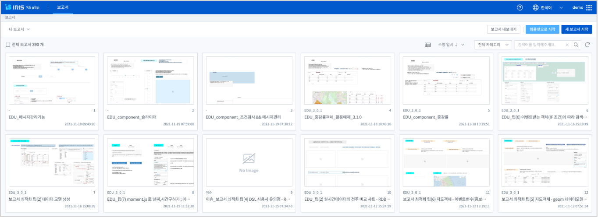
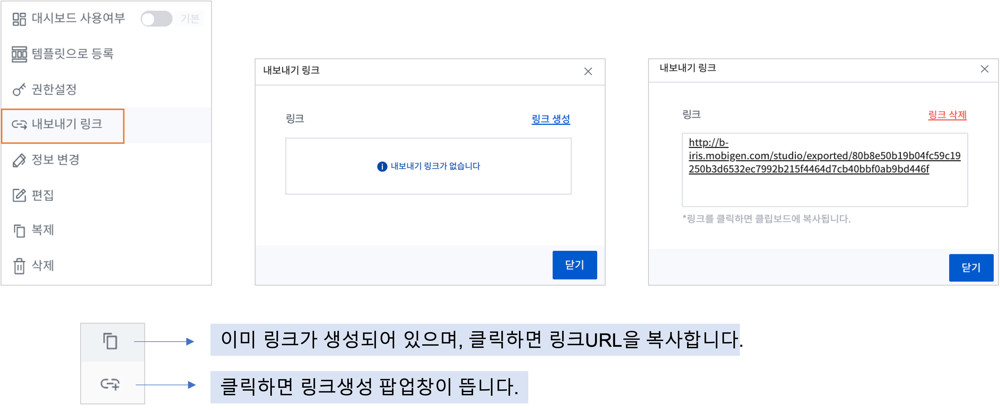
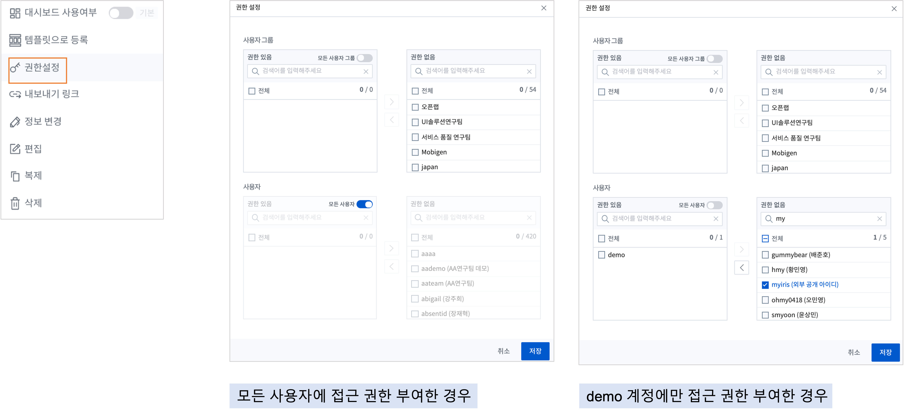
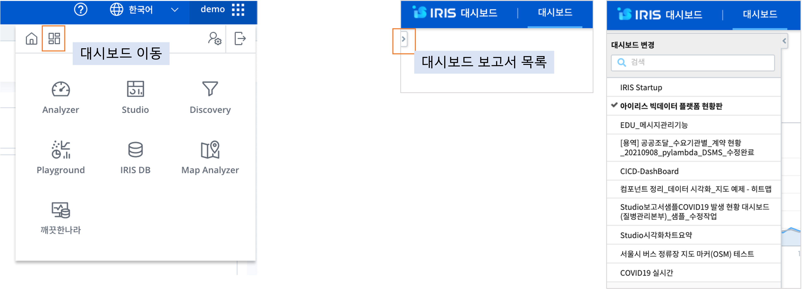
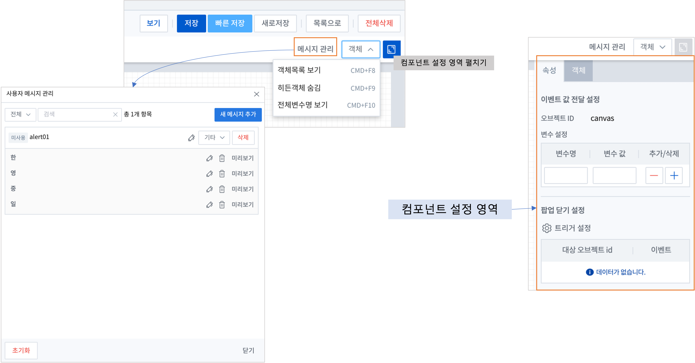

Studio 시작하기
============================================================================================

보고서 목록
------------------------------------------------------------------------

로그인 후 오른쪽 상단의 계정 부분에 마우스를 대면 보고서(Studio) 메뉴를 선택할 수 있습니다.

.. image:: ./studio/images/studio_list/studio_list01.png
    :scale: 50%
    :alt: IRIS메뉴

- 보고서 목록 

.. code-block:: none

    - 보고서 목록은 "리스트뷰", "썸네일뷰" 형태로 제공합니다.

    - 목록에 표시되는 보고서는 ``내 보고서`` , ``권한이 허용된 보고서``  로 구분합니다.
        - 내 보고서 : 로그인 계정으로 생성한 보고서
        - 권한이 허용된 보고서 : 다른 계정으로 생성된 보고서 중 내 계정에 접근 권한이 허용된 보고서

    - 선택한 보고서의 세부 기능 목록이 콤보박스 형태로 표시됩니다. 
      소유자가 만든 보고서인 경우는 정보 변경, 수정, 복제, 삭제의 기능이 제공됩니다. 
      다른 소유자의 보고서가 접근 권한에 의해 공유된 경우에는 ``복제`` 기능만 제공되며, 복제한 보고서에 대해서만 편집 권한이 생깁니다.

        - 대시보드 사용여부 : 해당 보고서를 대시보드 선택 대상에 포함합니다.
        - 탬플릿으로 등록 : 템플릿 목록으로 따로 표시가 됩니다.
        - 권한설정 : 사용자 별로 권한을 추가 하거나 그룹 단위의 권한 설정을 할 수 있습니다.
        - 내보내기 링크 : 링크 생성 및 삭제 팝업창이 뜹니다.
        - 정보변경 : 보고서의 카테고리 및 이름을 변경합니다
        - 편집 : 선택한 보고서를 편집 화면에서 생성 및 수정할 수 있습니다.
        - 복제 : 해당 보고서 이름 뒤에 번호가 붙은 이름으로 동일한 보고서가 복사되어 생성됩니다.
        - 삭제 : 선택한 보고서를 목록에서 뿐만이 아니라 내부 저장소(DB) 등에서 삭제하는 기능입니다. 

  

- 카테고리 관리(관리자 권한)

.. code-block:: none

    생성한 보고서는 지정되어 있는 카테고리내에서 지정하여 저장할 수 있습니다.
    카테고리는 지정하지 않아도 됩니다.
    관리자는 "카테고리 관리" 에서 카테고리를 추가/삭제/수정 할 수 있습니다.

- 보고서 내보내기

.. code-block:: none

    보고서 목록에 나온 보고서들을 json 파일로 local PC 로 내보낼 수 있는 기능입니다.
    다른 IRIS Studio 에서 이 json 파일을 "보고서 가져오기" 로 load 할 수 있습니다.
    
    (주의)
    목록에 나온 보고서를 전부 json 파일 1개로 생성하니, 내보내기를 실행할 보고서만을 필터링하여 목록에서 표시한 후에 실행합니다.

- 보고서 가져오기 (관리자기능)

.. code-block:: none

    "보고서 내보내기" 를 통해 저장된 json 파일을 IRIS Studio 로 가져오는 기능입니다.
    보고서에서 사용한 데이터, 데이터모델, 파일, 연결정보 등이 동일하게 있고, IRIS 버전이 같다면 원본과 동일한 보고서가 생성됩니다.
    
    
- 템플릿으로 시작

.. code-block:: none

    템플릿 보고서를 생성, 관리할 수 있습니다.
    동일한 템플릿으로 여러 보고서를 생성해야 할 때는 템플릿 보고서를 생성해 두고 보고서 제작을 하는 것이 효율적입니다.
 
- 새 보고서 시작

.. code-block:: none

    신규 보고서를 생성, 편집 할 수 있도록 보고서 편집 화면으로 진입합니다. 

    
- 링크

.. code-block:: none

   해당 보고서의 내보내기 URL 링크를 생성 할 수 있습니다. 
   링크 아이콘을 클릭하여 생성하거나 보고서 세부 설정에서 "내보내기 링크" 를 클릭하면 링크생성 팝업이 뜹니다.
   링크 관련 팝업창에서 링크 생성, 링크 삭제를 할 수 있습니다. 

- 권한설정

.. code-block:: none

   해당 보고서의 사용자 권한을 지정 할 수 있습니다. 
   사용자 별로 권한을 추가 하거나 그룹 단위의 권한 설정을 할 수 있습니다. 

- 대시보드 사용여부

.. code-block:: none

    - 선택한 보고서의 세부 설정 콤보박스에서 ``대시보드 사용여부`` 의 핸들을 오른쪽으로 밀어서 대시보드 사용으로 설정합니다.
    - 옆의 ``기본`` 버튼을 클릭하면 대시보드 메뉴에서 기본으로 보이는 보고서로 채택됩니다. 
      만약 이미 기본 채택된 보고서가 있다면 보고서를 변경할 지 묻는 팝업창이 뜹니다.
      
    - 대시보드 확인은 화면 우측 상단에서 대시보드 이동 아이콘을 클릭하여 진입합니다.
      
     

보고서 진입
---------------------------------------------------------------------------------------

보고서 목록 화면에서 ``새 보고서 시작`` 버튼을 눌러 새 보고서 생성을 하거나, 각각의 보고서 세부기능 목록(리스트뷰에서는 제일 우측 점 3개/썸네일뷰는 보고서 우측 상단 점 3개) 아이콘에서  ``편집`` 을 선택합니다.

.. code-block:: none

    - 보기
        - 편집한 보고서를 미리 보기 하는 버튼입니다.
    - 저장
        - 카테고리와 보고서 이름을 설정하여 저장할 수 있는 팝업창이 뜹니다.
    - 빠른 저장
        - 이미 설정되어 있는 보고서 이름과 카테고리 그대로 현재까지 편집한 상태를 저장합니다.
    - 새로저장
        - 현재까지 편집한 보고서를 복제 저장합니다.
    - 목록으로
        - 보고서 편집화면을 빠져 나와서 보고서 목록으로 돌아갑니다.
    - 전체삭제
        - 해당 보고서 편집화면에 생성되어 있는 모든 객체를 한꺼번에 삭제합니다. 편집화면에 객체가 1개라도 있을 때 활성화됩니다. 

 
.. code-block:: none
 
    - 메시지 관리
        - Studio에서 사용되는 각종 양식에 사용자 정의 메시지를 설정하고 관리할 수 있는 기능입니다.  
        - 하나의 메시지 키에 다국어 지정 가능 
        - 보고서 별로 메시지를 저장/관리 할 수 있음
        - 메세지 본문에도 변수 지정이 가능하여 문자와 입력값 조합으로 메시지 표현 가능 
        - 성공/실패/기타 와 같은 메시지 유형을 설정 할 수 있음
    - 객체 콤보박스 
        - 객체목록 보기 : 편집화면에 있는 모든 객체의 목록과 트리거 설정정보를 확인하고 객체를 선택하여 삭제할 수 있습니다.
        - 히든객체 숨김/보기 : 데이터객체, 텍스트변환 객체 등 편집화면에는 보이지만, 보고서 보기 화면에는 보이지 않는 객체를 숨김/보기 로 선택할 수 있습니다.
        - 전체변수명 보기 : 편집화면에 사용된 객체의 오브젝트 이름과 변수이름을 확인하고, 현재 상태에서 변수에 저장된 값을 확인할 수 있습니다.
    - 컴포넌트 설정영역 펼치기
        - Studio 컴포넌트를 선택하면 편집화면 우측에 보이는 설정 영역을 보이게 하거나 접을 수 있습니다.

      

캔버스 (Canvas)
------------------------------------------------------------------------------------------------------

보고서 편집 화면에서 각 객체가 올라가는 곳이 바로 격자무늬 바탕의 캔버스입니다. 객체가 아닌 바탕 부분을 클릭할 때 설정 패널은 캔버스와 캔버스의 옵션을 설정하는 패널이 됩니다.

.. code-block:: none

    - 속성
        - 이벤트값 전달 설정 : 보고서의 캔버스 변수를 설정하면 ``보고서 연결하기`` 로 연결되는 보고서와 공유하여 global 변수처럼 사용할 수 있습니다.
        - 팝업 닫기 설정 : 해당 보고서가 다른 보고서의 popup 보고서로 불려질 때 사용됩니다. 트리거 이벤트 발생시 해당 보고서를 close 합니다.
        
    - 객체
        - 캔버스 크기 : 보고서 캔버스의 크기를 콤보박스에서 선택할 수 있습니다.
        - 캔버스 색상 : 캔버스 영역의 색상과 캔버스 바깥 영역의 색상(배경 색상 선택)을 변경합니다.
        - 보고서 제목 출력 : 실행화면에서 상단 보고서 제목을 같이 포함하여 보여 줄지 설정합니다.
        - 화면이미지 캡처기능 : 화면 이미지를 캡쳐하여 이미지 파일로 생성하는 기능의 사용 / 미사용

