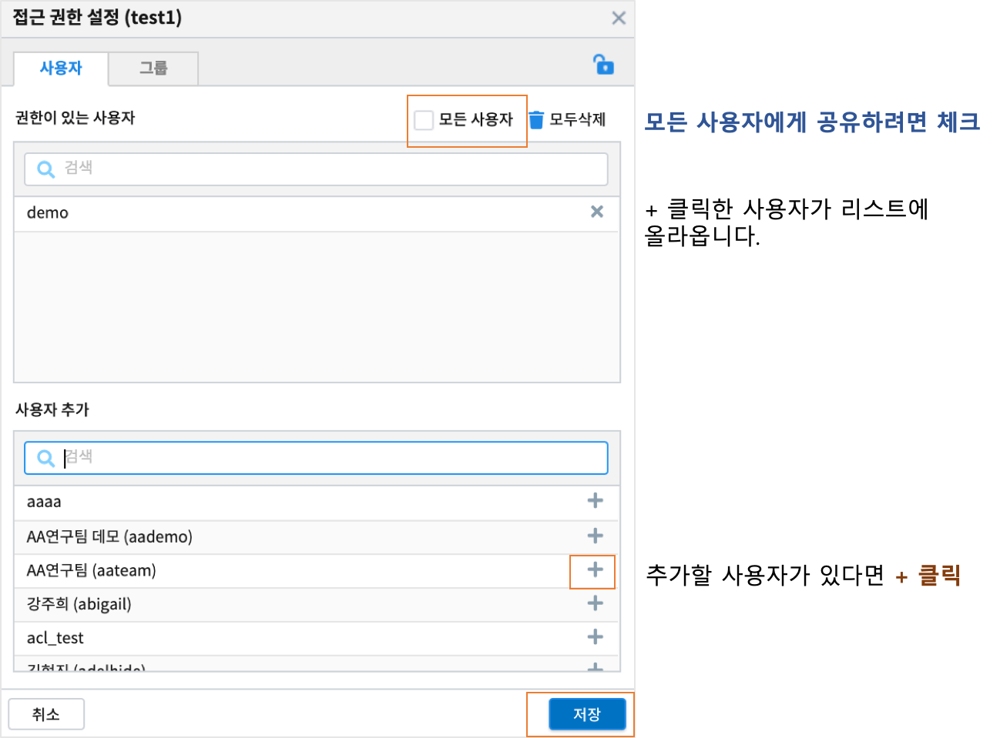
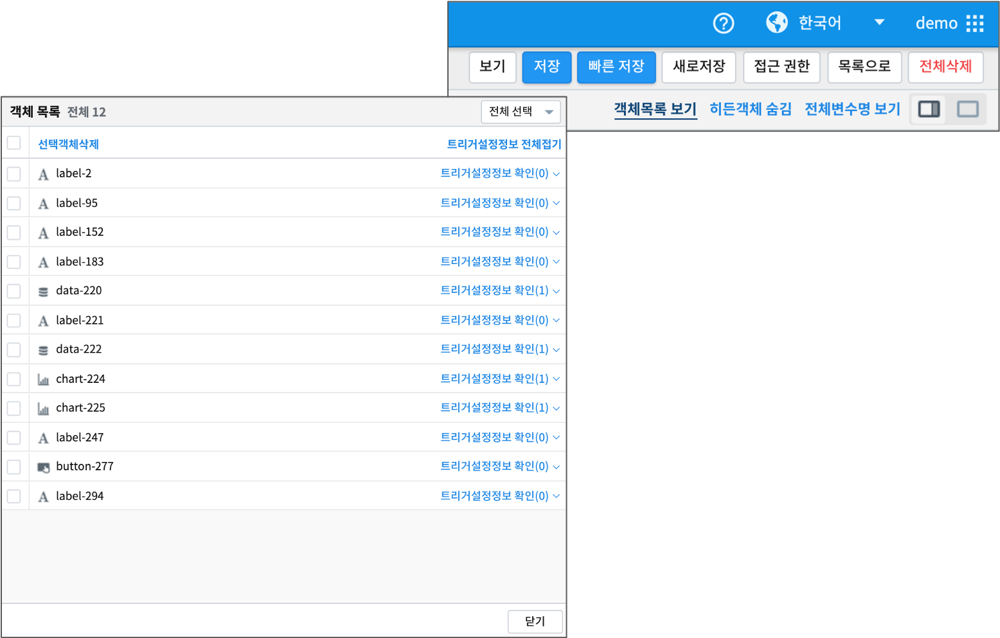
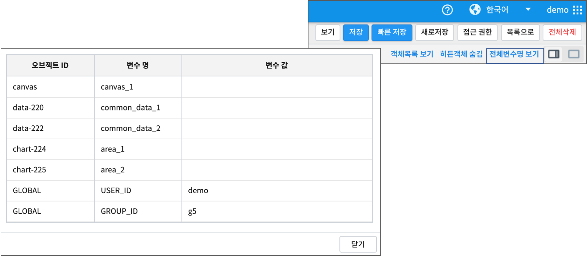
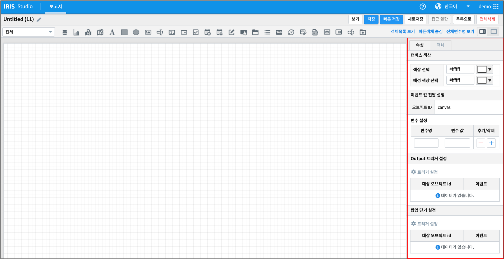
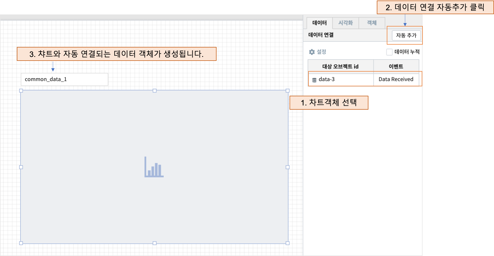
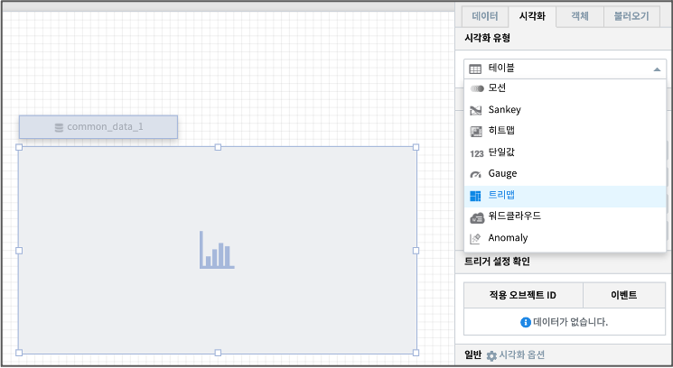
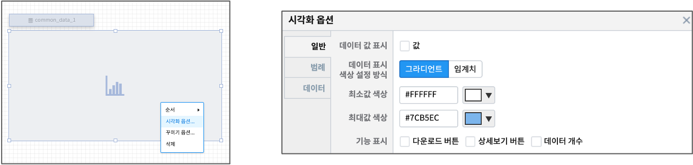
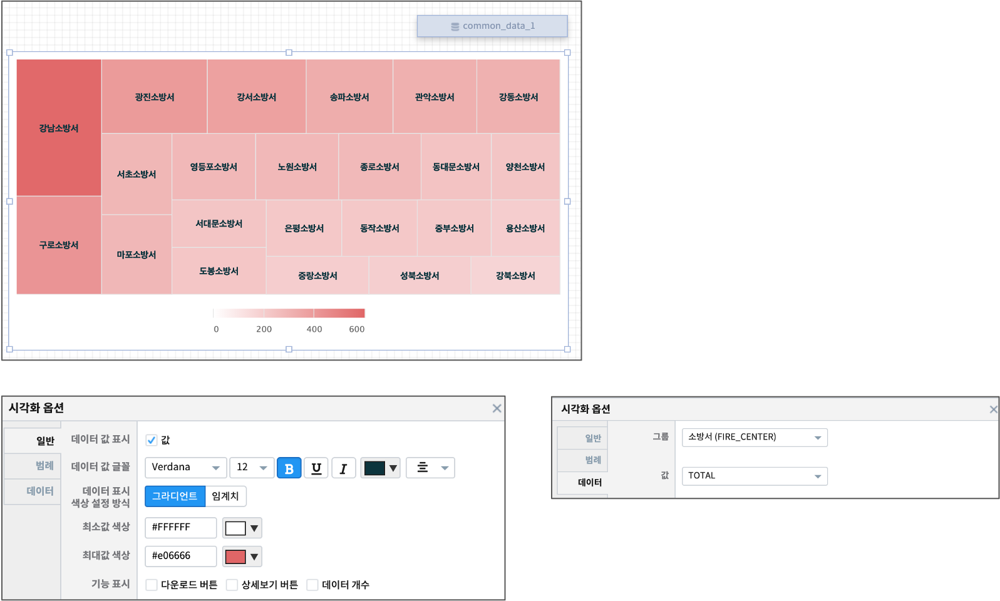

Studio 시작하기
============================================================================================

보고서 목록
------------------------------------------------------------------------

로그인 후 오른쪽 상단의 계정 부분에 마우스를 대면 보고서(Studio) 메뉴를 선택할 수 있습니다.

.. image:: ./studio/images/studio_list/studio_list01.png
    :scale: 50%
    :alt: IRIS메뉴

- 보고서 목록 화면

.. image:: ./studio/images/studio_list/studio_list02.png
    :alt: 보고서목록

- 카테고리

.. code-block:: none

    해당 보고서를 지정한 카테고리내에서 지정하여 저장할 수 있습니다.
    카테고리는 지정하지 않아도 됩니다.
    관리자는 "카테고리 관리" 에서 카테고리를 추가/삭제/수정 할 수 있습니다.

- 내보내기 URL

.. code-block:: none

   해당 보고서의 내보내기 URL을 생성 할 수 있습니다. 
   "생성" 을 클릭하여 내보내기 URL 을 생성하면 "관리" 로  바뀝니다.
   생성된 내보내기 URL은 관리기능을 통하여 복사, 보기(내보내기 URL 보기), 삭제를 할 수 있습니다. 

.. image:: ./studio/images/studio_list/studio_list03.png
    :scale: 60%
    :alt: 내보내기URL

- 편집

.. code-block:: none

   선택한 보고서를 편집 할 수 있는 기능 목록이 콤보박스 형태로 표시됩니다.
   소유자가 만든 보고서인 경우는 정보 변경, 수정, 복제, 삭제의 기능이 제공됩니다. 
   다른 소유자의 보고서가 접근 권한에 의해 공유된 경우에는 ``복제`` 기능만 제공되며, 복제한 보고서에 대해서만 편집 권한이 생깁니다.
   
   - 정보 변경 : 보고서의 카테고리 및 이름을 변경합니다.
   - 수정 : 선택한 보고서를 편집 화면에서 수정할 수 있습니다.
   - 복제 : 해당 보고서 이름 뒤에 번호가 붙은 이름으로 동일한 보고서가 복사되어 생성됩니다.
   - 삭제 : 선택한 보고서를 목록에서 뿐만이 아니라 내부 저장소(DB) 등에서 삭제하는 기능입니다. 

- 접근권한

.. code-block:: none

   해당 보고서의 사용자 권한을 지정 할 수 있습니다. 
   사용자 별로 권한을 추가 하거나 그룹 단위의 권한 설정을 할 수 있습니다. 

- 대시보드
    - 해당 보고서의 대시보드에서의 사용여부를 선택 할 수 있습니다.
 
.. image:: ./studio/images/studio_list/studio_list06.jpg
    :scale: 60%
    :alt: 대시보드

``대시보드를 선택하면 메인 메뉴의 "대시보드" 에서 리스트에 추가됩니다.``

.. image:: ./studio/images/studio_list/new_studio_list11.png
    :scale: 40%
    :alt: 대시보드

- 새보고서

오른쪽 상단 ``새보고서``  버튼 클릭 시, 보고서를 생성, 편집 할 수 있는 화면이 출력 됩니다. 

.. image:: ./studio/images/studio_list/studio_list07.jpg
    :scale: 100 %
    :alt: 새보고서

보고서 진입
---------------------------------------------------------------------------------------

보고서 목록에서 ``새 보고서`` 버튼을 눌러 새 보고서 생성을 하거나, 보고서 목록에서 보고서 ``편집`` - ``수정`` 으로 보고서 편집화면으로 들어 갈 수 있습니다.

보고서 편집화면의 오른쪽 상단의 버튼인 ``보기`` , ``저장`` , ``빠른 저장`` , ``새로저장`` , ``접근 권한`` , ``목록으로`` , ``전체삭제`` 은 편집한 보고서를 미리보기, 저장, 권한 설정, 보고서 목록으로 돌아가기 등을 실행하는 버튼입니다.

그 아래에 해당 보고서에 생성되어 있는 데이터객체, 챠트 객체 등 전체 ``객체목록 보기`` , 편집화면에서만 보이는 데이터객체, 텍스트변환 객체 같은 히든 객체를 편집화면에서 보이지 않도록 하는 ``히든객체 숨김`` , 편집 보고서에서 설정되어 있는 모든 변수와 값을 볼 수 있는 ``전체변수명 보기`` 를 클릭해서 볼 수 있습니다.

- 보기
    - 편집한 보고서를 미리 보기 하는 버튼입니다.
- 저장
    - 카테고리와 보고서 이름을 설정하여 저장할 수 있는 팝업창 뜹니다.
- 빠른 저장
    - 이미 설정되어 있는 보고서 이름과 카테고리 그대로 현재까지 편집한 상태를 저장합니다.
- 새로저장
    - 현재까지 편집한 보고서를 복제 저장합니다.
- 접근 권한
    - 해당 보고서를 특정 사용자, 그룹에게 복제, 편집할 수 있는 접근 권한을 줄 수 있게 설정합니다.
- 목록으로
    - 보고서 편집화면을 빠져 나와서 보고서 목록으로 돌아갑니다.
- 전체삭제
    - 해당 보고서 편집화면에 생성되어 있는 모든 객체를 한꺼번에 삭제합니다.

 

- 객체목록 보기
    - 보고서에 생성되어 있는 전체 객체의 목록과 객체에 설정된 트리거정보를 같이 확인할 수 있습니다.
- 히든객체 숨김
    - 데이터객체, 보고서 연결하기객체, 텍스트변환 객체 등 ``보고서 보기`` 에서는 보이지 않고 편집화면에서만 보이는 객체인 히든 객체를 숨기는 버튼입니다.
- 전체변수명 보기
    - 보고서에 설정된 모든 변수와 현재 시점에 저장된 값을 볼 수 있습니다.

   
보고서의 왼쪽 상단 연필(수정) 버튼 클릭 시, 보고서 명을 수정할 수 있도록 수정 기능이 활성화 됩니다. 
원하는 보고서 명으로 수정 후 체크버튼 클릭하면 변경된 보고서 명이 적용됩니다. 
        

      

캔버스 (Canvas)
------------------------------------------------------------------------------------------------------

보고서 편집 화면에서 각 객체가 올라가는 곳이 바로 바탕인 캔버스입니다. 객체가 없는 바탕을 클릭하면 왼쪽의 설절 패널은 캔버스와 캔버스의 옵션을 설정하는 패널입니다.

- 속성
    - 캔버스 색상 : 캔버스 영역의 색상과 캔버스 바깥 영역의 색상(배경 색상 선택)을 변경합니다.
    - 변수 설정 : 보고서의 캔버스 변수를 설정하면 ``보고서 연결하기`` 로 연결되는 보고서와 공유하여 global 변수처럼 사용할 수 있습니다.
    - output 트리거 설정 : ``변수 설정`` 으로 global 변수로 설정된 값을 ``보고서 연결하기`` 로 연결된 다른 보고서로 보낼 때의 트리거 조건 설정입니다.
    - 팝업 닫기 설정 : 해당 보고서가 다른 보고서의 popup 보고서로 불려질 때 사용됩니다. 트리거 이벤트 발생시 해당 보고서를 close 합니다. 

- 객체
    - 캔버스 크기 : 보고서 캔버스의 크기를 콤보박스에서 선택할 수 있습니다.
    - 보고서 제목 출력 : 해당 보고서를 ``보고서 연결하기`` 를 통해 open 할 때 상단 보고서 제목을 같이 포함하여 보여 줄지 설정합니다.
    - 화면이미지 캡처기능 : 화면 이미지를 캡쳐하여 이미지 파일로 생성하는 기능의 사용 / 미사용
  

예제 : 데이터 객체와 챠트 그리기
------------------------------------------------------------------------------------------------------

< 순서 >

- 객체 툴바에서 ``데이터객체`` 를 선택하여 마우스로 캔버스에 draw 하면  ``common_data_1`` 라는 이름의 변수로 데이터 객체가 생성됩니다.
- 챠트 객체를 캔버스에 그립니다. 챠트시각화 유형은 default 로  ``테이블``  이 설정되어 있습니다.
- 챠트객체의 **데이터연결** 의 **설정** 을 클릭한 후 연결할 데이터객체를 캔버스에서 체크합니다.
    - 팁) 1 ~ 3 을 한꺼번에 처리하기 : 챠트 객체를 먼저 그리고, 오른쪽 설정 패널에서 ``자동추가``  를 클릭하면 챠트와 바로 연결되는 데이터객체가 생성됩니다.

.. image:: ./studio/images/data_61.png
    :scale: 40%
    :alt: studio data 61

- 데이터객체를 선택한 후 데이터 설정 작업을 시작합니다.
    - 데이터 탭에서 `데이터 유형 설정 <http://docs.iris.tools/manual/IRIS-Manual/IRIS-Studio/data_visualize.html#id1>`__ 을 합니다.
    - `캐시 설정 <http://docs.iris.tools/manual/IRIS-Manual/IRIS-Studio/data.html#id6>`__ 은 default 가 미사용입니다. 
       만약 해당 보고서가 여러 사람들이 빈번하게 열어보는 보고서라면 가져온 데이터를 캐시에 저장하여 빠르게 챠트를 보여줄 수 있습니다.
       또 같은 보고서에서 여러 개의 챠트에서 같이 사용한다면 캐시를 사용합니다. 
       예제에서는 같은 데이터를 2개의 챠트에 출력하므로 **사용** 을 설정합니다.

- 검색어를 통해 최종적으로 가져오는 `데이터의 개수 제한 <http://docs.iris.tools/manual/IRIS-Manual/IRIS-Studio/data.html#limit>`__ 을 설정합니다.
- **실행** 을 클릭합니다.

.. image:: ./studio/images/data_62.png
    :scale: 60%
    :alt: studio data 62

- 연결된 테이블 객체에 데이터가 출력됩니다. 
- 테이블을 선택한 후, 오른 쪽 챠트객체 설정 패널에서 ``시각화`` 탭을 클릭합니다.
    - 그려야 할 시각화유형으로 ``트리맵`` 으로 선택합니다.

- 챠트객체를 선택하고 마우스 우클릭하거나, 오른쪽 설정 패널에서 ``시각화`` 탭의 ``일반 - 시각화옵션`` 을 클릭하면 시각화옵션 팝업창이 뜹니다.

- 시각화옵션 팝업창에서 ``일반`` 탭에서 색상선택을 하고, ``데이터`` 탭에서 ``그룹`` , ``값``에 해당하는 컬럼을 선택합니다.
- **실행** 버튼을 다시 누르면 시각화유형에서 선택한 트리맵이 그려집니다.

