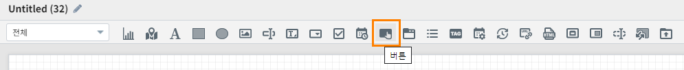
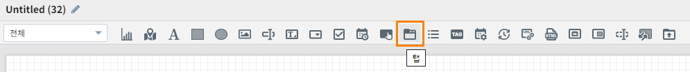
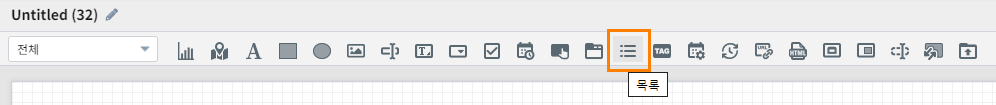
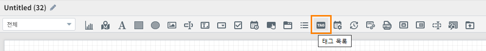
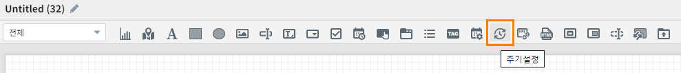

===============================================================
제어 (Control) 객체
===============================================================

| 사용자로부터 동작을 입력받아 다른 객체를 제어하기 위한 객체입니다.
| 이벤트 트리거 방식으로 다른 객체의 동작을 제어할 수 있습니다.

.. contents::
    :backlinks: top

-------------------------------------------------------------------------
버튼 (Button)
-------------------------------------------------------------------------

| 사용자가 버튼명 문구를 설정할 수 있고, 버튼을 클릭하여 이벤트 트리거/하이퍼링크 기능을 설정 할 수 있습니다.

''''''''''''''''''''''''''''''''''''
속성
''''''''''''''''''''''''''''''''''''

| 버튼의 시각화 방법 등에 대한 설정을 할 수 있습니다.

............................................................................
이벤트 값 전달 설정
............................................................................

| 해당 객체의 값을 참조하고자 할 때 사용하는 내용이 표시됩니다.

.. csv-table::
    :header: 옵션 명, 설명

    오브젝트 ID, 해당 객체의 고유 아이디로 자동으로 할당됩니다.
    변수 명, 해당 객체를 사용하기 위한 변수명으로 사용자가 지정할 수 있습니다.

.. image:: ./studio/images/common/event_01.png
    :scale: 100 %
    :alt: 이벤트값 전달 설정

.......................................................................
버튼 문구 입력
.........................................................................

| 버튼에 적용할 문자를 입력 할 수 있습니다.

.. image:: ./studio/images/button/button_01.png
  :width: 270
  :alt: 버튼 문구 입력

................................................................
링크 설정
.................................................................

**하이퍼링크**

| 하이퍼링크를 버튼에 설정 할 수 있습니다.

.. image:: ./studio/images/button/button_02.png
  :width: 270
  :alt: 버튼 하이퍼링크 설정

.. csv-table::
    :header: "항목", "설명"

    "주소", "하이퍼링크 주소를 입력 합니다."
    "타겟", "하이퍼링크 타겟은 self, blank로 설정 할 수 있습니다."

**윈도우팝업**

| 보완 예정입니다.

....................................................................
트리거 설정 확인
....................................................................

| 다른 객체의 내용을 참고하시기 바랍니다.

----------------------------------------------------------------------------------
탭 (Tab)
----------------------------------------------------------------------------------

| 보고서에 탭을 1개 이상 추가 할 수 있고, 탭 방향 및 해당 탭이 선택되었을 때 나타날 비주얼 객체를 설정할 수 있습니다.

''''''''''''''''''''''''''''''''''''''''''''''
데이터
''''''''''''''''''''''''''''''''''''''''''''''

| 탭 목록의 데이터 유형을 설정합니다.

..........................................................................................
데이터 유형 설정
..........................................................................................

| 데이터 목록을 작성 할 수 있고, 1개 이상의 목록을 작성 할 경우, 추가 버튼을 클릭하여 데이터를 추가 할 수 있습니다.

.. image:: ./studio/images/tab/tab_01.png
  :width: 270
  :alt: 데이터 유형 설정 탭 추가

.. csv-table::
    :header: "항목", "설명"

    "탭 이름", "표시될 탭이름을 입력 합니다."
    "탭 값", "탭 값을 입력 합니다."

''''''''''''''''''''''''''''''''''''''''''''''''''''''
속성
''''''''''''''''''''''''''''''''''''''''''''''''''''''

| 탭의 스타일이나 시각화 방법 등에 대한 설정을 할 수 있습니다.

..............................................
탭 방향
..............................................

| 탭의 정렬 방향을 설정합니다.

.. image:: ./studio/images/tab/tab_07.png
  :width: 270
  :alt: 탭 정렬 방향

............................................................................
이벤트 값 전달 설정
............................................................................

| 해당 객체의 값을 참조하고자 할 때 사용하는 내용이 표시됩니다.

.. csv-table::
    :header: 옵션 명, 설명

    오브젝트 ID, 해당 객체의 고유 아이디로 자동으로 할당됩니다.
    변수 명, 해당 객체를 사용하기 위한 변수명으로 사용자가 지정할 수 있습니다.

.. image:: ./studio/images/common/event_01.png
    :scale: 100 %
    :alt: 이벤트값 전달 설정

........................................................
적용 대상
........................................................

| 데이터 유형에서 설정한 탭 목록이 나타나며, 해당 항목의 아래방향 아이콘을 선택하여 표시 할 비주얼 객체를 설정 할 수 있습니다.

| 첫번째 탭 적용 대상 설정 입니다.

.. image:: ./studio/images/tab/tab_02.png
  :width: 270
  :alt: 첫번째 탭 적용 대상 설정

| 첫번째 탭 적용 대상 UI 입니다.

.. image:: ./studio/images/tab/tab_03.png
  :width: 270
  :alt: 첫번째 탭 적용 대상 UI

| 두번째 탭 적용 대상 설정 입니다.

.. image:: ./studio/images/tab/tab_04.png
  :width: 270
  :alt: 두번째 탭 적용 대상 설정

| 두번째 탭 적용 대상 UI 입니다.

.. image:: ./studio/images/tab/tab_05.png
  :width: 270
  :alt: 두번째 탭 적용 대상 UI

..........................................................
자동 전환
...........................................................

| 1개 이상의 탭이 설정된 경우, 탭이 자동으로 전환되도록 설정 할 수 있습니다.

.. image:: ./studio/images/tab/tab_06.png
  :width: 270
  :alt: 탭 자동 전환 설정

.. csv-table::
    :header: "항목", "설명"

    "사용 여부", "기본값은 미사용 입니다. 사용으로 선택 한 경우 탭이 자동 전환 됩니다."
    "사용 간격", "기본값은 1초 이며, 입력한 값의 초 단위로 탭이 자동 전환 됩니다."

------------------------------------------------------------------------------------------------------------------------------------
목록 (List)
------------------------------------------------------------------------------------------------------------------------------------

| 목록 객체는 검색, 선택 가능한 목록을 추가 할 수 있습니다.
| 리스트 제목 & 목록으로 나타날 데이터 필드를 설정하여 나타낼 수 있습니다.

''''''''''''''''''''''''''''''''''''''''''''''''''''''''''
데이터 설정
''''''''''''''''''''''''''''''''''''''''''''''''''''''''''
| 데이터 설정은 챠트의 데이터 설정을 참고하시기 바랍니다.

''''''''''''''''''''''''''''''''''''''''''''''''''''''''''''''''''''''''
시각화 설정
'''''''''''''''''''''''''''''''''''''''''''''''''''''''''''''''''''''''''
| 목록의 스타일이나 시각화 방법 등에 대한 설정을 할 수 있습니다.

....................................................................
리스트 제목
....................................................................

| 목록 제목을 입력하여 설정할 수 있습니다.

.. image:: ./studio/images/list/list_01.png
  :width: 270
  :alt: 리스트 제목

......................................................
필드 선택
......................................................

| '데이터'에서 조회한 필드를 선택하여, 화면에 나타날 필드를 설정 할 수 있습니다.

.. image:: ./studio/images/list/list_02.png
  :width: 270
  :alt: 리스트 필드 선택

''''''''''''''''''''''''''''''''''
객체
''''''''''''''''''''''''''''''''''

| 크기와 위치는 `객체 설정(공통)`_ 참조하시면 됩니다.

----------------------------------------------------------------------------------------------------------------------------------------------------------------
태그 목록 (Tag List)
----------------------------------------------------------------------------------------------------------------------------------------------------------------

| 태그 목록을 데이터 설정하여 시각화를 통해 목록을 표시 할 수 있습니다.

'''''''''''''''''''''''''''''''''''''''''''''''''''''''''
데이터 설정
''''''''''''''''''''''''''''''''''''''''''''''''''''''''''

| 데이터 설정은 챠트의 데이터 설정을 참고하시기 바랍니다.

........................................................
사용자 정의
........................................................

| 데이터 목록을 작성 할 수 있고, 1개 이상의 목록을 작성 할 경우, 추가 버튼을 클릭하여 데이터를 추가 할 수 있습니다.

.. image:: ./studio/images/combo/combo_01.png
  :width: 270
  :alt: 태그 목록 사용자 정의

.. csv-table::
    :header: "항목", "설명"

    "항목", "목록에 보여지는 텍스트 설정 입니다."
    "값", "항목(텍스트)에 대응되는 데이터 값 입니다."

''''''''''''''''''''''''''''
속성
''''''''''''''''''''''''''''

| 스타일이나 시각화 방법 등에 대한 설정을 할 수 있습니다.

..........................................................................
이벤트 값 전달 설정값
..........................................................................

| 이벤트 발생시 정의한 설정값을 전달 합니다.

.. image:: ./studio/images/tag_list/tag_list_01.png
  :width: 270
  :alt: 태그 목록 이벤트 값 전달 설정

.. csv-table::
    :header: "항목", "설명"

    "변수명", "오브젝트의 변수명 할당합니다."
    "구분자 입력", "태그 목록 데이터 구분자를 설정합니다."
    "텍스트 한정자", "태그 목록 데이터의 텍스트 한정자를 설정합니다. (예: ‘data1’, “data1”)"

..............................................................................
항목 배열 방향
..............................................................................

| 태그 목록 배열 방향을 설정 할 수 있습니다.

.. image:: ./studio/images/tag_list/tag_list_02.png
  :width: 270
  :alt: 태그 목록 항목 배열 방향

.. csv-table::
    :header: "항목", "설명"

    "가로", "가로 방향으로 정렬 합니다."
    "세로", "세로 방향으로 정렬 합니다."

.............................................................................................................
태그 목록의 선택기능 사용여부
............................................................................................................

| 태그 목록을 토글 형태로 선택할 수 있는 기능을 설정할 수 있습니다.

.. image:: ./studio/images/tag_list/tag_list_03.png
  :width: 270
  :alt: 태그 목록의 선택기능 사용여부

.. csv-table::
    :header: "항목", "설명"

    "사용", "기본값은 사용 입니다. 사용을 선택한 경우 태그 목록을 토글 형태로 선택할 수 있습니다."
    "미사용", "미사용 시 태그 목록을 토글 형태로 선택할 수 없습니다."

------------------------------------------------------------------------------------------------------------
주기설정 (Period Setting)
------------------------------------------------------------------------------------------------------------

| 보고서의 데이터 갱신 주기를 설정 할 수 있습니다.

'''''''''''''''''''''''''''''
데이터
'''''''''''''''''''''''''''''

| 주기/기본 설정을 할 수 있습니다.

.. image:: ./studio/images/period/period_01.png
  :width: 270
  :alt: 주기 설정

........................................................
주기 설정
........................................................

| 보고서 갱신 주기를 설정은 1개 이상 주기를 추가 해야 하며, 초/분/시간 단위로 추가 할 수 있습니다.

.. csv-table::
    :header: "항목", "설명"

    "다음 갱신까지 남은 시간 표시", "기본값은 미선택 입니다. 선택 시 다음 갱신까지 남은 시간이 시분초(00:00:00)로 표시 됩니다."
    "시간 입력", "초/분/시간 단위로 시간을 입력 할 수 있습니다."

.........................................................
기본 주기
..........................................................

| 주기 설정에서 추가한 주기 목록 중 기본 주기로 실행될 주기를 선택할 수 있습니다.

.. image:: ./studio/images/period/period_02.png
  :width: 236
  :alt: 주기 설정 UI

| 기본 주기로 설정한 항목이 표시되어 실행되며, 주기 설정에 추가한 다른 주기는 콤보박스로 선택할 수 있습니다.

.. image:: ./studio/images/period/period_03.png
  :width: 270
  :alt: 주기 설정 UI

''''''''''''''''''''''''''''''
객체
''''''''''''''''''''''''''''''

| 크기와 위치는 챠트의 객체를 참조하시기 바랍니다.

