===============================================================
제어 (Control) 객체
===============================================================

| 사용자로부터 동작을 입력받아 다른 객체를 제어하기 위한 객체입니다.
| 이벤트 트리거 방식으로 다른 객체의 동작을 제어할 수 있습니다.

-------------------------------------------------------------------------
버튼 (Button)
-------------------------------------------------------------------------

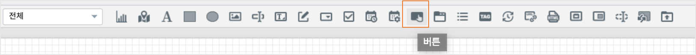

- 버튼 객체의 기능은 크게 2가지입니다.

  - 다른 객체의 트리거 이벤트의 대상으로서 버튼을 클릭하는 이벤트를 발생시킵니다.
  - 버튼을 클릭하면 설정된 링크 URL로 하이퍼링크 또는 윈도우팝업 형태로 연결됩니다.

|

''''''''''''''''''''''''''''''''''''
속성
''''''''''''''''''''''''''''''''''''

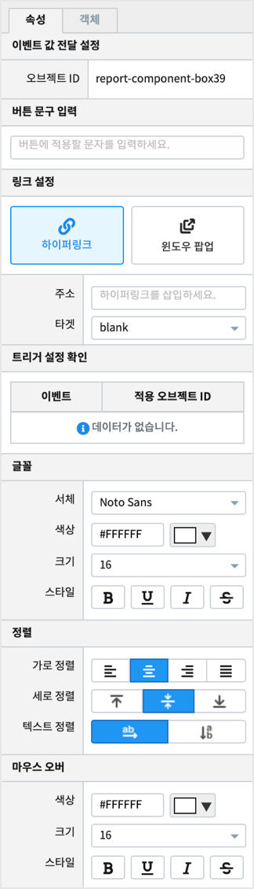

| 버튼 객체에 표시할 문구를 입력하고, 버튼 문구의 크기,색상,글꼴,마우스오버 시의 옵션 등을 설정합니다.
| 버튼을 클릭했을 때, 링크 이동 방법 및 URL 을 설정할 수 있습니다.
| 버튼의 배경 이미지를 적용할 수 있습니다.
|

- 이벤트 값 전달 설정

  - 버튼 객체의 오브젝트 ID 를 확인할 수 있습니다.
|

.. csv-table::
    :header: 옵션 명, 설명

    오브젝트 ID, 해당 객체의 고유 아이디로 자동으로 할당됩니다.

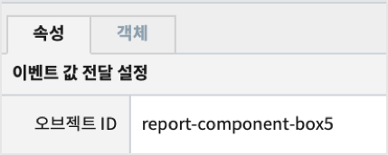

|

- 버튼 문구 입력

  - 버튼에 표시할 문자를 입력합니다.
|

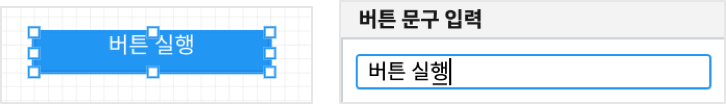

|

- 링크 설정

  - 버튼을 클릭할 때, 설정한 링크로 이동할 수 있는 이벤트를 설정할 수 있습니다. 링크로의 이동은 ``하이퍼링크`` 와 ``윈도우 팝업`` 2가지 방법에서 선택할 수 있습니다.

< 하이퍼링크 >

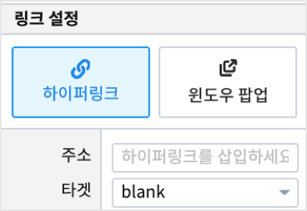

.. csv-table::
    :header: "항목", "설명"

    "주소", "하이퍼링크 주소를 입력 합니다."
    "타겟", "하이퍼링크 타겟은 self, blank(새 탭에서 열림)로 설정 할 수 있습니다."

|

< 윈도우팝업>

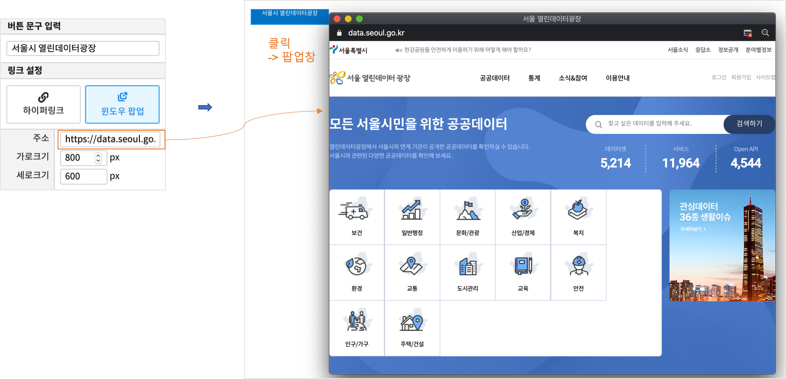

|

.. csv-table::
    :header: "항목", "설명"

    "주소", "윈도우팝업의 링크 주소를 입력 합니다."
    "가로크기", "윈도우팝업의 가로(픽셀딘위)"
    "세로크기", "윈도우팝업의 세로(픽셀딘위)"

|

- 트리거 설정 확인

  - 버튼 객체의 이벤트를 트리거로 설정한 객체의 목록을 확인합니다.
  - 자세한 것은 챠트의 `트리거 설정 확인 <http://docs.iris.tools/manual/IRIS-Manual/IRIS-Studio/data_visualize.html#id8>`__ 을 참고하시기 바랍니다.
|

- 글꼴 / 정렬 / 마우스 오버

  - 버튼 문구의 글꼴, 정렬과 마우스를 대었을 때 글자 색상, 크기, 스타일을 설정합니다. 

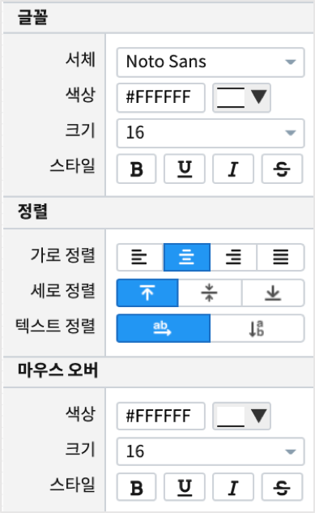

|

---------------------------------------------------------------------------------------------------
탭 (Tab)
---------------------------------------------------------------------------------------------------

.. image:: ./studio/images/tab/button-tab.png

| 보고서에 필터 및 선택 기능을 탭(tab) 객체로 구현할 수 있습니다.
| 탭(tab) 객체는 1개 이상 추가 할 수 있고, 탭 방향 및 해당 탭이 선택되었을 때 나타날 비주얼 객체를 설정할 수 있습니다.

''''''''''''''''''''''''''''''''''''''''''''''
데이터
''''''''''''''''''''''''''''''''''''''''''''''

| 탭 목록의 데이터 유형을 설정합니다.

- 데이터 유형 설정

  - 탭 목록을 작성 할 수 있고, 1개 이상의 목록을 작성 할 경우, ``탭추가``  버튼을 클릭하여 탭을 추가 할 수 있습니다.

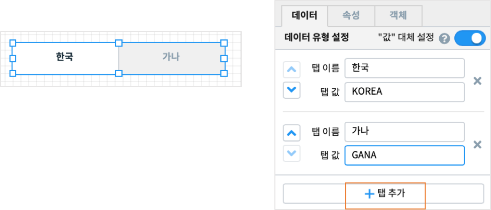

.. csv-table::
    :header: "항목", "설명"

    "탭 이름", "표시될 탭이름을 입력 합니다."
    "탭 값", "탭을 선택시 변수에 저장될 값을 입력 합니다."

|

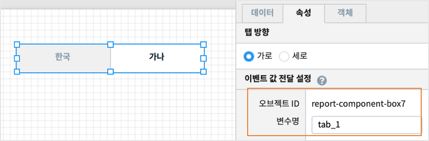

| 선택한 탭객체의 변수(속성의 이벤트 값 전달 설정에 나온 변수. 여기서는 ``tab_1`` 에 저장되는 값이 ``탭 값`` 에 해당합니다. 
|

- 값 대체 설정

  - ON 으로 켜면 "탭 값" 에 값을 넣지 않으면 자동적으로 "탭 이름" 과 같은 값이 지정됩니다.

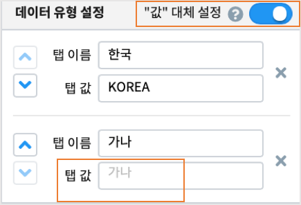

|

- 디폴트 값 선택

  - 탭을 클릭하기 전에 먼저 표시되는 탭을 디폴트로 지정할 수 있습니다.

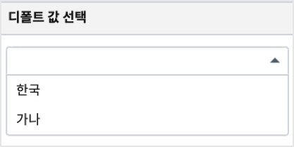

''''''''''''''''''''''''''''''''''''''''''''''''''''''
속성
''''''''''''''''''''''''''''''''''''''''''''''''''''''

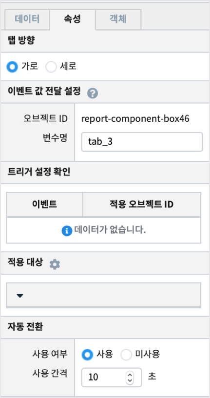

|

- 탭 방향

  - 탭의 정렬 방향을 설정합니다.

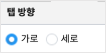

|

- 이벤트 값 전달 설정

  - 해당 객체의 값을 다른 객체에서 참조하고자 할 때 사용하는 내용이 표시됩니다.

.. csv-table::
    :header: 옵션 명, 설명

    오브젝트 ID, 해당 객체의 고유 아이디로 자동으로 할당됩니다.
    변수 명, 해당 객체를 사용하기 위한 변수명으로 사용자가 지정할 수 있습니다.

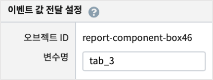

|

- 트리거 설정 확인

  - 챠트의 `트리거 설정 확인 <http://docs.iris.tools/manual/IRIS-Manual/IRIS-Studio/data_visualize.html#id8>`__ 을 참고하시기 바랍니다.

|

- 적용 대상

  - 데이터 유형에서 설정한 탭 목록이 나타나며, 해당 탭 선택시 적용되는 비주얼 객체를 각각 설정 할 수 있습니다.
  - 각각의 탭에 적용할 객체를 미리 만들어 둔 후에 사용합니다.

| 1. 적용대상 아이콘을 먼저 클릭하면 체크로 변경됩니다.
| 2. 보고서에서 적용 가능한 객체를 클릭하면 선택한 탭 아래로 선택한 객체이름이 표시됩니다. 
| 3. 보고서에서 그 다음 탭을 클릭하고 적용할 객체를 클릭하면 선택한 탭 아래로 선택한 객체이름이 표시됩니다.
| 4. `보고서 보기 <http://docs.iris.tools/manual/IRIS-Manual/IRIS-Studio/start.html#id11>`__  로 각각의 탭을 클릭했을 때 보여지는 객체를 확인합니다.
|

.. image:: ./studio/images/tab/studio_tab_24.png
  :alt:  적용 대상 설정

|

- 자동 전환

  - 1개 이상의 탭이 설정된 경우, 탭이 자동으로 설정된 사용 간격마다 전환되도록 설정합니다.

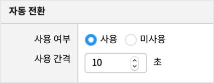

.. csv-table::
    :header: "항목", "설명"

    "사용 여부", "기본값은 미사용 입니다. 사용으로 선택 한 경우 탭이 자동 전환 됩니다."
    "사용 간격", "기본값은 1초 이며, 입력한 값의 초 단위로 탭이 자동 전환 됩니다."

'''''''''''''''''''''''''''''''''''''''''''''''''''''''''''''''''
객체
'''''''''''''''''''''''''''''''''''''''''''''''''''''''''''''''''

| 챠트의 `객체 설정 <http://docs.iris.tools/manual/IRIS-Manual/IRIS-Studio/data_visualize.html#id18>`__ 을 참조하시기 바랍니다.

|

------------------------------------------------------------------------------------------------------------------------------------
목록 (List)
------------------------------------------------------------------------------------------------------------------------------------

.. image:: ./studio/images/list/button-list.png

| 목록 객체는 검색, 선택이 가능한 목록을 보여줍니다.
| 목록(list) 으로 나타날 데이터 필드를 설정할 수 있으며, 이벤트값 전달 설정을 통해 선택한 목록의 값을 변수에 저장하여 다른 객체로 전달 할 수 있습니다.
|

''''''''''''''''''''''''''''''''''''''''''''''''''''''''''''''''''''''''''''''''''''''''''''''''''''''''''''''''''''
데이터 설정
''''''''''''''''''''''''''''''''''''''''''''''''''''''''''''''''''''''''''''''''''''''''''''''''''''''''''''''''''''

| 목록(list) 객체의 값은 챠트 객체처럼 데이터객체와 연결하여 가져옵니다.
| 목록 객체는 객체당 필드 1개를 표시할 수 있습니다.
| 데이터 설정은 챠트의 `데이터 설정 <http://docs.iris.tools/manual/IRIS-Manual/IRIS-Studio/data_visualize.html#id1>`__ 을 참고하시기 바랍니다.
|

''''''''''''''''''''''''''''''''''''''''''''''''''''''''''''''''''''''''''''''''''''''''''''''''''''''''''''''''''''''''''''''''''''''''''''''''
시각화 
''''''''''''''''''''''''''''''''''''''''''''''''''''''''''''''''''''''''''''''''''''''''''''''''''''''''''''''''''''''''''''''''''''''''''''''''

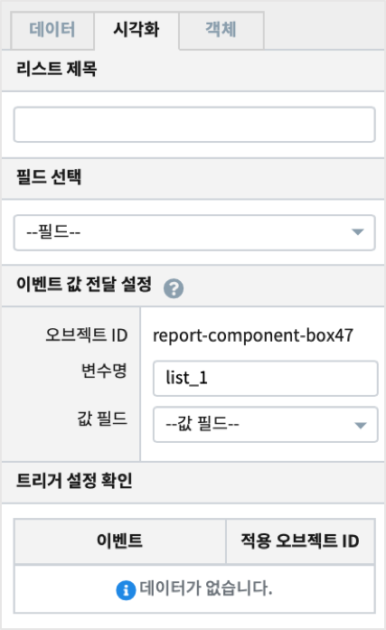

|

- 리스트 제목
    - 목록 제목을 입력하면 목록 상단에 표시됩니다.

|

- 필드 선택
    - 데이터객체에서 받은 필드중에서 목록에 표시할 필드를 선택합니다.

|

- 이벤트 값 전달 설정
    - 목록의 값을 이벤트로 전달하기 위해 변수에 저장합니다.
    - 데이터객체로부터 받은 필드중에서 선택할 수 있습니다. 즉 목록에 표시되는 필드도 가능하고, 다른 필드도 가능합니다.
  

.. csv-table::
    :header: 옵션 명, 설명

    "오브젝트 ID", "해당 객체의 고유 아이디로 자동으로 할당됩니다."
    "변수 명", "해당 객체를 사용하기 위한 변수명으로 사용자가 지정할 수 있습니다."
    "값 필드", "변수에 저장되어 이벤트 발생 시 전달될 데이터 필드 이름을 콤보박스에서 선택합니다."

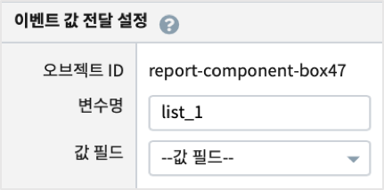

|

- 트리거 설정 확인

  - 챠트의 `트리거 설정 확인 <http://docs.iris.tools/manual/IRIS-Manual/IRIS-Studio/data_visualize.html#id8>`__ 을 참고하시기 바랍니다.
|

- 리스트 검색 기능
  - 화면에 표시되는 목록(list) 에서 검색 입력창을 표시할 지 여부를 설정합니다.
  
|

----------------------------------------------------------------------------------------------------------------------------------------------------------------
태그 목록 (Tag List)
----------------------------------------------------------------------------------------------------------------------------------------------------------------

.. image:: ./studio/images/tag_list/button-tag.png

| 태그 목록의 데이터는 데이터객체와 연결하여 가져오거나, 사용자가 항목과 값을 직접 입력할 수 있습니다.

''''''''''''''''''''''''''''''''''''''''''''''''''''''''''
데이터
''''''''''''''''''''''''''''''''''''''''''''''''''''''''''

| 태그목록에 표시되는 데이터를 설정하는 방법입니다.
| ``데이터 설정 방법`` 은 데이터객체와 연결하여 가져온 데이터, 사용자가 직접 입력한 항목과 값 중에서 설정합니다.
|

- 데이터 사용자 정의

.. csv-table::
    :header: "항목", "설명"

    "항목", "목록에 보여지는 텍스트 설정 입니다."
    "값", "항목(텍스트)에 대응되는 데이터 값 입니다."

''''''''''''''''''''''''''''''''''''''''''''''''''''''''
속성
''''''''''''''''''''''''''''''''''''''''''''''''''''''''

- 이벤트 값 전달 설정값

  - 이벤트 발생시 정의한 설정값을 전달하기 위해 변수를 지정하고, 전달하는 값이 텍스트일 때의 구분자 등 파라미터를 설정합니다.
|

.. image:: ./studio/images/tag_list/tag_list_01.png
  :width: 270
  :alt: 태그 목록 이벤트 값 전달 설정

|

.. csv-table::
    :header: "항목", "설명"

    "변수명", "오브젝트의 변수명 할당합니다."
    "구분자 입력", "태그 목록 데이터 구분자를 설정합니다."
    "텍스트 한정자", "태그 목록 데이터의 텍스트 한정자를 설정합니다. (예: ‘data1’, “data1”)"

- taglist_1 변수에 저장된 값 예시

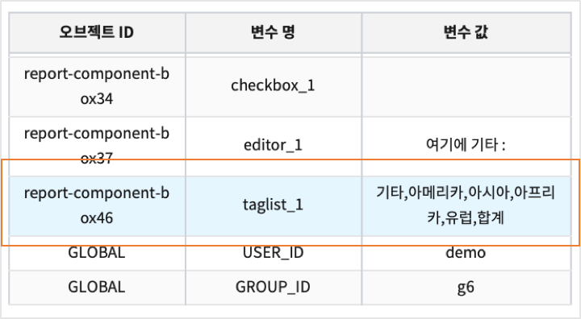

|

- 항목 배열 방향

  - 태그 목록 배열 방향을 가로, 세로 중에서 설정 할 수 있습니다.

.. csv-table::
    :header: "항목", "설명"

    "가로", "가로 방향으로 정렬 합니다."
    "세로", "세로 방향으로 정렬 합니다."

|

- 태그 목록의 선택기능 사용여부

  - 태그 목록을 선택할 수 있는 기능을 사용할 지 여부를 선택할 수 있습니다.

.. image:: ./studio/images/tag_list/tag_list_03.png
  :width: 270
  :alt: 태그 목록의 선택기능 사용여부

.. csv-table::
    :header: "항목", "설명"

    "사용", "디폴트는 사용 입니다. 사용을 선택한 경우 태그 목록을 토글 형태로 선택할 수 있습니다."
    "미사용", "미사용으로 설정하면 태그 값을 선택할 수 없습니다."

| 태그 목록의 선택기능을 사용으로 설정할 때의 예시

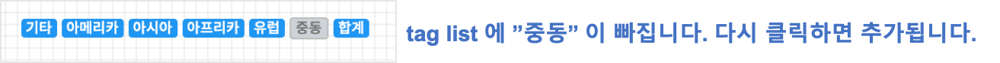

|

- 화면에 보여질 필드 선택

  - 데이터 설정 시 ``데이터`` 를 선택한 경우에, 태그 목록에 표시될 필드를 가져온 필드 중에서 선택합니다.

|

- 값으로 사용될 필드 선택

  - 데이터 설정 시 ``데이터`` 를 선택한 경우에, 태그 목록 변수의 값으로 사용되는 필드를 선택합니다.
  - ``전체 변수명 보기`` 에서 변수에 저장된 값을 확인할 수 있습니다. 

---------------------------------------------------------------------------------------------------------------------------
주기설정 (Period Setting)
---------------------------------------------------------------------------------------------------------------------------

.. image:: ./studio/images/period/button-period.png

| 보고서 내에서 주기적으로 이벤트를 실행하고자 할 때, 주기설정 객체를 트리거로 설정하여 이용합니다.

'''''''''''''''''''''''''''''
데이터
'''''''''''''''''''''''''''''

| 주기/기본 설정을 할 수 있습니다.

.. image:: ./studio/images/period/period_01.png
  :width: 270
  :alt: 주기 설정

........................................................
주기 설정
........................................................

| 보고서 갱신 주기 설정은 1개 이상 주기를 추가 해야 하며, 초/분/시간 단위로 추가 할 수 있습니다.

.. csv-table::
    :header: "항목", "설명"

    "다음 갱신까지 남은 시간 표시", "기본값은 미선택 입니다. 선택 시 다음 갱신까지 남은 시간이 시분초(00:00:00)로 표시 됩니다."
    "시간 입력", "초/분/시간 단위로 시간을 입력 할 수 있습니다."

..........................................................
기본 주기
..........................................................

| 주기 설정에서 추가한 주기 목록 중 기본 주기로 실행될 주기를 선택할 수 있습니다.

.. image:: ./studio/images/period/period_02.png
  :width: 236
  :alt: 주기 설정 UI

| 기본 주기로 설정한 항목이 표시되어 실행되며, 주기 설정에 추가한 다른 주기는 콤보박스로 선택할 수 있습니다.

.. image:: ./studio/images/period/period_03.png
  :width: 270
  :alt: 주기 설정 UI

..........................................................
타이머 초기 상태
..........................................................

| 보고서를 열었을 때, 주기설정 객체의 타이머가 바로 동작하도록 하려면 ``시작``, 중지 상태에서 실행 버튼을 누를 때 동작하도록 하려면 ``중지`` 를 체크합니다.

..........................................................
보기 화면 출력
..........................................................

| 주기설정 객체를 보고서 보기화면에서 보이도록 하려면 출력, 주기설정 객체를 안보이게 하려면 미출력을 선택합니다.

''''''''''''''''''''''''''''''
객체
''''''''''''''''''''''''''''''

| 크기와 위치는 챠트의 `객체 설정 <http://docs.iris.tools/manual/IRIS-Manual/IRIS-Studio/data_visualize.html#id18>`__ 을 참조하시기 바랍니다.
