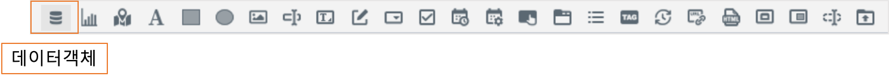
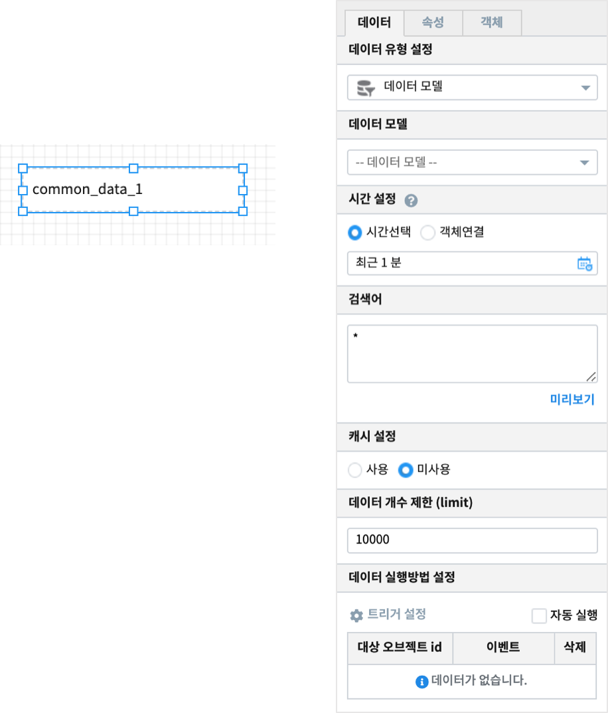
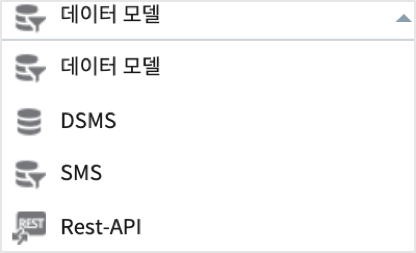
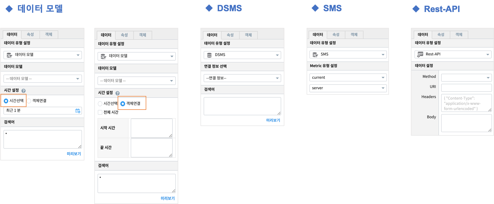
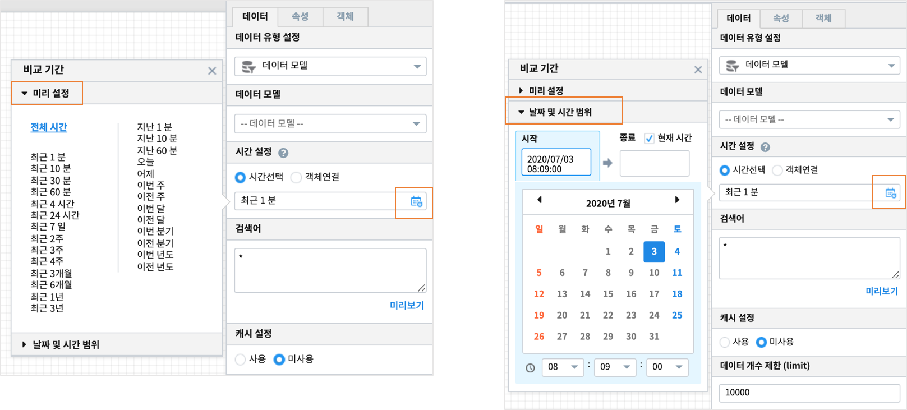
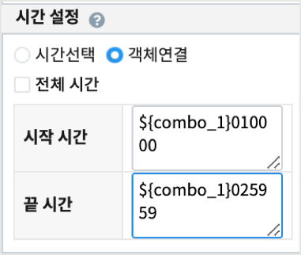
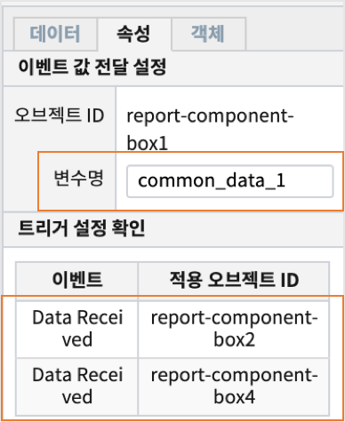

데이터 객체
========================================

| 데이터 객체는 Studio 의 Chart, List, Combo-box, Check&Radio, Tag-list, HTML-Viewer 에서 데이터를 설정하는 부분을 따로 분리하여 만든 서비스 객체입니다.
| 데이터 객체를 따로 생성하여 여러 개의 객체를 하나의 데이터 객체에 연결하여 동일한 데이터로 여러 객체를 구성할 수 있습니다.

| 데이터 객체는 hidden 객체이며, 디폴트 변수 이름으로 "common_data_{번호}"  로 생성됩니다.
| 예를 들면, 보고서에서 처음 생성하는 데이터 객체는 디폴트 변수명이 "common_data_1" 이 됩니다.

'''''''''''''''''''''''''''''''''''''''''''''''''''
데이터
'''''''''''''''''''''''''''''''''''''''''''''''''''

| 사용하고자 하는 데이터 유형을 설정합니다.

**데이터 유형 설정**

.. csv-table::
    :header: 데이터 유형, 설명
    :widths: 40, 150

    "데이터 모델", "DB의 데이터를 추상화한 데이터 묶음으로서 별도의 테이블처럼 사용할 수 있습니다."
    "DSMS", "Data Source Manager Service, 다양한 데이터에 대한 접근을 제공합니다."
    "SMS", "System Monitoring Service, 시스템 자원 현황에 대한 정보를 제공합니다."
    "REST API", "데이터를 REST 형식으로 사용할 수 있게 합니다."

**객체에 따라 특정 데이터 유형은 지원하지 않을 수도 있습니다.**

**데이터 유형별 선택옵션**

.. csv-table::
    :header: 데이터 유형, 선택옵션
    :widths: 40, 150

    데이터 모델, "데이터모델, 시간 설정, 검색어"
    DSMS, "연결정보, 검색어"
    SMS, Metric 유형 설정
    REST API, Restful API 선택

........................................................................................
데이터 모델
........................................................................................

| 미리 정의된 데이터 모델 중 하나를 선택합니다.

~~~~~~~~~~~~~~~~~~~~~~~~~~~~~~~~~~~~~~~~~~~~~~~~~~~~~~~~~~~~~~~~
시간 설정
~~~~~~~~~~~~~~~~~~~~~~~~~~~~~~~~~~~~~~~~~~~~~~~~~~~~~~~~~~~~~~~~

| 미리 설정된 시간 또는 사용자가 임의로 날짜 및 시간 범위를 지정합니다.

**객체연결**

| 시작/끝 시간 입력박스에 변수명을 입력합니다.
| 변수값은 YYYYMMDDHHmmss 형식의 값이어야 합니다.

| 변수 combo_1 이 YYYYMMDD 형식의 날짜가 지정되어 있는 경우에는 위의 그림처럼 HHmmss 의 시간을 붙여서 변수값을 지정합니다.

~~~~~~~~~~~~~~~~~~~~~~~~~~~~~~~~~~~~~~~~~~~~~~~~~~~~~~~~~~~~
검색어
~~~~~~~~~~~~~~~~~~~~~~~~~~~~~~~~~~~~~~~~~~~~~~~~~~~~~~~~~~~~

| 선택된 데이터 모델 또는 DSMS 의 연결정보의 질의에 사용될 검색어(query)를 입력합니다.
| 검색어에는 변수명이 ${*VAR*} 와 같이 포함될 수 있습니다.
| 예) ${text_area_1}
| 치환된 검색어는 **미리 보기** 기능으로 확인할수 있습니다.
|
| 사용되는 변수명은 각 **객체의 변수명 설정** 에서 확인할 수 있으며 **전체변수명 보기** 기능을 통해서도 확인할 수 있습니다.
| 변수 치환에 관한 문법은 `nunjucks <https://mozilla.github.io/nunjucks/>`_ 을 참조할 수 있습니다.
|
| 데이터모델 유형에서 사용하는 검색어 도움말 `Command Reference <http://docs.iris.tools/manual/IRIS-Manual/IRIS-Discovery-Middleware/command/index.html#command-references>`__ 을 참고하시기 바랍니다.

**검색어 입력**

.. image:: ./studio/images/common/data_tab_11.png
    :scale: 100 %
    :alt: 검색어 입력

**검색어 미리보기**

.. image:: ./studio/images/common/data_tab_12.png
    :scale: 100 %
    :alt: 검색어 미리 보기

**전체 변수명 보기**

.. image:: ./studio/images/common/data_tab_13.png
    :scale: 100 %
    :alt: 전체 변수명 보기

~~~~~~~~~~~~~~~~~~~~~~~~~~~~~~~~~~~~~~~~~~~~~~~~~~~~~~~~~~~~~~~~~~~~~~~~~~~~~~~~~~~~~~~~~~
캐시 설정
~~~~~~~~~~~~~~~~~~~~~~~~~~~~~~~~~~~~~~~~~~~~~~~~~~~~~~~~~~~~~~~~~~~~~~~~~~~~~~~~~~~~~~~~~~

| 미사용이 디폴트입니다.

*  캐시 사용이 효과적인 경우
    * 가져오는 데이터가 달라지지 않고, 해당 보고서에 여러 개의 시각화 객체와 데이터 개체가 있을 때
    * 가져오는 데이터가 달라지지 않고, 1개의 데이터 객체를 여러 개의 시각화 객체에서 사용하는 경우
  
- 콤보박스, 체크박스 등 선택되는 변수로 인해서 검색어 조건이 달라지면 가져오는 데이터가 달라집니다. 이 경우에는 캐시를 미사용으로 설정합니다. 

~~~~~~~~~~~~~~~~~~~~~~~~~~~~~~~~~~~~~~~~~~~~~~~~~~~~~~~~~~~~~~~~~~~~~~~~~~~~~~~~~~~~~~~~~~
데이터 개수 제한(limit)
~~~~~~~~~~~~~~~~~~~~~~~~~~~~~~~~~~~~~~~~~~~~~~~~~~~~~~~~~~~~~~~~~~~~~~~~~~~~~~~~~~~~~~~~~~

| 검색어를 통해서 가져오는 데이터의 개수 제한 설정입니다. 디폴트 설정 값 10000 
| 
| 너무 많은 데이터라 보고서 객체에 출력하면 속도가 느려질 수 있으므로, 정확한 결과보다 대략적인 시각화 표현을 하고자 할 때는 조절을 합니다.
| 가져오는 데이터의 양이 많다면 limit 값을 크게 설정해야 시각화 객체에 빠지는 것 없이 출력됩니다. 

~~~~~~~~~~~~~~~~~~~~~~~~~~~~~~~~~~~~~~~~~~~~~~~~~~~~~~~~~~~~~~~~~~~~~~~~~~~~~~~~~~~~~~~~~~
데이터 실행방법 설정
~~~~~~~~~~~~~~~~~~~~~~~~~~~~~~~~~~~~~~~~~~~~~~~~~~~~~~~~~~~~~~~~~~~~~~~~~~~~~~~~~~~~~~~~~~

| 자동 실행과 트리거 이벤트가 발생할 때 실행되는 방법이 있습니다.

.. image:: ./studio/images/common/trigger_01.png
    :scale: 100 %
    :alt: 데이터 실행 방법 설정

************************************************************************************************
자동실행
************************************************************************************************

| 해당 옵션을 체크하면 보고서 로딩 시 해당 객체가 실행됩니다.

.. image:: ./studio/images/common/trigger_02.png
    :scale: 100 %
    :alt: 자동실행

********************************************************************************************************************************
트리거 설정 (공통)
********************************************************************************************************************************
| 다른 객체로부터 이벤트를 수신하거나 해당 객체의 이벤트를 수신하는 객체를 확인할 수 있습니다.

**이벤트 객체 추가**

| 트리거 설정 버튼을 통해 이벤트를 수신하고자 하는 객체를 선택할 수 있습니다.
|
| 트리거 설정 버튼 클릭

.. image:: ./studio/images/common/trigger_03.png
    :scale: 100 %
    :alt: 트리거 설정 버튼 클릭

**트리거 객체 선택**

.. image:: ./studio/images/common/trigger_04.png
    :scale: 100 %
    :alt: 트리거 객체 선택

**트리거 설정 완료**

.. image:: ./studio/images/common/trigger_05.png
    :scale: 100 %
    :alt: 트리거 설정 완료

**이벤트 객체 삭제**

| 추가된 객체의 삭제(X) 버튼을 클릭하여 수신객체를 삭제할 수 있습니다.

.. image:: ./studio/images/common/trigger_06.png
    :scale: 100 %
    :alt: 트리거 이벤트 삭제

.................................
DSMS
.................................

~~~~~~~~~~~~~~~~~~~~~~~~~~~~~~~~~~~~~~~~~~~~~~~~~~~~~~~~~~~~~~~~~~~~~~~~~~~~~~~~~~~~~~~~~~~~~~~~~~~~~~~~~~~~~~~~~~~~
연결 정보 선택
~~~~~~~~~~~~~~~~~~~~~~~~~~~~~~~~~~~~~~~~~~~~~~~~~~~~~~~~~~~~~~~~~~~~~~~~~~~~~~~~~~~~~~~~~~~~~~~~~~~~~~~~~~~~~~~~~~~~

| IRIS, MySQL, Oracle DataBase, Postgre 등 다양한 유형의 데이터 소스를 제공합니다.
| 사용하고자 하는 데이터 소스 중 하나를 선택합니다.

.. image:: ./studio/images/common/data_tab_03.png
    :scale: 100 %
    :alt: 데이터 모델

~~~~~~~~~~~~~~~~~~~~~~~~~~~~~~~~~~~~~~~~~~~~~~~~~~~~~~~~~~~~~~~~~~~~~~~~~~~~~~~~~~~~~~~~~~~~~~~~~~~~~~~~~~~~~~~~~
검색어
~~~~~~~~~~~~~~~~~~~~~~~~~~~~~~~~~~~~~~~~~~~~~~~~~~~~~~~~~~~~~~~~~~~~~~~~~~~~~~~~~~~~~~~~~~~~~~~~~~~~~~~~~~~~~~~~~

| 선택한 데이터베이스의 SQL 을 입력합니다.
| SQL 안에 변수명을 넣어서 사용할 수 있습니다.

.............................
SMS
.............................

~~~~~~~~~~~~~~~~~~~~~~~~~~~~~~~~~~~~~~~~~~~~~~~~~~~~~~~~~~~~~~~~~~~~~~~~~~~~~~~~~~~~~~~~~~~~~~~~~~~~~~~~~~~~~~~~~~~~~~~~
Metric 유형 설정
~~~~~~~~~~~~~~~~~~~~~~~~~~~~~~~~~~~~~~~~~~~~~~~~~~~~~~~~~~~~~~~~~~~~~~~~~~~~~~~~~~~~~~~~~~~~~~~~~~~~~~~~~~~~~~~~~~~~~~~~

| API Type, Equipment type, Metric type, Metric Category, Agent 또는 사용자 정의 Agent 를 선택합니다.
| 각 Metric 유형별로 필요한 선택사항이 활성화됩니다.

.. csv-table::
    :header: API Type, 선택사항, 추가 선택사항

    current, "server, switch"
    resource, "resource", "시간 설정, 대상 Agent"
    alarm/history, "Equipment, Metric", "시간 설정, 대상 Agent"

**current** 를 선택한 경우

.. image:: ./studio/images/common/data_tab_04.png
    :scale: 100 %
    :alt: current 유형 설정

**resource** 를 선택한 경우

.. image:: ./studio/images/common/data_tab_05.png
    :scale: 100 %
    :alt: resource 유형 설정

**alarm/history** 를 선택한 경우

.. image:: ./studio/images/common/data_tab_06.png
    :scale: 100 %
    :alt: alarm/history 유형 설정

************************************************************************************************************
대상 Agent
************************************************************************************************************

| 설정된 Agent 또는 사용자 정의 Agent 를 선택합니다.
| 데이터를 수집하기 위해 별도의 Agent 가 설치되어 있으며 이를 통해 정보를 수집할수 있습니다.

**Agent 선택**

.. image:: ./studio/images/common/data_tab_09.png
    :scale: 100 %
    :alt: Agent 선택

**사용자 정의 Agent 선택**

.. image:: ./studio/images/common/data_tab_10.png
    :scale: 100 %
    :alt: 사용자 정의 Agent 선택

.................................
REST API
.................................

| 데이터로 Rest 를 사용할 수 있습니다.
| 보고서에 생성된 Restful API 객체를 선택할 수 있으며 별도의 화면이 제공됩니다.
| 트리거 설정 버튼을 이용하여 Restful API 객체를 선택/삭제 할 수 있습니다.
| 해당 객체의 사용법은 `RESTful API <http://docs.iris.tools/manual/IRIS-Manual/IRIS-Studio/special_etc.html#restful-api-rest-ful-api>`_ 을 참조하세요

.. image:: ./studio/images/common/data_tab_14.png
    :scale: 100 %
    :alt: Restful API 선택

''''''''''''''''''''''''''''''''''''''''''''''''''''
속성
''''''''''''''''''''''''''''''''''''''''''''''''''''

................................................................................................
이벤트 값 전달 설정
................................................................................................

| 해당 객체의 값을 참조하고자 할 때 사용하는 내용이 표시됩니다.

.. csv-table::
    :header: 옵션 명, 설명
    :widths: 40, 150

    오브젝트 ID, 해당 객체의 고유 아이디로 자동으로 할당됩니다.
    변수 명, 해당 객체를 사용하기 위한 변수명으로 사용자가 지정할 수 있습니다.

......................................................................
트리거 설정 확인
......................................................................

| 해당 객체의 이벤트를 수신하는 객체를 확인합니다.
| 확인만 가능하며 해당 객체의 삭제는 수신대상 객체의  `데이터 실행 방법 설정 <http://docs.iris.tools/manual/IRIS-Manual/IRIS-Studio/data_visualize.html#id5>`__ 을 통해서만 가능합니다.
| 그림은 데이터객체의 이벤트를 수신하는 객체가 2개이며, 이벤트는 "Data Recieved" 임을 알 수 있습니다. 

''''''''''''''''''''''''''''''''''''''''''''''''''''
객체
''''''''''''''''''''''''''''''''''''''''''''''''''''

| 객체의 가로세로 크기와 X,Y 위치를 입력값으로 수정할 수 있습니다.
| 마우스를 이용한 수정된 값이 실시간으로 반영되며 사용자가 입력한 값이 해당 객체에 반영됩니다.

.. image:: ./studio/images/common/object_01.png
    :scale: 100 %
    :alt: 트리거 설정 확인

~~~~~~~~~~~~~~~~~~~~~~~~~~~~
크기
~~~~~~~~~~~~~~~~~~~~~~~~~~~~
| 객체의 가로/세로의 크기를 설정합니다.

.. csv-table::
    :header: 옵션 명, 설명
    :widths: 40, 100

    가로, 객체의 가로 크기를 설정합니다.
    세로, 객체의 세로 크기를 설정합니다.

~~~~~~~~~~~~~~~~~~~~~~
위치
~~~~~~~~~~~~~~~~~~~~~~

| 객체의 X,Y 위치를 설정합니다.

.. csv-table::
    :header: 옵션 명, 설명
    :widths: 40, 100

    X, 좌표상의 X 위치를 설정합니다.
    Y, 좌표상의 Y 위치를 설정합니다.