=============================================================================================================================
데이터 시각화 (Data Visualize) 객체
=============================================================================================================================

| 데이터를 차트나 표, 도형 등의 형태로 시각화하는 객체 입니다.
| 데이터 소스를 연동하는 것이 필수이며, **챠트**, **지도** 객체가 해당됩니다.

------------------------------------------------------------------------------------
챠트 (chart)
------------------------------------------------------------------------------------

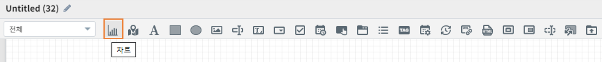

차트 객체는 데이터 객체에서 받은 데이터로 각종 차트를 구성하여 시각화할 수 있습니다. ( 데이터 객체 추가 버전 : 2020/07/02 )

'''''''''''''''''''''''''''''''''''''''''''''''''''
데이터
'''''''''''''''''''''''''''''''''''''''''''''''''''

**데이터 연결**

| 데이터연결에서 사용하고자 하는 데이터 객체를 설정합니다.
| **설정** 을 클릭한 후 데이터를 받아오는 데이터 객체를 체크합니다.

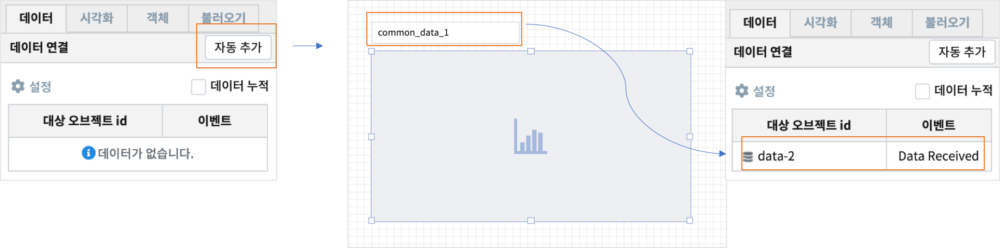

**데이터 누적** 

| 주기설정 객체를 사용하는 챠트인 경우 데이터객체로부터 주기적으로 받는 데이터를 누적하여 표시할 것인지 선택할 수 있습니다.
| 데이터누적을 선택하게 되면 **최대 누적 시각화 데이터 개수** 를 설정하게 됩니다.
| 시각화로 표시되는 데이터 수가 최대 개수가 될 때 까지 챠트에 표시되는 시간의 range 가 커집니다.

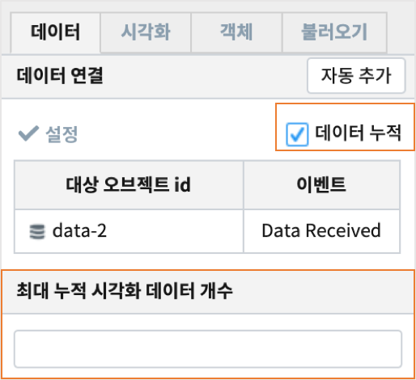

..................................................................................................................
다음 항목은 데이터객체로 이전되었습니다
..................................................................................................................

**데이터 유형 종류**

.. csv-table::
    :header: 데이터 유형, 설명
    :widths: 40, 150

    데이터 모델, "DB의 데이터를 추상화한 데이터 묶음으로서 별도의 테이블처럼 사용할 수 있습니다."
    DSMS, "Data Source Manager Service, 다양한 데이터에 대한 접근을 제공합니다."
    SMS, "System Monitoring Service, 시스템 자원 현황에 대한 정보를 제공합니다."
    REST API, "데이터를 REST 형식으로 사용할 수 있게 합니다."

**객체에 따라 특정 데이터 유형은 지원하지 않을 수도 있습니다.**

.. image:: ./studio//images/common/data_tab_01.png
    :scale: 100 %
    :alt: 데이터 유형

**데이터 유형별 선택옵션**

.. csv-table::
    :header: 데이터 유형, 선택옵션
    :widths: 40, 150

    데이터 모델, "데이터모델, 시간 설정, 검색어"
    DSMS, "연결정보, 검색어"
    SMS, Metric 유형 설정
    REST API, Restful API 선택

........................................................................................
데이터 모델 : 데이터객체로 이전
........................................................................................

| 미리 정의된 데이터 모델 중 하나를 선택합니다.

.. image:: ./studio/images/common/data_tab_02.png
    :scale: 100 %
    :alt: 데이터 모델

~~~~~~~~~~~~~~~~~~~~~~~~~~~~~~~~~~~~~~~~~~~~~~~~~~~~~~~~~~~~~~~~
시간 설정
~~~~~~~~~~~~~~~~~~~~~~~~~~~~~~~~~~~~~~~~~~~~~~~~~~~~~~~~~~~~~~~~

| 미리 설정된 시간 또는 사용자가 임의로 날짜 및 시간 범위를 지정합니다.

**미리 설정**

.. image:: ./studio/images/common/data_tab_07.png
    :scale: 100 %
    :alt: 미리 설정

**날짜 및 시간 범위**

.. image:: ./studio/images/common/data_tab_08.png
    :scale: 100 %
    :alt: 시간 범위 사용자 선택

**객체연결**

| 시작/끝 시간 입력박스에 변수명을 입력합니다.
| 변수값은 YYYYMMDDHHmmss 형식의 값이어야 합니다.

.. image:: ./studio/images/chart/studio_chart_06.png
    :scale: 50 %
    :alt: studio_chart_06

| 변수 combo_1 이 YYYYMMDD 형식의 날짜가 지정되어 있는 경우에는 위의 그림처럼 HHmmss 의 시간을 붙여서 변수값을 지정합니다.

~~~~~~~~~~~~~~~~~~~~~~~~~~~~~~~~~~~~~~~~~~~~~~~~~~~~~~~~~~~~
검색어
~~~~~~~~~~~~~~~~~~~~~~~~~~~~~~~~~~~~~~~~~~~~~~~~~~~~~~~~~~~~

| 선택된 데이터 모델 또는 DSMS 의 연결정보의 질의에 사용될 검색어(query)를 입력합니다.
| 검색어에는 변수명이 ${*VAR*} 와 같이 포함될 수 있습니다.
| 치환된 검색어는 미리 보기 기능으로 확인할수 있습니다.
| 사용되는 변수명은 각 객체의 변수명 설정에서 확인할 수 있으며 전체변수명 보기 기능을 통해서도 확인할 수 있습니다.
| 변수 치환에 관한 문법은 `nunjucks <https://mozilla.github.io/nunjucks/>`_ 을 참조할 수 있습니다
| *{{ }} 은 ${ } 으로 변경되었으며 다른 형식은 동일하게 사용할 수 있습니다.*
|
| 데이터모델 유형에서 사용하는 검색어 도움말 `Command Reference <http://docs.iris.tools/manual/IRIS-Manual/IRIS-Discovery-Middleware/command/index.html#command-references>`__ 을 참고하시기 바랍니다.

**검색어 입력**

.. image:: ./studio/images/common/data_tab_11.png
    :scale: 100 %
    :alt: 검색어 입력

**검색어 미리보기**

.. image:: ./studio/images/common/data_tab_12.png
    :scale: 100 %
    :alt: 검색어 미리 보기

**전체 변수명 보기**

.. image:: ./studio/images/common/data_tab_13.png
    :scale: 100 %
    :alt: 전체 변수명 보기

~~~~~~~~~~~~~~~~~~~~~~~~~~~~~~~~~~~~~~~~~~~~~~~~~~~~~~~~~~~~~~~~~~~~~~~~~~~~~~~~~~~~~~~~~~
데이터 실행방법 설정
~~~~~~~~~~~~~~~~~~~~~~~~~~~~~~~~~~~~~~~~~~~~~~~~~~~~~~~~~~~~~~~~~~~~~~~~~~~~~~~~~~~~~~~~~~

| 자동 실행과 트리거 이벤트가 발생할 때 실행되는 방법이 있습니다.

.. image:: ./studio/images/common/trigger_01.png
    :scale: 100 %
    :alt: 데이터 실행 방법 설정

************************************************************************************************
자동실행
************************************************************************************************

| 해당 옵션을 체크하면 보고서 로딩 시 해당 객체가 실행됩니다.

.. image:: ./studio/images/common/trigger_02.png
    :scale: 100 %
    :alt: 자동실행

********************************************************************************************************************************
트리거 설정 (공통)
********************************************************************************************************************************
| 다른 객체로부터 이벤트를 수신하거나 해당 객체의 이벤트를 수신하는 객체를 확인할 수 있습니다.

**이벤트 객체 추가**

| 트리거 설정 버튼을 통해 이벤트를 수신하고자 하는 객체를 선택할 수 있습니다.
|
| 트리거 설정 버튼 클릭

.. image:: ./studio/images/common/trigger_03.png
    :scale: 100 %
    :alt: 트리거 설정 버튼 클릭

**트리거 객체 선택**

.. image:: ./studio/images/common/trigger_04.png
    :scale: 100 %
    :alt: 트리거 객체 선택

**트리거 설정 완료**

.. image:: ./studio/images/common/trigger_05.png
    :scale: 100 %
    :alt: 트리거 설정 완료

**이벤트 객체 삭제**

| 추가된 객체의 삭제(X) 버튼을 클릭하여 수신객체를 삭제할 수 있습니다.

.. image:: ./studio/images/common/trigger_06.png
    :scale: 100 %
    :alt: 트리거 이벤트 삭제

******************************************************************************************************************
트리거 설정 확인
******************************************************************************************************************

| 해당 객체의 이벤트를 수신하는 객체를 확인합니다.
| 확인만 가능하며 해당 객체의 삭제는 수신대상 객체의 데이터 실행 방법 설정을 통해서만 가능합니다.

.. image:: ./studio/images/common/trigger_07.png
    :scale: 100 %
    :alt: 트리거 설정 확인

..................................................................
DSMS : 데이터객체로 이전
..................................................................

~~~~~~~~~~~~~~~~~~~~~~~~~~~~~~~~~~~~~~~~~~~~~~~~~~~~~~~~~~~~~~~~~~~~~~~~~~~~~~~~~~~~~~~~~~~~~~~~~~~~~~~~~~~~~~~~~~~~
연결 정보 선택
~~~~~~~~~~~~~~~~~~~~~~~~~~~~~~~~~~~~~~~~~~~~~~~~~~~~~~~~~~~~~~~~~~~~~~~~~~~~~~~~~~~~~~~~~~~~~~~~~~~~~~~~~~~~~~~~~~~~

| IRIS, MySQL, Oracle DataBase, Postgre 등 다양한 유형의 데이터 소스를 제공합니다.
| 사용하고자 하는 데이터 소스 중 하나를 선택합니다.

.. image:: ./studio/images/common/data_tab_03.png
    :scale: 100 %
    :alt: 데이터 모델

~~~~~~~~~~~~~~~~~~~~~~~~~~~~~~~~~~~~~~~~~~~~~~~~~~~~~~~~~~~~~~~~~~~~~~~~~~~~~~~~~~~~~~~~~~~~~~~~~~~~~~~~~~~~~~~~~
검색어
~~~~~~~~~~~~~~~~~~~~~~~~~~~~~~~~~~~~~~~~~~~~~~~~~~~~~~~~~~~~~~~~~~~~~~~~~~~~~~~~~~~~~~~~~~~~~~~~~~~~~~~~~~~~~~~~~

| 선택한 데이터베이스의 SQL 을 입력합니다.
| SQL 안에 변수명을 넣어서 사용할 수 있습니다.

~~~~~~~~~~~~~~~~~~~~~~~~~~~~~~~~~~~~~~~~~~~~~~~~~~~~~~~~~~~~~~~~~~~~~~~~~~~~~~~~~~~~~~~~~~~~~~~~~~~~~~~~~~~~~~~~~~~~~~~~~~~~~~~~~~~~~~~~~~~~~~~~~
데이터 실행방법 설정
~~~~~~~~~~~~~~~~~~~~~~~~~~~~~~~~~~~~~~~~~~~~~~~~~~~~~~~~~~~~~~~~~~~~~~~~~~~~~~~~~~~~~~~~~~~~~~~~~~~~~~~~~~~~~~~~~~~~~~~~~~~~~~~~~~~~~~~~~~~~~~~~~

| 데이터 모델의 `데이터 실행방법 설정 <http://docs.iris.tools/manual/IRIS-Manual/IRIS-Studio/data_visualize.html#id5>`__ 과 동일합니다.

..........................................................
SMS : 데이터객체로 이전
..........................................................

~~~~~~~~~~~~~~~~~~~~~~~~~~~~~~~~~~~~~~~~~~~~~~~~~~~~~~~~~~~~~~~~~~~~~~~~~~~~~~~~~~~~~~~~~~~~~~~~~~~~~~~~~~~~~~~~~~~~~~~~
Metric 유형 설정
~~~~~~~~~~~~~~~~~~~~~~~~~~~~~~~~~~~~~~~~~~~~~~~~~~~~~~~~~~~~~~~~~~~~~~~~~~~~~~~~~~~~~~~~~~~~~~~~~~~~~~~~~~~~~~~~~~~~~~~~

| API Type, Equipment type, Metric type, Metric Category, Agent 또는 사용자 정의 Agent 를 선택합니다.
| 각 Metric 유형별로 필요한 선택사항이 활성화됩니다.

.. csv-table::
    :header: API Type, 선택사항, 추가 선택사항

    current, "server, switch"
    resource, "resource", "시간 설정, 대상 Agent"
    alarm/history, "Equipment, Metric", "시간 설정, 대상 Agent"

**current** 를 선택한 경우

.. image:: ./studio/images/common/data_tab_04.png
    :scale: 100 %
    :alt: current 유형 설정

**resource** 를 선택한 경우

.. image:: ./studio/images/common/data_tab_05.png
    :scale: 100 %
    :alt: resource 유형 설정

**alarm/history** 를 선택한 경우

.. image:: ./studio/images/common/data_tab_06.png
    :scale: 100 %
    :alt: alarm/history 유형 설정

************************************************************************************************************
대상 Agent
************************************************************************************************************

| 설정된 Agent 또는 사용자 정의 Agent 를 선택합니다.
| 데이터를 수집하기 위해 별도의 Agent 가 설치되어 있으며 이를 통해 정보를 수집할수 있습니다.

**Agent 선택**

.. image:: ./studio/images/common/data_tab_09.png
    :scale: 100 %
    :alt: Agent 선택

**사용자 정의 Agent 선택**

.. image:: ./studio/images/common/data_tab_10.png
    :scale: 100 %
    :alt: 사용자 정의 Agent 선택

~~~~~~~~~~~~~~~~~~~~~~~~~~~~~~~~~~~~~~~~~~~~~~~~~~~~~~~~~~~~~~~~~~~~~~~~~~~~~~~~~~~~~~~~~~~~~~~~~~~~~~~~~~~~~~~~~~~~
데이터 실행방법 설정
~~~~~~~~~~~~~~~~~~~~~~~~~~~~~~~~~~~~~~~~~~~~~~~~~~~~~~~~~~~~~~~~~~~~~~~~~~~~~~~~~~~~~~~~~~~~~~~~~~~~~~~~~~~~~~~~~~~~

| 데이터모델의 `데이터 실행방법 설정 <http://docs.iris.tools/manual/IRIS-Manual/IRIS-Studio/data_visualize.html#id5>`__ 과 동일합니다.

''''''''''''''''''''''''''''''''''''''''''''''''''''''''''''''''''''''''''''''''''''''''
REST API : 데이터객체로 이전
''''''''''''''''''''''''''''''''''''''''''''''''''''''''''''''''''''''''''''''''''''''''

| 데이터로 Rest 를 사용할 수 있습니다.
| 보고서에 생성된 Restful API 객체를 선택할 수 있으며 별도의 화면이 제공됩니다.
| 트리거 설정 버튼을 이용하여 Restful API 객체를 선택/삭제 할 수 있습니다.
| 해당 객체의 사용법은 `RESTful API <http://docs.iris.tools/manual/IRIS-Manual/IRIS-Studio/special_etc.html#restful-api-rest-ful-api>`_ 을 참조하세요

.. image:: ./studio/images/common/data_tab_14.png
    :scale: 100 %
    :alt: Restful API 선택

''''''''''''''''''''''''''''''''
시각화
''''''''''''''''''''''''''''''''
| 시각화 설정에서는 차트의 스타일이나 시각화 방법 등에 대한 설정을 할 수 있습니다.

....................................................................................
시각화 유형
....................................................................................

| 데이터를 표현하고자 하는 차트를 선택할 수 있습니다.

.. image:: ./studio/images/chart/chart_01.png
    :width: 300
    :alt: 시각화 유형

.. csv-table::
    :header: "차트", "설명"
    :widths: 40, 150

    "테이블", "데이터를 테이블 형태로 보여 줍니다."
    "꺾은선형", "데이터를 Line 차트 형태로 보여 줍니다."
    "다중축", "데이터를 다 중축 혼합형(세로막대형, 꺾은선형) 차트 형태로 보여 줍니다."
    "세로막대형", "데이터를 Column 차트 형태로 보여 줍니다."
    "가로막대형", "데이터를 Bar 차트 형태로 보여 줍니다."
    "시계열 분포", "데이터를 Scatter 차트 형태로 보여 줍니다."
    "모션", "데이터를 Motion 차트 형태로 보여 줍니다."
    "Sankey", "데이터를 Sankey 차트 형태로 보여줍니다."
    "원형", "데이터를 Pie 차트 형태로 보여 줍니다."
    "히트맵", "데이터를 Heat Map 차트 형태로 보여 줍니다."
    "단일값", "데이터를 값 하나의 형태로 보여 줍니다."
    "Gauge", "데이터를 Gauge 차트 형태로 보여 줍니다."
    "트리맵", "데이터를 Tree Map 차트 형태로 보여 줍니다."
    "워드클라우드", "데이터를 Word Cloud 차트 형태로 보여 줍니다."

................................................................................................
이벤트 값 전달 설정
................................................................................................

| 해당 객체의 값을 참조하고자 할 때 사용하는 내용이 표시됩니다.

.. csv-table::
    :header: 옵션 명, 설명
    :widths: 40, 150

    오브젝트 ID, 해당 객체의 고유 아이디로 자동으로 할당됩니다.
    변수 명, 해당 객체를 사용하기 위한 변수명으로 사용자가 지정할 수 있습니다.

.. image:: ./studio/images/common/event_01.png
    :scale: 100 %
    :alt: 이벤트값 전달 설정

......................................................................
트리거 설정 확인
......................................................................

| 해당 객체의 이벤트를 수신하는 객체를 확인합니다.
| 확인만 가능하며 해당 객체의 삭제는 수신대상 객체의  `데이터 실행 방법 설정 <http://docs.iris.tools/manual/IRIS-Manual/IRIS-Studio/data_visualize.html#id5>`__ 을 통해서만 가능합니다.

.. image:: ./studio/images/common/trigger_07.png
    :scale: 100 %
    :alt: 트리거 설정 확인

....................................................
시각화 옵션
....................................................

| 차트를 그리기 위한 옵션들을 설정할 수 있습니다.

**일반**

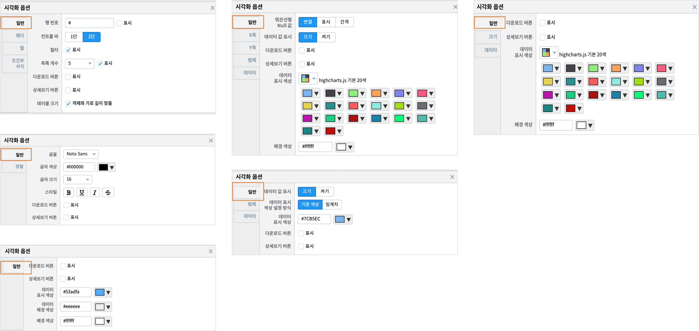

.. csv-table::
    :header: "옵션 명", "설명"
    :widths: 40, 150

    "행번호", "테이블에서 행 번호 추가할지 여부 및 행 번호 컬럼의 이름을 설정합니다."
    "컨트롤바", "테이블에서 목록개수,페이지,검색박스 등을 1단/2단 으로 표시하는 것을 설정합니다."
    "필터", "테이블에서 필터를 표시할지 안 할지를 설정합니다."
    "목록 개수", "테이블에서 데이터를 한 번에 몇 행까지 보여 줄지 여부 및 목록 개수를 설정할 수 있는 Select Box를 보여 줄지를 설정합니다."
    "막대형 스택모드", "막대형 차트에서 사용되며, 끄기는 Bar 생성 개수가 컬럼수만큼 증가하고, 스택형은 하나의 Bar에 모든 컬럼 데이터를 표시하며, 풀스택형은 하나의 Bar에 100% 비율로 모든 컬럼의 데이터의 비율을 보여줍니다."
    "꺾은선형 Null 값", "꺾은선형 차트에서 데이터의 null 값이 있으면 표시할지를 설정합니다."
    "데이터 값 표시", "차트에 데이터값을 표시할지를 설정합니다."
    "데이터 표시 색상 설정 방식", "챠트에서 데이터 표시를 기준값에 따라 색상을 정할 지, 데이터값의 임계치에 따라 색상을 정할 지 설정합니다."
    "글꼴", "차트에 표시되는 문자의 글꼴을 설정합니다."
    "글자 색상", "차트에서 글자 색상을 설정합니다."
    "글자 크기", "차트에서 글자 크기를 설정합니다."
    "스타일", "차트에서 글자의 스타일을 설정합니다."
    "다운로드 버튼", "다운로드 버튼을 표시할지를 설정합니다."
    "상세보기 버튼", "상세보기 버튼을 표시할지를 설정합니다"
    "테이블 크기", "테이블 컬럼 크기를 객체 영역의 크기 기준으로 동일하게 맞출지를 설정합니다."
    "데이터 표시 색상","챠트에서 데이터를 표시하기 위한 색상 기준을 설정합니다.여러 개의 색상 표현시 순서대로 다른 개별 색상을 설정할 수 있습니다."
    "배경 색상", "차트에서 챠트 배경 색을 설정합니다."

**헤더**

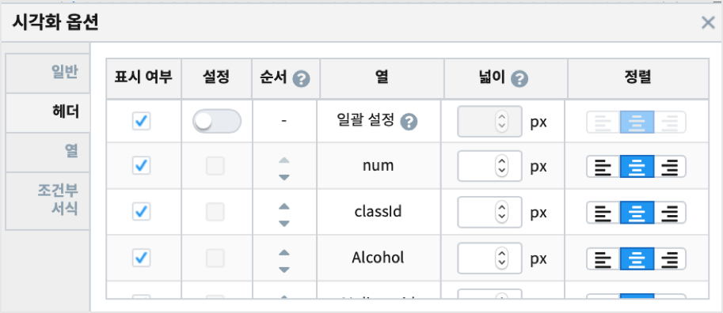

.. csv-table::
    :header: "옵션 명", "설명"
    :widths: 40, 150

    "표시 여부", "테이블에 표시되는 컬럼을 지정할 수 있습니다."
    "설정", "테이블에서 모든 헤더를 일괄 설정할지를 설정할 수 있으며, 일괄 설정 모드일 경우 체크 박스가 활성화되고 체크 박스를 체크하면 개별 설정을 할 수 있습니다."
    "행번호", "테이블에서 헤더의 순서를 설정합니다."
    "넓이", "테이블에서 열의 넓이를 설정할 수 있으며, 일괄 설정 모드가 아닌 거나 일괄 설정 모드이고 개별 설정이 체크되면 넓이를 설정할 수 있습니다."
    "정렬", "테이블에서 헤더의 정렬을 설정할 수 있으며, 일괄 설정 모드가 아닌 거나 일괄 설정 모드이고 개별 설정이 체크되면 넓이를 설정할 수 있습니다."

**열**

.. image:: ./studio/images/chart/chart_04.png
    :scale: 60%
    :alt: 시각화 옵션 열

.. csv-table::
    :header: "옵션 명", "설명"
    :widths: 40, 150

    "설정", "테이블에서 모든 열을 일괄 설정할지를 설정할 수 있으며, 일괄 설정을 모드일 경우 체크 박스가 활성화되고 체크 박스를 체크하면 개별 설정을 할 수 있습니다."
    "표현", "테이블에서 데이터를 Progress Bar로 표시할지를 설정할 수 있으며, 일괄 설정 모드가 아닌 거나 일괄 설정 모드이고 개별 설정이 체크되면 넓이를 설정할 수 있습니다."
    "정렬", "테이블에서 열의 정렬을 설정할 수 있으며, 일괄 설정 모드가 아닌 거나 일괄 설정 모드이고 개별 설정이 체크되면 넓이를 설정할 수 있습니다."

**조건부 서식**

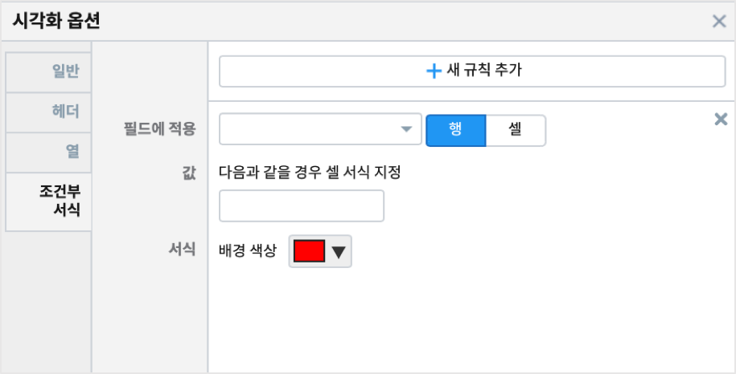

.. csv-table::
    :header: "옵션 명", "설명"
    :widths: 40, 150

    "새 규칙 추가", "테이블에서 테이터를 이용하여 색상을 변경할 수 있는 규칙을 추가합니다."
    "필드에 적용", "테이블에서 규칙을 추가하기 위한 필드를 설정합니다. 이 때 적용할 필드를 행/셀로 선택할 수 있습니다."
    "값", "테이블에서 규칙에 대한 값을 설정합니다."
    "서식", "테이블에서 규칙에 대한 색상을 설정합니다."

**X축**

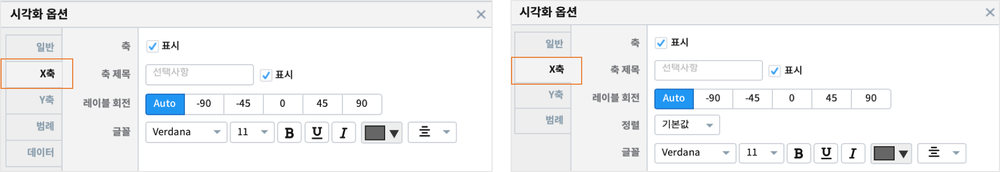

.. csv-table::
    :header: "옵션 명", "설명"
    :widths: 40, 150

    "축", "차트에서 X축을 표시할지를 설정합니다."
    "축 제목", "차트에서 표시할 X축의 제목을 설정합니다."
    "간격", "차트에서 표시할 X축의 간격을 설정합니다."
    "레이블 회전", "차트에서 X축의 값을 회전할 수 있습니다."
    "최소값", "가로막대형 차트에서 표시할 X축 데이터의 최솟값을 설정합니다."
    "최대값", "가로막대형 차트에서 표시할 X축 데이터의 최댓값을 설정합니다."
    "정렬", "차트에서 X축의 값을 정렬할 수 있습니다."
    "글꼴", "챠트에서 X축 제목과 표시데이터의 글꼴을 설정합니다."

**Y축**

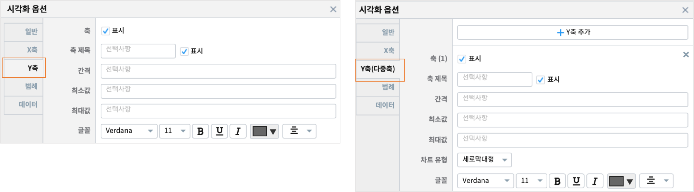

.. csv-table::
    :header: "옵션 명", "설명"
    :widths: 40, 150

    "Y축 추가", "다 중축 차트에서 Y축을 새로 추가할 수 있습니다."
    "축", "차트에서 Y축을 표시할지를 설정합니다."
    "축 제목", "차트에서 표시할 Y축의 제목을 설정합니다."
    "간격", "차트에서 표시할 Y축의 간격을 설정합니다."
    "최소값", "차트에서 표시할 Y축 데이터의 최솟값을 설정합니다."
    "최대값", "차트에서 표시할 Y축 데이터의 최댓값을 설정합니다."
    "차트 유형", "다중축 차트에서 Y축을 추가할 때 차트 유형을 설정합니다."
    "레이블 회면", "차트에서 Y축의 값을 회전할 수 있습니다."
    "글꼴", "챠트에서 Y축 제목과 표시 데이터의 글꼴을 설정합니다."

**범례**

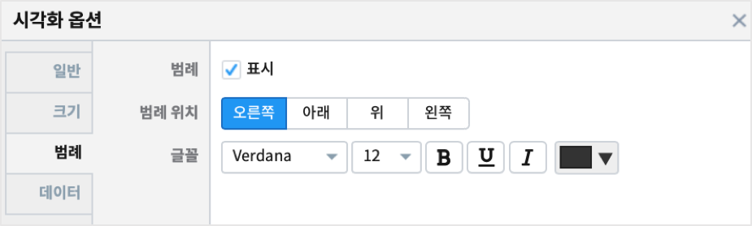

.. csv-table::
    :header: "옵션 명", "설명"
    :widths: 40, 150

    "범례", "차트에서 범례를 표시할지를 설정합니다."
    "범례 위치", "차트에서 표시할 범례의 위치를 설정합니다."
    "글꼴", "챠트에서 범례 데이터의 글꼴을 설정합니다."

**크기**

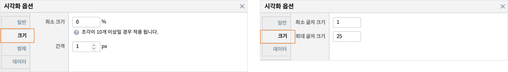

.. csv-table::
    :header: "옵션 명", "설명"
    :widths: 40, 150

    "최소 크기", "원형 차트에서 조각의 최소 크기를 설정합니다."
    "간격", "원형 챠트에서 조각과 조각의 간격을 픽셀로 설정합니다."
    "최소 글자 크기", "워드 클라우드 차트에서 최소 글자 크기를 설정합니다."
    "최대 글자 크기", "워드 클라우드 차트에서 최대 글자 크기를 설정합니다."

**정렬**

.. image:: ./studio/images/chart/chart_10.png
    :width: 300
    :alt: 시각화 옵션 정렬

.. csv-table::
    :header: "옵션 명", "설명"
    :widths: 40, 150

    "가로 정렬", "단일 값 차트에서 단일 값의 가로 정렬을 설정합니다."
    "세로 정렬", "단일 값 차트에서 단일 값의 세로 정렬을 설정합니다."
    "텍스트 정렬", "단일 값 차트에서 텍스트를 가로로 표시할 건지 세로로 표시할 건지 설정합니다."

**데이터**

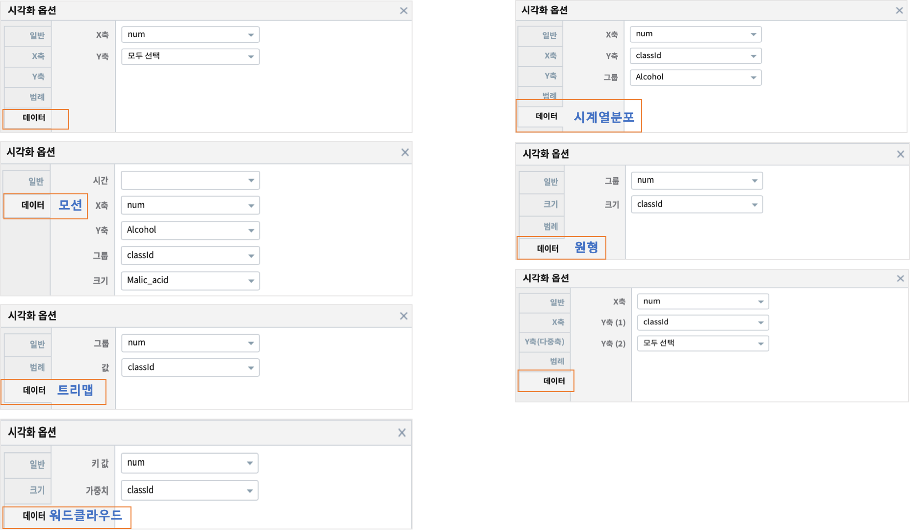

.. csv-table::
    :header: "옵션 명", "설명"
    :widths: 40, 150

    "X축", "차트에서 X축에 표시할 데이터 컬럼을 설정합니다."
    "Y축", "차트에서 Y축에 표시할 데이터 컬럼을 설정합니다."
    "그룹", "시계열분포 / 모션 차트/ 트리맵에서 차트에 그룹으로 표시할 데이터 컬럼을 설정합니다."
    "시간", "모션 차트에서 시간을 표시할 데이터 컬럼을 설정합니다."
    "크기", "모션 차트는 버블의 크기, 원형챠트는 조각의 크기에 해당하는 데이터 컬럼을 설정합니다."
    "값", "트리맵에서 값에 해당하는 컬럼을 설정합니다.값은 블럭의 색상으로 표현됩니다."
    "키 값", "워드클라우드에서 값을 표시할 데이터 컬럼을 설정합니다."
    "가중치", "워드클라우드에서 글자 크기에 해당하는 테이터 컬럼을 설정합니다."

''''''''''''''''''''''''''''''''''''''''''''''''''''''''''''''''''
객체 설정
''''''''''''''''''''''''''''''''''''''''''''''''''''''''''''''''''

| 객체의 가로세로 크기와 X,Y 위치를 입력값으로 수정할 수 있습니다.
| 마우스를 이용한 수정된 값이 실시간으로 반영되며 사용자가 입력한 값이 해당 객체에 반영됩니다.

.. image:: ./studio/images/common/object_01.png
    :scale: 100 %
    :alt: 트리거 설정 확인

~~~~~~~~~~~~~~~~~~~~~~~~~~~~
크기
~~~~~~~~~~~~~~~~~~~~~~~~~~~~
| 객체의 가로/세로의 크기를 설정합니다.

.. csv-table::
    :header: 옵션 명, 설명
    :widths: 40, 100

    가로, 객체의 가로 크기를 설정합니다.
    세로, 객체의 세로 크기를 설정합니다.

~~~~~~~~~~~~~~~~~~~~~~
위치
~~~~~~~~~~~~~~~~~~~~~~

| 객체의 X,Y 위치를 설정합니다.

.. csv-table::
    :header: 옵션 명, 설명
    :widths: 40, 100

    X, 좌표상의 X 위치를 설정합니다.
    Y, 좌표상의 Y 위치를 설정합니다.

~~~~~~~~~~~~~~~~~~~~~~~~~~~~~~~~~~~~~~~~~~~~~~~~~~~~~~~~~~~~~~~~~~~~
꾸미기 옵션
~~~~~~~~~~~~~~~~~~~~~~~~~~~~~~~~~~~~~~~~~~~~~~~~~~~~~~~~~~~~~~~~~~~~

| 테두리와 그림자는 **꾸미기 옵션** 아이콘을 클릭하여 설정합니다.

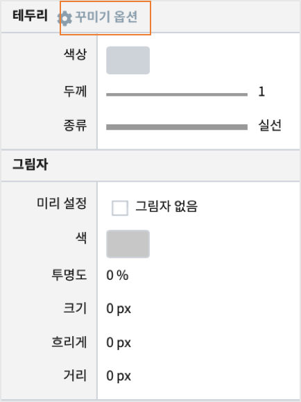

| **테두리**  는 선택한 객체 테두리의 색상, 두께, 종류를 설정합니다.

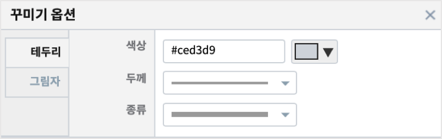

| **그림자** 는 선택한 객체에 테두리가 있는 경우에 그림자를 만들어서 꾸밀 수 있는 옵션입니다.
| 그림자 없음이 디폴트로 지정되어 있으며, 그림자를 생성할 경우에 그림자의 색, 투명도, 크기, 흐린 정도, 거리 등을 설정할 수 있습니다.

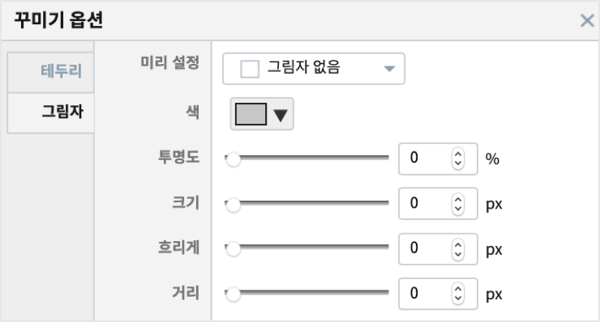

''''''''''''''''''''''''''''''''''''''''''''''''''''''''''''''''''''''''''''''''''''''''''''''''''''''''''''
불러오기
''''''''''''''''''''''''''''''''''''''''''''''''''''''''''''''''''''''''''''''''''''''''''''''''''''''''''''
| 저장된 분석 탬플릿 목록을 불러올 수 있습니다.
| 분석 탬플릿 목록을 선택하면, 해당 데이터유형과 검색어가 자동 설정됩니다.

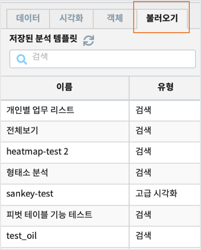

-------------------------------------------------------------
지도 (map)
-------------------------------------------------------------

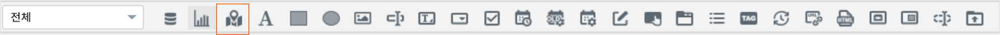

| 지도 객체는 요청한 지리정보(Geospatial information)를 활용하여 지도상에 정보를 시각화 할 수 있습니다. 

''''''''''''''''''''''''''''''''''''''''''''''''''''''''''''''''''''''''''''''''''''''''''''''''''''''''''''
레이어 선택
''''''''''''''''''''''''''''''''''''''''''''''''''''''''''''''''''''''''''''''''''''''''''''''''''''''''''''

| 관리 버튼을 클릭하면 아래와 같이 레이어 관리 팝업이 열립니다.

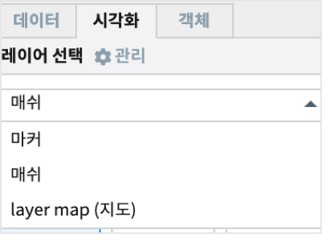

............................................................
레이어 관리
............................................................

| 레이어를 추가 및 삭제를 할 수 있습니다.
| 기본 지도 레이어인 "layer map(지도)"  는 삭제할 수 없습니다.

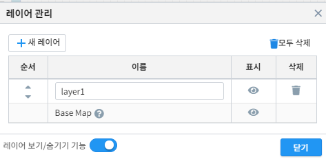

.. csv-table::
    :header: "옵션 명", "설명"
    :widths: 40, 100

    "새 레이어", "한 지도에 여러 개의 레이어를 생성할 수 있어 레이어를 추가할 수 있습니다."
    "모두 삭제", "생성한 레이어를 모두 삭제합니다."
    "순서", "레이어의 순서를 설정합니다."
    "이름", "레이어의 이름을 설정합니다."
    "표시", "레이어를 지도에 표시할지를 설정합니다."
    "삭제", "레이어를 삭제합니다."
    "레이어 보기/숨기기", "지도에서 레이어 표시 아이콘 표시할지 안 할지를 설정합니다."

................................................................................................................................
데이터 설정 : layer map(지도)
................................................................................................................................

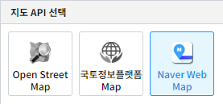

**지도 API 선택**

| Open Street Map에서 제공하는 API를 사용할지 Naver Web Map에서 제공하는 API를 사용할지를 선택합니다.

.. image:: ./studio/images/map/map_04.png
    :width: 300
    :alt: 지도 URL

**지도 URL**

| 지도 데이터를 가져올 Tiles URL를 설정합니다.

.. image:: ./studio/images/map/map_05.png
    :width: 300
    :alt: 기본값 설정

**기본 값 설정**

| 현재 지도의 위치(위도, 경도, 줌 레벨)을 설정합니다.

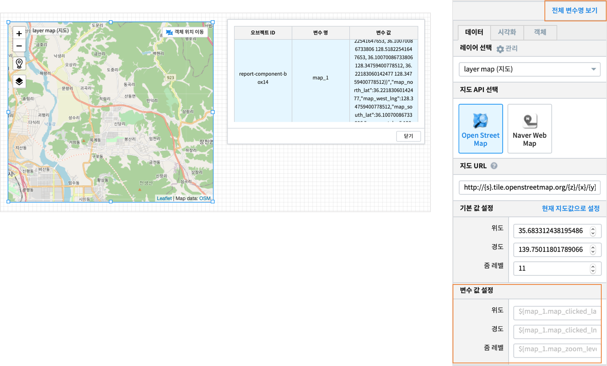

**변수 값 설정**

| 보고서 내의 다른 **map객체** 의 변수를 설정하여 **트리거** 로 사용할 수 있습니다.  
|   ${map_1. map_clicked_lat}   : 지도 클릭 지점의 위도
|   ${map_1. map_clicked_lng}   : 지도 클릭 지점의 경도
|   ${map_1. map_zoom_level}    : 지도의 줌레벨

| 다른 지도객체에서 특정 지점을 클릭하면 현재 지도의 위치가 자동으로 변경됩니다. 

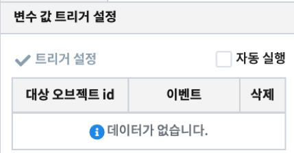

**변수 값 트리거 설정**

| 변수 값 설정을 한 경우에 사용합니다.
| 다른 지도 객체를 트리거로 선택하고,  트리거로 설정한 지도 객체의 변수로 **변수 값 설정** 을 하면
| 트리거 설정한 지도에서 클릭한 지점으로 현재 지도의 중심 지점이 자동 변경됩니다. 

......................................................................................................................................
시각화 설정 : layer map(지도)
......................................................................................................................................

~~~~~~~~~~~~~~~~~~~~~~~~~~~~~~~~~~~~~~~~~~~~~~~~~~~~~~~~~~~~~~~~~~~~~~~~
맵 : 시각화 옵션
~~~~~~~~~~~~~~~~~~~~~~~~~~~~~~~~~~~~~~~~~~~~~~~~~~~~~~~~~~~~~~~~~~~~~~~~

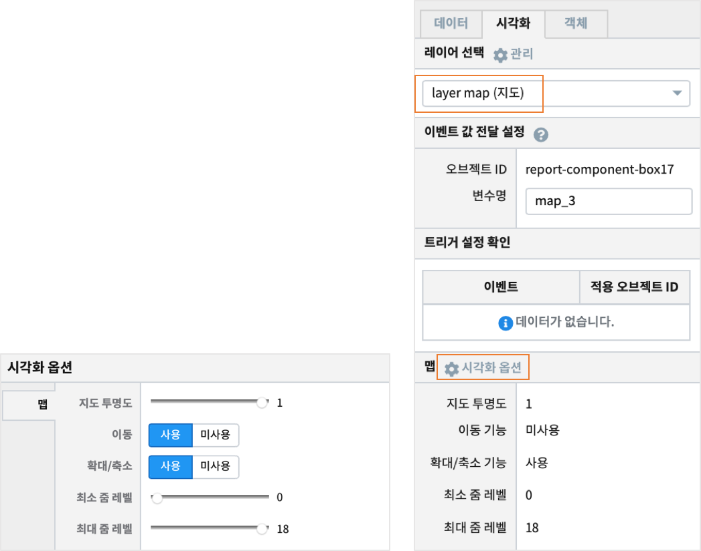

.. csv-table::
    :header: "옵션 명", "설명"
    :widths: 40, 100

    "이동 기능", "미사용으로 두면 지도의 좌표 이동이 동작하지 않습니다. 즉 중심 위경도가 고정됩니다."
    "확대/축소 기능", "미사용으로 두면 지도의 배율이 고정됩니다. 지도에서 확대/축소 아이콘이 사라집니다."
    "지도 투명도", "지도의 투명도를 설정합니다."
    "최소 줌 레벨", "지도의 최소 줌 레벨을 설정합니다."
    "최대 줌 레벨", "지도의 최대 줌 레벨을 설정합니다."

''''''''''''''''''''''''''''''''''''''''''''''''''''''''''''''''''''''''''''''''''''''''''''''''
레이어 설정
''''''''''''''''''''''''''''''''''''''''''''''''''''''''''''''''''''''''''''''''''''''''''''''''

..................................................................
데이터 설정
..................................................................

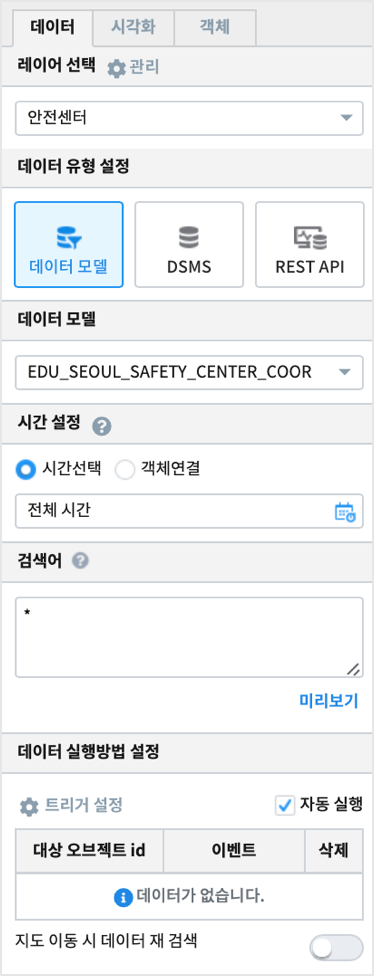

| 챠트의 데이터 설정 항목 `데이터 설정 <http://docs.iris.tools/manual/IRIS-Manual/IRIS-Studio/data_visualize.html#id1>`__  을 참고하시기 바랍니다.

~~~~~~~~~~~~~~~~~~~~~~~~~~~~~~~~~~~~~~~~~~~~~~~~~~~~~~~~~~~~~~~~~~~~~~~~~~~~~~~~~~~~~~~~~~~~~~~~~~~~~~~~~~~~~~~~~~~~~~~~~~~~~~~~~~~~
시각화 설정
~~~~~~~~~~~~~~~~~~~~~~~~~~~~~~~~~~~~~~~~~~~~~~~~~~~~~~~~~~~~~~~~~~~~~~~~~~~~~~~~~~~~~~~~~~~~~~~~~~~~~~~~~~~~~~~~~~~~~~~~~~~~~~~~~~~~

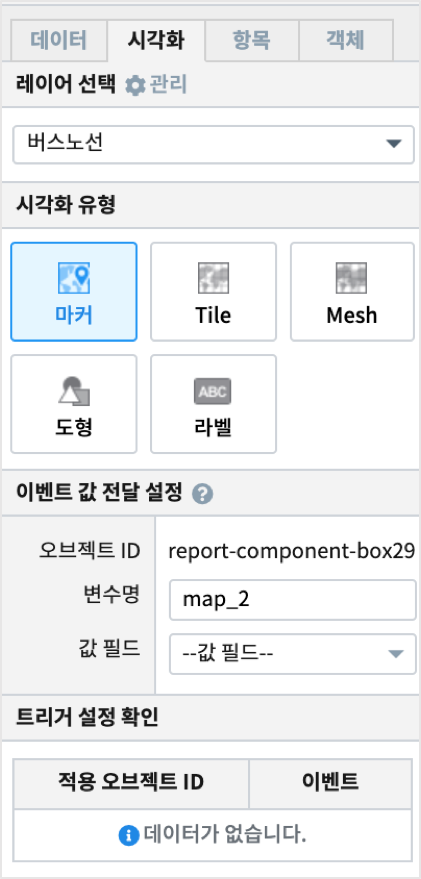

| 시각화 설정에서는 레이어의 스타일이나 시각화 방법 등에 대한 설정을 할 수 있습니다.

................................................................................................................................
시각화 유형
................................................................................................................................

| 선택한 레이어의 시각화 유형을 선택할 수 있습니다.

.. image:: ./studio/images/map/map_07.png
    :width: 300
    :alt: 시각화 유형

.. csv-table::
    :header: "종류", "설명"
    :widths: 40, 100

    "Tile", "지도에 Tile Code를 이용한 Layer를 선택합니다. "
    "Mesh", "지도에 Mesh Code를 이용한 Layer를 선택합니다." 
    "마커", "지도에 Point 및 Flag Layer를 선택합니다."
    "도형", "지도에 polygon 및 multi-polygon Layer를 선택합니다."
    "라벨", "지도에 텍스트 라벨을 표시하는 Layer를 선택합니다."

~~~~~~~~~~~~~~~~~~~~~~~~~~~~~~~~~~~~~~~~~~~~~~~~~~~~~~~~~~~~~~~~~~~~~~~~~~~~~~
시각화 옵션
~~~~~~~~~~~~~~~~~~~~~~~~~~~~~~~~~~~~~~~~~~~~~~~~~~~~~~~~~~~~~~~~~~~~~~~~~~~~~~

| Map의 옵션을 설정할 수 있습니다.

**Tile**

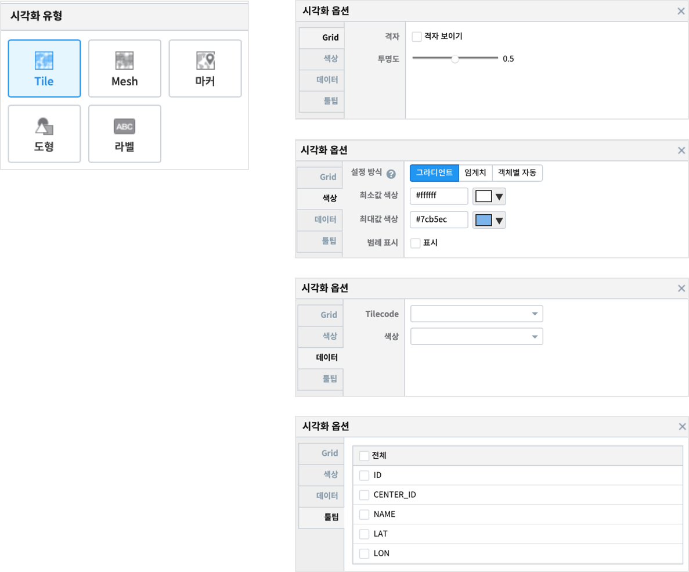

| Grid 탭 설명

.. csv-table::
    :header: "옵션 명", "설명"
    :widths: 40, 100

    "격자", "Tile 및 Mesh에서 격자가 보이거나 안 보이도록 설정합니다."
    "투명도", "Layer의 투명도를 설정합니다."

**Mesh**

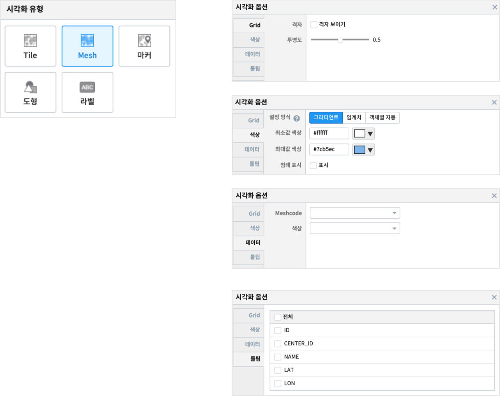

| Grid 탭 설명

.. csv-table::
    :header: "옵션 명", "설명"
    :widths: 40, 100

    "격자", "Tile 및 Mesh에서 격자가 보이거나 안 보이도록 설정합니다."
    "투명도", "Layer의 투명도를 설정합니다."

**마커**

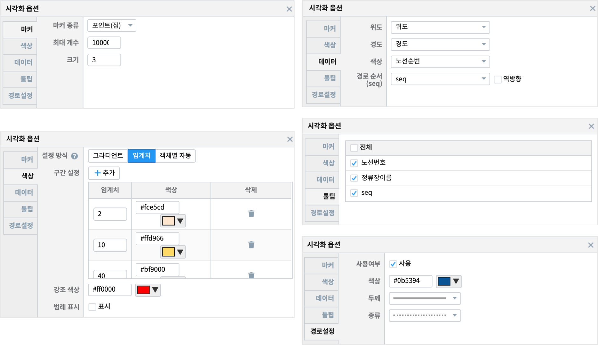

| 마커탭 설명

.. csv-table::
    :header: "옵션 명", "설명"
    :widths: 40, 100

    "마커 종류", "포인트 및 깃발을 설정합니다."
    "최대 개수", "마커 최대 개수를 설정합니다."
    "크기", "마커 크기를 설정합니다."

**도형**

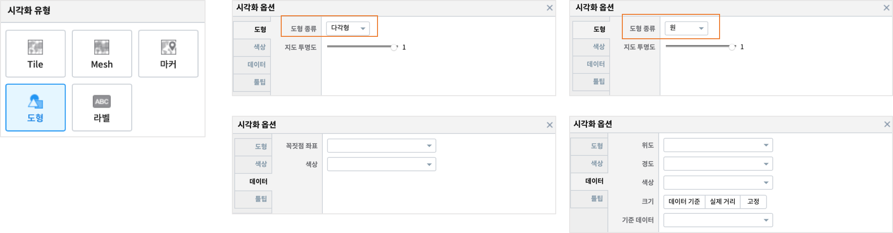

| 도형탭 설명
    
    도형 종류는 다각형과 원이 있습니다.

| 데이터탭 설명

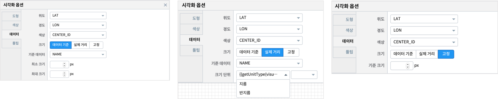

.. csv-table::
    :header: "도형 종류", "옵션 명", "설명"
    :widths: 20, 40, 100
     
     "다각형", "꼭짓점 좌표", "도형에서 도형을 그리기 위한 데이터 컬럼을 설정합니다."
     "다각형", "색상", "색상을 표현할 데이터 컬럼을 설정합니다."
     "원", "위도", "마커에서 위도의 데이터 컬럼을 설정합니다."
     "원", "경도", "마커에서 경도의 데이터 컬럼을 설정합니다."
     "원", "크기-데이터기준", "원의 크기를 기준데이터의 값으로 선택합니다."
     "원", "크기-실제거리", "원의 크기를 지름/반지름, km/m 로 선택합니다."
     "원", "크기-고정", "원의 크기를 고정 크기(픽셀단위)로 지정합니다."
     "원", "기준데이터", "원을 표시하는 숫자형 데이터 컬럼을 선택합니다."
     "다각형/원", "색상", "색상을 표현할 데이터 컬럼을 설정합니다."

**라벨**

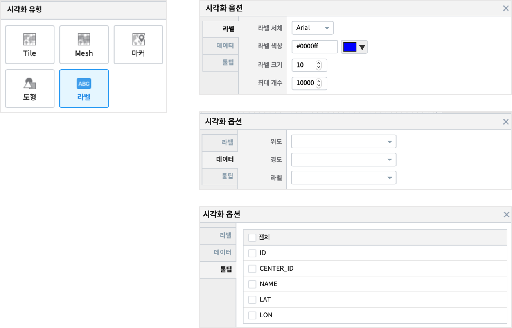

| 라벨탭 설명

    라벨의 서체, 색상, 크기, 지도에 표시되는 라벨의 최대 개수를 지정합니다.

| 데이터탭 설명

    지도에 표시되는 라벨의 위도, 경도 좌표 컬럼을 지정하고, 라벨로 표시되는 컬럼을 지정합니다.

**색상**

.. image:: ./studio/images/map/map_11.png
    :width: 300
    :alt: 시각화 옵션 색상

.. csv-table::
    :header: "옵션 명", "설명"
    :widths: 40, 120

    "설정 방식", "그라디언트, 임계치, 객체별 자동 3가지 설정이 가능하며 각각 데이터의 값으로 Layer에 색을 추가 추가하는 방식입니다."
    "최소값 색상", "그라디언트에서 데이터값이 최솟값일 때 어떠한 색으로 표현할지 설정합니다."
    "최대값 색상", "그라디언트에서 데이터값이 최댓값일 때 어떠한 색으로 표현할지 설정합니다."
    "구간 설정", "임계치에서 값의 구간마다 색을 설정합니다."
    "범례", "Layer에 범례를 표시할지 안 할지를 설정합니다."

**튤팁**

튤팁에 표시할 데이터의 컬럼을 설정합니다.

.. image:: ./studio/images/map/map_13.png
    :width: 300
    :alt: 시각화 옵션 튤팁

''''''''''''''''''''''''''''''''''''''''''''''''''''''''''''''''''''''
객체 설정
''''''''''''''''''''''''''''''''''''''''''''''''''''''''''''''''''''''
| 챠트의  `객체 설정 <http://docs.iris.tools/manual/IRIS-Manual/IRIS-Studio/data_visualize.html#id18>`__ 을 참고하시기 바랍니다.

