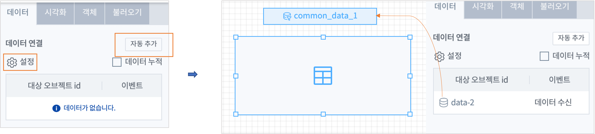
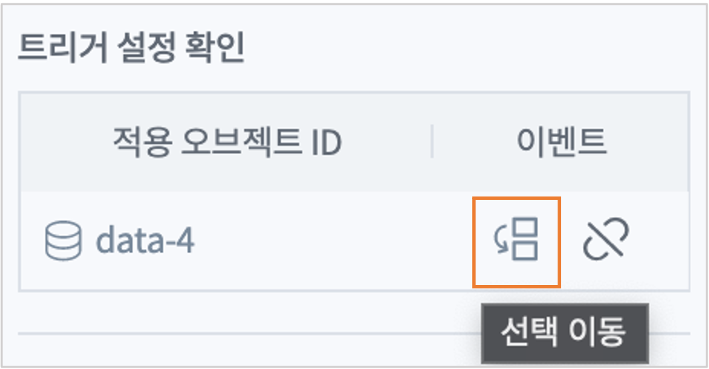
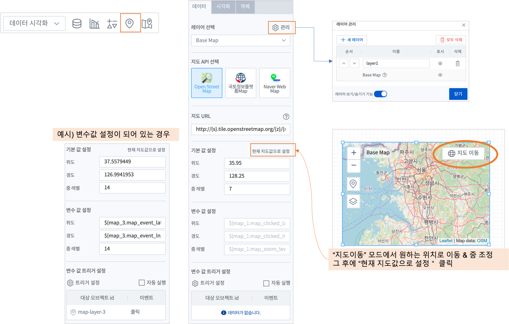
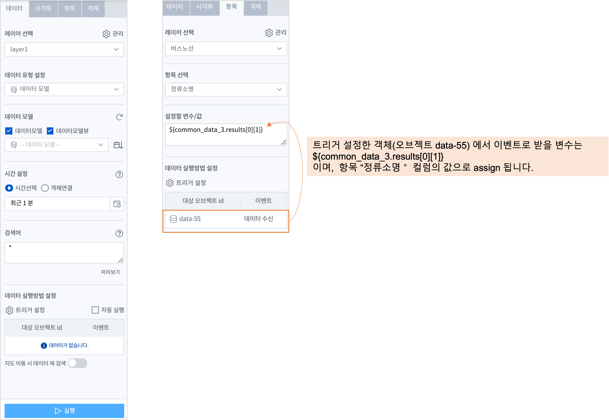
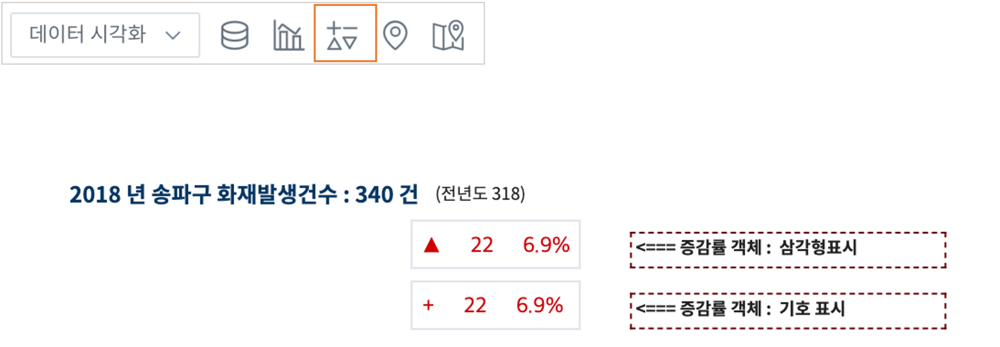

데이터 시각화 (Data Visualize) 객체
=============================================================================================================================

| 데이터를 차트나 표, 도형, 지도 등의 형태로 시각화하는 객체 입니다.
| ``데이터 객체`` 와 연결하여 동작하며,  ``챠트`` , ``지도`` , ``증감률`` , ``IMA 뷰어`` 객체가 해당됩니다.
|

챠트 (chart)
------------------------------------------------------------------------------------

| ``챠트`` 는 연결한 데이터 객체에서 받은 데이터를 각종 차트로 시각화하는 객체입니다. 
| 여기서는 챠트의 공통적인 설정 부분을 중점으로 설명합니다.
| 따라서 특정 챠트의 항목에 포함해야 할 부분이 생략될 수 있고, 부분적으로 다르게 표시될 수 있습니다. 

|
| 각 개별 챠트의 내용은  ``Tutorial`` 에서 챠트 유형별 예제를 참고하세요.

데이터
'''''''''''''''''''''''''''''''''''''''''''''''''''

**데이터 객체 연결**

| 챠트객체에서 사용하려고 하는 데이터 객체를 연결합니다. 
| 

| 데이터객체를 연결하는 2가지 방법은 
| 데이터연결의 **설정** 를 클릭하여 이미 만든 데이터객체를 체크하여 연결을 설정하거나, **자동 추가** 버튼을 클릭하면 해당 챠트객체와 자동으로 연결되는 데이터객체가 생성됩니다.

**데이터 누적** 

| **주기설정** 객체를 사용하는 챠트인 경우 데이터객체로부터 주기적으로 받는 데이터를 누적하여 표시할 것인지 선택할 수 있습니다.
| 데이터 누적을 선택하게 되면 **최대 누적 시각화 데이터 개수** 를 설정하게 됩니다.
| 시각화로 표시되는 데이터 수가 최대 개수가 될 때 까지 챠트에 표시되는 시간의 range 가 자동으로 늘어나게 됩니다.
| 데이터 누적을 활성화하면 챠트의 시각화 유형 중 데이터 누적 기능을 적용할 수 없는 시각화 유형은 비활성화됩니다.

시각화
''''''''''''''''''''''''''''''''

| 시각화 설정에서는 차트의 스타일이나 시각화 방법 등에 대한 설정을 할 수 있습니다.

- 시각화 유형

.. csv-table::
    :header: "차트", "설명"
    :widths: 40, 150

    "테이블", "데이터를 테이블 형태로 보여 줍니다."
    "꺾은선형", "X축에 따른 Y축 값을 Line 차트 형태로 보여 줍니다."
    "영역형", "꺾은선형 챠트를 기반으로 하며,축과 선 사이의 영역을 볼륨을 나타내는 색으로 보여줍니다."
    "다중축", "2개 이상의 Y축, 서로다른 챠트유형(세로막대형,꺾은선형)으로 보여 줍니다."
    "세로막대형", "범주형 X축, 수치형 데이터를 Y축으로 막대그래프로 보여 줍니다.(column chart)"
    "가로막대형", "범주형 Y축, 수치형 데이터를 X축으로 막대그래프로 보여 줍니다."
    "양방향막대형", "2개의 수치형 데이터를 좌우 대칭형의 가로막대챠트 형태로 보여 줍니다."
    "원형", "데이터를 백분율로 변환하여 데이터의 분포를 보기 쉽게 Pie 차트로 보여 줍니다."
    "시계열 분포", "주로 시간에 따른 trend 를 보기위해 X축을 시간간으로 Scatter 차트 형태로 보여 줍니다."
    "거품형", "X축, Y축, 거품의 크기, 거품의 색상으로 데이터의 관계 및 변화를 보여줍니다."
    "모션", "거품형챠트에 시간에 따른 원의 위치 변화(motion)를 추가하여 챠트로 보여 줍니다."
    "Sankey", "source, target 필드, 선(edge) 볼륨 등의 네트웍 데이터를 Sankey 차트로 보여줍니다."
    "히트맵", "시간(X축)에 따른 Y축(text) 범주형 데이터의 통계량 추이를 색상의 그라디언트 변화로 보여줍니다."
    "단일값", "데이터를 값 하나의 형태로 보여 줍니다."
    "Gauge", "백분율로 구한 단일 값을 Gauge 차트 형태로 보여 줍니다."
    "트리맵", "그룹별 통계량 데이터를 사각형 크기와 사각형 색상의 그라디언트로 표시하여 차트를 보여 줍니다."
    "워드클라우드", "word 별 count데이터 를 word와 word의 크기 형태의 챠트로 보여줍니다."
    "상자그림", "수치데이터의 사분위수를 구해서 상자형태(box plot)로 보여줍니다." 
    "Anomaly", "검색어 anomalies 실행 결과에서 이상값, 상/하한 임계치 라인이 같이 표시되는 챠트 형태로 보여줍니다."
    "Forecast", "검색어 forecasts 실행 결과를 꺾은 선형 챠트 형태로 보여줍니다."
    "Outlier", "검색어 outlier 실행 결과를 multi-line 챠트 형태로 보여줍니다."

- 이벤트 값 전달 설정
    - 해당 객체의 값을 다른 객체에서 이벤트로 설정하여 참조하고자 할 때 필요한 변수이름과 컬럼, 구분자 등의 항목이 있습니다.

.. csv-table::
    :header: "옵션 명", "설명"
    :widths: 40, 150

    "오브젝트ID", "해당 객체의 고유 아이디로 자동으로 할당됩니다."
    "변수명", "다른 객체에서 이벤트 설정시 사용하는 변수이름으로 사용자가 지정할 수 있습니다."
    "값 필드", "변수에 저장되어 전달할 필드들(복수개 가능)을 콤보박스에서 선택할 수 있습니다." 

- 트리거 설정 확인
    - 챠트 객체에서 발생한 이벤트를 수신하는 다른 객체를 확인할 수 있습니다. 
    - 어떤 객체가 이벤트를 받는지 직접 확인하는 방법은 ``선택 이동`` 아이콘을 클릭하면 해당 객체로 이동되며,  ``데이터 실행 방법 설정`` 에 트리거로 챠트 객체가 설정되어 있음을 확인할 수 있습니다.

- 시각화 옵션
    - 차트를 그리기 위한 옵션들을 설정할 수 있습니다.

**일반**

.. csv-table::
    :header: "옵션 명", "적용대상", "설명"
    :widths: 30, 30, 150

    "행번호", "테이블", "테이블에서 행 번호 추가할지 여부 및 행 번호 컬럼의 이름을 설정합니다."
    "헤더 높이", "테이블", "테이블에서 헤더의 높이를 설정합니다.px 단위"
    "행 높이" , "테이블", "헤더 이하의 행 높이를 설정합니다."
    "행선택", "테이블", "테이블에서 이벤트로 전달할 행을 사용안함(0개)/단일선택(1개행)/다중선택(2개 행이상) 중 선택합니다."
    "컨트롤바","테이블", "테이블에서 목록개수,페이지,검색박스 등을 1단/2단 으로 표시하는 것을 설정합니다."
    "필터", "테이블", "필터를 사용하기 위해 필터바 표시여부를 체크합니다."
    "목록 개수", "테이블", "테이블에서 데이터를 한 번에 몇 행까지 보여 줄지 설정하고, 표시에 체크하면 Select Box에서 몇 개를 보여 줄지를 설정합니다."
    "페이징 바 표시", "테이블", "테이블에서 데이터를 표시할 때 아래에 페이지를 이동하는 바를 표시할 지 체크합니다."
    "스택모드", "영역형,다중축,세로,가로막대", "막대형/영역형 차트에서 사용되며, 스택형은 하나의 Bar,영역에 모든 컬럼 데이터를 표시하며, 풀스택형은 하나의 Bar,영역에 100% 비율로 모든 컬럼의 데이터의 비율을 보여줍니다."
    "Null 값", "다중축,꺾은선형,영역형", "null 값이 있을 때 연결(null을 무시하고 선과 선을 연결), 표시(null 을 0 으로 표시), 간격(동일한 X축 간격으로 null이면 선을 표시하지 않음.즉 선이 단절됨) 중 표시 방법을 설정합니다."
    "선표시", "꺾은선형", "챠트의 데이터값을 연결하는 선을 일반(직선), 곡선 에서 선택합니다."
    "선두께", "꺾은선형", "챠트의 데이터값을 연결하는 선의 두께를 설정합니다.상세설정을 on 하면 미세 조정이 가능합니다."
    "선종류", "꺾은선형", "챠트의 데이터값을 연결하는 선의 종류를 설정합니다."
    "데이터 값 표시", "테이블 제외 공통", "차트에 데이터값을 어떤 형태(점) 으로 표시할지를 설정합니다. 꺽은선형은 점에 체크가 됩니다."
    "데이터 값 표시", "테이블 제외 공통", "차트에 데이터값을 숫자로 표시하려면 값에 체크합니다. 값에 체크하면 데이터값겹침/데이터값 글꼴 설정이 추가됩니다."
    "데이터 표시 색상", "테이블 제외 공통", "범례별로 표시되는 챠트 색상 구성을 선택할 수 있습니다.개별로 콤보박스에서 각각 설정도 가능합니다."
    "배경 색상", "테이블 제외 공통", "차트에서 챠트 배경 색을 설정합니다."
    "기능 표시", "테이블 제외 공통", "챠트에 추가할 기능을 선택합니다. 체크하면 챠트에 해당 기능의 버튼 또는 내용이 표시됩니다. 다운로드 버튼 / 상세보기 버튼 / 데이터 개수"
    "줌 적용", "테이블 제외 공통", "챠트 확대 시 기준 축을 적용할 수 있습니다. X축은 마우스를 X축(좌우)으로 영역을 지정하여 확대 가능하고, Y축은 위/아래, 둘다 체크하면 상하좌우로 영역을 지정하여 줌이 적용됩니다." 
    "챠트 크기", "테이블 제외 공통", "객체 맞춤이 기본이며, 사용자 설정을 on 하면 가로,세로 크기를 px 단위로 지정가능합니다."
    "채우기 투명도", "영역형", "영역 부분의 색상에 대한 채우기 투명도를 지정가능합니다."   
    "제목", "원형", "챠트에 제목을 표시할 지 설정이 가능하고, 제목을 입력합니다."
    "제목 위치", "원형", "차트 제목 위치를 위/아래 로 지정합니다."
    "제목 글꼴", "원형", "제목 문자의 글꼴을 설정합니다."
    "데이터 표시 색상 설정방식", "히트맵", "색상을 값에 따라 그라디언트 / 임계치 중에서 선택하고, 그에 따라 개별 설정 목록이 표시됩니다."
    "구분선 색상", "히트맵", "챠트의 개별 셀의 구분선에 대한 색상 지정"
    "클립보드복사", "테이블", "테이블에서 사용을 설정하면 테이블의 행 또는 셀을 선택 후 우클릭하면 값,행,컬럼이름을 복사할 수 있습니다."

**헤더**

.. csv-table::
    :header: "옵션 명", "설명"
    :widths: 40, 150
    
    "글꼴", "헤더 문자의 글꼴, 굵기, 폰트 사이즈, 색상 등을 설정합니다."
    "표시 여부", "테이블에 표시되는 컬럼을 지정할 수 있습니다."
    "설정", "테이블에서 모든 헤더를 일괄 설정할지를 설정할 수 있으며, 일괄 설정 모드일 경우 출력되는 헤더의 설정은 일괄설정 기준을 따릅니다."
    "순서", "테이블에서 헤더의 순서를 설정합니다."
    "열", "표시할 열의 이름이 표시됩니다."
    "열고정", "일괄 설정이 아닌 경우, 해당 열의 위치를 테이블의 왼쪽 고정 / 오른쪽 고정/ 고정 안함 으로 설정할 수 있습니다."
    "넓이", "미입력시에는 자동으로 헤더의 넓이가 지정됩니다. 필요한 넓이를 픽셀단위로 지정할 수 있습니다."
    "가로정렬", "헤더 표시가 왼쪽 기준 정렬, 중앙 기준 정렬, 오른쪽 기준 정렬로 선택할 수 있으며, 디폴트는 중앙 기준 정렬입니다."
    "세로정렬", "헤더 표시가 위쪽 기준 정렬, 중앙 기준 정렬, 아래쪽 기준 정렬로 선택할 수 있으며, 디폴트는 중앙 기준 정렬입니다."
    
    
**열**

.. csv-table::
    :header: "옵션 명", "설명"
    :widths: 40, 200

    "글꼴", "열의 값에 표시되는 문자의 글꼴, 굵기, 폰트 사이즈, 색상 등을 설정합니다."
    "설정", "테이블에서 모든 열의 값 일괄 설정할지를 설정할 수 있으며, 일괄 설정 모드일 경우 출력되는 열의 값은 일괄 설정 기준을 따릅니다."
    "표현", "테이블에서 데이터를 TEXT 유형으로 원래의 값 그대로 보여주거나, Progress Bar로 표시할지를 선택할 수 있습니다."
    "가로정렬", "테이블에서 열의 값을 정렬을 왼쪽 기준 정렬, 중앙 기준 정렬, 오른쪽 기준 정렬로 선택할 수 있으며, 디폴트는 왼쪽 기준 정렬입니다."
    "세로정렬", "테이블에서 열의 값의 위치를 위쪽 기준 정렬, 중앙 기준 정렬, 아래쪽 기준 정렬로 선택할 수 있으며, 디폴트는 중앙 기준 정렬입니다."
    "줄바꿈", "열의 값이 길어서 줄바꿈이 필요할 때 체크합니다.자동 줄 바꿈은 셀너비에 맞게 자동으로 줄바꿈이 됩니다. CRCL 변환은 데이터 값에 포함된 CRLF 를 줄바꿈 처리합니다."

**조건부 서식**

| 주로 강조를 위해 특정 조건식에 해당하는 필드, 셀의 색상을 변경할 때 사용합니다.

.. csv-table::
    :header: "옵션 명", "설명"
    :widths: 70, 150

    "새 규칙 추가", "테이블에서 테이터를 이용하여 색상을 변경할 수 있는 규칙을 추가합니다."
    "필드에 적용", "테이블에서 규칙을 추가하기 위한 필드를 설정합니다. 이 때 적용 대상 필드를 행/셀로 선택할 수 있습니다. 행이 선택되면 행단위로 배경 색상이 변경되며, 셀이 선택되면 해당 셀만 배경 색이 변경됩니다."
    "값", "규칙이 적용되는 셀의 값을 지정합니다. 선택한 필드의 값이 입력한 값과 같은 셀에 규칙이 적용됩니다."
    "서식", "테이블에서 규칙에 부합하는 행/셀은 설정한 배경 색상으로 변경되어 표시됩니다."

**X축**

.. csv-table::
    :header: "옵션 명", "설명"
    :widths: 40, 150

    "축", "차트에서 X축을 표시할지를 설정합니다."
    "축 제목", "차트에서 표시할 X축의 제목을 설정합니다."
    "축 제목 글꼴", "차트에서 표시할 X축의 제목 문자의 글꼴 지정"
    "축반전", "축 반전을 ON 하면 축의 시작점이 왼쪽에서 오른쪽으로 변경됩니다."
    "간격", "차트에서 표시할 X축의 간격을 설정합니다."
    "레이블 회전", "차트에서 X축의 레이블의 각도를 설정하여 회전하여 보여 줄 수 있습니다."
    "최소값", "가로막대형 차트에서 표시할 X축의 최소값을 설정합니다."
    "최대값", "가로막대형 차트에서 표시할 X축의 최대값을 설정합니다."
    "레이블 회전", "챠트에서 X축 레이블 길이에 따라 Auto 및 각도 조정하여 레이블을 X 축에 표시하도록 설정합니다."
    "레이블 글꼴", "챠트에서 X축 레이블의 글꼴, 크기, 유형, 색상, 정렬 방법을 설정합니다."

**Y축**

.. csv-table::
    :header: "옵션 명", "설명"
    :widths: 40, 150

    "Y축 추가", "다중축 차트에서 Y축을 새로 추가할 수 있습니다."
    "축", "차트에서 Y축을 표시할지를 설정합니다."
    "축 제목", "차트에서 표시할 Y축의 제목을 설정합니다."
    "축 제목 글꼴", "차트에서 표시할 Y축의 제목 문자의 글꼴 지정"
    "간격", "차트에서 표시할 Y축의 간격을 설정합니다."
    "최소값", "차트에서 표시할 Y축의 최소값을 설정합니다."
    "최대값", "차트에서 표시할 Y축의 최대값을 설정합니다."
    "차트 유형", "다중축 차트에서 추가힐 Y축의 차트 유형을 설정합니다."
    "레이블 회전", "차트에서 Y축의 레이블의 각도를 설정하여 회전하여 보여 줄 수 있습니다."
    "레이블 글꼴", "챠트에서 표시할 Y축 레이블의 글꼴, 크기, 스타일, 색상, 정렬 방법을 설정합니다."

**범례**

.. csv-table::
    :header: "옵션 명", "설명"
    :widths: 40, 150

    "범례", "차트에서 범례를 표시여부를 설정합니다."
    "범례 위치", "차트에서 표시할 범례의 위치(오른쪽/아래/위/왼쪽)를 설정합니다."
    "글꼴", "챠트에서 범례 데이터의 글꼴을 설정합니다."
    
    
**툴팁**  

| 툴팁을 표시할 기준으로 ``범위설정`` 을 하며, "전체 항목 표시" 는 동일 시점의 모든 항목의 값을 표시하고, "개별 항목 표시" 는 마우스를 댄 항목의 값만 표시합니다.

**크기**

.. csv-table::
    :header: "옵션 명", "설명"
    :widths: 40, 150

    "최소 크기", "원형 차트에서 조각이 10개 이상일 때 원형 챠트에 표시하는 조각의 최소 크기를 설정합니다."
    "간격", "원형 챠트에서 조각과 조각의 간격을 픽셀로 설정합니다."
    "최소 글자 크기", "워드 클라우드 차트에서 최소 글자 크기를 설정합니다."
    "최대 글자 크기", "워드 클라우드 차트에서 최대 글자 크기를 설정합니다."

**정렬**

.. csv-table::
    :header: "옵션 명", "설명"
    :widths: 40, 150

    "가로 정렬", "단일 값 차트에서 단일 값의 가로 정렬을 설정합니다."
    "세로 정렬", "단일 값 차트에서 단일 값의 세로 정렬을 설정합니다."
    "텍스트 정렬", "단일 값 차트에서 텍스트를 가로로 표시할 건지 세로로 표시할 건지 설정합니다."

**데이터**

| 챠트의 각 항목에 해당하는 컬럼을 지정합니다.

- 주요 항목

.. csv-table::
    :header: "옵션 명", "설명"
    :widths: 40, 150

    "X축", "차트에서 X축에 표시할 데이터 컬럼을 설정합니다."
    "Y축", "차트에서 Y축에 표시할 데이터 컬럼을 설정합니다."
    "그룹", "시계열분포 / 모션 차트/ 트리맵에서 차트에 그룹으로 표시할 데이터 컬럼을 설정합니다."
    "시간", "모션 차트에서 시간을 표시할 데이터 컬럼을 설정합니다."
    "크기", "모션 차트에서는 버블의 크기, 원형챠트에서는 조각의 크기에 해당하는 데이터 컬럼을 설정합니다."
    "값", "트리맵에서 값에 해당하는 컬럼을 설정합니다. 값의 크기는 블럭의 색상의 진하기로 표현됩니다."
    "키 값", "워드클라우드에서 워드로 표시할 데이터 컬럼을 설정합니다."
    "가중치", "워드클라우드에서 글자 크기에 해당하는 테이터 컬럼을 설정합니다."

객체 설정
''''''''''''''''''''''''''''''''

| 객체의 가로세로 크기와 X,Y 위치를 입력값으로 수정할 수 있습니다.
| 마우스를 이용한 수정된 값이 실시간으로 반영되며 사용자가 입력한 값이 해당 객체에 반영됩니다.

- 크기

| 객체의 가로/세로의 크기를 설정합니다.

.. csv-table::
    :header: 옵션 명, 설명
    :widths: 40, 100

    가로, 객체의 가로 크기를 설정합니다.
    세로, 객체의 세로 크기를 설정합니다.

- 위치

| 객체의 X,Y 위치를 설정합니다.

.. csv-table::
    :header: 옵션 명, 설명
    :widths: 40, 100

    X, 좌표상의 X 위치를 설정합니다.
    Y, 좌표상의 Y 위치를 설정합니다.

- 꾸미기 옵션

| 테두리와 그림자는 **꾸미기 옵션** 아이콘을 클릭하여 설정합니다.

| **테두리**  는 선택한 객체 테두리의 색상, 두께, 종류를 설정합니다.
| **그림자** 는 선택한 객체에 테두리가 있는 경우에 그림자를 만들어서 꾸밀 수 있는 옵션입니다.
| 그림자 없음이 디폴트로 지정되어 있으며, 그림자를 생성할 경우에 그림자의 색, 투명도, 크기, 흐린 정도, 거리 등을 설정할 수 있습니다.

불러오기
''''''''''''''''''''''''''''''''''''''''''''''''''''''''''''''''''''''''''''''''''''''''''''''''''''''''''''

| 저장된 분석 탬플릿 목록을 불러올 수 있습니다.
| 분석 탬플릿 목록을 선택하면, 챠트에 연결되는 데이터 객체가 분석 탬플릿 목록의 데이터 객체로 추가로 연결 설정됩니다.
| ``불러오기`` 는 챠트에 연결할 데이터 객체를 따로 설정하지 않고, 선택한 분석 탬플릿의 데이터 모델과 검색어 구문을 그대로 사용하고자 할 때 유용합니다.

지도 (map)
-------------------------------------------------------------

| 지도 객체는 요청한 지리정보(Geospatial information)를 활용하여 지도상에 정보를 시각화 할 수 있습니다. 
| 
| ``Tutorial``  에서 "지도의 시각화유형 활용 예제" 를 참고하세요. 

- 기본 지도 레이어로 "Base Map" 레이어가 있으며, 레이어 관리를 통해서 Base Map 위에 표시할 데이터가 있는 레이어를 추가합니다.
- 선택된 레이어별로 데이터, 시각화, 객체 탭에서 필요한 사항을 각각 설정합니다.

레이어 : Base Map 
'''''''''''''''''''''''''''''''''''''''

| 지도 객체에서 기본으로 설정되어 있는 지도 레이어입니다.
| 기본 지도 레이어로 Naver Web Map, Open Street Map 과 국토정보플랫폼 Map 을 지도 API로 제공합니다.
| 데이터 탭의 ``레이어 선택`` 에서 "Base Map" 을 선택했을 때 메뉴 및 버튼에 관한 설명입니다.
|

| 기본 레이어인 "Base Map" 만 있다면 레이어 선택 옆의 ``관리`` 버튼을 클릭하면 레이어 관리 팝업이 열립니다.
| "+새 레이어" 버튼으로 레이어를 추가할 수 있으며, 추가되는 레이어의 디폴트이름은 "layer번호" 로 생성되니 필요에 따라 적절한 이름으로 변경하면 됩니다.
| 레이어별로 순서와 표시 여부를 체크할 수 있으며, 레이어를 삭제할 수 았습니다.
| ``레이어 보기/숨기기 기능`` 을 켜면 지도에서 바로 레이어별로 보기/숨기기를 체크할 수 있는 버튼이 활성화됩니다.
|

- 레이어 관리

.. csv-table::
    :header: "옵션 명", "설명"
    :widths: 40, 100

    "새 레이어", "한 지도에 여러 개의 레이어를 생성할 수 있어 레이어를 추가할 수 있습니다."
    "모두 삭제", "생성한 레이어를 모두 삭제합니다."
    "순서", "레이어의 순서를 설정합니다."
    "이름", "레이어의 이름을 설정합니다."
    "표시", "레이어를 지도에 표시할지를 설정합니다."
    "삭제", "레이어를 삭제합니다."
    "레이어 보기/숨기기", "지도에서 레이어 표시 아이콘으 표시여부를 설정합니다."

|

- 지도 API 선택
    - 다양한 지도 API중에서 어느 API를 사용할지를 선택합니다. default 는 "Open Street Map" 입니다.

- 지도 URL
    - Open Street Map 을 선택한 경우, 지도 데이터를 가져올 Tiles URL이 자동으로 설정되어 표시됩니다.
    - 인터넷 연결에서는 자동 설정 후 표시되어 사용자가 따로 설정할 필요는 없으나, 기업망이나 폐쇄망인 경우에는 자체 지도 이미지 서버 URI로 설정해야 합니다.

- 기본 값 설정
    - 지도 API 를 선택한 후, 지도 오른쪽 상단을 "객체 위치 이동" 에서 "지도 이동" 이 되도록 변경하여 ``현재 지도값으로 설정`` 을 클릭하면 표시된 지도의 위도, 경도, 줌 레벨로 초기 위치가 자동으로 설정됩니다. 
 

- 변수 값 설정
    - 보고서 내의 다른 **챠트 객체** 의 변수를 이벤트로 받아서 변수값으로 사용할 수 있습니다. 
    - 위/경도 좌표가 있는 다른 챠트 객체(테이블, 지도 등)에서 위/경도 좌표를 클릭하면 지도의 중심 좌표가 클릭한 좌표로 이동, 변경됩니다.
    - ``변수값 트리거 설정`` 에서 이벤트를 받는 다른 챠트 객체를 설정합니다.
    
.. code::

    ${map_1. map_clicked_lat}   : 지도 클릭 지점의 위도
    ${map_1. map_clicked_lng}   : 지도 클릭 지점의 경도
    ${map_1. map_zoom_level}    : 지도의 줌레벨

- 변수 값 트리거 설정
    - ``변수 값 설정`` 을 한 경우에 사용합니다.
    - 트리거 이벤트 발생 시 전달받은 위/경도 좌표로 지도의 기본 위치가 이동하며, 설정한 줌레벨로 변경되어 ``Base Map``  레이어가 표시됩니다.

- 시각화 : 이벤트 값 전달 설정(공통)
    - 오브젝트ID 는 동일 보고서내에서 객체에게 자동으로 부여되는 고유한 번호입니다.
    - 지도 객체는 레이어마다 오브젝트ID 가 부여되고, 기본 레이어인 "Base Map"  도 ``map-번호`` 형식으로 assign 됩니다.
    - ``변수명`` 은 설정한 이벤트 발생시에 해당 오브젝트ID가 가지는 값이 저장되는 변수의 이름으로, 다른 객체로 전달될 때 사용됩니다. 
    - 변수를 전달받은 객체는 ``전체 변수명 보기`` 에서 해당 변수가 가지는 속성과 유형, 값을 확인할 수 있습니다.

- 시각화 : 트리거 설정 확인(공통)
    - 지도의 해당 레이어를 트리거 이벤트로 설정하고 있는 객체가 있다면 여기에서 확인할 수 있습니다. 적용 오브젝트ID 와 이벤트 유형을 알 수 있습니다.

- 시각화 : 시각화옵션 또는 우클릭 : 시각화옵션
    - 지도 투명도 
        - Base Map 레이어의 바탕 지도에 대해 투명도를 적용할 수 있습니다. 0 으로 셋팅하면 Base Map 이 보이지 않는 효과가 있습니다.
    - 이동 
        - 지도의 중심좌표를 이동하는 기능을 사용 / 미사용 선택할 수 있습니다. 미사용으로 설정하면 지도의 좌표 이동이 되지 않습니다.
    - 확대/축소
        - 사용을 설정하면 지도를 확대, 축소 할 수 있는 아이콘이 지도 왼쪽 상단에 표시되어 아이콘 클릭 또는 마우스 조작으로 확대, 축소가 가능합니다. 미사용일 때는 아이콘이 표시되지 않고 줌 기능이 동작하지 않습니다.
    - 지도 선택 기능
        - 지도API 중 Naver Map 에서 활성화되는 메뉴입니다. 
        - Naver Map은 지도 유형을 일반/지형도/위성/겹쳐보기 로 지도선택을 제공하며, 사용으로 설정하면 지도유형 콤보박스가 지도 우측 상단에 표시됩니다. OpenStreeMap에서는 비활성화되어 있습니다.
    - 최소 줌 레벨
        - 0 ~ 18  각 지도 API 에서 제공하는 최소 줌레벨이 있어서 프로그레스바에서 이동 범위가 제한될 수 있습니다.
    - 최대 줌 레벨
        - 0 ~ 18  각 지도 API 에서 제공하는 최대 줌레벨이 있어서 프로그레스바에서 이동 범위가 제한될 수 있습니다.

Base Map 을 제외한 레이어
''''''''''''''''''''''''''''''''''''''''''''''''''''''''''''''''''''''''''''''

| Base Map 을 제외한 레이어는 지도에 데이터를 표시하기 위한 레이어로 ``데이터`` 탭의 설정은 ``데이터 객체`` 와 동일한 설정 항목을 가집니다.
| ``시각화`` 탭에서는 지도의 시각화유형 및 시각화옵션을 설정합니다.
| ``항목`` 탭은 트리거로 설정한 다른 객체로 부터 이벤트변수로 받아서 별도 처리되는 값필드와 변수/값을 설정할 수 있습니다. 
| 주로 레이어에서 강조 색상으로 표시되는 변수와 값을 설정할 때 사용합니다.
|
| 객체탭은 다른 객체와 동일한 기능 메뉴이며, 객체의 크기, 위치, 테두리 설정, 그림자 설정 등이 있습니다.

    

**데이터**
    
| ``데이터 객체`` 설정과 동일합니다.
| ``데이터 실행 방법 설정`` 에서 ``지도 이동 시 데이터 재검색`` 기능은 줌을 사용하거나 지도 좌표를 이동하면, 데이터 객체에서 지도에 표시할 데이터를 다시 가져오는 기능입니다. 기본은 OFF

- 참고) 지도 이동 시 데이터 재검색을 켜야 할 때
    - 데이터 유형이 ``데이터모델`` 일 때만 적용하는 기능입니다. 
    - 데이터를 조회할 때 내부적으로 지도의 geospatial 데이터를 같이 보내어서 데이터를 조회합니다. 그래서 지도를 줌아웃하거나 패닝으로 geospatial 데이터가 변경되면 지도에는 해당 geospatial 데이터로 조회한 데이터가 없어서 표시되지 않습니다. 그래서 geospatial 데이터가 변경되면 다시 조회하도록 설정합니다.
    - 예) 구글의 전세계 mobility 지수를 지도에 표시할 때, 대한민국만 보이는 지도에서 아시아 전역으로 줌아웃하면 데이터 재검색으로 다른 국가의 mobility 정보를 가져와야 표시됩니다. 이것을 자동 설정하는 기능입니다.
    

**시각화**
 
- 시각화유형
    - 마커,Tile,Mesh,도형,라벨,히트맵 을 제공하고 있습니다.

.. csv-table::
    :header: "종류", "설명"
    :widths: 40, 100

    "마커", "지도에 Point 및 Flag Layer를 선택합니다."
    "Tile", "지도에 Tile Code를 이용한 Layer를 선택합니다. "
    "Mesh", "지도에 Mesh Code를 이용한 Layer를 선택합니다." 
    "도형", "지도에 polygon 및 multi-polygon Layer를 선택합니다."
    "라벨", "지도에 텍스트 라벨을 표시하는 Layer를 선택합니다."
    "히트맵", "지도에 히트맵으로 표현되는 Layer를 선택합니다."

- 이벤트 값 전달 설정
    - ``데이터tab`` 에서 먼저 ``실행`` 버튼을 클릭하여 조회할 데이터를 먼저 가져오면, 변수명에 저장될 값필드를 콤보박스에 보입니다. 그 중에서 전달할 필드를 선택할 수 있습니다.
  

- 시각화옵션
    - 선택한 시각화유형 별로 시각화옵션 설정 메뉴가 달라집니다.
    - 각 옵선 메뉴는 적용할 수 없는 시각화 유형일 때는 적용이 안된다는 안내 문구가 뜨거나 시각화 옵션 팝업창에서 제외됩니다.
    - 마커
        - 적용되는 시각화 유형 : 마커
        - 마커 종류 : 포인트, 깃발 중에서 선택합니다.
        - 지도에 표시되는 마커 포인트의 ``크기`` 와 ``최대 개수`` 제한을 설정합니다.
        - 마커 중 깃발의 ``기준 색상`` 을 선택하고, 항목탭에서 설정한 필드의 값을 가지는 마커에 ``강조 색상`` 을 따로 설정할 수 있습니다.
    - 그리드
        - 적용되는 시각화 유형 : Tile, Mesh
        - 지도위에 격자선을 보이게 하려면 ``격자보이기`` 를 체크합니다. ``투명도`` 를 조정하여 투명도가 적용된 tile, mesh 를 표시할 수 있습니다.
    - 도형
        - 적용되는 시각화 유형 : 도형
        - 지도에 표현할 도형 종류를 다각형/원형 중에서 선택합니다. 지도 투명도를 설정하여 투명도가 적용된 도형으로 표시할 수 있습니다.
    - 라벨
        - 적용되는 시각화 유형 : 라벨
        - 지도에 표시될 좌표에 설정한 필드의 값을 라벨로 보여줍니다. 라벨의 ``라벨서체``, ``라벨색상``, ``라벨크기`` 를 설정하고, ``최대 개수`` 로 표시될 라벨의 최대개수를 제한합니다.
        - 항목탭에서 설정한 필드의 값을 가지는 좌표에 표시되는 라벨은 ``강조 라벨 색상``, ``강조 라벨 크기`` 로 따로 색상과 크기를 설정할 수 있습니다.
    - 히트맵
        - 적용되는 시각화 유형 : 히트맵
        - 지도에 표시될 히트맵의 크기(영향을 미치는 범위)를 고정길이(픽셀단위), 거리기준 으로 할 것인지 설정합니다.
        - ``최대가중치`` 에 값을 지정하면 히트맵으로 표시되는 값에 가중치를 적용할 때 적용 가능한 가중치 값에 제한을 줄 수 있습니다.
    - 색상
        - 데이터 옵션에서 ``색상`` 을 정하는 컬럼의 값에 따라 색상을 설정합니다.
        - 컬럼의 타입이 text 일 때는 검정색으로 통일되어 표시됩니다.
        - 컬럼의 타입이 숫자형일 때는 그라디언트와 임계치를 설정해서 색상을 정할 수 있습니다.
        - 설정방식 ``그라디언트`` 는 색상 지정 필드의 값이 최소값 색상, 최대값 색상을 지정하면 값이 커지면 설정한 색상값이 점차 최대값 색상값으로 변화되면서 마커 포인트의 색이 설정됩니다.
        - 설정방식 ``임계치`` 는 색상 지정 필드의 값에 임계치를 설정하여 색상을 지정할 수 있습니다.  
        - ``강조색상`` 은 항목탭에서 설정한 필드의 값을 가지는 항목(마커포인트, tile, mesh, polygon 등) 에만 적용되는 강조색상을 지정합니다.
    - 데이터
        - 마커 :  마커의 ``위도``, ``경도`` 를 설정하고, 만약 각 마커와 마커를 경로로 이을 수 있는 순차적인 숫자형 필드가 있어서 표시하고자 한다면 ``경로 순서`` 필드로 지정합니다.
        - Tile : ``Tilecode`` 에 해당하는 필드를 지정합니다.
        - Mesh : ``Meshcode`` 에 해당하는 필드를 지정합니다.
        - 도형 : ``꼭짓점좌표`` 에 Polygon, MultiPolygon 을 생성하는 geometry가 포함된 필드를 지정합니다.
        - 라벨 : 라벨을 표시하는 지점에 해당하는 ``위도``, ``경도`` 필드와 좌표 지점위에 표시할 ``라벨`` 필드를 지정합니다.
        - 히트 맵 : 히트맵의 반지름 크기 기준점인 ``위도``, ``경도`` 를 설정하고, ``가중치`` 필드를 지정합니다. 만약 가중치 필드를 미지정하면 동일한 위도, 경도의 발생 빈도가 가중치로 계산되어 표시됩니다.
    - 툴팁
        - 특정 시각화유형의 개별 항목(마커,도형,라벨,Tile,Mesh)에 마우스를 대면 표시될 필드명을 체크합니다.
    - 경로설정
        - 시각화 유형 ``마커-포인트`` 일 때, 각 점을 잇는 경로를 지도에 화살표선으로 표시할 지 체크합니다.
        - 사용을 체크하면 경로를 나타내는 화살표선의 색상과 두께, 종류를 지정합니다.

**항목**

| 지도에서 시각화유형이 마커,도형,Tile,mesh,라벨 일 때 적용 할 수 있으며, 지정한 항목의 값이 특정 조건과 맞으면 ``강조색상`` 으로 지도에 표현할 수 있습니다.
| 
| 선택한 데이터 레이어에서 ``항목 선택`` 으로 지정한 필드의 값이 ``설정할 변수/값``과 일치하는 경우에는 시각화 옵션의 색상에서 설정한 **강조 색상** 으로 지도에 별도로 표시됩니다.
| 설정하는 변수/값은 ``트리거 설정`` 으로 받은 이벤트 변수입니다.
| 항목탭은 기본 레이어(Base Map) 에서는 보이지 않고, 추가하는 데이터 레이어에서 활성화되어 보입니다. 

증감률
-------------------------------------------------------------

- 데이터의 증/감을 인포그래픽으로 표시 가능한 객체입니다.
    - 현재값과 이전값을 비교하여 증/감/변화없음에 대한 삼각형 기호로 표시합니다.
    - 증가율-데이터, 변동없음-데이터, 감소율-데이터의 색상을 각각 지정할 수 있습니다.
    - 데이터의 값 중 현재값, 증감분, 증감률의 표시 여부를 각각 선택할 수 있습니다.
    - 증감률/감소율의 소수점 자리수를 설정할 수 있습니다.

.. code::

    증감률 계산식 =  (현재값 - 이전값) / 이전값 * 100
    예) 1.2% => 3 / 260 * 100 = 1.153846153846154 의 반올림값입니다.

- 데이터 
    - 데이터 객체를 연겷하여 데이터를 수신하거나 
    - 다른 챠트 객체를 트리거 설정하여 데이터를 수신합니다.

- 속성
    - 증감률 객체의 시각화 옵션을 설정합니다.

.. csv-table::
    :header: "항목 명", "옵션 명", "설명"
    :widths: 20, 40, 100

    "일반", "증감 기호", "증감을 표시하는 기호로 삼각형 / 기호 중 선택합니다."
    "일반", "서체(공통적용)", "증감률 표시 문자의 서체와 크기를 설정합니다."
    "일반", "증가율 색상", "기준점과 비교하여 증가일 때 기호의 색상을 지정합니다."
    "일반", "변동 없음 색상", "기준점과 비교하여 변동이 없을 때의 기호의 색상을 지정합니다."
    "일반", "감소율 색상", "기준점과 비교하여 감소일 때 기호의 색상을 지정합니다."
    "일반", "값 표시", "표시할 값을 선택합니다. 현재값 / 증감분 / 증감률 (복수선택가능)"
    "일반", "증감률 소수점(0~6)", "계산으로 나오는 증감률의 반올림 소수점을 지정합니다."
    "데이터", "이전값", "증감률 계산에 사용되는 이전값 필드의 이름을 지정합니다."
    "데이터", "현재값", "증감률 계산에 사용되는 현재 시점의 필드의 이름을 지정합니다."
