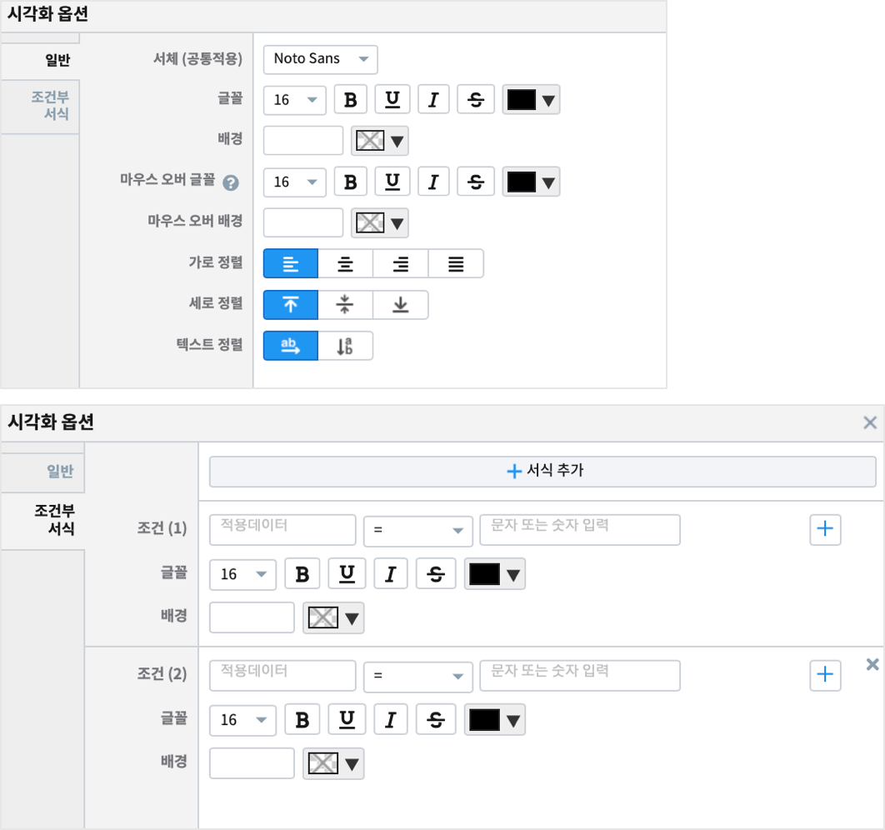
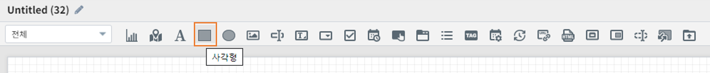
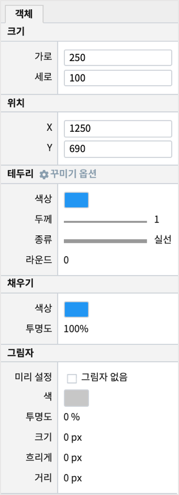
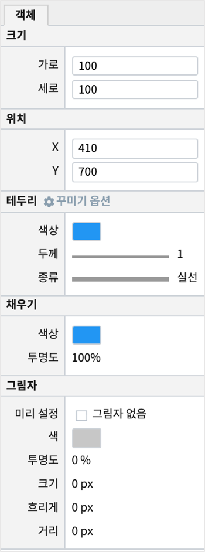
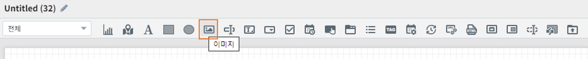
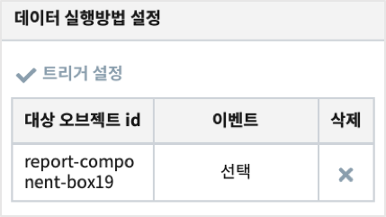
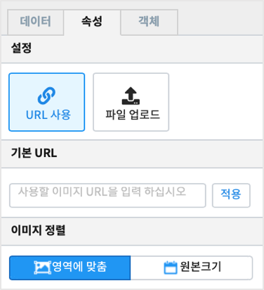
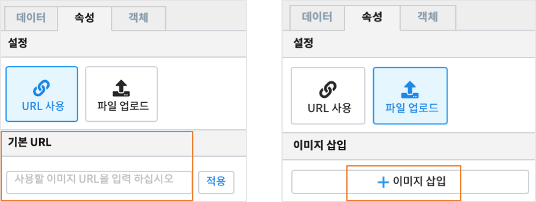

==================================================================
꾸미기 객체
==================================================================

| 텍스트나 그림, 도형 등으로 문서를 다듬거나 모양을 내기 위한 객체입니다.
| **라벨**, **사각형**, **원형**, **이미지** 가 있습니다.

--------------------------------------------------------------------------------------------------------------------------------------
라벨 (label)
--------------------------------------------------------------------------------------------------------------------------------------

.. image:: ./studio/images/label/button-label.png

| 라벨(Label)로서 객체를 사용할 수 있습니다.
| 링크 설정을 통해 Linked Text 형태로 사용할 수 있습니다.

'''''''''''''''''''''''
데이터
'''''''''''''''''''''''

..............................................................................................................................
설정할 변수/값
..............................................................................................................................

| 다른 객체로 부터 받을 데이터의 변수를 설정합니다.

.. image:: ./studio/images/input/input_01.png
    :width: 300
    :alt: 설정할 변수/값

..................................................................
링크 설정
..................................................................

| 라벨을 링크 객체로 사용하고자 할 때 사용합니다.

.. image:: ./studio/images/label/label_01.png
    :scale: 100 %
    :alt: 링크 설정

.. csv-table::
    :header: 옵션 명, 설명

    변수 값/주소, 링크에 대한 값을 설정합니다.
    타겟, "링크 타겟을 설정합니다. (self, blank)"

| 타겟이 **self** 이면 현재 있는 탭에서 링크 화면이 보이는 것이고, **blank** 는 새로운 탭에서 링크 화면이 보입니다.

''''''''''''''''''''''''''''''''''''''''''''''''''''''''''
속성
''''''''''''''''''''''''''''''''''''''''''''''''''''''''''

| 라벨 변수 값의 속성을 지정합니다.

..............................................................................
시각화 옵션
..............................................................................

**일반**

.. csv-table::
    :header: 옵션 명, 설명

    "서체", "라벨의 서체를 선택합니다."
    "글꼴", "글꼴의 크기, 스타일(굵게, 밑줄, 이탤릭체, 취소선), 색상을 선택합니다."
    "배경", "라벨의 배경 색상을 선택합니다."
    "마우스오버 글꼴", "마우스를 라벨에 둘 때의 글꼴 크기, 색상, 스타일을 지정합니다."
    "마우스오버 배경", "마우스를 라벨에 둘 때의 라벨 배경 색상을 지정합니다."
    "가로 정렬", "글자의 가로 정렬을 선택합니다. (없음, 가운데, 왼쪽, 혼합)"
    "세로 정렬", "글자의 세로 정렬을 선택합니다. (위, 중간, 아래)"
    "텍스트 정렬", "글자의 방향을 선택합니다. (가로, 세로)"

**조건부 서식**

| 라벨의 글꼴과 배경 색상이 조건에 따라 변경되어 적용하도록 합니다.
| 여러 개의 조건을 추가할 수 있습니다.

''''''''''''''''''''''''''''''''''''''''''''''''''''''''''
객체 설정
''''''''''''''''''''''''''''''''''''''''''''''''''''''''''

| 챠트의 `객체 설정 <http://docs.iris.tools/manual/IRIS-Manual/IRIS-Studio/data_visualize.html#id1>`__ 을 참조하시기 바랍니다.

------------------------------------------------------------------------------------------------------------------------------
사각형 (rectangle)
------------------------------------------------------------------------------------------------------------------------------

| 사각형 도형을 그릴 때 사용합니다.

''''''''''''''''''''''''
객체
''''''''''''''''''''''''

| 사각형의 크기/ 위치
| 내부의 채우기 색상/투명도 및 윤곽선의 그림자 유무를 선택합니다.

--------------------------------------------------------------------------------------------------------------------------------
원형 (ellipse)
--------------------------------------------------------------------------------------------------------------------------------

.. image:: ./studio/images/ellipse/button-ellipse.png

| 원형 도형을 그릴 때 사용합니다.

'''''''''''''''''''
객체
'''''''''''''''''''

| 원형의 크기/ 위치
| 내부의 채우기 색상/투명도 및 윤곽선의 그림자 유무를 선택합니다.

-----------------------------------------------------------------------------------------------------------------------------------
이미지 (image)
-----------------------------------------------------------------------------------------------------------------------------------

| 이미지 객체는 파일 또는 URL을 이용하여 이미지를 불러와 시각화할 수 있습니다.

''''''''''''''''''''''''''''''
데이터 
''''''''''''''''''''''''''''''

....................................................................................
설정할 변수/값
....................................................................................

| URL 로 이미지 파일을 가져오는 경우, URL 에 적용할 변수를 설정할 수 있습니다.
| 예) http://data.${input_1}.go.kr/imageList/${combo_1}

.. image:: ./studio/images/input/input_01.png
    :width: 300
    :alt: 설정할 변수/값

........................................................................................................................................................................
데이터 실행방법 설정
........................................................................................................................................................................

| 트리거 이벤트가 발생할 때 실행되도록 설정 할 수 있습니다.
| 트리거 설정과 변수를 활용하면 이미지 객체를 설정 값에 따라 다른 이미지파일을 불러올 수 있습니다.

......................
속성
......................

**설정**

| **URL 사용** 을 선택 후 이미지 삽입란에 URL을 입력하고 적용 버튼을 클릭하면 객체 안에 이미지를 넣을 수 있습니다.

| **파일 업로드** 를 선택 후 이미지 삽입 버튼을 클릭하여 파일을 올리면 객체 안에 이미지를 넣을 수 있습니다.

**이미지 정렬**

.. image:: ./studio/images/image/image_04.png
    :width: 300
    :alt: 이미지 정렬

.. csv-table::
    :header: "옵션 명", "설명"
    :widths: 40, 100

    "영역에 맞춤", "이미지의 크기를 객체의 사이즈에 맞게 설정합니다."
    "원본 크기", "이미지의 크기를 객체의 사이즈에 상관없이 원본 사이즈를 유지합니다."

........................................................
객체 설정
........................................................

| 크기와 위치는 챠트의 `객체 설정 <http://docs.iris.tools/manual/IRIS-Manual/IRIS-Studio/data_visualize.html#id18>`__ 을 참조하시기 바랍니다.

