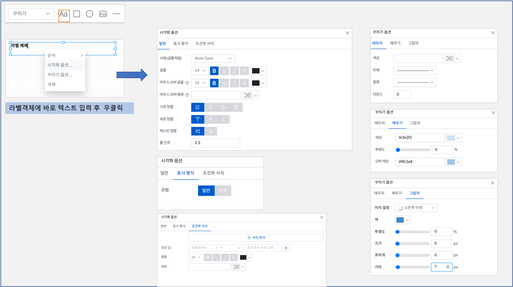
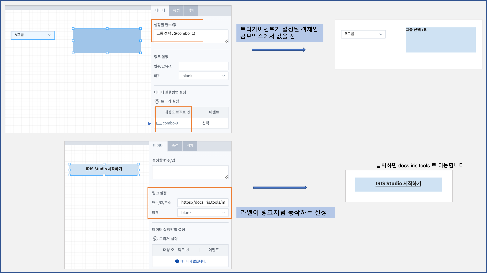
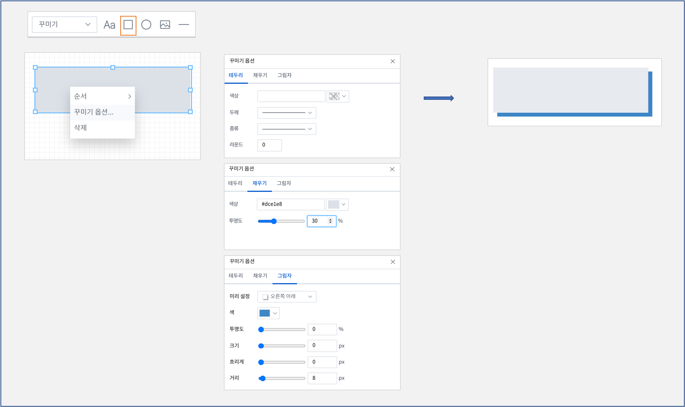
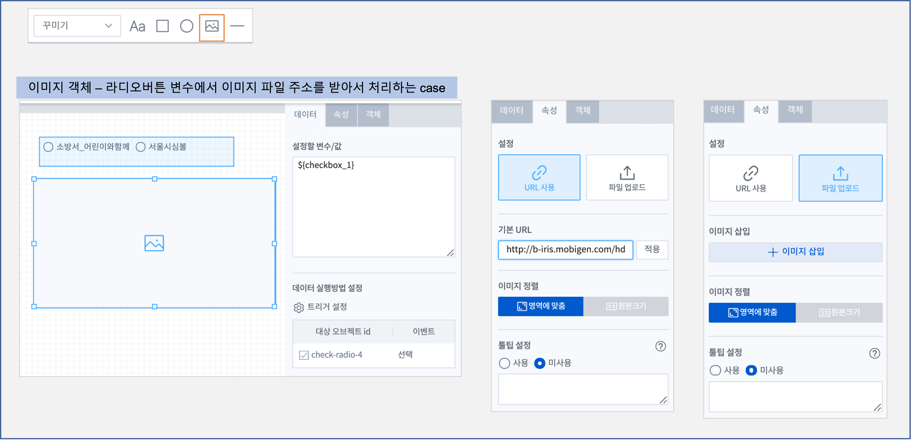
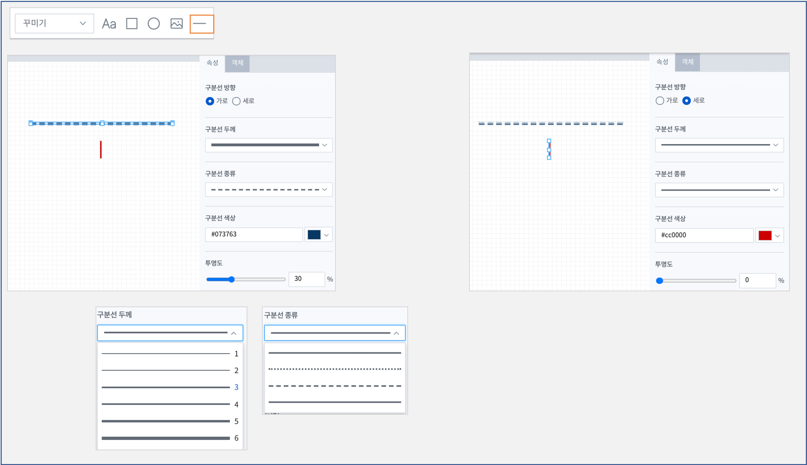

==================================================================
꾸미기 객체
==================================================================

| 텍스트나 그림, 도형 등으로 문서를 다듬거나 모양을 내기 위한 객체입니다.
| **라벨**, **사각형**, **원형**, **이미지** , **구분선** 이 있습니다.

--------------------------------------------------------------------------------------------------------------------------------------
라벨 (label)
--------------------------------------------------------------------------------------------------------------------------------------

| 라벨(Label)로서 객체를 사용할 수 있습니다.
| 링크 설정을 통해 Linked Text 형태로 사용할 수 있습니다.
|

- 라벨 객체에 text 를 바로 입력하고, **우클릭**  으로 ``시각화옵션`` , ``꾸미기옵션`` 설정하기

    

- 직접 입력하지 않고, 이벤트 변수를 받아서 설절하거나, 링크 설정으로 라벨을 클릭하면 링크된 URL 로 페이지가 이동하게 할 수 있습니다.

.. csv-table::
    :header: 옵션 명, 설명

    변수 값/주소, 링크에 대한 값을 설정합니다.
    타겟, "링크 타겟을 설정합니다. (self, blank)"

| 타겟이 **self** 이면 현재 있는 탭에서 링크 화면이 보이는 것이고, **blank** 는 새로운 탭에서 링크 화면이 보입니다.

- 시각화 옵션 : 일반

.. csv-table::
    :header: 옵션 명, 설명

    "서체", "라벨의 서체를 선택합니다."
    "글꼴", "글꼴의 크기, 스타일(굵게, 밑줄, 이탤릭체, 취소선), 색상을 선택합니다."
    "마우스오버 글꼴", "마우스를 라벨에 둘 때의 글꼴 크기, 색상, 스타일을 지정합니다.(링크 설정시)"
    "마우스오버 배경", "마우스를 라벨에 둘 때의 라벨 배경 색상을 지정합니다.(링크 설정시)"
    "가로 정렬", "글자의 가로 정렬을 선택합니다. (없음, 가운데, 왼쪽, 혼합)"
    "세로 정렬", "글자의 세로 정렬을 선택합니다. (위, 중간, 아래)"
    "텍스트 정렬", "글자의 방향을 선택합니다. (가로, 세로)"

- 시각화 옵션 : 표시 형식
    - 라벨에 설정된 텍스트가 숫자일 경우 사용할 수 있습니다.
    - 표시형식의 유형을 숫자로 설정하면 천단위로 콤마(,)를 적용할 수 있습니다.

- 시각화옵션 : 조건부 서식
    - 라벨의 글꼴과 배경 색상이 조건에 따라 변경되어 적용할 때 사용합니다.
    - 여러 개의 조건을 추가할 수 있습니다.
    - 라벨 객체의 값이 트리거 설정된 다른 객체로부터 받은 변수/값으로 설정될 때 이용할 수 있습니다. 즉 라벨 객체의 값이 이벤트 변수에 따라 달라지고, 설정된 조건에 해당하면 조건부 서식에 등록된 글꼴과 색상으로 표시됩니다. 

------------------------------------------------------------------------------------------------------------------------------
사각형 (rectangle)
------------------------------------------------------------------------------------------------------------------------------

| 사각형 도형을 그릴 때 사용합니다. 
| 꾸미기 옵션을 통해 색상, 테두리, 투명도, 그림자 설정을 합니다.

--------------------------------------------------------------------------------------------------------------------------------
원형 (ellipse)
--------------------------------------------------------------------------------------------------------------------------------

| 원형 도형을 그릴 때 사용합니다.
| 꾸미기 옵션을 통해서 색상, 테두리, 투명도, 그림자 설정을 하며, 사각형 도형과 동일한 방식입니다. 

-----------------------------------------------------------------------------------------------------------------------------------
이미지 (image)
-----------------------------------------------------------------------------------------------------------------------------------

| 이미지 객체는 파일 또는 URL을 이용하여 이미지를 불러와 시각화할 수 있습니다.
|

    

- 데이터 : 변수에 저장된 URL 을 사용하는 경우에 설정합니다.
    - 설정할 변수/값 : 
        - URL 로 이미지 파일을 가져오는 경우, URL 에 적용할 변수를 설정할 수 있습니다.
        - 예) 체크박스(라디오버튼) 에서 URL 을 가져오는 경우 등
    - 데이터 실행방법 설정
        - 트리거 이벤트가 발생할 때 실행되도록 설정 할 수 있습니다.
        - 트리거 설정과 변수를 활용하면 이미지 객체를 설정 값에 따라 다른 이미지파일을 불러올 수 있습니다.
    

- 속성 : 직접 URL 을 입력하거나 PC에 저장된 이미지 파일을 업로드하는 경우에 설정합니다.
    - URL사용 : 이미지 삽입란에 URL을 입력하고 적용 버튼을 클릭하면 객체 안에 이미지를 넣을 수 있습니다.
    - 파일 업로드 : ``+이미지 삽입`` 버튼을 클릭하여 로컬PC 에 저장된 파일을 업로드하면 객체 안에 이미지를 넣을 수 있습니다.

- 이미지 정렬
    - 영역에 맞춤 : 이미지의 크기를 객체의 사이즈에 맞게 설정합니다.
    - 원본 크기 : 이미지의 크기를 객체의 사이즈에 상관없이 원본 사이즈를 유지합니다.

-----------------------------------------------------------------------------------------------------------------------------------
구분선
-----------------------------------------------------------------------------------------------------------------------------------

| 구분선 객체는 보고서를 꾸밀 때 가로, 세로 구분선을 주고자 할 때 사용합니다.

    
- 구분선 방항 : 가로 / 세로
- 구분선 두께 : 콤보박스에서 선택합니다.
- 구분선 종류 : 콤보박스에서 선택합니다.
- 구분선 색상
- 투명도 
    

