========================================
양식 (Form) 객체
========================================

| 사용자로부터 값을 입력받기 위한 객체입니다.
| 입력받은 값을 시각화 객체 등에서 활용하여 하나의 문서/화면에서 다양한 데이터를 조회하거나 시각화가 가능합니다.

----------------------------------------------------------------------------------------------------------------------------------
텍스트 입력 (Input Box)
----------------------------------------------------------------------------------------------------------------------------------

| 텍스트 입력 객체는 Input Box에 사용자가 입력하거나 외부로부터 값을 받아 화면에 보여 줍니다.(타입: text, password, number)
| 입력하는 유형은 text, password, number 에서 선택할 수 있습니다.

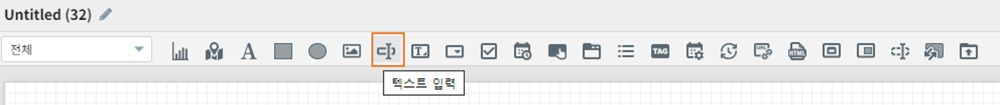

''''''''''''''''''''''''''''''''''''''
데이터 
''''''''''''''''''''''''''''''''''''''

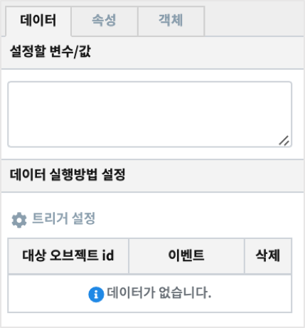

..............................................................................
설정할 변수/값
..............................................................................

| 다른 객체로 부터 받을 데이터의 변수를 설정합니다.

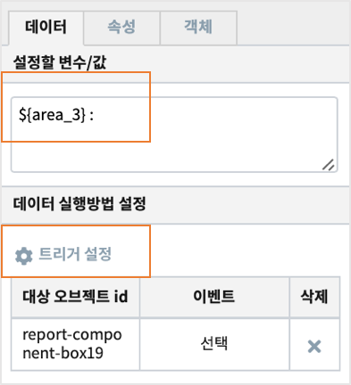

..............................................................................
데이터 실행방법 설정
..............................................................................

| 트리거 이벤트가 발생할 때 설정한 변수의 값에 따라 input Box 의 내용이 바뀌게 됩니다.
| 트리거 설정과 변수를 활용하면 설정 값에 따라 다른 내용으로 출력할 수 있습니다.

''''''''''''''''''''''''''''''''''''''''''''''''''''''''''''''''''''''''''''
속성 설정
''''''''''''''''''''''''''''''''''''''''''''''''''''''''''''''''''''''''''''

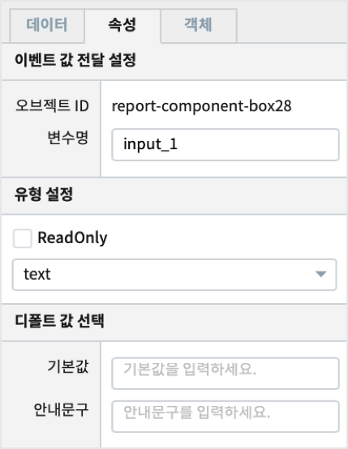

**이벤트 값 전달 설정**

| 해당 객체의 값을 참조하고자 할 때 사용하는 내용이 표시됩니다.

.. csv-table::
    :header: 옵션 명, 설명

    오브젝트 ID, 해당 객체의 고유 아이디로 자동으로 할당됩니다.
    변수 명, 해당 객체를 사용하기 위한 변수명으로 사용자가 지정할 수 있습니다.

**유형 설정**

| Input Box의 타입을 설정합니다. 
| "ReadOnly" 는 변수설정에 따라 변화되는 값이 Input Box 에 표시만 될 뿐 직접 입력하지는 못합니다.

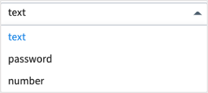

**디폴트 값 선택**

| 디폴트 값은 아직 어떤 값도 표시가 되어 있지 않을 때 Input Box 에 표시할 내용을 정할 수 있습니다.
| 변수 설정이나 트리거 설정, 입력 등으로 값이 채워지면 디폴트 값은 표시되지 않습니다.

.. image:: ./studio/images/input/input_03.png
    :width: 300
    :alt: 디폴트 값 선택

.. csv-table::
    :header: "옵션 명", "설명"
    :widths: 40, 150

    "기본 값", "Input Box에 초기값 텍스트를 설정합니다."
    "안내문구", "안내문구, 예시 등을 입력합니다. "

''''''''''''''''
객체
''''''''''''''''

| 크기와 위치는 챠트의 `객체 설정 <http://docs.iris.tools/manual/IRIS-Manual/IRIS-Studio/data_visualize.html#id18>`__ 을 참조하시기 바랍니다.

----------------------------------------------------------------------------------------------------------------------------------
텍스트 상자(Text Area)
----------------------------------------------------------------------------------------------------------------------------------

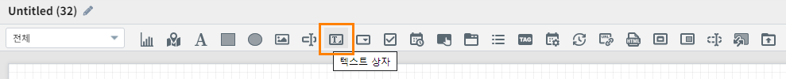

| 텍스트 상자 객체는 Text Area에 사용자가 입력하거나 외부로부터 값을 받아 화면에 보여 줍니다.
| 줄바꿈 문자가 포함된 여러 줄의 텍스트를 입력, 처리가 가능합니다.

''''''''''''''''''''''''''''''''''''''''''''''''''''''''''''''
데이터 설정
''''''''''''''''''''''''''''''''''''''''''''''''''''''''''''''

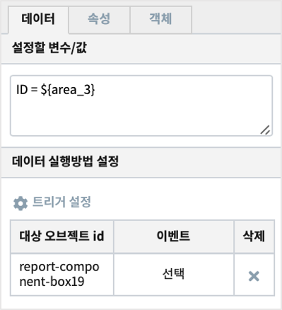

**설정할 변수/값**

| 다른 객체로 부터 받을 데이터의 변수를 설정합니다.

**데이터 실행방법 설정**

| 트리거 이벤트가 발생할 때 설정한 변수의 값에 따라 input Box 의 내용이 바뀌게 됩니다.
| 트리거 설정과 변수를 활용하면 설정 값에 따라 다른 내용으로 출력할 수 있습니다.

''''''''''''''''''''''''''''''''''''''''''''''''''''''''''''''''''''''''''''''''''''''''''''''''''''''''''''
속성 설정
''''''''''''''''''''''''''''''''''''''''''''''''''''''''''''''''''''''''''''''''''''''''''''''''''''''''''''

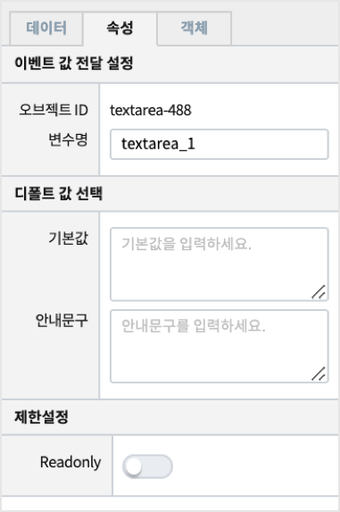

**이벤트 값 전달 설정**

| 해당 객체의 값을 참조하고자 할 때 사용하는 내용이 표시됩니다.

.. csv-table::
    :header: 옵션 명, 설명

    오브젝트 ID, 해당 객체의 고유 아이디로 자동으로 할당됩니다.
    변수 명, 해당 객체를 사용하기 위한 변수명으로 사용자가 지정할 수 있습니다.

.. image:: ./studio/images/common/event_01.png
    :scale: 100 %
    :alt: 이벤트값 전달 설정

**유형 설정**

Text Area에 읽기만 가능하도록 설정합니다.

.. image:: ./studio/images/textarea/textarea_02.png
    :width: 300
    :alt: 유형 설정

**디폴트 값 선택**

| 디폴트 값은 아직 어떤 값도 표시가 되어 있지 않을 때 Text Area 에 표시할 내용을 정할 수 있습니다.
| 변수 설정이나 트리거 설정, 입력 등으로 값이 채워지면 디폴트 값은 표시되지 않습니다.

.. csv-table::
    :header: "옵션 명", "설명"
    :widths: 40, 100

    "기본 값", "Text Area에 초기값 텍스트를 설정합니다."
    "안내문구", "Text Area에 placeholder를 설정합니다."

''''''''''''''''''''''''''''''''''''''''''''''''''''''''
객체 설정
''''''''''''''''''''''''''''''''''''''''''''''''''''''''

| 챠트의 `객체 설정 <http://docs.iris.tools/manual/IRIS-Manual/IRIS-Studio/data_visualize.html#id18>`__ 을 참조하시기 바랍니다.

--------------------------------------------------------------------------------------------------------------------------------------------------
콤보박스 (Combo Box)
--------------------------------------------------------------------------------------------------------------------------------------------------

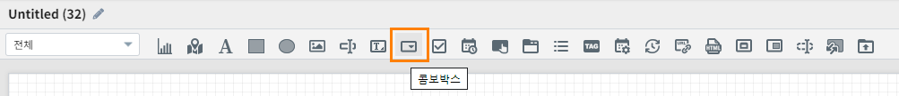

| 사용자가 드롭다운 목록에서 한 항목을 선택할 수 있습니다. 
| 콤보박스 목록의 데이터는 '데이터' 탭과 '사용자 정의'로 설정할 수 있습니다.
| 콤보박스의 데이터는 `데이터객체 <http://docs.iris.tools/manual/IRIS-Manual/IRIS-Studio/data.html#id1>`__ 와 데이터 연결(`챠트의 데이터 연결 <http://docs.iris.tools/manual/IRIS-Manual/IRIS-Studio/data_visualize.html#id1>`__) 로 설정하여 가져옵니다.

''''''''''''''''''''''''''''''''''''''''''''''''''''''''''''''''
데이터 설정
''''''''''''''''''''''''''''''''''''''''''''''''''''''''''''''''

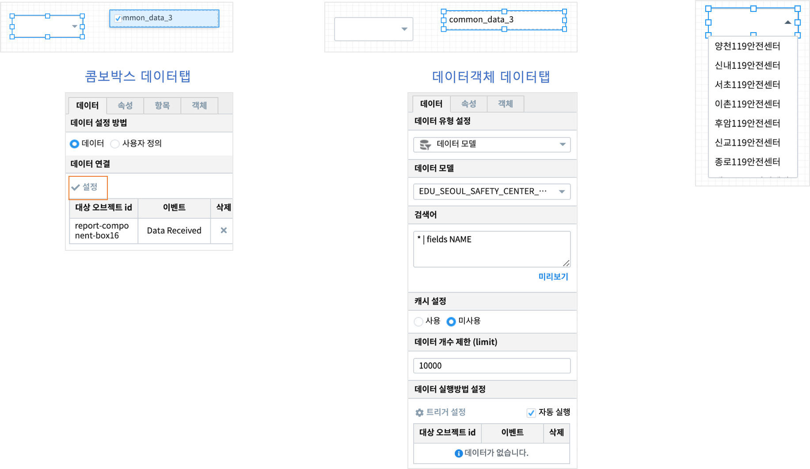

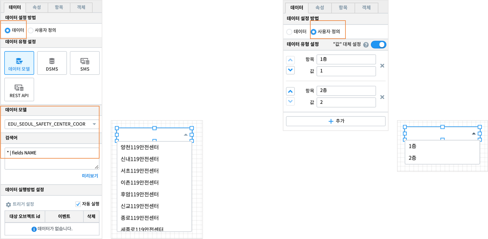

............................
데이터
............................

| 데이터 설정은 챠트의 `데이터설정 <http://docs.iris.tools/manual/IRIS-Manual/IRIS-Studio/data_visualize.html#id1>`__ 과 동일합니다.

....................................................................................................
사용자 정의
....................................................................................................

| 사용자 정의 데이터 목록을 작성 할 수 있고, 1개 이상의 목록을 작성 할 경우, 추가 버튼을 클릭하여 데이터를 추가 할 수 있습니다.

.. image:: ./studio/images/combo/combo_01.png
  :width: 270
  :alt: 콤보박스 사용자 정의

.. csv-table::
    :header: "항목", "설명"

    "항목", "목록에 보여지는 텍스트 설정 입니다."
    "값", "항목(텍스트)에 대응되는 데이터 값 입니다."

''''''''''''''''''''''''''''''''''''''''''''''''''''
속성
''''''''''''''''''''''''''''''''''''''''''''''''''''

............................................................................................................................
이벤트 값 전달 설정
............................................................................................................................

| 해당 객체의 값을 참조하고자 할 때 사용하는 내용이 표시됩니다.

.. csv-table::
    :header: 옵션 명, 설명

    오브젝트 ID, 해당 객체의 고유 아이디로 자동으로 할당됩니다.
    변수 명, 해당 객체를 사용하기 위한 변수명으로 사용자가 지정할 수 있습니다.

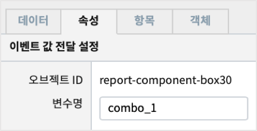

.........................................................................................................................
에디터 기능
.........................................................................................................................

| 콤보박스를 선택한 후에 콤보박스의 목록 필드를 직접 입력하여 검색하는 기능 입니다. (사용: 입력 검색, 미사용: 입력 불가)

.. image:: ./studio/images/combo/combo_02.png
  :width: 270
  :alt: 콤보박스 에디터 기능

.........................................................................................................................
화면에 보여질 필드 선택
.........................................................................................................................

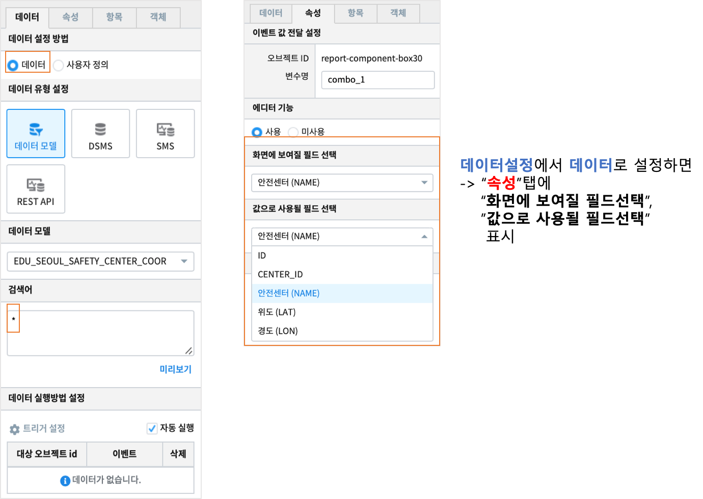

| 데이터 설정을 "사용자 정의" 가 아닌 "데이터" 를 선택할 경우에 보입니다. 

.........................................................................................................................
값으로 사용될 필드 선택
.........................................................................................................................

| 데이터 설정을 "사용자 정의" 가 아닌 "데이터" 를 선택할 경우에 보입니다. 

.........................................................................................................................
트리거 설정 확인
.........................................................................................................................

| 챠트의 `트리거 설정 확인 <http://docs.iris.tools/manual/IRIS-Manual/IRIS-Studio/data_visualize.html#id16>`__ 을 참고하시기 바랍니다.

''''''''''''''''''''''''''''''''
항목
''''''''''''''''''''''''''''''''

| 콤보박스의 변수명을 설정해 변수명의 데이터 값으로 콤보박스의 목록의 값을 찾아 자동으로 선택해 주는 기능 입니다.

.......................................................................................................................
디폴트 값 선택
.......................................................................................................................

| 조회된 목록 중에 디폴트 값을 설정 할 수 있습니다. 
| 콤보박스 항목을 선택하기 전이라도 이벤트값에 디폴트 값이 저장되어 전달됩니다.
| 트리거로 콤보박스를 선택 이벤트로 설정한 객체가 있다면, 콤보박스의 항목을 선택하기 전이라도 디폴트값을 수신받아 처리할 수 있습니다.  

.. image:: ./studio/images/combo/combo_05.png
  :width: 270
  :alt: 디폴트 값 선택

.. csv-table::
    :header: "항목", "설명"

    "미선택", "콤보박스 디폴트 값을 설정하지 않습니다."
    "직접입력", "콤보박스 디폴트 값을 직접 입력하여 설정합니다."

..............................................................................................................................
항목 설정 변수
..............................................................................................................................

| **데이터** 설정에서 **사용자 정의** 를 선택한 경우에 트리거에 의한 이벤트로 전달받은 변수를 콤보박스의 디폴트항목으로 설정하여 사용합니다.
| 사용자 정의 에서 따로 항목을 입력하고 디폴트항목을 설정했더라도
| 트리거 이벤트가 발생하면 항목 설정 변수의 값이 콤보박스에 추가되고, 동시에 디폴트 항목으로 설정됩니다. 

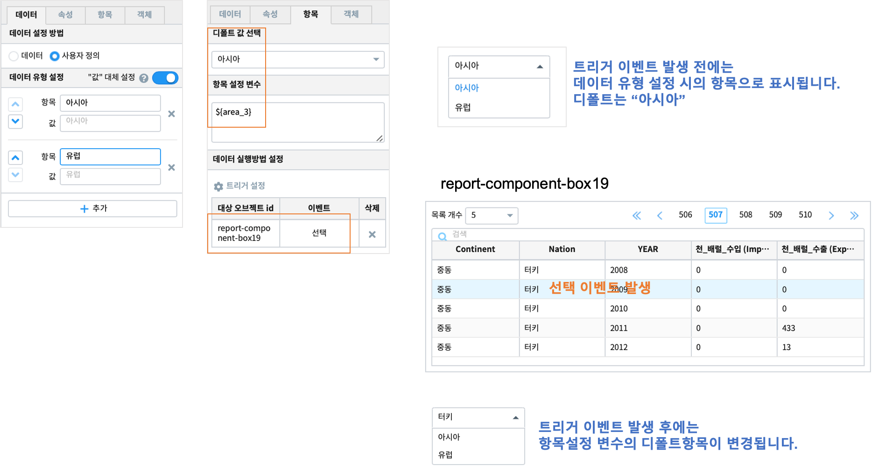

......................................................................................................................
데이터 실행방법 설정
......................................................................................................................

| 챠트의 `데이터 실행방법 설정 <http://docs.iris.tools/manual/IRIS-Manual/IRIS-Studio/data_visualize.html#id5>`__ 을 참고하시기 바랍니다.

-------------------------------------------------------------------------------------------------------------
체크박스/라디오버튼 (Check Box / Radio Button)
-------------------------------------------------------------------------------------------------------------

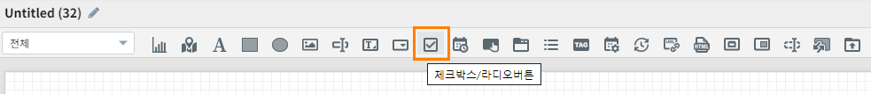

| 체크박스/라디오버튼 객체로 전환 설정 가능합니다.
| 유형을 선택하여, 객체의 속성을 변경할 수 있고, 체크박스가 기본값 입니다.

''''''''''''''''''''''''''''''''''''''''''''''''''''''''''''''''''''''''''''''''''''''''''''''''''''''''''''''''''''''''
데이터 설정
''''''''''''''''''''''''''''''''''''''''''''''''''''''''''''''''''''''''''''''''''''''''''''''''''''''''''''''''''''''''

| 데이터 설정은 챠트의 `데이터설정 <http://docs.iris.tools/manual/IRIS-Manual/IRIS-Studio/data_visualize.html#id1>`__ 을 참고하시기 바랍니다.

..................................................................................................................
사용자 정의
..................................................................................................................

| 사용자 정의 데이터 목록을 작성 할 수 있고, 1개 이상의 목록을 작성 할 경우, 추가 버튼을 클릭하여 데이터를 추가 할 수 있습니다.

................................................................................
데이터 사용자 정의
................................................................................

| 사용자 정의 데이터를 설정 할 수 있습니다.

.. image:: ./studio/images/check_radio/check_radio_01.png
  :width: 270
  :alt: 데이터 사용자 정의

''''''''''''''''''''''''''''
속성
''''''''''''''''''''''''''''

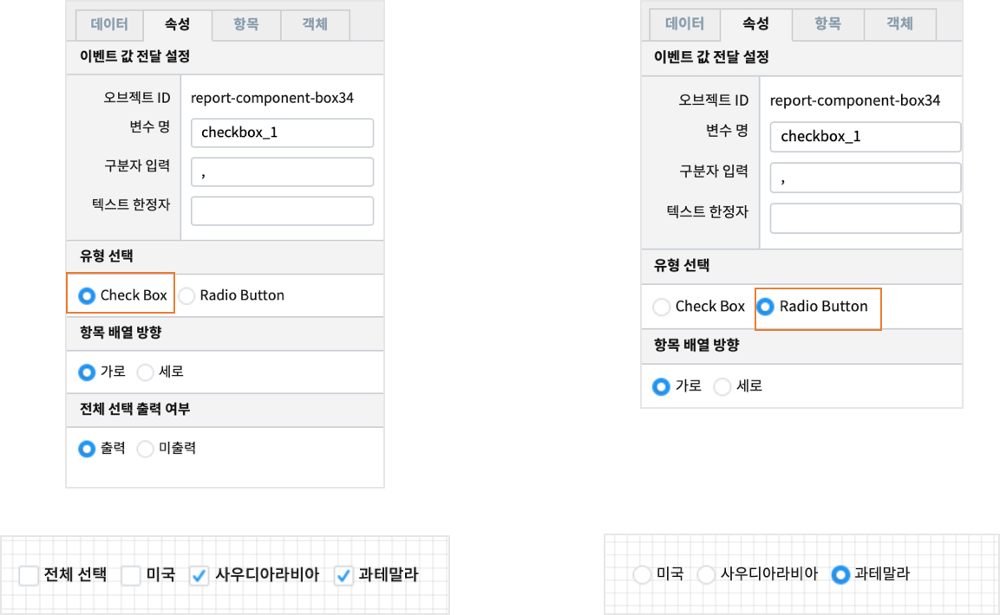

| Check Box는 여러 개의 항목을 선택하거나 전체 선택도 가능하지만, Radio Button 은 1개 항목만 선택 가능합니다.  

....................................................................................................................
이벤트 값 전달 설정
....................................................................................................................

| 이벤트 발생시 정의한 설정값을 전달 합니다.

.. csv-table::
    :header: "항목", "설명"

    "변수명", "오브젝트의 변수명 할당합니다."
    "구분자 입력", "선택한 항목이 여러 개일 때 데이터 구분자를 설정합니다."
    "텍스트 한정자", "목록 데이터의 텍스트 한정자를 설정합니다. (예: ‘data1’, “data1”)"

....................................................................................................................
유형 선택
....................................................................................................................

| 체크박스/라디오버튼 유형을 선택 합니다.

.. image:: ./studio/images/check_radio/check_radio_02.png
  :width: 270
  :alt: 체크박스/라디오버튼 유형 선택

.. csv-table::
    :header: "항목", "설명"

    "Check Box", "화면에 보이는 UI를 체크박스로 설정합니다."
    "Radio Button", "화면에 보이는 UI를 라디오버튼으로 설정합니다."

............................................................................................
항목 배열 방향
............................................................................................

| 체크박스/라디오버튼 배열 방향을 설정합니다.

.. image:: ./studio/images/check_radio/check_radio_04.png
  :width: 270
  :alt: 체크박스/라디오버튼 배열 방향

.. csv-table::
    :header: "항목", "설명"

    "가로", "가로 방향으로 정렬 합니다."
    "세로", "세로 방향으로 정렬 합니다."

..............................................................................................
전체 선택 출력 여부
..............................................................................................

| Check Box 로 유형을 선택한 경우에만 보입니다.
| 전체 선택 출력 여부를 출력으로 선택하면 "전체 선택" 항목이 항목의 제일 앞부분에 출력됩니다.

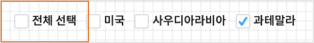

''''''''''''''''''''''''''''''
항목
''''''''''''''''''''''''''''''

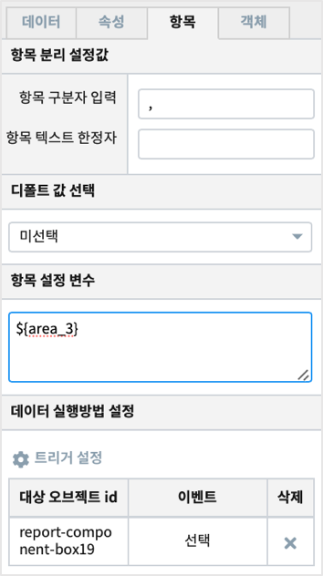

...............................................................................................
항목 분리 설정값
...............................................................................................

| 항목설정 변수에 저장된 값이 여러 개인 경우, 구분자로 각 값을 분리합니다.
| 이 때 사용될 구분자를 입력합니다. 디폴트는 콤마(,) 입니다. 

....................................................................................................................
디폴트 값 선택
....................................................................................................................

| check Box 와 radio button 의 항목들 중에서 디폴트로 선택 항목을 설정 할 수 있습니다.

.. image:: ./studio/images/check_radio/check_radio_03.png
  :width: 270
  :alt: 체크박스/라디오버튼 디폴트 값 선택

.. csv-table::
    :header: "항목", "설명"

    "미선택", "디폴트 값을 설정하지 않습니다."
    "직접선택", "디폴트 값을 직접 입력하여 설정합니다."

....................................................................................................................
항목 설정 변수
....................................................................................................................

| 트리거에 의한 이벤트로 전달받은 변수를  check Box 와 radio button 의 디폴트항목으로 설정하여 사용합니다.
| 사용자 정의 에서 따로 항목을 입력하고 디폴트항목을 설정했더라도
| 트리거 이벤트가 발생하면 항목 설정 변수의 값이 선택됩니다. 

......................................................................................................................
데이터 실행방법 설정
......................................................................................................................

| 챠트의 `데이터 실행방법 설정 <http://docs.iris.tools/manual/IRIS-Manual/IRIS-Studio/data_visualize.html#id5>`__ 을 참고하시기 바랍니다.

'''''''''''''''''''''''''
객체
'''''''''''''''''''''''''

| 크기와 위치는 챠트의 `객체 설정 <http://docs.iris.tools/manual/IRIS-Manual/IRIS-Studio/data_visualize.html#id18>`__ 과 동일합니다.

------------------------------------------------------------------------------------------------------------------------------------------------------------------------------
날짜/시간 선택(Date / Time Picker)
------------------------------------------------------------------------------------------------------------------------------------------------------------------------------

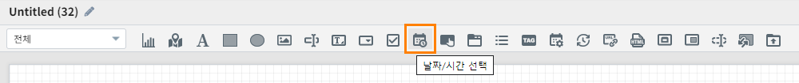

날짜 선택 시 달력으로 시작/종료/현재 날짜를 설정할 수 있고, 시간 선택 시 시작 시간 & 시간 간격을 설정 할 수 있습니다.

'''''''''''''''''''
속성
'''''''''''''''''''

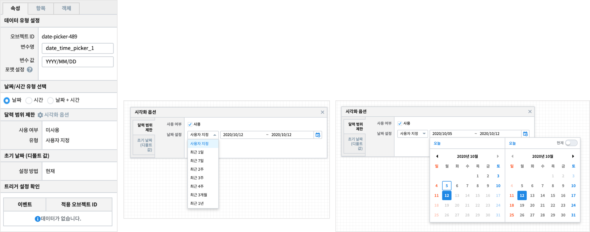

................................................................................................
데이터 유형 설정
................................................................................................

| 입력받는 날짜 및 시간의 데이터 포맷을 설정합나다.

................................................................................................
날짜/시간 유형 선택
................................................................................................

| 날짜/시간에 대한 유형선택으로 시각화 옵션이 달라 집니다.

.. image:: ./studio/images/date_picker/date_picker_01.png
  :width: 270
  :alt: 날짜/시간 유형 선택

.. csv-table::
    :header: "항목", "설명"

    "날짜", "달력 표시 날짜/초기 날짜 설정을 할 수 있습니다."
    "시간", "시간 선택 간격/초기 시간 설정을 할 수 있습니다."

................................................................................................
달력 표시 날짜 설정
................................................................................................

| 날짜 유형을 선택한 경우에만 활성화 되며, 달력 표시 날짜를 설정합니다.

.. image:: ./studio/images/date_picker/date_picker_02.png
  :width: 480
  :alt: 시각화옵션 달력 표시 날짜 설정

.. csv-table::
    :header: "항목", "설명"

    "사용여부", "선택 시 시작/종료 날짜를 설정 가능하지만, 미선택 시 시작/종료 날짜를 설정할 수 없습니다."
    "시작 날짜", "시작 날짜를 선택 합니다."
    "종료 날짜", "종료 날짜를 선택 합니다."
    "현재 날짜", "기본값은 미선택이며, 선택 시 종료 날짜는 설정할 수 없고, 현재 날짜로 종료 날짜가 설정 됩니다."

................................................................................................
초기 날짜 설정
................................................................................................

| 날짜 유형을 선택한 경우에만 활성화 되며, 초기 날짜를 설정합니다.

.. image:: ./studio/images/date_picker/date_picker_03.png
  :width: 480
  :alt: 시각화옵션 초기 날짜 설정

.. csv-table::
    :header: "항목", "설명"

    "현재 날짜 선택", "기본값은 선택이며, 현재 날짜로 초기 날짜를 설정합니다. 미선택 시 초기날짜를 설정 할 수 있습니다."
    "날짜", "현재 날짜 선택이 미선택 시 설정 가능하며, 선택 시에는 날짜가 비 활성화 됩니다."

................................................................................................
시간 선택 간격
................................................................................................

| 시간 유형을 선택한 경우에만 활성화 되며, 시간을 설정합니다.

.. image:: ./studio/images/date_picker/date_picker_04.png
  :width: 480
  :alt: 시각화옵션 시간 선택 간격

.. csv-table::
    :header: "항목", "설명"

    "분", "분을 설정합니다."
    "초", "초를 설정합니다."

...................................................................................
초기 시간 설정
...................................................................................

| 시간 유형을 선택한 경우에만 활성화 되며, 초기 시간을 설정합니다.

.. image:: ./studio/images/date_picker/date_picker_05.png
  :width: 480
  :alt: 시각화옵션 초기 시간 설정

.. csv-table::
    :header: "항목", "설명"

    "현재 시간 선택", "기본값은 선택이며, 현재 시간으로 초기 시간을 설정합니다. 미선택 시 초기 시간을 설정 할 수 있습니다."
    "분", "분을 설정합니다."
    "초", "초를 설정합니다."

'''''''''''''''''''''''''''''''
객체
'''''''''''''''''''''''''''''''

| 크기와 위치는 챠트의 `객체 설정 <http://docs.iris.tools/manual/IRIS-Manual/IRIS-Studio/data_visualize.html#id18>`__ 을 참조하시기 바랍니다.

--------------------------------------------------------------------------------------------------------------
기간 설정
--------------------------------------------------------------------------------------------------------------

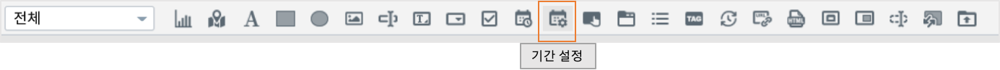

| 조회할 기간을 선택할 수 있는 박스를 만드는 메뉴입니다.
| 출력하는 데이터의 조회 시작 시간과 끝 시간을 설정할 수 있습니다. 
| 또는 조회할 기간의 목록을 미리 만들어서 콤보박스 형태에서 선택할 수 있습니다.

'''''''''''''''''''
속성
'''''''''''''''''''

.....................................................................................................................
이벤트 값 전달 설정
.....................................................................................................................

| 데이터 조회 시작 시간과 끝 시간의 시간 포맷을 설정합니다. 이 값은 설정된 변수에 startDate, endDate 라는 attribute key 로 저장됩니다.
| 예) ${period_setting_1.startDate}  ${period_setting_1.endDate}

...............................................................................
시간 설정
...............................................................................

**시간 목록 구성**

| 여러 개의 기간을 목록으로 구성한 후 콤보박스에서 기간을 선택하여 조회 할 수 있습니다.

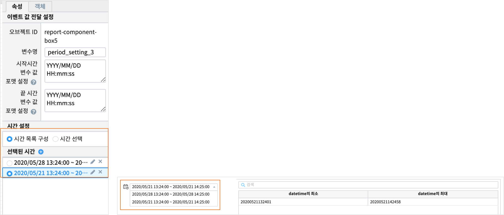

**시간 선택**

| 시간 설정 팝업창에서 "미리 설정", "날짜 및 시간 범위" 를 선택하여 시작 시간, 끝 시간을 정할 수 있습니다.

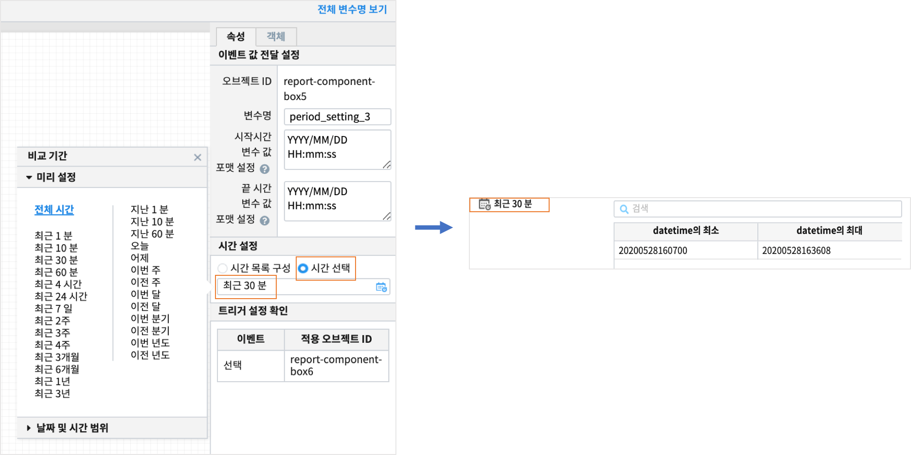

-------------------------------------------------------------------
에디터 (editor)
-------------------------------------------------------------------

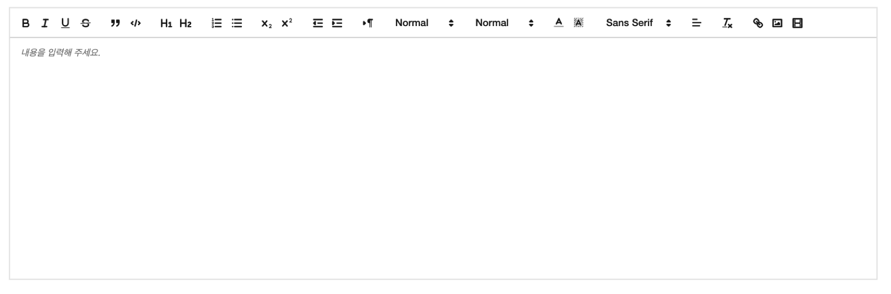

| 게시판같은 화면을 만들 때 사용할 수 있는 텍스트 에디터입니다.
|
| 화면 결과

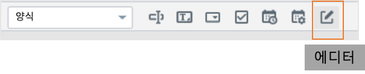

'''''''''''''''''''''''''''''''''''''''''''''''''''''''''''''''''''''
데이터
'''''''''''''''''''''''''''''''''''''''''''''''''''''''''''''''''''''

| 에디터 객체에서 디폴트 또는 기본값으로 미리 출력되는 값을 설정합니다. 

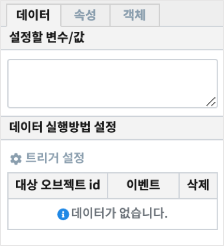

..............................................................................
설정할 변수/값
..............................................................................

| 다른 객체로 부터 받을 데이터의 변수를 설정합니다.

..............................................................................
데이터 실행방법 설정
..............................................................................

| 트리거 이벤트가 발생할 때 설정한 변수의 값에 따라 에디터의 디폴트값/기본 값의 내용이 바뀌게 됩니다.
| 트리거 설정과 변수를 활용하면 설정 값에 따라 다른 내용으로 출력할 수 있습니다.

''''''''''''''''''''''''''''''''''''''''''''''''''''
속성
''''''''''''''''''''''''''''''''''''''''''''''''''''

.. image:: ./studio/images/editor/studio_editor_04.png
    :scale: 60%
    :alt: 속성

....................................................................................................................
이벤트 값 전달 설정
....................................................................................................................

| 해당 객체의 값을 참조하고자 할 때 사용하는 내용이 표시됩니다.

.. csv-table::
    :header: 옵션 명, 설명

    오브젝트 ID, 해당 객체의 고유 아이디로 자동으로 할당됩니다.
    변수 명, 해당 객체를 사용하기 위한 변수명으로 사용자가 지정할 수 있습니다.

....................................................................................................................
디폴트 값 선택
....................................................................................................................

| 디폴트 값은 텍스트 에디터에 입력하기 전에 에디터 box 에 표시할 내용을 정할 수 있습니다.
| 변수 설정이나 트리거 설정, 입력 등으로 값이 채워지면 디폴트 값은 표시되지 않습니다.

.. csv-table::
    :header: "옵션 명", "설명"
    :widths: 40, 150

    "기본 값", "에디터 Box에 초기값 텍스트를 설정합니다."
    "안내문구", "안내문구, 예시 등을 입력합니다. "

'''''''''''''''''''''''''''''''
객체
'''''''''''''''''''''''''''''''

| 챠트의 `객체 설정 <http://docs.iris.tools/manual/IRIS-Manual/IRIS-Studio/data_visualize.html#id18>`__ 을 참조하시기 바랍니다.
