========================================
양식 (Form) 객체
========================================

사용자로부터 값을 입력받을 때 사용되는 객체입니다.

----------------------------------------------------------------------------------------------------------------------------------
텍스트 입력 (Input Box)
----------------------------------------------------------------------------------------------------------------------------------

.. image:: ./studio/image_3_1_x/form_01.png
    :scale: 30%

텍스트 입력 객체는 사용자로부터 값을 입력받기 위한 객체입니다. 입력받는 값의 타입은 text, password, number 가 있습니다.

- 사용자 직접 입력하기

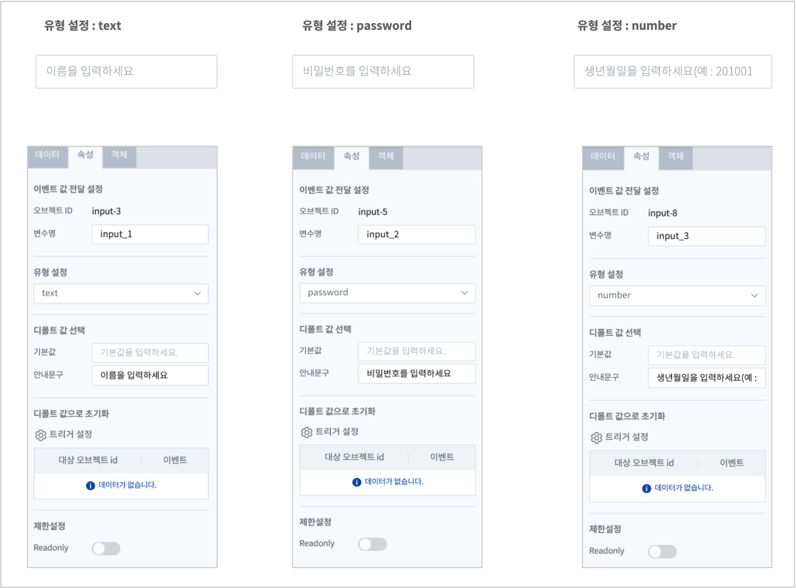

- 다른 객체의 변수를 입력값으로 사용하기 (예: 콤보박스)
    - 텍스트 입력 객체의 입력값을 트리거로 설정한 다른 객체(콤보박스) 의이벤트 변수값으로만 처리하는 경우에는 ``Read only`` 로 설정합니다.

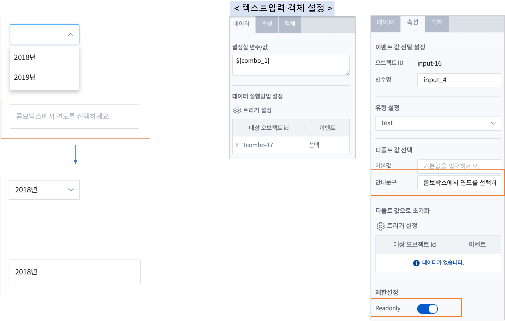

**설정**

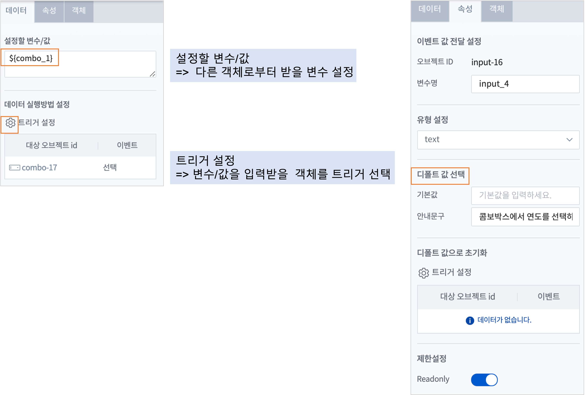

- 디폴트 값 선택
    - 디폴트 값은 아직 어떤 값도 표시가 되어 있지 않을 때 Input Box 에 표시할 내용을 정할 수 있습니다.
    - 변수 설정이나 트리거 설정, 입력 등으로 값이 채워지면 디폴트 값은 표시되지 않습니다.

.. csv-table::
    :header: "옵션 명", "설명"
    :widths: 40, 150

    "기본 값", "Input Box에 초기값 텍스트를 설정합니다."
    "안내문구", "안내문구, 예시 등을 입력합니다. "

- 제한설정
    - "ReadOnly" 을 켜면 변수설정에 따라 변화되는 값이 Input Box 에 표시만 될 뿐 직접 입력하지는 못합니다.

----------------------------------------------------------------------------------------------------------------------------------
텍스트 상자(Text Area)
----------------------------------------------------------------------------------------------------------------------------------

텍스트 상자 객체는 Text Area에 사용자가 입력하거나 외부로부터 값을 받아서 보여 줍니다. 

줄바꿈 문자가 포함된 여러 줄의 텍스트를 입력, 처리가 가능합니다.

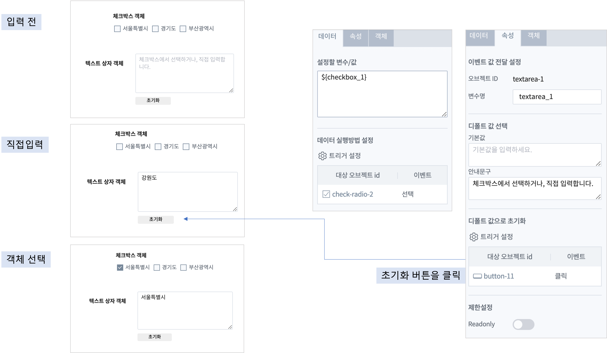

- 설정할 변수/값
    - 직접 입력하지 않고, 다른 객체로 부터 받을 때, 텍스트 상자에 표시할 변수/값을 설정합니다.
- 데이터 실행방법 설정
    - 이벤트를 받을 객체를 선택합니다. 
    - 트리거 설정과 변수를 활용하면 설정 값에 따라 다른 내용으로 출력할 수 있습니다.
- 디폴트 값 선택
    - 디폴트 값은 아직 어떤 값도 표시가 되어 있지 않을 때 텍스트 상자객체에 표시할 내용을 지정할 수 있습니다.
    - 기본값 : 텍스트 상자 객체의 변수에 초기값으로 저장되는 값
    - 안내 문구 : 텍스트 상자에 표시하는 문구. 이 문구는 변수로 저장되지는 않습니다.
- 디폴트 값으로 초기화
    - 주로 ``초기화``  버튼을 클릭하는 이벤트로 텍스트 상자 객체의 변수에 저장된 값을 디폴트 값으로 변경합니다.
- 제한설정
    - Readonly 를 켜서 읽기만 가능하도록 설정합니다. 직접 입력하지 않고 다른 객체로부터 값을 전달받아서 처리할 때 사용됩니다.

--------------------------------------------------------------------------------------------------------------------------------------------------
콤보박스 (Combo Box)
--------------------------------------------------------------------------------------------------------------------------------------------------

사용자가 드롭다운 목록에서 한 항목을 선택할 수 있습니다. 

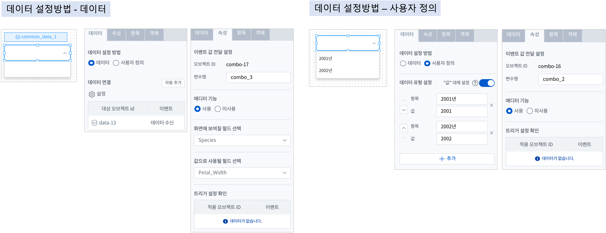

- 데이터 설정 방법
    - 데이터 : 데이터객체를 연결하여 값을 가져옵니다.
    - 사용자 정의 : 사용자가 직접 콤보박스의 항목과 값을 입력합니다.

- 에디터 기능
    - 콤보박스를 선택한 후에 콤보박스의 목록 필드를 직접 입력하여 검색하는 기능 입니다. (사용: 입력 검색, 미사용: 입력 불가)

- 화면에 보여질 필드 선택
    - 데이터객체에서 가져오는 데이터의 필드에서 화면에 표시되는 필드를 선택합니다.
- 값으로 사용될 필드 선택
    - 데이터객체에서 가져오는 데이터의 필드에서 콤보박스 객체의 변수값에 저장되는 필드를 선택합니다. 콤보박스객체의 변수에 저장된 값은 ``전체변수명``  에서 확인가능합니다.

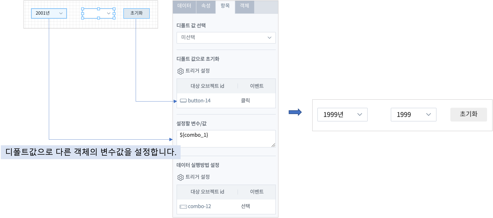

- 디폴트 값 선택
    - 조회된 목록 중에 디폴트 값을 설정 할 수 있습니다. 
    - 콤보박스 항목을 선택하기 전이라도 이벤트값에 디폴트 값이 저장되어 전달됩니다.
- 디폴트 값으로 초기화
    - 주로 ``초기화``  버튼을 클릭하는 이벤트로 콤보박스 객체의 변수에 저장된 값을 디폴트 값으로 변경합니다.
- 설정할 변수/값
    - 트리거로 다른 객체를 설정하면 이벤트 발생한 객체의 선택값이 디폴트값으로 표시됩니다.  

-------------------------------------------------------------------------------------------------------------
체크박스/라디오버튼 (Check Box / Radio Button)
-------------------------------------------------------------------------------------------------------------

체크박스/라디오버튼 객체는 서로 전환해서 설정이 가능합니다.
유형을 선택하면 객체의 속성을 변경할 수 있으며, 체크박스가 기본값 입니다.

체크박스는 여러 개의 항목을 선택하거나 전체 선택도 가능하지만, 라디오 버튼은 1개 항목만 선택 가능합니다. 

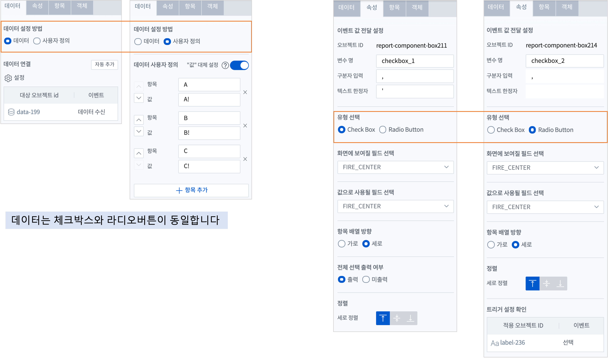

- 데이터 설정 방법 : 데이터설정 방법은 체크박스와 라디오버튼 객체는 동일합니다.
    - 데이터 : 데이터객체를 연결하여 값을 가져옵니다.
    - 사용자 정의 : 사용자가 직접 체크박스와 라디오버튼의 항목과 값을 입력합니다.

- 이벤트 값 전달 설정
    - 이벤트 발생시 정의한 설정값을 전달 합니다.

.. csv-table::
    :header: "항목", "설명"

    "변수명", "오브젝트의 변수명 할당합니다."
    "구분자 입력", "선택한 항목이 여러 개일 때 데이터 구분자를 설정합니다."
    "텍스트 한정자", "목록 데이터의 텍스트 한정자를 설정합니다. (예: ‘data1’, “data1”)"

- 유형 선택 : 체크박스와 라디오버튼으로 서로 전환하여 설정이 가능합니다.

- 화면에 보여질 필드 선택
    - 데이터객체에서 가져오는 데이터의 필드에서 화면에 표시되는 필드를 선택합니다.
- 값으로 사용될 필드 선택
    - 데이터객체에서 가져오는 데이터의 필드에서 체크박스/라디오버튼 객체의 변수값에 저장되는 필드를 선택합니다. 체크박스/라디오버튼 객체의 변수에 저장된 값은 ``전체변수명``  에서 확인가능합니다.

- 항목 배열 방향
    - 체크박스/라디오버튼 배열 방향을 설정합니다. 가로/세로

- 전체 선택 출력 여부
    - Check Box 로 유형을 선택한 경우에만 보입니다.
    - 전체 선택 출력 여부를 출력으로 선택하면 ``전체 선택`` 항목이 항목의 제일 앞부분에 출력됩니다.

- 정렬 : 항목 텍스트의 정렬

- 트리거 설정 확인
    - 체크박스와 라디오버튼 객체의 항목을 다른 객체의 이벤트 변수로 수신받아서 처리할 수 있습니다.

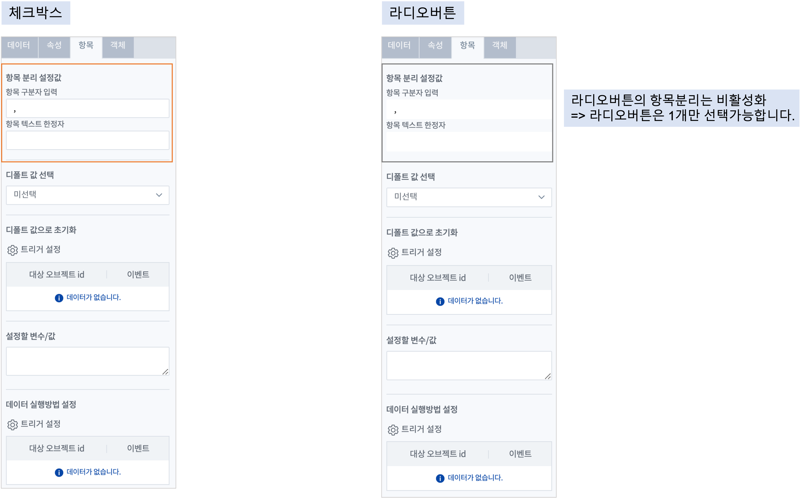

- 항목 분리 설정값
    - 항목설정 변수에 저장된 값이 여러 개인 경우, 구분자로 각 값을 분리합니다. 이 때 사용될 구분자를 입력합니다. 디폴트는 콤마(,) 입니다. 
- 디폴트 값 선택
    - 조회된 목록 중에 디폴트 값을 설정 할 수 있습니다. 
    - 체크박스와 라디오버튼 객체의 항목을 선택하기 전이라도 이벤트값에 디폴트 값이 저장되어 전달됩니다.
- 디폴트 값으로 초기화
    - 주로 ``초기화``  버튼을 클릭하는 이벤트로 체크박스와 라디오버튼 객체의 변수에 저장된 값을 디폴트 값으로 변경합니다.
- 설정할 변수/값
    - 트리거로 다른 객체를 설정하면 이벤트 발생한 객체의 선택값이 디폴트값으로 표시됩니다.  

------------------------------------------------------------------------------------------------------------------------------------------------------------------------------
날짜/시간 선택(Date / Time Picker)
------------------------------------------------------------------------------------------------------------------------------------------------------------------------------

달력에서 특정 ``날짜`` 를 선택하거나 ``날짜 시간`` 을 선택하기 위한 객체입니다.

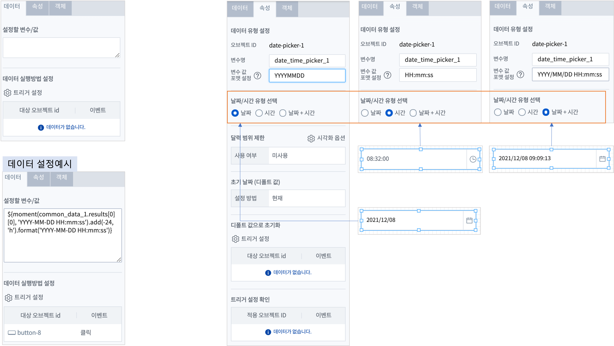

- 데이터 설정할 변수/값 & 데이터 실행방법 설정
    - ``날짜/시간 선택`` 객체의 값을 다른 객체에서 가져오는 경우에만 설정합니다. 일반적으로는 설정이 필요하지 않습니다.
    - 시간 변수 타입이므로 텍스트 타입을 시간 변수 포맷으로 변경하는 moment 함수를 사용합니다. 
    - 데이터 실행방법 설정에서 트리거로 설정한 객체에서 이벤트가 발생하면 ``날짜/시간 선택`` 객체의 값이 설정한 변수값으로 변경됩니다.

- 데이터 유형 설정
    - 변수에 저장되는 값의 포맷을 지정할 수 있습니다.
    ``YYYYMMDDHHmmss`` 포맷으로 저장하면 ``데이터객체`` 에서 **객체 연결**  로 시간설정이 가능합니다.

- 날짜/시간 유형 선택
    - "날짜", "시간", "날짜 + 시간" 에서 유형을 선택합니다.

- 달력 범위 제한 / 시간 선택 간격
    - 날짜/시간 유형 선택에서 `날짜` 를 선택하면 "달력 범위 제한", `시간` 을 선택하면 "시간 선택 간격" 이 활성화 됩니다.

- ``시각화옵션``  팝업창을 통해 설정값을 지정합니다.
    - ``달력 범위 제한`` 은 "사용" 으로 설정하면 시작 날짜 ~ 종료 날짜를 정해서 선택할 수 있는 날짜 범위를 정할 수 있습니다.
    - ``초기 날짜(디폴트 값)`` 은 달력이 보일 때 기준 날짜로 달력이 표시되도록 지정합니다.현재 - 현재 날짜를 초기값으로 설정합니다.
        - 기준 설정 - 현재 기준으로 최근 1일, 최근 7일,,, 최근 3년 까지 지정한 기준에 따라 그 사이의 날짜 중에서 초기값을 지정합니다.
        - 날짜 지정 - 지정한 날짜를 초기값으로 지정합니다.
    - ``시간 간격`` 은 유형이 "시간", "날짜 + 시간"  일 때, 객체에 표시되는 시간의 간격을 1초 단위 외에 별도의 시간 간격으로 표시하고자 할 때 설정합니다.
 
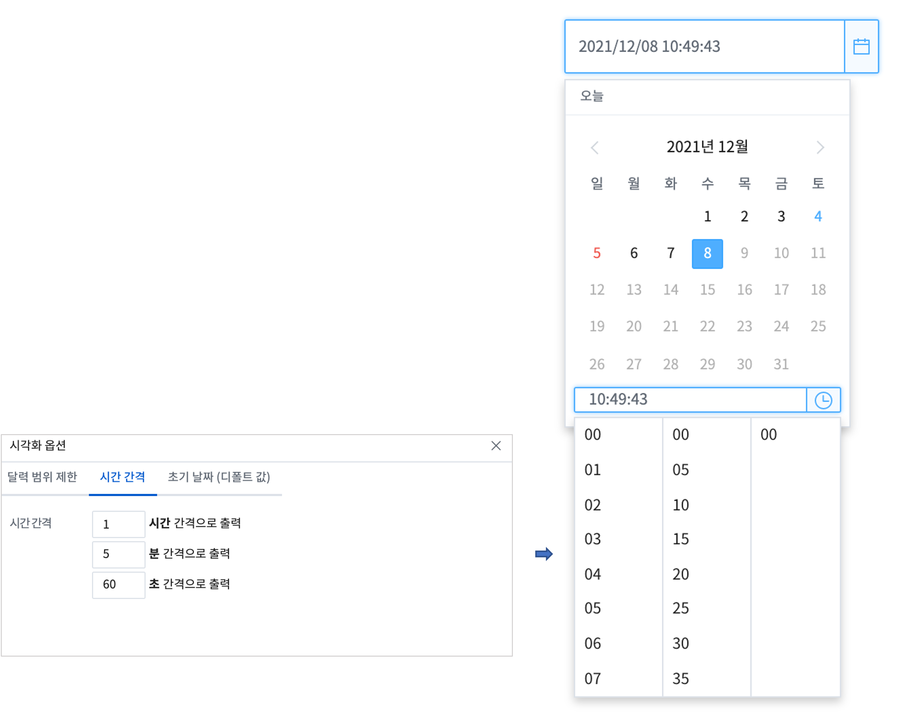

--------------------------------------------------------------------------------------------------------------
기간 설정
--------------------------------------------------------------------------------------------------------------

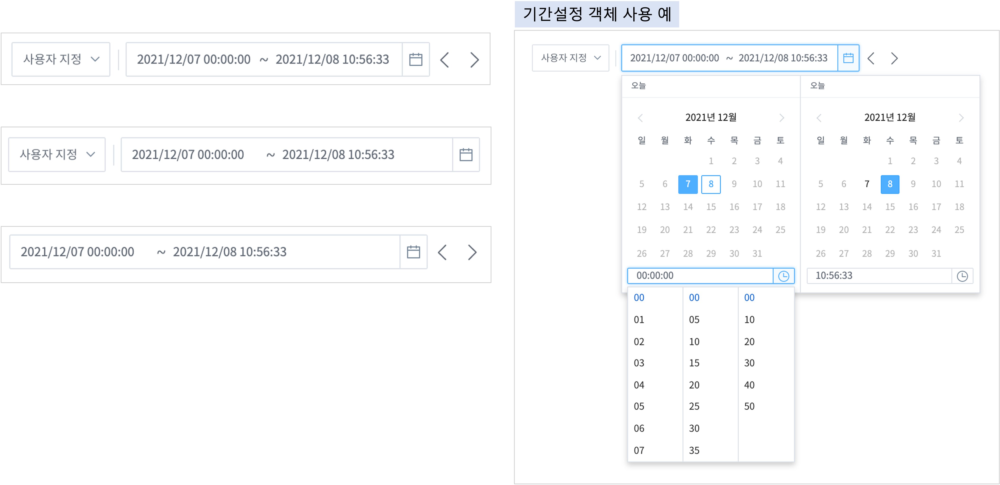

조회할 기간을 선택할 수 있는 객체로, 데이터의 조회 시작 시간과 끝 시간을 설정할 수 있습니다. 

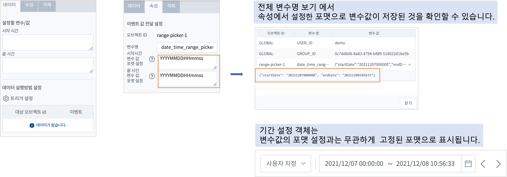

- 데이터 설정할 변수/값 & 데이터 실행방법 설정
    - ``기간 설정`` 객체의 값을 다른 객체에서 가져오는 경우에만 설정합니다. 일반적으로는 설정이 필요하지 않습니다.
    - 시간 변수 타입이므로 텍스트 타입을 시간 변수 포맷으로 변경하는 moment 함수를 사용합니다. 
    - 데이터 실행방법 설정에서 트리거로 설정한 객체에서 이벤트가 발생하면 ``기간 설정`` 객체의 값이 설정한 변수값으로 변경됩니다.

- 이벤트값 전달 설정
    - 데이터 조회 시작 시간과 끝 시간의 시간 포맷을 설정합니다. 이 값은 설정된 변수에 startDate, endDate 라는 attribute key 로 저장됩니다.
    - ``YYYYMMDDHHmmss`` 포맷으로 저장하면 ``데이터객체`` 에서 **객체 연결**  로 시간설정이 가능합니다.
    - 변수 사용 예) ${period_time_range_picker_1.startDate}  ${period_time_range_picker_1.endDate}

- 시각화 옵션
    - 달력 범위 제한
        - 기간 설정 시 범위를 제한하여 설정한 기간 내에서만 시작과 끝 시간을 정하고자 할 때는 `사용` 을 체크합니다.
        - 날짜 설정은 현재 시간 기준으로 시간을 설정하거나 사용자가 특정일을 지정할 수 있습니다.
    - 시간 간격 예시 
        - 시간을 정할 때 시간,분,초 별로 설정한 간격에 따라 선택 창이 생성됩니다.
    - 시간 목록(프리셋)
        - 시간 목록을 미리 지정한 값에서 선택할 수 있습니다.
    - 초기날짜(디폴트값)
        - 기간을 정하기 전에 디폴트로 표시하는 초기값입니다.
        - 초기값을 설정하면 입력 전이라도 변수에 빈 값 대신 초기 기간 값으로 저장이 되어 있습니다.
    - 선택 범위 제한
        - 데이터 양이 많은 경우에 사용할 수 있으며, 최대로 설정할 수 있는 기간의 범위에 제한을 줄 수 있습니다.
    - 시간 이동
        - 시간 이동을 사용하면, 객체에 생긴 화살표 ``<   >`` 를 사용하여 동일한 시간 간격으로 shift 하여 기간을 설정할 수 있습니다.

-------------------------------------------------------------------
에디터 (editor)
-------------------------------------------------------------------

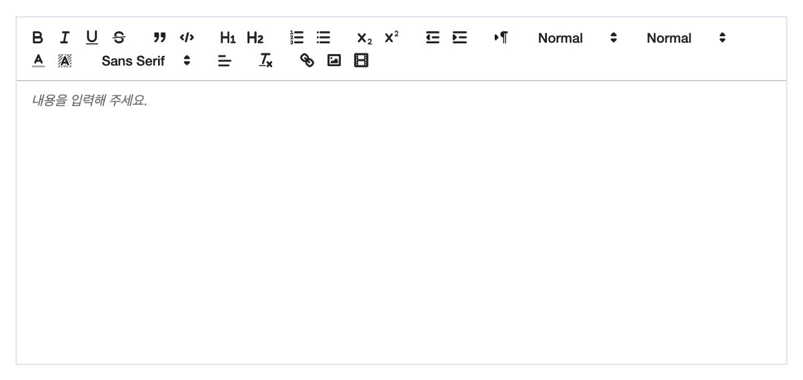

게시판같은 화면을 만들 때 사용할 수 있는 텍스트 에디터입니다.

- 데이터 설정할 변수/값 & 데이터 실행방법 설정
    - ``에디터`` 에 입력되는 값을 다른 객체에서 가져오는 경우에만 설정합니다. 일반적으로는 설정이 필요하지 않습니다.
    - 에디터에 전달하는 변수의 값은 ``base64`` 로 인코딩된 문자입니다. 
    - 데이터 실행방법 설정에서 트리거로 설정한 객체에서 이벤트가 발생하면 ``에디터``  에 전달받은 변수가 표시됩니다.

- 이벤트 값 전달 설정 : 

.. csv-table::
    :header: 옵션 명, 설명

    오브젝트 ID, 해당 객체의 고유 아이디로 자동으로 할당됩니다.
    변수 명, 해당 객체를 사용하기 위한 변수명으로 사용자가 지정할 수 있습니다.

- 디폴트 값 선택
    - 디폴트 값은 아직 어떤 값도 표시가 되어 있지 않을 때 에디터객체에 표시할 내용을 지정할 수 있습니다.
    - 기본값 : 에디터 객체의 변수에 초기값으로 저장되는 값
    - 안내 문구 : 에디터 입력창에 표시하는 문구. 이 문구는 변수로 저장되지는 않습니다.
- 디폴트 값으로 초기화
    - 주로 ``초기화``  버튼을 클릭하는 이벤트로 에디터의 내용을 디폴트 값으로 변경합니다.

- 제한설정
    - Readonly 를 켜서 읽기만 가능하도록 설정합니다. 직접 입력하지 않고 다른 객체로부터 값을 전달받아서 에디터에 내용을 보여줄 때 사용됩니다.

-------------------------------------------------------------------
슬라이더 (slider)
-------------------------------------------------------------------

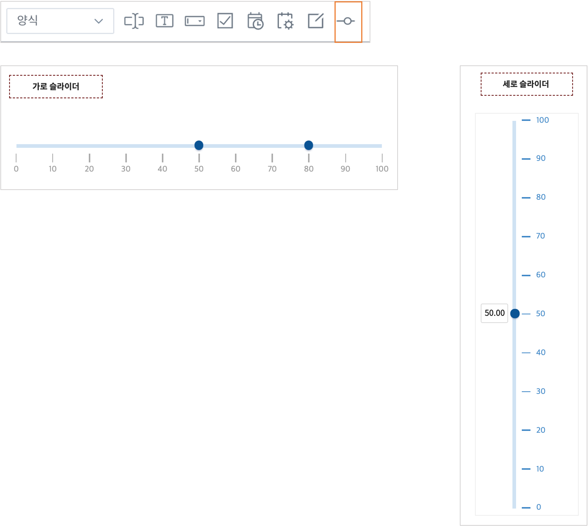

슬라이더에 값을 설정하고, 슬라이더를 활용해 데이터 범위를 선택할 수 있습니다.

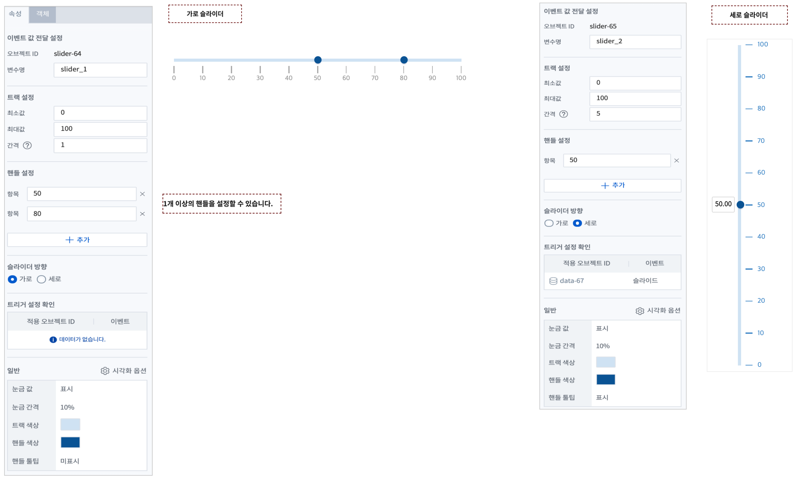

- 트랙 설정
    - 트랙의 최소값, 최대값, 간격을 설정합니다.

- 핸들 설정
    - 여러 개 핸들을 설정할 수 있습니다. 설정한 항목에 핸들이 위치합니다.

- 슬라이더 방항 : 가로 / 세로

- 시각화옵선 : 
    - 눈금 값 : 표시 여부
    - 눈금 간격
    - 트랙 색상
    - 핸들 색상
    - 핸들 툴팁 : 표시 여부

