=========================================================================
특수/기타 객체
=========================================================================

| 특별한 목적 하나만을 위해 만들어진 객체 집합입니다.

-------------------------------------------------------------------------------------------------------
외부 URL (External URL)
-------------------------------------------------------------------------------------------------------

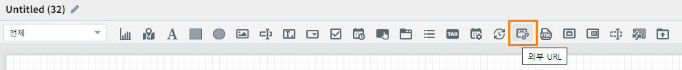

| 외부 URL을 입력하여 해당 URL 페이지를 로딩 할 수 있습니다.

'''''''''''''''''''''''''''''''''
데이터
'''''''''''''''''''''''''''''''''
| URL 설정과 데이터 실행 방법을 설정 할 수 있습니다.

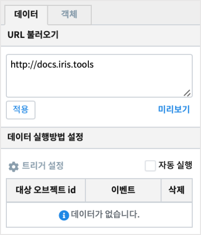

..............................................................................
URL 불러오기
..............................................................................

| http 포함된 URL을 입력하거나, 다른 객체의 변수명을 입력하여 변수값을 사용해 외부URL 페이지를 로딩 할 수 있습니다.

.. image:: ./studio/images/iframe/iframe_01.png
  :width: 270
  :alt: 외부 URL 불러오기

.. csv-table::
    :header: "항목", "설명"

    "적용", "입력한 외부 URL의 유효성 검사를 합니다. http로 시작해야 하고 URL에 공백이 있으면 설정되지 않습니다."
    "미리보기", "외부 URL에 변수명을 입력한 경우, 해당 변수 값의 데이터를 미리 보기 합니다."

..................................................................................
데이터 실행방법 설정
..................................................................................

| 챠트의 `데이터 실행방법 설정 <http://docs.iris.tools/manual/IRIS-Manual/IRIS-Studio/data_visualize.html#id5>`__  을 참고하시기 바랍니다.

''''''''''''''''''''''''''''''''''
객체
''''''''''''''''''''''''''''''''''
| 크기와 위치는 `객체 설정 <http://docs.iris.tools/manual/IRIS-Manual/IRIS-Studio/data_visualize.html#id18>`__ 을 참조하시기 바랍니다.

------------------------------------------------------------------------------------------------------------------
Html뷰어 (Html Viewer)
------------------------------------------------------------------------------------------------------------------

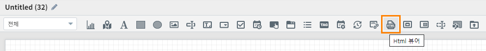

| Html 뷰어 객체는 서버로부터 받아온 데이터의 HTML 코드를 바인딩하여 화면에 보여 줍니다.

''''''''''''''''''''''''''''''''''''''''''''''''''''''''''''''''''''''
데이터 설정
''''''''''''''''''''''''''''''''''''''''''''''''''''''''''''''''''''''

| 데이터 설정은  `데이터객체 <http://docs.iris.tools/manual/IRIS-Manual/IRIS-Studio/data.html#id1>`__ 를 참고하시기 바랍니다.
| HTML Viewer 는 컬럼의 값으로 html code 가 들어 있습니다.  

**HTML document 예시**

.. code::

  <!DOCTYPE html>
  <html>
  <body>

  <h1>My First Heading</h1>

  
My first paragraph.

  </body>
  </html>

가 들어있는 MySQL 테이블에서 데이터를 가져오는 데이터객체 생성 예시

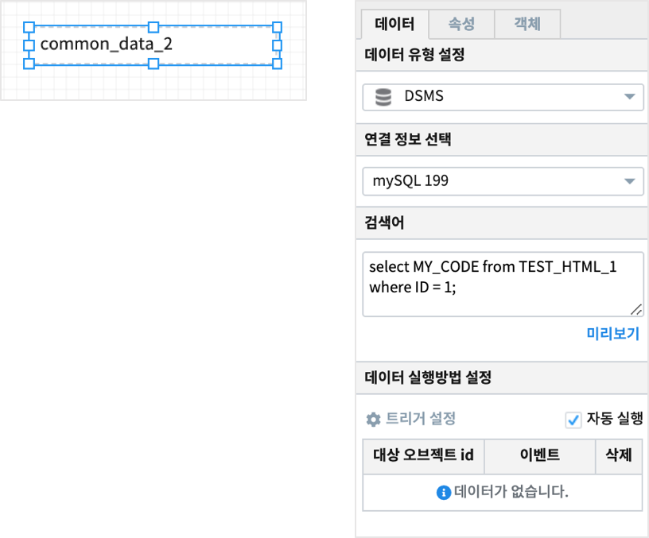

| Html Viewer 객체를 클릭한 후 **데이터연결** 에서 데이터객체를 선택합니다.

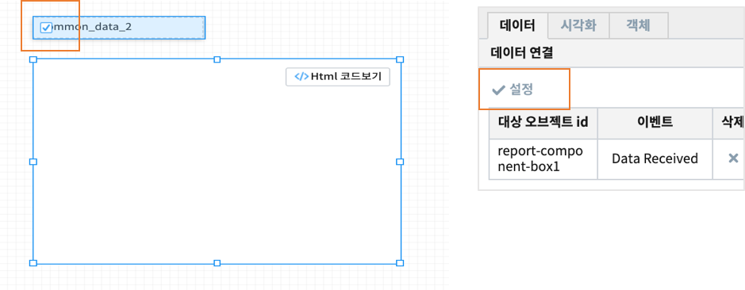

| 데이터객체를 클릭한 후 실행을 선택하면 Html Viewer 에 결과가 표시됩니다.

| Html viewer 박스의 우측 상단의 **Html 코드보기** , **Html 그리기** 를 통해 데이터설정을 통해 가져온 Html Code 와 결과를 번갈아 가며 볼수 있습니다.

**결과**

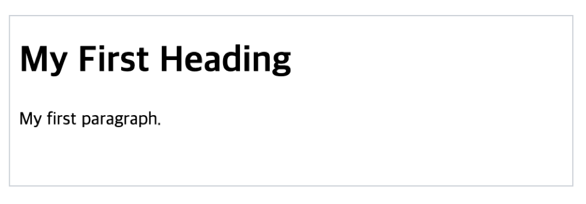

''''''''''''''''''''''''''''''''''''''''''''''''''''''''''''''''''''''''''''
시각화 설정
''''''''''''''''''''''''''''''''''''''''''''''''''''''''''''''''''''''''''''

**필드 선택**

불러온 데이터로부터 HTML 코드가 있는 컬럼을 선택하면 자동으로 데이터를 읽어 화면에 보여줍니다.

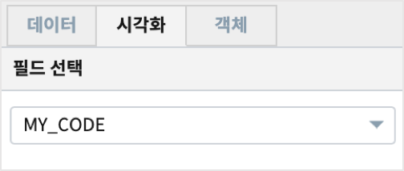

''''''''''''''''''''''''''''''''''''''''''''''''''''''''''''''''''''''''''''
객체 설정
''''''''''''''''''''''''''''''''''''''''''''''''''''''''''''''''''''''''''''

| 챠트의 `객체 설정 <http://docs.iris.tools/manual/IRIS-Manual/IRIS-Studio/data_visualize.html#id18>`__ 을 참고하시기 바랍니다.

------------------------------------------------------------------------------------------------------------------------------------------
보고서 가져오기(팝업) (Import Report (Popup))
------------------------------------------------------------------------------------------------------------------------------------------

.. image:: ./studio/images/popup/button-loadreport.png

| 저장된 보고서를 가져와 팝업 화면에 표시하는 객체입니다.
| (저장된 보고서를 가져올 경우, 가져온 보고서의 객체 목록 중에 팝업/포틀릿 객체가 포함되어 있는 경우, 미리 보기에서 실행되지 않습니다.)

.. image:: studio/images/popup/popup_07.png
  :width: 270
  :alt: Import Report 오류 메시지(Import 보고서에 팝업/포틀릿 객체가 포함되어 있습니다)

''''''''''''''''''''''''''''''''''''''''''''''''''''''''''''''''''''''''''''
불러오기
''''''''''''''''''''''''''''''''''''''''''''''''''''''''''''''''''''''''''''

| 저장된 보고서 중에서 선택하여 불러올 수 있습니다.

..................................................................................
보고서 설정 유형
..................................................................................

| 저장된 보고서 목록이 기본이며, 변수/값 입력을 설정 할 수 있습니다.

.. image:: ./studio/images/popup/popup_01.png
  :width: 270
  :alt: 저장된 보고서 목록 설정

.. csv-table::
    :header: "항목", "설명"

    "목록 선택", "저장된 보고서 목록을 선택할 수 있습니다."
    "변수/값 입력", "변수값을 사용하여 저장된 보고서를 불러 올 수 있습니다."

....................................................................................
저장된 보고서
....................................................................................

| 보고서 설정 유형에서 목록을 선택한 경우만 활성화 됩니다.
| 검색을 통해 보고서를 검색가능하며, 보고서 선택 시 목록에 표시되고, 팝업 객체에 보고서 이름과 바로가기 아이콘이 나타납니다.

.. image:: ./studio/images/popup/popup_01.png
  :width: 270
  :alt: 저장된 보고서 목록 설정

| 팝업 객체의 선택 적용 UI 입니다.

.. image:: ./studio/images/popup/popup_02.png
  :width: 270
  :alt: 저장된 보고서 선택 적용 UI

............................................................................................................
import 보고서 변수/값
............................................................................................................

| 작성중인 보고서의 변수값에 보고서이름이 저장되어 있어 변수값으로 보고서를 가져오거나
| 직접 보고서이름을 입력하여 가져올 때 사용합니다.

.. image:: ./studio/images/popup/popup_03.png
  :width: 270
  :alt: 보고서 설정 변수 값/입력

| 설정에 따라 불러오는 보고서를 바꾸려면 변수를 사용합니다.
| 변수를 사용하는 경우에는 변수에 저장되는 값에 따라 불러오는 보고서의 이름이 변경됩니다. 

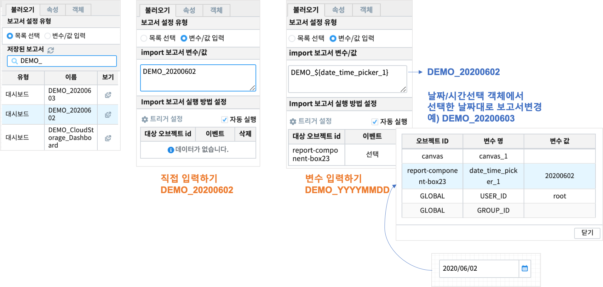

| **직접 입력하기** 는 입력한 보고서 이름을 입력해서 불러옵니다.
| **변수 입력하기** 는 날짜/시간 선택 객체와 트리거 이벤트를 설정하여 선택한 날짜변수 값에 따라 불러오는 보고서 이름이 달라집니다.

........................................................................
팝업 열기 설정
........................................................................

| 팝업 열기 시, 실행될 이벤트를 설정합니다.

.. image:: ./studio/images/popup/popup_04.png
  :width: 270
  :alt: 팝업 열기 설정

.. csv-table::
    :header: "항목", "설명"

    "트리거 설정", "챠트의 `트리거 설정(공통) <http://docs.iris.tools/manual/IRIS-Manual/IRIS-Studio/data_visualize.html#id7>`__ 을 참고하시기 바랍니다."
    "자동실행", "선택 시 팝업 버튼을 클릭하지 않고, 팝업을 자동으로 실행 합니다."

'''''''''''''''''''''''''''''''''
속성
'''''''''''''''''''''''''''''''''

| 스타일이나 시각화 방법 등에 대한 설정을 할 수 있습니다.

....................................................................................
이벤트 값 전달 설정
....................................................................................

| `이벤트 값 전달 설정 <http://docs.iris.tools/manual/IRIS-Manual/IRIS-Studio/data_visualize.html#id14>`__ 을 참고하시기 바랍니다.

....................................................................................
변수 설정
....................................................................................

| 저장된 보고서의 Canvas 변수가 설정된 경우에 설정된 Canvas 변수값에 값을 설정 할 수 있습니다.
| Canvas 변수가 3개인 경우에 변수값을 3개 설정 할 수 있으며, 변수값을 직접 입력 하거나, 변수명을 입력하여 설정 할 수 있습니다.
| Canvas 변수는 팝업 보고서 내부에서 같이 사용이 되도록 설정이 가능합니다.
| IRIS Studio Manual `캔버스 (Canvas) <http://docs.iris.tools/manual/IRIS-Manual/IRIS-Studio/start.html#canvas>`__  를 참고하시기 바랍니다.

.. image:: ./studio/images/popup/popup_05.png
  :width: 270
  :alt: 저장된 보고서 변수 설정

.. csv-table::
    :header: "항목", "설명"

    "변수명", "저장된 보고서의 Canvas 변수명 입니다."
    "변수 값", "저장된 보고서의 Canvas 변수값을 직접 설정가능하며, 변수명을 입력한 설정도 가능합니다."

....................................................................................
팝업 제목
....................................................................................

| 팝업이 열릴 때, 팝업 제목을 설정합니다.

.. image:: ./studio/images/popup/popup_06.png
  :width: 270
  :alt: 팝업 제목 설정

''''''''''''''''''''''''''''''''''
객체
''''''''''''''''''''''''''''''''''

| 크기와 위치는 챠트의 `객체 설정 <http://docs.iris.tools/manual/IRIS-Manual/IRIS-Studio/data_visualize.html#id18>`__ 을 참조하시기 바랍니다.

................................................................
팝업 창 크기
................................................................

| 팝업이 열릴 때, 팝업의 창 크기를 설정합니다.

.. image:: ./studio/images/popup/popup_08.png
  :width: 270
  :alt: 팝업 창 크기 설정

-----------------------------------------------------------------------------------------------------------------------------------------------------------------------------
보고서 가져오기(포틀릿) (Import Report (Portlet))
-----------------------------------------------------------------------------------------------------------------------------------------------------------------------------

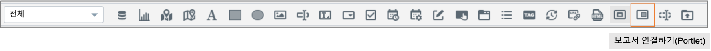

| 저장된 보고서를 가져와 보고서 화면에 표시하는 객체입니다.
| (저장된 보고서를 가져올 경우, 가져온 보고서의 객체 목록 중에 팝업/포틀릿 객체가 포함되어 있는 경우, 미리 보기에서 실행되지 않습니다.)

.. image:: ./studio/images/popup/popup_07.png
  :width: 270
  :alt: Import Report 오류 메시지(Import 보고서에 팝업/포틀릿 객체가 포함되어 있습니다)

''''''''''''''''''''''''''''''''''''''''''''''''''''''''''''''''''''''''''''''''
불러오기
''''''''''''''''''''''''''''''''''''''''''''''''''''''''''''''''''''''''''''''''

| 저장된 보고서 목록을 선택하여 불러올 수 있습니다.

..........................................................................................
보고서 설정 유형
..........................................................................................

| 저장된 보고서 목록이 기본이며, 변수/값 입력을 설정 할 수 있습니다.

.. image:: ./studio/images/popup/popup_01.png
  :width: 270
  :alt: 저장된 보고서 목록 설정

.. csv-table::
    :header: "항목", "설명"

    "목록 선택", "저장된 보고서 목록을 선택할 수 있습니다."
    "변수/값 입력", "변수값을 사용하여 저장된 보고서를 불러 올 수 있습니다."

..........................................................................................
저장된 보고서
..........................................................................................

| 보고서 설정 유형에서 목록을 선택한 경우만 활성화 됩니다.
| 검색을 통해 보고서를 검색가능하며, 보고서 선택 시 목록에 표시되고, 팝업 객체에 보고서 이름과 바로가기 나타납니다.

.. image:: ./studio/images/popup/popup_01.png
  :width: 270
  :alt: 저장된 보고서 목록 설정

포틀릿 객체의 선택 적용 UI 입니다.

.. image:: ./studio/images/popup/popup_02.png
  :width: 270
  :alt: 저장된 보고서 선택 적용 UI

.......................................................................................................................................
import 보고서 변수/값
.......................................................................................................................................

| 변수값을 사용하여 저장된 보고서를 불러 올 수 있습니다.

.. image:: ./studio/images/popup/popup_03.png
  :width: 270
  :alt: 보고서 설정 변수 값/입력

...................................................................................................................................................
Import 보고서 실행 방법 설정
...................................................................................................................................................

| 포틀릿 실행 시, 실행될 이벤트를 설정합니다.

.. image:: ./studio/images/portlet/portlet_01.png
  :width: 270
  :alt: Import 보고서 실행 방법 설정

.. csv-table::
    :header: "항목", "설명"

    
    "트리거 설정", "챠트의 `트리거 설정(공통) <http://docs.iris.tools/manual/IRIS-Manual/IRIS-Studio/data_visualize.html#id7>`__ 을 참고하시기 바랍니다."
    "자동실행", "선택 시 팝업 버튼을 클릭하지 않고, 팝업을 자동으로 실행 합니다."

''''''''''''''''''''''''''''''''''''''
속성
''''''''''''''''''''''''''''''''''''''

| 스타일이나 시각화 방법 등에 대한 설정을 할 수 있습니다.

........................................................................................................
이벤트 값 전달 설정
........................................................................................................

| `이벤트 값 전달 설정 <http://docs.iris.tools/manual/IRIS-Manual/IRIS-Studio/data_visualize.html#id14>`__ 을 참고하시기 바랍니다.

........................................................................................................
변수 설정
........................................................................................................

| 저장된 보고서의 Canvas 변수가 설정된 경우에 설정된 Canvas 변수값에 값을 설정 할 수 있습니다.
| Canvas 변수가 3개인 경우에 변수값을 3개 설정 할 수 있으며, 변수값을 직접 입력 하거나, 변수명을 입력하여 설정 할 수 있습니다.

.. image:: ./studio/images/popup/popup_05.png
  :width: 270
  :alt: 저장된 보고서 변수 설정

.. csv-table::
    :header: "항목", "설명"

    "변수명", "저장된 보고서의 Canvas 변수명 입니다."
    "변수 값", "저장된 보고서의 Canvas 변수값을 직접 설정가능하며, 변수명을 입력한 설정도 가능합니다."

''''''''''''''''''''''''''''''''''''''
객체
''''''''''''''''''''''''''''''''''''''

| 크기와 위치는 챠트의 `객체 설정 <http://docs.iris.tools/manual/IRIS-Manual/IRIS-Studio/data_visualize.html#id18>`__  을 참조하시가 바랍니다.

-----------------------------------------------------------------------------------------------------------------------------------------------------------------------------
텍스트 변환 (Hidden)
-----------------------------------------------------------------------------------------------------------------------------------------------------------------------------

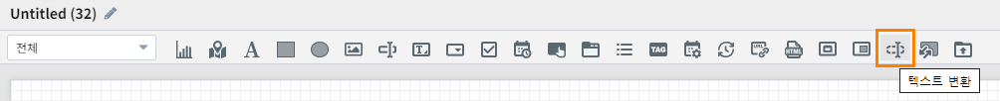

| 텍스트변환 객체에서 설정한 객체의 이벤트 발생시 해당변수의 값을 
| 트리거에 입력된 변수값으로 변환하여 적용할 수있습니다.
| 보고서 실행 화면에서는 텍스트 변환 객체는 보이지 않습니다.

''''''''''''''''''''''''''''''''
데이터
''''''''''''''''''''''''''''''''

| 트리거를 설정하여, 해당 객체의 이벤트가 발생 시 변환할 텍스트 정보를 설정 할 수 있습니다.

...................................................................
트리거 설정
...................................................................

| 트리거를 설정한 객체의 이벤트 발생시 해당변수의 값을 트리거에 입력된 텍스트로 변환하여 적용할 수 있습니다.

.. csv-table::
    :header: "항목", "설명"

    "대상 오브젝트 id", "오브젝트 ID 입니다."
    "이벤트", "대상 객체의 이벤트 입니다."
    "입력", "입력한 텍스트로 텍스트변환 객체 변수 값이 변경 됩니다."
    "삭제", "삭제시, 해당 트리거가 삭제 되며, 해당 객체의 이벤트 발생시 텍스트 변환이 발생하지 않습니다."

| 텍스트 변환 객체의 트리거 설정과 적용 UI 입니다.

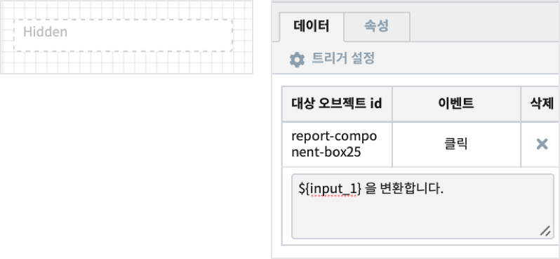

| 사용 예) 입력한 텍스트는 클릭버튼을 실행하면 변환된 값으로 출력됩니다.

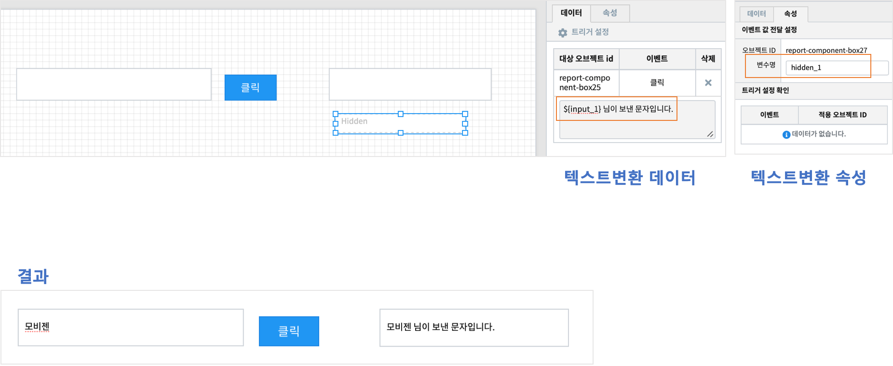

'''''''''''''''''''''''''''''''''''
속성
'''''''''''''''''''''''''''''''''''

......................................................................
이벤트 값 전달 설정
......................................................................
| `이벤트 값 전달 설정 <http://docs.iris.tools/manual/IRIS-Manual/IRIS-Studio/data_visualize.html#id14>`__ 을 참고하시기 바랍니다.

............................................................................................................................................
트리거 설정 확인
............................................................................................................................................

| 챠트의 `트리거 설정 확인 <http://docs.iris.tools/manual/IRIS-Manual/IRIS-Studio/data_visualize.html#id8>`__ 을 참고하시기 바랍니다.

-----------------------------------------------------------------------------------------------------------------------------------------------------------------------------
RESTful API
-----------------------------------------------------------------------------------------------------------------------------------------------------------------------------

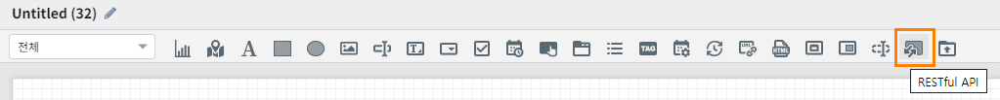

| RESTful API를 사용하여 데이터를 설정 할 수 있는 객체입니다.

'''''''''''''''''''''''''''''''''''''''
데이터
'''''''''''''''''''''''''''''''''''''''

| 데이터 설정을 통해 조회할 RESTful API 설정합니다.

..............................................................................
데이터 설정
..............................................................................

| RESTful API의  Method, URI, Header Body를 설정합니다.

.. image:: ./studio/images/rest_api/rest_api_01.png
    :width: 270
    :alt: RESTful API 데이터 설정

.. csv-table::
    :header: "항목", "설명"

    "Method", "POST 로 고정되어 있습니다."
    "URI", "업로드할 REST API URI 입력 입니다."
    "Header", "전달할 Header(JSON 포맷) 값을 정의하여 전송 할 수 있으며, 변수명을 입력하여 설정 할 수 있습니다."
    "Body", "전달할 Body(JSON 포맷) 값을 정의하여 전송 할 수 있으며, 변수명을 입력하여 설정 할 수 있습니다."

.....................................................................................................................
데이터 실행방법 설정
.....................................................................................................................

| 챠트의 `데이터 실행방법 설정 <http://docs.iris.tools/manual/IRIS-Manual/IRIS-Studio/data_visualize.html#id5>`__  을 참고하시기 바랍니다.

''''''''''''''''''''''''''''''''''''
속성
''''''''''''''''''''''''''''''''''''

| 스타일이나 시각화 방법 등에 대한 설정을 할 수 있습니다.

........................................................................................................
이벤트 값 전달 설정
........................................................................................................

| `이벤트 값 전달 설정 <http://docs.iris.tools/manual/IRIS-Manual/IRIS-Studio/data_visualize.html#id14>`__ 을 참고하시기 바랍니다.

......................................................................................................
트리거 설정 확인
......................................................................................................

| 챠트의 `트리거 설정 확인 <http://docs.iris.tools/manual/IRIS-Manual/IRIS-Studio/data_visualize.html#id8>`__ 을 참고하시기 바랍니다.

''''''''''''''''''''''''''''''''''''
객체
''''''''''''''''''''''''''''''''''''
| 크기와 위치는 챠트의 `객체 설정 <http://docs.iris.tools/manual/IRIS-Manual/IRIS-Studio/data_visualize.html#id18>`__ 을 참조하시기 바랍니다.

-----------------------------------------------------------------------------------------------------------------------------------------------------------------------------
파일 업로드 (File Upload)
-----------------------------------------------------------------------------------------------------------------------------------------------------------------------------

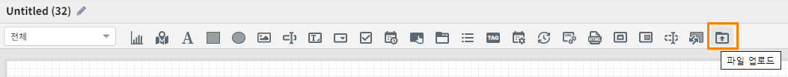

| 파일 업로드 객체는 보고서에 데이터 추가 시, 정해진 형태의 파일을 REST API로 데이터를 업로드 할 수 있습니다.
| 비주얼 객체의 이벤트에 의해 업로드 실행 트리거를 설정 할 수 있으며, 한 번에 하나의 파일만 등록 가능합니다.

''''''''''''''''''''''''''''''''''''
데이터
''''''''''''''''''''''''''''''''''''

| 파일 업로드 데이터를 설정합니다.

.........................................................................................................
데이터 설정
.........................................................................................................

| 파일 업로드 데이터의 Method, URI, Body를 설정합니다.

.. image:: ./studio/images/file_upload/file_upload_01.png
  :width: 270
  :alt: 파일 업로드 데이터 설정

.. csv-table::
    :header: "항목", "설명"

    "Method", "POST 로 고정되어 있습니다."
    "URI", "업로드할 REST API URI 입력 입니다."
    "Body", "업로드 시 추가 파라미터(JSON 포멧)을 정의 할 수 있습니다."

....................................................................................................
데이터 실행방법 설정
....................................................................................................

| 챠트의 `데이터 실행방법 설정 <http://docs.iris.tools/manual/IRIS-Manual/IRIS-Studio/data_visualize.html#id5>`__ 을 참고하시기 바랍니다.

'''''''''''''''''''''''''''''
속성
'''''''''''''''''''''''''''''
| 속성탭에서 파일 업로드 업로드 가능 파일 확장자를 설정합니다.

............................................................................................................................
업로드 가능 파일 확장자
............................................................................................................................

| 미 설정시, 확장자 구분없이 업로드 가능하며, 확장자는 '.csv' or 'csv' 형식으로 등록가능합니다.
| 하단 추가 버튼을 클릭하여 업로드 가능 파일 확장자를 1개 이상 등록할 수 있습니다.

.. image:: ./studio/images/file_upload/file_upload_02.png
  :width: 270
  :alt: 파일 업로드 가능 파일 확장자

............................................................................................................................
이벤트 값 전달 설정
............................................................................................................................
| `이벤트 값 전달 설정 <http://docs.iris.tools/manual/IRIS-Manual/IRIS-Studio/data_visualize.html#id14>`__ 을 참고하시기 바랍니다.

'''''''''''''''''''''''''''
객체
'''''''''''''''''''''''''''
| 크기와 위치는 챠트의 `객체 설정 <http://docs.iris.tools/manual/IRIS-Manual/IRIS-Studio/data_visualize.html#id18>`__ 을 참조하시기 바랍니다.
