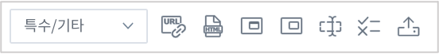
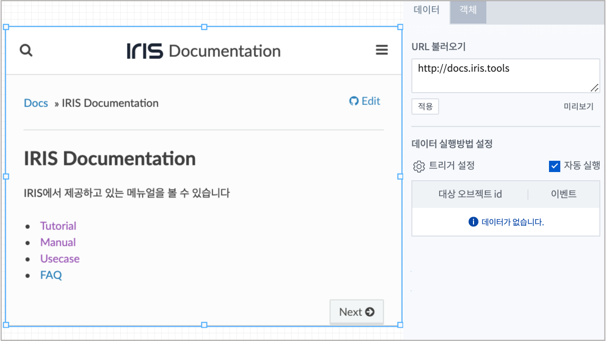
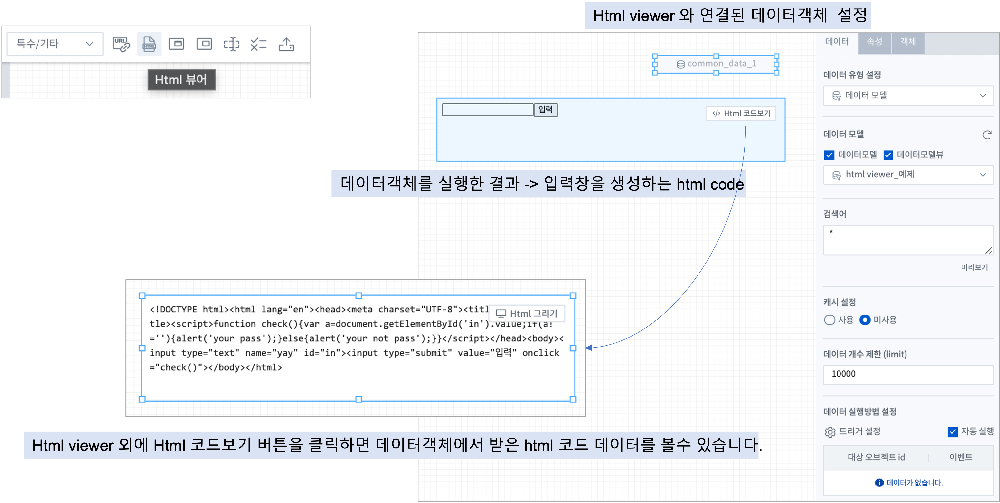
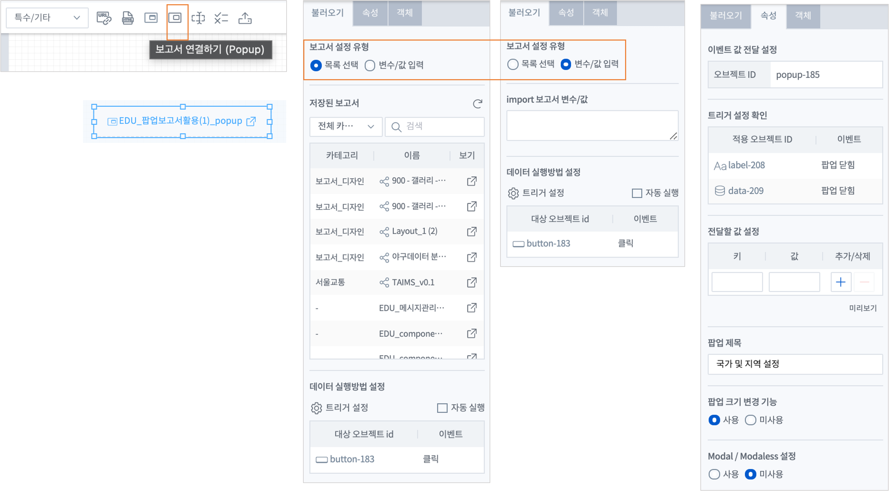
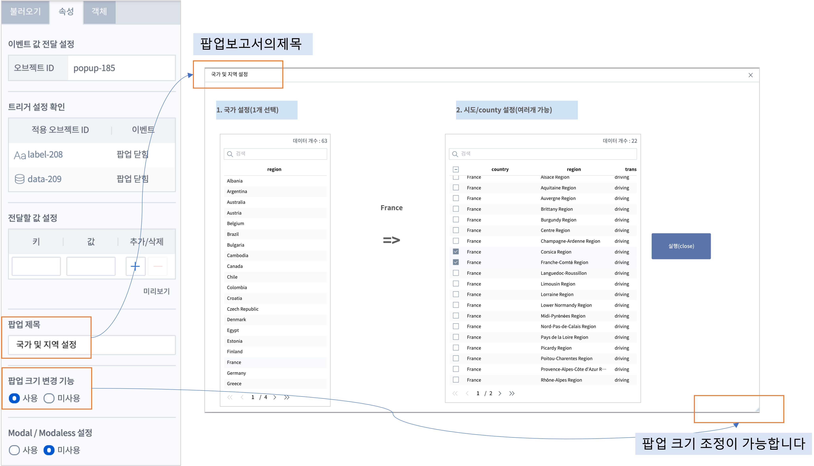
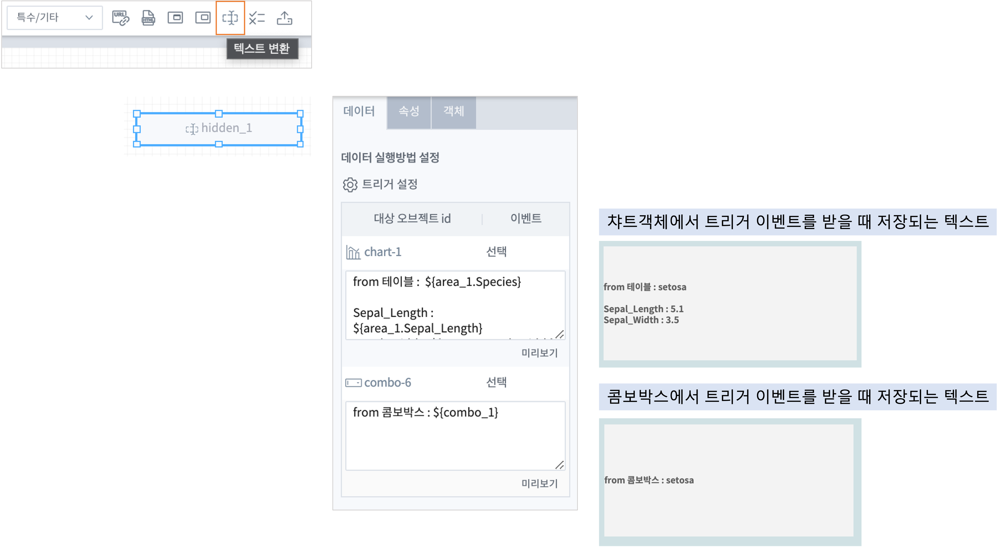
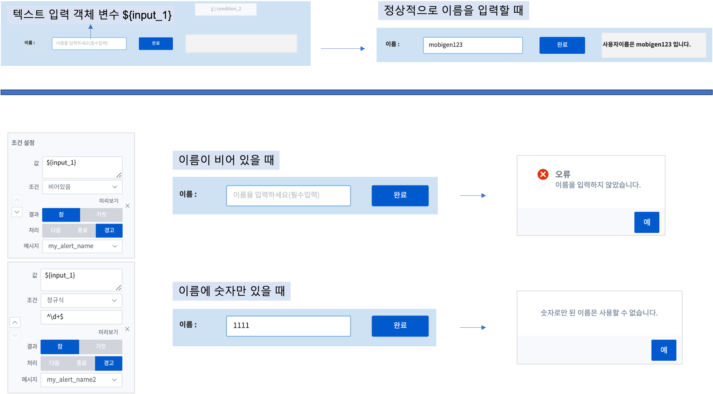
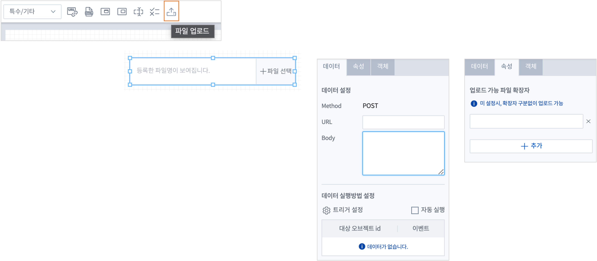

=========================================================================
특수/기타 객체
=========================================================================

| 외부 URL, Html 뷰어, 보고서 연결하기(Popup), 보고서 연결하기(Portlet), 텍스트변환, 파일업로드, 조건 검사 객체가 포함됩니다.

-------------------------------------------------------------------------------------------------------
외부 URL (External URL)
-------------------------------------------------------------------------------------------------------

| 외부 URL을 입력하여 해당 URL 페이지를 보고서 내에서 로딩 할 수 있습니다.

- 데이터
    - URL 설정과 데이터 실행 방법을 설정 할 수 있습니다.
    - URL 불러오기
        - http 포함된 URL을 입력하거나, 다른 객체의 변수명을 입력하여 변수값을 사용해 외부URL 페이지를 로딩 할 수 있습니다.

.. csv-table::
    :header: "항목", "설명"

    "적용", "입력한 외부 URL의 유효성 검사를 합니다. http로 시작해야 하고 URL에 공백이 있으면 설정되지 않습니다."
    "미리보기", "외부 URL에 변수명을 입력한 경우, 해당 변수 값의 데이터를 미리 보기 합니다."

- 객체
    - 크기와 위치는 `객체 설정 <http://docs.iris.tools/manual/IRIS-Manual/IRIS-Studio/data_visualize.html#id18>`__ 을 참조하시기 바랍니다.

------------------------------------------------------------------------------------------------------------------
Html 뷰어 (Html Viewer)
------------------------------------------------------------------------------------------------------------------

| Html 뷰어 객체는 연결된 데이터객체로부터 받은 HTML 코드를 바인딩하여 화면에 보여 줍니다.

- 데이터 설정
    - 데이터객체를 연결합니다. 데이터 설정은  `데이터객체 <http://docs.iris.tools/manual/IRIS-Manual/IRIS-Studio/data.html#id1>`__ 를 참고하시기 바랍니다.
        - 데이터모델 "html viiwer_예제" 는 컬럼의 값으로 html code 가 들어 있습니다.  
        - 데이터객체를 실행하면 Html 뷰어에 html code 의 실행 결과가 표시됩니다.
    - Html 뷰어의 우측 상단의 **Html 코드보기** , **Html 그리기** 를 통해 Html Code 와 결과를 번갈아 가며 볼수 있습니다.

- 시각화 설정
    - **필드 선택** 에서 연결된 데이터객체에서 가져온 데이터중 HTML 코드가 있는 컬럼을 설정합니다.

- 객체 설정
    - 챠트의 `객체 설정 <http://docs.iris.tools/manual/IRIS-Manual/IRIS-Studio/data_visualize.html#id18>`__ 을 참고하시기 바랍니다.

|

------------------------------------------------------------------------------------------------------------------------------------------
보고서 연결하기(Popup) (Import Report (Popup))
------------------------------------------------------------------------------------------------------------------------------------------

| ``보고서 연결하기`` 객체는 보고서 내에서 다른 보고서를 지정하여 팝업 화면으로 보여주는 객체입니다.
| (저장된 보고서를 가져올 경우, 가져온 보고서의 객체 목록 중에 팝업/포틀릿 객체가 포함되어 있는 경우, 미리 보기에서 실행되지 않습니다.)
|
| 글로벌 변수(canvas에서 설정하는 변수)를 통해 보고서의 변수를 Popup보고서에서 사용할 수 있고, Popup 보고서의 변수 역시 보고서(main 보고서) 내에서 사용할 수 있습니다.

- 불러오기
    - 보고서 설정 유형
        - 연결할 보고서를 선택하는 방법입니다.
        - 목록에서 선택하는 유형(목록 선택)과 트리거로 이벤트 변수를 받아서 보고서를 import 하는 방법(변수/값 입력)이 있습니다.
    - 저장된 보고서
        - 보고서 설정 유형에서 ``목록 선택`` 을 한 경우만 활성화 됩니다.
        - 검색을 통해 보고서를 검색가능하며, 카테고리별로 목록을 구성할 수 있습니다. 그리고 보기 아이콘을 클릭하면 해당 보고서의 실행결과가 다른 탭에서 표시됩니다.
    - import 보고서 변수/값
        - 작성중인 보고서의 변수값에 api 를 통해 받은 보고서 ID 가 저장되어 해당 보고서를 가져올 수 있을 때 설정합니다. 
        - 미리 생성되어 있는 보고서 ID, 보고서 목록 테이블과 api 가 있는 특수한 경우에 동작합니다.
    - 데이터 실행 방법 설정
        - 보고서 연결하기(Popup) 객체가 실행되는 조건을 설정합니다.
    

- 속성
    - 이벤트 값 전달 설정  : ``보고서 연결하기`` 객체의 오브젝트ID 를 표시합니다.
    - 트리거 설정 확인 : ``보고서 연결하기`` 객체를 트리거로 설정한 다른 객체를 표시합니다.
    - 전달할 값 설정
      - 연결할 보고서로 전달할 값을 ``키`` , ``값``  으로 설정합니다.
      - 예) 키 = pop_canvas_1,  값 = ${list_1}  
        - 보고서의 ${list_1} 변수의 값을 pop_canvas_1 이라는 이름으로 전달합니다.
        - 팝업 보고서 내부에서 ``${pop_canvas_1}``  로 사용합니다.
    - 팝업 제목 : 팝업으로 열리는 보고서 상단에 제목을 추가할 수 있습니다.
    - 팝업 크기 변경 기능 : 사용을 체크하면 열린 팝업보고서의 오른쪽 하단 부분을 드래그하여 팝업 크기 조정이 가능합니다.
    - Modal / Modaless 설정 : 열리는 팝업창을 modal 창으로 설정할 지 여부를 체크합니다.

-----------------------------------------------------------------------------------------------------------------------------------------------------------------------------
보고서 연결하기(Portlet)  (Import Report (Portlet))
-----------------------------------------------------------------------------------------------------------------------------------------------------------------------------

| 저장된 보고서를 가져와 화면에 표시하는 객체입니다.
| 보고서 연결하기(Popup) 와 달리 별도 창을 통해 보고서를 표시하는 것이 아니라, 보고서 내의 화면에 바로 표시됩니다. 
| 그래서 보고서에 구성할 내용 중에 다른 보고서의 내용이 필요할 때 주로 사용합니다.
| 불러오는 보고서를 close 하는 기능이 없으므로 화면에 계속 표시됩니다.
|

**불러오기** 탭은 ``보고서 연결하기(Popup)`` 과 동일합니다.

|

**속성** 에서 ``보고서 연결하기(Popup)`` 과  동일하게 연결하는 보고서에 변수를 전달 할 수 있습니다.

-----------------------------------------------------------------------------------------------------------------------------------------------------------------------------
텍스트 변환 (Hidden)
-----------------------------------------------------------------------------------------------------------------------------------------------------------------------------

| 텍스트변환 객체는 트리거로 설정한 이벤트가 발생할 때 변수에 저장되는 텍스트를 설정할 수 있습니다.
| 여러 개의 객체에 트리거를 설정하여 각각의 이벤트마다 다른 텍스트를 변수에 저장할 수 있습니다.
|
| 보고서 실행 화면에서는 텍스트 변환 객체는 보이지 않습니다.

-----------------------------------------------------------------------------------------------------------------------------------------------------------------------------
조건 검사
-----------------------------------------------------------------------------------------------------------------------------------------------------------------------------

.. image:: ./studio/image_3_1_x/etc_08.png
  :scale: 40%
  :alt: condition

| 데이터의 조건을 검사하여 이벤트를 분기시켜 동작 흐름을 설정하는 기능 객체입니다.
| 하나의 변수에 대해 여러 조건을 지정할 수 있습니다.  
| 또한 조건의 검사 결과를 ``경고`` 로 선택하면 ``메시지 관리`` 에서 생성한 경고 메시지를 선택하여 팝업창으로 표시할 수 있습니다.
 
 

-----------------------------------------------------------------------------------------------------------------------------------------------------------------------------
파일 업로드 (File Upload)
-----------------------------------------------------------------------------------------------------------------------------------------------------------------------------

| 파일 업로드 객체는 보고서에 데이터 추가 시, 정해진 형태의 파일을 REST API로 데이터를 업로드 할 수 있습니다.
| 비주얼 객체의 이벤트에 의해 업로드 실행 트리거를 설정 할 수 있으며, 한 번에 하나의 파일만 등록 가능합니다.

- 데이터
    - 파일 업로드 데이터의 Method, URI, Body를 설정합니다.

.. csv-table::
    :header: "항목", "설명"

    "Method", "POST 로 고정되어 있습니다."
    "URI", "업로드할 REST API URI 입력 입니다."
    "Body", "업로드 시 추가 파라미터(JSON 포멧)을 정의 할 수 있습니다."

- 속성
    - 속성탭에서 파일 업로드 업로드 가능 파일 확장자를 설정합니다.
    - 업로드 가능 파일 확장자
        - 미 설정시, 확장자 구분없이 업로드 가능하며, 확장자는 '.csv' or 'csv' 형식으로 등록가능합니다.
        - 하단 추가 버튼을 클릭하여 업로드 가능 파일 확장자를 1개 이상 등록할 수 있습니다.

