============================================================================================
보고서 시작하기
============================================================================================

------------------------------------------------------------------------
보고서 목록
------------------------------------------------------------------------

| 로그인 후 오른쪽 상단의 계정 부분에 마우스를 대면 보고서 메뉴를 선택할 수 있습니다.

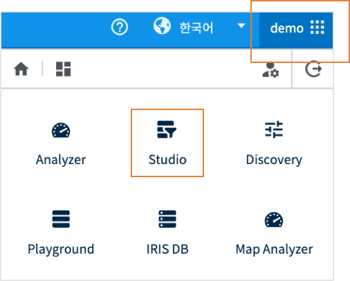

| 보고서 목록

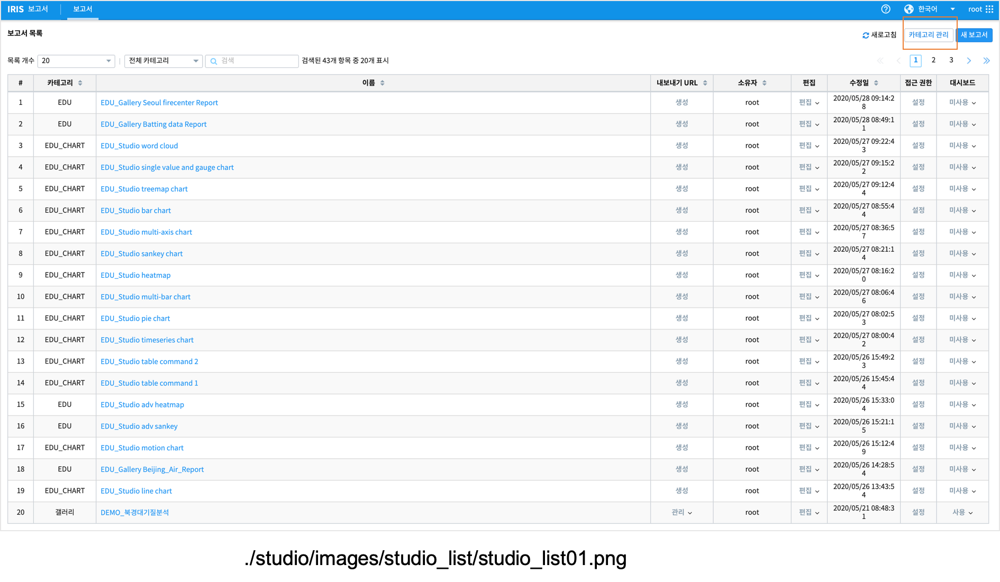

''''''''''''''''''''''''''''''''''''''''''''''''''''''''''''''''''''''''''''''''''''
카테고리
''''''''''''''''''''''''''''''''''''''''''''''''''''''''''''''''''''''''''''''''''''

| 해당 보고서를 지정한 카테고리내에서 지정하여 저장할 수 있습니다.
| 카테고리는 지정하지 않아도 됩니다.
| 관리자는 **카테고리 관리** 에서 카테고리를 추가/삭제/수정 할 수 있습니다.

''''''''''''''''''''''''''''''''''''''''''''''''''''''''''''''''''''''''''''''''''''
내보내기 URL
''''''''''''''''''''''''''''''''''''''''''''''''''''''''''''''''''''''''''''''''''''

| 해당 보고서의 내보내기 URL을 생성 할 수 있습니다. 
| "생성" 을 클릭하여 내보내기 URL 을 생성하면 "관리" 로  바뀝니다.
| 생성된 내보내기 URL은 관리기능을 통하여 복사, 보기(내보내기 URL 보기), 삭제를 할 수 있습니다. 

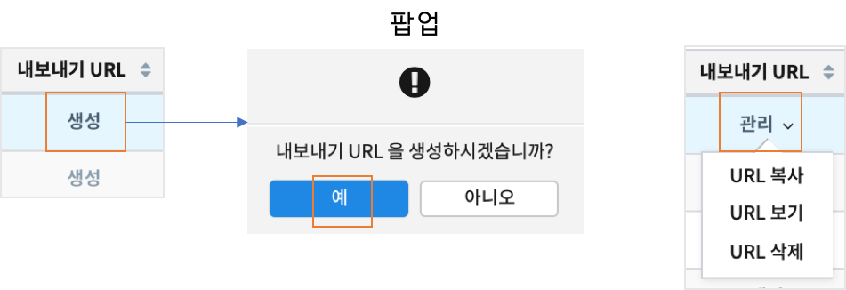

''''''''''''''''''''''''''''''''''''''''''''''''''''''''''''''''''''''''''''''''''''''''''
편집
''''''''''''''''''''''''''''''''''''''''''''''''''''''''''''''''''''''''''''''''''''''''''

| 해당보고서를 편집 할 수 있습니다. 
| 보고서의 이름 변경, 수정, 복제, 삭제의 기능이 제공됩니다. 

.. image:: ./studio/images/studio_list/studio_list04.jpg
    :scale: 100 %
    :alt: 편집

'''''''''''''''''''''''''''''''''''''''''''''''''''''''''''''''''''''''''''''''''
접근권한
'''''''''''''''''''''''''''''''''''''''''''''''''''''''''''''''''''''''''''''''''

| 해당 보고서의 사용자 권한을 지정 할 수 있습니다. 
| 사용자 별 권한을 추가 하거나 사용자 그룹 단위의 권한 설정을 할 수 있습니다. 

.. image:: ./studio/images/studio_list/studio_list05.jpg
    :scale: 100 %
    :alt: 접근권한

''''''''''''''''''''''''''''''''''''''''''''''''''''''''''''''''''''''''''
대시보드
''''''''''''''''''''''''''''''''''''''''''''''''''''''''''''''''''''''''''

| 해당 보고서의 대시보드에서의 사용여부를 선택 할 수 있습니다.
 
.. image:: ./studio/images/studio_list/studio_list06.jpg
    :scale: 100%
    :alt: 대시보드

| 대시보드를 선택하면 메인 메뉴의 "대시보드" 에서 리스트에 추가됩니다.

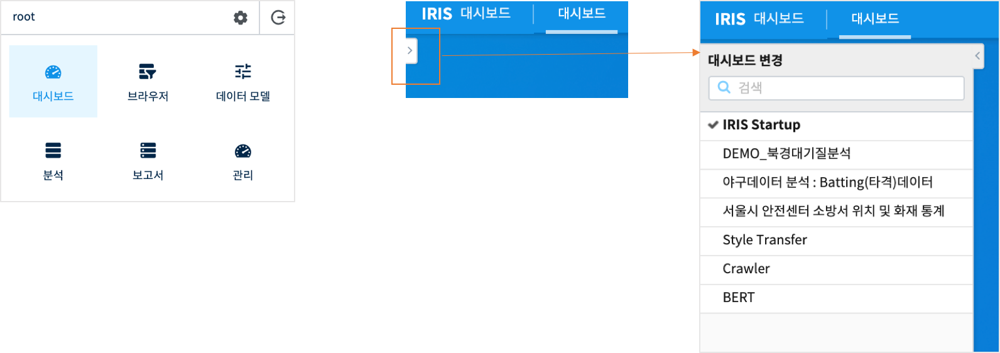

''''''''''''''''''''''''''''''''''''''''''''''''''''''''''''''''''''''''''''
새보고서
''''''''''''''''''''''''''''''''''''''''''''''''''''''''''''''''''''''''''''

| 오른쪽 상단 "새보고서" 버튼 클릭 시, 보고서를 생성, 편집 할 수 있는 화면이 출력 됩니다. 

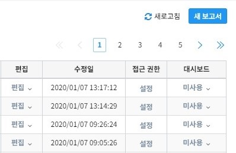

---------------------------------------------------------------------------------------
보고서 진입
---------------------------------------------------------------------------------------

''''''''''''''''''''''''''''''''''''''''''''''''''''''''''''''''''''''''''''''''''''''''''''''''''''''''''''
전체 변수명 보기
''''''''''''''''''''''''''''''''''''''''''''''''''''''''''''''''''''''''''''''''''''''''''''''''''''''''''''

| 현재 보고서에 적용된 변수 목록을 확인 할 수 있습니다.

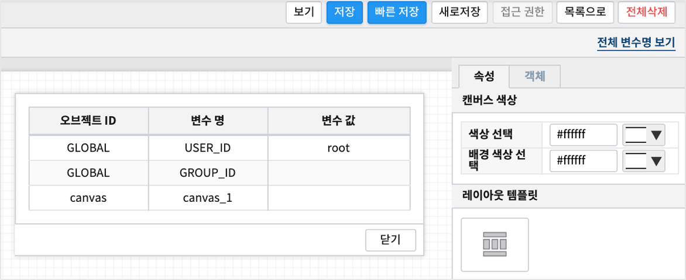

''''''''''''''''''''''''''''''''''''''''''''''''''''''''''''''''''''''''''''''''''''''''''''''''''''''''''''''''''''''''''''''''''''''''''''''''''''''''''''''''''''''''''''''''''''''''''''''''''''''''''''''''''''''''
적용된 컴포넌트 삭제 / 순서 변경
''''''''''''''''''''''''''''''''''''''''''''''''''''''''''''''''''''''''''''''''''''''''''''''''''''''''''''''''''''''''''''''''''''''''''''''''''''''''''''''''''''''''''''''''''''''''''''''''''''''''''''''''''''''''

| 편집영역에 적용된 컴포넌트 선택 후 Delete 버튼 클릭 시, 해당 컴포넌트가 삭제 됩니다. 
| 또는 삭제하고자 하는 컴포넌트선택 후 **오른쪽 마우스 클릭** 시, 컨텍스트메뉴로 삭제 버튼이 출력 됩니다. 
| 삭제 버튼 클릭 시, 적용된 컴포넌트를 삭제 할 수 있습니다.
| 
| 삭제 버튼과 함께 출력되는 "순서" 는 적용된 컴포넌트를 다른 컴포넌트보다 앞으로, 또는 뒤로 위치 순서를 변경할 수 있습니다.

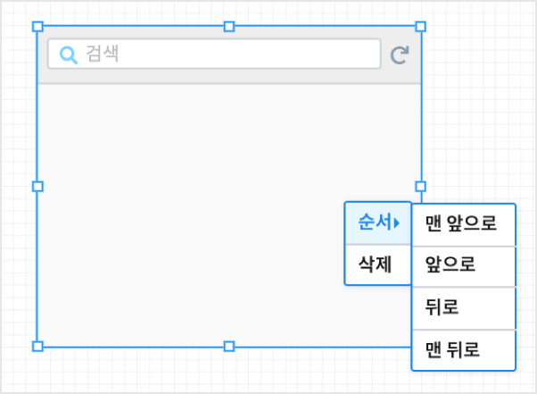

''''''''''''''''''''''''''''''''''''''''''''''''''''''''''''''''''''''''''''''''''''''''''''''''''''''''''''''''''''''''''''''''''''''''''''''''''''''''''''''''''''''''''''''''''''''''''''''''''''''''''''''''''''''''
보고서 이름 설정
''''''''''''''''''''''''''''''''''''''''''''''''''''''''''''''''''''''''''''''''''''''''''''''''''''''''''''''''''''''''''''''''''''''''''''''''''''''''''''''''''''''''''''''''''''''''''''''''''''''''''''''''''''''''

| 왼쪽 툴바 영역 상단 연필(수정) 버튼 클릭 시, 보고서 명을 수정할 수 있도록 수정 기능이 활성화 됩니다. 
| 원하는 보고서 명으로 수정 후 체크버튼 클릭 또는 수정 영역외 다른 영역 클릭 시, 변경된 보고서 명이 적용됩니다. 

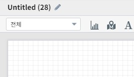

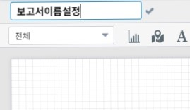

''''''''''''''''''''''''''''''''''''''''''''''''''''''''''''''''''''''''''''''''''''''''''''''''''''''''''''''''''''''''''''''''''''''''''''''''''''''''''''''''''''''''''''''''''''''''''''''''''''''''''''''''''''''''
보고서 보기
''''''''''''''''''''''''''''''''''''''''''''''''''''''''''''''''''''''''''''''''''''''''''''''''''''''''''''''''''''''''''''''''''''''''''''''''''''''''''''''''''''''''''''''''''''''''''''''''''''''''''''''''''''''''

| 보기 버튼 클릭 시, 현재 편집 중인 보고서를 새탭으로 미리 보기 할 수 있습니다.

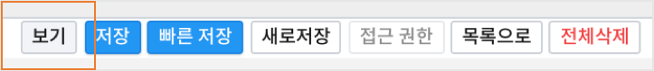

''''''''''''''''''''''''''''''''''''''''''''''''''''''''''''''''''''''''''''''''''''''''''''''''''''''''''''''''''''''''''''''''''''''''''''''''''''''''''''''''''''''''''''''''''''''''''''''''''''''''''''''''''''''''
보고서 저장
''''''''''''''''''''''''''''''''''''''''''''''''''''''''''''''''''''''''''''''''''''''''''''''''''''''''''''''''''''''''''''''''''''''''''''''''''''''''''''''''''''''''''''''''''''''''''''''''''''''''''''''''''''''''

| 저장 버튼 클릭 시, 현재 작성 중인 보고서를 저장 할 수 있습니다. 
| 이 때 카테고리와 보고서 이름을 입력/수정 할 수 있습니다.

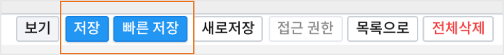

| 빠른 저장은 현재 설정된 카테고리, 보고서이름 그대로 바로 저장합니다.
| 새로 저장은 다른 이름으로 저장을 의미합니다.

''''''''''''''''''''''''''''''''''''''''''''''''''''''''''''''''''''''''''''''''''''''''''''''''''''''''''''''''''''''''''''''''''''''''''''''''''''''''''''''''''''''''''''''''''''''''''''''''''''''''''''''''''''''''
보고서 목록으로
''''''''''''''''''''''''''''''''''''''''''''''''''''''''''''''''''''''''''''''''''''''''''''''''''''''''''''''''''''''''''''''''''''''''''''''''''''''''''''''''''''''''''''''''''''''''''''''''''''''''''''''''''''''''

| 저장 후 목록으로 돌아갑니다.

''''''''''''''''''''''''''''''''''''''''''''''''''''''''''''''''''''''''''''''''''''''''''''''''''''''''''''''''''''''''''''''''''''''''''''''''''''''''''''''''''''''''''''''''''''''''''''''''''''''''''''''''''''''''
전체 삭제
''''''''''''''''''''''''''''''''''''''''''''''''''''''''''''''''''''''''''''''''''''''''''''''''''''''''''''''''''''''''''''''''''''''''''''''''''''''''''''''''''''''''''''''''''''''''''''''''''''''''''''''''''''''''

| 현재의 보고서 캔버스에 생성한 시각화 객체를 모두 삭제합니다.

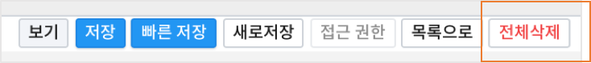

------------------------------------------------------------------------------------------------------
캔버스 (Canvas)
------------------------------------------------------------------------------------------------------

| 새 보고서를 클릭하면 캔버스와 캔버스의 옵션을 설정하는 사이드 패널이 있습니다.

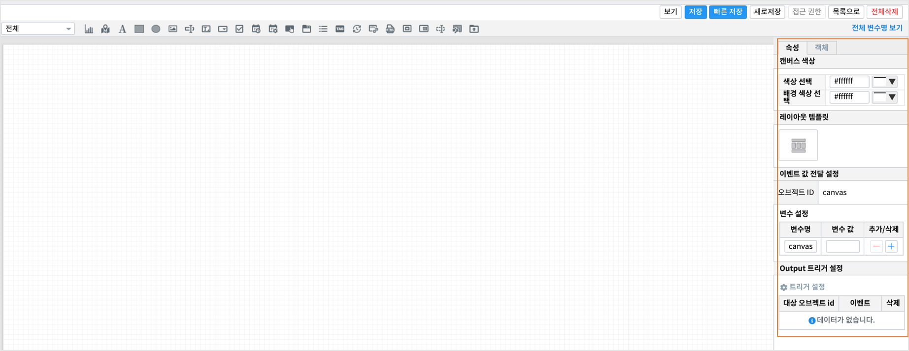

| 캔버스는 객체를 배치하여 캔버스의 크기만큼 화면에 보여줍니다.

'''''''''''''''''''''''''''''''
속성 
'''''''''''''''''''''''''''''''

| 캔버스의 옵션들을 설정할 수 있습니다.

**캔버스 색상**

.. image:: ./studio/images/canvas/canvas_01.png
    :width: 300
    :alt: 캔버스 색상

.. csv-table::
    :header: "옵션 명", "설명"

    "색상 선택", "Canvas 영역의 색상을 변경합니다."
    "배경 색상 선택", "Canvase 바깥 영역의 색상을 변경합니다."

**변수 설정**

| 보고서의 canvas 변수를 설정하고 외부 보고서 및 내부에서 사용할 수 있습니다.

.. image:: ./studio/images/canvas/studio_canvas_14.png
    :alt: canvas 변수 설정

| MAIN보고서와 팝업보고서에서의 변수 설정

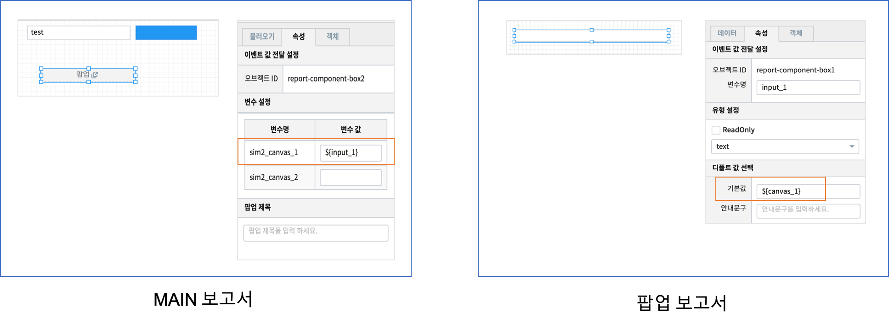

**output 트리거 설정**

| "보고서 가져오기(팝업)", "보고서 가져오기(포틀릿)" 에서 가져올 팝업 보고서 내에서 Global 변수로 설정한 값을 외부로 보낼 때 사용합니다.
| 팝업보고서에서 ouput 트리거로 외부로 보낼 변수를 생성하는 객체를 선택하면,
| 외부(가져오기를 실행하는 주체) 보고서에서 Global 변수로 받아서 사용할 수 있습니다.

------------------------------------------------------------------------------------------------------
예제 : 데이터 객체로 챠트그리기
------------------------------------------------------------------------------------------------------

| 동일한 데이터로 트리맵과 가로막대 챠트 그리기

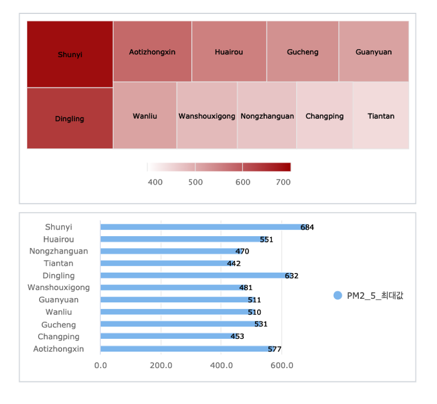

**데이터객체 파트**

| 1. 먼저 데이터객체를 캔버스에 그리면 hidden 객체로 "common_data_번호" 라는 변수로 데이터객체가 생성됩니다.

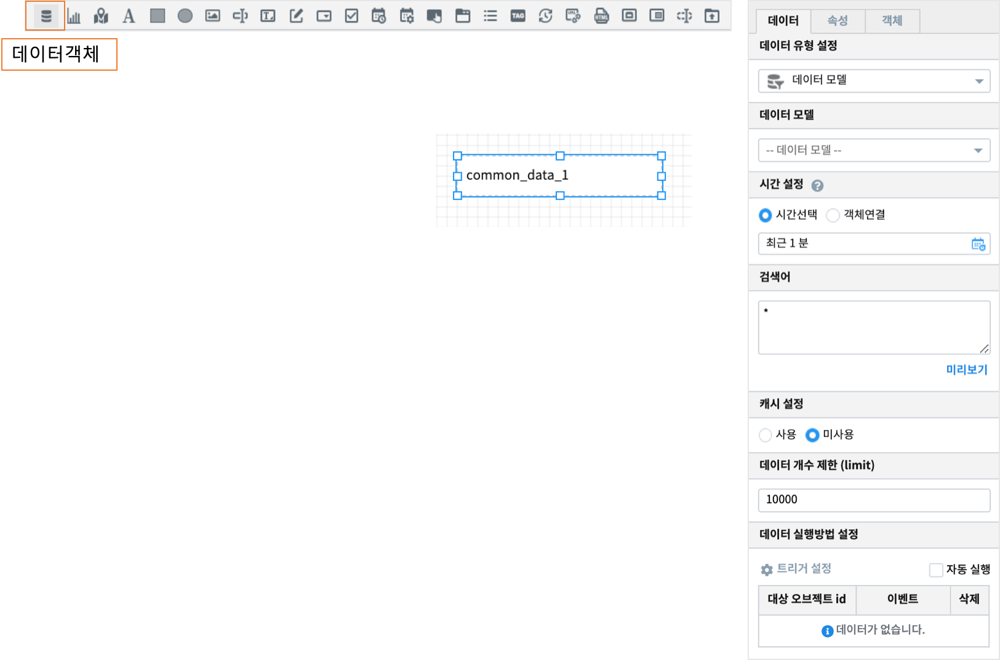

**챠트객체 파트**

| 2. 챠트 객체를 캔버스에 그립니다. 챠트시각화 유형을 처음에는 **테이블** 로 선택합니다.
| 캔버스의 챠트객체에 "데이터가 연결되지 않았습니다" 가 표시됩니다.
| 3. 챠트객체의 **데이터연결** 의 **설정** 을 클릭한 후 연결할 데이터객체를 캔버스에서 체크합니다.

.. image:: ./studio/images/data_61.png
    :scale: 40%
    :alt: studio data 61

**데이터객체 파트**

| 4. 데이터객체를 선택한 후 데이터 설정 작업을 시작합니다.  데이터 탭에서 `데이터 유형 설정 <http://docs.iris.tools/manual/IRIS-Manual/IRIS-Studio/data_visualize.html#id1>`__ 을 합니다.
|
| 5. `캐시 설정 <http://docs.iris.tools/manual/IRIS-Manual/IRIS-Studio/data.html#id6>`__ 은 default 가 미사용입니다. 
| 만약 해당 보고서가 여러 사람들이 빈번하게 열어보는 보고서라면 가져온 데이터를 캐시에 저장하여 빠르게 챠트를 보여줄 수 있습니다.
| 또 같은 보고서에서 여러 개의 챠트에서 같이 사용한다면 캐시를 사용합니다. 
| 예제에서는 같은 데이터를 2개의 챠트에 출력하므로 **사용** 을 설정합니다.
|
| 6. 검색어를 통해 최종적으로 가져오는 `데이터의 개수 제한 <http://docs.iris.tools/manual/IRIS-Manual/IRIS-Studio/data.html#limit>`__ 을 설정합니다.
| 7. **실행** 을 클릭합니다.

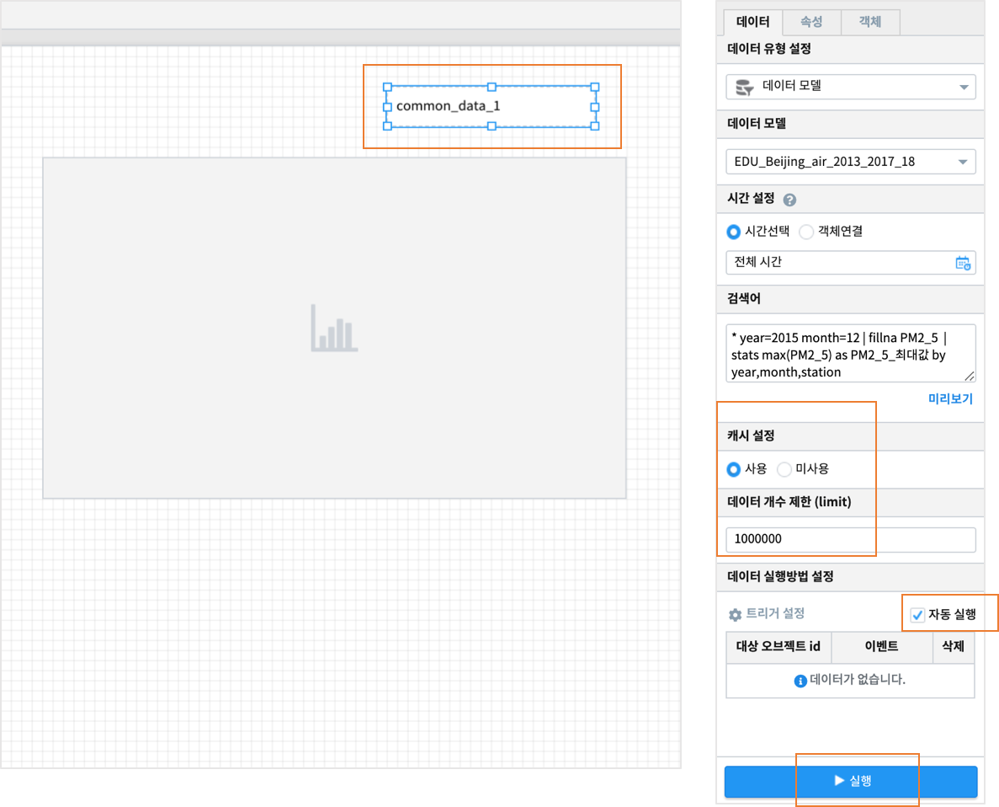

**챠트객체 파트**

| 8. 연결된 챠트에 데이터가 출력됩니다. 
| 시각화탭에서 그려야 할 시각화유형을 선택하고, 시각화 옵션의 데이터에서 실제로 챠트에 보여줄 필드나 옵션 등을 설정합니다.
| 예제에서는 첫 챠트로 트리맵을 선택했습니다.

.. image:: ./studio/images/data_66.png
    :scale: 40%
    :alt: studio data 66

| 9. **빠른 저장** 으로 저장한 후 **보기** 로 결과를 확인합니다. 
|
| 10. 같은 데이터로 또 다른 챠트를 그리려면 챠트 객체를 캔버스에 하나 더 생성합니다.
| 11. 챠트객체의 **데이터연결** 의 "설정" 을 클릭한 후 연결할 데이터객체를 동일한 데이터객체로 체크합니다.

**데이터객체 파트**

| 12. 데이터객체에서 다시 **실행** 버튼을 클릭하면, 연결된 2개의 챠트에서 데이터가 표시됩니다.

**챠트객체 파트**

| 13. 두번째 챠트 객체의 시각화유형을 **가로막대형** 으로 선택하고, 시각화옵션을 설정합니다.

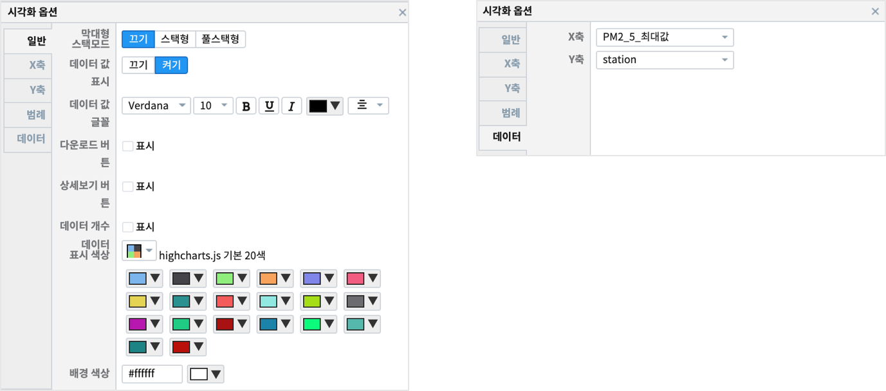

**데이터객체 파트**

| 14. 데이터객체에서  **실행** 버튼을 클릭하면, 연결된 2개의 챠트에서 데이터가 표시됩니다.

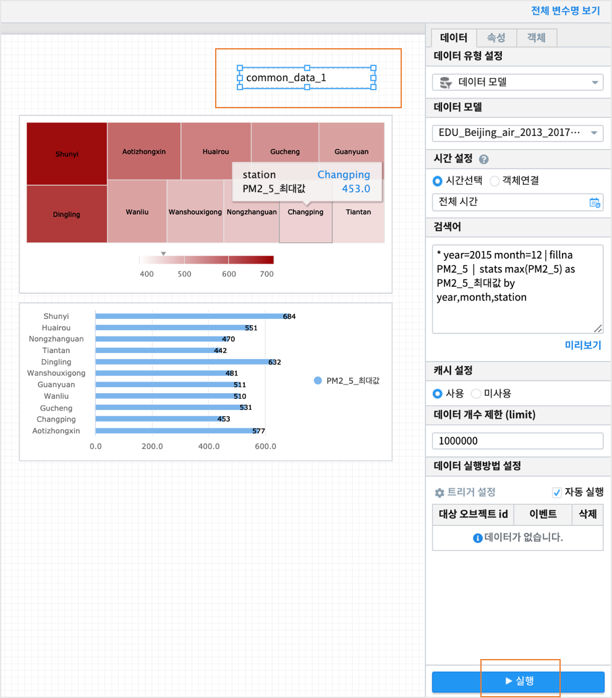

