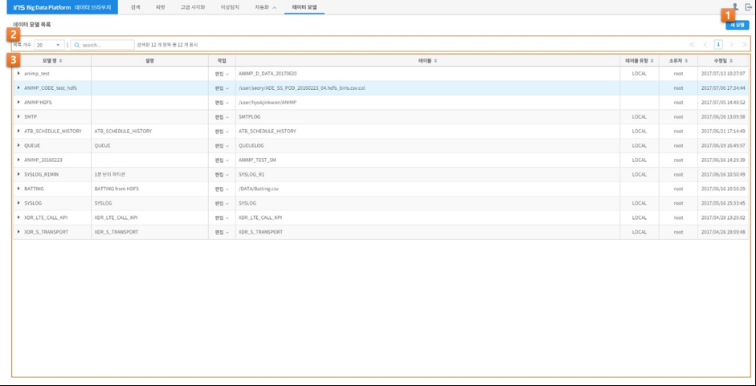
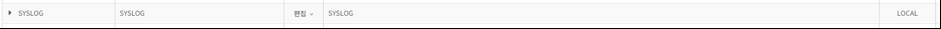
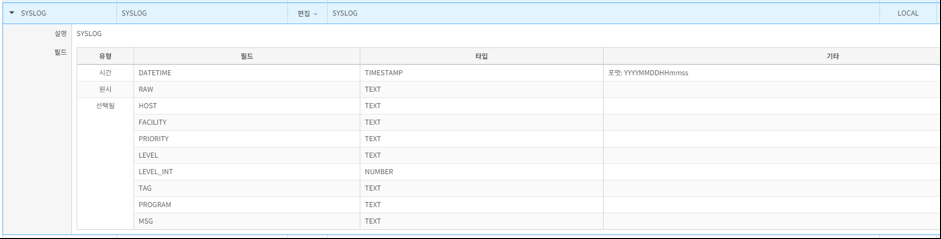
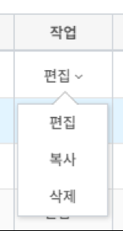
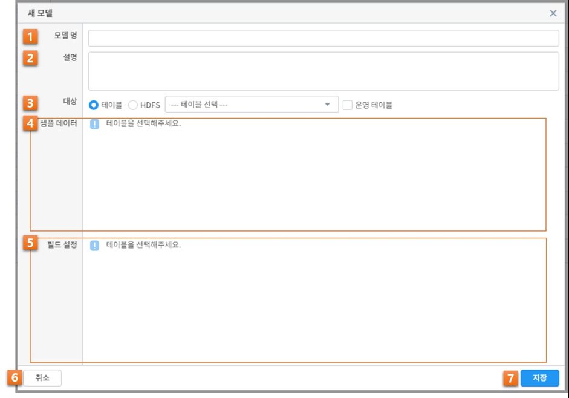
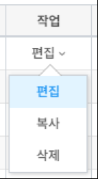
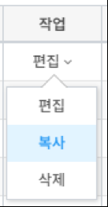
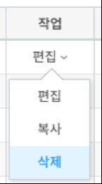

_`데이터 모델`
========================================
데이터 모델은 특정한 데이터 셋을 추상화 한 것입니다. 여기서 데이터 셋은 DB에서 일반적으로 말하는 테이블이나 CSV과 같은 파일을 말합니다. 사용자는 IRIS나 HDFS에서 저장된 데이터 셋을 가지고 필드 선택, 타입 변경과 같은 작업을 통해 자신에게 필요한 형태의 데이터 모델을 생성할 수 있습니다. 하나의 데이터 셋에서 여러 개의 데이터 모델을 목적에 맞게 생성할 수 있는 장점이 있습니다. 데이터 브라우저에서 제공하는 대부분의 기능들은 이 데이터 모델을 기반으로 동작하기 때문에 데이터 모델을 생성 하는 것이 모든 작업의 시작이라고할 수 있습니다.
사용자는 팝업 메뉴 또는 상단에 있는 데이터 모델 메뉴를 선택함으로써 데이터모델 화면으로 이동하게 됩니다.

데이터 모델 화면의 구성은 다음과 같습니다.

+--------+------------------------------------+---------------------------------------------------------------------------------------------------------------+
| 번호   | 구분                               | 설명                                                                                                          |
+========+====================================+===============================================================================================================+
| 1      | 새 모델 버튼                       | 새 데이터 모델을 생성합니다.                                                                                  |
+--------+------------------------------------+---------------------------------------------------------------------------------------------------------------+
| 2      | 데이터 모델 목록 설정              | 표시되는 데이터 모델 목록을 필터링 하거나 선택할 수 있습니다.                                                 |
+--------+------------------------------------+---------------------------+-----------------------------------------------------------------------------------+
| 3      | 데이터 모델 목록                   | 모델명                    | 데이터 모델의 이름이 표시 됩니다.                                                 |
|        |                                    +---------------------------+-----------------------------------------------------------------------------------+
|        |                                    | 설명                      | 데이터 모델의 설명이 표시 됩니다.                                                 |
|        |                                    +---------------------------+-----------------------------------------------------------------------------------+
|        |                                    | 작업                      | 데이터 모델에 대하여 편집/복사/삭제를 할 수 있습니다.                             |
|        |                                    +---------------------------+-----------------------------------------------------------------------------------+
|        |                                    | 테이블                    | 데이터 모델이 생성된 테이블의 이름 또는 경로가 표시 됩니다.                       |
|        |                                    +---------------------------+-----------------------------------------------------------------------------------+
|        |                                    | 테이블 유형               | 데이터 모델이 생성된 테이블의 유형이 표시 됩니다.                                 |
|        |                                    +---------------------------+-----------------------------------------------------------------------------------+
|        |                                    | 소유자                    | 데이터 모델을 생성한 소유자의 아이디가 표시 됩니다.                               |
|        |                                    +---------------------------+-----------------------------------------------------------------------------------+
|        |                                    | 수정일                    | 데이터 모델이 마지막으로 수정된 날짜가 표시 됩니다.                               |
+--------+------------------------------------+---------------------------+-----------------------------------------------------------------------------------+

상기 화면에서는 생성된 데이터 모델 목록을 확인할 수 있으며, 원하는 데이터 모델을 손쉽게 찾기 위한 목록 개수와 필터링 기능을 제공합니다. 등록된 데이터 모델을 펼치면 상세한 정보를 볼 수 있습니다. 또한, 원하는 데이터 모델을 생성, 수정, 복사 하거나 삭제할 수 있습니다.

_`데이터 모델 조회`
----------------------------------------
사용자는 현재 생성된 데이터 모델의 목록을 손쉽게 확인할 수 있으며, 데이터 모델 관리에 필요한 편의 기능들을 제공합니다.

Option 1: 목록 개수
~~~~~~~~~~~~~~~~~~~~~~~~~~~~~~~~~~~~~~
한 페이지에 표시되는 목록의 개수를 지정합니다.

.. image:: ./images/ko/grid_ctrl_01.png

Option 2: 필터링
~~~~~~~~~~~~~~~~~~~~~~~~~~~~~~~~~~~~~~
입력된 텍스트가 포함된 계정만 목록에 표시됩니다.

.. image:: ./images/ko/grid_ctrl_02.png

Option 3: 페이징
~~~~~~~~~~~~~~~~~~~~~~~~~~~~~~~~~~~~~~
원하는 목록의 페이지로 이동합니다.

.. image:: ./images/ko/grid_ctrl_03.png

Option 4: 상세보기
~~~~~~~~~~~~~~~~~~~~~~~~~~~~~~~~~~~~~~
목록에서 모델명 좌측에 ▶ 아이콘을 클릭하면 데이터 모델의 상세정보를 표시합니다. 다시 ▼ 를 클릭하면 상세정보를 닫습니다.
- 상세정보를 펼치기 전

- 상세정보를 펼친 후

+------------------------------------+---------------------------------------------------------------------------------------------------------------+
| 구분                               | 설명                                                                                                          |
+====================================+===============================================================================================================+
| 설명                               | 데이터 모델의 설명이 표시 됩니다.                                                                             |
+------------------------------------+---------------------------+-----------------------------------------------------------------------------------+
| 필드                               | 유형                      | 데이터 모델에 선택된 필드들의 유형이 표시 됩니다.                                 |
|                                    +---------------------------+-----------------------------------------------------------------------------------+
|                                    | 필드                      | 데이터 모델에 선택된 필드의 이름이 표시 됩니다.                                   |
|                                    +---------------------------+-----------------------------------------------------------------------------------+
|                                    | 타입                      | 데이터 모델에 선택된 필드의 타입이 표시 됩니다.                                   |
|                                    +---------------------------+-----------------------------------------------------------------------------------+
|                                    | 기타                      | 데이터 모델에 선택된 필드의 기타 정보가 표시 됩니다.                              |
+------------------------------------+---------------------------+-----------------------------------------------------------------------------------+

Option 5: 작업
~~~~~~~~~~~~~~~~~~~~~~~~~~~~~~~~~~~~~~
특정 데이터 모델을 편집, 복사 하거나 삭제할 수 있습니다.

_`데이터 모델 생성`
----------------------------------------
사용자는 "새 모델" 버튼으로 새로운 데이터 모델을 생성할 수 있습니다. (* 필수 항목)

+--------+--------------------+-----------------------------------------------------------------------------------------------------------------------------------------------------------------------------------------------------------------------------------------------------+
| 번호   | 구분               | 설명                                                                                                                                                                                                                                                |
+========+====================+=====================================================================================================================================================================================================================================================+
| 1      | 모델 명            | 데이터 모델의 이름을 입력할 수 있습니다.                                                                                                                                                                                                            |
+--------+--------------------+-----------------------------------------------------------------------------------------------------------------------------------------------------------------------------------------------------------------------------------------------------+
| 2      | 설명               | 데이터 모델에 대한 설명을 입력할 수 있습니다.                                                                                                                                                                                                       |
+--------+--------------------+---------------+-------------------------------------------------------------------------------------------------------------------------------------------------------------------------------------------------------------------------------------+
| 3      | 대상               | 테이블        | 데이터 모델을 생성하려는 대상을 IRIS에 생성되어 있는 테이블에서 선택 합니다. 목록에서 테이블을 선택하면, 선택된 경로의 샘플 데이터와 필드가 해당 영역에 표시 됩니다.                                                                |
|        |                    |               |                                                                                                                                                                                                                                     |
|        |                    |               | .. image:: ./images/ko/model_new_dlg_sel_table.png                                                                                                                                                                       |
|        |                    |               |                                                                                                                                                                                                                                     |
|        |                    |               | "운영 테이블" 체크박스를 클릭하면, 테이블 목록에 운영 테이블이 표시 됩니다. 운영 테이블은 실제로 시스템 운용에 사용되는 테이블 입니다.                                                                                              |
|        |                    +---------------+-------------------------------------------------------------------------------------------------------------------------------------------------------------------------------------------------------------------------------------+
|        |                    | HDFS          | 데이터 모델을 생성하려는 대상을 HDFS에 존재하는 폴더 또는 파일 중에서 선택 합니다. 폴더를 선택할 경우에는 해당 폴더 내에 있는 내용을 읽어 들입니다.                                                                                 |
|        |                    |               | 폴더 또는 파일의 경로를 직접 입력하거나, "찾아보기" 버튼을 누르면 팝업으로 나타나는 HDFS 브라우저를 통하여 선택할 수 있습니다. HDFS 브라우저의 사용법은 HDFS 브라우저 매뉴얼을 참조 하시기 바랍니다.                                |
|        |                    |               | 파일의 경우에는 CSV 파일만 지원하며, 내용의 분리기호는 "분리기호" 입력란에서 변경할 수 있습니다.                                                                                                                                    |
|        |                    |               | 경로를 입력되거나 선택하면, 선택된 경로의 샘플 데이터와 필드가 해당 영역에 표시 됩니다.                                                                                                                                             |
+--------+--------------------+---------------+-------------------------------------------------------------------------------------------------------------------------------------------------------------------------------------------------------------------------------------+
| 4      | 샘플 데이터        | 선택된 대상에 대한 샘플 데이터를 최대 10건까지 표시합니다.                                                                                                                                                                                          |
+--------+--------------------+-----------------------------------------------------------------------------------------------------------------------------------------------------------------------------------------------------------------------------------------------------+
| 5      | 필드 설정          | 선택된 대상에 존재하는 필드 중에서 실제로 사용될 필드를 선택합니다. 필드 유형에 따른 설명은 다음과 같습니다.                                                                                                                                        |
|        |                    +---------------+-------------------------------------------------------------------------------------------------------------------------------------------------------------------------------------------------------------------------------------+
|        |                    | 시간          | 데이터 브라우저에서 시간 설정과 같은 시간과 관련된 기능을 사용할 때 기준이 되는 필드 입니다. 필드를 선택하고 "기타" 입력란에 원하는 시간 포맷을 입력하면 해당 포맷을 가지고 데이터를 인식합니다.                                    |
|        |                    |               | 유효한 시간 포맷은 http://momentjs.com/docs/#/parsing/string-format/ 을 참고하시기 바랍니다.                                                                                                                                        |
|        |                    |               | 선택하지 않을 경우 시간과 관련된 기능을 사용할 수 없습니다. 단, IRIS 테이블 중에서 LOCAL 테이블은 시간 필드를 필수로 선택해야 합니다.                                                                                               |
|        |                    +---------------+-------------------------------------------------------------------------------------------------------------------------------------------------------------------------------------------------------------------------------------+
|        |                    | 원시          | Fulltext 검색에 사용될 필드를 선택합니다.                                                                                                                                                                                           |
|        |                    +---------------+-------------------------------------------------------------------------------------------------------------------------------------------------------------------------------------------------------------------------------------+
|        |                    | 선택됨        | 사용자에 의해 선택된 필드의 목록입니다. 타입 변경이 가능하며 타입이 TIMESTAMP일 경우 시간 필드와 동일하게 시간 포맷을 입력해야 합니다.                                                                                              |
|        |                    +---------------+-------------------------------------------------------------------------------------------------------------------------------------------------------------------------------------------------------------------------------------+
|        |                    | 미선택        | 선택이 가능한 필드의 목록 입니다.                                                                                                                                                                                                   |
+--------+--------------------+---------------+-------------------------------------------------------------------------------------------------------------------------------------------------------------------------------------------------------------------------------------+
| 6      | 취소 버튼          | 데이터 모델 생성을 취소합니다.                                                                                                                                                                                                                      |
+--------+--------------------+---------------+-------------------------------------------------------------------------------------------------------------------------------------------------------------------------------------------------------------------------------------+
| 7      | 저장 버튼          | 현재 설정으로 데이터 모델을 생성합니다.                                                                                                                                                                                                             |
+--------+--------------------+-----------------------------------------------------------------------------------------------------------------------------------------------------------------------------------------------------------------------------------------------------+

_`데이터 모델 편집`
----------------------------------------
사용자는 데이터 모델 목록에서 편집 > 편집 버튼으로 기존에 생성된 데이터 모델을 편집할 수 있습니다. 편집 화면은 생성 화면과 동일 합니다.

_`데이터 모델 복사`
----------------------------------------
사용자는 데이터 모델 목록에서 편집 > 복사 버튼으로 기존에 생성된 데이터 모델을 복사할 수 있습니다. 복사 화면은 생성 화면과 동일 합니다.

_`데이터 모델 삭제`
----------------------------------------
사용자는 데이터 모델 목록에서 편집 > 삭제 버튼으로 기존에 생성된 데이터 모델을 삭제할 수 있습니다. 삭제 버튼을 누르면 나타나는 팝업에서 “예”를 누르면 최종적으로 삭제 됩니다. 해당 데이터 모델을 사용하여 생성한 보고서(Job)은 사용할 수 없게 됩니다.

