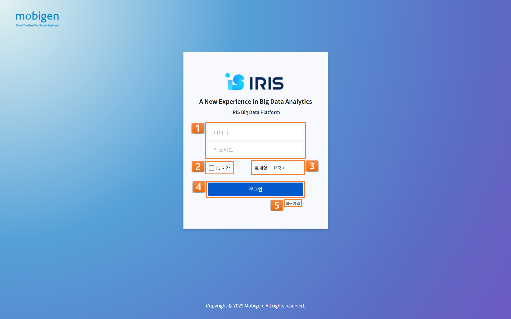
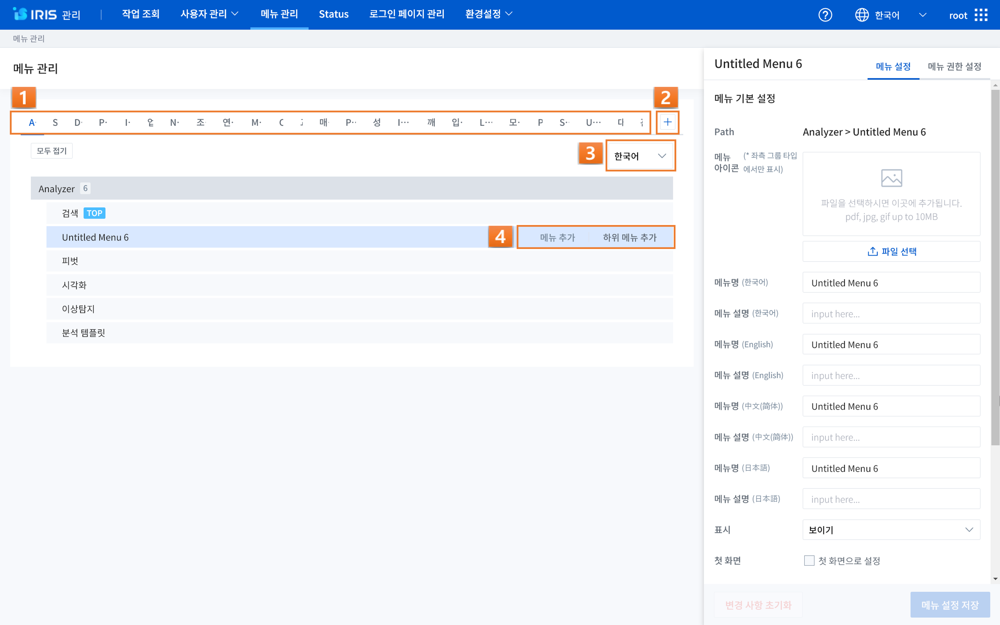
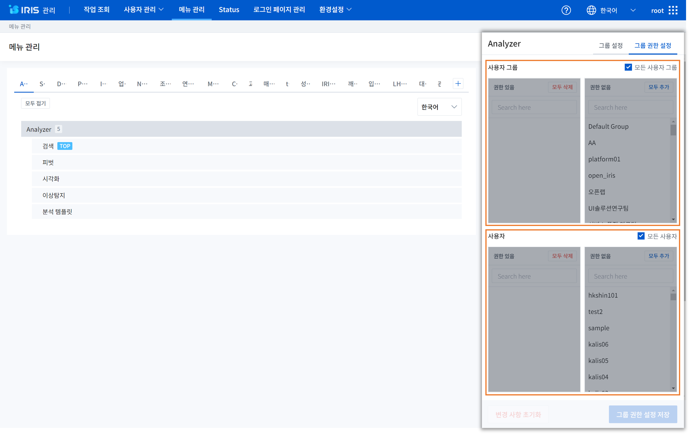

IRIS Web Platform
======================

일반 기능
************************

| IRIS Web Platform(IWP)의 일반 기능은 하위의 IRIS 서비스를 메뉴로 모아서 보여주고 이를 관리할 수 있는 일반적인 기능에 관한 내용입니다.
| 메뉴를 포함하여 로그인 및 홈 화면 설정, 개인 설정 및 유저 정보 관리 등을 수행할 수 있습니다.

| 

로그인 화면
---------------
IRIS Web Platform(IWP)에 접속하기 위한 로그인 화면입니다. 회원가입 기능 활성화 시, 승인을 통한 회원가입이 가능합니다. 

+---------+-------------------+------------------------------------------------------------------------------------+
| 번호    | 구분              | 설명                                                                               |
+=========+===================+====================================================================================+
| 1       | 계정 입력         | 아이디(ID)와 패스워드(PW)와 같은 계정 정보를 입력하실 수 있습니다.                 |
+---------+-------------------+------------------------------------------------------------------------------------+
| 2       | ID 저장           | 아이디(ID) 정보를 저장하실 수 있습니다.                                            |
+---------+-------------------+------------------------------------------------------------------------------------+
| 3       | 로케일 설정       | 서비스 언어 - 한국어, 영어(English), 중국어(中文), 일어(日本語) 선택이 가능합니다. |
+---------+-------------------+------------------------------------------------------------------------------------+
| 4       | 로그인            | 로그인 후 대시보드 등 설정한 홈 화면으로 진입이 가능합니다.                        |
+---------+-------------------+------------------------------------------------------------------------------------+
| 5       | 회원가입          | 계정 생성을 희망하시는 경우, 회원가입을 진행하실 수 있습니다.                      |
+---------+-------------------+------------------------------------------------------------------------------------+

| 

홈화면
---------------

| IRIS에 접속하면 보여지는 첫 화면(홈 화면) 입니다. 홈화면(대시보드)은 사용자가 한눈에 시스템의 정보를 볼 수 있는 직관적인 사용자 인터페이스를 제공합니다.
| 또한, 상단 우측의 GNB(Global Navigation Bar)를 통해 IRIS 각각의 기능으로 손 쉽게 이동이 가능합니다. 

+------+------------------------------+--------------------------------------------------------------------------------------------------------------------------+
| 번호 | 구분                         | 설명                                                                                                                     |
+======+==============================+==========================================================================================================================+
| 1    | 도움말/새로운 기능           | IRIS 플랫폼을 이용하기 위한 도움말 및 릴리즈 정보를 확인하실 수 있습니다.                                                |
+------+------------------------------+--------------------------------------------------------------------------------------------------------------------------+
| 2    | 로케일 설정                  | 서비스 언어 - 한국어, 영어(English), 중국어(中文), 일어(日本語) 선택이 가능합니다.                                       |
+------+------------------------------+--------------------------------------------------------------------------------------------------------------------------+
| 3    | 메인 메뉴                    | Anlayzer, Studio, Discovery, Playground , IRIS DB 등의 메뉴로 접근이 가능합니다.                                         |
+------+------------------------------+--------------------------------------------------------------------------------------------------------------------------+
| 4    | 홈화면                       | 홈화면 아이콘을 누르면 다른 메뉴에서 사용자 지정 첫 화면(대시보드, 보고서 등)으로 접근할 수 있습니다.                    |
+------+------------------------------+--------------------------------------------------------------------------------------------------------------------------+
| 5    | 대시보드 메뉴                | 다른 메뉴에서 대시보드 화면으로 접근할 수 있습니다.                                                                      |
+------+------------------------------+--------------------------------------------------------------------------------------------------------------------------+
| 6    | 개인설정/유저정보            | 개인 설정 및 유저 정보 확인이 가능합니다.                                                                                |
+------+------------------------------+--------------------------------------------------------------------------------------------------------------------------+
| 7    | 로그아웃                     | 처음 로그인 화면으로 돌아갑니다.                                                                                         |
+------+------------------------------+--------------------------------------------------------------------------------------------------------------------------+
| 8    | 대시보드 변경                | 보고서 목록에서 ＇대시보드 > 사용'으로 등록된 보고서들의 리스트를 확인하실 수 있으며, 메인 대시보드의 변경이 가능합니다. |
+------+------------------------------+--------------------------------------------------------------------------------------------------------------------------+

| 

개인 설정/유저정보
--------------------

| 개인 설정에서는 사용자가 로그인 이후 보여질 첫 화면을 지정할 수 있습니다.
| 그 밖에 IRIS Platform 내의 전반적인 설정과 유저 정보에서는 현재 접속해 있는 사용자(유저) 정보 확인 및 변경을 실행 할 수 있습니다.

+------+----------------------+------------------------------------------------------------------------------------------+
| 번호 | 구분                 | 설명                                                                                     |
+======+======================+==========================================================================================+
| 1    | 개인 설정 진입       | 오른쪽 상단의 메인 메뉴의 개인설정 아이콘을 통해 개인 설정에 진입합니다.                 |
+------+----------------------+------------------------------------------------------------------------------------------+
| 2    | 미니 도움말          | 첫 화면으로 지정할 메뉴를 선택합니다.                                                    |
+------+----------------------+------------------------------------------------------------------------------------------+
| 3    | 소수점 설정          | IRIS Platform 내의 전체 숫자에 대하여 소수점을 설정 및 소수점 자리 수 설정이 가능합니다. |
+------+----------------------+------------------------------------------------------------------------------------------+
| 4    | 천 단위 콤마(,) 표시 | IRIS Platform 내의 전체 숫자에 대하여 천 단위 콤마(,) 표시 여부를 선택할 수 있습니다.    |
+------+----------------------+------------------------------------------------------------------------------------------+
| 5    | 미니 도움말 사용     | IRIS Platform 내의 미니 도움말 기능을 사용할 지 여부를 선택할 수 있습니다.               |
+------+----------------------+------------------------------------------------------------------------------------------+
| 6    | 새로 고침            | 새로 고침(지정 없음) 설정 시, 첫 화면이 사용자 지정이 아닌 홈화면으로 지정됩니다.        |
+------+----------------------+------------------------------------------------------------------------------------------+

+------+----------+------------------------------------------------------+
| 번호 | 구분     | 설명                                                 |
+======+==========+======================================================+
| 1    | 아이디   | (필수) 사용자 ID를 확인할 수 있습니다.               |
+------+----------+------------------------------------------------------+
| 2    | 비밀번호 | (필수) 비밀번호를 변경할 수 있습니다.                |
+------+----------+------------------------------------------------------+
| 3    | 이름     | (필수) 이름을 변경할 수 있습니다.                    |
+------+----------+------------------------------------------------------+
| 4    | 그룹     | (디폴트) 가입 당시 소속된 그룹을 확인할 수 있습니다. |
+------+----------+------------------------------------------------------+
| 5    | 전화번호 | (필수) 전화번호를 변경할 수 있습니다.                |
+------+----------+------------------------------------------------------+
| 6    | 이메일   | (선택) 유저 이메일을 입력할 수 있습니다.             |
+------+----------+------------------------------------------------------+
| 7    | 설명     | (선택) 유저 정보에 대한 설명을 입력할 수 있습니다.   |
+------+----------+------------------------------------------------------+
| 8    | 초기화   | 유저 정보 수정/변경 시, 초기화 버튼이 활성화됩니다.  |
+------+----------+------------------------------------------------------+

| 

관리 기능
************************

| IRIS Big Data Platform을 활용하기 위한 IRIS 관리자 매뉴얼 입니다. IRIS 관리 기능 메뉴와 대시보드 관리에 대해 설명합니다.
| 작업조회 및 사용자 관리, 메뉴 관리, Status, 로그인 페이지 관리, 환경설정 등에 관한 root 계정의 관리자 기능에 대한 매뉴얼을 확인하실 수 있습니다.
| 우측 상단의 ‘톱니바퀴 아이콘’을 눌러 접속하실 수 있습니다.

------------------------------------------------------------------

작업조회
---------------
IRIS 작업 조회를 통해 IRIS를 통해 수행되고 있는 작업의 진행상태, 결과, 사용자, 쿼리 등을 조회하고 관리할 수 있습니다.

    
+------+----------------------------+---------------------------------------------------------------------------------------------------------------------------------------------+
| 번호 | 구분                       | 설명                                                                                                                                        |
+======+============================+=============================================================================================================================================+
|| 1   || 작업 관리 조회            || 작업 시작 시간 및 종료 시간, 검색 필터 구문 등을 넣어서 문제가 되는 시점의 작업 진행 현황이나 사용자 특이 사항 등을 파악할 수 있습니다.    |
||     ||                           || 그 밖에 아래 화살표 아이콘을 클릭하여 상세 조회를 통한 연결 유형 및 연결 명, 상태, 결과, 결과 개수, 쿼리 등의 세부 정보 검색도 가능합니다. |
+------+----------------------------+---------------------------------------------------------------------------------------------------------------------------------------------+
|| 2   || 작업 관리 정보            || 작업 ID, 시작 시간, 종료 시간, 수행 시간, 상태, 결과, 결과 개수, 연결 유형, 연결 명, 사용자, 쿼리 등을 확인할 수 있습니다.                 |
+------+----------------------------+---------------------------------------------------------------------------------------------------------------------------------------------+
|| 3   || 다운로드                  || 작업 관리 목록(JOB HISTORY)를 csv 파일로 다운받을 수 있습니다.                                                                             |
+------+----------------------------+---------------------------------------------------------------------------------------------------------------------------------------------+
|| 4   || 작업 ID 상세 조회         || 상세 조회를 원하는 작업ID를 클릭하면 상세조회 팝업창이 뜨며, IRIS DSL을 제외한 SQL문은 모두 암호화되어 표시됩니다.                         |
||     ||                           || 그 밖에 상세 정보, 시각화, 다운로드 이력 등을 확인하실 수 있습니다.                                                                        |
+------+----------------------------+---------------------------------------------------------------------------------------------------------------------------------------------+

- **작업 ID 상세 조회**

    - 상세 정보: 상태, 결과, 파일 다운로드 가능 여부, 사용자 정보, 쿼리, 파일 종류, 작업 ID, 연결 명, 연결 유형, 종료 시간 및 시작 시간, 파일 레코드 수, 파일 등록 시간, 파일 크기 등의 정보를 확인하실 수 있습니다.
    - 시각화: 상세 컬럼 등의 테이블 및 차트를 확인할 수 있습니다.
    - 다운로드 이력: 결과를 다운로드 한 사용자 및 다운로드 시간, 아이피 등의 이력을 조회할 수 있습니다.

| 

사용자 관리
---------------
IRIS의 사용자 계정과 그룹을 생성하거나 편집하며, 회원 가입, 감사 로그 등을 관리합니다. 또한 계정/그룹별로 메뉴의 접근 권한을 제어할 수 있습니다.

+------+----------------------------------------------+--------------------------------------------------------------------------------------------------------------------------------------+
| 번호 | 구분                                         | 설명                                                                                                                                 |
+======+==============================================+======================================================================================================================================+
|| 1   || 사용자 계정 목록                            || 목록의 개수, 유형별 필터, 계정 명 검색 및 새로고침을 할 수 있습니다.                                                                |
||     ||                                             || 새로고침을 누르면 현재 등록된 사용자 계정 목록이 갱신됩니다.                                                                        |
||     ||                                             || 관리자는 모든 계정 조회가 가능하며, 그룹장은 해당 계정이 속한 그룹에 존재하는 계정들에 한하여 조회가 가능합니다.                    |
+------+----------------------------------------------+--------------------------------------------------------------------------------------------------------------------------------------+
|| 2   || 사용자 계정 정보                            || 사용자 ID, 이름, 역할, 그룹, 설명, 계정 생성일 확인, 관리(수정 및 삭제)를 실행할 수 있습니다.                                       |
+------+----------------------------------------------+--------------------------------------------------------------------------------------------------------------------------------------+
|| 3   || 사용자 계정 정보 상세보기                   || 사용자 계정을 더블 클릭하여 상세보기를 통해 사용자 계정 정보를 확인하실 수 있습니다. 수정 버튼을 눌러 사용자 계정 수정이 가능합니다.|
+------+----------------------------------------------+--------------------------------------------------------------------------------------------------------------------------------------+

- **사용자 계정 정보**

    - 아이디: 계정의 고유한 ID 정보가 표시됩니다.
    - 이름: 사용자의 이름 혹은 닉네임 정보가 표시됩니다.
    - 역할: 사용자의 설정된 역할 혹은 등급 정보가 표시됩니다.
    - 그룹: 사용자의 그룹 정보가 표시됩니다.
    - 전화번호: 사용자의 연락처 정보가 표시됩니다.
    - 설명: 설명 혹은 비고란입니다.
    - 이메일: 사용자의 이메일 주소 정보가 표시됩니다.

+------+------------------------+------------------------------------------------------------------------------------------------------------------------------+
| 번호 | 구분                   | 설명                                                                                                                         |
+======+========================+==============================================================================================================================+
|| 1   || 사용자 계정 추가      || 아이디, 비밀번호, 비밀번호 확인, 이름, 역할, 그룹, 전화번호, 설명, 이메일 정보 입력 후 사용자 계정을 추가할 수 있습니다.    |
||     ||                       || 역할은 관리자(최고 관리자 root와 동일 권한)/그룹장/사용자 세 가지 중 하나로 설정할 수 있으며, 기본값은 사용자입니다.        |
+------+------------------------+------------------------------------------------------------------------------------------------------------------------------+
|| 2   || 사용자 정보 관리      || 사용자 정보(항목)를 관리할 수 있습니다. 임의로 사용자 속성 필드를 추가하고 삭제할 수 있으며, 필드의 순서를 바꿀 수 있습니다.|
+------+------------------------+------------------------------------------------------------------------------------------------------------------------------+

- **사용자 정보 관리**

    - 순서: ‘▲▼버튼'을 사용하여 사용자 정보 관리 항목의 순서를 변경할 수 있습니다.
    - 한국어(및 언어 선택): 아이디 생성/관리 시 나타나는 항목에 대하여 왼쪽 상단의 언어 선택 콤보박스를 통해 필요 시, 일본어/중국어/영어로 제공받을 수 있습니다.
    - 필드 타입: 아이디 생성/관리 시 나타나는 항목의 텍스트, 드릴 다운 등의 필드 타입을 확인할 수 있습니다.
    - 필드 길이 제한: 아이디 생성/관리 시 나타나는 항목의 필드 길이를 제한 할 수 있습니다.
    - 사용 여부: 아이디 생성/관리 시 나타나는 항목의 사용(사용/미사용) 여부를 선택할 수 있습니다.
    - 필수 여부: 아이디 생성/관리 시 나타나는 항목의 필수(필수/선택) 여부를 선택할 수 있습니다.
    - 목록 표시: 아이디 생성/관리 시 나타나는 항목의 목록 표시(표시/숨김) 여부를 선택할 수 있습니다.
    - 추가/삭제: 아이디 생성/관리 시 나타나는 항목의 추가 및 삭제 선택이 가능합니다.

+------+---------------+-----------------------------------------------------------------------------------------------------------------+
| 번호 | 구분          | 설명                                                                                                            |
+======+===============+=================================================================================================================+
|| 1   || 그룹 목록    || 목록의 개수, 유형별 필터, 그룹 명 검색 및 새로 고침을 할 수 있습니다.                                          |
+------+---------------+-----------------------------------------------------------------------------------------------------------------+
|| 2   || 그룹 정보    || 그룹 명, 설명 확인, 관리(수정 및 삭제)를 실행할 수 있습니다. 관리에서 그룹의 수정 및 삭제를 진행할 수 있습니다.|
+------+---------------+-----------------------------------------------------------------------------------------------------------------+
|| 3   || 그룹 추가    || 새로운 그룹(그룹 명, 설명)을 추가할 수 있습니다. 그룹 명은 필수 입력란 입니다.                                 |
||     ||              || 추가된 메뉴는 드래그&드롭으로 순서를 변경할 수 있습니다.                                                       |
+------+---------------+-----------------------------------------------------------------------------------------------------------------+

- **그룹**

    - 그룹은 함께 일하는 사람 등, 특정 기준에 부합되는 아이디를 그룹핑하는 기능입니다. 하나의 아이디는 한 그룹으로만 배정될 수 있으며, 그룹을 설정함으로써 메뉴/데이터 모델/보고서 등에 권한을 줄 때, 한번에 권한을 제어할 수 있습니다. 그룹 생성은 일반적으로 root 계정에서만 가능합니다.

        - 그룹 정보

            - 그룹명: 그룹의 명칭 정보입니다.  

            - 설명: 그룹에 관한 설명 및 비고입니다. 

            - 관리

                - 수정: 그룹의 정보 수정은 일반적으로 관리자 계정만 가능합니다. 조회 목록에서 특정 그룹의 ‘수정’ 버튼을 클릭하면 화면에 다이얼로그가 표시되고, 항목을 수정한 뒤에 저장 버튼을 누르면 수정 내용이 반영됩니다. 단, 기본 그룹은 수정 및 삭제가 불가능 합니다.
                - 삭제: 특정 그룹을 삭제합니다.

+------+-------------------------------+------------------------------------------------------------------------------------------------------------------------------+
| 번호 | 구분                          | 설명                                                                                                                         |
+======+===============================+==============================================================================================================================+
| 1    | 회원 가입 신청 목록           | 신청 아이디 검색 및 새로고침, 모두 수락 및 모두 거부를 할 수 있습니다.                                                       |
+------+-------------------------------+------------------------------------------------------------------------------------------------------------------------------+
| 2    | 회원 가입 신청 정보           | 회원 가입을 신청한 사용자 ID, 이름, 전화번호, 이메일, 신청 메시지, 요청일 확인 및 작업(수락 및 거부)를 실행하실 수 있습니다. |
+------+-------------------------------+------------------------------------------------------------------------------------------------------------------------------+

+------+---------------------------------------------+-----------------------------------------------------------------------------------------------------------------------------+
| 번호 | 구분                                        | 설명                                                                                                                        |
+======+=============================================+=============================================================================================================================+
| 1    | 감사 로그(Audit Log) 목록                   | 기간 및 일자 필터, 콤보박스(메뉴 실행/로그인 성공/로그인 실패/로그아웃) 필터, 검색어 필터 등을 활용하여 검색할 수 있습니다. |
+------+---------------------------------------------+-----------------------------------------------------------------------------------------------------------------------------+
| 2    | 감사 로그(Audit Log) 정보                   | 실행 일시, 메뉴(로그인/로그아웃), 실행 계정, 실행 IP 등과 같은 정보를 조회할 수 있습니다.                                   |
+------+---------------------------------------------+-----------------------------------------------------------------------------------------------------------------------------+
| 3    | 다운로드                                    | 감사 로그(Audit Log) 목록(Audit-log)를 csv 파일로 다운받을 수 있습니다.                                                     |
+------+---------------------------------------------+-----------------------------------------------------------------------------------------------------------------------------+

- **감사 로그(Audit Log)**

    - 감사 로그(Audit Log)는 목록에서 시간, 로그인/로그아웃, 사용메뉴, 실행 계정, 실행 IP 등을 조회할 수 있는 기능입니다. 

| 

메뉴 관리
----------------
IRIS의 모든 상위 메뉴 단위로 사용자, 그룹 별로 하위 메뉴 구성, 권한 부여, 메뉴 별 로고 이미지 등을 관리할 수 있습니다.

+------+--------------------------------------+----------------------------------------------------------------------------------------------------------------------------------------------+
| 번호 | 구분                                 | 설명                                                                                                                                         |
+======+======================================+==============================================================================================================================================+
| 1    | 그룹 목록                            | 설정한 그룹과 그룹의 하위 개념의 메뉴들의 목록을 확인할 수 있습니다.                                                                         |
+------+--------------------------------------+----------------------------------------------------------------------------------------------------------------------------------------------+
| 2    | 그룹 추가                            | '+’ 버튼을 눌러 그룹을 추가할 수 있습니다. 이 때, 대시보드와 관리 메뉴는 기본 메뉴로 사용자가 생성한 그룹은 기본 메뉴 앞에 위치하게 됩니다.  |
+------+--------------------------------------+----------------------------------------------------------------------------------------------------------------------------------------------+
| 3    | 언어 설정                            | 기존에 한국어/English/中文/日本語 등으로 설정된 언어에 맞게 그룹명을 확인할 수 있습니다.                                                     |
+------+--------------------------------------+----------------------------------------------------------------------------------------------------------------------------------------------+
| 4    | 메뉴/하위 메뉴 추가                  | 그룹에 생성된 1 Depth 메뉴에 마우스 오버 시, 메뉴 추가 및 하위 메뉴 추가 버튼이 출력됩니다.                                                  |
+------+--------------------------------------+----------------------------------------------------------------------------------------------------------------------------------------------+

- **메뉴/하위 메뉴 추가**

    - 메뉴 추가: 해당 메뉴와 같은 Depth의 메뉴를 추가합니다.
    - 하위 메뉴 추가: 해당 메뉴 하위에 메뉴를 추가합니다.

- **그룹 설정**

    - 그룹 기본 설정 및 그룹 기본 설정을 할 수 있습니다.

        - 그룹 기본 설정

            - 그룹 메뉴 아이콘: 그룹 메뉴를 대표하는 아이콘을 설정할 수 있습니다.
            - 그룹명(한국어/English/中文/日本語): 언어별로 그룹명을 설정할 수 있습니다.
            - 그룹 설명(한국어/English/中文/日本語): 언어별로 그룹에 대한 설명을 기재할 수 있습니다.
            - 첫 그룹: 체크박스를 활용하여 그룹을 첫 화면으로 설정/미설정 할 수 있습니다.

        - 그룹 설정

            - 그룹 타입

                - 그룹 타입을 상단/사이드/외부 서비스 연결 중에 선택할 수 있습니다.

                    - 상단: 메뉴 그룹에 속한 서브 메뉴가 상단 영역에 노출될 수 있도록 설정하는 방식입니다.
                    - 사이드: 메뉴 그룹에 속한 서브 메뉴가 LNB(Left Navigation Bar)로 노출될 수 있도록 설정하는 방식입니다.
                    - 외부 서비스 연결: 외부 URL을 등록하여 해당 그룹 클릭 시 외부 서비스로 연결될 수 있도록 있도록 설정하는 방식입니다.

            - 그룹 로고 이미지: 해당 그룹 진입 시, 좌측 상단에 출력되는 로고 이미지를 설정할 수 있습니다.

            - 메뉴경로 노출 설정: 체크박스를 활용하여 메뉴경로 노출을 설정/미설정 할 수 있습니다.

- **그룹 권한 설정**

    - 사용자 및 사용자 그룹에 대한 설정을 할 수 있습니다.

        - 사용자 그룹: 사용자 그룹에 대하여 해당 메뉴 그룹의 접근 권한 설정을 할 수 있습니다.
        - 사용자: 개별 사용자에 대하여 해당 메뉴 그룹의 접근 권한 설정을 할 수 있습니다.

- **메뉴 설정**

    - 메뉴 기본 설정 및 서비스 연결 설정, 서브메뉴 관련 설정을 할 수 있습니다.

        - 메뉴 기본 설정

            - Path: 대표 그룹에서 부터 해당 메뉴의 연결 경로를 확인할 수 있습니다.
            - 메뉴 아이콘: 메뉴를 대표하는 아이콘을 설정할 수 있습니다.
            - 메뉴명 (한국어/English/中文/日本語): 언어별로 메뉴명을 설정할 수 있습니다.
            - 메뉴 설명 (한국어/English/中文/日本語): 언어별로 메뉴에 대한 설명을 기재할 수 있습니다.
            - 표시: 메뉴 보이기/감추기 설정을 할 수 있습니다.
            - 첫 화면: 체크박스를 활용하여 첫 화면으로 설정/미설정을 할 수 있습니다.

        - 서비스 연결 설정

            - 서비스 유형: 내부/외부/스튜디오에 대한 설정을 할 수 있습니다. ‘내부’는 IRIS에서 제공하는 기능 중 설정하는 것이며, ‘외부＇는 외부 컨텐츠를 URL로 연결하는 것입니다. ‘스튜디오’는 스튜디오에서 생성한 보고서를 연결하는 설정을 말합니다.
            - 서비스 선택: Meta/데이터 추가/대시보드/클러스터 관리/PlayGround/DB조회/HDFS조회/데이터브라우저/스튜디오/Studio Service/Map Analyzer  와 같은 서비스의 선택이 가능합니다. 

        - 서브메뉴 관련 설정

            - 서브메뉴 타입: 메가 메뉴 섹션 사용/메가 메뉴 섹션 미사용/미니 메뉴 등으로 서브메뉴 타입을 설정할 수 있습니다. 

- **메뉴 권한 설정**

    - 사용자 및 사용자 그룹에 대한 설정을 할 수 있습니다.

        - 사용자 그룹: 사용자 그룹에 대하여 해당 메뉴의 접근 권한 설정을 할 수 있습니다.
        - 사용자: 개별 사용자에 대하여 해당 메뉴의 접근 권한 설정을 할 수 있습니다.

| 

Status
-------------------
IRIS 내 모든 pod 에 대한 현황 정보를 볼 수 있는 메뉴입니다.

+------+---------------+--------------------------------------------------------------------------------------------------------------------------------------------------------------------------------------------------------------------------------+
| 번호 | 구분          | 설명                                                                                                                                                                                                                           |
+======+===============+================================================================================================================================================================================================================================+
|| 1   || service id   || 서비스의 고유 식별자(ID) 입니다. 서비스를 식별하기 위한 고유의 문자열이며 서비스 간의 통신에도 사용되며 제품명과는 크게 관련이 없습니다.                                                                                      |
+------+---------------+--------------------------------------------------------------------------------------------------------------------------------------------------------------------------------------------------------------------------------+
|| 2   || instance id  || IRIS의 각 서비스가 docker container 로 실행되었을 때 container 에 부여되는 식별자(ID) 입니다.                                                                                                                                 |
||     ||              || 일반적인 설치 환경에서는 serviceid 와 동일한 값을 가집니다.                                                                                                                                                                   |
||     ||              || docker container 가 아닌 독립적으로 설치/실행되는 서비스(IRIS-DB, HDFS, MINIO 등)의 경우에는 없을 수도 있습니다.                                                                                                              |
+------+---------------+--------------------------------------------------------------------------------------------------------------------------------------------------------------------------------------------------------------------------------+
|| 3   || version      || 각 서비스의 버전 TAG 입니다. docker image TAG 정보를 따라가므로 IRIS 버전과 맞지 않을 수 있습니다.                                                                                                                            |
+------+---------------+--------------------------------------------------------------------------------------------------------------------------------------------------------------------------------------------------------------------------------+
|| 4   || address      || 각 서비스의 내부 IP Address 입니다. 서비스 간의 통신에 사용됩니다.                                                                                                                                                            |
+------+---------------+--------------------------------------------------------------------------------------------------------------------------------------------------------------------------------------------------------------------------------+
|| 5   || dockerStatus || 각 서비스가 docker container 로 실행되었을 때 docker container 의 상태 값입니다.                                                                                                                                              |
||     ||              || docker container 가 아닌 독립적으로 설치/실행되는 서비스(IRIS-DB, HDFS, MINIO 등)의 경우 unknown 으로 표기될 수 있습니다.                                                                                                     |
||     ||              || 실행되지 않았거나 실행 전 상태인 ‘unknown’, docker container 가 실행된 상태인 ‘started’로 구분할 수 있습니다.                                                                                                                 |
+------+---------------+--------------------------------------------------------------------------------------------------------------------------------------------------------------------------------------------------------------------------------+
|| 6   || status       || 각 서비스의 정상 여부를 나타내는 상태 값입니다. 서비스가 상태를 확인하는 요청에 대하여 정상적인 응답을 반환하면 online 으로 표기됩니다.                                                                                       |
||     ||              || 실행되지 않았거나 실행 전 상태인 ‘unknown’, 서비스가 정상 동작하는 상태인 ‘online’, 서비스와 연결이 되지 않는 상태인 ‘offline’으로 구분할 수 있습니다.                                                                        |
+------+---------------+--------------------------------------------------------------------------------------------------------------------------------------------------------------------------------------------------------------------------------+
|| 7   || install      || 서비스 설치/실행 방식에 대한 값입니다.                                                                                                                                                                                        |
||     ||              || IRIS-DB, HDFS, MINIO와 같이 독립적으로 설치/실행되는 서비스는 ‘native’, docker 환경에서 docker container 방식으로 실행된 서비스는 ‘docker’, 쿠버네티스(k8s) 환경에서 실행된 서비스는 ‘Kubernetes’로 구분할 수 있습니다.       |
+------+---------------+--------------------------------------------------------------------------------------------------------------------------------------------------------------------------------------------------------------------------------+
|| 8   || etc          || 해당 서비스에 대한 서버 설정 값의 일부입니다. 시스템 관리자 확인용입니다.                                                                                                                                                     |
+------+---------------+--------------------------------------------------------------------------------------------------------------------------------------------------------------------------------------------------------------------------------+

| 

로그인 페이지 관리
-------------------
IRIS의 첫 접속 화면인 로그인 페이지의 테마 및 컨셉 등의 이미지와 항목을 변경할 수 있습니다. 

+------+------------------------+--------------------------------------------------------------------------------------------------------------------------------------------------------------------------------------------------------------------------------------------------------------------------------+
| 번호 | 구분                   | 설명                                                                                                                                                                                                                                                                           |
+======+========================+================================================================================================================================================================================================================================================================================+
|| 1   || 로그인 설정           || 우측 상단의 ‘톱니바퀴 버튼‘을 누르면 로그인 설정의 상세 페이지로 접속할 수 있습니다.                                                                                                                                                                                          |
||     ||                       || 로그인 페이지 이미지(파비콘, 기업 로고, 플랫폼 로고, 배경 이미지, 로그인 폼 이미지), 배경 컨셉 설명, 로그인 폼 문구, 회원가입 버튼 사용 여부(사용/미사용), 컬러, copyright 설정을 할 수 있으며, ‘실시간 미리보기’ 체크박스에 체크하여 실시간으로 설정을 확인할 수 있습니다.   |
+------+------------------------+--------------------------------------------------------------------------------------------------------------------------------------------------------------------------------------------------------------------------------------------------------------------------------+

- **로그인 설정**

    - 이미지

        - 파비콘: IRIS를 대표하는 아이콘을 설정할 수 있습니다. 주소창의 파비콘 아이콘도 함께 변경됩니다. 권장 포맷은 64x64px 입니다.
        - 화면 좌측 상단 기업 로고: 화면 좌측 상단에 기업 로고를 설정할 수 있습니다. 권장 포맷은 가로 140px 입니다.
        - 로그인 폼 상단 플랫폼 로고: 로그인 폼 상단의 플랫폼 로고를 설정할 수 있습니다. 권장 포맷은 세로 52px 입니다.
        - 배경 이미지: 배경 이미지를 설정할 수 있습니다.
        - 로그인 폼 이미지: 로그인 폼 이미지를 설정할 수 있습니다.

    - 배경 컨셉 설명: 배경 컨셉에 대한 설명을 추가할 수 있습니다.

    - 로그인 폼 문구: 로그인 폼 문구를 추가할 수 있습니다.

    - 회원 가입 버튼 사용 여부: 회원 가입 버튼의 사용/사용 안함 여부를 설정할 수 있습니다.

    - 컬러: 영역/케이스, 기본, 롤 오버, 클릭/포커스 상태의 색상을 설정할 수 있으며, 복원 버튼을 눌러 초기화가 가능합니다.
    
    - Copyrights: 카피라이트 문구 및 설명을 추가할 수 있습니다.

| 

환경설정
-------------------
IRIS Web Platform(IWP)의 각종 라이센스 키와 일반 설정, 시스템 설정 등의 항목에 대한 설정이 가능합니다. 

+----------+------------------------+-------------+------------------------------------------------------------------------------------------------------------------------------------------------------------------------------------------------------------------------------------------------------------------------------------------------+
| 대분류   | 중분류                 | 소분류      | 설명                                                                                                                                                                                                                                                                                           |
+==========+========================+=============+================================================================================================================================================================================================================================================================================================+
| 환경설정 | 기본 설정              | 일반 설정   | 기본 언어 선택, Google Analytics 사용/미사용, URL Redirect 설정, 회원가입 사용/미사용, DB 암호화 사용/미사용, 로그인 잠금 설정, 로그아웃, 로그인 사용자 정보, 설정 버튼, Root 계정, 라이센스, API Key 등의 설정 및 지난 설정 값으로 초기화를 할 수 있습니다.                                   |
|          |                        +-------------+------------------------------------------------------------------------------------------------------------------------------------------------------------------------------------------------------------------------------------------------------------------------------------------------+
|          |                        | 시스템 설정 | 서버 설정, 로그아웃, SSO 설정, iframe Option, CORS 설정 및 지난 설정 값으로 초기화를 할 수 있습니다.                                                                                                                                                                                           |
|          +------------------------+-------------+------------------------------------------------------------------------------------------------------------------------------------------------------------------------------------------------------------------------------------------------------------------------------------------------+
|          | service id             | 일반 설정   | 지도 등의 설정 및 설정 지난 설정 값으로 초기화를 할 수 있습니다.                                                                                                                                                                                                                               |
|          +------------------------+-------------+------------------------------------------------------------------------------------------------------------------------------------------------------------------------------------------------------------------------------------------------------------------------------------------------+
|          | instance id            | 일반 설정   | Google Analytics, 지도 등의 설정 및 설정 지난 설정 값으로 초기화를 할 수 있습니다.                                                                                                                                                                                                             |
|          +------------------------+-------------+------------------------------------------------------------------------------------------------------------------------------------------------------------------------------------------------------------------------------------------------------------------------------------------------+
|          | version                | 일반 설정   | 지도 모듈, 지도 베이스맵 등의 설정 및 설정 지난 설정 값으로 초기화를 할 수 있습니다.                                                                                                                                                                                                           |
+----------+------------------------+-------------+------------------------------------------------------------------------------------------------------------------------------------------------------------------------------------------------------------------------------------------------------------------------------------------------+

| 

기본설정(일반 설정)
_________________________________________________________________________________________________________________________

+------+-------------------+-----------------------------------------------------------------------+
| 번호 | 구분              | 설명                                                                  |
+======+===================+=======================================================================+
| 1    | 기본언어          | 한국어/영어/일본어/중국어 중의 하나로 기본 언어를 설정할 수 있습니다. |
+------+-------------------+-----------------------------------------------------------------------+
| 2    | Google Analytics  | Google Analytics의 사용/미사용 여부를 선택할 수 있습니다.             |
+------+-------------------+-----------------------------------------------------------------------+
| 3    | URL Redirect 설정 | URL Redirect를 설정할 수 있습니다.                                    |
+------+-------------------+-----------------------------------------------------------------------+
| 4    | 회원가입          | 회원가입의 사용/미사용을 선택할 수 있습니다.                          |
+------+-------------------+-----------------------------------------------------------------------+
| 5    | DB 암호화         | DB의 비밀번호 암호화 알고리즘을 설정할 수 있습니다.                   |
+------+-------------------+-----------------------------------------------------------------------+

+------+--------------------+---------------------------------------------------------------------------------------+
| 번호 | 구분               | 설명                                                                                  |
+======+====================+=======================================================================================+
| 1    | 비밀번호 암호화    | 비밀번호 암호화의 사용/미사용을 선택할 수 있습니다.                                   |
+------+--------------------+---------------------------------------------------------------------------------------+
| 2    | 로그인 잠금 설정   | 로그인 잠금 설정 사용/미상횽 및 잠금 실패 횟수 설정, 잠금 시간 설정을 할 수 있습니다. |
+------+--------------------+---------------------------------------------------------------------------------------+
| 3    | 로그아웃           | 로그아웃 사용/미사용 및 로그아웃 시 닫기 창 표시 사용/미사용을 선택할 수 있습니다.    |
+------+--------------------+---------------------------------------------------------------------------------------+
| 4    | 로그인 사용자 정보 | 로그인 사용자 정보 사용/미사용 선택 및 대표정보를 설정할 수 있습니다.                 |
+------+--------------------+---------------------------------------------------------------------------------------+

+------+--------------+--------------------------------------------------------------------------------------+
| 번호 | 구분         | 설명                                                                                 |
+======+==============+======================================================================================+
| 1    | 설정 버튼    | 설정 버튼 사용/미사용을 선택할 수 있습니다.                                          |
+------+--------------+--------------------------------------------------------------------------------------+
| 2    | root 계정    | root 계정의 현재 비밀번호 및 새로운 비밀번호 입력하여 비밀번호를 변경할 수 있습니다. |
+------+--------------+--------------------------------------------------------------------------------------+
| 3    | 라이센스     | GRID 라이선스에 대한 정보를 확인할 수 있습니다.                                      |
+------+--------------+--------------------------------------------------------------------------------------+
| 4    | AG - API Key | Google Analytics, Leaflet에 대한 정보를 확인할 수 있습니다.                          |
+------+--------------+--------------------------------------------------------------------------------------+

|

기본설정(시스템 설정)
_________________________________________________________________________________________________________________________

+------+-----------+-------------------------------------------------------------+
| 번호 | 구분      | 설명                                                        |
+======+===========+=============================================================+
| 1    | 서버 설정 | Angora, Brick, Docker, Meta 주소(URL)를 설정할 수 있습니다. |
+------+-----------+-------------------------------------------------------------+
| 2    | 로그아웃  | 로그아웃 시 이동 URL을 설정할 수 있습니다.                  |
+------+-----------+-------------------------------------------------------------+

+------+----------------+------------------------------------------------------------------------------------------+
| 번호 | 구분           | 설명                                                                                     |
+======+================+==========================================================================================+
|| 1   || SSO 설정      || 사용/미사용 여부 및 Rediect URL 설정을 할 수 있으며, iframe Option을 입력할 수 있습니다.|
+------+----------------+------------------------------------------------------------------------------------------+
|| 2   || iframe Option || iframe 옵션을 설정할 수 있습니다.                                                       |
||     ||               || - disable: iframe 허용                                                                  |
||     ||               || - deny: iframe 허용하지 않음                                                            |
||     ||               || - same-origin: 동일한 사이트의 iframe만 허용                                            |
+------+----------------+------------------------------------------------------------------------------------------+
|| 3   || CORS 설정     || Pattern, Allowed Origins, Allowed Methods, Allowed Headers를 설정할 수 있습니다.        |
+------+----------------+------------------------------------------------------------------------------------------+

- **적용 및 서버 재시작**

    - 시스템 설정 영역에서 수정 사항이 발생하면, 해당 내용을 적용하기 위해 서버가 재시작 됩니다.
    - 서버를 재시작 하게 되면, IRIS 사용이 중단되고 저장하지 않은 데이터는 삭제됩니다.

|

Analyzer 설정(일반 설정)
_________________________________________________________________________________________________________________________

+------+--------+----------------------------------------------------------------------------------+
| 번호 | 구분   | 설명                                                                             |
+======+========+==================================================================================+
| 1    | 지도   | Support types, Setting(Center, Zoom), OSM(URL), NGII(URL) 설정을 할 수 있습니다. |
+------+--------+----------------------------------------------------------------------------------+

|

Studio 설정(일반 설정)
_________________________________________________________________________________________________________________________

+------+------------------+----------------------------------------------------------------------------------+
| 번호 | 구분             | 설명                                                                             |
+======+==================+==================================================================================+
| 1    | Google Analytics | Google Analytics 사용/미사용을 설정할 수 있습니다.                               |
+------+------------------+----------------------------------------------------------------------------------+
| 2    | 지도             | Support types, Setting(Center, Zoom), OSM(URL), NGII(URL) 설정을 할 수 있습니다. |
+------+------------------+----------------------------------------------------------------------------------+

|

Map Analyzer 설정(일반 설정)
_________________________________________________________________________________________________________________________

+------+---------------+------------------------------------------------------------------------+
| 번호 | 구분          | 설명                                                                   |
+======+===============+========================================================================+
| 1    | 지도 모듈     | Leaflet(사용/사용 안함), Mapbox(사용/사용 안함) 설정을 할 수 있습니다. |
+------+---------------+------------------------------------------------------------------------+
| 2    | 지도 베이스맵 | IRIS Map Analyzer 내의 지도 베이스맵에 관련된 설정을 할 수 있습니다.   |
+------+---------------+------------------------------------------------------------------------+

- **지도 베이스맵**

    - Default: 디폴트로 설정된 지도 베이스맵
    - OSM / VWORLD / NGII 등의 베이스맵의 이름 및 사용/미사용, URL, 옵션에 대한 설정을 할 수 있습니다.
    - NAME: IRIS Map Analyzer에서 화면에 표시되는 베이스맵 이름
    - ENABLED: 베이스맵 사용 여부 (‘사용안함’일 때, 화면에 표시되지 않음)
    - URL: 베이스맵을 제공하는 서버 주소 
