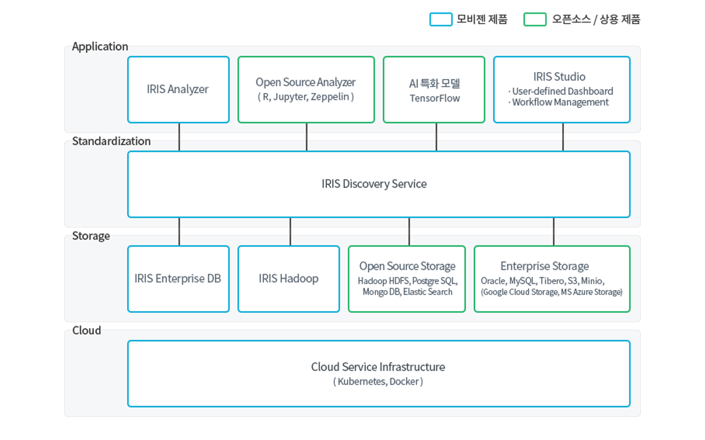

IRIS Big Data Platform
======================

| IRIS Big Data Platform 이하 IRIS는 클라우드 기반의 지능형 빅데이터 플랫폼으로써 빅데이터의 수집, 저장, 가공, 분산처리, 분석, 시각화, 공유를 통합적으로 지원하는 ‘빅데이터 End to End 처리 플랫폼’입니다.
| 빅데이터 파이프라인에 해당하는 ‘수집-저장-분석-시각화-공유’ 모든 과정을 통합하고 있으며, 빅데이터 분석 및 시각화를 가능하게 합니다.
| 또한, IRIS는 쿠버네티스 기반의 클라우드 서비스 인프라를 제공하여 대용량 데이터의 실시간 처리와 검색에 특화된 레이어 구성과 오픈소스 >및 상용 DB와의 호환으로 데이터 배치처리에 특화된 스토리지를 제공합니다.
| 다양한 스토리지에 저장된 데이터 모델을 통해 직접 접근하여 개발자의 도움 없이 데이터 탐색/분석 환경을 제공합니다.
| 탐색된 데이터를 오픈소스 분석도구를 통해 바로 분석이 가능한 환경을 제공하며, 텐서플로우 기반의 AI 개발환경을 제공하여 개발된 AI 모델>을 대시보드에 적용할 수 있도록 구성되어 있습니다. 또한, 사용자 정의 대시보드를 통해 DIY(Do It Yourself)방식의 빅데이터 분석 화면 제작이
 가능합니다.

.. toctree::
    :maxdepth: 8
    :hidden:

    IRIS-Web-Platform/IRIS-Web-Platform.rst
    IRIS-Discovery/IRIS-Discovery.rst
    IRIS-Studio/IRIS-Studio.rst
    IRIS-Analyzer/IRIS-Analyzer.rst
    IRIS-Map-Analyzer/IRIS-Map-Analyzer.rst
    IRIS-Discovery-Middleware/IRIS-Discovery-Middleware.rst
    IRIS-Database/IRIS-Database.rst
    IRIS-Data-Engine/index.rst